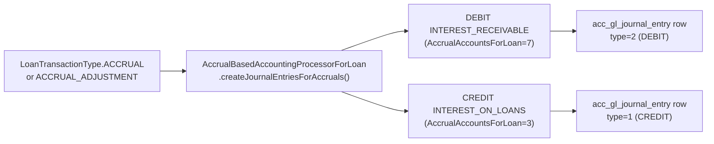
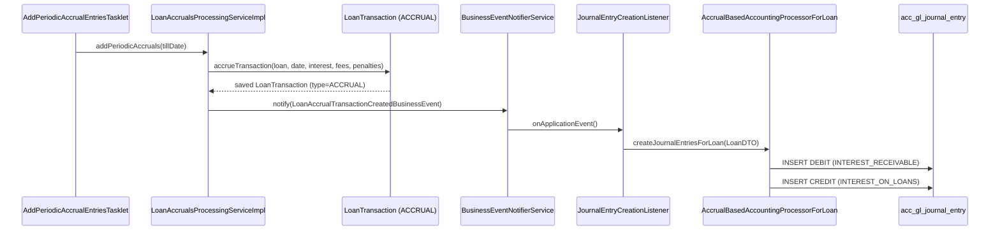

Accrual accounting in Fineract recognises income (interest, fees, penalties) when it is **earned** rather than when cash is received. This is fundamental to IFRS-compliant financial reporting. Fineract supports two accrual strategies — **periodic** and **upfront** — plus a specialised mode called **Income Posted as Transactions (IPA)**. All are driven by `AccountingRuleType`, a set of Spring Batch jobs, and the `LoanAccrualsProcessingService`. This page documents the full implementation from loan product configuration through to GL journal entry posting.

---

## File Inventory

| Concern | Path |
|---|---|
| `AccountingRuleType` enum | `fineract-core/.../accounting/common/AccountingRuleType.java` |
| `AccrualAccountingApiResource` (REST) | `fineract-accounting/.../accrual/api/AccrualAccountingApiResource.java` |
| `AccrualAccountingConstants` | `fineract-accounting/.../accrual/api/AccrualAccountingConstants.java` |
| `AccrualAccountingDataValidator` | `fineract-accounting/.../accrual/serialization/AccrualAccountingDataValidator.java` |
| `AccrualAccountingWritePlatformService` (interface) | `fineract-accounting/.../accrual/service/AccrualAccountingWritePlatformService.java` |
| `AccrualAccountingWritePlatformServiceImpl` | `fineract-provider/.../accounting/accrual/service/AccrualAccountingWritePlatformServiceImpl.java` |
| `ExecutePeriodicAccrualCommandHandler` | `fineract-accounting/.../accrual/handler/ExecutePeriodicAccrualCommandHandler.java` |
| `AccountingAccrualConfiguration` (Spring) | `fineract-provider/.../accounting/accrual/starter/AccountingAccrualConfiguration.java` |
| `LoanAccrualsProcessingService` (interface) | `fineract-loan/.../loanaccount/service/LoanAccrualsProcessingService.java` |
| `LoanAccrualsProcessingServiceImpl` | `fineract-provider/.../loanaccount/service/LoanAccrualsProcessingServiceImpl.java` |
| `LoanAccrualActivityProcessingService` (interface) | `fineract-loan/.../loanaccount/service/LoanAccrualActivityProcessingService.java` |
| `AddAccrualEntriesTasklet` (batch) | `fineract-provider/.../loanaccount/jobs/addaccrualentries/AddAccrualEntriesTasklet.java` |
| `AddAccrualEntriesConfig` (batch config) | `fineract-provider/.../loanaccount/jobs/addaccrualentries/AddAccrualEntriesConfig.java` |
| `AddPeriodicAccrualEntriesTasklet` (batch) | `fineract-loan/.../loanaccount/jobs/addperiodicaccrualentries/AddPeriodicAccrualEntriesTasklet.java` |
| `AddPeriodicAccrualEntriesConfig` (batch config) | `fineract-loan/.../loanaccount/jobs/addperiodicaccrualentries/AddPeriodicAccrualEntriesConfig.java` |
| `AddPeriodicAccrualEntriesForLoansTasklet` (IPA, batch) | `fineract-provider/.../loanaccount/jobs/addperiodicaccrualentriesforloanswithincomepostedastransactions/AddPeriodicAccrualEntriesForLoansTasklet.java` |
| `AccrualActivityPostingTasklet` (batch) | `fineract-provider/.../loanaccount/jobs/accrualactivityposting/AccrualActivityPostingTasklet.java` |
| `AccrualActivityPostingConfig` (batch config) | `fineract-provider/.../loanaccount/jobs/accrualactivityposting/AccrualActivityPostingConfig.java` |
| `AccrualBasedAccountingProcessorForLoan` | `fineract-provider/.../accounting/journalentry/service/AccrualBasedAccountingProcessorForLoan.java` |
| `AccrualBasedAccountingProcessorForSavings` | `fineract-provider/.../accounting/journalentry/service/AccrualBasedAccountingProcessorForSavings.java` |
| `AccountsForLoan` enum constants (accrual) | `fineract-core/.../accounting/common/AccountingConstants.AccrualAccountsForLoan` |
| `LoanAccrualActivityRepository` | `fineract-loan/.../loanaccount/domain/LoanAccrualActivityRepository.java` |

---

## AccountingRuleType Enum

**Class:** `org.apache.fineract.accounting.common.AccountingRuleType`

| Constant | Integer Value | i18n Code | Accrual? |
|---|---|---|---|
| `NONE` | `1` | `accountingRuleType.none` | No GL entries at all |
| `CASH_BASED` | `2` | `accountingRuleType.cash` | Cash on receipt only |
| `ACCRUAL_PERIODIC` | `3` | `accountingRuleType.accrual.periodic` | ✅ Periodic — income recognised over time |
| `ACCRUAL_UPFRONT` | `4` | `accountingRuleType.accrual.upfront` | ✅ Upfront — all income recognised at disbursement |

Conversion: `AccountingRuleType.fromInt(Integer)` returns the matching constant.  
Loan products store this as `loan_transaction_strategy_code` indirectly — the value is stored in the loan product and surfaced via `LoanDTO.isPeriodicAccrualBasedAccountingEnabled()` and `LoanDTO.isUpfrontAccrualBasedAccountingEnabled()`.

---

## What Accrual Means in Fineract

<Info>
In accrual accounting, when interest accrues on day N, Fineract creates a `LoanTransaction` of type `ACCRUAL` (or `ACCRUAL_ADJUSTMENT`). `AccrualBasedAccountingProcessorForLoan.createJournalEntriesForAccruals()` then posts:

- **DEBIT** `INTEREST_RECEIVABLE` (`AccrualAccountsForLoan.INTEREST_RECEIVABLE = 7`)
- **CREDIT** `INTEREST_ON_LOANS` (`AccrualAccountsForLoan.INTEREST_ON_LOANS = 3`)

When the borrower later repays that interest, the processor posts:

- **DEBIT** `FUND_SOURCE` (`AccrualAccountsForLoan.FUND_SOURCE = 1`)
- **CREDIT** `INTEREST_RECEIVABLE` (`AccrualAccountsForLoan.INTEREST_RECEIVABLE = 7`)

For fees and penalties, the receivable accounts are `FEES_RECEIVABLE (8)` and `PENALTIES_RECEIVABLE (9)` respectively.
</Info>

### Upfront vs Periodic

| Aspect | Upfront (`ACCRUAL_UPFRONT = 4`) | Periodic (`ACCRUAL_PERIODIC = 3`) |
|---|---|---|
| When accrual runs | At disbursement — all future interest recognised immediately | Via scheduled batch jobs — daily/periodic recognition |
| `LoanTransactionType` | `ACCRUAL` created at disbursal | `ACCRUAL` created per period by batch |
| Batch job needed | No (accruals are part of disbursement event) | Yes — `ADD_PERIODIC_ACCRUAL_ENTRIES` or `ADD_ACCRUAL_ENTRIES` |
| Interest receivable usage | Large initial receivable balance | Small daily increments |
| Processor class | `AccrualBasedAccountingProcessorForLoan` (same) | `AccrualBasedAccountingProcessorForLoan` (same) |

---

## AccrualAccountingApiResource (Manual Trigger)

**Base path:** `/v1/runaccruals`  
**Class:** `org.apache.fineract.accounting.accrual.api.AccrualAccountingApiResource`  
**Tag:** `"Periodic Accrual Accounting"`

| Method | Path | Description |
|---|---|---|
| `POST` | `/v1/runaccruals` | Executes periodic accrual accounting up to the specified date |

### Request Body

| Field | Type | Required | Notes |
|---|---|---|---|
| `tillDate` | String | ✅ | Date up to which accruals should be calculated |
| `locale` | String | ✅ | e.g. `"en"` |
| `dateFormat` | String | ✅ | e.g. `"dd MMMM yyyy"` |

Constant: `AccrualAccountingConstants.ACCRUE_TILL_PARAM_NAME = "tillDate"`

### Command Handler Chain

```
POST /v1/runaccruals
  → AccrualAccountingApiResource.executePeriodicAccrualAccounting()
  → CommandWrapperBuilder.excuteAccrualAccounting() [sic — typo in source]
  → ExecutePeriodicAccrualCommandHandler (@CommandType entity="PERIODICACCRUALACCOUNTING", action="EXECUTE")
  → AccrualAccountingWritePlatformServiceImpl.executeLoansPeriodicAccrual(command)
  → LoanAccrualsProcessingService.addPeriodicAccruals(tillDate)
```

---

## AccrualAccountingWritePlatformService

**Interface:** `org.apache.fineract.accounting.accrual.service.AccrualAccountingWritePlatformService`  
**Method:** `executeLoansPeriodicAccrual(JsonCommand command): CommandProcessingResult`

**Impl:** `AccrualAccountingWritePlatformServiceImpl`

1. Calls `AccrualAccountingDataValidator.validateLoanPeriodicAccrualData(json)` — validates `tillDate`, `locale`, `dateFormat` fields; rejects unsupported parameters.
2. Extracts `tillDate = command.localDateValueOfParameterNamed(ACCRUE_TILL_PARAM_NAME)`.
3. Calls `loanAccrualsProcessingService.addPeriodicAccruals(tillDate)`.
4. On `MultiException`, wraps all individual loan errors into a `PlatformApiDataValidationException` with code `execution.failed`.

---

## LoanAccrualsProcessingService Interface

**Interface:** `org.apache.fineract.portfolio.loanaccount.service.LoanAccrualsProcessingService`  
**Impl:** `LoanAccrualsProcessingServiceImpl` (fineract-provider module)

| Method | Description |
|---|---|
| `addPeriodicAccruals(LocalDate tillDate)` | Accrue all loans with `ACCRUAL_PERIODIC` accounting up to `tillDate`; used by both `AddPeriodicAccrualEntriesTasklet` and `AccrualAccountingWritePlatformServiceImpl` |
| `addPeriodicAccruals(LocalDate tillDate, Loan loan)` | Single-loan overload |
| `addAccruals(LocalDate tillDate)` | Accrue for **upfront** accrual loans (used by `AddAccrualEntriesTasklet`) |
| `reprocessExistingAccruals(Loan loan, boolean addEvent)` | Recalculate existing accruals on a loan (called after interest recalculation) |
| `processAccrualsOnInterestRecalculation(Loan loan, boolean isInterestRecalculationEnabled, boolean addJournal)` | Called after loan repayment when interest recalculation is active |
| `addIncomePostingAndAccruals(Long loanId)` | IPA: adds income posting transaction + accrual for a specific loan |
| `processIncomePostingAndAccruals(Loan loan, boolean addEvent)` | IPA: in-memory variant |
| `processAccrualsOnLoanClosure(Loan loan, boolean addJournal)` | Final accrual at loan close/write-off |
| `processAccrualsOnLoanForeClosure(Loan loan, LocalDate foreClosureDate, List<LoanTransaction> newAccrualTransactions)` | Accrual at foreclosure |

The impl uses `LoanTransactionType.ACCRUAL` and `LoanTransactionType.ACCRUAL_ADJUSTMENT` for `LoanTransaction` creation, and fires `LoanAccrualTransactionCreatedBusinessEvent` and `LoanAccrualAdjustmentTransactionBusinessEvent` via `BusinessEventNotifierService`.

---

## Batch Jobs — Complete Reference

<CardGroup cols={2}>
  <Card title="ADD_ACCRUAL_ENTRIES" icon="clock">
    **Job Name:** `"Add Accrual Transactions"`  
    **Tasklet:** `AddAccrualEntriesTasklet`  
    **Config:** `AddAccrualEntriesConfig`  
    **Path:** `fineract-provider/.../loanaccount/jobs/addaccrualentries/`

    Calls `loanAccrualsProcessingService.addAccruals(DateUtils.getBusinessLocalDate())`.

    **Target:** Loans with `ACCRUAL_UPFRONT` (type 4) accounting.
  </Card>
  <Card title="ADD_PERIODIC_ACCRUAL_ENTRIES" icon="rotate">
    **Job Name:** `"Add Periodic Accrual Transactions"`  
    **Tasklet:** `AddPeriodicAccrualEntriesTasklet`  
    **Config:** `AddPeriodicAccrualEntriesConfig`  
    **Path:** `fineract-loan/.../loanaccount/jobs/addperiodicaccrualentries/`

    Calls `loanAccrualsProcessingService.addPeriodicAccruals(DateUtils.getBusinessLocalDate())`.

    **Target:** Loans with `ACCRUAL_PERIODIC` (type 3) accounting.
  </Card>
  <Card title="ADD_PERIODIC_ACCRUAL_ENTRIES_FOR_LOANS_WITH_INCOME_POSTED_AS_TRANSACTIONS" icon="money-bill">
    **Job Name:** `"Add Accrual Transactions For Loans With Income Posted As Transactions"`  
    **Tasklet:** `AddPeriodicAccrualEntriesForLoansTasklet`  
    **Path:** `fineract-provider/.../loanaccount/jobs/addperiodicaccrualentriesforloanswithincomepostedastransactions/`

    Retrieves loan IDs via `LoanReadPlatformService.retrieveLoanIdsWithPendingIncomePostingTransactions()`, then calls `loanAccrualsProcessingService.addIncomePostingAndAccruals(loanId)` for each.

    **Target:** IPA loans (income posted as transactions mode).
  </Card>
  <Card title="ACCRUAL_ACTIVITY_POSTING" icon="chart-line">
    **Job Name:** `"Accrual Activity Posting"`  
    **Tasklet:** `AccrualActivityPostingTasklet`  
    **Config:** `AccrualActivityPostingConfig`  
    **Path:** `fineract-provider/.../loanaccount/jobs/accrualactivityposting/`

    Queries `LoanAccrualActivityRepository.fetchLoanIdsForAccrualActivityPosting(yesterday, ACCRUAL_ACTIVITY, ACTIVE)`, then calls `LoanAccrualActivityProcessingService.makeAccrualActivityTransaction(accountId, yesterday)` for each.

    Runs on **yesterday's** date to post all accrual activity transactions that accumulated the prior day.
  </Card>
</CardGroup>

### Batch Job Error Handling

All four tasklets collect errors per loan into a `List<Throwable>` and throw a `JobExecutionException(errors)` at the end. Individual loan failures do **not** abort the entire batch run — all loans are attempted before errors are surfaced.

---

## AccrualBasedAccountingProcessorForLoan

**Class:** `org.apache.fineract.accounting.journalentry.service.AccrualBasedAccountingProcessorForLoan`

This is the GL posting engine for accrual-based loans. It extends the logic of cash-based processing by adding:

```java
// Handle Accruals
if (transactionType.isAccrual() || transactionType.isAccrualAdjustment()) {
    createJournalEntriesForAccruals(loanDTO, loanTransactionDTO, office);
}
```

### Accrual GL Posting Pattern



For **fee/penalty accruals**:

| Component | Debit Account | Credit Account |
|---|---|---|
| Interest | `INTEREST_RECEIVABLE (7)` | `INTEREST_ON_LOANS (3)` |
| Fees | `FEES_RECEIVABLE (8)` | `INCOME_FROM_FEES (4)` |
| Penalties | `PENALTIES_RECEIVABLE (9)` | `INCOME_FROM_PENALTIES (5)` |

### Full Accrual-Period Flow



---

## Income Posted as Transactions (IPA)

IPA is a specialised sub-mode of `ACCRUAL_PERIODIC` where income is also created as an explicit `LoanTransaction` of type `INCOME_POSTING`. This allows income to appear on the client's loan statement as a visible transaction.

### IPA Workflow

<Steps>
  <Step title="Identify pending IPA loans">
    `LoanReadPlatformService.retrieveLoanIdsWithPendingIncomePostingTransactions()` returns loans where the next income posting date has passed.
  </Step>
  <Step title="Add income posting and accruals">
    `LoanAccrualsProcessingService.addIncomePostingAndAccruals(loanId)` creates:
    - A `LoanTransaction` of type `INCOME_POSTING`
    - A `LoanTransaction` of type `ACCRUAL` for the same period
  </Step>
  <Step title="GL entries for INCOME_POSTING">
    `AccrualBasedAccountingProcessorForLoan` processes `INCOME_POSTING` by posting:
    - **DEBIT** `INTEREST_RECEIVABLE`
    - **CREDIT** `INTEREST_ON_LOANS`
  </Step>
</Steps>

**Tasklet:** `AddPeriodicAccrualEntriesForLoansTasklet`  
**Job name constant:** `JobName.ADD_PERIODIC_ACCRUAL_ENTRIES_FOR_LOANS_WITH_INCOME_POSTED_AS_TRANSACTIONS`  
**Full string:** `"Add Accrual Transactions For Loans With Income Posted As Transactions"`

---

## Accrual Activity Posting (AccrualActivityPostingTasklet)

`AccrualActivityPostingTasklet` handles `LoanTransactionType.ACCRUAL_ACTIVITY` transactions — a distinct transaction type used for capital-based accrual summaries.

The tasklet:
1. Fetches loan IDs from `LoanAccrualActivityRepository.fetchLoanIdsForAccrualActivityPosting(yesterday, ACCRUAL_ACTIVITY, ACTIVE)`.
2. For each loan, calls `LoanAccrualActivityProcessingService.makeAccrualActivityTransaction(accountId, yesterday)`.
3. Collects errors; throws `JobExecutionException` if any loans failed.

`LoanAccrualActivityProcessingService` (interface, `fineract-loan`) methods:

| Method | Description |
|---|---|
| `makeAccrualActivityTransaction(Long loanId, LocalDate currentDate)` | Transactional — creates ACCRUAL_ACTIVITY LoanTransaction for yesterday |
| `makeAccrualActivityTransaction(Loan loan, LocalDate currentDate)` | In-memory variant (no new TX boundary) |
| `recalculateAccrualActivityTransaction(Loan, ChangedTransactionDetail)` | Recalculates after repayment changes |
| `processAccrualActivityForLoanClosure(Loan loan)` | Final ACCRUAL_ACTIVITY at close |
| `processAccrualActivityForLoanReopen(Loan loan)` | Reverses closure ACCRUAL_ACTIVITY |

---

## Loan Product Accounting Configuration for Accruals

When creating or updating a loan product, the `accountingRule` field controls which mode is active:

```json
{
  "accountingRule": 3,
  "interestOnLoanAccountId": 101,
  "loanPortfolioAccountId": 102,
  "fundSourceAccountId": 103,
  "receivableInterestAccountId": 104,
  "receivableFeeAccountId": 105,
  "receivablePenaltyAccountId": 106,
  "incomeFromFeeAccountId": 107,
  "incomeFromPenaltyAccountId": 108
}
```

For `accountingRule=3` (`ACCRUAL_PERIODIC`) or `accountingRule=4` (`ACCRUAL_UPFRONT`), the additional receivable accounts are mandatory and are stored as `ProductToGLAccountMapping` rows with `financialAccountType` values from `AccrualAccountsForLoan`:

| `LoanProductAccountingParams` JSON Key | `AccrualAccountsForLoan` Constant | Int |
|---|---|---|
| `receivableInterestAccountId` | `INTEREST_RECEIVABLE` | `7` |
| `receivableFeeAccountId` | `FEES_RECEIVABLE` | `8` |
| `receivablePenaltyAccountId` | `PENALTIES_RECEIVABLE` | `9` |
| `deferredIncomeLiabilityAccountId` | `DEFERRED_INCOME_LIABILITY` | `23` |
| `incomeFromCapitalizationAccountId` | `INCOME_FROM_CAPITALIZATION` | `22` |
| `buyDownExpenseAccountId` | `BUY_DOWN_EXPENSE` | `24` |
| `incomeFromBuyDownAccountId` | `INCOME_FROM_BUY_DOWN` | `25` |

---

## AccrualBasedAccountingProcessorForSavings

**Class:** `org.apache.fineract.accounting.journalentry.service.AccrualBasedAccountingProcessorForSavings`

Savings products can also use accrual accounting. When the savings accounting type is `ACCRUAL_PERIODIC`, the processor handles `SavingsTransactionDTO` events with accrual types by posting:
- **DEBIT** `INTEREST_PAYABLE` (liability — money owed to the depositor)
- **CREDIT** `INTEREST_ON_SAVINGS` (expense)

Selected by `AccountingProcessorForSavingsFactory` based on `SavingsDTO.isAccrualBasedAccountingEnabled()`.

---

## AccrualAccountsForLoan Reference

Complete integer mapping from `AccountingConstants.AccrualAccountsForLoan`:

| Constant | Int | Used For |
|---|---|---|
| `FUND_SOURCE` | `1` | Source of disbursement funds |
| `LOAN_PORTFOLIO` | `2` | Principal receivable |
| `INTEREST_ON_LOANS` | `3` | Income from interest |
| `INCOME_FROM_FEES` | `4` | Income from fees |
| `INCOME_FROM_PENALTIES` | `5` | Income from penalties |
| `LOSSES_WRITTEN_OFF` | `6` | Write-off expense |
| `INTEREST_RECEIVABLE` | `7` | Accrued interest not yet received |
| `FEES_RECEIVABLE` | `8` | Accrued fees not yet received |
| `PENALTIES_RECEIVABLE` | `9` | Accrued penalties not yet received |
| `TRANSFERS_SUSPENSE` | `10` | Inter-office transfer suspense |
| `OVERPAYMENT` | `11` | Overpayment liability |
| `INCOME_FROM_RECOVERY` | `12` | Recovery income after write-off |
| `GOODWILL_CREDIT` | `13` | Goodwill credit expense |
| `INCOME_FROM_CHARGE_OFF_INTEREST` | `14` | Interest income post charge-off |
| `INCOME_FROM_CHARGE_OFF_FEES` | `15` | Fee income post charge-off |
| `CHARGE_OFF_EXPENSE` | `16` | Charge-off expense |
| `CHARGE_OFF_FRAUD_EXPENSE` | `17` | Fraud-related charge-off expense |
| `INCOME_FROM_CHARGE_OFF_PENALTY` | `18` | Penalty income post charge-off |
| `INCOME_FROM_GOODWILL_CREDIT_INTEREST` | `19` | Goodwill credit interest income |
| `INCOME_FROM_GOODWILL_CREDIT_FEES` | `20` | Goodwill credit fee income |
| `INCOME_FROM_GOODWILL_CREDIT_PENALTY` | `21` | Goodwill credit penalty income |
| `INCOME_FROM_CAPITALIZATION` | `22` | Capitalised income |
| `DEFERRED_INCOME_LIABILITY` | `23` | Deferred income liability |
| `BUY_DOWN_EXPENSE` | `24` | Merchant buy-down expense |
| `INCOME_FROM_BUY_DOWN` | `25` | Income from merchant buy-down |

---

## Connections to Other Subsystems

- **`AccountingProcessorForLoanFactory`:** Selects `AccrualBasedAccountingProcessorForLoan` when `LoanDTO.isUpfrontAccrualBasedAccountingEnabled()` or `isPeriodicAccrualBasedAccountingEnabled()` returns `true`. Both map to the same processor class.
- **`ProductToGLAccountMappingRepository`:** `AccrualBasedAccountingProcessorForLoan` calls `helper.getGLAccountById(productId, productType, INTEREST_RECEIVABLE, paymentTypeId)` (and similarly for fees/penalties receivable) to resolve the correct `acc_gl_account` for accrual entries.
- **`LoanTransaction` types:** `LoanTransactionType.ACCRUAL` and `LoanTransactionType.ACCRUAL_ADJUSTMENT` are the triggers checked by `transactionType.isAccrual()` and `transactionType.isAccrualAdjustment()` in the processor.
- **`BusinessEventNotifierService`:** Fires `LoanAccrualTransactionCreatedBusinessEvent` (and the adjustment variant) when a new accrual transaction is saved, which triggers the accounting processor listener.
- **GL Closures:** `AccountingProcessorHelper.checkForBranchClosures()` guards accrual posting exactly as it does for cash-based entries — a branch closure before the accrual date blocks posting.

---

## Gotchas & Invariants

<Accordion title="ACCRUAL_UPFRONT uses addAccruals(), not addPeriodicAccruals()">
The `ADD_ACCRUAL_ENTRIES` job (which calls `addAccruals()`) targets **upfront** accrual loans. The `ADD_PERIODIC_ACCRUAL_ENTRIES` job (calling `addPeriodicAccruals()`) targets **periodic** accrual loans. Running the wrong job for the wrong product type is a no-op per-loan but can cause missed accruals. Check `AccountingProcessorForLoanFactory.determineProcessor()` to understand which processor fires.
</Accordion>

<Accordion title="Accrual transactions must balance before repayment clears them">
When a repayment arrives for an accrual-basis loan, `AccrualBasedAccountingProcessorForLoan.createJournalEntriesForRepayments()` credits `INTEREST_RECEIVABLE` (clearing the accrued balance) and debits `FUND_SOURCE`. If the INTEREST_RECEIVABLE account has no prior accrual debit (e.g., product was mis-configured), the repayment will still post but the receivable account will go negative.
</Accordion>

<Accordion title="AccrualActivityPostingTasklet posts yesterday's date">
The `ACCRUAL_ACTIVITY_POSTING` job uses `DateUtils.getBusinessLocalDate().minusDays(1)` as the posting date. It is designed to run early in the morning to close out the previous business day's accrual activity. Scheduling it mid-day risks missing the prior day if the business date has already advanced.
</Accordion>

<Accordion title="MultiException collects all errors before throwing">
`LoanAccrualsProcessingServiceImpl.addPeriodicAccruals()` processes all matching loans, collects errors in a `List<Throwable>`, and throws `MultiException` at the end. This means a single bad loan does not abort processing for others. The API response via `AccrualAccountingWritePlatformServiceImpl` translates this into a `PlatformApiDataValidationException` with code `periodicaccrual.execution.failed`.
</Accordion>

<Accordion title="IPA requires a separate batch job">
IPA loans need both `ADD_PERIODIC_ACCRUAL_ENTRIES_FOR_LOANS_WITH_INCOME_POSTED_AS_TRANSACTIONS` **and** standard periodic accrual entries. If only the standard periodic job runs, IPA income posting transactions are never created, and the client's statement will not show income items.
</Accordion>
