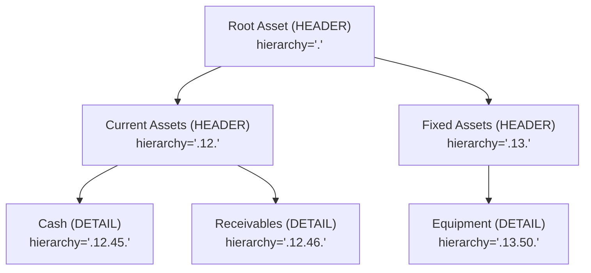
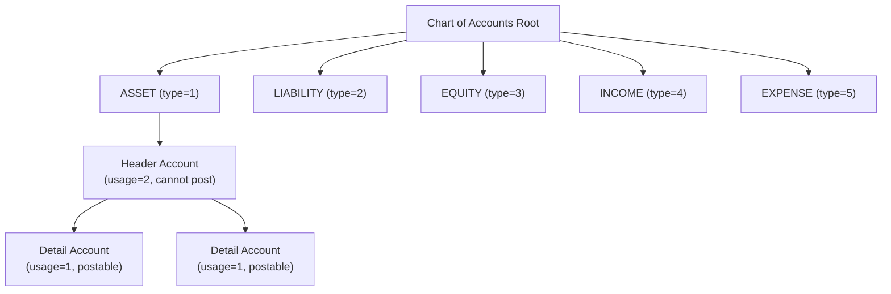

Apache Fineract's general ledger (GL) layer is the single source of financial truth for every branch and product. The **Chart of Accounts (COA)** is modelled as a recursive parent-child hierarchy stored in `acc_gl_account`, and every monetary event in the system ultimately posts a `JournalEntry` row against one of these accounts. This page covers the full entity model, enum codes, REST API surface, product-mapping strategy, accounting rules for manual entries, and the two batch jobs that maintain running and trial balances.

---

## File Inventory

| Concern | Path |
|---|---|
| `GLAccount` entity | `fineract-core/.../accounting/glaccount/domain/GLAccount.java` |
| `GLAccountType` enum | `fineract-core/.../accounting/glaccount/domain/GLAccountType.java` |
| `GLAccountUsage` enum | `fineract-core/.../accounting/glaccount/domain/GLAccountUsage.java` |
| `GLAccountJsonInputParams` | `fineract-core/.../accounting/glaccount/api/GLAccountJsonInputParams.java` |
| `GLAccountData` (DTO) | `fineract-core/.../accounting/glaccount/data/GLAccountData.java` |
| `GLAccountRepository` | `fineract-core/.../accounting/glaccount/domain/GLAccountRepository.java` |
| `GLAccountRepositoryWrapper` | `fineract-core/.../accounting/glaccount/domain/GLAccountRepositoryWrapper.java` |
| `GLAccountReadPlatformService` (interface) | `fineract-accounting/.../glaccount/service/GLAccountReadPlatformService.java` |
| `GLAccountReadPlatformServiceImpl` | `fineract-accounting/.../glaccount/service/GLAccountReadPlatformServiceImpl.java` |
| `GLAccountWritePlatformService` | `fineract-accounting/.../glaccount/service/GLAccountWritePlatformService.java` |
| `GLAccountWritePlatformServiceJpaRepositoryImpl` | `fineract-accounting/.../glaccount/service/GLAccountWritePlatformServiceJpaRepositoryImpl.java` |
| `GLAccountsApiResource` (REST) | `fineract-accounting/.../glaccount/api/GLAccountsApiResource.java` |
| `GLAccountCommand` | `fineract-accounting/.../glaccount/command/GLAccountCommand.java` |
| `TrialBalance` entity | `fineract-accounting/.../glaccount/domain/TrialBalance.java` |
| `TrialBalanceRepository` | `fineract-accounting/.../glaccount/domain/TrialBalanceRepository.java` |
| `UpdateTrialBalanceDetailsTasklet` (batch) | `fineract-accounting/.../glaccount/jobs/updatetrialbalancedetails/UpdateTrialBalanceDetailsTasklet.java` |
| `AccountRunningBalanceUpdateTasklet` (batch) | `fineract-provider/.../accounting/jobs/accountrunningbalanceupdate/AccountRunningBalanceUpdateTasklet.java` |
| `JournalEntryRunningBalanceUpdateServiceImpl` | `fineract-provider/.../accounting/journalentry/service/JournalEntryRunningBalanceUpdateServiceImpl.java` |
| `ProductToGLAccountMapping` entity | `fineract-accounting/.../producttoaccountmapping/domain/ProductToGLAccountMapping.java` |
| `ProductToGLAccountMappingRepository` | `fineract-accounting/.../producttoaccountmapping/domain/ProductToGLAccountMappingRepository.java` |
| `ProductToGLAccountMappingHelper` | `fineract-accounting/.../producttoaccountmapping/service/ProductToGLAccountMappingHelper.java` |
| `SavingsProductToGLAccountMappingHelper` | `fineract-accounting/.../producttoaccountmapping/service/SavingsProductToGLAccountMappingHelper.java` |
| `AccountingRule` entity | `fineract-accounting/.../rule/domain/AccountingRule.java` |
| `AccountingTagRule` entity | `fineract-accounting/.../rule/domain/AccountingTagRule.java` |
| `AccountingRuleApiResource` (REST) | `fineract-accounting/.../rule/api/AccountingRuleApiResource.java` |
| `AccountingConstants` | `fineract-core/.../accounting/common/AccountingConstants.java` |

---

## GLAccount Entity

**Table:** `acc_gl_account`  
**Class:** `org.apache.fineract.accounting.glaccount.domain.GLAccount`  
**Superclass:** `AbstractPersistableCustom<Long>` (provides `id`)

### Field Reference

| Field (Java) | Column | Type | Notes |
|---|---|---|---|
| `name` | `name` | `VARCHAR(45) NOT NULL` | Human-readable name |
| `glCode` | `gl_code` | `VARCHAR(100) NOT NULL` | Unique code; `acc_gl_code` unique constraint |
| `type` | `classification_enum` | `INT NOT NULL` | Integer value of `GLAccountType` |
| `usage` | `account_usage` | `INT NOT NULL` | Integer value of `GLAccountUsage` |
| `disabled` | `disabled` | `BOOLEAN NOT NULL` | Soft-delete flag; disabled accounts are excluded from dropdowns |
| `manualEntriesAllowed` | `manual_journal_entries_allowed` | `BOOLEAN NOT NULL` | Default `true`; governs manual JE creation |
| `description` | `description` | `VARCHAR(500)` | Optional free text |
| `parent` | `parent_id` | FK → `acc_gl_account` | `null` for root accounts |
| `hierarchy` | `hierarchy` | `VARCHAR(50)` | Materialized path string (e.g. `.12.45.`) for efficient tree queries |
| `children` | (OneToMany on `parent_id`) | List | Lazy-loaded child accounts |
| `tagId` | `tag_id` | FK → `m_code_value` | Optional tag from code-value set |

### Invariants

<Warning>
A `HEADER` account (`usage=2`) cannot receive direct journal entries — `isHeaderAccount()` returns `true` and the write service rejects JE attempts. Only `DETAIL` accounts (`usage=1`) are valid posting targets.
</Warning>

<Note>
`hierarchy` is generated by `generateHierarchy()` every time the account is saved. Root accounts get `.`, and children get `parentHierarchy + id + "."`. Subtree queries use `LIKE hierarchy%`.
</Note>

---

## GLAccountType Enum

**Class:** `org.apache.fineract.accounting.glaccount.domain.GLAccountType`

| Enum Constant | Integer Value | i18n Code |
|---|---|---|
| `ASSET` | `1` | `accountType.asset` |
| `LIABILITY` | `2` | `accountType.liability` |
| `EQUITY` | `3` | `accountType.equity` |
| `INCOME` | `4` | `accountType.income` |
| `EXPENSE` | `5` | `accountType.expense` |

Conversion helper: `GLAccountType.fromInt(Integer v)` returns `null` for unknown values.  
`GLAccountType.fromString(String)` accepts case-insensitive enum names and returns an `EnumOptionData`.

---

## GLAccountUsage Enum

**Class:** `org.apache.fineract.accounting.glaccount.domain.GLAccountUsage`

| Enum Constant | Integer Value | i18n Code | Purpose |
|---|---|---|---|
| `DETAIL` | `1` | `accountUsage.detail` | Leaf node — actual posting target |
| `HEADER` | `2` | `accountUsage.header` | Parent/grouping node only |

`GLAccount.isHeaderAccount()` compares `this.usage` to `GLAccountUsage.HEADER.getValue()`.  
`GLAccount.isDetailAccount()` checks `GLAccountUsage.DETAIL`.

---

## Chart of Accounts Hierarchy

The hierarchy is a **materialized path** pattern. Each account stores the full path from the root to itself in the `hierarchy` column.

- Assigning a `parentId` when creating an account builds the path via `generateHierarchy()`.
- The `GLAccountReadPlatformServiceImpl` uses `LIKE hierarchy + '%'` for subtree queries.
- The API template endpoint (`GET /v1/glaccounts/template?type=N`) returns per-type header accounts for the `parentId` dropdown.
- Deleting a parent account with active children throws `GLAccountInvalidDeleteException`.

---

## GLAccountsApiResource Endpoints

**Base path:** `/v1/glaccounts`  
**Class:** `org.apache.fineract.accounting.glaccount.api.GLAccountsApiResource`  
**Permission resource:** `GLACCOUNT`

| Method | Path | Description | Key Query Params |
|---|---|---|---|
| `GET` | `/v1/glaccounts/template` | Retrieve creation template with enum options | `type` (1–5) |
| `GET` | `/v1/glaccounts` | List all GL accounts | `type`, `searchParam`, `usage`, `manualEntriesAllowed`, `disabled`, `fetchRunningBalance` |
| `GET` | `/v1/glaccounts/{glAccountId}` | Retrieve single account | `fetchRunningBalance`, `template` |
| `POST` | `/v1/glaccounts` | Create account | Body: `GLAccountCommand` |
| `PUT` | `/v1/glaccounts/{glAccountId}` | Update account | Body: `GLAccountCommand` |
| `DELETE` | `/v1/glaccounts/{glAccountId}` | Delete account | — |
| `GET` | `/v1/glaccounts/downloadtemplate` | Download Excel bulk-import template | `dateFormat` |
| `POST` | `/v1/glaccounts/uploadtemplate` | Bulk-import from Excel | `file`, `locale`, `dateFormat` |

### Mandatory Create Fields
`name`, `glCode`, `type` (GLAccountType int), `usage` (GLAccountUsage int), `manualEntriesAllowed`

### Optional Fields
`parentId`, `description`, `disabled`, `tagId`

### fetchRunningBalance Behavior
When `fetchRunningBalance=true`, the read service joins against the `acc_gl_journal_entry` table to compute `organizationRunningBalance` and populates the `JournalEntryAssociationParametersData(false, true)` flag. This is an on-demand calculation — not a stored field.

---

## ProductToGLAccountMapping

**Table:** `acc_product_mapping`  
**Class:** `org.apache.fineract.accounting.producttoaccountmapping.domain.ProductToGLAccountMapping`  
**Unique Constraint:** `(product_id, product_type, financial_account_type, payment_type)` → named `financial_action`

| Field | Column | Notes |
|---|---|---|
| `glAccount` | `gl_account_id` | The target GL account |
| `productId` | `product_id` | ID of the loan/savings/share product |
| `productType` | `product_type` | `PortfolioProductType` int (1=LOAN, 2=SAVINGS, …) |
| `financialAccountType` | `financial_account_type` | Refers to `CashAccountsForLoan` or `AccrualAccountsForLoan` integer codes |
| `paymentType` | `payment_type` | FK → `m_payment_type`; used for payment-channel-specific fund source overrides |
| `charge` | `charge_id` | FK → `m_charge`; used for per-charge income account mappings |
| `chargeOffReason` | `charge_off_reason_id` | FK → `m_code_value`; charge-off reason to expense account override |
| `writeOffReason` | `write_off_reason_id` | FK → `m_code_value`; write-off reason to expense account override |
| `capitalizedIncomeClassification` | `capitalized_income_classification_id` | FK → `m_code_value` |
| `buydownFeeClassification` | `buydown_fee_classification_id` | FK → `m_code_value` |

### Key Constants: CashAccountsForLoan (AccountingConstants)
`FUND_SOURCE(1)`, `LOAN_PORTFOLIO(2)`, `INTEREST_ON_LOANS(3)`, `INCOME_FROM_FEES(4)`, `INCOME_FROM_PENALTIES(5)`, `LOSSES_WRITTEN_OFF(6)`, `TRANSFERS_SUSPENSE(10)`, `OVERPAYMENT(11)`, `INCOME_FROM_RECOVERY(12)`, `GOODWILL_CREDIT(13)`, `INCOME_FROM_CHARGE_OFF_INTEREST(14)`, `INCOME_FROM_CHARGE_OFF_FEES(15)`, `CHARGE_OFF_EXPENSE(16)`, `CHARGE_OFF_FRAUD_EXPENSE(17)`, `INCOME_FROM_CHARGE_OFF_PENALTY(18)`, `INCOME_FROM_GOODWILL_CREDIT_INTEREST(19)`, `INCOME_FROM_GOODWILL_CREDIT_FEES(20)`, `INCOME_FROM_GOODWILL_CREDIT_PENALTY(21)`, `CLASSIFICATION_INCOME(22)`, `DEFERRED_INCOME_LIABILITY(23)`, `INCOME_FROM_DISCOUNT_FEE(24)`, `FEES_RECEIVABLE(25)`, `PENALTIES_RECEIVABLE(26)`

### Key Constants: AccrualAccountsForLoan
All of the above plus: `INTEREST_RECEIVABLE(7)`, `FEES_RECEIVABLE(8)`, `PENALTIES_RECEIVABLE(9)`, `INCOME_FROM_CAPITALIZATION(22)`, `BUY_DOWN_EXPENSE(24)`, `INCOME_FROM_BUY_DOWN(25)`

Mapping helpers:
- `ProductToGLAccountMappingHelper` — loan products
- `SavingsProductToGLAccountMappingHelper` — savings products
- `ShareProductToGLAccountMappingHelper` — share products
- `WorkingCapitalLoanProductAdvancedAccountingReadHelper` — advanced working capital mappings

---

## Accounting Rules (Manual Journal Entry Abstraction)

**Table:** `acc_accounting_rule`  
**Class:** `org.apache.fineract.accounting.rule.domain.AccountingRule`  
**Unique Constraint:** `name` column

### AccountingRule Entity Fields

| Field | Column | Notes |
|---|---|---|
| `name` | `name` | `VARCHAR(500) NOT NULL`; globally unique |
| `office` | `office_id` | Optional — scopes rule to a specific branch |
| `accountToDebit` | `debit_account_id` | Pre-selected debit account (optional; null enables tag-based debit) |
| `accountToCredit` | `credit_account_id` | Pre-selected credit account (optional; null enables tag-based credit) |
| `description` | `description` | `VARCHAR(500)` |
| `systemDefined` | `system_defined` | `BOOLEAN`; system-defined rules cannot be deleted |
| `allowMultipleCreditEntries` | `allow_multiple_credits` | Only effective when `accountToCredit` is `null` |
| `allowMultipleDebitEntries` | `allow_multiple_debits` | Only effective when `accountToDebit` is `null` |
| `accountingTagRules` | (OneToMany → `AccountingTagRule`) | Eager-loaded tag-based account sets |

### AccountingTagRule Entity
**Class:** `org.apache.fineract.accounting.rule.domain.AccountingTagRule`  
Links a `CodeValue` tag to a `JournalEntryType` (CREDIT/DEBIT). When `accountToCredit` or `accountToDebit` is null, the user selects an account matching the allowed tag set at JE creation time.

### AccountingRuleApiResource Endpoints

**Base path:** `/v1/accountingrules`  
**Permission resource:** `ACCOUNTINGRULE`

| Method | Path | Description |
|---|---|---|
| `GET` | `/v1/accountingrules/template` | Template with allowed accounts and offices |
| `GET` | `/v1/accountingrules` | List all rules (scoped by office hierarchy) |
| `GET` | `/v1/accountingrules/{accountingRuleId}` | Get single rule; `?template=true` adds dropdown data |
| `POST` | `/v1/accountingrules` | Create rule (body: `AccountRuleRequest`) |
| `PUT` | `/v1/accountingrules/{accountingRuleId}` | Update rule |
| `DELETE` | `/v1/accountingrules/{accountingRuleId}` | Delete rule |

**Mandatory create fields:** `name`, `officeId`, and either `accountToDebit` **or** `debitTags`, and either `accountToCredit` **or** `creditTags`.

---

## Financial Activity Mappings

**Table:** `acc_gl_financial_activity_account`  
**Class:** `org.apache.fineract.accounting.financialactivityaccount.domain.FinancialActivityAccount`  
**API:** `FinancialActivityAccountsApiResource` at `/v1/financialactivityaccounts`

These map standard platform-level financial activities to specific GL accounts, consumed by `AccountingProcessorHelper` when an activity is triggered.

| Activity Enum | Int Value | Required GL Type |
|---|---|---|
| `ASSET_TRANSFER` | `100` | `ASSET` |
| `LIABILITY_TRANSFER` | `200` | `LIABILITY` |
| `CASH_AT_MAINVAULT` | `101` | `ASSET` |
| `CASH_AT_TELLER` | `102` | `ASSET` |
| `OPENING_BALANCES_TRANSFER_CONTRA` | `300` | `EQUITY` |
| `ASSET_FUND_SOURCE` | `103` | `ASSET` |
| `PAYABLE_DIVIDENDS` | `201` | `LIABILITY` |

---

## Running Balance & Trial Balance Infrastructure

<CardGroup cols={2}>
  <Card title="AccountRunningBalanceUpdateTasklet" icon="calculator">
    **Path:** `fineract-provider/.../accounting/jobs/accountrunningbalanceupdate/AccountRunningBalanceUpdateTasklet.java`

    Spring Batch tasklet that calls `JournalEntryRunningBalanceUpdateService.updateRunningBalance()`. Reads all journal entries ordered by date, recomputes debit/credit running balances per account per office, and stores results for quick retrieval.
  </Card>
  <Card title="UpdateTrialBalanceDetailsTasklet" icon="table">
    **Path:** `fineract-accounting/.../glaccount/jobs/updatetrialbalancedetails/UpdateTrialBalanceDetailsTasklet.java`

    Fills gaps in the `m_trial_balance` table and updates `closing_balance` per account per office. Uses `JournalEntryRepository.findTransactionDatesAfter()` to find new date gaps and `TrialBalanceRepository` to persist aggregated rows.
  </Card>
</CardGroup>

### TrialBalance Entity

**Table:** `m_trial_balance`  
**Class:** `org.apache.fineract.accounting.glaccount.domain.TrialBalance`

| Field | Column | Description |
|---|---|---|
| `officeId` | `office_id` | Branch identifier |
| `glAccountId` | `account_id` | FK → `acc_gl_account` |
| `amount` | `amount` | Daily movement amount |
| `entryDate` | `entry_date` | Business date of the entries |
| `transactionDate` | `created_date` | Actual transaction date |
| `closingBalance` | `closing_balance` | Cumulative closing balance |

<Tip>
The `UpdateTrialBalanceDetailsTasklet` uses a baseline date of `2010-01-01` if `m_trial_balance` is empty, then processes all `entry_date` gaps found in `acc_gl_journal_entry`. It skips dates within 1 day of the current business date to avoid partial-day aggregation.
</Tip>

---

## Account Hierarchy Diagram

---

## Connections to Other Subsystems

- **Loan product configuration:** `LoanProduct` stores its accounting method flag; during product save, the `ProductToGLAccountMappingWritePlatformService` persists `acc_product_mapping` rows linking each `CashAccountsForLoan` / `AccrualAccountsForLoan` code to a `GLAccount`.
- **Journal entry creation:** `AccountingProcessorHelper` looks up `acc_product_mapping` via `ProductToGLAccountMappingRepository` and retrieves the `GLAccount` for each accounting event type.
- **GL Closures:** `GLClosure` (in `fineract-accounting/.../closure/domain/GLClosure.java`) blocks journal entries from being posted to closed periods. `AccountingProcessorHelper.checkForBranchClosures()` enforces this at posting time.
- **Bulk import:** `GlobalEntityType.CHART_OF_ACCOUNTS` drives Excel-based COA import via `BulkImportWorkbookService`.

---

## Gotchas & Invariants

<Accordion title="Cannot change type after journal entries exist">
`GLAccountWritePlatformServiceJpaRepositoryImpl` checks whether any `acc_gl_journal_entry` rows reference the account before allowing type/usage changes. Violation throws `GLAccountInvalidUpdateException`.
</Accordion>

<Accordion title="glCode uniqueness is database-enforced">
The unique constraint `acc_gl_code` on `gl_code` means duplicate GL codes raise a `GLAccountDuplicateException` from the handler before the DB constraint fires.
</Accordion>

<Accordion title="Header accounts cannot be parents of different types">
`GLAccountInvalidParentException` is thrown if the parent account's `classification_enum` does not match the child's type. Assets can only be parented by Asset-type headers.
</Accordion>

<Accordion title="Running balance is not real-time">
`organizationRunningBalance` from the API is computed on read when `fetchRunningBalance=true`. The stored `m_trial_balance` closing balance is maintained by `UpdateTrialBalanceDetailsTasklet` which runs as a scheduled batch job — it is not updated on every transaction.
</Accordion>
