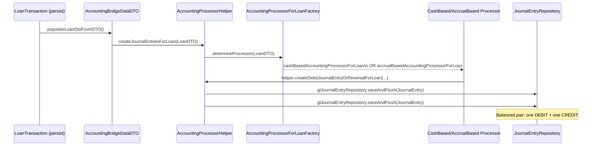
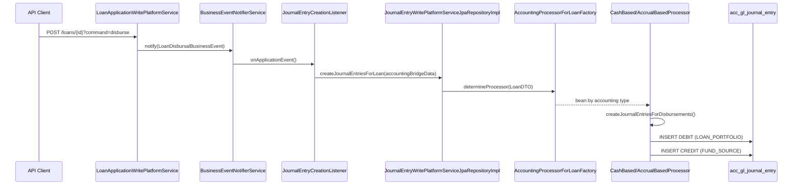

Journal entries are the atomic financial records that keep Fineract's general ledger balanced. Every monetary event — a loan disbursement, repayment, accrual, savings deposit — ultimately produces one or more `JournalEntry` rows in `acc_gl_journal_entry`. This page documents the entity model, the `JournalEntryType` enum, all REST endpoints, the chain of accounting processor services that automatically generate entries from product events, and how reversals work.

---

## File Inventory

| Concern | Path |
|---|---|
| `JournalEntry` entity | `fineract-accounting/.../journalentry/domain/JournalEntry.java` |
| `JournalEntryType` enum | `fineract-core/.../accounting/journalentry/domain/JournalEntryType.java` |
| `JournalEntryRepository` | `fineract-accounting/.../journalentry/domain/JournalEntryRepository.java` |
| `JournalEntryData` (DTO) | `fineract-accounting/.../journalentry/data/JournalEntryData.java` |
| `JournalEntryCommand` | `fineract-accounting/.../journalentry/command/JournalEntryCommand.java` |
| `SingleDebitOrCreditEntryCommand` | `fineract-accounting/.../journalentry/command/SingleDebitOrCreditEntryCommand.java` |
| `JournalEntryJsonInputParams` | `fineract-accounting/.../journalentry/api/JournalEntryJsonInputParams.java` |
| `JournalEntriesApiResource` (REST) | `fineract-provider/.../accounting/journalentry/api/JournalEntriesApiResource.java` |
| `JournalEntryWritePlatformService` (interface) | `fineract-provider/.../accounting/journalentry/service/JournalEntryWritePlatformService.java` |
| `JournalEntryWritePlatformServiceJpaRepositoryImpl` | `fineract-provider/.../accounting/journalentry/service/JournalEntryWritePlatformServiceJpaRepositoryImpl.java` |
| `JournalEntryReadPlatformService` (interface) | `fineract-accounting/.../journalentry/service/JournalEntryReadPlatformService.java` |
| `JournalEntryReadPlatformServiceImpl` | `fineract-provider/.../accounting/journalentry/service/JournalEntryReadPlatformServiceImpl.java` |
| `AccountingProcessorHelper` | `fineract-provider/.../accounting/journalentry/service/AccountingProcessorHelper.java` |
| `AccountingProcessorForLoanFactory` | `fineract-provider/.../accounting/journalentry/service/AccountingProcessorForLoanFactory.java` |
| `AccountingProcessorForLoan` (interface) | `fineract-provider/.../accounting/journalentry/service/AccountingProcessorForLoan.java` |
| `CashBasedAccountingProcessorForLoan` | `fineract-provider/.../accounting/journalentry/service/CashBasedAccountingProcessorForLoan.java` |
| `AccrualBasedAccountingProcessorForLoan` | `fineract-provider/.../accounting/journalentry/service/AccrualBasedAccountingProcessorForLoan.java` |
| `CashBasedAccountingProcessorForWorkingCapitalLoan` | `fineract-provider/.../accounting/journalentry/service/CashBasedAccountingProcessorForWorkingCapitalLoan.java` |
| `AccountingProcessorForSavings` (interface) | `fineract-provider/.../accounting/journalentry/service/AccountingProcessorForSavings.java` |
| `CashBasedAccountingProcessorForSavings` | `fineract-provider/.../accounting/journalentry/service/CashBasedAccountingProcessorForSavings.java` |
| `AccrualBasedAccountingProcessorForSavings` | `fineract-provider/.../accounting/journalentry/service/AccrualBasedAccountingProcessorForSavings.java` |
| `AccountingProcessorForClientTransactions` | `fineract-provider/.../accounting/journalentry/service/AccountingProcessorForClientTransactions.java` |
| `CashBasedAccountingProcessorForClientTransactions` | `fineract-provider/.../accounting/journalentry/service/CashBasedAccountingProcessorForClientTransactions.java` |
| `AccountingProcessorForSharesFactory` | `fineract-provider/.../accounting/journalentry/service/AccountingProcessorForSharesFactory.java` |
| `CashBasedAccountingProcessorForShares` | `fineract-provider/.../accounting/journalentry/service/CashBasedAccountingProcessorForShares.java` |
| `LoanCommonAccountingHelper` | `fineract-provider/.../accounting/journalentry/service/LoanCommonAccountingHelper.java` |
| `JournalEntryRunningBalanceUpdateService` | `fineract-accounting/.../journalentry/service/JournalEntryRunningBalanceUpdateService.java` |
| `JournalEntryRunningBalanceUpdateServiceImpl` | `fineract-provider/.../accounting/journalentry/service/JournalEntryRunningBalanceUpdateServiceImpl.java` |
| `LoanDTO` / `LoanTransactionDTO` | `fineract-provider/.../accounting/journalentry/data/LoanDTO.java`, `LoanTransactionDTO.java` |
| `SavingsDTO` / `SavingsTransactionDTO` | `fineract-provider/.../accounting/journalentry/data/SavingsDTO.java`, `SavingsTransactionDTO.java` |
| `FinancialActivityAccountsApiResource` | `fineract-accounting/.../financialactivityaccount/api/FinancialActivityAccountsApiResource.java` |
| `AccountingJournalEntryConfiguration` (Spring config) | `fineract-provider/.../accounting/journalentry/starter/AccountingJournalEntryConfiguration.java` |

---

## JournalEntry Entity

**Table:** `acc_gl_journal_entry`  
**Class:** `org.apache.fineract.accounting.journalentry.domain.JournalEntry`  
**Superclass:** `AbstractAuditableWithUTCDateTimeCustom<Long>` (provides `id`, `createdBy`, `createdDate`, `lastModifiedBy`, `lastModifiedDate`)

### Field Reference

| Field | Column | Type | Notes |
|---|---|---|---|
| `office` | `office_id` | FK → `m_office` | Branch that owns the entry |
| `glAccount` | `account_id` | FK → `acc_gl_account` | Target GL account (DETAIL only) |
| `currencyCode` | `currency_code` | `CHAR(3)` | ISO currency code |
| `transactionId` | `transaction_id` | `VARCHAR(50)` | Groups all entries for one event; prefix-encoded (see below) |
| `type` | `type_enum` | `INT` | `JournalEntryType`: 1=CREDIT, 2=DEBIT |
| `amount` | `amount` | `DECIMAL(19,6)` | Always positive; direction is encoded in `type` |
| `transactionDate` | `entry_date` | `DATE` | Business date of the transaction |
| `submittedOnDate` | `submitted_on_date` | `DATE` | Date JE row was created (business date at insert time) |
| `manualEntry` | `manual_entry` | `BOOLEAN` | `true` for manually-created entries |
| `reversed` | `reversed` | `BOOLEAN` | `true` after reversal |
| `reversalJournalEntry` | `reversal_id` | FK → `acc_gl_journal_entry` | Self-referential link to the reversal entry |
| `entityType` | `entity_type_enum` | `INT` | Portfolio product type (1=LOAN, 2=SAVINGS, etc.) |
| `entityId` | `entity_id` | `LONG` | ID of the portfolio entity |
| `loanTransactionId` | `loan_transaction_id` | `LONG` | FK → `m_loan_transaction` |
| `savingsTransactionId` | `savings_transaction_id` | `LONG` | FK → `m_savings_account_transaction` |
| `clientTransactionId` | `client_transaction_id` | `LONG` | FK → `m_client_transaction` |
| `shareTransactionId` | `share_transaction_id` | `LONG` | FK → `m_share_account_transactions` |
| `paymentDetail` | `payment_details_id` | FK → `m_payment_detail` | Payment metadata |
| `referenceNumber` | `ref_num` | `VARCHAR` | Optional external reference |
| `description` | `description` | `VARCHAR(500)` | Stored via `StringUtils.defaultIfEmpty` |

### Transaction ID Prefixes

`AccountingProcessorHelper` uses these prefixes to construct the `transactionId`:

| Prefix | Constant | Product |
|---|---|---|
| `"L"` | `LOAN_TRANSACTION_IDENTIFIER` | Loan transactions |
| `"S"` | `SAVINGS_TRANSACTION_IDENTIFIER` | Savings transactions |
| `"C"` | `CLIENT_TRANSACTION_IDENTIFIER` | Client-level transactions |
| `"P"` | `PROVISIONING_TRANSACTION_IDENTIFIER` | Provisioning entries |
| `"SH"` | `SHARE_TRANSACTION_IDENTIFIER` | Share account transactions |
| `"WC"` | `WORKING_CAPITAL_LOAN_TRANSACTION_IDENTIFIER` | Working capital loans |

---

## JournalEntryType Enum

**Class:** `org.apache.fineract.accounting.journalentry.domain.JournalEntryType`

| Constant | Integer Value | i18n Code |
|---|---|---|
| `CREDIT` | `1` | `journalEntryType.credit` |
| `DEBIT` | `2` | `journalEntrytType.debit` |

Helper methods: `isDebitType()`, `isCreditType()`, `fromInt(Integer)`.

---

## JournalEntriesApiResource Endpoints

**Base path:** `/v1/journalentries`  
**Class:** `org.apache.fineract.accounting.journalentry.api.JournalEntriesApiResource`  
**Permission resource:** `JOURNALENTRY`

| Method | Path | Command Param | Description |
|---|---|---|---|
| `GET` | `/v1/journalentries` | — | List with pagination, filtering, and sorting |
| `GET` | `/v1/journalentries/{journalEntryId}` | — | Retrieve single entry |
| `POST` | `/v1/journalentries` | _(none)_ | Create balanced manual journal entry |
| `POST` | `/v1/journalentries` | `updateRunningBalance` | Trigger running balance recalculation |
| `POST` | `/v1/journalentries` | `defineOpeningBalance` | Set opening balances for an office |
| `POST` | `/v1/journalentries/{transactionId}` | `reverse` | Reverse a transaction by its transactionId |
| `GET` | `/v1/journalentries/provisioning` | — | Get JEs for a provisioning entry (`entryId` param) |
| `GET` | `/v1/journalentries/openingbalance` | — | Get opening balance by `officeId` + `currencyCode` |
| `GET` | `/v1/journalentries/downloadtemplate` | — | Excel bulk-import template |
| `POST` | `/v1/journalentries/uploadtemplate` | — | Upload bulk JE template |

### GET /v1/journalentries Query Parameters

| Parameter | Type | Notes |
|---|---|---|
| `officeId` | Long | Filter by office |
| `glAccountId` | Long | Filter by GL account |
| `manualEntriesOnly` | Boolean | Return only manual entries |
| `fromDate` / `toDate` | DateParam | Entry date range |
| `submittedOnDateFrom` / `submittedOnDateTo` | DateParam | Submission date range |
| `transactionId` | String | Exact transactionId match |
| `entityType` | Integer | `PortfolioProductType` int |
| `loanId` | Long | Filter by loan |
| `savingsId` | Long | Filter by savings account |
| `runningBalance` | boolean | Include running balance in response |
| `transactionDetails` | boolean | Include transaction detail (loan/savings/client sub-objects) |
| `offset` / `limit` / `orderBy` / `sortOrder` | — | Pagination and sort |

---

## Automatic Journal Entry Creation Flow

When a loan or savings transaction is saved, a business event triggers `JournalEntryWritePlatformService.createJournalEntriesForLoan()` (or savings equivalent). The factory pattern selects the correct processor based on the product's accounting type.

### AccountingProcessorForLoanFactory Logic

**Class:** `org.apache.fineract.accounting.journalentry.service.AccountingProcessorForLoanFactory`

| LoanDTO Flag | Returned Bean |
|---|---|
| `isCashBasedAccountingEnabled()` | `cashBasedAccountingProcessorForLoan` (`CashBasedAccountingProcessorForLoan`) |
| `isUpfrontAccrualBasedAccountingEnabled()` | `accrualBasedAccountingProcessorForLoan` (`AccrualBasedAccountingProcessorForLoan`) |
| `isPeriodicAccrualBasedAccountingEnabled()` | `accrualBasedAccountingProcessorForLoan` (`AccrualBasedAccountingProcessorForLoan`) |

---

## CashBasedAccountingProcessorForLoan

**Class:** `org.apache.fineract.accounting.journalentry.service.CashBasedAccountingProcessorForLoan`

Handles these `LoanTransactionEnumData` transaction type checks in order:

| Transaction Type Check | Method Called |
|---|---|
| `isDisbursement()` | `createJournalEntriesForDisbursements()` |
| `isRepaymentType() && !isChargeAdjustment()`, `isRepaymentAtDisbursement()`, `isChargePayment()` | `createJournalEntriesForRepayments()` |
| `isRecoveryRepayment()` | `createJournalEntriesForRecoveryRepayments()` |
| `isRefund()` | `createJournalEntriesForRefund()` |
| `isCreditBalanceRefund()` | `createJournalEntriesForCreditBalanceRefund()` |
| `isReversed()` | `journalEntryWritePlatformService.createJournalEntryForReversedLoanTransaction()` |

For a **cash-based disbursement**, the pattern is:
- **DEBIT** `LOAN_PORTFOLIO` (the loan receivable account)
- **CREDIT** `FUND_SOURCE` (the funding source account)

For a **cash-based repayment**, the principal portion:
- **DEBIT** `FUND_SOURCE`
- **CREDIT** `LOAN_PORTFOLIO`

And the interest portion:
- **DEBIT** `FUND_SOURCE`
- **CREDIT** `INTEREST_ON_LOANS`

---

## AccrualBasedAccountingProcessorForLoan

**Class:** `org.apache.fineract.accounting.journalentry.service.AccrualBasedAccountingProcessorForLoan`

Handles all cash-based transaction types **plus** accrual-specific transactions:

| Additional Transaction Type | Method Called |
|---|---|
| `isAccrual()` or `isAccrualAdjustment()` | `createJournalEntriesForAccruals()` |

For **accrual events** (periodic or upfront):
- **DEBIT** `INTEREST_RECEIVABLE`
- **CREDIT** `INTEREST_ON_LOANS`

When the repayment later clears the accrual:
- **DEBIT** `FUND_SOURCE`
- **CREDIT** `INTEREST_RECEIVABLE`

---

## AccountingProcessorHelper Key Methods

**Class:** `org.apache.fineract.accounting.journalentry.service.AccountingProcessorHelper`

| Method | Purpose |
|---|---|
| `populateLoanDtoFromDTO(AccountingBridgeDataDTO)` | Converts bridge data to internal `LoanDTO` with `LoanTransactionDTO` list |
| `createDebitJournalEntryOrReversalForLoan(...)` | Creates a DEBIT `JournalEntry` or marks existing one reversed |
| `createCreditJournalEntryOrReversalForLoan(...)` | Creates a CREDIT `JournalEntry` or marks existing one reversed |
| `getOfficeById(Long officeId)` | Cached office lookup (used in loop bodies) |
| `getLatestClosureByBranch(Long officeId)` | Returns `GLClosure` if the branch has a period closure; used by `checkForBranchClosures()` |
| `checkForBranchClosures(GLClosure, LocalDate)` | Throws `JournalEntryInvalidException` if `transactionDate <= closureDate` |
| `getGLAccountById(...)` | Looks up GL account from `ProductToGLAccountMappingRepository` by `(productId, productType, financialAccountType, paymentTypeId)` |

---

## SavingsAccountingProcessorHelper

`AccountingProcessorForSavingsFactory` mirrors the loan factory pattern:
- `CashBasedAccountingProcessorForSavings` — handles deposits, withdrawals, charges, interest posting
- `AccrualBasedAccountingProcessorForSavings` — additionally handles accrued interest

The savings `SavingsDTO` / `SavingsTransactionDTO` bridge DTOs carry the same flag set (`isCashBasedAccountingEnabled`, etc.).

---

## Manual Journal Entry Creation

Manual entries go through `JournalEntryWritePlatformServiceJpaRepositoryImpl.createJournalEntry()`:

<Steps>
  <Step title="Validate office and accounting rule">
    Checks that `officeId` is valid and (if `accountRuleId` is provided) that the rule exists and the selected accounts are valid for the rule.
  </Step>
  <Step title="Create payment detail">
    Calls `PaymentDetailWritePlatformService.createAndPersistPaymentDetail()` if payment info is provided.
  </Step>
  <Step title="Generate transaction ID">
    Calls `generateTransactionId(officeId)` — produces a unique string that groups all entries for this manual JE.
  </Step>
  <Step title="Persist DEBIT entries">
    Iterates over `journalEntryCommand.getDebits()` and calls `saveAllDebitOrCreditEntries()` with `JournalEntryType.DEBIT`.
  </Step>
  <Step title="Persist CREDIT entries">
    Iterates over `journalEntryCommand.getCredits()` and calls `saveAllDebitOrCreditEntries()` with `JournalEntryType.CREDIT`.
  </Step>
  <Step title="Validate balance">
    `checkDebitAndCreditAmounts()` asserts that sum(debits) == sum(credits). Throws `JournalEntryInvalidException(GlJournalEntryInvalidReason.DEBIT_CREDIT_SUM_MISMATCH)` on failure.
  </Step>
</Steps>

**Mandatory fields:** `officeId`, `transactionDate`, `credits` (array of `{glAccountId, amount}`), `debits` (array of `{glAccountId, amount}`)  
**Optional:** `accountingRuleId`, `paymentTypeId`, `referenceNumber`, `currencyCode`, `comments`

---

## Reversal Mechanism

Reversal is triggered via `POST /v1/journalentries/{transactionId}?command=reverse`.

The reversal handler (`ReverseJournalEntryCommandHandler`) calls `JournalEntryWritePlatformService.revertJournalEntry()`:

1. All `JournalEntry` rows with matching `transactionId` are loaded.
2. For each entry:
   - `entry.setReversed(true)` on the original.
   - A **new** `JournalEntry` is created with the opposite `type` (DEBIT↔CREDIT), same `amount`, a new `transactionId` (prefixed `"R"`), and `reversalJournalEntry` pointing to the original.
3. Both original and reversal entries share the link via `reversalJournalEntry` (self-referential FK `reversal_id`).

<Warning>
A journal entry that has already been reversed (`reversed=true`) cannot be reversed again. The service throws `JournalEntryInvalidException(GlJournalEntryInvalidReason.JOURNAL_ENTRY_ALREADY_REVERSED)`.
</Warning>

---

## Office Opening Balances

`POST /v1/journalentries?command=defineOpeningBalance` triggers `DefineOpeningBalanceCommandHandler`.  
Opening balances create manual journal entries paired against the `OPENING_BALANCES_TRANSFER_CONTRA` financial activity account (equity account, activity code `300`).

---

## Financial Activity Account API

**Path:** `fineract-accounting/.../financialactivityaccount/api/FinancialActivityAccountsApiResource.java`  
**Base URL:** `/v1/financialactivityaccounts`

| Method | Path | Description |
|---|---|---|
| `GET` | `/v1/financialactivityaccounts/template` | Template |
| `GET` | `/v1/financialactivityaccounts` | List all mappings |
| `GET` | `/v1/financialactivityaccounts/{mappingId}` | Single mapping |
| `POST` | `/v1/financialactivityaccounts` | Create mapping (required: `financialActivityId`, `glAccountId`) |
| `PUT` | `/v1/financialactivityaccounts/{mappingId}` | Update mapping |
| `DELETE` | `/v1/financialactivityaccounts/{mappingId}` | Delete mapping |

---

## Loan Disbursement → Journal Entry Sequence

---

## Gotchas & Invariants

<Accordion title="All entries for one event share a transactionId">
Every `JournalEntry` created for a single loan transaction carries the same `transactionId` (e.g. `L123`). Reversal, reporting, and the provisioning retrieval endpoint all rely on this group identity. Never create partial entries without ensuring the full balanced set shares one ID.
</Accordion>

<Accordion title="Reversed entries are kept in DB">
Fineract never deletes reversed journal entries. Both the original (with `reversed=true`) and the reversal entry remain in `acc_gl_journal_entry`. This preserves a complete audit trail.
</Accordion>

<Accordion title="Branch closure blocks entry posting">
If a `GLClosure` exists for the office with `closingDate >= transactionDate`, `checkForBranchClosures()` throws before any rows are written.
</Accordion>

<Accordion title="Manual entries require DETAIL accounts">
Passing a HEADER account in the `credits` or `debits` array of a manual JE will fail validation with `GLAccountInvalidUsageException`.
</Accordion>

<Accordion title="Accounting type drives processor selection">
If a loan product is set up with `NONE` accounting, `AccountingProcessorForLoanFactory.determineProcessor()` returns `null` and no journal entries are created. This is intentional for non-accounting deployments.
</Accordion>
