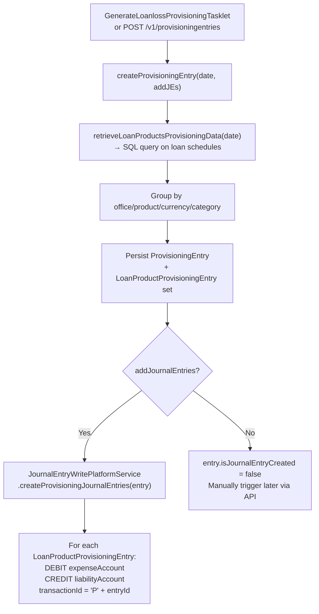

Provisioning (loan-loss provisioning, also called credit-loss provisioning) is the process of recognising estimated losses on delinquent loans before they are actually written off. Fineract models this as a two-phase workflow: (1) generate provisioning entries that quantify the reserve amount per loan product and category, and (2) post those reserves as GL journal entries (debit Expense, credit Liability). This page documents every entity, service, API endpoint, and batch job involved.

---

## File Inventory

| Concern | Path |
|---|---|
| `ProvisioningEntry` entity | `fineract-provider/.../accounting/provisioning/domain/ProvisioningEntry.java` |
| `LoanProductProvisioningEntry` entity | `fineract-provider/.../accounting/provisioning/domain/LoanProductProvisioningEntry.java` |
| `ProvisioningEntryRepository` | `fineract-provider/.../accounting/provisioning/domain/ProvisioningEntryRepository.java` |
| `ProvisioningCategory` entity | `fineract-provider/.../organisation/provisioning/domain/ProvisioningCategory.java` |
| `ProvisioningCriteria` entity | `fineract-provider/.../organisation/provisioning/domain/ProvisioningCriteria.java` |
| `ProvisioningCriteriaDefinition` entity | `fineract-provider/.../organisation/provisioning/domain/ProvisioningCriteriaDefinition.java` |
| `LoanProductProvisionCriteria` entity | `fineract-provider/.../organisation/provisioning/domain/LoanProductProvisionCriteria.java` |
| `ProvisioningEntriesApiResource` (REST) | `fineract-accounting/.../provisioning/api/ProvisioningEntriesApiResource.java` |
| `ProvisioningCriteriaApiResource` (REST) | `fineract-provider/.../organisation/provisioning/api/ProvisioningCriteriaApiResource.java` |
| `ProvisioningCategoryApiResource` (REST) | `fineract-provider/.../organisation/provisioning/api/ProvisioningCategoryApiResource.java` |
| `ProvisioningEntriesWritePlatformService` (interface) | `fineract-provider/.../accounting/provisioning/service/ProvisioningEntriesWritePlatformService.java` |
| `ProvisioningEntriesWritePlatformServiceJpaRepositoryImpl` | `fineract-provider/.../accounting/provisioning/service/ProvisioningEntriesWritePlatformServiceJpaRepositoryImpl.java` |
| `ProvisioningEntriesReadPlatformService` (interface) | `fineract-accounting/.../provisioning/service/ProvisioningEntriesReadPlatformService.java` |
| `ProvisioningEntriesReadPlatformServiceImpl` | `fineract-accounting/.../provisioning/service/ProvisioningEntriesReadPlatformServiceImpl.java` |
| `ProvisioningEntryData` DTO | `fineract-accounting/.../provisioning/data/ProvisioningEntryData.java` |
| `LoanProductProvisioningEntryData` DTO | `fineract-accounting/.../provisioning/data/LoanProductProvisioningEntryData.java` |
| `ProvisionEntryRequest` | `fineract-accounting/.../provisioning/data/request/ProvisionEntryRequest.java` |
| `ProvisioningEntriesApiConstants` | `fineract-accounting/.../provisioning/constant/ProvisioningEntriesApiConstants.java` |
| `ProvisioningEntriesDefinitionJsonDeserializer` | `fineract-accounting/.../provisioning/serialization/ProvisioningEntriesDefinitionJsonDeserializer.java` |
| `GenerateLoanlossProvisioningTasklet` (batch) | `fineract-provider/.../loanaccount/jobs/generateloanlossprovisioning/GenerateLoanlossProvisioningTasklet.java` |
| `GenerateLoanlossProvisioningConfig` (batch) | `fineract-provider/.../loanaccount/jobs/generateloanlossprovisioning/GenerateLoanlossProvisioningConfig.java` |
| `CreateProvisioningEntriesRequestCommandHandler` | `fineract-provider/.../accounting/provisioning/handler/CreateProvisioningEntriesRequestCommandHandler.java` |
| `CreateProvisioningJournalEntriesRequestCommandHandler` | `fineract-provider/.../accounting/provisioning/handler/CreateProvisioningJournalEntriesRequestCommandHandler.java` |
| `ReCreateProvisioningEntryRequestCommandHandler` | `fineract-provider/.../accounting/provisioning/handler/ReCreateProvisioningEntryRequestCommandHandler.java` |
| `AccountingProvisioningConfiguration` (Spring) | `fineract-provider/.../accounting/provisioning/starter/AccountingProvisioningConfiguration.java` |
| `ProvisioningCriteriaReadPlatformService` | `fineract-provider/.../organisation/provisioning/service/ProvisioningCriteriaReadPlatformService.java` |

---

## Concept: What Is Provisioning?

<Info>
Provisioning in Fineract maps directly to **IFRS 9 / IAS 39 Expected Credit Loss (ECL)** concepts. For every active loan that has overdue repayment schedule installments, the system calculates a reserve amount = `outstandingBalance × provisioningPercentage`. The reserve is posted as a debit to an expense account and a credit to a liability account on the GL.
</Info>

The workflow has three configurable layers:

1. **ProvisioningCategory** — named risk tiers (e.g. Standard, Watch, Substandard, Doubtful, Loss)
2. **ProvisioningCriteria** — named policy linking day-ranges to category percentages and GL accounts
3. **ProvisioningEntry** — the point-in-time snapshot generated on a specific date

---

## Domain Entities

### ProvisioningCategory

**Table:** `m_provision_category`  
**Class:** `org.apache.fineract.organisation.provisioning.domain.ProvisioningCategory`  
**Unique constraint:** `category_name`

| Field | Column | Notes |
|---|---|---|
| `categoryName` | `category_name` | Unique, e.g. `"Standard"`, `"Doubtful"` |
| `categoryDescription` | `description` | Optional description |

---

### ProvisioningCriteria

**Table:** `m_provisioning_criteria`  
**Class:** `org.apache.fineract.organisation.provisioning.domain.ProvisioningCriteria`  
**Unique constraint:** `criteria_name`

| Field | Type/Relationship | Notes |
|---|---|---|
| `criteriaName` | `VARCHAR NOT NULL` | Unique policy name |
| `provisioningCriteriaDefinition` | `Set<ProvisioningCriteriaDefinition>` | CascadeAll, EAGER — the actual bracket rules |
| `loanProductMapping` | `Set<LoanProductProvisionCriteria>` | CascadeAll, EAGER — which loan products use this criteria |

---

### ProvisioningCriteriaDefinition

**Table:** `m_provisioning_criteria_definition`  
**Class:** `org.apache.fineract.organisation.provisioning.domain.ProvisioningCriteriaDefinition`

Each row represents one overdue bracket within a criteria policy:

| Field | Column | Notes |
|---|---|---|
| `criteria` | `criteria_id` | FK → `m_provisioning_criteria` |
| `provisioningCategory` | `category_id` | FK → `m_provision_category` |
| `minimumAge` | `min_age` | Minimum overdue days for this bracket (inclusive) |
| `maximumAge` | `max_age` | Maximum overdue days for this bracket (inclusive) |
| `provisioningPercentage` | `provision_percentage` | `DECIMAL` — percentage of outstanding balance to provision |
| `liabilityAccount` | `liability_account` | FK → `acc_gl_account` — CREDIT target |
| `expenseAccount` | `expense_account` | FK → `acc_gl_account` — DEBIT target |

**Example policy structure:**

| Category | Min Days | Max Days | % | Debit | Credit |
|---|---|---|---|---|---|
| Standard | 0 | 29 | 1% | Provision Expense | Loan Loss Reserve |
| Watch | 30 | 59 | 5% | Provision Expense | Loan Loss Reserve |
| Substandard | 60 | 89 | 25% | Provision Expense | Loan Loss Reserve |
| Doubtful | 90 | 179 | 50% | Provision Expense | Loan Loss Reserve |
| Loss | 180 | 9999 | 100% | Provision Expense | Loan Loss Reserve |

---

### ProvisioningEntry

**Table:** `m_provisioning_history`  
**Class:** `org.apache.fineract.accounting.provisioning.domain.ProvisioningEntry`

Each run of the provisioning engine produces one `ProvisioningEntry` row (a snapshot header):

| Field | Column | Notes |
|---|---|---|
| `id` | PK | Auto-generated |
| `isJournalEntryCreated` | `journal_entry_created` | `Boolean`; `true` after GL posting |
| `createdBy` | `createdby_id` | FK → `m_appuser` |
| `createdDate` | `created_date` | Date the snapshot was taken |
| `lastModifiedBy` | `lastmodifiedby_id` | FK → `m_appuser` |
| `lastModifiedDate` | `lastmodified_date` | Last update timestamp |
| `provisioningEntries` | OneToMany → `LoanProductProvisioningEntry` | CascadeAll, EAGER — all line items for this snapshot |

---

### LoanProductProvisioningEntry

**Table:** `m_loanproduct_provisioning_entry`  
**Class:** `org.apache.fineract.accounting.provisioning.domain.LoanProductProvisioningEntry`

One row per (office × loan product × currency × provisioning category) combination:

| Field | Column | Notes |
|---|---|---|
| `entry` | `history_id` | FK → `m_provisioning_history` |
| `criteriaId` | `criteria_id` | The provisioning criteria that matched |
| `office` | `office_id` | FK → `m_office` |
| `currencyCode` | `currency_code` | ISO code |
| `loanProduct` | `product_id` | FK → `m_product_loan` |
| `provisioningCategory` | `category_id` | FK → `m_provision_category` |
| `overdueInDays` | `overdue_in_days` | Number of days overdue for this group |
| `reservedAmount` | `reseve_amount` | Computed `outstanding × percentage` (note: column typo in DB schema) |
| `liabilityAccount` | `liability_account` | FK → `acc_gl_account` — CREDIT at JE post time |
| `expenseAccount` | `expense_account` | FK → `acc_gl_account` — DEBIT at JE post time |

`partialHashCode()` groups lines with identical parameters except `reservedAmount`, enabling delta detection.

---

## REST API Endpoints

### ProvisioningEntriesApiResource

**Base path:** `/v1/provisioningentries`  
**Class:** `org.apache.fineract.accounting.provisioning.api.ProvisioningEntriesApiResource`

| Method | Path | Command | Description |
|---|---|---|---|
| `POST` | `/v1/provisioningentries` | — | Create new provisioning snapshot |
| `POST` | `/v1/provisioningentries/{entryId}` | `createjournalentry` | Post GL journal entries for an existing snapshot |
| `POST` | `/v1/provisioningentries/{entryId}` | `recreateprovisioningentry` | Regenerate the line items for an existing entry |
| `GET` | `/v1/provisioningentries/{entryId}` | — | Retrieve entry metadata |
| `GET` | `/v1/provisioningentries/entries` | — | Paginated line items (filter: `entryId`, `officeId`, `productId`, `categoryId`) |
| `GET` | `/v1/provisioningentries` | — | Paginated list of all entry metadata |

#### POST /v1/provisioningentries Body

| Field | Type | Required | Notes |
|---|---|---|---|
| `date` | String | ✅ | Date for which to run provisioning |
| `dateFormat` | String | ✅ | e.g. `"dd MMMM yyyy"` |
| `locale` | String | ✅ | e.g. `"en"` |
| `createjournalentries` | Boolean | ❌ | If `true`, posts GL JEs immediately after generation |

---

### ProvisioningCriteriaApiResource

**Base path:** `/v1/provisioningcriteria`  
**Class:** `org.apache.fineract.organisation.provisioning.api.ProvisioningCriteriaApiResource`

| Method | Path | Description |
|---|---|---|
| `GET` | `/v1/provisioningcriteria/template` | Template for criteria creation |
| `GET` | `/v1/provisioningcriteria` | List all criteria |
| `GET` | `/v1/provisioningcriteria/{criteriaId}` | Single criteria (`?template=true` adds dropdowns) |
| `POST` | `/v1/provisioningcriteria` | Create criteria (mandatory: `criteriaName`, `provisioningcriteria` array) |
| `PUT` | `/v1/provisioningcriteria/{criteriaId}` | Update criteria |
| `DELETE` | `/v1/provisioningcriteria/{criteriaId}` | Delete criteria |

---

### ProvisioningCategoryApiResource

**Base path:** `/v1/provisioningcategory`  
**Class:** `org.apache.fineract.organisation.provisioning.api.ProvisioningCategoryApiResource`

| Method | Path | Description |
|---|---|---|
| `GET` | `/v1/provisioningcategory` | List all categories |
| `POST` | `/v1/provisioningcategory` | Create category (`categoryname` required) |
| `PUT` | `/v1/provisioningcategory/{categoryId}` | Update category |
| `DELETE` | `/v1/provisioningcategory/{categoryId}` | Delete category |

---

## Service Layer

### ProvisioningEntriesWritePlatformService

**Interface:** `org.apache.fineract.accounting.provisioning.service.ProvisioningEntriesWritePlatformService`  
**Impl:** `ProvisioningEntriesWritePlatformServiceJpaRepositoryImpl`

Key methods:

| Method | Description |
|---|---|
| `createProvisioningEntries(JsonCommand)` | Validates, reads all criteria, calls `createProvisioningEntry(date, addJournalEntries)` |
| `createProvisioningEntry(LocalDate, boolean)` | Queries `ProvisioningEntriesReadPlatformService.retrieveLoanProductsProvisioningData(date)`, groups by loan product/office/category, persists `ProvisioningEntry` + `LoanProductProvisioningEntry` set |
| `createProvisioningJournalEntries(Long, JsonCommand)` | Loads the `ProvisioningEntry`, calls `revertAndAddJournalEntries()` which first reverts any prior entry-with-JEs, then calls `JournalEntryWritePlatformService.createProvisioningJournalEntries(requestedEntry)` |
| `reCreateProvisioningEntries(Long, JsonCommand)` | Regenerates line items for an existing `ProvisioningEntry` ID |

### ProvisioningEntriesReadPlatformService

**Interface:** `org.apache.fineract.accounting.provisioning.service.ProvisioningEntriesReadPlatformService`

| Method | Description |
|---|---|
| `retrieveLoanProductsProvisioningData(LocalDate date)` | Core SQL query against `m_loan_repayment_schedule`, `m_loan`, `m_loanproduct_provisioning_mapping`, `m_provisioning_criteria_definition`. Computes overdue days as `GREATEST(DATEDIFF(date, duedate), 0)` |
| `retrieveProvisioningEntryData(Long entryId)` | Single entry metadata |
| `retrieveAllProvisioningEntries(Integer offset, Integer limit)` | Paginated list |
| `retrieveProvisioningEntries(SearchParameters)` | Paginated line items with filtering |
| `retrieveExistingProvisioningIdDateWithJournals()` | Returns the most-recent entry that has `journal_entry_created = true` |

---

## GenerateLoanlossProvisioningTasklet (Batch Job)

**Class:** `org.apache.fineract.portfolio.loanaccount.jobs.generateloanlossprovisioning.GenerateLoanlossProvisioningTasklet`  
**Config:** `GenerateLoanlossProvisioningConfig`  
**Job name:** `Generate Loan Loss Provisioning` (Spring Batch)

```java
// Simplified execution logic
LocalDate currentDate = DateUtils.getBusinessLocalDate();
boolean addJournalEntries = true; // always posts JEs from batch
Collection<ProvisioningCriteriaData> criteriaCollection =
    provisioningCriteriaReadPlatformService.retrieveAllProvisioningCriterias();
if (CollectionUtils.isNotEmpty(criteriaCollection)) {
    provisioningEntriesWritePlatformService.createProvisioningEntry(currentDate, addJournalEntries);
}
```

Dependencies:
- `ProvisioningCriteriaReadPlatformService` — checks that at least one criteria exists before running
- `ProvisioningEntriesWritePlatformService` — creates the entry and optionally posts JEs

<Warning>
If a provisioning entry for the current date already exists, the tasklet catches `ProvisioningEntryAlreadyCreatedException` and logs an error without failing the batch job. A second run on the same date is silently skipped.
</Warning>

---

## How Provisioning Journal Entries Are Posted to GL



The `JournalEntryWritePlatformService.createProvisioningJournalEntries()` method iterates all `LoanProductProvisioningEntry` rows in the snapshot. For each row, it creates:
- One `JournalEntry` with `type=DEBIT`, `amount=reservedAmount`, `glAccount=expenseAccount`
- One `JournalEntry` with `type=CREDIT`, `amount=reservedAmount`, `glAccount=liabilityAccount`

All entries for one provisioning snapshot share `transactionId = "P" + provisioningEntry.getId()`.

### Re-posting Logic (createjournalentry command)

When posting JEs for a provisioning entry that is **not** the latest one with JEs, `revertAndAddJournalEntries()` first:
1. Calls `JournalEntryWritePlatformService.revertProvisioningJournalEntries(requestedEntry.createdDate, existingEntryId, PROVISIONING)` to reverse the prior posting.
2. Validates that `existingDate < requestedDate` (cannot post an older entry if a newer one has already been journalised — throws `ProvisioningJournalEntriesCannotbeCreatedException`).

---

## Exception Reference

| Exception Class | Trigger |
|---|---|
| `NoProvisioningCriteriaDefinitionFound` | `createProvisioningEntries` called but no criteria exist |
| `ProvisioningEntryAlreadyCreatedException` | Entry for the same date already exists |
| `ProvisioningEntryNotfoundException` | `entryId` does not exist in `m_provisioning_history` |
| `ProvisioningJournalEntriesCannotbeCreatedException` | Attempt to post JEs for an entry older than the current JE-posted entry |

---

## Connections to Other Subsystems

- **LoanProduct → Criteria:** `m_loanproduct_provisioning_mapping` (`LoanProductProvisionCriteria`) links a `LoanProduct` to a `ProvisioningCriteria`. This is set up via `ProvisioningCriteriaApiResource` with the `loanProducts` array.
- **GL Accounts:** `ProvisioningCriteriaDefinition` holds direct FKs to `acc_gl_account` for both the liability and expense accounts. These must be valid `DETAIL` accounts.
- **Journal Entries:** Provisioning entries are retrieved by `JournalEntriesApiResource.retrieveJournalEntries()` using `GET /v1/journalentries/provisioning?entryId=N` which filters by `transactionId = "P" + entryId`.
- **Batch scheduling:** `GenerateLoanlossProvisioningConfig` wires the tasklet into a Spring Batch job; the job is scheduled through the Fineract job scheduler (`m_job` table).

---

## Gotchas & Invariants

<Accordion title="Provisioning uses the earliest-unpaid installment date">
The SQL in `LoanProductProvisioningEntryMapper` selects `MIN(duedate)` where `completed_derived=false` for each loan. Only loans in `loan_status_id=300` (ACTIVE) are included. Closed or written-off loans are excluded.
</Accordion>

<Accordion title="reservedAmount column has a typo">
The column is `reseve_amount` (missing 'r') in the `m_loanproduct_provisioning_entry` table. This is a known quirk; do not rename it without a migration.
</Accordion>

<Accordion title="Journal entries are only posted once per date direction">
The validation in `validateForCreateJournalEntry()` prevents posting for a date earlier than the most recent journalised entry. Provisioning is intended to always move forward in time.
</Accordion>

<Accordion title="Criteria must exist before entries can be created">
`createProvisioningEntries()` checks `CollectionUtils.isEmpty(criteriaCollection)` and throws `NoProvisioningCriteriaDefinitionFound` if no criteria are defined. This check exists in both the API path and the batch job.
</Accordion>
