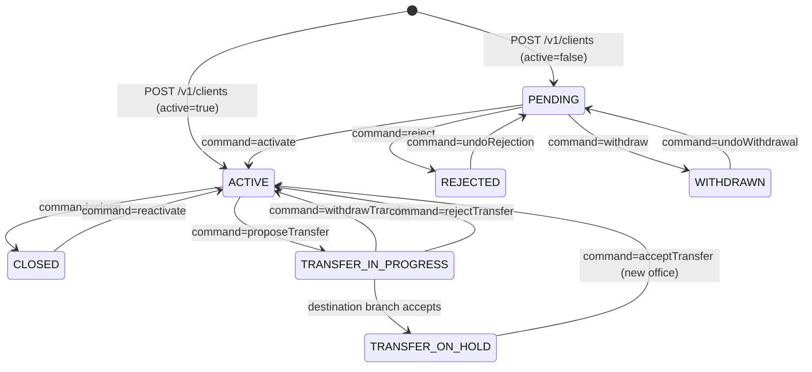

The **Client** is the central entity in Apache Fineract — every loan, savings account, charge, and collateral ultimately belongs to a client. Clients represent natural persons (`LegalForm.PERSON`) or incorporated entities (`LegalForm.ENTITY`) onboarded to an MFI. The domain spans three Java modules: the aggregate root lives in `fineract-core`, the write service and REST layer live in `fineract-provider`, and business events are fired through `fineract-provider`'s event infrastructure.

---

## File Inventory

| File | Module | Purpose |
|------|--------|---------|
| `fineract-core/.../client/domain/Client.java` | fineract-core | JPA entity, table `m_client` |
| `fineract-core/.../client/domain/ClientStatus.java` | fineract-core | Status enum with integer codes |
| `fineract-core/.../client/domain/LegalForm.java` | fineract-core | PERSON / ENTITY enum |
| `fineract-provider/.../client/api/ClientsApiResource.java` | fineract-provider | Primary REST resource `@Path("/v1/clients")` |
| `fineract-provider/.../client/api/ClientAddressApiResource.java` | fineract-provider | Address sub-resource `@Path("/v1/client")` |
| `fineract-provider/.../client/api/ClientFamilyMembersApiResource.java` | fineract-provider | Family members `@Path("/v1/clients/{clientId}/familymembers")` |
| `fineract-provider/.../client/api/ClientIdentifiersApiResource.java` | fineract-provider | Identifiers `@Path("/v1/clients/{clientId}/identifiers")` |
| `fineract-provider/.../client/api/ClientChargesApiResource.java` | fineract-provider | Charges `@Path("/v1/clients/{clientId}/charges")` |
| `fineract-provider/.../client/api/ClientTransactionsApiResource.java` | fineract-provider | Transactions `@Path("/v1/clients/{clientId}/transactions")` |
| `fineract-provider/.../client/api/v2/search/ClientSearchV2ApiResource.java` | fineract-provider | Search v2 `@Path("/v2/clients")` |
| `fineract-provider/.../client/service/ClientWritePlatformService.java` | fineract-provider | Write service interface |
| `fineract-provider/.../client/service/ClientWritePlatformServiceJpaRepositoryImpl.java` | fineract-provider | Write service implementation |
| `fineract-provider/.../client/service/ClientReadPlatformServiceImpl.java` | fineract-provider | Read service, paged search |
| `fineract-provider/.../client/service/search/ClientSearchService.java` | fineract-provider | Full-text search via Spring Data |
| `fineract-provider/.../client/domain/ClientAddress.java` | fineract-provider | Client↔Address join entity, table `m_client_address` |
| `fineract-provider/.../client/domain/ClientFamilyMembers.java` | fineract-provider | Family member entity |
| `fineract-provider/.../address/domain/Address.java` | fineract-provider | Address entity, table `m_address` |
| `fineract-provider/.../event/business/domain/client/ClientCreateBusinessEvent.java` | fineract-provider | Post-create event |
| `fineract-provider/.../event/business/domain/client/ClientActivateBusinessEvent.java` | fineract-provider | Post-activation event |
| `fineract-provider/.../event/business/domain/client/ClientRejectBusinessEvent.java` | fineract-provider | Post-rejection event |

---

## Client Entity (`Client.java`)

`Client` extends `AbstractAuditableWithUTCDateTimeCustom<Long>` and maps to the `m_client` table. The table carries two unique constraints: `account_no_UNIQUE` and `mobile_no_UNIQUE`.

<Tabs>
  <Tab title="Core Identity Fields">

| Column Name | Java Field | Type | Notes |
|---|---|---|---|
| `account_no` | `accountNumber` | `String(20)` | System-generated, unique |
| `external_id` | `externalId` | `ExternalId(100)` | Caller-supplied opaque ID |
| `display_name` | `displayName` | `String(160)` | Computed from first/last or fullname |
| `firstname` | `firstname` | `String(50)` | Person only |
| `middlename` | `middlename` | `String(50)` | Optional, person only |
| `lastname` | `lastname` | `String(50)` | Person only |
| `fullname` | `fullname` | `String(160)` | Entity or one-name person |
| `mobile_no` | `mobileNo` | `String(50)` | Unique across all clients |
| `email_address` | `emailAddress` | `String(50)` | Unique across all clients |
| `date_of_birth` | `dateOfBirth` | `LocalDate` | Person only |
| `is_staff` | `isStaff` | `boolean` | Marks a staff member as a client |

  </Tab>
  <Tab title="Status & Classification Fields">

| Column Name | Java Field | Type | Notes |
|---|---|---|---|
| `status_enum` | `status` | `Integer` | Maps to `ClientStatus` |
| `sub_status` | `subStatus` | `CodeValue` FK | Optional sub-classification |
| `legal_form_enum` | `legalForm` | `Integer` | Maps to `LegalForm` |
| `client_type_cv_id` | `clientType` | `CodeValue` FK | |
| `client_classification_cv_id` | `clientClassification` | `CodeValue` FK | |
| `gender_cv_id` | `gender` | `CodeValue` FK | |

  </Tab>
  <Tab title="Lifecycle & Audit Fields">

| Column Name | Java Field | Notes |
|---|---|---|
| `submittedon_date` | `submittedOnDate` | Application received |
| `activation_date` | `activationDate` | Client activated |
| `office_joining_date` | `officeJoiningDate` | Joined specific office |
| `closedon_date` | `closureDate` | Closed |
| `rejectedon_date` | `rejectionDate` | Rejected |
| `withdrawn_on_date` | `withdrawalDate` | Withdrew application |
| `reactivated_on_date` | `reactivateDate` | Re-activated after close |
| `reopened_on_date` | `reopenedDate` | Undone reject/withdrawal |
| `closedon_userid` | `closedBy` | AppUser FK |
| `activatedon_userid` | `activatedBy` | AppUser FK |
| `rejectedon_userid` | `rejectedBy` | AppUser FK |

  </Tab>
  <Tab title="Relationships">

| Column / Join Table | Java Field | Target |
|---|---|---|
| `office_id` | `office` | `Office` (required) |
| `transfer_to_office_id` | `transferToOffice` | `Office` (transfer target) |
| `staff_id` | `staff` | `Staff` (loan officer) |
| `m_group_client` | `groups` | `Set<Group>` (many-to-many) |
| `default_savings_product` | `savingsProductId` | `Long` (FK) |
| `default_savings_account` | `savingsAccountId` | `Long` (FK) |
| `closure_reason_cv_id` | `closureReason` | `CodeValue` |
| `reject_reason_cv_id` | `rejectionReason` | `CodeValue` |
| `withdraw_reason_cv_id` | `withdrawalReason` | `CodeValue` |

  </Tab>
</Tabs>

---

## `ClientStatus` Enum

Defined in `fineract-core/.../client/domain/ClientStatus.java`. Integer codes are persisted in the `status_enum` column.

| Enum Constant | Integer Code | Code String | Description |
|---|---|---|---|
| `INVALID` | 0 | `clientStatusType.invalid` | Sentinel / default |
| `PENDING` | 100 | `clientStatusType.pending` | Application submitted, not yet active |
| `ACTIVE` | 300 | `clientStatusType.active` | Full member, can hold products |
| `TRANSFER_IN_PROGRESS` | 303 | `clientStatusType.transfer.in.progress` | Being transferred to another office |
| `TRANSFER_ON_HOLD` | 304 | `clientStatusType.transfer.on.hold` | Transfer proposed, awaiting acceptance |
| `CLOSED` | 600 | `clientStatusType.closed` | Left the programme (no active accounts) |
| `REJECTED` | 700 | `clientStatusType.rejected` | Application rejected while PENDING |
| `WITHDRAWN` | 800 | `clientStatusType.withdraw` | Applicant withdrew while PENDING |

<Info>
`ClientEnumerations.status(ClientStatus)` in `fineract-provider/.../client/domain/ClientEnumerations.java` converts any enum value to `EnumOptionData` for JSON serialization. The `ClientStatus.fromInt()` factory method is the canonical parsing path.
</Info>

## `LegalForm` Enum

Defined in `fineract-core/.../client/domain/LegalForm.java`, stored in `legal_form_enum`.

| Constant | Integer | Label |
|---|---|---|
| `PERSON` | 1 | Person |
| `ENTITY` | 2 | Entity |

---

## Client Lifecycle State Machine



<Warning>
A client in `ACTIVE`, `TRANSFER_IN_PROGRESS`, or `TRANSFER_ON_HOLD` cannot be hard-deleted. Only `PENDING` clients may be deleted via `DELETE /v1/clients/{clientId}`.
</Warning>

---

## REST API Reference

### `ClientsApiResource` — `@Path("/v1/clients")`

| Method | Path | Handler Method | Description |
|---|---|---|---|
| `GET` | `/v1/clients` | `retrieveAll(...)` | List clients; supports `officeId`, `externalId`, `displayName`, `firstName`, `lastName`, `status`, `legalForm`, `staffId`, `underHierarchy`, `orphansOnly`, `offset`, `limit`, `orderBy`, `sortOrder` |
| `GET` | `/v1/clients/template` | `retrieveTemplate(...)` | Retrieve creation/closure/rejection template; `commandParam` drives which template |
| `GET` | `/v1/clients/{clientId}` | `retrieveOne(Long, UriInfo, boolean)` | Single client; `?template=true` embeds template data |
| `POST` | `/v1/clients` | `create(String)` | Create client |
| `PUT` | `/v1/clients/{clientId}` | `update(Long, String)` | Update basic fields (not office transfer) |
| `DELETE` | `/v1/clients/{clientId}` | `delete(Long)` | Hard delete (PENDING only) |
| `POST` | `/v1/clients/{clientId}?command=…` | `activate(Long, String, String)` | Lifecycle commands (see table below) |
| `GET` | `/v1/clients/{clientId}/accounts` | `retrieveAssociatedAccounts(Long, UriInfo)` | Loan/savings account summary |
| `GET` | `/v1/clients/{clientId}/obligeedetails` | `retrieveObligeeDetails(Long, UriInfo)` | Guarantor obligee details |
| `GET` | `/v1/clients/{clientId}/transferproposaldate` | `retrieveTransferTemplate(Long, UriInfo)` | Transfer proposal date |
| `GET` | `/v1/clients/external-id/{externalId}` | `retrieveOne(String, UriInfo, boolean)` | Lookup by external ID |
| `PUT` | `/v1/clients/external-id/{externalId}` | `update(String, String)` | Update by external ID |
| `POST` | `/v1/clients/external-id/{externalId}?command=…` | `applyCommand(String, String, String)` | Commands by external ID |
| `DELETE` | `/v1/clients/external-id/{externalId}` | `delete(String)` | Delete by external ID |
| `GET` | `/v1/clients/external-id/{externalId}/accounts` | `retrieveAssociatedAccounts(String, UriInfo)` | Accounts by external ID |
| `GET` | `/v1/clients/downloadtemplate` | `getClientTemplate(...)` | Excel bulk-import template |
| `POST` | `/v1/clients/uploadtemplate` | `postClientTemplate(...)` | Upload Excel bulk-import |

#### `POST /v1/clients/{clientId}?command=…` — Supported Commands

| `command` Value | `CommandWrapper` Builder Call | Effect |
|---|---|---|
| `activate` | `builder.activateClient(clientId)` | PENDING → ACTIVE |
| `close` | `builder.closeClient(clientId)` | ACTIVE → CLOSED |
| `reject` | `builder.rejectClient(clientId)` | PENDING → REJECTED |
| `withdraw` | `builder.withdrawClient(clientId)` | PENDING → WITHDRAWN |
| `reactivate` | `builder.reActivateClient(clientId)` | CLOSED → ACTIVE |
| `undoRejection` | `builder.undoRejection(clientId)` | REJECTED → PENDING |
| `undoWithdrawal` | `builder.undoWithdrawal(clientId)` | WITHDRAWN → PENDING |
| `assignStaff` | `builder.assignClientStaff(clientId)` | Assign loan officer |
| `unassignStaff` | `builder.unassignClientStaff(clientId)` | Remove loan officer |
| `updateSavingsAccount` | `builder.updateClientSavingsAccount(clientId)` | Change default savings |
| `proposeTransfer` | `builder.proposeClientTransfer(clientId)` | ACTIVE → TRANSFER_IN_PROGRESS |
| `proposeAndAcceptTransfer` | `builder.proposeAndAcceptClientTransfer(clientId)` | Direct cross-office transfer |
| `withdrawTransfer` | `builder.withdrawClientTransferRequest(clientId)` | Cancel transfer proposal |
| `acceptTransfer` | `builder.acceptClientTransfer(clientId)` | Accept at destination |
| `rejectTransfer` | `builder.rejectClientTransfer(clientId)` | Reject at destination |

---

## `ClientWritePlatformService`

Interface: `fineract-provider/.../client/service/ClientWritePlatformService.java`  
Implementation: `ClientWritePlatformServiceJpaRepositoryImpl.java`

| Method | Parameters | Returns |
|---|---|---|
| `createClient(JsonCommand)` | JSON payload | `CommandProcessingResult` |
| `updateClient(Long, JsonCommand)` | clientId + JSON | `CommandProcessingResult` |
| `activateClient(Long, JsonCommand)` | clientId + JSON | `CommandProcessingResult` |
| `deleteClient(Long)` | clientId | `CommandProcessingResult` |
| `unassignClientStaff(Long, JsonCommand)` | clientId + JSON | `CommandProcessingResult` |
| `closeClient(Long, JsonCommand)` | clientId + JSON | `CommandProcessingResult` |
| `assignClientStaff(Long, JsonCommand)` | clientId + JSON | `CommandProcessingResult` |
| `updateDefaultSavingsAccount(Long, JsonCommand)` | clientId + JSON | `CommandProcessingResult` |
| `rejectClient(Long, JsonCommand)` | clientId + JSON | `CommandProcessingResult` |
| `withdrawClient(Long, JsonCommand)` | clientId + JSON | `CommandProcessingResult` |
| `reActivateClient(Long, JsonCommand)` | clientId + JSON | `CommandProcessingResult` |
| `undoRejection(Long, JsonCommand)` | clientId + JSON | `CommandProcessingResult` |
| `undoWithdrawal(Long, JsonCommand)` | clientId + JSON | `CommandProcessingResult` |

---

## Sub-Resource APIs

<Accordion title="Address — ClientAddressApiResource">

**Base path:** `@Path("/v1/client")`  
File: `fineract-provider/.../client/api/ClientAddressApiResource.java`

| Method | Path | Description |
|---|---|---|
| `GET` | `/v1/client/addresses/template` | Retrieve address creation template |
| `POST` | `/v1/client/{clientid}/addresses?type={addressTypeId}` | Create address for client |
| `GET` | `/v1/client/{clientid}/addresses?status=…&type=…` | List client addresses filtered by status/type |
| `PUT` | `/v1/client/{clientid}/addresses` | Update client address (requires `type` and `addressId` in body) |

The `Address` entity (`fineract-provider/.../address/domain/Address.java`, table `m_address`) carries: `street`, `addressLine1`, `addressLine2`, `addressLine3`, `townVillage`, `city`, `countyDistrict`, `stateProvince` (CodeValue FK), `country` (CodeValue FK), `postalCode`.  
The join entity `ClientAddress` (`m_client_address`) links `Client` + `Address` + `addressType` (CodeValue) + `isActive` flag.

<Note>Address support is optional and must be enabled via the global configuration `enable-address = true`.</Note>

</Accordion>

<Accordion title="Family Members — ClientFamilyMembersApiResource">

**Base path:** `@Path("/v1/clients/{clientId}/familymembers")`  
File: `fineract-provider/.../client/api/ClientFamilyMembersApiResource.java`

| Method | Path | Description |
|---|---|---|
| `GET` | `/v1/clients/{clientId}/familymembers` | List all family members |
| `GET` | `/v1/clients/{clientId}/familymembers/{familyMemberId}` | Retrieve single family member |
| `GET` | `/v1/clients/{clientId}/familymembers/template` | Retrieve family member template |
| `POST` | `/v1/clients/{clientId}/familymembers` | Add family member (`ClientFamilyMemberRequest`) |
| `PUT` | `/v1/clients/{clientId}/familymembers/{familyMemberId}` | Update family member |
| `DELETE` | `/v1/clients/{clientId}/familymembers/{familyMemberId}` | Delete family member |

Entity: `ClientFamilyMembers.java` — persists relationship, age, firstName, middleName, lastName, gender, qualification, dateOfBirth, mobileNo, isDependent, maritalStatus.

</Accordion>

<Accordion title="Identifiers — ClientIdentifiersApiResource">

**Base path:** `@Path("/v1/clients/{clientId}/identifiers")`  
File: `fineract-provider/.../client/api/ClientIdentifiersApiResource.java`

| Method | Path | Description |
|---|---|---|
| `GET` | `/v1/clients/{clientId}/identifiers` | List all identifiers |
| `GET` | `/v1/clients/{clientId}/identifiers/template` | Template (allowedDocumentTypes from code `Customer Identifier`) |
| `GET` | `/v1/clients/{clientId}/identifiers/{identifierId}` | Retrieve single identifier |
| `POST` | `/v1/clients/{clientId}/identifiers` | Create identifier (`ClientIdentifierRequest`: `documentTypeId`, `documentKey`) |
| `PUT` | `/v1/clients/{clientId}/identifiers/{identifierId}` | Update identifier |
| `DELETE` | `/v1/clients/{clientId}/identifiers/{identifierId}` | Delete identifier |

`ClientIdentifierData` fields: `id`, `clientId`, `documentType` (EnumOptionData), `documentKey`, `description`, `allowedDocumentTypes`.  
Duplicate key detection throws `DuplicateClientIdentifierException`; the handler enriches the error with the conflicting client's name and office.

</Accordion>

<Accordion title="Charges — ClientChargesApiResource">

**Base path:** `@Path("/v1/clients/{clientId}/charges")`

| Method | Path | Description |
|---|---|---|
| `GET` | `/v1/clients/{clientId}/charges` | List charges |
| `GET` | `/v1/clients/{clientId}/charges/template` | Template |
| `GET` | `/v1/clients/{clientId}/charges/{chargeId}` | Single charge |
| `POST` | `/v1/clients/{clientId}/charges` | Apply charge |
| `POST` | `/v1/clients/{clientId}/charges/{chargeId}?command=pay\|waive` | Pay or waive charge |
| `DELETE` | `/v1/clients/{clientId}/charges/{chargeId}` | Delete charge |

</Accordion>

---

## Client Search V2

File: `fineract-provider/.../client/api/v2/search/ClientSearchV2ApiResource.java`  
Service: `fineract-provider/.../client/service/search/ClientSearchService.java`

```
POST /v2/clients/search
Content-Type: application/json

{
  "request": { "text": "john" },
  "page": 0,
  "size": 20
}
```

`ClientSearchService.searchByText(PagedRequest<ClientTextSearch>)` delegates to `ClientRepository.searchByText(text, pageable, hierarchy)`. The `hierarchy` parameter scopes results to the authenticated user's office subtree.

Response is `Page<ClientSearchData>` containing: `id`, `displayName`, `externalId`, `accountNumber`, `officeId`, `officeName`, `mobileNo`, `status` (EnumOptionData), `activationDate`, `createdDate`.

---

## Business Events

All client business events extend `ClientBusinessEvent` (`fineract-provider/.../event/business/domain/client/ClientBusinessEvent.java`), which in turn wraps a `Client` aggregate. Events are fired via `BusinessEventNotifierService.notifyPostBusinessEvent(...)` inside `ClientWritePlatformServiceJpaRepositoryImpl`.

| Event Class | Type String | Trigger |
|---|---|---|
| `ClientCreateBusinessEvent` | `"ClientCreateBusinessEvent"` | After `createClient()` persists |
| `ClientActivateBusinessEvent` | `"ClientActivateBusinessEvent"` | After `activateClient()` or when created active |
| `ClientRejectBusinessEvent` | `"ClientRejectBusinessEvent"` | After `rejectClient()` |

<Tip>
Downstream systems (e.g., external notification services) should listen for `ClientActivateBusinessEvent` to trigger onboarding workflows; the event carries the full `Client` JPA entity as payload.
</Tip>

---

## Control & Data Flow

<Steps>
  <Step title="HTTP Request arrives at ClientsApiResource">
    JAX-RS routes to the correct method. `PlatformSecurityContext` validates authentication and `READ_CLIENT` / `CREATE_CLIENT` permission.
  </Step>
  <Step title="Command Wrapper constructed">
    `CommandWrapperBuilder` produces a `CommandWrapper` containing the entity type, action, entity ID, and JSON payload.
  </Step>
  <Step title="PortfolioCommandSourceWritePlatformService.logCommandSource()">
    The command is persisted in the audit trail (`m_portfolio_command_source`), then the appropriate command handler is dispatched.
  </Step>
  <Step title="Handler invokes ClientWritePlatformService">
    E.g., `CreateClientCommandHandler` → `ClientWritePlatformServiceJpaRepositoryImpl.createClient()`. The implementation validates via `ClientDataValidator`, builds the `Client` aggregate, sets status, then calls `clientRepository.saveAndFlush()`.
  </Step>
  <Step title="Business event fired">
    `businessEventNotifierService.notifyPostBusinessEvent(new ClientCreateBusinessEvent(newClient))` is called within the same transaction.
  </Step>
  <Step title="CommandProcessingResult returned">
    Contains `officeId`, `clientId`, `resourceId`, and `changes` map, serialized to JSON.
  </Step>
</Steps>

---

## Gotchas & Invariants

<CardGroup cols={2}>
  <Card title="Hard Delete Restriction" icon="trash">
    `ClientMustBePendingToBeDeletedException` is thrown if `deleteClient()` is called on any non-PENDING client. Check `client.isPending()` before attempting deletion.
  </Card>
  <Card title="Mobile / Email Uniqueness" icon="phone">
    `mobile_no_UNIQUE` and `email_address` uniqueness are enforced at the DB level. Duplicate inserts will throw constraint violations, not `PlatformApiDataValidationException`.
  </Card>
  <Card title="External ID Type" icon="id-badge">
    `externalId` is of type `ExternalId` (value object in fineract-core), not plain `String`. Lookups must use `ExternalIdFactory.produce(String)` which may return `ExternalId.empty()` — always call `throwExceptionIfEmpty()` before use.
  </Card>
  <Card title="Transfer State Complexity" icon="arrows-left-right">
    During `TRANSFER_IN_PROGRESS`/`TRANSFER_ON_HOLD`, the client's `transferToOffice` field is set, but `office` is unchanged until the transfer is accepted. Active JLG loans are rescheduled to match the destination group meeting calendar on acceptance.
  </Card>
</CardGroup>
