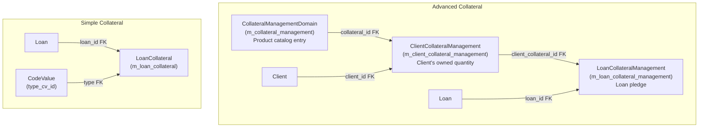

Apache Fineract provides **two distinct collateral sub-systems** that co-exist in the codebase. The **simple (legacy)** system uses `LoanCollateral` — a code-value typed attachment directly on a loan. The **advanced (management)** system introduces a full asset lifecycle: collateral products are defined at a global level, clients hold inventory of those products (`ClientCollateralManagement`), and loans draw down from that inventory (`LoanCollateralManagement`). When a loan closes, the pledged quantity is returned to the client's inventory.

---

## File Inventory

<CardGroup cols={2}>
  <Card title="Simple Collateral" icon="tag">
    - `fineract-loan/.../collateral/domain/LoanCollateral.java` — entity, table `m_loan_collateral`
    - `fineract-loan/.../collateral/data/CollateralData.java` — read-side DTO
    - `fineract-loan/.../collateral/api/CollateralApiConstants.java` — JSON param constants
  </Card>
  <Card title="Advanced Collateral Management" icon="warehouse">
    - `fineract-loan/.../collateralmanagement/domain/CollateralManagementDomain.java` — product entity, table `m_collateral_management`
    - `fineract-loan/.../collateralmanagement/domain/ClientCollateralManagement.java` — client inventory, table `m_client_collateral_management`
    - `fineract-loan/.../loanaccount/domain/LoanCollateralManagement.java` — loan pledge, table `m_loan_collateral_management`
    - `fineract-core/.../collateralmanagement/data/ClientCollateralManagementData.java` — client collateral DTO
    - `fineract-provider/.../collateralmanagement/api/CollateralManagementApiResource.java` — `@Path("/v1/collateral-management")`
    - `fineract-provider/.../collateralmanagement/api/ClientCollateralManagementApiResource.java` — `@Path("/v1/clients/{clientId}/collaterals")`
    - `fineract-provider/.../collateralmanagement/api/LoanCollateralManagementApiResource.java` — `@Path("/v1/loan-collateral-management")`
    - `fineract-provider/.../collateralmanagement/service/CollateralManagementWriteService.java`
    - `fineract-provider/.../collateralmanagement/service/ClientCollateralManagementWriteService.java`
    - `fineract-provider/.../collateralmanagement/service/LoanCollateralManagementWriteService.java`
  </Card>
</CardGroup>

---

## Architecture Overview



---

## Simple Collateral — `LoanCollateral`

### Entity Fields

File: `fineract-loan/.../collateral/domain/LoanCollateral.java`  
Table: `m_loan_collateral`

| Column | Java Field | Type | Notes |
|---|---|---|---|
| `id` | (inherited) | `Long` | Primary key |
| `loan_id` | `loan` | `Loan` FK | Non-null |
| `type_cv_id` | `type` | `CodeValue` FK | Collateral type (from code name `LoanCollateralType`) |
| `value` | `value` | `BigDecimal(19,6)` | Declared monetary value |
| `description` | `description` | `String(500)` | Free text description |

### Factory Methods

```java
// LoanCollateral.java
LoanCollateral.from(CodeValue collateralType, BigDecimal value, String description)
LoanCollateral.fromJson(Loan loan, CodeValue collateralType, JsonCommand command)
```

### `CollateralData` DTO

File: `fineract-loan/.../collateral/data/CollateralData.java`

| Field | Type | Notes |
|---|---|---|
| `id` | `Long` | |
| `type` | `CodeValueData` | Collateral type |
| `value` | `BigDecimal` | |
| `description` | `String` | |
| `allowedCollateralTypes` | `Collection<CodeValueData>` | Populated on template requests |
| `currency` | `CurrencyData` | |

### JSON Parameters (`CollateralApiConstants.java` / `CollateralJSONinputParams`)

| Param | Field | Type |
|---|---|---|
| `collateralTypeId` | `COLLATERAL_TYPE_ID` | Long |
| `value` | `VALUE` | BigDecimal |
| `description` | `DESCRIPTION` | String |

<Note>
Simple collateral is accessed through the loans sub-resource: `GET /v1/loans/{loanId}/collaterals`, `POST /v1/loans/{loanId}/collaterals`, `PUT /v1/loans/{loanId}/collaterals/{collateralId}`, `DELETE /v1/loans/{loanId}/collaterals/{collateralId}`. These endpoints are registered on the `LoanApiResource` and delegated to the loan write service.
</Note>

---

## Advanced Collateral Management

### `CollateralManagementDomain` — Product Catalog

File: `fineract-loan/.../collateralmanagement/domain/CollateralManagementDomain.java`  
Table: `m_collateral_management`

| Column | Java Field | Type | Notes |
|---|---|---|---|
| `id` | (inherited) | `Long` | PK |
| `name` | `name` | `String(20)` | Product name |
| `quality` | `quality` | `String(40)` | Quality descriptor (e.g., "22 karat gold") |
| `base_price` | `basePrice` | `BigDecimal(20,5)` | Market price per unit |
| `unit_type` | `unitType` | `String(10)` | Unit of measure (grams, pieces, etc.) |
| `pct_to_base` | `pctToBase` | `BigDecimal(20,5)` | Percentage of base price accepted as collateral |
| `currency` | `currency` | `ApplicationCurrency` FK | Currency of base price |

Built via `@Builder` on `CollateralManagementDomain`. The effective collateral value is: `quantity × basePrice × (pctToBase / 100)`.

### `ClientCollateralManagement` — Client Inventory

File: `fineract-loan/.../collateralmanagement/domain/ClientCollateralManagement.java`  
Table: `m_client_collateral_management`

| Column | Java Field | Type | Notes |
|---|---|---|---|
| `id` | (inherited) | `Long` | PK |
| `quantity` | `quantity` | `BigDecimal(20,5)` | Units owned by client |
| `client_id` | `client` | `Client` FK | Non-null |
| `collateral_id` | `collateral` | `CollateralManagementDomain` FK | Product reference |

**Computed properties** (not persisted):

| Method | Computation | Description |
|---|---|---|
| `getTotal()` | `quantity × collateral.basePrice` | Total monetary value at base price |
| `getTotalCollateral(BigDecimal total)` | `total × (pctToBase / 100)` | Lendable collateral value |

**Quantity management methods:**

```java
void updateQuantity(BigDecimal quantity)           // Replace quantity (used when pledging)
void updateQuantityAfterLoanClosed(BigDecimal qty) // Add back (quantity = quantity + qty)
```

The `loanCollateralManagementSet: Set<LoanCollateralManagement>` tracks all active loan pledges against this client inventory entry.

### `LoanCollateralManagement` — Loan Pledge

File: `fineract-loan/.../loanaccount/domain/LoanCollateralManagement.java`  
Table: `m_loan_collateral_management`

| Column | Java Field | Type | Notes |
|---|---|---|---|
| `id` | (inherited) | `Long` | PK |
| `quantity` | `quantity` | `BigDecimal(20,5)` | Units pledged to this loan |
| `loan_id` | `loan` | `Loan` FK | Non-null |
| `client_collateral_id` | `clientCollateralManagement` | `ClientCollateralManagement` FK | Source inventory |
| `transaction_id` | `loanTransaction` | `LoanTransaction` FK | Release transaction (nullable) |
| `is_released` | `isReleased` | `boolean` | True after loan closure releases collateral |

Factory methods:

```java
LoanCollateralManagement.from(ClientCollateralManagement ccm, BigDecimal quantity)
LoanCollateralManagement.fromExisting(ClientCollateralManagement ccm, BigDecimal qty, Loan loan, LoanTransaction tx, Long id)
```

### `ClientCollateralManagementData` DTO

File: `fineract-core/.../collateralmanagement/data/ClientCollateralManagementData.java`

| Field | Type | Notes |
|---|---|---|
| `name` | `String` | Collateral product name |
| `quantity` | `BigDecimal` | Current owned quantity |
| `total` | `BigDecimal` | `quantity × basePrice` |
| `totalCollateral` | `BigDecimal` | Lendable value (`total × pctToBase/100`) |
| `clientId` | `Long` | |
| `loanTransactionData` | `List<LoanTransactionData>` | Associated loan pledges |
| `id` | `Long` | `ClientCollateralManagement` PK |

### `CollateralManagementData` DTO

File: `fineract-provider/.../collateralmanagement/data/CollateralManagementData.java`

| Field | Type | Notes |
|---|---|---|
| `id` | `Long` | Product ID |
| `name` | `String` | |
| `quality` | `String` | |
| `basePrice` | `BigDecimal` | |
| `unitType` | `String` | |
| `pctToBase` | `BigDecimal` | |
| `currency` | `String` | Currency code |

---

## REST API Reference

### `CollateralManagementApiResource` — `@Path("/v1/collateral-management")`

File: `fineract-provider/.../collateralmanagement/api/CollateralManagementApiResource.java`  
Uses `CommandDispatcher` with typed command/response objects (not `CommandWrapper`/`PortfolioCommandSourceWritePlatformService`).

| Method | Path | Request Type | Response Type | Description |
|---|---|---|---|---|
| `POST` | `/v1/collateral-management` | `CollateralProductCreateRequest` | `CollateralProductCreateResponse` | Create collateral product |
| `GET` | `/v1/collateral-management/{collateralId}` | — | `CollateralManagementData` | Get single product |
| `GET` | `/v1/collateral-management` | — | `List<CollateralManagementData>` | List all products |
| `GET` | `/v1/collateral-management/template` | — | `List<CurrencyData>` | Available currencies |
| `PUT` | `/v1/collateral-management/{collateralId}` | `CollateralProductUpdateRequest` | `CollateralProductUpdateResponse` | Update product |
| `DELETE` | `/v1/collateral-management/{collateralId}` | — | `CollateralProductDeleteResponse` | Delete product |

`CollateralProductCreateRequest` fields (all validated with Jakarta Bean Validation):

| Field | Constraint | Description |
|---|---|---|
| `name` | `@NotBlank` | Product name |
| `quality` | `@NotBlank` | Quality descriptor |
| `basePrice` | `@NotNull @Positive` | Market price per unit |
| `pctToBase` | `@NotNull @Positive` | Collateral coverage % |
| `unitType` | `@NotBlank` | Unit of measure |
| `currency` | `@NotBlank` | ISO currency code |
| `locale` | `@NotBlank` | Locale for number parsing |

<Warning>
A collateral product cannot be deleted if any `ClientCollateralManagement` records reference it. `CollateralCannotBeDeletedException` is thrown in that case. Deactivate by updating `pctToBase` to zero instead.
</Warning>

---

### `ClientCollateralManagementApiResource` — `@Path("/v1/clients/{clientId}/collaterals")`

File: `fineract-provider/.../collateralmanagement/api/ClientCollateralManagementApiResource.java`

| Method | Path | Request Type | Response Type | Description |
|---|---|---|---|---|
| `GET` | `/v1/clients/{clientId}/collaterals` | `?prodId=` (optional) | `List<ClientCollateralManagementData>` | Get client's collateral inventory (optionally filtered by product) |
| `GET` | `/v1/clients/{clientId}/collaterals/{clientCollateralId}` | — | `ClientCollateralManagementData` | Get single client collateral entry |
| `GET` | `/v1/clients/{clientId}/collaterals/template` | — | `List<LoanCollateralTemplateData>` | Template: available products not yet held |
| `POST` | `/v1/clients/{clientId}/collaterals` | `ClientCollateralCreateRequest` | `ClientCollateralCreateResponse` | Add collateral to client inventory |
| `PUT` | `/v1/clients/{clientId}/collaterals/{collateralId}` | `ClientCollateralUpdateRequest` | `ClientCollateralUpdateResponse` | Update quantity on a client collateral |
| `DELETE` | `/v1/clients/{clientId}/collaterals/{collateralId}` | — | `ClientCollateralDeleteResponse` | Remove from client inventory |

`ClientCollateralCreateRequest` key fields: `clientId` (set from path), `collateralId` (product ID), `quantity`.  
`ClientCollateralUpdateRequest` key fields: `clientId`, `collateralId`, `quantity`, `locale`.

<Note>
`ClientCollateralManagementWriteServiceImpl.deleteClientCollateralProduct()` guards deletion: it iterates `ClientCollateralManagement.loanCollateralManagementSet` and throws `ClientCollateralCannotBeDeletedException` if any `LoanCollateralManagement` row has `isReleased = false`. This prevents removing collateral that is still pledged to an active loan.
</Note>

---

### `LoanCollateralManagementApiResource` — `@Path("/v1/loan-collateral-management")`

File: `fineract-provider/.../collateralmanagement/api/LoanCollateralManagementApiResource.java`

| Method | Path | Description |
|---|---|---|
| `GET` | `/v1/loan-collateral-management/{collateralId}` | Get `LoanCollateralResponseData` for a loan collateral pledge |
| `DELETE` | `/v1/loan-collateral-management/{id}` | Delete a loan collateral pledge and return quantity to client inventory |

---

## Service Layer

### `CollateralManagementWriteService`

```java
// CollateralManagementWriteService.java
CollateralProductCreateResponse createCollateralProduct(CollateralProductCreateRequest request);
CollateralProductUpdateResponse updateCollateralProduct(CollateralProductUpdateRequest request);
CollateralProductDeleteResponse deleteCollateralProduct(CollateralProductDeleteRequest request);
```

### `ClientCollateralManagementWriteService`

```java
// ClientCollateralManagementWriteService.java
ClientCollateralCreateResponse createClientCollateralProduct(ClientCollateralCreateRequest request);
ClientCollateralUpdateResponse updateClientCollateralProduct(ClientCollateralUpdateRequest request);
ClientCollateralDeleteResponse deleteClientCollateralProduct(ClientCollateralDeleteRequest request);
```

### `LoanCollateralManagementWriteService`

```java
// LoanCollateralManagementWriteService.java
LoanCollateralDeleteResponse deleteLoanCollateral(LoanCollateralDeleteRequest request);
```

`LoanCollateralManagementWriteServiceImpl.deleteLoanCollateral()` performs the release atomically:

```java
// 1. Load the loan pledge
LoanCollateralManagement lcm = loanCollateralManagementRepository.findById(id).orElseThrow();
// 2. Get the client inventory entry
ClientCollateralManagement ccm = lcm.getClientCollateralManagement();
// 3. Add pledged quantity back to client inventory
ccm.updateQuantity(ccm.getQuantity().add(lcm.getQuantity()));
clientCollateralManagementRepositoryWrapper.saveAndFlush(ccm);
// 4. Delete the pledge record
loanCollateralManagementRepository.deleteById(id);
```

---

## Collateral Release on Loan Closure

<Steps>
  <Step title="Loan is rejected or application is undone">
    `LoanApplicationWritePlatformServiceJpaRepositoryImpl` (`fineract-provider/.../loanaccount/service/`) triggers collateral release via its private `releaseAttachedCollaterals(Loan loan)` helper or inline release logic.
  </Step>
  <Step title="All LoanCollateralManagement rows for the loan are iterated">
    The service iterates `loan.getLoanCollateralManagements()` — every `LoanCollateralManagement` row linked to the loan.
  </Step>
  <Step title="isReleased flag set to true">
    Each `LoanCollateralManagement.isReleased` is set to `true` and the row is updated in the same transaction.
  </Step>
  <Step title="Client inventory restored">
    `ClientCollateralManagement.updateQuantity(currentQty.add(pledgedQty))` is called, which adds the pledged units back into the client's free inventory. The `updateQuantityAfterLoanClosed(quantity)` convenience method (defined as `this.quantity = this.quantity.add(quantity)`) is used in the undo-application path.
  </Step>
</Steps>

<Info>
After release, the `LoanCollateralManagement` row is retained (with `is_released = true`) for audit purposes. The quantity is not physically deleted until `DELETE /v1/loan-collateral-management/{id}` is called explicitly.
</Info>

<Note>
`LoanCollateralAssembler` (`fineract-provider/.../collateralmanagement/service/LoanCollateralAssembler.java`) is used during **loan creation and modification** to parse the collateral JSON array and build `LoanCollateralManagement` objects — it does not participate in the release/closure path.
</Note>

---

## Quantity Accounting Model

The collateral system tracks three quantities:

| Concept | Computed From | Purpose |
|---|---|---|
| **Total inventory** | `ClientCollateralManagement.quantity` | Units the client currently owns (free + pledged?) — actually represents the *free/available* quantity after pledges are deducted at pledge time |
| **Pledged** | `LoanCollateralManagement.quantity` (per pledge) | Units committed to a specific loan |
| **Total value** | `quantity × basePrice` via `getTotal()` | Monetary value at base price |
| **Lendable collateral** | `getTotal() × (pctToBase / 100)` via `getTotalCollateral()` | Amount the client can borrow against |

When a loan is created and collateral is pledged:
- `ClientCollateralManagement.quantity` is **reduced** by the pledged amount.
- A `LoanCollateralManagement` row is created with the pledged quantity and `isReleased = false`.

When the loan is rejected or its application is undone:
- `ClientCollateralManagement.quantity` is **increased** by the released amount (via `updateQuantity(qty.add(pledged))` or `updateQuantityAfterLoanClosed(pledged)`).
- `LoanCollateralManagement.isReleased` is set to `true`.

---

## Gotchas & Invariants

<CardGroup cols={2}>
  <Card title="Two Parallel Systems" icon="arrows-split-up-and-left">
    `m_loan_collateral` (simple) and `m_loan_collateral_management` (advanced) are completely separate tables and code paths. A loan can have entries in both. The advanced system is preferred for new integrations.
  </Card>
  <Card title="Delete Guard on Active Pledge" icon="lock">
    `ClientCollateralCannotBeDeletedException` (with reason `CLIENT_COLLATERAL_IS_ALREADY_ATTACHED`) prevents deletion of client inventory while any associated `LoanCollateralManagement` has `isReleased = false`. Always close/settle loans before removing client collateral.
  </Card>
  <Card title="pctToBase Arithmetic" icon="percent">
    `pctToBase` in `CollateralManagementDomain` is stored as a whole percentage (e.g., `80` for 80%). The `getTotalCollateral()` method divides by 100: `total.multiply(pctToBase.divide(BigDecimal.valueOf(100)))`. Ensure `pctToBase` is always > 0 to avoid zero lendable value.
  </Card>
  <Card title="Currency Mismatch" icon="money-bill">
    `CollateralManagementDomain.currency` is an `ApplicationCurrency`. The `basePrice` is denominated in this currency. There is no automatic conversion if the loan currency differs — the UI/API consumer must reconcile.
  </Card>
  <Card title="Insufficient Collateral Guard" icon="shield-exclamation">
    `LoanCollateralAmountNotSufficientException` is thrown during loan approval if the pledged collateral's total lendable value is below the required threshold. This check lives in the loan approval workflow, not in the collateral service itself.
  </Card>
  <Card title="Command Dispatcher vs CommandWrapper" icon="route">
    The advanced collateral APIs use `CommandDispatcher` (fineract-command module) with typed command objects (`CollateralProductCreateCommand`, etc.) rather than the `PortfolioCommandSourceWritePlatformService` / `CommandWrapper` pattern used by most other resources. This means collateral commands are **not** stored in `m_portfolio_command_source` (audit log).
  </Card>
</CardGroup>

---

## Exception Inventory

| Exception Class | When Thrown |
|---|---|
| `CollateralNotFoundException` | `CollateralManagementDomain` not found by ID |
| `CollateralCannotBeDeletedException` | Product has active client assignments |
| `ClientCollateralNotFoundException` | `ClientCollateralManagement` not found by ID |
| `ClientCollateralCannotBeDeletedException` | Client collateral has unreleased loan pledges |
| `LoanCollateralManagementNotFoundException` | `LoanCollateralManagement` not found by ID |
| `LoanCollateralAmountNotSufficientException` | Pledged collateral value below loan requirement |
