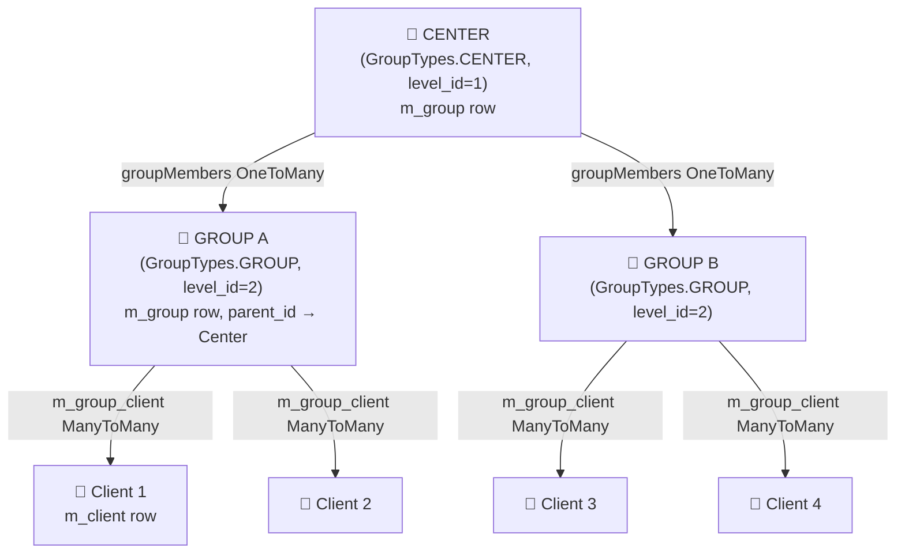
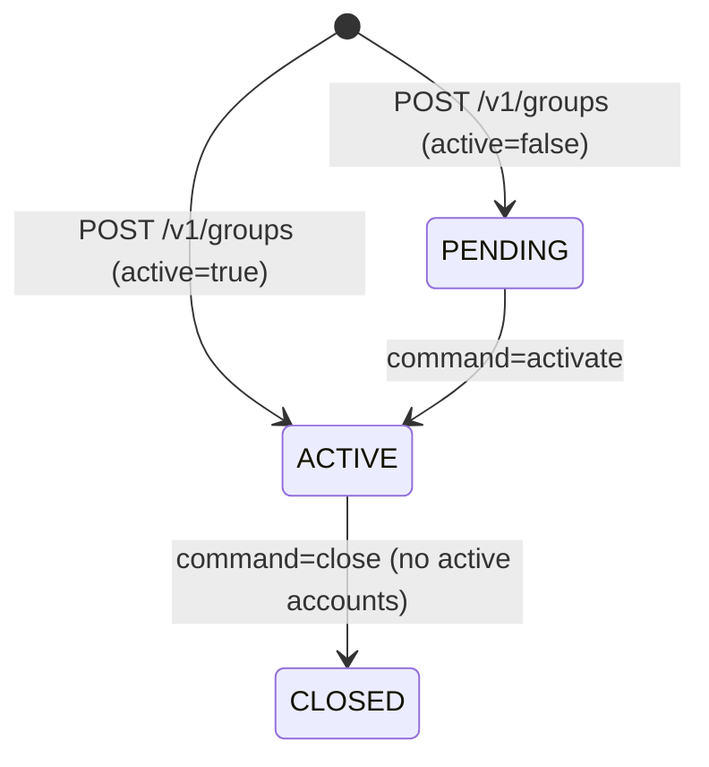

Groups and Centers implement **grameen-style** and **joint-liability group (JLG) lending** patterns in Apache Fineract. A **Center** (`GroupTypes.CENTER`) is the top-level administrative unit that aggregates multiple **Groups** (`GroupTypes.GROUP`), each of which contains individual clients. This three-tier hierarchy — Center → Group → Client — drives collection sheet generation, meeting scheduling, and GLIM/GSIM account management. Both `Group` and `Center` share a single JPA entity (`Group.java`) and are distinguished by their `GroupLevel`.

---

## File Inventory

| File | Module | Purpose |
|------|--------|---------|
| `fineract-core/.../group/domain/Group.java` | fineract-core | JPA entity, table `m_group` |
| `fineract-core/.../group/domain/GroupLevel.java` | fineract-core | Level descriptor (CENTER=1, GROUP=2) |
| `fineract-core/.../group/domain/GroupRole.java` | fineract-core | `m_group_roles` join entity |
| `fineract-core/.../group/domain/GroupTypes.java` | fineract-core | CENTER/GROUP enum |
| `fineract-core/.../group/domain/GroupingTypeStatus.java` | fineract-core | PENDING/ACTIVE/CLOSED enum |
| `fineract-core/.../group/data/GroupGeneralData.java` | fineract-core | Read-side DTO |
| `fineract-core/.../group/data/CenterData.java` | fineract-core | Center-specific DTO |
| `fineract-core/.../group/data/GroupRoleData.java` | fineract-core | Role read DTO |
| `fineract-provider/.../group/api/GroupsApiResource.java` | fineract-provider | `@Path("/v1/groups")` |
| `fineract-provider/.../group/api/CentersApiResource.java` | fineract-provider | `@Path("/v1/centers")` |
| `fineract-provider/.../group/api/GroupsLevelApiResource.java` | fineract-provider | `@Path("/v1/grouplevels")` |
| `fineract-provider/.../group/service/GroupingTypesWritePlatformService.java` | fineract-provider | Write service interface |
| `fineract-provider/.../group/service/GroupingTypesWritePlatformServiceJpaRepositoryImpl.java` | fineract-provider | Write service implementation |
| `fineract-provider/.../group/service/GroupReadPlatformService.java` | fineract-provider | Group read service |
| `fineract-provider/.../group/service/CenterReadPlatformService.java` | fineract-provider | Center read service |
| `fineract-provider/.../group/service/GroupRolesWritePlatformService.java` | fineract-provider | Role write service |
| `fineract-provider/.../collectionsheet/api/CollectionSheetApiResource.java` | fineract-provider | `@Path("/v1/collectionsheet")` |
| `fineract-provider/.../calendar/api/CalendarsApiResource.java` | fineract-provider | `@Path("/v1/{entityType}/{entityId}/calendars")` |
| `fineract-provider/.../meeting/api/MeetingsApiResource.java` | fineract-provider | `@Path("/v1/{entityType}/{entityId}/meetings")` |

---

## Center → Group → Client Hierarchy



<Info>
Both Center and Group rows live in `m_group`. The `level_id` FK references `m_group_level`. A Group's `parent_id` points to its Center row. Clients are linked through the `m_group_client` join table.
</Info>

---

## Group Entity (`Group.java`)

Maps to table `m_group` in `fineract-core/.../group/domain/Group.java`. Extends `AbstractPersistableCustom<Long>`.

| Column | Java Field | Type | Notes |
|---|---|---|---|
| `account_no` | `accountNumber` | `String(20)` | System-generated, unique |
| `external_id` | `externalId` | `String(100)` | Unique, caller-supplied |
| `status_enum` | `status` | `Integer` | Maps to `GroupingTypeStatus` |
| `display_name` | `name` | `String(100)` | Unique across all groups |
| `hierarchy` | `hierarchy` | `String(100)` | Materialized path (e.g. `.1.5.`) |
| `office_id` | `office` | `Office` FK | Required |
| `staff_id` | `staff` | `Staff` FK | Assigned loan officer |
| `parent_id` | `parent` | `Group` FK | Center (if group), null (if center) |
| `level_id` | `groupLevel` | `GroupLevel` FK | 1=CENTER, 2=GROUP |
| `activation_date` | `activationDate` | `LocalDate` | |
| `submittedon_date` | `submittedOnDate` | `LocalDate` | |
| `closedon_date` | `closureDate` | `LocalDate` | |
| `closure_reason_cv_id` | `closureReason` | `CodeValue` FK | |
| `m_group_client` (join) | `clientMembers` | `Set<Client>` | Direct members |
| `parent_id` (child) | `groupMembers` | `List<Group>` | Child groups (if CENTER) |
| `m_group_roles` | `groupRole` | `Set<GroupRole>` | Assigned roles |

---

## `GroupTypes` Enum

Defined in `fineract-core/.../group/domain/GroupTypes.java`.

| Constant | Long ID | Code | Value String |
|---|---|---|---|
| `INVALID` | 0 | `groupTypes.invalid` | `invalid` |
| `CENTER` | 1 | `groupTypes.center` | `center` |
| `GROUP` | 2 | `groupTypes.group` | `group` |

## `GroupingTypeStatus` Enum

Defined in `fineract-core/.../group/domain/GroupingTypeStatus.java`. Mirrors `ClientStatus` integer codes.

| Constant | Integer | Code String |
|---|---|---|
| `INVALID` | 0 | `groupingStatusType.invalid` |
| `PENDING` | 100 | `groupingStatusType.pending` |
| `ACTIVE` | 300 | `groupingStatusType.active` |
| `TRANSFER_IN_PROGRESS` | 303 | `clientStatusType.transfer.in.progress` |
| `TRANSFER_ON_HOLD` | 304 | `clientStatusType.transfer.on.hold` |
| `CLOSED` | 600 | `groupingStatusType.closed` |

---

## Group Lifecycle State Machine



<Warning>
A group can only be deleted (`DELETE /v1/groups/{groupId}`) when it is in `PENDING` state AND has no client associations, no loans, and no savings. `GroupMustBePendingToBeDeletedException` is thrown otherwise.
</Warning>

---

## REST API Reference

### `GroupsApiResource` — `@Path("/v1/groups")`

| Method | Path | Handler Method | Description |
|---|---|---|---|
| `GET` | `/v1/groups/template` | `retrieveTemplate(...)` | Closure/creation template; `centerId` returns center-group template |
| `GET` | `/v1/groups` | `retrieveAll(...)` | List groups; `officeId`, `staffId`, `externalId`, `name`, `underHierarchy`, `paged`, `offset`, `limit`, `orderBy`, `sortOrder`, `orphansOnly` |
| `GET` | `/v1/groups/{groupId}` | `retrieveOne(...)` | Single group; `?associations=clientMembers,activeClientMembers,groupRoles,parentCalendars,collectionMeetingCalendar` |
| `POST` | `/v1/groups` | `create(String)` | Create group |
| `PUT` | `/v1/groups/{groupId}` | `update(Long, String)` | Update group |
| `DELETE` | `/v1/groups/{groupId}` | `delete(Long)` | Hard delete (PENDING only) |
| `POST` | `/v1/groups/{groupId}/command/unassign_staff` | `unassignLoanOfficer(Long, String)` | Unassign staff from group |
| `POST` | `/v1/groups/{groupId}?command=…` | `activateOrGenerateCollectionSheet(...)` | Lifecycle and collection commands |
| `GET` | `/v1/groups/{groupId}/accounts` | `retrieveAccounts(Long, UriInfo)` | Account summary (loans, savings) |
| `GET` | `/v1/groups/{groupId}/glimaccounts` | `retrieveglimAccounts(Long, ...)` | GLIM loan accounts |
| `GET` | `/v1/groups/{groupId}/gsimaccounts` | `retrieveGsimAccounts(Long, ...)` | GSIM savings accounts |
| `GET` | `/v1/groups/downloadtemplate` | — | Excel bulk-import template |
| `POST` | `/v1/groups/uploadtemplate` | `postGroupTemplate(...)` | Upload Excel bulk-import |

#### `POST /v1/groups/{groupId}?command=…` — Supported Commands

| `command` | Wrapped As | Effect |
|---|---|---|
| `activate` | `activateGroupOrCenter` | PENDING → ACTIVE |
| `close` | `closeGroup` | ACTIVE → CLOSED |
| `associateClients` | `associateClientsToGroup` | Add clients via `m_group_client` |
| `disassociateClients` | `disassociateClientsFromGroup` | Remove clients from group |
| `generateCollectionSheet` | (read, no command) | Returns `JLGCollectionSheetData` |
| `saveCollectionSheet` | `saveGroupCollectionSheet` | Bulk repayment/disbursal |
| `assignStaff` | `assignGroupOrCenterStaff` | Assign loan officer |
| `unassignStaff` | `unassignGroupOrCenterStaff` | Remove loan officer |
| `assignRole` | `createRole` | Assign a group role |
| `unassignRole` | `deleteRole` | Remove a group role |
| `updateRole` | `updateRole` | Update role attributes |

---

### `CentersApiResource` — `@Path("/v1/centers")`

| Method | Path | Handler Method | Description |
|---|---|---|---|
| `GET` | `/v1/centers/template` | `retrieveTemplate(...)` | Creation/closure template |
| `GET` | `/v1/centers` | `retrieveAll(...)` | List centers; `officeId`, `staffId`, `externalId`, `name`, `underHierarchy`, `paged`, `offset`, `limit`, `orderBy`, `sortOrder`; `meetingDate`+`officeId` returns `StaffCenterData[]` |
| `GET` | `/v1/centers/{centerId}` | `retrieveOne(...)` | Single center; `?associations=groupMembers,collectionMeetingCalendar` |
| `POST` | `/v1/centers` | `create(String)` | Create center |
| `PUT` | `/v1/centers/{centerId}` | `update(Long, String)` | Update center |
| `DELETE` | `/v1/centers/{centerId}` | `delete(Long)` | Hard delete (PENDING, no associations) |
| `POST` | `/v1/centers/{centerId}?command=…` | `activate(Long, String, String, UriInfo)` | Commands (see table below) |
| `GET` | `/v1/centers/{centerId}/accounts` | `retrieveGroupAccount(Long, UriInfo)` | Account summary |
| `GET` | `/v1/centers/downloadtemplate` | — | Excel bulk-import template |
| `POST` | `/v1/centers/uploadtemplate` | `postCentersTemplate(...)` | Upload Excel bulk-import |

#### `POST /v1/centers/{centerId}?command=…` — Supported Commands

| `command` | Effect |
|---|---|
| `activate` | PENDING → ACTIVE via `activateGroupOrCenter` |
| `close` | ACTIVE → CLOSED via `closeCenter` |
| `associateGroups` | Link groups to center via `associateGroupsToCenter` |
| `disassociateGroups` | Unlink groups via `disassociateGroupsToCenter` |
| `generateCollectionSheet` | Returns `JLGCollectionSheetData` for the center |
| `saveCollectionSheet` | Bulk repayment/disbursal via `saveCenterCollectionSheet` |
| `unassignStaff` | Remove staff via `unassignGroupOrCenterStaff` |

---

## `GroupingTypesWritePlatformService`

Interface: `fineract-provider/.../group/service/GroupingTypesWritePlatformService.java`

| Method | Purpose |
|---|---|
| `createCenter(JsonCommand)` | Persist new center |
| `updateCenter(Long, JsonCommand)` | Update center fields |
| `createGroup(Long centerId, JsonCommand)` | Create group (optionally under centerId) |
| `activateGroupOrCenter(Long, JsonCommand)` | PENDING → ACTIVE for both types |
| `updateGroup(Long, JsonCommand)` | Update group fields |
| `deleteGroup(Long)` | Hard delete PENDING group |
| `closeGroup(Long, JsonCommand)` | ACTIVE → CLOSED |
| `closeCenter(Long, JsonCommand)` | ACTIVE → CLOSED |
| `unassignGroupOrCenterStaff(Long, JsonCommand)` | Remove loan officer |
| `assignGroupOrCenterStaff(Long, JsonCommand)` | Assign loan officer |
| `associateClientsToGroup(Long, JsonCommand)` | Add clients |
| `disassociateClientsFromGroup(Long, JsonCommand)` | Remove clients |
| `associateGroupsToCenter(Long, JsonCommand)` | Link groups to center |
| `disassociateGroupsToCenter(Long, JsonCommand)` | Unlink groups from center |

---

## Group Roles

Entity: `GroupRole.java` → table `m_group_roles`  
Repository: `GroupRoleRepository.java` / `GroupRoleRepositoryWrapper.java`

| Column | Field | Notes |
|---|---|---|
| `group_id` | `group` | FK to `m_group` |
| `client_id` | `client` | FK to `m_client` (the member playing the role) |
| `role_cv_id` | `role` | `CodeValue` FK (code name typically `GroupRole`) |

Roles are created/updated/deleted via `GroupRolesWritePlatformService`:

```java
// interface: GroupRolesWritePlatformService.java
CommandProcessingResult createRole(JsonCommand command);
CommandProcessingResult updateRole(JsonCommand command);
CommandProcessingResult deleteRole(Long ruleId);
```

The read side is handled by `GroupRolesReadPlatformService`; `GroupRoleData` DTO carries `id`, `roleId`, `roleName`, `clientId`, `clientName`.

<Tip>
Role types (e.g., "Center Leader", "Loan Officer Proxy") are defined as `CodeValue` entries under the `GroupRole` code name. Use the Codes API to add new role types without code changes.
</Tip>

---

## Staff Assignment & Association Types

Staff are assigned to groups/centers through:
1. `assignGroupOrCenterStaff()` — sets `m_group.staff_id` for the entity.
2. `m_group_staff_assignment_history` — tracks historical assignments via `StaffAssignmentHistory` (`Set<StaffAssignmentHistory>` on `Group.staffHistory`).

Client associations use the `m_group_client` join table (`Group.clientMembers: Set<Client>`). The read service exposes:
- `clientReadPlatformService.retrieveClientMembersOfGroup(groupId)` — all members (all statuses).
- `clientReadPlatformService.retrieveActiveClientMembersOfGroup(groupId)` — only ACTIVE members.

---

## Collection Sheet

File: `fineract-provider/.../collectionsheet/api/CollectionSheetApiResource.java`  
Path: `@Path("/v1/collectionsheet")`

The collection sheet enables **bulk repayment and disbursal** for an office's individual loans on a meeting date.

```
POST /v1/collectionsheet?command=generateCollectionSheet
{
  "officeId": 1,
  "transactionDate": "01 Jan 2024",
  "dateFormat": "dd MMM yyyy",
  "locale": "en"
}
```

```
POST /v1/collectionsheet?command=saveCollectionSheet
{
  "officeId": 1,
  "transactionDate": "01 Jan 2024",
  "bulkRepaymentTransactions": [...],
  "bulkDisbursementTransactions": [...]
}
```

For center-level collection, use `POST /v1/centers/{centerId}?command=generateCollectionSheet` (returns `JLGCollectionSheetData`) and `command=saveCollectionSheet`.  
For group-level collection, use `POST /v1/groups/{groupId}?command=generateCollectionSheet`.

The `JLGCollectionSheetData` DTO aggregates per-client loan repayment schedules and savings deposit amounts grouped by group → client.

---

## Calendar & Meeting Scheduling

### Calendars API

Resource: `CalendarsApiResource.java`  
Path: `@Path("/v1/{entityType}/{entityId}/calendars")`  
`entityType` values: `groups`, `centers`, `loans`

| Method | Path | Description |
|---|---|---|
| `GET` | `/{entityType}/{entityId}/calendars` | List calendars for entity |
| `GET` | `/{entityType}/{entityId}/calendars/{calendarId}` | Retrieve single calendar |
| `GET` | `/{entityType}/{entityId}/calendars/template` | New calendar template |
| `POST` | `/{entityType}/{entityId}/calendars` | Create calendar (`CalendarRequest`: title, startDate, recurrence, `calendarTypeId`) |
| `PUT` | `/{entityType}/{entityId}/calendars/{calendarId}` | Update calendar |
| `DELETE` | `/{entityType}/{entityId}/calendars/{calendarId}` | Delete calendar |

The `Calendar` entity (`fineract-core/.../calendar/domain/Calendar.java`) stores recurrence rules in iCal `RRULE` format. The service `CalendarReadPlatformService` provides:
- `generateRecurringDates(CalendarData, withHistory, tillDate)` — all occurrence dates.
- `generateNextTenRecurringDates(CalendarData)` — next 10 occurrences.
- `generateNextEligibleMeetingDateForCollection(CalendarData, MeetingData)` — next date after the last recorded meeting.

### Meetings API

Resource: `MeetingsApiResource.java`  
Path: `@Path("/v1/{entityType}/{entityId}/meetings")`

| Method | Path | Description |
|---|---|---|
| `GET` | `/{entityType}/{entityId}/meetings` | List meetings (optionally `?limit=N`) |
| `GET` | `/{entityType}/{entityId}/meetings/{meetingId}` | Single meeting |
| `GET` | `/{entityType}/{entityId}/meetings/template` | Meeting template |
| `POST` | `/{entityType}/{entityId}/meetings` | Create meeting (`MeetingCreateRequest`) |
| `PUT` | `/{entityType}/{entityId}/meetings/{meetingId}` | Update meeting |
| `DELETE` | `/{entityType}/{entityId}/meetings/{meetingId}` | Delete meeting |
| `POST` | `/{entityType}/{entityId}/meetings/{meetingId}?command=saveAttendance` | Record attendance (`MeetingAttendanceUpdateRequest`) |

When a group retrieval includes `?associations=collectionMeetingCalendar`, `GroupsApiResource.retrieveOne()` fetches the calendar, generates recurring dates, retrieves the last meeting via `MeetingReadService.retrieveLastMeeting(calendarInstanceId)`, and enriches the `CalendarData` with history and next eligible collection date.

---

## Gotchas & Invariants

<CardGroup cols={2}>
  <Card title="Single Entity, Two Types" icon="layer-group">
    Both Groups and Centers are stored in `m_group`. The `GroupTypes` enum is derived from `GroupLevel.levelName`, not from an explicit column. When querying, always filter on `level_id` to avoid mixing the two.
  </Card>
  <Card title="Hierarchy String" icon="sitemap">
    `m_group.hierarchy` is a materialized dot-delimited path (e.g., `.1.` for a Center, `.1.5.` for a Group under Center 1). This enables subtree queries with a `LIKE` prefix. Do not manually update this column — it is managed by `GroupingTypesWritePlatformServiceJpaRepositoryImpl`.
  </Card>
  <Card title="Member Count Limits" icon="users">
    `GroupMemberCountNotInPermissibleRangeException` is thrown when `associateClientsToGroup` would push the count outside the bounds configured on `GroupLevel`. These limits are typically set at the `m_group_level` row.
  </Card>
  <Card title="Client Already in Group" icon="warning">
    Adding a client already in the group throws `ClientExistInGroupException`. Removing a client not in the group throws `ClientNotInGroupException`. Both are non-recoverable at the API level — return a 400.
  </Card>
  <Card title="JLG Rescheduling on Transfer" icon="calendar">
    When a client with an active JLG loan is transferred between offices and the transfer is accepted with a new group, `acceptClientTransfer` reschedules the loan to match the destination group's meeting calendar frequency. This is a complex multi-step side effect.
  </Card>
  <Card title="CenterNotActiveException" icon="building">
    Creating a group under a Center requires the Center to be in `ACTIVE` status. `CenterNotActiveException` is thrown otherwise. Always activate the Center first.
  </Card>
</CardGroup>
