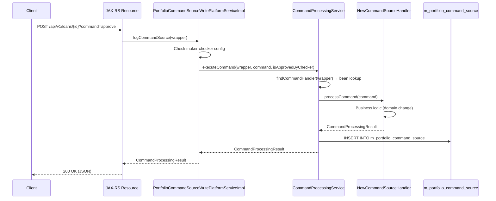
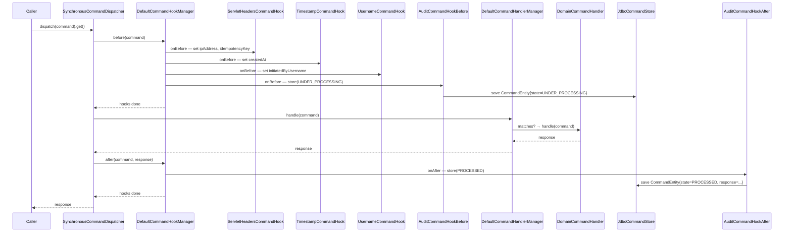

Fineract separates read and write operations following a CQRS (Command/Query Responsibility Segregation) pattern. Every state-mutating operation — creating a client, disbursing a loan, posting a repayment — flows through a command dispatcher that enforces a consistent lifecycle: pre-hooks, handler execution, post-hooks, error hooks, and optional persistence. This architecture enables idempotency, audit trails, approvals workflows, and pluggable async back-ends without modifying domain handlers.

The framework is split across six Gradle sub-projects:

| Module | Artifact | Role |
|---|---|---|
| `fineract-command` | Core interfaces + synchronous dispatcher | Defines all contracts |
| `fineract-command-async` | `AsyncCommandDispatcher` | WIP async dispatch via `CompletableFuture` |
| `fineract-command-disruptor` | `DisruptorCommandDispatcher` | WIP LMAX Disruptor ring-buffer dispatch |
| `fineract-command-jdbc` | `JdbcCommandStore` | Persists commands to `m_command` table |
| `fineract-command-audit` | Audit hooks | Records BEFORE/AFTER/ERROR states via `CommandStore` |
| `fineract-core` (legacy) | `PortfolioCommandSourceWritePlatformServiceImpl` | Bridges legacy `CommandWrapper`→new framework |

<Warning>
`AsyncCommandDispatcher` and `DisruptorCommandDispatcher` are marked `// TODO: WIP - not ready yet for prime time` in source. They are disabled by default. `SynchronousCommandDispatcher` is the production dispatcher.
</Warning>

---

## Core interfaces (`fineract-command`)

### `Command<T>`
**File:** `fineract-command/src/main/java/org/apache/fineract/command/core/Command.java`

```java
@Data @FieldNameConstants
public class Command<T> implements Serializable {
    Long commandId;
    String idempotencyKey;
    String ipAddress;
    Instant createdAt;
    Instant updatedAt;
    Instant executedAt;
    Instant approvedAt;
    Instant rejectedAt;
    String initiatedByUsername;
    String executedByUsername;
    String approvedByUsername;
    String rejectedByUsername;
    String error;
    T payload;            // the typed request payload
}
```

`Command<T>` is the envelope. The typed `payload` field carries the domain-specific request POJO. All timestamps and user tracking are metadata added by hooks.

### `CommandHandler<REQ, RES>`
**File:** `fineract-command/src/main/java/org/apache/fineract/command/core/CommandHandler.java`

```java
public interface CommandHandler<REQ, RES> {
    RES handle(Command<REQ> command);

    default RES fallback(Command<REQ> command, Throwable t) { throw t; }

    default boolean matches(Command<REQ> command) {
        TypeToken<REQ> handlerType = new TypeToken<>(getClass()) {};
        return handlerType.getRawType().isAssignableFrom(command.getPayload().getClass());
    }
}
```

`matches` uses Guava `TypeToken` reflection to compare the handler's generic type parameter against the command payload class. `DefaultCommandHandlerManager` iterates all registered `CommandHandler` beans and picks the first match.

### `CommandDispatcher`
**File:** `fineract-command/src/main/java/org/apache/fineract/command/core/CommandDispatcher.java`

```java
public interface CommandDispatcher {
    <REQ, RES> Supplier<RES> dispatch(Command<REQ> command);
}
```

Returns a `Supplier<RES>` (not the result directly) — the actual work is deferred until the supplier is called. This allows the caller to control when execution happens (immediately for sync, on a future for async).

### `CommandStore`
**File:** `fineract-command/src/main/java/org/apache/fineract/command/core/CommandStore.java`

```java
public interface CommandStore {
    <T> T getRequestById(Long id);
    <T> T getResponseById(Long id);
    CommandState getStateById(Long id);
    <T> T getRequestByKey(String key);
    <T> T getResponseByKey(String key);
    CommandState getStateByKey(String key);
    void store(Command<?> command, Object response, CommandState state);
}
```

The `getByKey` methods enable idempotency: if a command with the same `idempotencyKey` already exists in the store, the caller can retrieve the existing response without re-executing.

### `CommandState` enum
**File:** `fineract-command/src/main/java/org/apache/fineract/command/core/CommandState.java`

| Value | Meaning |
|---|---|
| `INVALID` | Default/unset state |
| `UNDER_PROCESSING` | Being executed right now (set by `AuditCommandHookBefore`) |
| `PROCESSED` | Successfully completed (set by `AuditCommandHookAfter`) |
| `AWAITING_APPROVAL` | Maker-checker: submitted, awaiting checker approval |
| `REJECTED` | Checker rejected the command |
| `ERROR` | Execution threw an exception (set by `AuditCommandHookError`) |
| `UNKNOWN` | Not found in the store |

### `CommandHandlerManager`
**File:** `fineract-command/src/main/java/org/apache/fineract/command/core/CommandHandlerManager.java`

```java
@FunctionalInterface
public interface CommandHandlerManager {
    <REQ, RES> RES handle(Command<REQ> command);
}
```

`DefaultCommandHandlerManager` (`fineract-command/…/implementation/DefaultCommandHandlerManager.java`) iterates the injected list of `CommandHandler<?,?>` beans and delegates to the first that `matches()`.

---

## Hook interfaces

Hooks decorate the command lifecycle. All three are `@FunctionalInterface`.

### `CommandHookBefore<REQ>`
**File:** `fineract-command/src/main/java/org/apache/fineract/command/core/CommandHookBefore.java`

```java
@FunctionalInterface
public interface CommandHookBefore<REQ> {
    void onBefore(Command<REQ> command);
}
```

Called before handler execution. Hooks at this stage populate metadata or enforce preconditions.

### `CommandHookAfter<REQ, RES>`
**File:** `fineract-command/src/main/java/org/apache/fineract/command/core/CommandHookAfter.java`

```java
@FunctionalInterface
public interface CommandHookAfter<REQ, RES> {
    void onAfter(Command<REQ> command, RES response);
}
```

### `CommandHookError<REQ>`
**File:** `fineract-command/src/main/java/org/apache/fineract/command/core/CommandHookError.java`

```java
@FunctionalInterface
public interface CommandHookError<REQ> {
    void onError(Command<REQ> command, Throwable error);
}
```

### `CommandHookManager`
**File:** `fineract-command/src/main/java/org/apache/fineract/command/core/CommandHookManager.java`

Orchestrates all registered hooks:
```java
public interface CommandHookManager {
    void before(Command command);
    void after(Command command, Object response);
    void error(Command command, Throwable error);
}
```

`DefaultCommandHookManager` (`fineract-command/…/implementation/DefaultCommandHookManager.java`) iterates `CommandHookBefore` beans sorted by `@Order`, then `CommandHookAfter`/`CommandHookError` beans similarly.

---

## Built-in hooks

All built-in hooks are conditional on `application.properties` flags and are registered as Spring `@Component` beans with explicit `@Order` values.

### `ServletHeadersCommandHook`
**File:** `fineract-command/src/main/java/org/apache/fineract/command/hook/ServletHeadersCommandHook.java`  
**Order:** `COMMAND_HOOK_ORDER_HEADERS = 10`  
**Condition:** `fineract.command.hooks.servlet-header-pre=true`  
**Interface:** `CommandHookBefore<Object>`

Populates `command.ipAddress` from the `IP` HTTP header and `command.idempotencyKey` from the header named by `CommandProperties.idemPotencyKeyHeaderName` (default: `"Idempotency-Key"`). Only sets values if the field is currently blank.

### `TimestampCommandHook`
**File:** `fineract-command/src/main/java/org/apache/fineract/command/hook/TimestampCommandHook.java`  
**Order:** `COMMAND_HOOK_ORDER_TIMESTAMP = 11`  
**Condition:** `fineract.command.hooks.timestamp-pre=true`  
**Interface:** `CommandHookBefore<Object>`

Sets `command.createdAt = Instant.now()` if not already set.

### `UsernameCommandHook`
**File:** `fineract-command/src/main/java/org/apache/fineract/command/hook/UsernameCommandHook.java`  
**Order:** `COMMAND_HOOK_ORDER_USERNAME = 12`  
**Condition:** `fineract.command.hooks.username-pre=true`  
**Interface:** `CommandHookBefore<Object>`

Reads `SecurityContextHolder.getContext().getAuthentication().getName()` and sets `command.initiatedByUsername`. Falls back to `"unknown"` if there is no authentication.

### Audit hooks (from `fineract-command-audit`)

| Class | Order | Condition property | Interface | Action |
|---|---|---|---|---|
| `AuditCommandHookBefore` | `20` | `fineract.command.hooks.audit-pre=true` | `CommandHookBefore` | Sets `executedByUsername`, `updatedAt`, `executedAt`; calls `store.store(command, null, UNDER_PROCESSING)` |
| `AuditCommandHookAfter` | `20` | `fineract.command.hooks.audit-post=true` | `CommandHookAfter` | Updates timestamps; calls `store.store(command, response, PROCESSED)` |
| `AuditCommandHookError` | `20` | `fineract.command.hooks.audit-error=true` | `CommandHookError` | Sets `command.error`; calls `store.store(command, null, ERROR)` |

---

## Dispatcher implementations

### `SynchronousCommandDispatcher` (production default)
**File:** `fineract-command/src/main/java/org/apache/fineract/command/implementation/SynchronousCommandDispatcher.java`  
**Condition:** `@ConditionalOnMissingBean(value = CommandDispatcher.class, ignored = SynchronousCommandDispatcher.class)`

```java
public <REQ, RES> Supplier<RES> dispatch(Command<REQ> command) {
    requireNonNull(command);
    return () -> {
        try {
            hookManager.before(command);
            RES response = handlerManager.handle(command);
            hookManager.after(command, response);
            return response;
        } catch (Exception e) {
            hookManager.error(command, e);
            throw e;
        }
    };
}
```

Active whenever neither `AsyncCommandDispatcher` nor `DisruptorCommandDispatcher` is enabled.

### `AsyncCommandDispatcher` (WIP)
**File:** `fineract-command-async/src/main/java/org/apache/fineract/command/async/implementation/AsyncCommandDispatcher.java`  
**Condition:** `fineract.command.async.enabled=true`

Submits work as a `CompletableFuture.supplyAsync(…)` and blocks the calling thread for up to 3 seconds (`TODO: make configurable`). Does **not** propagate tenant context to the async thread. Not production-ready.

### `DisruptorCommandDispatcher` (WIP)
**File:** `fineract-command-disruptor/src/main/java/org/apache/fineract/command/disruptor/implementation/DisruptorCommandDispatcher.java`  
**Condition:** `fineract.command.disruptor.enabled=true`

Uses an LMAX Disruptor `RingBuffer<CommandEvent<REQ,RES>>`. The `CompleteableCommandEventHandler` processes events from the ring and completes a `CompletableFuture` per event. The dispatcher publishes to the ring buffer and returns `future::join`.

`DisruptorCommandProperties`:
- `fineract.command.disruptor.ring-buffer-size` — default `1024`.
- `fineract.command.disruptor.producer-type` — `SINGLE` or `MULTI`, default `SINGLE`.

---

## JDBC persistence (`fineract-command-jdbc`)

### `JdbcCommandStore`
**File:** `fineract-command-jdbc/src/main/java/org/apache/fineract/command/jdbc/store/JdbcCommandStore.java`  
**Condition:** `@ConditionalOnMissingBean(value = CommandStore.class, ignored = JdbcCommandStore.class)`  
**Active when:** `fineract.command.jdbc.enabled=true`

Persists `Command<?>` + response to the `m_command` table using Spring Data JDBC via `CommandRepository` and MapStruct `CommandMapper`.

Key `store()` behaviour:
1. Maps `Command` → `CommandEntity` using `CommandMapper.map(command)` or `CommandMapper.map(command, response)`.
2. Sets `commandEntity.state` from the provided `CommandState`.
3. Calls `repository.save(commandEntity)`.
4. Sets `command.commandId` from the auto-generated entity ID.
5. On `RuntimeException`: logs a warning and re-throws (allowing Resilience4j `@Retry(name="commandStore")` to retry).
6. `fallback` method: if all retries exhausted and `fineract.command.jdbc.file-dead-letter-queue-enabled=true`, writes the command as JSON to `fineract.command.jdbc.file-dead-letter-queue-path/{timestamp}-{idempotencyKey}.json`.

### `CommandEntity`
**File:** `fineract-command-jdbc/…/store/domain/CommandEntity.java`  
**Table:** `m_command`

```java
@Table("m_command")
public class CommandEntity implements Serializable {
    @Id Long id;
    Instant createdAt, updatedAt, executedAt, approvedAt, rejectedAt;
    String initiatedByUsername, executedByUsername, approvedByUsername, rejectedByUsername;
    String idempotencyKey;
    CommandState state;
    String error;
    String ipAddress;
    JsonNode request;    // full payload serialised as JSON
    JsonNode response;   // full response serialised as JSON
}
```

JSON serialisation uses `JsonNodeWritingConverter` / `JsonNodeReadingConverter` with a Jackson `ObjectMapper`. The `@class` attribute is embedded in the JSON payload to enable deserialization back to the original type.

### `JdbcCommandProperties`

| Property | Default | Notes |
|---|---|---|
| `fineract.command.jdbc.enabled` | `false` | Enable JDBC store |
| `fineract.command.jdbc.file-dead-letter-queue-enabled` | `false` | Write failed commands to disk |
| `fineract.command.jdbc.file-dead-letter-queue-path` | `/tmp/fineract/dlq` | Dead-letter queue directory |

---

## Audit module (`fineract-command-audit`)

The audit module's three hooks (described above) use `CommandStore` to record lifecycle transitions. When `AuditCommandProperties.enabled=false` (the default), the hooks are not registered.

`AuditCommandProperties`:
- `fineract.command.audit.enabled` — default `false`.

In practice, audit recording is typically enabled together with `fineract.command.jdbc.enabled=true` so there is a store to write into.

---

## Legacy CQRS system

The pre-existing command system (still used by all domain handlers in `fineract-provider`) operates through a different set of types in `fineract-core/src/main/java/org/apache/fineract/commands/`.

### Key legacy types

| Type | File | Role |
|---|---|---|
| `CommandWrapper` | `commands/domain/CommandWrapper.java` | Immutable value: `actionName + entityName + entityId + json` |
| `CommandSource` | `commands/domain/CommandSource.java` | JPA entity (`m_portfolio_command_source`) — persists each command |
| `CommandProcessingResultType` | `commands/domain/CommandProcessingResultType.java` | Enum of result types (see below) |
| `PortfolioCommandSourceWritePlatformService` | `commands/service/` | Interface for submitting commands |
| `PortfolioCommandSourceWritePlatformServiceImpl` | `commands/service/PortfolioCommandSourceWritePlatformServiceImpl.java` | Resolves handler, executes, persists |
| `CommandProcessingService` | `commands/service/CommandProcessingService.java` | `executeCommand(…)` |
| `NewCommandSourceHandler` | `commands/handler/NewCommandSourceHandler.java` | Interface for domain handlers |

### `CommandProcessingResultType` values

| Value | int | Code |
|---|---|---|
| `INVALID` | 0 | `commandProcessingResultType.invalid` |
| `PROCESSED` | 1 | `commandProcessingResultType.processed` |
| `AWAITING_APPROVAL` | 2 | `commandProcessingResultType.awaiting.approval` |
| `REJECTED` | 3 | `commandProcessingResultType.rejected` |
| `UNDER_PROCESSING` | 4 | `commandProcessingResultType.underProcessing` |
| `ERROR` | 5 | `commandProcessingResultType.error` |

### Legacy flow



---

## End-to-end write request flow (new command framework)



---

## `CommandProperties` config

**File:** `fineract-command/src/main/java/org/apache/fineract/command/core/CommandProperties.java`

`@ConfigurationProperties(prefix="fineract.command")`:

| Property | Default | Notes |
|---|---|---|
| `fineract.command.enabled` | `true` | Master enable switch |
| `fineract.command.idem-potency-key-header-name` | `"Idempotency-Key"` | HTTP header name for idempotency key |
| `fineract.command.hooks.*` | `{}` | Map of hook toggle properties |

Hook toggle properties (`fineract.command.hooks.<name>=true/false`):

| Hook | Property value |
|---|---|
| `ServletHeadersCommandHook` | `fineract.command.hooks.servlet-header-pre=true` |
| `TimestampCommandHook` | `fineract.command.hooks.timestamp-pre=true` |
| `UsernameCommandHook` | `fineract.command.hooks.username-pre=true` |
| `AuditCommandHookBefore` | `fineract.command.hooks.audit-pre=true` |
| `AuditCommandHookAfter` | `fineract.command.hooks.audit-post=true` |
| `AuditCommandHookError` | `fineract.command.hooks.audit-error=true` |

---

## Gotchas & invariants

<Accordion title="Idempotency key lookup requires JdbcCommandStore">
`CommandStore.getResponseByKey(key)` only works if `JdbcCommandStore` is enabled (`fineract.command.jdbc.enabled=true`). Without it there is no `CommandStore` bean registered and idempotency checks are skipped. `JdbcCommandStore` uses `@ConditionalOnMissingBean` so it activates only when no other `CommandStore` is in the context.
</Accordion>

<Accordion title="AuditCommandHookBefore and AuditCommandHookAfter have the same @Order(20)">
Both audit hooks run at order `20`. Spring resolves same-order beans by registration order (alphabetical by bean name in default scan). If you add custom hooks at order 20, their interleaving with audit hooks is non-deterministic.
</Accordion>

<Accordion title="CommandHandler.matches() uses runtime generic type reflection">
`DefaultCommandHandlerManager` relies on `TypeToken<REQ>` at runtime. If you create a `CommandHandler` via a lambda or anonymous class that erases the generic, `matches()` will not resolve the type correctly. Always create handlers as named non-anonymous `@Component` classes.
</Accordion>

<Accordion title="SynchronousCommandDispatcher vs legacy NewCommandSourceHandler">
The new `Command<T>` / `CommandHandler<REQ,RES>` framework and the legacy `CommandWrapper` / `NewCommandSourceHandler` framework are **parallel systems** that coexist. The legacy system is still used for all domain operations in `fineract-provider`. The new framework is used for infrastructure commands (e.g. cache switches, event config updates). Migration is ongoing.
</Accordion>

<Accordion title="Disruptor dispatcher ring buffer sizing">
The LMAX Disruptor ring buffer size must be a power of 2. `DisruptorCommandProperties.ringBufferSize=1024` (default). If you change it to a non-power-of-2 value the Disruptor will throw `IllegalArgumentException` at startup.
</Accordion>
