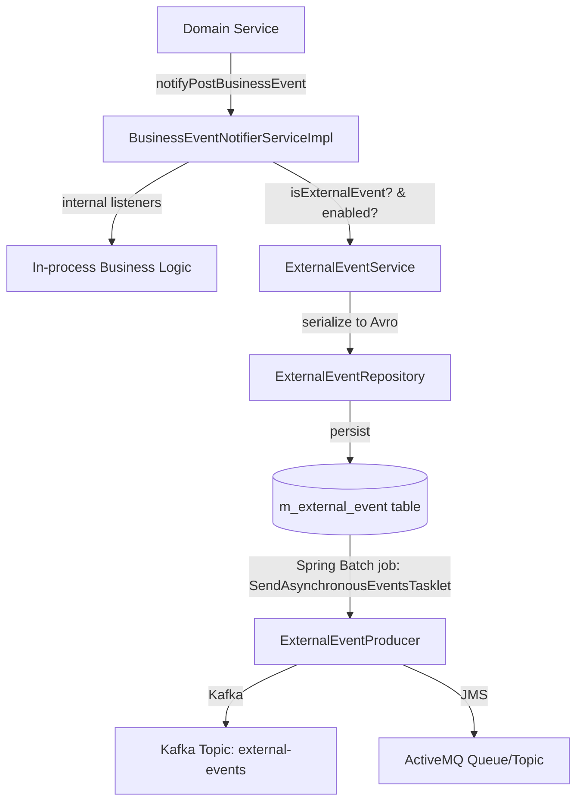

Fineract uses a two-layer event architecture. The first layer is an **in-process business event bus** using Spring's `ApplicationEvent` style notifications — synchronous, transactional, and used for internal cross-module coordination. The second layer is an **external event outbox** that persists events to a database table and forwards them to a downstream message broker (Kafka or JMS/ActiveMQ). The two layers are bridged by `BusinessEventNotifierServiceImpl`, which listens to post-commit notifications and triggers `ExternalEventService` to serialise and store events.



---

## Layer 1: Internal BusinessEvent

### `BusinessEvent<T>` interface
**File:** `fineract-core/src/main/java/org/apache/fineract/infrastructure/event/business/domain/BusinessEvent.java`

```java
public interface BusinessEvent<T> {
    T get();                   // domain object payload (e.g. Loan, Client)
    String getType();          // e.g. "LoanCreatedBusinessEvent"
    String getCategory();      // e.g. "Loan", "Client", "Savings"
    Long getAggregateRootId(); // entity id (used as Kafka partition key)
}
```

### `AbstractBusinessEvent<T>`
**File:** `fineract-core/…/event/business/domain/AbstractBusinessEvent.java`

Base implementation storing the `T value` and exposing it via `get()`. All concrete event classes extend this.

### `NoExternalEvent` marker
**File:** `fineract-core/…/event/business/domain/NoExternalEvent.java`

```java
public interface NoExternalEvent {}
```

Any `BusinessEvent` that also implements `NoExternalEvent` is fired as a local listener notification **only** — it is never forwarded to the external event pipeline. Use this for internal cross-cutting concerns that must not leave the process boundary.

### `BulkBusinessEvent`
**File:** `fineract-core/…/event/business/domain/BulkBusinessEvent.java`

Wraps a `List<BusinessEvent<?>>` into a single event envelope. All events in the bulk must share the same aggregate root id. Serialised as `BulkMessagePayloadV1` Avro schema when posted externally.

---

### `BusinessEventNotifierService`
**File:** `fineract-core/…/event/business/service/BusinessEventNotifierService.java`

```java
public interface BusinessEventNotifierService {
    void notifyPreBusinessEvent(BusinessEvent<?> businessEvent);
    void notifyPostBusinessEvent(BusinessEvent<?> businessEvent);
    <T extends BusinessEvent<?>> void addPreBusinessEventListener(Class<T> eventType, BusinessEventListener<T> listener);
    <T extends BusinessEvent<?>> void addPostBusinessEventListener(Class<T> eventType, BusinessEventListener<T> listener);
    void startExternalEventRecording();
    void stopExternalEventRecording();
    void resetEventRecording();
}
```

**Pre-events** fire before the business operation commits. **Post-events** fire after. Domain services typically fire both — pre for precondition checks and post for downstream reactions.

### `BusinessEventNotifierServiceImpl`
**File:** `fineract-core/…/event/business/service/BusinessEventNotifierServiceImpl.java`  
Implements `BusinessEventNotifierService`, `TransactionExecutionListener`, `InitializingBean`.

Key internal state:
- `Map<Class, List<BusinessEventListener>> preListeners` — registered pre-event listeners.
- `Map<Class, List<BusinessEventListener>> postListeners` — registered post-event listeners.
- `ThreadLocal<Boolean> eventRecordingEnabled` — used by COB batch to buffer events.
- `ThreadLocal<List<BusinessEvent<?>>> recordedEvents` — buffered events during recording.
- `ThreadLocal<Stack<List<BusinessEventWithContext>>> transactionBusinessEvents` — events queued until transaction commit.

**Transaction-aware dispatch:**  `BusinessEventNotifierServiceImpl` implements `TransactionExecutionListener`. External events are collected in `transactionBusinessEvents` and only forwarded to `ExternalEventService` when the transaction commits successfully (i.e., not on rollback).

`notifyPostBusinessEvent` flow:
1. Fires all matching `postListeners`.
2. Checks `isExternalEvent` (event is not `NoExternalEvent`) and `isExternalEventPostingEnabled` (`fineract.events.external.enabled=true`).
3. Pushes event onto the current transaction's event stack.
4. On `TransactionExecutionListener.afterCommit`: iterates the stack and calls `externalEventService.postEvent(event)` for each.

### `BusinessEventListener<T>`
**File:** `fineract-core/…/event/business/BusinessEventListener.java`

```java
@FunctionalInterface
public interface BusinessEventListener<T extends BusinessEvent<?>> {
    void onBusinessEvent(T event);
}
```

Registered programmatically via `addPostBusinessEventListener` or via Spring component scan. Domain modules register their own listeners at startup using `@PostConstruct`.

---

## Layer 2: External Event Pipeline

### `ExternalEventService`
**File:** `fineract-core/…/event/external/service/ExternalEventService.java`

```java
@Service @Transactional
public class ExternalEventService {
    public <T> void postEvent(BusinessEvent<T> event) {
        entityManager.flush();  // ensure domain changes are visible
        ExternalEvent externalEvent;
        if (event instanceof BulkBusinessEvent) {
            externalEvent = handleBulkBusinessEvent((BulkBusinessEvent) event);
        } else {
            externalEvent = handleRegularBusinessEvent(event);
        }
        repository.save(externalEvent);
    }
}
```

For regular events:
1. Looks up `BusinessEventSerializer` via `BusinessEventSerializerFactory`.
2. Calls `dataEnricherProcessor.enrich(serializer.toAvroDTO(event))` — `DataEnricher` implementations can augment Avro DTOs before serialisation.
3. Calls `avroDto.toByteBuffer()` and converts to `byte[]`.
4. Generates idempotency key via `ExternalEventIdempotencyKeyGenerator`.
5. Creates and saves `ExternalEvent` with `status=TO_BE_SENT`.

### `ExternalEvent` entity
**File:** `fineract-core/…/event/external/repository/domain/ExternalEvent.java`  
**Table:** `m_external_event`

| Column | Type | Notes |
|---|---|---|
| `id` | BIGINT PK | Auto-generated |
| `type` | VARCHAR | Event type string (e.g. `LoanCreatedBusinessEvent`) |
| `category` | VARCHAR | Event category (e.g. `Loan`) |
| `schema` | VARCHAR | Avro schema class name |
| `data` | BLOB | Avro-serialised payload bytes (lazy-loaded) |
| `created_at` | TIMESTAMPTZ | UTC timestamp |
| `status` | VARCHAR | `TO_BE_SENT` or `SENT` |
| `sent_at` | TIMESTAMPTZ | Null until sent |
| `idempotency_key` | VARCHAR | UUID (default) |
| `business_date` | DATE | `DateUtils.getBusinessLocalDate()` at creation time |
| `aggregate_root_id` | BIGINT | Entity ID (loan id, client id, etc.) |

### `ExternalEventStatus` enum
**File:** `fineract-core/…/repository/domain/ExternalEventStatus.java`

| Value | Meaning |
|---|---|
| `TO_BE_SENT` | Freshly persisted, waiting to be dispatched |
| `SENT` | Successfully sent to broker |

---

## Scheduled dispatch (Spring Batch job)

### `SendAsynchronousEventsTasklet`
**File:** `fineract-core/…/event/external/jobs/SendAsynchronousEventsTasklet.java`

Spring Batch `Tasklet` that runs on a schedule (job `SEND_ASYNCHRONOUS_EVENTS`). On each execution:
1. Queries `ExternalEventRepository` for a page of events with `status=TO_BE_SENT`, ordered by `created_at`, page size = `fineract.events.external.partition-size` (default 5000).
2. Groups events by `aggregate_root_id` → `Map<Long, List<byte[]>>`.
3. Calls `messageFactory.createMessage(event)` to wrap each payload in a `MessageV1` Avro envelope (adds metadata: id, type, schema, created_at, business_date, tenant id, idempotency key).
4. Calls `eventProducer.sendEvents(partitions)`.
5. Updates status of sent events to `SENT` and sets `sent_at` — done in parallel via `threadPoolTaskExecutor` (bean `EVENT_MARKS_AS_SENT_EXECUTOR`).

### `PurgeExternalEventsTasklet`
**File:** `fineract-core/…/event/external/jobs/PurgeExternalEventsTasklet.java`

Companion batch job that deletes events with `status=SENT` older than a configured retention period. Prevents `m_external_event` from growing unboundedly.

---

## External event producers

### `ExternalEventProducer` interface
**File:** `fineract-core/…/event/external/producer/ExternalEventProducer.java`

```java
public interface ExternalEventProducer {
    void sendEvents(Map<Long, List<byte[]>> partitions) throws AcknowledgementTimeoutException;
}
```

The `Long` key is the aggregate root id, used as Kafka partition key. Events sharing the same aggregate root id are delivered in-order to the same Kafka partition.

### Kafka producer
**File:** `fineract-provider/…/event/external/config/ExternalEventKafkaConfiguration.java`  
**Condition:** `fineract.events.external.producer.kafka.enabled=true`

Registers:
- `ProducerFactory<Long, byte[]>` — `LongSerializer` for key, `ByteArraySerializer` for value. Extra producer properties from `fineract.events.external.producer.kafka.producer.extra-properties`.
- `KafkaTemplate<Long, byte[]> externalEventsKafkaTemplate`

**`KafkaExternalEventProducer`** (`fineract-provider/…/producer/kafka/KafkaExternalEventProducer.java`) sends all events in `partitions` as async Kafka sends, then calls `CompletableFuture.allOf(…).get(timeoutInSeconds, SECONDS)` to wait for acknowledgement.

**`KafkaExternalEventTopicConfig`** / `ExternalEventsKafkaTopicAutoCreateCondition` — when `fineract.events.external.producer.kafka.topic.auto-create=true`, uses `KafkaAdmin` to create the topic with `fineract.events.external.producer.kafka.topic.partitions` partitions and `replicas` replicas.

### JMS producer (ActiveMQ)
**File:** `fineract-provider/…/event/external/producer/jms/JMSMultiExternalEventProducer.java`  
**Condition:** `fineract.events.external.producer.jms.enabled=true`

Supports both queue (`event-queue-name`) and topic (`event-topic-name`) destinations. Uses a thread pool of `producer-count` JMS producers for concurrent sending. `async-send-enabled=true` makes sends non-blocking.

### `NoopExternalEventProducer`
**File:** `fineract-core/…/event/external/producer/NoopExternalEventProducer.java`

Active when neither Kafka nor JMS is enabled. Logs a warning and discards events. Used in development/test environments.

---

## Avro serialisation

### `BusinessEventSerializer`
**File:** `fineract-core/…/service/serialization/serializer/BusinessEventSerializer.java`

```java
public interface BusinessEventSerializer {
    <T> boolean canSerialize(BusinessEvent<T> event);
    Class<? extends GenericContainer> getSupportedSchema();
    <T> ByteBufferSerializable toAvroDTO(BusinessEvent<T> rawEvent);
}
```

Each domain module provides one or more serializers. `BusinessEventSerializerFactory` iterates all registered `BusinessEventSerializer` beans, calls `canSerialize`, and returns the first match. If no serializer is found, the event cannot be externalised.

Selected serialisers in `fineract-provider/…/service/serialization/serializer/`:
- `loan/LoanBusinessEventSerializer` — handles all `LoanBusinessEvent` subtypes; maps to Avro schemas from `fineract-avro-schemas`.
- `client/ClientBusinessEventSerializer` — handles `ClientBusinessEvent` subtypes.
- Savings, deposit, and group serialisers follow the same pattern.

Avro schemas are defined in `fineract-avro-schemas/src/main/avro/` and compiled to Java classes. The `MessageV1` schema wraps every event with envelope metadata.

### `AvroDateTimeMapper`, `AvroMonthDayMapper`
**File:** `fineract-core/…/serialization/mapper/support/`

MapStruct mapper helper classes converting Java `LocalDate`, `LocalDateTime`, `MonthDay` to/from Avro-compatible integer/string representations.

---

## External event configuration API

### `ExternalEventConfigurationApiResource`
**File:** `fineract-core/…/event/external/api/ExternalEventConfigurationApiResource.java`  
**Path:** `/api/v1/externalevents/configuration`

| Method | Path | Description |
|---|---|---|
| `GET` | `/api/v1/externalevents/configuration` | List all event types with enabled/disabled status |
| `PUT` | `/api/v1/externalevents/configuration` | Bulk enable/disable event types |

The resource uses `CommandDispatcher` with `ExternalConfigurationsUpdateCommand` for writes, and `ExternalEventConfigurationReadPlatformService` for reads.

### `ExternalEventConfiguration` entity
**File:** `fineract-core/…/repository/domain/ExternalEventConfiguration.java`  
**Table:** `m_external_event_configuration`

| Column | Type | Notes |
|---|---|---|
| `type` | VARCHAR PK | Event type name (e.g. `LoanCreatedBusinessEvent`) |
| `enabled` | BOOLEAN | Whether this event type is forwarded externally |

When `enabled=false` for a type, `ExternalBusinessEventConfigurationServiceImpl.isExternalEventEnabled(event)` returns `false` and `BusinessEventNotifierServiceImpl` skips calling `ExternalEventService`.

### `ExternalBusinessEventConfigurationService`
**File:** `fineract-core/…/event/business/service/ExternalBusinessEventConfigurationService.java`

```java
public interface ExternalBusinessEventConfigurationService {
    boolean isExternalEventEnabled(BusinessEvent<?> businessEvent);
}
```

`ExternalBusinessEventConfigurationServiceImpl` caches the enabled set and invalidates on every `PUT /api/v1/externalevents/configuration`.

---

## `fineract.events.external.*` configuration reference

| Property | Env var | Default | Notes |
|---|---|---|---|
| `fineract.events.external.enabled` | `FINERACT_EXTERNAL_EVENTS_ENABLED` | `false` | Master toggle |
| `fineract.events.external.partition-size` | `FINERACT_EXTERNAL_EVENTS_PARTITION_SIZE` | `5000` | Page size per batch run |
| `fineract.events.external.thread-pool-core-pool-size` | `FINERACT_EVENT_TASK_EXECUTOR_CORE_POOL_SIZE` | `2` | |
| `fineract.events.external.thread-pool-max-pool-size` | `FINERACT_EVENT_TASK_EXECUTOR_MAX_POOL_SIZE` | `25` | |
| `fineract.events.external.thread-pool-queue-capacity` | `FINERACT_EVENT_TASK_EXECUTOR_QUEUE_CAPACITY` | `500` | |
| **Kafka** | | | |
| `fineract.events.external.producer.kafka.enabled` | `FINERACT_EXTERNAL_EVENTS_KAFKA_ENABLED` | `false` | |
| `fineract.events.external.producer.kafka.bootstrap-servers` | `FINERACT_EXTERNAL_EVENTS_KAFKA_BOOTSTRAP_SERVERS` | `localhost:9092` | |
| `fineract.events.external.producer.kafka.topic.name` | `FINERACT_EXTERNAL_EVENTS_KAFKA_TOPIC_NAME` | `external-events` | |
| `fineract.events.external.producer.kafka.topic.partitions` | `FINERACT_EXTERNAL_EVENTS_KAFKA_TOPIC_PARTITIONS` | `10` | |
| `fineract.events.external.producer.kafka.topic.replicas` | `FINERACT_EXTERNAL_EVENTS_KAFKA_TOPIC_REPLICAS` | `1` | |
| `fineract.events.external.producer.kafka.topic.auto-create` | `FINERACT_EXTERNAL_EVENTS_KAFKA_TOPIC_AUTO_CREATE` | `true` | |
| `fineract.events.external.producer.kafka.timeout-in-seconds` | `FINERACT_EXTERNAL_EVENTS_KAFKA_TIMEOUT_IN_SECONDS` | `10` | Ack wait timeout |
| `fineract.events.external.producer.kafka.producer.extra-properties` | `FINERACT_EXTERNAL_EVENTS_KAFKA_PRODUCER_EXTRA_PROPERTIES` | `linger.ms=10\|batch.size=16384` | `\|` separated |
| **JMS** | | | |
| `fineract.events.external.producer.jms.enabled` | `FINERACT_EXTERNAL_EVENTS_PRODUCER_JMS_ENABLED` | `false` | |
| `fineract.events.external.producer.jms.broker-url` | `FINERACT_EXTERNAL_EVENTS_PRODUCER_JMS_BROKER_URL` | `tcp://127.0.0.1:61616` | |
| `fineract.events.external.producer.jms.broker-username` | `FINERACT_EXTERNAL_EVENTS_PRODUCER_JMS_BROKER_USERNAME` | _(empty)_ | |
| `fineract.events.external.producer.jms.event-queue-name` | `FINERACT_EXTERNAL_EVENTS_PRODUCER_JMS_QUEUE_NAME` | _(empty)_ | Use queue or topic |
| `fineract.events.external.producer.jms.event-topic-name` | `FINERACT_EXTERNAL_EVENTS_PRODUCER_JMS_TOPIC_NAME` | _(empty)_ | |
| `fineract.events.external.producer.jms.async-send-enabled` | `FINERACT_EXTERNAL_EVENTS_PRODUCER_JMS_ASYNC_SEND_ENABLED` | `false` | |
| `fineract.events.external.producer.jms.producer-count` | `FINERACT_EXTERNAL_EVENTS_PRODUCER_JMS_PRODUCER_COUNT` | `1` | Thread pool size |

---

## Domain event catalogue

### Loan events (`fineract-loan`)

| Event class | Category | Description |
|---|---|---|
| `LoanCreatedBusinessEvent` | Loan | New loan application submitted |
| `LoanApprovedBusinessEvent` | Loan | Loan approved |
| `LoanApprovedAmountChangedBusinessEvent` | Loan | Approved amount modified |
| `LoanDisbursalBusinessEvent` | Loan | Loan disbursed |
| `LoanUndoDisbursalBusinessEvent` | Loan | Disbursal reversed |
| `LoanUndoLastDisbursalBusinessEvent` | Loan | Last disbursal reversed |
| `LoanRejectedBusinessEvent` | Loan | Application rejected |
| `LoanWithdrawnByApplicantBusinessEvent` | Loan | Applicant withdrew |
| `LoanCloseBusinessEvent` | Loan | Loan closed/written off |
| `LoanCloseAsRescheduleBusinessEvent` | Loan | Closed via rescheduling |
| `LoanStatusChangedBusinessEvent` | Loan | Any status transition |
| `LoanBalanceChangedBusinessEvent` | Loan | Balance recalculated |
| `LoanAdjustTransactionBusinessEvent` | Loan | Transaction adjusted |
| `LoanChargebackTransactionBusinessEvent` | Loan | Chargeback posted |
| `LoanInterestRecalculationBusinessEvent` | Loan | Interest recalculated |
| `LoanDelinquencyRangeChangeBusinessEvent` | Loan | Delinquency bucket changed |
| `LoanAccountDelinquencyPauseChangedBusinessEvent` | Loan | Delinquency pause updated |
| `LoanAccountSnapshotBusinessEvent` | Loan | COB snapshot saved |
| `LoanApplicationModifiedBusinessEvent` | Loan | Application modified |
| `LoanRescheduledDue*BusinessEvent` | Loan | Rescheduled (calendar/holiday/adjust) |
| `LoanAddChargeBusinessEvent` | LoanCharge | Charge added |
| `LoanDeleteChargeBusinessEvent` | LoanCharge | Charge deleted |
| `LoanUpdateChargeBusinessEvent` | LoanCharge | Charge updated |
| `LoanWaiveChargeBusinessEvent` | LoanCharge | Charge waived |
| `LoanTransactionMakeRepaymentPreBusinessEvent` | LoanTransaction | Pre-repayment hook |
| `LoanTransactionMakeRepaymentPostBusinessEvent` | LoanTransaction | Post-repayment |
| `LoanDisbursalTransactionBusinessEvent` | LoanTransaction | Disbursal transaction created |
| `LoanAccrualTransactionCreatedBusinessEvent` | LoanTransaction | Accrual posted |
| `LoanWrittenOffPreBusinessEvent` / `PostBusinessEvent` | LoanTransaction | Write-off hooks |
| `LoanChargeOffPreBusinessEvent` / `PostBusinessEvent` | LoanTransaction | Charge-off hooks |
| `LoanTransactionDownPaymentPreBusinessEvent` / `Post` | LoanTransaction | Down payment hooks |
| `LoanWaiveInterestBusinessEvent` | LoanTransaction | Interest waived |
| `LoanReAgeTransactionBusinessEvent` | LoanTransaction | Re-aging |
| `LoanReAmortizeTransactionBusinessEvent` | LoanTransaction | Re-amortization |

### Savings events (`fineract-provider`)

| Event class | Category | Description |
|---|---|---|
| `SavingsCreateBusinessEvent` | Savings | New savings account |
| `SavingsApproveBusinessEvent` | Savings | Account approved |
| `SavingsActivateBusinessEvent` | Savings | Account activated |
| `SavingsCloseBusinessEvent` | Savings | Account closed |
| `SavingsRejectBusinessEvent` | Savings | Application rejected |
| `SavingsPostInterestBusinessEvent` | Savings | Interest posted |
| `SavingsDepositBusinessEvent` | SavingsTransaction | Deposit posted |
| `SavingsWithdrawalBusinessEvent` | SavingsTransaction | Withdrawal posted |
| `SavingsAccountForceWithdrawalBusinessEvent` | SavingsTransaction | Force withdrawal |

### Client events (`fineract-provider`)

| Event class | Category | Description |
|---|---|---|
| `ClientCreateBusinessEvent` | Client | New client created |
| `ClientActivateBusinessEvent` | Client | Client activated |
| `ClientRejectBusinessEvent` | Client | Client rejected |

### Other events

| Event class | Module | Category | Description |
|---|---|---|---|
| `JournalEntryBusinessEvent` | fineract-accounting | JournalEntry | Journal entry posted |
| `DocumentCreatedBusinessEvent` | fineract-document | Document | Document attached |
| `DocumentDeletedBusinessEvent` | fineract-document | Document | Document removed |
| `FixedDepositAccountCreateBusinessEvent` | fineract-provider | FixedDeposit | FD account opened |
| `RecurringDepositAccountCreateBusinessEvent` | fineract-provider | RecurringDeposit | RD account opened |
| `GroupsCreateBusinessEvent` | fineract-provider | Group | Group created |
| `CentersCreateBusinessEvent` | fineract-provider | Center | Center created |
| `DatatableEntryCreatedBusinessEvent` | fineract-core | Datatable | Extra-column row created |
| `DatatableEntryUpdatedBusinessEvent` | fineract-core | Datatable | Extra-column row updated |
| `DatatableEntryDeletedBusinessEvent` | fineract-core | Datatable | Extra-column row deleted |

---

## Internal→External event pipeline (detail)

```mermaid
flowchart LR
    subgraph Domain Transaction
        A[Domain Service] -->|notifyPostBusinessEvent| B
        B[BusinessEventNotifierServiceImpl] -->|fire pre-listeners| C[Pre Listeners]
        B -->|fire post-listeners| D[Post Listeners]
        B -->|push to txn stack| E[transactionBusinessEvents ThreadLocal]
    end
    subgraph On Commit
        E -->|afterCommit| F[ExternalEventService.postEvent]
        F -->|isExternalEventEnabled?| G{Config check}
        G -->|enabled| H[BusinessEventSerializerFactory]
        H -->|toAvroDTO + enrich| I[Avro bytes]
        I --> J[ExternalEventRepository.save]
        J --> K[(m_external_event status=TO_BE_SENT)]
    end
    subgraph Batch Scheduler
        K -->|SEND_ASYNCHRONOUS_EVENTS job| L[SendAsynchronousEventsTasklet]
        L --> M[ExternalEventProducer.sendEvents]
        M -->|Kafka| N[external-events topic]
        M -->|JMS| O[ActiveMQ queue/topic]
        L -->|mark SENT| K
    end
```



---

## Gotchas & invariants

<Warning>
`fineract.events.external.enabled=false` (the default) disables **all** external event posting globally. Individual event types can additionally be disabled via `PUT /api/v1/externalevents/configuration` even when global posting is enabled.
</Warning>

<Accordion title="Transaction boundary: external events only fire on commit">
`BusinessEventNotifierServiceImpl` implements `TransactionExecutionListener`. Events are queued in a `ThreadLocal<Stack<List<BusinessEventWithContext>>>` and only forwarded to `ExternalEventService` in `afterCommit`. If the transaction rolls back, the stack is discarded and no external events are emitted. This provides at-least-once delivery semantics (events are persisted in the same transaction as the domain change).
</Accordion>

<Accordion title="Idempotency key is a random UUID by default">
`DefaultExternalEventIdempotencyKeyGenerator` returns `UUID.randomUUID().toString()`. If you need deterministic idempotency keys (e.g. for exactly-once Kafka consumers), implement `ExternalEventIdempotencyKeyGenerator` as a Spring `@Component` — it will replace the default via `@ConditionalOnMissingBean` semantics in the factory.
</Accordion>

<Accordion title="BulkBusinessEvent: all events must share one aggregate root">
`BulkBusinessEvent` validates on construction that all contained events have the same `aggregateRootId`. Mixing events from different entities throws `IllegalArgumentException`. This constraint ensures all sub-events go to the same Kafka partition.
</Accordion>

<Accordion title="m_external_event data column is lazy-loaded">
The `data` column (`@Basic(fetch = FetchType.LAZY)`) is not loaded unless explicitly accessed. Queries that read batches of `ExternalEvent` for dispatch should use `ExternalEventView` (a projection without the `data` column) to page through large result sets efficiently, then load full entities only for serialisation.
</Accordion>

<Accordion title="Event recording mode (COB batch)">
`BusinessEventNotifierService.startExternalEventRecording()` switches to a recording mode where events are buffered in `ThreadLocal<List<BusinessEvent<?>>> recordedEvents` instead of being forwarded to `ExternalEventService`. After the batch operation `stopExternalEventRecording()` replays the buffered events as a `BulkBusinessEvent`. This allows COB to group per-loan events into one bulk payload, reducing message volume.
</Accordion>

<Accordion title="BusinessEventConfiguration cache invalidation">
`ExternalBusinessEventConfigurationServiceImpl` caches the set of enabled event types. The cache is invalidated (and re-fetched from `m_external_event_configuration`) every time `ExternalEventConfigurationWritePlatformServiceImpl.updateConfigurations` is called. Stale configuration is possible for a brief window between cache invalidation on one node and the next read.
</Accordion>
