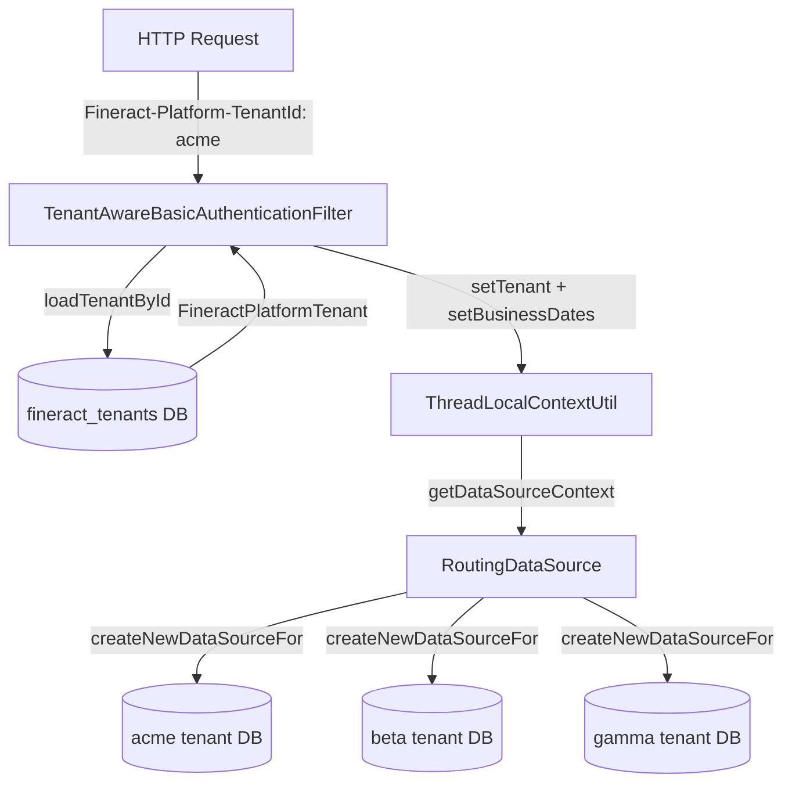

Apache Fineract implements **schema-per-tenant multi-tenancy**: every tenant has its own database (or schema), and a separate master database (`fineract_tenants`) stores the registry of all tenants plus their connection details. A single Fineract process can serve any number of tenants; the tenant identity is resolved on every HTTP request from the `Fineract-Platform-TenantId` header and stored in a thread-local for the lifetime of that request.



---

## Two-database model

<CardGroup cols={2}>
  <Card title="fineract_tenants (master)" icon="database">
    Central registry. Contains tables `tenants` (tenant metadata) and `tenant_server_connections` (DB connection params). Accessed via the `hikariTenantDataSource` bean. `ThreadLocalContextUtil.getDataSourceContext()` returns `"tenants"` when this pool is in use.
  </Card>
  <Card title="fineract_default (tenant DB)" icon="database">
    One per tenant. Default name `fineract_default` (configurable). Contains all domain tables: `m_client`, `m_loan`, `m_savings_account`, `m_office`, etc. Accessed via per-tenant HikariCP pools built by `DataSourcePerTenantServiceFactory`.
  </Card>
</CardGroup>

### `fineract_tenants` table structure

The master DB has two key tables:

**`tenants`** — one row per tenant:
- `id`, `identifier` (the string used in the header), `name`, `timezone_id`, `created_date`, `lastmodified_date`, `oltp_id` (FK to `tenant_server_connections`), `report_id` (FK to `tenant_server_connections`).

**`tenant_server_connections`** — connection parameters per pool:
- `schema_server`, `schema_server_port`, `schema_name`, `schema_username`, `schema_password`, `schema_connection_parameters`.
- Read-only replica columns: `readonly_schema_server`, `readonly_schema_server_port`, `readonly_schema_name`, `readonly_schema_username`, `readonly_schema_password`, `readonly_schema_connection_parameters`.
- Pool sizing: `initial_size`, `max_active`, `min_idle`, `max_idle`.
- `master_password_hash` — SHA-256 HMAC of the master password, verified by `DatabasePasswordEncryptor` before the connection password is decrypted.

---

## The `Fineract-Platform-TenantId` header

The header name is the string literal `"Fineract-Platform-TenantId"` (constant in `TenantAwareBasicAuthenticationFilter`). The same constant is also declared as `COMMAND_HTTP_HEADER_TENANT_ID` in `CommandConstants` (`fineract-command/src/main/java/org/apache/fineract/command/core/CommandConstants.java`).

**Where it is read:**
1. `TenantAwareBasicAuthenticationFilter.doFilterInternal` (Basic auth path) — `fineract-security/src/main/java/org/apache/fineract/infrastructure/security/filter/TenantAwareBasicAuthenticationFilter.java`, line `request.getHeader(TENANT_ID_REQUEST_HEADER)`.
2. `OidcTenantAwareFilter` (OAuth2/OIDC path) — `fineract-security/…/filter/OidcTenantAwareFilter.java`.

**Fallback:** if the header is absent, the filter also checks the `tenantIdentifier` query parameter. If neither is present and `EXCEPTION_IF_HEADER_MISSING=true` (hard-coded default), a `401` is returned with a message asking for the header.

---

## DataSource routing

### `RoutingDataSource`
**File:** `fineract-core/src/main/java/org/apache/fineract/infrastructure/core/service/database/RoutingDataSource.java`

```java
@Service("dataSource") @Primary
public class RoutingDataSource extends AbstractDataSource {
    public Connection getConnection() throws SQLException {
        DataSource targetDataSource = determineTargetDataSource();
        return targetDataSource.getConnection();
    }

    public DataSource determineTargetDataSource() {
        return dataSourceServiceFactory.determineDataSourceService().retrieveDataSource();
    }
}
```

### `RoutingDataSourceServiceFactory`
**File:** `fineract-core/…/service/database/RoutingDataSourceServiceFactory.java`

```java
public RoutingDataSourceService determineDataSourceService() {
    String serviceName = "tomcatJdbcDataSourcePerTenantService";
    if (ThreadLocalContextUtil.CONTEXT_TENANTS.equalsIgnoreCase(ThreadLocalContextUtil.getDataSourceContext())) {
        serviceName = "dataSourceForTenants";
    }
    return applicationContext.getBean(serviceName, RoutingDataSourceService.class);
}
```

Two `RoutingDataSourceService` implementations:
1. `dataSourceForTenants` — returns the HikariCP pool for `fineract_tenants`.
2. `tomcatJdbcDataSourcePerTenantService` — looks up (or creates) the HikariCP pool for the current tenant stored in `ThreadLocalContextUtil.getTenant()`.

### `DataSourcePerTenantServiceFactory`
**File:** `fineract-core/…/service/database/DataSourcePerTenantServiceFactory.java`

Builds a HikariCP `DataSource` for a given `FineractPlatformTenant`:
1. Validates `masterPasswordHash` against `DatabasePasswordEncryptor.isMasterPasswordHashValid`.
2. Determines host/port/name — uses read-only replica values when `fineractProperties.getMode().isReadOnlyMode()` returns `true`.
3. Sets pool name as `{schemaName}_pool`.
4. Applies `fineract.tenant.config.*` overrides on top of `tenant_server_connections` values.
5. Registers Micrometer metrics via `TenantConnectionPoolMetricsTrackerFactory` if a `MeterRegistry` bean is present.

---

## Key domain objects

### `FineractPlatformTenant`
**File:** `fineract-core/src/main/java/org/apache/fineract/infrastructure/core/domain/FineractPlatformTenant.java`

```java
@Jacksonized @Builder
public class FineractPlatformTenant implements Serializable {
    Long id;
    String tenantIdentifier;   // matches the header value
    String name;
    String timezoneId;
    FineractPlatformTenantConnection connection;
}
```

`FineractPlatformTenantConnection` holds all pool parameters. Key fields:

| Field | Source table column | Notes |
|---|---|---|
| `schemaServer` | `schema_server` | DB hostname |
| `schemaServerPort` | `schema_server_port` | e.g. `5432` |
| `schemaName` | `schema_name` | DB name |
| `schemaUsername` | `schema_username` | |
| `schemaPassword` | `schema_password` | encrypted with master password |
| `readOnlySchemaServer` | `readonly_schema_server` | Empty = no replica |
| `maxActive` | `max_active` | HikariCP `maximumPoolSize` |
| `initialSize` | `initial_size` | HikariCP `minimumIdle` |
| `masterPasswordHash` | `master_password_hash` | SHA-256 HMAC for password decryption guard |

### `TenantDetailsService`
**File:** `fineract-core/src/main/java/org/apache/fineract/infrastructure/core/service/tenant/TenantDetailsService.java`

```java
public interface TenantDetailsService {
    FineractPlatformTenant loadTenantById(String tenantId);
    List<FineractPlatformTenant> findAllTenants();
}
```

Implemented by `JdbcTenantDetailsService` (`fineract-core/…/service/tenant/JdbcTenantDetailsService.java`) which runs a raw JDBC query against the `fineract_tenants` master pool (forces context to `"tenants"` before querying). `TenantMapper` maps rows to `FineractPlatformTenant` and `FineractPlatformTenantConnection` objects.

---

## Tenant lifecycle — provisioning a new tenant

<Steps>
  <Step title="Insert master DB rows">
    Insert a row in `tenant_server_connections` with DB credentials, then insert a row in `tenants` linking to that connection. The `identifier` column becomes the header value.
  </Step>
  <Step title="Create physical database">
    Create a database/schema with the name in `schema_name` and grant the `schema_username` user access.
  </Step>
  <Step title="Run Liquibase migrations">
    On next startup (or via the dedicated Liquibase-only container) `TenantDataSourceFactory.create(tenant)` builds a temporary HikariCP pool for the new tenant DB and `SpringLiquibase` runs all changelog files from `db/changelog/` against it. The `autoUpdateEnabled` flag in `tenant_server_connections` controls whether migrations run automatically on startup.
  </Step>
  <Step title="Seed reference data">
    After migrations, reference data (currencies, charge types, loan products if desired) must be seeded via the API using `Fineract-Platform-TenantId: <new_identifier>`.
  </Step>
</Steps>

### `TenantDataSourceFactory`
**File:** `fineract-core/src/main/java/org/apache/fineract/infrastructure/core/service/migration/TenantDataSourceFactory.java`

Used exclusively during Liquibase migration runs (not during normal request routing). Builds a `HikariDataSource` that mimics the master pool's driver settings but connects to the specific tenant schema.

---

## Connection pool configuration

HikariCP pool parameters for tenant data sources are resolved in this priority order (highest first):

1. `fineract.tenant.config.max-pool-size` / `min-pool-size` — global overrides via `application.properties`.
2. `tenant_server_connections.max_active` / `initial_size` — per-tenant values in master DB.

| `application.properties` key | Env var | Default | Notes |
|---|---|---|---|
| `fineract.tenant.config.min-pool-size` | `FINERACT_CONFIG_MIN_POOL_SIZE` | `-1` | `-1` means use DB value |
| `fineract.tenant.config.max-pool-size` | `FINERACT_CONFIG_MAX_POOL_SIZE` | `-1` | |
| `fineract.tenant.config.leak-detection-threshold` | `FINERACT_CONFIG_LEAK_DETECTION_THRESHOLD` | `0` | ms; 0 = disabled |
| `fineract.datasource.connection-checkout-diagnostics.enabled` | `FINERACT_DATASOURCE_CONNECTION_CHECKOUT_DIAGNOSTICS_ENABLED` | `false` | Logs stack trace on every checkout |
| `fineract.datasource.connection-checkout-diagnostics.stack-depth` | `FINERACT_DATASOURCE_CONNECTION_CHECKOUT_DIAGNOSTICS_STACK_DEPTH` | `12` | |

---

## Read-only replica support

If `readOnlySchemaServer` is populated in `FineractPlatformTenantConnection`, and the node is running in `readEnabled=true, writeEnabled=false` mode (`fineractProperties.getMode().isReadOnlyMode()`), `DataSourcePerTenantServiceFactory` substitutes the read-only host/port/credentials when building the HikariCP pool. The `HikariConfig.setReadOnly(true)` flag is also set.

Read-only properties in `application.properties` apply to the **default tenant** entry in `fineract_tenants`:

| Property | Env var | Default |
|---|---|---|
| `fineract.tenant.read-only-host` | `FINERACT_DEFAULT_TENANTDB_RO_HOSTNAME` | _(empty = no replica)_ |
| `fineract.tenant.read-only-port` | `FINERACT_DEFAULT_TENANTDB_RO_PORT` | _(empty)_ |
| `fineract.tenant.read-only-username` | `FINERACT_DEFAULT_TENANTDB_RO_UID` | _(empty)_ |
| `fineract.tenant.read-only-password` | `FINERACT_DEFAULT_TENANTDB_RO_PWD` | _(empty)_ |
| `fineract.tenant.read-only-name` | `FINERACT_DEFAULT_TENANTDB_RO_NAME` | _(empty)_ |

---

## `ThreadLocalContextUtil` — tenant context lifecycle

```java
// Per-request lifecycle managed by TenantAwareBasicAuthenticationFilter:
ThreadLocalContextUtil.setTenant(tenant);
ThreadLocalContextUtil.setBusinessDates(businessDateMap);
ThreadLocalContextUtil.setAuthToken(authToken);

// At end of request (in finally block):
ThreadLocalContextUtil.reset();
```

`ThreadLocalContextUtil.getContext()` returns a serialisable `FineractContext` snapshot. Use this snapshot to propagate context to worker threads:

```java
FineractContext ctx = ThreadLocalContextUtil.getContext();
executorService.submit(() -> {
    ThreadLocalContextUtil.init(ctx);   // propagate to worker
    try {
        // work here
    } finally {
        ThreadLocalContextUtil.reset(); // mandatory
    }
});
```

---

## Security: tenant binding in authentication

The `@GrantedAuthority` list assigned to authenticated users is resolved from the **tenant's** `m_appuser_role` / `m_role_permission` tables. This means:
- A user with username `admin` in tenant `alpha` is a completely different principal from `admin` in tenant `beta`.
- Authentication tokens (Basic auth, JWT) are scoped to a single tenant. Cross-tenant calls require separate credentials.
- `TenantAwareJpaPlatformUserDetailsService` (`fineract-security/…/service/TenantAwareJpaPlatformUserDetailsService.java`) loads `AppUser` from the **tenant DB** (not the master DB), keying on the tenant set in `ThreadLocalContextUtil`.

---

## Gotchas & invariants

<Warning>
**Never** call `ThreadLocalContextUtil.getTenant()` outside of a request thread or a worker thread that has called `ThreadLocalContextUtil.init(ctx)`. It returns `null` and will cause NullPointerExceptions inside `RoutingDataSource.determineTargetDataSource()`.
</Warning>

<Accordion title="Tenant context in @Async methods">
Spring's `@Async` dispatches to a new thread-pool thread that has **no** tenant context. Use `FineractContext ctx = ThreadLocalContextUtil.getContext()` before the `@Async` boundary and call `ThreadLocalContextUtil.init(ctx)` at the top of the async method. Register an `AsyncConfigurer` that wraps tasks with context propagation if you have many `@Async` usages.
</Accordion>

<Accordion title="COB batch workers and tenant context">
Spring Batch partitioned COB workers run on their own `ThreadPoolTaskExecutor`. The `LoanCOBPartitionedJobStepConfig` passes the `FineractContext` snapshot into each partition's `JobParameters` and deserialises it at the start of each worker step. See `FineractStepExecutionListener`.
</Accordion>

<Accordion title="Liquibase changesets are tenant-scoped">
Liquibase runs separately for each tenant DB. The master `fineract_tenants` DB has its own changelog (`db/changelog/tenant/`) while each tenant DB uses `db/changelog/tenant/current/`. Never share changesets between the two chains.
</Accordion>

<Accordion title="Supported JDBC drivers">
`FineractPlatformTenantConnection.resolveProtocol(driver)` only recognises three driver class names:
- `org.postgresql.Driver` → `jdbc:postgresql`
- `com.mysql.cj.jdbc.Driver` → `jdbc:mysql`
- `org.mariadb.jdbc.Driver` → `jdbc:mariadb`

Any other driver throws `IllegalStateException`. The master and all tenant DBs must use the same driver.
</Accordion>

<Accordion title="Password encryption">
Passwords stored in `tenant_server_connections.schema_password` are encrypted with the `fineract.tenant.master-password` (default `fineract`) using AES/CBC/PKCS5Padding. If you rotate the master password you must re-encrypt all stored passwords. The `masterPasswordHash` field prevents decryption with a wrong master password.
</Accordion>
