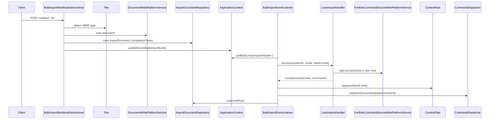

Fineract's bulk-import subsystem lets operators upload Apache POI Excel workbooks (`.xls`) to create or update large numbers of entities in one API call. A dedicated `BulkImportWorkbookService` receives the multipart upload, validates the file type via Apache Tika, deserialises each sheet row by row, and publishes a `BulkImportEvent` to an `ApplicationListener` that dispatches to the right `ImportHandler`. Import results — row counts, error annotations — are written back into the same workbook and persisted through the document-management layer. The `fineract-document` module provides the underlying content-store abstraction (filesystem or S3). The `fineract-provider` `s3` package wires the AWS SDK `S3Client` bean.

---

## Module Layout

| Module | Key Package | Responsibility |
|--------|-------------|----------------|
| `fineract-core` | `...infrastructure.bulkimport` | `GlobalEntityType`, `ImportData`, `BulkImportWorkbookService` SPI |
| `fineract-provider` | `...infrastructure.bulkimport` | `BulkImportApiResource`, all `ImportHandler` impls, populators, service impls |
| `fineract-document` | `...infrastructure.documentmanagement` | `Document`, `DocumentApiResource`, read/write services |
| `fineract-document` | `...infrastructure.contentstore` | `ContentStoreService`, `FileContentStoreService`, `S3ContentStoreService`, policies |
| `fineract-provider` | `...infrastructure.s3` | `AmazonS3Config`, `AmazonS3ConfigCondition`, `S3ClientCustomizer` |

---

## File Inventory

| File | Package | Purpose |
|------|---------|---------|
| `BulkImportApiResource.java` | `...bulkimport.api` | REST: `GET /v1/imports`, `GET /v1/imports/downloadOutputTemplate` |
| `BulkImportWorkbookService.java` | `...bulkimport.service` (core) | SPI: `importWorkbook()`, `getImports()`, `getImport()` |
| `BulkImportWorkbookServiceImpl.java` | `...bulkimport.service` | Upload handling, Tika validation, event publishing |
| `BulkImportWorkbookPopulatorService.java` | `...bulkimport.service` (core) | SPI: `getTemplate()` |
| `BulkImportWorkbookPopulatorServiceImpl.java` | `...bulkimport.service` | Template generation for all entity types |
| `BulkImportEventListener.java` | `...bulkimport.service` | `ApplicationListener<BulkImportEvent>` – dispatches to `ImportHandler` beans |
| `BulkImportEvent.java` | `...bulkimport.data` | Spring event carrying `Workbook`, `ImportDocument`, locale, dateFormat, fileName, fileType, `FineractContext`, entityId |
| `ImportHandler.java` | `...bulkimport.importhandler` | SPI: `Count process(Workbook, locale, dateFormat)` |
| `ImportHandlerUtils.java` | `...bulkimport.importhandler` | Shared cell-reading utilities |
| `ImportDocument.java` | `...bulkimport.domain` | JPA entity – `m_import_document` |
| `ImportDocumentRepository.java` | `...bulkimport.domain` | Spring Data repo for `ImportDocument` |
| `ImportData.java` | `...bulkimport.data` (core) | DTO returned by `BulkImportWorkbookService.getImports()` |
| `GlobalEntityType.java` | `...bulkimport.data` (core) | Enum of all importable entity types |
| `AbstractWorkbookPopulator.java` | `...bulkimport.populator` | Base class for all workbook populators |
| `WorkbookPopulator.java` | `...bulkimport.populator` | Interface: `populate(Workbook, String dateFormat)` |
| `Document.java` | `...documentmanagement.domain` | Spring Data Relational entity – `m_document` |
| `DocumentApiResource.java` | `...documentmanagement.api` | `GET/POST/PUT/DELETE /v1/{entityType}/{entityId}/documents` |
| `DocumentWritePlatformServiceImpl.java` | `...documentmanagement.service` | Create/update/delete documents via `ContentStoreService` |
| `DocumentReadPlatformServiceImpl.java` | `...documentmanagement.service` | Read document metadata + stream content |
| `ContentStoreService.java` | `...contentstore.service` | SPI: `upload()`, `download()`, `delete()` |
| `FileContentStoreService.java` | `...contentstore.service` | Filesystem implementation |
| `S3ContentStoreService.java` | `...contentstore.service` | S3 implementation (conditional on `fineract.content.s3.enabled=true`) |
| `AmazonS3Config.java` | `...infrastructure.s3` | Spring `@Configuration` wiring `S3Client` bean |
| `AmazonS3ConfigCondition.java` | `...infrastructure.s3` | `PropertiesCondition` validating S3 config at boot |

---

## API Endpoints

### `/v1/imports` — `BulkImportApiResource`

| Method | Path | Description |
|--------|------|-------------|
| `GET` | `/v1/imports` | List import records for an entity type. Param: `?entityType=<GlobalEntityType.code>`. For `entityType=client`, both `clients.person` and `clients.entity` records are merged. |
| `GET` | `/v1/imports/getOutputTemplateLocation` | Returns the file storage `location` string for an import document. Param: `?importDocumentId=`. |
| `GET` | `/v1/imports/downloadOutputTemplate` | Streams the result workbook as `application/vnd.ms-excel`. Param: `?importDocumentId=`. |

<Note>
There is no `POST /v1/imports` endpoint in `BulkImportApiResource`. Upload is done via the entity-specific endpoints (e.g. `POST /v1/clients` with `multipart/form-data` for clients). The `BulkImportWorkbookServiceImpl.importWorkbook()` method is called from the individual resource handler code and dispatches via `BulkImportEvent`.
</Note>

---

## `GlobalEntityType` Enum

`fineract-core/.../bulkimport/data/GlobalEntityType.java` defines the complete set of entity type codes used throughout bulk import and document management. The `BulkImportEventListener` switch handles a subset of these for actual workbook import; the rest are used for document and event routing.

| Enum | Code | Value | Import Handler |
|------|------|-------|----------------|
| `INVALID` | `invalid` | 0 | — |
| `CLIENTS_PERSON` | `clients.person` | 1 | `clientPersonImportHandler` |
| `CLIENTS_ENTITY` | `clients.entity` | 2 | `clientEntityImportHandler` |
| `GROUPS` | `groups` | 3 | `groupImportHandler` |
| `CENTERS` | `centers` | 4 | `centerImportHandler` |
| `OFFICES` | `offices` | 5 | `officeImportHandler` |
| `STAFF` | `staff` | 6 | `staffImportHandler` |
| `USERS` | `users` | 7 | `userImportHandler` |
| `SMS` | `sms` | 8 | — |
| `DOCUMENTS` | `documents` | 9 | — |
| `TEMPLATES` | `templates` | 10 | — |
| `NOTES` | `templates` | 11 | — (note: shares code with `TEMPLATES`) |
| `CALENDAR` | `calendar` | 12 | — |
| `MEETINGS` | `meetings` | 13 | — |
| `HOLIDAYS` | `holidays` | 14 | — |
| `LOANS` | `loans` | 15 | `loanImportHandler` |
| `LOAN_PRODUCTS` | `loancharges` | 16 | — |
| `LOAN_TRANSACTIONS` | `loantransactions` | 18 | `loanRepaymentImportHandler` |
| `GUARANTORS` | `guarantors` | 19 | `guarantorImportHandler` |
| `COLLATERALS` | `collaterals` | 20 | — |
| `FUNDS` | `funds` | 21 | — |
| `CURRENCY` | `currencies` | 22 | — |
| `SAVINGS_ACCOUNT` | `savingsaccount` | 23 | `savingsImportHandler` |
| `SAVINGS_CHARGES` | `savingscharges` | 24 | — |
| `SAVINGS_TRANSACTIONS` | `savingstransactions` | 25 | `savingsTransactionImportHandler` |
| `SAVINGS_PRODUCTS` | `savingsproducts` | 26 | — |
| `GL_JOURNAL_ENTRIES` | `gljournalentries` | 27 | `journalEntriesImportHandler` |
| `CODE_VALUE` | `codevalue` | 28 | — |
| `CODE` | `code` | 29 | — |
| `CHART_OF_ACCOUNTS` | `chartofaccounts` | 30 | `chartOfAccountsImportHandler` |
| `FIXED_DEPOSIT_ACCOUNTS` | `fixeddepositaccounts` | 31 | `fixedDepositImportHandler` |
| `FIXED_DEPOSIT_TRANSACTIONS` | `fixeddeposittransactions` | 32 | `fixedDepositTransactionImportHandler` |
| `SHARE_ACCOUNTS` | `shareaccounts` | 33 | `sharedAccountImportHandler` |
| `RECURRING_DEPOSIT_ACCOUNTS` | `recurringdeposits` | 34 | `recurringDepositImportHandler` |
| `RECURRING_DEPOSIT_ACCOUNTS_TRANSACTIONS` | `recurringdepositstransactions` | 35 | `recurringDepositTransactionImportHandler` |
| `CLIENT` | `client` | 36 | — (used for `?entityType=client` merge query in `BulkImportApiResource`) |

<Note>
`NOTES(11)` and `TEMPLATES(10)` both use the code string `"templates"` — this is the actual value in the source. The `BulkImportApiResource` merges `CLIENTS_PERSON` and `CLIENTS_ENTITY` when `?entityType=client` (value 36) is passed, delegating to `GlobalEntityType.CLIENT.getCode()` for the comparison.
</Note>

---

## `ImportDocument` Entity (`m_import_document`)

```java
// fineract-provider/.../bulkimport/domain/ImportDocument.java
@Entity @Table(name = "m_import_document")
public final class ImportDocument extends AbstractPersistableCustom<Long> {
    Long          documentId;    // FK → m_document.id
    LocalDateTime importTime;    // when upload was received
    LocalDateTime endTime;       // when processing completed
    Boolean       completed;     // false=in-progress, true=done
    Integer       entityType;    // GlobalEntityType.value
    AppUser       createdBy;     // FK → m_appuser
    Integer       totalRecords;  // rows in the sheet
    Integer       successCount;
    Integer       failureCount;
}
```

`ImportData` (the DTO returned by `getImports()`) is a flat data class with the same fields plus `importId` and `name` (document file name).

---

## Import Flow

<Steps>
  <Step title="Upload">
    Client POSTs a `.xls` file (multipart) to an entity endpoint. `BulkImportWorkbookServiceImpl.importWorkbook()` is called with `entity` string, `InputStream`, `FormDataContentDisposition`, `locale`, and `dateFormat`.
  </Step>
  <Step title="Tika Validation">
    Apache Tika detects the MIME type. If not `msoffice` or `application/vnd.ms-excel`, `GeneralPlatformDomainRuleException` is thrown. Only `.xls` (HSSF) format is accepted — not `.xlsx`.
  </Step>
  <Step title="ImportDocument Created">
    An `ImportDocument` is created with `completed = false` and the document is persisted via `DocumentWritePlatformService`. The document ID is stored in `ImportDocument.documentId`.
  </Step>
  <Step title="BulkImportEvent Published">
    `BulkImportEvent` is published via Spring's `ApplicationContext.publishEvent()`. It carries: `Workbook`, `ImportDocument`, `locale`, `dateFormat`, `fileName`, `fileType`, `FineractContext`, and `entityId` (the authenticated user's ID).
  </Step>
  <Step title="BulkImportEventListener Routes">
    `BulkImportEventListener.onApplicationEvent()` uses a `switch` on `GlobalEntityType` to look up the correct `ImportHandler` bean by name from `ApplicationContext`.
  </Step>
  <Step title="ImportHandler Processes">
    The handler reads each sheet row, constructs JSON payloads, and calls `PortfolioCommandSourceWritePlatformService.logCommandSource()` for each entity. Errors are written to a status cell in the workbook (usually highlighted in `IndexedColors.RED`).
  </Step>
  <Step title="Workbook Written Back">
    `BulkImportEventListener` pipes the annotated workbook back through `ContentPipe` and updates the stored document via `DocumentUpdateCommand`. `ImportDocument.update(endTime, successCount, errorCount)` is called and flushed.
  </Step>
</Steps>



---

## `ImportHandler` SPI

```java
// fineract-provider/.../bulkimport/importhandler/ImportHandler.java
public interface ImportHandler {
    Count process(Workbook workbook, String locale, String dateFormat);
}
```

All implementations are Spring `@Service` beans with explicit bean names used in the `BulkImportEventListener` switch. `Count` is a simple DTO with `successCount` and `errorCount`.

### All Import Handlers

| Bean Name | Class | Entity |
|-----------|-------|--------|
| `officeImportHandler` | `OfficeImportHandler` | `m_office` |
| `centerImportHandler` | `CenterImportHandler` | `m_center` / `m_group` |
| `chartOfAccountsImportHandler` | `ChartOfAccountsImportHandler` | `acc_gl_account` |
| `clientEntityImportHandler` | `ClientEntityImportHandler` | `m_client` (legal entity) |
| `clientPersonImportHandler` | `ClientPersonImportHandler` | `m_client` (individual) |
| `fixedDepositImportHandler` | `FixedDepositImportHandler` | `m_savings_account` (FD) |
| `fixedDepositTransactionImportHandler` | `FixedDepositTransactionImportHandler` | FD transactions |
| `groupImportHandler` | `GroupImportHandler` | `m_group` |
| `guarantorImportHandler` | `GuarantorImportHandler` | `m_guarantor` |
| `journalEntriesImportHandler` | `JournalEntriesImportHandler` | `acc_gl_journal_entry` |
| `loanImportHandler` | `LoanImportHandler` | `m_loan` (create + approve + disburse) |
| `loanRepaymentImportHandler` | `LoanRepaymentImportHandler` | `m_loan_transaction` |
| `recurringDepositImportHandler` | `RecurringDepositImportHandler` | `m_savings_account` (RD) |
| `recurringDepositTransactionImportHandler` | `RecurringDepositTransactionImportHandler` | RD transactions |
| `savingsImportHandler` | `SavingsImportHandler` | `m_savings_account` |
| `savingsTransactionImportHandler` | `SavingsTransactionImportHandler` | `m_savings_account_transaction` |
| `sharedAccountImportHandler` | `SharedAccountImportHandler` | `m_share_account` |
| `staffImportHandler` | `StaffImportHandler` | `m_staff` |
| `userImportHandler` | `UserImportHandler` | `m_appuser` |

---

## Workbook Populators (Template Generation)

`BulkImportWorkbookPopulatorServiceImpl.getTemplate()` accepts `entityType`, `officeId`, `staffId`, `dateFormat` and builds a pre-populated `.xls` template for download. Each template type has a dedicated `WorkbookPopulator` class:

| Populator Class | Entity |
|----------------|--------|
| `OfficeWorkbookPopulator` | Offices |
| `CentersWorkbookPopulator` | Centers |
| `ClientPersonWorkbookPopulator` | Individual clients |
| `ClientEntityWorkbookPopulator` | Legal entity clients |
| `GroupsWorkbookPopulator` | Groups |
| `LoanWorkbookPopulator` | Loans |
| `LoanRepaymentWorkbookPopulator` | Loan repayments |
| `GuarantorWorkbookPopulator` | Guarantors |
| `SavingsWorkbookPopulator` | Savings accounts |
| `SavingsTransactionsWorkbookPopulator` | Savings transactions |
| `FixedDepositWorkbookPopulator` | Fixed deposit accounts |
| `FixedDepositTransactionWorkbookPopulator` | Fixed deposit transactions |
| `RecurringDepositWorkbookPopulator` | Recurring deposit accounts |
| `RecurringDepositTransactionWorkbookPopulator` | Recurring deposit transactions |
| `SharedAccountWorkBookPopulator` | Share accounts |
| `JournalEntriesWorkbookPopulator` | Journal entries |
| `ChartOfAccountsWorkbook` | Chart of accounts |
| `StaffWorkbookPopulator` | Staff |
| `UserWorkbookPopulator` | Users |

All populators extend `AbstractWorkbookPopulator` and implement `WorkbookPopulator.populate(Workbook, String dateFormat)`. Helper sheet populators (e.g. `OfficeSheetPopulator`, `ClientSheetPopulator`, `LoanProductSheetPopulator`) fill reference-data lookup sheets used for Excel data validation dropdowns.

---

## `TemplatePopulateImportConstants`

`fineract-provider/.../bulkimport/constants/TemplatePopulateImportConstants.java` defines shared Excel sheet and column constants (sheet names, column indices) reused across all populators. Each entity also has its own constants file:

`CenterConstants`, `ChargeConstants`, `ChartOfAccountsConstants`, `ClientEntityConstants`, `ClientPersonConstants`, `FixedDepositConstants`, `GroupConstants`, `GuarantorConstants`, `JournalEntryConstants`, `LoanConstants`, `LoanRepaymentConstants`, `OfficeConstants`, `RecurringDepositConstants`, `SavingsConstants`, `SharedAccountsConstants`, `StaffConstants`, `TransactionConstants`, `UserConstants`.

---

## Document Management (`fineract-document`)

### `Document` Entity (`m_document`)

```java
// fineract-document/.../documentmanagement/domain/Document.java
@Table("m_document")
public final class Document {
    Long    id;
    String  parentEntityType;  // e.g. "clients", "loans", "IMPORT"
    Long    parentEntityId;
    String  name;
    String  fileName;
    Long    size;
    String  type;              // MIME type
    String  description;
    String  location;          // path/key in content store
    Integer storageType;       // 1=filesystem, 2=S3
}
```

### Document API Endpoints (`DocumentApiResource`)

Base path: `/v1/{entityType}/{entityId}/documents`

| Method | Path | Description |
|--------|------|-------------|
| `GET` | `/v1/{entityType}/{entityId}/documents` | List documents for entity. |
| `POST` | `/v1/{entityType}/{entityId}/documents` | Upload document (multipart). |
| `GET` | `/v1/{entityType}/{entityId}/documents/{documentId}` | Retrieve document metadata. |
| `PUT` | `/v1/{entityType}/{entityId}/documents/{documentId}` | Replace document file. |
| `DELETE` | `/v1/{entityType}/{entityId}/documents/{documentId}` | Delete document + file. |
| `GET` | `/v1/{entityType}/{entityId}/documents/{documentId}/attachment` | Stream file bytes. |

Supported `entityType` values: `clients`, `staff`, `loans`, `savings`, `client_identifiers`, `groups`.

---

## Content Store Architecture

The `ContentStoreService` interface in `fineract-document` has two implementations:

<Tabs>
  <Tab title="Filesystem">
    `FileContentStoreService` — active when `fineract.content.filesystem.enabled=true`. Files are stored under `fineract.content.filesystem.rootFolder` (default: `~/.fineract`). `DefaultContentPathRandomizer` generates a UUID-based path. Path traversal attacks are blocked by `DefaultContentPathSanitizer`.

    ```properties
    fineract.content.filesystem.enabled=${FINERACT_CONTENT_FILESYSTEM_ENABLED:true}
    fineract.content.filesystem.rootFolder=${FINERACT_CONTENT_FILESYSTEM_ROOT_FOLDER:${user.home}/.fineract}
    ```
  </Tab>
  <Tab title="S3">
    `S3ContentStoreService` — active when `fineract.content.s3.enabled=true`. Uses AWS SDK v2 `S3Client`. Upload calls `s3Client.putObject()`. Download calls `s3Client.getObject()` → `ResponseTransformer.toBytes()`.

    ```properties
    fineract.content.s3.enabled=${FINERACT_CONTENT_S3_ENABLED:false}
    fineract.content.s3.bucketName=${FINERACT_CONTENT_S3_BUCKET_NAME:}
    fineract.content.s3.accessKey=${FINERACT_CONTENT_S3_ACCESS_KEY:}
    fineract.content.s3.secretKey=${FINERACT_CONTENT_S3_SECRET_KEY:}
    fineract.content.s3.region=${FINERACT_CONTENT_S3_REGION:}
    fineract.content.s3.endpoint=${FINERACT_CONTENT_S3_ENDPOINT:}
    fineract.content.s3.path-style-addressing-enabled=${FINERACT_CONTENT_S3_PATH_STYLE_ADDRESSING_ENABLED:false}
    ```
  </Tab>
</Tabs>

### All `fineract.content.*` Properties

| Property | Env Var | Default | Description |
|----------|---------|---------|-------------|
| `fineract.content.regex-whitelist-enabled` | `FINERACT_CONTENT_REGEX_WHITELIST_ENABLED` | `true` | Enable regex-based file name whitelist |
| `fineract.content.regex-whitelist` | `FINERACT_CONTENT_REGEX_WHITELIST` | `.*\.pdf$,...` | Allowed filename regex patterns |
| `fineract.content.mime-whitelist-enabled` | `FINERACT_CONTENT_MIME_WHITELIST_ENABLED` | `true` | Enable MIME type whitelist |
| `fineract.content.mime-whitelist` | `FINERACT_CONTENT_MIME_WHITELIST` | `application/pdf,...` | Allowed MIME types |
| `fineract.content.default-buffer-size` | `FINERACT_CONTENT_DEFAULT_BUFFER_SIZE` | `8192` | Stream buffer size (bytes) |
| `fineract.content.filesystem.enabled` | `FINERACT_CONTENT_FILESYSTEM_ENABLED` | `true` | Enable local filesystem store |
| `fineract.content.filesystem.rootFolder` | `FINERACT_CONTENT_FILESYSTEM_ROOT_FOLDER` | `~/.fineract` | Root path for file storage |
| `fineract.content.s3.enabled` | `FINERACT_CONTENT_S3_ENABLED` | `false` | Enable S3 content store |
| `fineract.content.s3.bucketName` | `FINERACT_CONTENT_S3_BUCKET_NAME` | `` | S3 bucket |
| `fineract.content.s3.accessKey` | `FINERACT_CONTENT_S3_ACCESS_KEY` | `` | AWS access key (or use IAM role) |
| `fineract.content.s3.secretKey` | `FINERACT_CONTENT_S3_SECRET_KEY` | `` | AWS secret key |
| `fineract.content.s3.region` | `FINERACT_CONTENT_S3_REGION` | `` | AWS region |
| `fineract.content.s3.endpoint` | `FINERACT_CONTENT_S3_ENDPOINT` | `` | Override endpoint (e.g. LocalStack) |
| `fineract.content.s3.path-style-addressing-enabled` | `FINERACT_CONTENT_S3_PATH_STYLE_ADDRESSING_ENABLED` | `false` | Force path-style S3 URLs |

---

## S3 Client Wiring (`fineract-provider/infrastructure/s3`)

`AmazonS3Config` is a `@Conditional(AmazonS3ConfigCondition.class)` configuration that:

1. Defines `DefaultCredentialsProvider` bean (uses AWS default credential chain).
2. Defines `AwsRegionProvider` bean via `DefaultAwsRegionProviderChain`.
3. Defines `S3Client` bean with `RequestChecksumCalculation.WHEN_REQUIRED` and applies all `S3ClientCustomizer` beans.
4. Conditionally registers `S3DatatableReportExportServiceImpl` bean when `S3Client` is present.

`AmazonS3ConfigCondition` calls `DefaultCredentialsProvider.resolveCredentials()` and `DefaultAwsRegionProviderChain.getRegion()` at startup — if either fails, the entire `AmazonS3Config` is skipped.

`LocalstackS3ClientCustomizer` (`@Profile("test")`) overrides the endpoint URL with `AWS_ENDPOINT_URL` environment variable and enables path-style addressing for LocalStack testing.

---

## Content Policy Pipeline

Before any upload or download, `ContentStoreService` implementations invoke `ContentPolicyContext` chains:

- `DefaultPreUploadContentPolicy` → validates file type via `ContentDetectorManager` (Tika + filename)
- `DefaultPostUploadContentPolicy` → finalises storage
- `DefaultDownloadContentPolicy` → path traversal check via `TraversalContentPolicy`
- `DefaultDeleteContentPolicy` → path validation

`ContentDetectorManager` runs `FileContentDetector` (extension-based) and `TikaContentDetector` (magic-bytes-based) and reconciles results. `MimeContentPolicy` enforces `fineract.content.mime-whitelist`. `TraversalContentPolicy` blocks `..` in paths.

---

## Adding a New Import Handler

<Steps>
  <Step title="Add enum value to GlobalEntityType">
    Add a new entry to `GlobalEntityType` in `fineract-core` with a unique integer value and code string.
  </Step>
  <Step title="Implement ImportHandler">
    Create `MyEntityImportHandler implements ImportHandler`, annotate with `@Service("myEntityImportHandler")`. In `process()`, iterate rows via `ImportHandlerUtils` helpers, build JSON payloads, call `commandsSourceWritePlatformService.logCommandSource()`, and write `IndexedColors.RED` cell styles on failures.
  </Step>
  <Step title="Create WorkbookPopulator">
    Extend `AbstractWorkbookPopulator` for template generation.
  </Step>
  <Step title="Register in BulkImportEventListener">
    Add a `case MY_ENTITY_TYPE -> applicationContext.getBean("myEntityImportHandler", ImportHandler.class);` branch in `BulkImportEventListener.onApplicationEvent()`.
  </Step>
  <Step title="Add constants file">
    Create `MyEntityConstants.java` under `...bulkimport.constants` with sheet/column index constants.
  </Step>
</Steps>

---

## Gotchas & Invariants

<Warning>
**Only `.xls` (HSSF) is supported — not `.xlsx` (XSSF).** `BulkImportWorkbookServiceImpl` explicitly creates `new HSSFWorkbook(clonedInputStream)`. Uploading an `.xlsx` file will pass Tika MIME validation but fail at `HSSFWorkbook` construction.
</Warning>

<Warning>
**Imports are asynchronous via Spring events.** `BulkImportWorkbookServiceImpl.importWorkbook()` returns a `Long` (import document ID) *before* processing completes. Callers must poll `GET /v1/imports?entityType=...` and check `ImportData.completed`.
</Warning>

<Warning>
**S3 and filesystem stores are mutually exclusive in practice but not enforced.** Both `FileContentStoreService` and `S3ContentStoreService` are `ContentStoreService` beans. If both are active, the `@Primary` or injection order determines which is used. Ensure only one is enabled.
</Warning>

<Note>
`BulkImportEventListener` catches all `Exception` and only logs them — a processing failure does NOT propagate back to the caller. Always inspect the downloaded output workbook for red-highlighted error rows.
</Note>

<Note>
The `Document.storageType` integer uses `ContentStoreType` enum: `1 = FILE_SYSTEM`, `2 = S3`. This is stored in `m_document.storage_type_enum` so the correct retrieval path is used when streaming.
</Note>

<Tip>
To test S3 locally, set `AWS_ENDPOINT_URL=http://localhost:4566` and activate the `test` Spring profile. `LocalstackS3ClientCustomizer` will override the endpoint and enable path-style addressing automatically.
</Tip>
