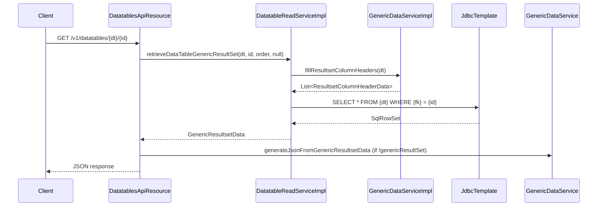

Fineract's **datatable subsystem** lets operators plug arbitrary MySQL tables into the platform and expose them over a uniform CRUD API without writing Java code. A "datatable" is any MySQL table with a foreign-key column pointing at a core application table (`m_client`, `m_loan`, etc.). Once registered in `x_registered_table`, Fineract enforces permission checks, scopes rows to the authenticated user's office hierarchy, and serialises results via `GenericResultsetData`. The same infrastructure backs the built-in reporting layer (`stretchy_report`) and can gate lifecycle transitions (e.g. loan approval) behind required datatable completion via `m_entity_datatable_check`.

---

## File Inventory

| File | Package | Purpose |
|------|---------|---------|
| `DatatablesApiResource.java` | `...dataqueries.api` | REST resource – all `/v1/datatables` endpoints |
| `EntityDatatableChecksApiResource.java` | `...dataqueries.api` | REST resource – `/v1/entityDatatableChecks` |
| `ReportsApiResource.java` | `...dataqueries.api` | REST resource – `/v1/reports` CRUD |
| `RunreportsApiResource.java` | `...dataqueries.api` | REST resource – `/v1/runreports/{reportName}` execution |
| `DatatableReadServiceImpl.java` | `...dataqueries.service` | Query / metadata read implementation |
| `DatatableWriteServiceImpl.java` | `...dataqueries.service` | DDL mutation and DML write operations |
| `GenericDataServiceImpl.java` | `...dataqueries.service` | Low-level SQL→`GenericResultsetData` conversion |
| `DatatableReportingProcessService.java` | `...dataqueries.service` | `@ReportService` for `Table`, `Chart`, `SMS` report types |
| `DatatableExportTargetParameter.java` | `...dataqueries.service` | Enum: `CSV`, `PDF`, `S3`, `JSON`, `PRETTY_JSON` |
| `ReadReportingServiceImpl.java` | `...dataqueries.service` | Retrieves `stretchy_report` definitions, runs SQL |
| `EntityDatatableChecksWritePlatformServiceImpl.java` | `...dataqueries.service` | Validates & persists entity-datatable check rules |
| `EntityDatatableChecksReadPlatformServiceImpl.java` | `...dataqueries.service` | Reads `m_entity_datatable_check` with pagination |
| `RegisteredDatatable.java` | `...dataqueries.domain` | JPA entity – `x_registered_table` |
| `EntityDatatableChecks.java` | `...dataqueries.domain` | JPA entity – `m_entity_datatable_check` |
| `Report.java` | `...dataqueries.domain` | JPA entity – `stretchy_report` |
| `ReportParameter.java` | `...dataqueries.domain` | JPA entity – `stretchy_report_parameter` |
| `ReportParameterUsage.java` | `...dataqueries.domain` | JPA join – `stretchy_report_param_usage` |
| `GenericResultsetData.java` | `...dataqueries.data` | Immutable DTO wrapping column headers + row data |
| `ResultsetColumnHeaderData.java` | `...dataqueries.data` | Column metadata (type, length, nullable, code) |
| `DatatableData.java` | `...dataqueries.data` | DTO: `applicationTableName`, `registeredTableName`, `columnHeaderData` |
| `EntityTables.java` | `...dataqueries.data` (core) | Enum of all valid `apptableName` values |
| `DataQueriesAutoConfiguration.java` | `...dataqueries.starter` | Spring Boot auto-config wiring the subsystem |

---

## Key Abstractions

### `RegisteredDatatable` — `x_registered_table`

```java
// fineract-provider/.../dataqueries/domain/RegisteredDatatable.java
@Entity @Table(name = "x_registered_table")
public class RegisteredDatatable extends AbstractPersistableCustom<Long> {
    String datatableName;     // registered_table_name
    String entity;            // application_table_name (e.g. "m_client")
    String subtype;           // entity_subtype (nullable)
    int    category;          // 0 = normal, 200 = PPI/survey
}
```

`category = 200` marks a PPI survey table. The `entity` field must be one of the strings listed in `EntityTables` (e.g. `m_client`, `m_loan`, `m_group`, `m_savings_account`, `m_product_loan`).

### `EntityDatatableChecks` — `m_entity_datatable_check`

```java
// fineract-provider/.../dataqueries/domain/EntityDatatableChecks.java
@Entity @Table(name = "m_entity_datatable_check")
public class EntityDatatableChecks extends AbstractPersistableCustom<Long> {
    String  entity;          // application_table_name
    String  datatableName;   // x_registered_table_name
    Integer status;          // status_enum (lifecycle status integer)
    boolean systemDefined;
    Long    productId;       // nullable – restrict to specific product
}
```

When a lifecycle transition fires (e.g. loan approval at `status = 200`), `EntityDatatableChecksWritePlatformServiceImpl` queries this table and throws `DatatableEntryRequiredException` if any required table has no rows for that entity ID.

### `GenericResultsetData`

The universal query result wrapper returned by `GenericDataServiceImpl.fillGenericResultSet()`:

```java
// fineract-core/.../dataqueries/data/GenericResultsetData.java
public final class GenericResultsetData {
    List<ResultsetColumnHeaderData> columnHeaders; // column metadata
    List<ResultsetRowData>          data;          // rows (List of List<String>)
}
```

`ResultsetColumnHeaderData` carries: `columnName`, `columnType` (`JdbcJavaType`), `columnLength`, `isColumnNullable`, `isColumnPrimaryKey`, `isColumnUnique`, `isColumnIndexed`, `columnValues` (for Dropdown/code columns), `columnCode`.

### `EntityTables` Enum

`fineract-core/.../dataqueries/data/EntityTables.java` enumerates all valid `apptableName` values and their foreign-key column names:

| Enum Value | DB Table | FK Column |
|------------|----------|-----------|
| `CLIENT` | `m_client` | `client_id` |
| `GROUP` | `m_group` | `group_id` |
| `CENTER` | `m_center` / `m_group` | `center_id` |
| `OFFICE` | `m_office` | `office_id` |
| `LOAN` | `m_loan` | `loan_id` |
| `LOAN_PRODUCT` | `m_product_loan` | `product_loan_id` |
| `SAVINGS` | `m_savings_account` | `savings_account_id` |
| `SAVINGS_PRODUCT` | `m_savings_product` | `savings_product_id` |
| `SAVINGS_TRANSACTION` | `m_savings_account_transaction` | `savings_transaction_id` |
| `SHARE_PRODUCT` | `m_share_product` | `share_product_id` |
| `WC_LOAN_PRODUCT` | `m_wc_loan_product` | `wc_product_loan_id` |
| `WC_LOAN` | `m_wc_loan` | `wc_loan_id` |

---

## API Endpoints

### `/v1/datatables` — `DatatablesApiResource`

| Method | Path | Description |
|--------|------|-------------|
| `GET` | `/v1/datatables` | List all registered datatables. `?apptable=m_client` filters by parent table. |
| `POST` | `/v1/datatables` | Create and register a new datatable. Executes DDL. |
| `GET` | `/v1/datatables/{datatable}` | Retrieve metadata for one datatable. |
| `PUT` | `/v1/datatables/{datatableName}` | Update datatable schema (add/change/drop columns). |
| `DELETE` | `/v1/datatables/{datatableName}` | Delete the datatable and deregister it. |
| `POST` | `/v1/datatables/register/{datatable}/{apptable}` | Register an existing DB table. Pass `category=200` for PPI. |
| `POST` | `/v1/datatables/deregister/{datatable}` | Deregister (table stays in DB). |
| `GET` | `/v1/datatables/{datatable}/{apptableId}` | Read rows for an entity. `?genericResultSet=true` returns raw `GenericResultsetData`. `?order=col desc` sorts. |
| `GET` | `/v1/datatables/{datatable}/{apptableId}/{datatableId}` | Read single one-to-many row. |
| `POST` | `/v1/datatables/{datatable}/{apptableId}` | Insert a new row. |
| `PUT` | `/v1/datatables/{datatable}/{apptableId}` | Update one-to-one row. |
| `PUT` | `/v1/datatables/{datatable}/{apptableId}/{datatableId}` | Update one-to-many row by ID. |
| `DELETE` | `/v1/datatables/{datatable}/{apptableId}` | Delete all rows for entity (one-to-one or bulk one-to-many). |
| `DELETE` | `/v1/datatables/{datatable}/{apptableId}/{datatableId}` | Delete specific one-to-many row. |
| `GET` | `/v1/datatables/{datatable}/query` | Simple column/value filter query. Params: `columnFilter`, `valueFilter`, `resultColumns`. |
| `POST` | `/v1/datatables/{datatable}/query` | Advanced paged query via `PagedLocalRequest<AdvancedQueryData>`. |

### `/v1/entityDatatableChecks` — `EntityDatatableChecksApiResource`

| Method | Path | Description |
|--------|------|-------------|
| `GET` | `/v1/entityDatatableChecks` | List checks. Supports `?status`, `?entity`, `?productId`, `?offset`, `?limit`. |
| `GET` | `/v1/entityDatatableChecks/template` | Retrieve template/enum options. |
| `POST` | `/v1/entityDatatableChecks` | Create a new check rule. Mandatory: `entity`, `status`, `datatableName`. Optional: `productId`. |
| `DELETE` | `/v1/entityDatatableChecks/{entityDatatableCheckId}` | Delete a check rule. |

---

## Datatable Column Types

When creating a datatable via `POST /v1/datatables`, the `columns` array accepts these `type` values:

| API Type | Maps To SQL | Notes |
|----------|-------------|-------|
| `Boolean` | `TINYINT(1)` | |
| `Date` | `DATE` | |
| `DateTime` | `DATETIME` | |
| `Decimal` | `DECIMAL(19,6)` | |
| `Dropdown` | `INT` (FK → `m_code_value`) | Requires `code` field. Column name becomes `code_cd_<name>`. |
| `Number` | `BIGINT` | |
| `String` | `VARCHAR(length)` | Requires `length` field. |
| `Text` | `TEXT` | |

<Note>
Dropdown columns store the code-value ID (integer). The column name is automatically suffixed: `code_cd_<columnName>`. The corresponding code value label is resolved by joining `m_code_value` at query time via `GenericDataServiceImpl.fillResultsetColumnHeaders()`.
</Note>

---

## Control & Data Flow

### Creating and Registering a Datatable

<Steps>
  <Step title="POST /v1/datatables">
    `DatatablesApiResource.createDatatable()` dispatches a `CommandWrapper` built with `createDBDatatable()`.
  </Step>
  <Step title="CreateDatatableCommandHandler">
    Invokes `DatatableWriteService.createDatatable()` which executes DDL (`CREATE TABLE`) and inserts a row into `x_registered_table`.
  </Step>
  <Step title="Register separately">
    An existing DB table can be registered without DDL via `POST /v1/datatables/register/{datatable}/{apptable}` → `RegisterDatatableCommandHandler` → `DatatableWriteService.registerDatatable()`.
  </Step>
</Steps>

### Reading Datatable Rows



### Entity Datatable Check Enforcement

When any lifecycle command fires (loan approval, disbursement, etc.), `EntityDatatableChecksWritePlatformServiceImpl.runTheCheck()` is invoked:

1. Queries `m_entity_datatable_check` for rows matching `entity` + `status_enum`.
2. For each matching row, queries the datatable for rows with the entity FK.
3. If no rows exist, throws `DatatableEntryRequiredException`.

---

## Report Entity (`stretchy_report`)

The `Report` domain entity in `Report.java` maps to table `stretchy_report`:

| Column | Type | Notes |
|--------|------|-------|
| `report_name` | `VARCHAR(100)` | Unique |
| `report_type` | `VARCHAR` | Must be one of the registered report types (`Table`, `Chart`, `SMS`, `Pentaho`) |
| `report_subtype` | `VARCHAR(20)` | Required when `report_type=Chart`; must be `Bar` or `Pie` |
| `report_category` | `VARCHAR(45)` | Optional grouping |
| `description` | `TEXT` | |
| `core_report` | `TINYINT(1)` | Seeded reports; only `use_report` can be updated |
| `use_report` | `TINYINT(1)` | Controls visibility in reference UI |
| `report_sql` | `TEXT` | Required for `Table` and `Chart` types; forbidden for `Pentaho` |

The `Report` entity cascades `ReportParameterUsage` (join table `stretchy_report_param_usage`). `ReportParameter` (table `stretchy_report_parameter`) holds the parameter catalogue.

---

## Reports vs. Datatables

<CardGroup cols={2}>
  <Card title="Datatables" icon="table">
    Custom MySQL tables linked to core entities. CRUD via `/v1/datatables`. Results are entity-scoped; read/write driven by `DatatableReadServiceImpl` / `DatatableWriteServiceImpl`. Column DDL managed by Fineract.
  </Card>
  <Card title="Reports (stretchy_report)" icon="chart-bar">
    Named SQL queries stored in `stretchy_report`. Read-only execution via `/v1/runreports/{reportName}`. No entity scoping – full SQL control. Supports CSV, PDF, JSON, S3 export. Managed via `/v1/reports`.
  </Card>
</CardGroup>

---

## Export Pipeline

`DatatableReportingProcessService` (annotated `@ReportService(type = {"Table", "Chart", "SMS"})`) resolves export mode from `DatatableExportTargetParameter` enum and delegates to the appropriate `DatatableReportExportService`:

| Export Mode | Query Param | Implementation |
|-------------|-------------|----------------|
| `JSON` | default | `JsonDatatableReportExportService` |
| `PRETTY_JSON` | `pretty=true` | `JsonDatatableReportExportService` |
| `CSV` | `exportCSV=true` | `CsvDatatableReportExportServiceImpl` |
| `PDF` | `exportPDF=true` | `PdfDatatableReportExportService` |
| `S3` | `exportS3=true` | `S3DatatableReportExportServiceImpl` (conditional on `fineract.report.export.s3.enabled=true`) |

---

## Permission Model

Permissions are checked in `DatatableReadServiceImpl.retrieveDatatableNames()` via a sub-select against `m_appuser_role` / `m_permission`. A user must have one of:

- `ALL_FUNCTIONS`
- `ALL_FUNCTIONS_READ`
- `READ_<registeredTableName>` (exact match on the datatable name)

Write operations use `CREATE_<name>`, `UPDATE_<name>`, `DELETE_<name>` permission codes verified at the command-handler level via `PlatformSecurityContext`.

---

## Gotchas & Invariants

<Warning>
**DDL is irreversible via the API.** `DELETE /v1/datatables/{name}` executes `DROP TABLE` in the database. There is no soft-delete.
</Warning>

<Warning>
**Dropdown columns are renamed.** When you declare a column of type `Dropdown` with `name = "gender"`, the actual DB column becomes `gender_cd_gender` — the prefix `code_cd_` is applied by `DatatableWriteServiceImpl`. API requests must use the suffixed name.
</Warning>

<Note>
`multiRow = false` (default) creates a one-to-one datatable. The primary key is the FK itself (`client_id` etc.). When `multiRow = true`, an extra `id BIGINT AUTO_INCREMENT PRIMARY KEY` column is added, allowing multiple rows per entity.
</Note>

<Note>
The `genericResultSet=true` query parameter on read endpoints returns raw `GenericResultsetData` (column headers + row arrays). Omitting it calls `GenericDataService.generateJsonFromGenericResultsetData()` which flattens rows to key-value JSON objects.
</Note>

<Tip>
To add columns to an existing datatable without recreating it, use `PUT /v1/datatables/{name}` with `addColumns`, `changeColumns`, and `dropColumns` arrays. The write service translates these to `ALTER TABLE` statements.
</Tip>
