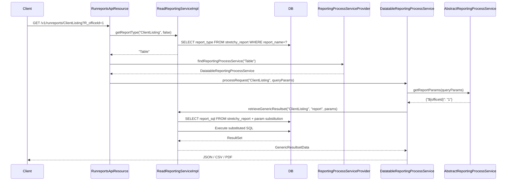

Fineract's reporting engine is a provider-based SPI that routes report execution requests to pluggable implementations. The central dispatcher — `ReportingProcessServiceProvider` — discovers all Spring beans annotated with `@ReportService` at startup, registers them by type string, and returns the correct provider when `RunreportsApiResource` receives a `GET /v1/runreports/{reportName}` call. The built-in `DatatableReportingProcessService` handles the `Table`, `Chart`, and `SMS` types using raw SQL from `stretchy_report`. An optional Pentaho provider can be added to handle the `Pentaho` type. Scheduled delivery is handled by `ReportMailingJobApiResource` and the `ReportMailingJob` entity. MIX Market reporting lives in the `fineract-mix` module and generates XBRL XML output.

---

## Module Layout

| Module | Key Package | Responsibility |
|--------|-------------|----------------|
| `fineract-report` | `...infrastructure.report` | SPI interfaces, `@ReportService` annotation, `AbstractReportingProcessService` base class |
| `fineract-provider` | `...dataqueries.api` | `ReportsApiResource`, `RunreportsApiResource` REST endpoints |
| `fineract-provider` | `...dataqueries.service` | `ReadReportingServiceImpl`, `DatatableReportingProcessService`, export services |
| `fineract-provider` | `...reportmailingjob` | Scheduled report-by-email: entity, handlers, API, service |
| `fineract-mix` | `...mix` | XBRL generation for MIX Market (`MixReportApiResource`) |

---

## File Inventory

| File | Package | Purpose |
|------|---------|---------|
| `ReportingProcessService.java` | `...report.service` | Core SPI interface |
| `AbstractReportingProcessService.java` | `...report.service` | Base class; provides `getReportParams()` |
| `ReportService.java` | `...report.annotation` | `@ReportService(type = {...})` annotation |
| `ReportingProcessServiceProvider.java` | `...report.provider` | Singleton registry built from all `@ReportService` beans |
| `DatatableReportingProcessService.java` | `...dataqueries.service` | `@ReportService(type = {"Table","Chart","SMS"})` |
| `ReadReportingServiceImpl.java` | `...dataqueries.service` | SQL query execution, CSV/PDF streaming |
| `ReadReportingService.java` | `...dataqueries.service` | Interface for report reading |
| `CsvDatatableReportExportServiceImpl.java` | `...service.export` | CSV export |
| `PdfDatatableReportExportService.java` | `...service.export` | PDF export (OpenPDF) |
| `S3DatatableReportExportServiceImpl.java` | `...service.export` | S3 export (`AmazonS3Config`-conditional) |
| `JsonDatatableReportExportService.java` | `...service.export` | JSON/pretty-JSON export |
| `DatatableExportTargetParameter.java` | `...dataqueries.service` | Enum: `CSV`, `PDF`, `S3`, `JSON`, `PRETTY_JSON` |
| `ReportsApiResource.java` | `...dataqueries.api` | CRUD for `stretchy_report` table |
| `RunreportsApiResource.java` | `...dataqueries.api` | Runs reports via provider delegation |
| `Report.java` | `...dataqueries.domain` | JPA entity – `stretchy_report` |
| `ReportParameter.java` | `...dataqueries.domain` | JPA entity – `stretchy_report_parameter` |
| `ReportParameterUsage.java` | `...dataqueries.domain` | JPA join – `stretchy_report_param_usage` |
| `ReportType.java` | `...dataqueries.domain` | Enum: `REPORT`, `PARAMETER` (whitelist for SQL injection prevention) |
| `ReportData.java` | `...dataqueries.data` | DTO returned by `ReadReportingService` |
| `ReportParameters.java` | `...dataqueries.data` | Swagger description constants for run-report params |
| `ReportMailingJobApiResource.java` | `...reportmailingjob.api` | CRUD for scheduled email jobs |
| `ReportMailingJobRunHistoryApiResource.java` | `...reportmailingjob.api` | Query past run history |
| `ReportMailingJob.java` | `...reportmailingjob.domain` | JPA entity – `m_report_mailing_job` |
| `ReportMailingJobRunHistory.java` | `...reportmailingjob.domain` | JPA entity – run history |
| `ReportMailingJobWritePlatformServiceImpl.java` | `...reportmailingjob.service` | Create/update/delete mailing jobs |
| `ReportMailingJobEmailServiceImpl.java` | `...reportmailingjob.service` | SMTP send logic |
| `MixReportApiResource.java` | `...mix.api` | `GET /v1/mixreport` – XBRL generation |
| `MixReportXBRLBuilder.java` | `...mix.service` | Assembles XBRL XML from query data |
| `MixTaxonomyMappingApiResource.java` | `...mix.api` | CRUD for GL-account → XBRL taxonomy mappings |

---

## The `ReportingProcessService` SPI

```java
// fineract-report/.../report/service/ReportingProcessService.java
public interface ReportingProcessService {
    Response processRequest(String reportName, MultivaluedMap<String, String> queryParams);
    List<ReportExportType> getAvailableExportTargets();
    Map<String, String> getReportParams(MultivaluedMap<String, String> queryParams);
}
```

Implementations extend `AbstractReportingProcessService` which provides a default `getReportParams()` that strips the `R_` prefix from query parameters and wraps them as `${paramName}` substitution tokens for SQL templates (validated via `SqlValidator` to prevent injection).

---

## `@ReportService` Annotation

```java
// fineract-report/.../report/annotation/ReportService.java
@Retention(RetentionPolicy.RUNTIME)
@Target(ElementType.TYPE)
public @interface ReportService {
    String[] type();  // e.g. {"Table", "Chart", "SMS"} or {"Pentaho"}
}
```

`ReportingProcessServiceProvider` (singleton, `fineract-report`) scans all `ReportingProcessService` beans at context startup, reads their `@ReportService(type = ...)` annotation, and builds an `ImmutableMap<String, ReportingProcessService>` keyed by type string. New providers only need to be Spring beans with this annotation to integrate.

---

## Built-in Provider: `DatatableReportingProcessService`

```java
@Service
@ReportService(type = { "Table", "Chart", "SMS" })
public class DatatableReportingProcessService extends AbstractReportingProcessService {
    ...
}
```

Located at `fineract-provider/.../dataqueries/service/DatatableReportingProcessService.java`.

**Execution flow:**
1. Resolves `DatatableExportTargetParameter` from query params (default: `JSON`).
2. Delegates to the matching `DatatableReportExportService` implementation.
3. The export service calls `ReadReportingService.retrieveReportCSV()` or `retrieveGenericResultset()`.
4. `ReadReportingServiceImpl` fetches the `stretchy_report` row, substitutes `${param}` tokens in `report_sql`, and executes via `JdbcTemplate`.

---

## Reports API Endpoints

### `/v1/reports` — `ReportsApiResource`

| Method | Path | Description |
|--------|------|-------------|
| `GET` | `/v1/reports` | List all reports with parameters. Permission: `READ_REPORT`. |
| `GET` | `/v1/reports/{id}` | Retrieve one report. `?template=true` appends allowed parameter list and registered report types. |
| `GET` | `/v1/reports/template` | Retrieve creation template (allowed params + types from `ReportingProcessServiceProvider`). |
| `POST` | `/v1/reports` | Create a non-core report. Dispatches `createReport` command. |
| `PUT` | `/v1/reports/{id}` | Update report. Core reports: only `useReport` flag can change. |
| `DELETE` | `/v1/reports/{id}` | Delete report. Core reports cannot be deleted. |

### `/v1/runreports` — `RunreportsApiResource`

| Method | Path | Description |
|--------|------|-------------|
| `GET` | `/v1/runreports/{reportName}` | Execute a report. Produces JSON, CSV, XLS, PDF or HTML based on params. |
| `GET` | `/v1/runreports/availableExports/{reportName}` | Returns `List<ReportExportType>` for the given report's type. |

**`GET /v1/runreports/{reportName}` key query parameters:**

| Parameter | Type | Description |
|-----------|------|-------------|
| `parameterType` | `boolean` | If `true`, returns dropdown options (no auth check) |
| `exportCSV` | `boolean` | Trigger `CsvDatatableReportExportServiceImpl` |
| `exportPDF` | `boolean` | Trigger `PdfDatatableReportExportService` |
| `exportS3` | `boolean` | Trigger `S3DatatableReportExportServiceImpl` |
| `pretty` | `boolean` | Pretty-print JSON |
| `R_{paramName}` | `string` | Report parameter. `R_officeId=1` → `${officeId}` substitution in SQL |
| `output-type` | `string` | Alternative output selector: `HTML`, `XLS`, `CSV`, `PDF` |

<Note>
The `R_` prefix is stripped and the remainder becomes the SQL token name. `AbstractReportingProcessService.getReportParams()` validates each value through `SqlValidator` to prevent injection. The resulting map is `${officeId} → "1"` format.
</Note>

---

## Report Entity Fields (`stretchy_report`)

| Column | Java Field | Notes |
|--------|-----------|-------|
| `report_name` | `reportName` | Unique, max 100 chars, mandatory |
| `report_type` | `reportType` | Validated against registered types (`Table`, `Chart`, `SMS`, `Pentaho`) |
| `report_subtype` | `reportSubType` | Required + `Bar`/`Pie` only when `reportType=Chart` |
| `report_category` | `reportCategory` | Max 45 chars, optional |
| `description` | `description` | Free text |
| `core_report` | `coreReport` | `true` = seeded; only `use_report` updatable |
| `use_report` | `useReport` | Controls reference-app UI visibility |
| `report_sql` | `reportSql` | Required for `Table`/`Chart`; must be blank for `Pentaho` |

**Report Parameters** are stored in `stretchy_report_parameter` (`ReportParameter` entity: `report_parameter_name`, `description`) and linked via `stretchy_report_param_usage` (`ReportParameterUsage`: `report_id`, `report_parameter_id`, `report_parameter_name`).

---

## Report Execution Flow



---

## Report Mailing Jobs

### `ReportMailingJob` Entity (`m_report_mailing_job`)

| Column | Java Field | Notes |
|--------|-----------|-------|
| `name` | `name` | Unique |
| `description` | `description` | Optional |
| `start_datetime` | `startDateTime` | First run `LocalDateTime` |
| `recurrence` | `recurrence` | iCalendar RRULE string (e.g. `FREQ=DAILY`) |
| `email_recipients` | `emailRecipients` | Comma-separated email addresses |
| `email_subject` | `emailSubject` | |
| `email_message` | `emailMessage` | |
| `email_attachment_file_format` | `emailAttachmentFileFormat` | File format string |
| `stretchy_report_id` | `stretchyReport` | FK → `stretchy_report` |
| `stretchy_report_param_map` | `stretchyReportParamMap` | JSON map of report params |
| `previous_run_datetime` | `previousRunDateTime` | |
| `next_run_datetime` | `nextRunDateTime` | |
| `previous_run_status` | `previousRunStatus` | |
| `previous_run_error_log` | `previousRunErrorLog` | Full error stack trace |
| `previous_run_error_message` | `previousRunErrorMessage` | Short error summary message |
| `number_of_runs` | `numberOfRuns` | Incremented each execution |
| `is_active` | `isActive` | |
| `is_deleted` | `isDeleted` | Soft-delete flag |
| `run_as_userid` | `runAsUser` | Executes as this user |

### `/v1/reportmailingjobs` — `ReportMailingJobApiResource`

| Method | Path | Description |
|--------|------|-------------|
| `POST` | `/v1/reportmailingjobs` | Create job. Mandatory: `name`, `startDateTime`, `stretchyReportId`, `emailRecipients`, `emailSubject`, `emailMessage`, `emailAttachmentFileFormatId`, `recurrence`, `isActive`. |
| `PUT` | `/v1/reportmailingjobs/{entityId}` | Update job. |
| `DELETE` | `/v1/reportmailingjobs/{entityId}` | Delete job (soft). |
| `GET` | `/v1/reportmailingjobs/{entityId}` | Retrieve one job. `?template=true` appends enum options. |
| `GET` | `/v1/reportmailingjobs/template` | Retrieve enum options. |
| `GET` | `/v1/reportmailingjobs` | List jobs. Supports `?offset`, `?limit`, `?orderBy`, `?sortOrder`. |

**Run History** is queried via `ReportMailingJobRunHistoryApiResource` at `/v1/reportmailingjobrunhistory`.

---

## MIX Market Reporting (`fineract-mix`)

The `fineract-mix` module generates XBRL-formatted XML for MIX Market microfinance reporting.

| Class | Purpose |
|-------|---------|
| `MixReportApiResource` | `GET /v1/mixreport?startDate=&endDate=&currency=` → XML |
| `MixReportXBRLBuilder` | Assembles XBRL document from `MixReportXBRLData` |
| `MixReportXBRLResultService` / `Impl` | Executes SQL queries, returns `MixReportXBRLData` |
| `MixReportXBRLNamespaceReadService` / `Impl` | Loads XBRL namespace prefixes from `m_mix_xbrl_namespace` |
| `MixTaxonomyReadService` / `Impl` | Reads `MixTaxonomy` from `mix_taxonomy` |
| `MixTaxonomyMappingReadService` / `Impl` | Reads GL-account → XBRL element mappings |
| `MixTaxonomyMappingWriteService` / `Impl` | Updates mappings via `MixTaxonomyMappingApiResource` |

### MIX API Endpoints

| Method | Path | Description |
|--------|------|-------------|
| `GET` | `/v1/mixreport` | Returns XBRL XML. Params: `startDate`, `endDate`, `currency`. |
| `GET` | `/v1/mixtaxonomy` | List XBRL taxonomy elements (`MixTaxonomyApiResource`). |
| `GET` | `/v1/mixmapping` | List GL → taxonomy mappings. |
| `PUT` | `/v1/mixmapping` | Batch-update mappings (`MixTaxonomyMappingUpdateCommand`). |

---

## S3 Report Export Configuration

`S3DatatableReportExportServiceImpl` (in `fineract-provider`) is conditionally registered by `AmazonS3Config` only when `AmazonS3ConfigCondition` passes:

```properties
# fineract-provider/src/main/resources/application.properties
fineract.report.export.s3.enabled=${FINERACT_REPORT_EXPORT_S3_ENABLED:false}
fineract.report.export.s3.bucket=${FINERACT_REPORT_EXPORT_S3_BUCKET_NAME:}
```

`AmazonS3Config` also defines the `S3Client` bean and `S3DatatableReportExportServiceImpl` bean (only when `S3Client` bean is present). The `AmazonS3ConfigCondition` validates AWS credentials via `DefaultCredentialsProvider` and region via `DefaultAwsRegionProviderChain` at boot time.

---

## AdHoc Queries

`DatatableReportingProcessService` also supports parameterised one-off SQL by accepting any `stretchy_report` row with `report_type = 'Table'`. There is no separate "adhoc" entity. Reports whose names are not found in `stretchy_report` result in `ReportNotFoundException`.

<Accordion title="SQL Injection Prevention">
`ReadReportingServiceImpl` passes all `R_*` parameter values through `SqlInjectionPreventerService` before substitution. Additionally, `AbstractReportingProcessService.getReportParams()` calls `SqlValidator.validate()` on each value. The `ReportType` enum (`REPORT` / `PARAMETER`) is a whitelist guarding the `type` parameter in `ReadReportingServiceImpl.getReportType()`.
</Accordion>

---

## Gotchas & Invariants

<Warning>
**Core reports are immutable.** `Report.update()` throws `PlatformDataIntegrityException` if any field other than `useReport` is changed on a core report (`core_report = 1`).
</Warning>

<Warning>
**`Pentaho` type requires an external module.** If no `@ReportService(type = "Pentaho")` bean exists, `RunreportsApiResource` throws `PlatformServiceUnavailableException` with message `"There is no ReportingProcessService registered..."`.
</Warning>

<Note>
`parameterType=true` bypasses the `checkUserPermissionForReport()` call entirely. This allows the UI to populate dropdown lists (e.g. office list for `R_officeId`) without requiring the `RUN_<reportName>` permission. Never use `parameterType=true` to run actual data retrieval.
</Note>

<Note>
`ReportMailingJob.recurrence` is an iCalendar RRULE string. The scheduler in `ReportMailingJobWritePlatformServiceImpl` parses it with `ReportMailingJobDateUtil` to compute `nextRunDateTime`. Invalid RRULE strings silently fail to compute `nextRunDateTime`.
</Note>

<Tip>
To add a custom report type (e.g. a JasperReports provider), create a Spring `@Service` implementing `ReportingProcessService`, extend `AbstractReportingProcessService`, and annotate it with `@ReportService(type = "Jasper")`. Insert rows with `report_type = 'Jasper'` into `stretchy_report`. No changes to existing classes are needed.
</Tip>
