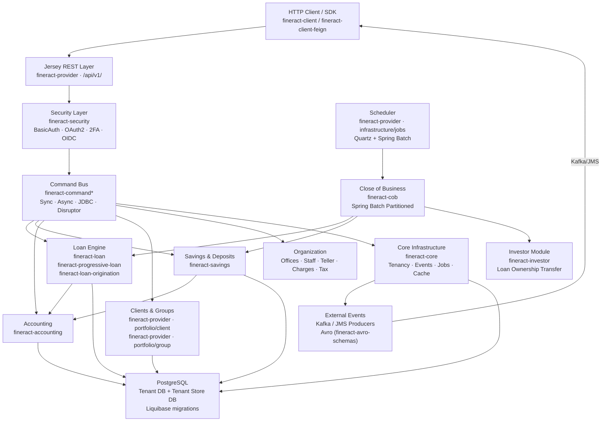

Apache Fineract is an open-source core banking platform built on Spring Boot and deployed as a self-contained JAR (or WAR). It exposes a RESTful Jersey API at `/fineract-provider/api/v1/` that covers the full lifecycle of loans, savings accounts, client/group management, double-entry accounting, and batch processing. The platform is multi-tenant by design, with each tenant mapped to its own PostgreSQL database. The entry point is `fineract-provider/src/main/java/org/apache/fineract/ServerApplication.java`; configuration lives in `fineract-provider/src/main/resources/application.properties`.

## High-Level Architecture

## Repository Map

| Directory | Contents | Wiki Page |
|---|---|---|
| `fineract-provider/` | Main Spring Boot app, all REST API controllers, most domain code | [Provider Module](/core/fineract-provider) |
| `fineract-core/` | Cross-cutting: tenancy, external events, jobs, cache, bulk import, data queries | [Core Infrastructure](/core/fineract-core) |
| `fineract-security/` | Authentication, OAuth2, 2FA/OTP, OIDC converters | [Authentication](/security/authentication) |
| `fineract-command/` | Command dispatch interfaces + hooks | [Command Processing](/core/command-processing) |
| `fineract-command-async/` | Async command execution | [Command Processing](/core/command-processing) |
| `fineract-command-audit/` | Audit trail for commands | [Command Processing](/core/command-processing) |
| `fineract-command-jdbc/` | JDBC-backed command store | [Command Processing](/core/command-processing) |
| `fineract-command-disruptor/` | LMAX Disruptor command processor | [Command Processing](/core/command-processing) |
| `fineract-cob/` | Close-of-Business batch engine (Spring Batch) | [COB Engine](/jobs/cob-close-of-business) |
| `fineract-loan/` | Loan account domain: transactions, delinquency, collateral | [Loan Account](/loans/loan-account) |
| `fineract-progressive-loan/` | Progressive repayment schedule engine | [Progressive Loan](/loans/progressive-loan) |
| `fineract-loan-origination/` | Loan origination workflow | [Loan Origination](/loans/loan-origination) |
| `fineract-working-capital-loan/` | Working capital loan type + COB steps | [Loan Account](/loans/loan-account) |
| `fineract-savings/` | Savings accounts, interest posting, COB steps | [Savings Accounts](/savings/savings-accounts) |
| `fineract-accounting/` | GL accounts, journal entries, accruals, provisioning | [GL Accounts](/accounting/gl-accounts) |
| `fineract-investor/` | Loan ownership transfer / securitization | [Loan Ownership Transfer](/investor/loan-ownership-transfer) |
| `fineract-charge/` | Charge domain model and API | [Charges & Tax](/organization/products-charges-tax) |
| `fineract-tax/` | Tax component domain model | [Charges & Tax](/organization/products-charges-tax) |
| `fineract-rates/` | Rate domain (floating rate bands) | [Charges & Tax](/organization/products-charges-tax) |
| `fineract-branch/` | Branch/teller management | [Offices & Staff](/organization/offices-staff) |
| `fineract-document/` | Document management (attachment storage) | [Data & Reporting](/data/dataqueries-datatables) |
| `fineract-report/` | Report provider SPI | [Reporting Engine](/data/reporting-engine) |
| `fineract-mix/` | MIX Market reporting | [Reporting Engine](/data/reporting-engine) |
| `fineract-avro-schemas/` | 83 Avro schemas for external event payloads | [Avro Event Schemas](/reference/avro-event-schemas) |
| `fineract-client/` | Auto-generated OpenAPI Java client SDK | [Build & Gradle](/reference/build-gradle) |
| `fineract-client-feign/` | Feign-based client | [Build & Gradle](/reference/build-gradle) |
| `fineract-validation/` | Bean validation utilities | [Core Infrastructure](/core/fineract-core) |
| `fineract-e2e-tests-core/` | Cucumber step definitions | [E2E Tests](/reference/e2e-cucumber-tests) |
| `fineract-e2e-tests-runner/` | Cucumber test runner | [E2E Tests](/reference/e2e-cucumber-tests) |
| `integration-tests/` | REST integration test suite | [Integration Tests](/reference/integration-tests) |
| `fineract-progressive-loan-embeddable-schedule-generator/` | Embeddable schedule calculator | [Progressive Loan](/loans/progressive-loan) |
| `custom/` | Plugin mounting point for company-specific modules | [Custom Modules](/reference/custom-modules) |
| `docker/` | Tomcat server.xml + docker-compose files | [Docker & Kubernetes](/reference/docker-kubernetes) |
| `kubernetes/` | Kubernetes deployment manifests | [Docker & Kubernetes](/reference/docker-kubernetes) |
| `integration-tests/` | REST integration tests (JUnit 5 + REST Assured) | [Integration Tests](/reference/integration-tests) |

## Subsystem Map

<CardGroup cols={2}>
  <Card title="Overview & Architecture" icon="building-columns" href="/overview/introduction">
    System purpose, deployment model, and cross-module architecture diagrams.
  </Card>
  <Card title="Core Infrastructure" icon="server" href="/core/fineract-core">
    Tenancy routing, external events, job scheduling, caching, bulk import — the platform foundation in fineract-core.
  </Card>
  <Card title="Security" icon="shield-halved" href="/security/authentication">
    BasicAuth, OAuth2 resource server, 2FA/OTP, and OIDC federation via fineract-security.
  </Card>
  <Card title="Command Processing" icon="arrow-right-arrow-left" href="/core/command-processing">
    CQRS command-dispatch bus with sync, async, JDBC, audit, and Disruptor implementations.
  </Card>
  <Card title="Loan Engine" icon="money-bill-wave" href="/loans/loan-account">
    Loan account lifecycle, schedule engine, transaction processor, delinquency, and origination.
  </Card>
  <Card title="Progressive Loan" icon="chart-line" href="/loans/progressive-loan">
    Advanced repayment schedule generation with configurable interest and principal allocation strategies.
  </Card>
  <Card title="Savings & Deposits" icon="piggy-bank" href="/savings/savings-accounts">
    Savings accounts, fixed deposits, recurring deposits, share accounts, and interest posting.
  </Card>
  <Card title="Accounting" icon="book" href="/accounting/gl-accounts">
    Double-entry GL chart of accounts, journal entries, accruals, and loan-loss provisioning.
  </Card>
  <Card title="Close of Business (COB)" icon="clock" href="/jobs/cob-close-of-business">
    Spring Batch partitioned overnight batch processor for loans and savings.
  </Card>
  <Card title="External Events" icon="bolt" href="/integrations/external-events-kafka-jms">
    Kafka and JMS outbound event producers with Avro serialization for downstream consumers.
  </Card>
  <Card title="Investor Module" icon="chart-pie" href="/investor/loan-ownership-transfer">
    Loan portfolio securitization and ownership transfer tracking.
  </Card>
  <Card title="Data & Reporting" icon="table" href="/data/dataqueries-datatables">
    Dynamic data tables (datatables), ad-hoc queries, reporting engine, and bulk import via Excel.
  </Card>
  <Card title="Configuration" icon="sliders" href="/reference/configuration-properties">
    Full reference of all fineract.* application.properties keys and environment variables.
  </Card>
  <Card title="Data Models & Schemas" icon="database" href="/reference/key-domain-entities">
    Core JPA entities, Avro schemas, and Liquibase migration history.
  </Card>
</CardGroup>

## Where to Start

For a coding agent or new engineer navigating this codebase:

1. **Entry point:** `fineract-provider/src/main/java/org/apache/fineract/ServerApplication.java` — Spring Boot `main()`. The application configuration is assembled in `FineractWebApplicationConfiguration.java` in the same `boot/` package.
2. **REST controllers:** All JAX-RS resource classes end in `ApiResource.java`, found under `*/api/` packages throughout `fineract-provider/src/main/java/org/apache/fineract/`.
3. **Command routing:** Every mutating API call invokes `PortfolioCommandSourceWritePlatformServiceImpl`, which routes through the command bus defined in `fineract-command/src/main/java/org/apache/fineract/command/core/CommandDispatcher.java`.
4. **Database schema:** `fineract-provider/src/main/resources/db/changelog/tenant/` — 236 Liquibase changesets define every table. The tenant store schema lives at `db/changelog/tenant-store/`.
5. **Configuration reference:** `fineract-provider/src/main/resources/application.properties` — every `fineract.*` property with its environment variable override.
6. **Architecture deep-dive:** See the [Architecture page](/overview/architecture) for component interaction diagrams, and [Module Map](/overview/module-map) for the full Gradle submodule dependency graph.
