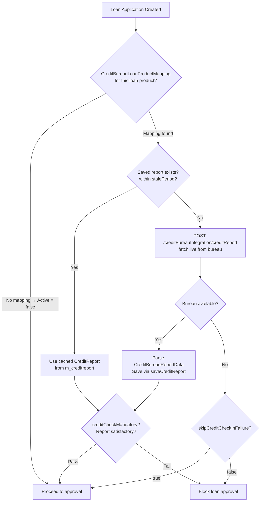

Fineract's credit bureau module provides a pluggable integration layer that allows the platform to fetch, store, and present credit reports from external credit bureaus. The architecture is multi-bureau: a master `CreditBureau` registry defines available bureaus, `OrganisationCreditBureau` activates them at the tenant level, `CreditBureauLoanProductMapping` ties bureau checks to specific loan products, and `CreditBureauConfiguration` holds per-bureau API credentials as key-value pairs. Actual HTTP communication with the bureau is performed by `ExternalCreditBureauIntegrationWritePlatformServiceImpl` using OkHttp3, with bearer token auth managed through `CreditBureauToken`.

## Module Location

`fineract-provider/src/main/java/org/apache/fineract/infrastructure/creditbureau/`

## File Inventory

| File | Responsibility |
|------|---------------|
| `api/CreditBureauConfigurationApiResource.java` | REST at `/v1/CreditBureauConfiguration` |
| `api/CreditBureauIntegrationApiResource.java` | REST at `/v1/creditBureauIntegration` |
| `domain/CreditBureau.java` | `m_creditbureau` entity |
| `domain/CreditBureauConfiguration.java` | `m_creditbureau_configuration` entity |
| `domain/OrganisationCreditBureau.java` | `m_organisation_creditbureau` entity |
| `domain/CreditBureauLoanProductMapping.java` | `m_creditbureau_loanproduct_mapping` entity |
| `domain/CreditBureauToken.java` | `m_creditbureau_token` entity |
| `domain/CreditReport.java` | `m_creditreport` entity |
| `domain/CreditBureauRepository.java` | JPA repository |
| `domain/CreditBureauConfigurationRepository.java` | JPA repository |
| `domain/CreditBureauConfigurationRepositoryWrapper.java` | Throws not-found if absent |
| `domain/OrganisationCreditBureauRepository.java` | JPA repository |
| `domain/CreditBureauLoanProductMappingRepository.java` | JPA repository |
| `domain/TokenRepository.java` | JPA repository |
| `domain/TokenRepositoryWrapper.java` | Throws not-found if absent |
| `domain/CreditReportRepository.java` | JPA repository |
| `service/CreditBureauReadPlatformService.java` | Read interface |
| `service/CreditBureauReadPlatformServiceImpl.java` | Lists all bureaus |
| `service/CreditBureauReadConfigurationService.java` | Reads config by organisation bureau ID |
| `service/CreditBureauReadConfigurationServiceImpl.java` | Implementation |
| `service/OrganisationCreditBureauReadPlatformService.java` | Reads org bureau assignments |
| `service/OrganisationCreditBureauReadPlatformServiceImpl.java` | Implementation |
| `service/OrganisationCreditBureauWritePlatflormService.java` | Interface (note: typo in name) |
| `service/OrganisationCreditBureauWritePlatflormServiceImpl.java` | Implementation |
| `service/CreditBureauLoanProductMappingReadPlatformService.java` | Reads mappings + loan products |
| `service/CreditBureauLoanProductMappingReadPlatformServiceImpl.java` | Implementation |
| `service/CreditBureauLoanProductMappingWritePlatformService.java` | Interface |
| `service/CreditBureauLoanProductMappingWritePlatformServiceImpl.java` | Create/update mappings |
| `service/CreditBureauConfigurationWritePlatformService.java` | Interface |
| `service/CreditBureauConfigurationWritePlatformServiceImpl.java` | Create/update config keys |
| `service/ExternalCreditBureauIntegrationWritePlatformService.java` | Interface for external HTTP integration |
| `service/ExternalCreditBureauIntegrationWritePlatformServiceImpl.java` | OkHttp3-based implementation |
| `service/CreditReportReadPlatformService.java` | Reads saved reports |
| `service/CreditReportWritePlatformService.java` | Interface |
| `service/CreditReportWritePlatformServiceImpl.java` | Save/delete credit reports |
| `data/CreditBureauData.java` | Read DTO for bureau |
| `data/OrganisationCreditBureauData.java` | Read DTO for org bureau |
| `data/CreditBureauConfigurationData.java` | Read DTO for config |
| `data/CreditBureauConfigurations.java` | Enum of config key constants |
| `data/CreditBureauLoanProductMappingData.java` | Read DTO |
| `data/CreditBureauProduct.java` | Loan-product association DTO |
| `data/CreditReportData.java` | External report DTO |
| `data/CreditBureauReportData.java` | Parsed report content |
| `data/CreditBureauMasterData.java` | Master data DTO |
| `data/CreditReportReadPlatformServiceImpl.java` | Also in data package (not service) |
| `serialization/CreditBureauCommandFromApiJsonDeserializer.java` | Validates bureau commands |
| `serialization/CreditBureauConfigurationCommandFromApiJsonDeserializer.java` | Config validation |
| `serialization/CreditBureauLoanProductCommandFromApiJsonDeserializer.java` | Loan product mapping validation |
| `serialization/CreditBureauTokenCommandFromApiJsonDeserializer.java` | Token response parsing |
| `handler/AddCreditBureauConfigurationDataCommandHandler.java` | CQRS: add config |
| `handler/UpdateCreditBureauConfigurationDataCommandHandler.java` | CQRS: update config |
| `handler/AddOrganisationCreditBureauCommandHandler.java` | CQRS: link bureau to org |
| `handler/UpdateCreditBureauCommandHandler.java` | CQRS: update bureau |
| `handler/CreateCreditBureauLoanProductMappingCommandHandler.java` | CQRS: create mapping |
| `handler/UpdateCreditBureauLoanProductMappingCommandHandler.java` | CQRS: update mapping |
| `handler/GetCreditReportCommandHandler.java` | CQRS: fetch report from bureau |
| `handler/SaveCreditReportCommandHandler.java` | CQRS: save report to DB |
| `handler/DeleteCreditReportCommandHandler.java` | CQRS: delete saved report |
| `exception/CreditReportNotFoundException.java` | Thrown when report not found |

---

## Domain Entities

### `CreditBureau` (`m_creditbureau`)

```java
@Entity @Table(name = "m_creditbureau")
public class CreditBureau extends AbstractPersistableCustom<Long> {
    String name;              // Bureau display name
    String product;           // Product type
    String country;           // Country ISO code
    String implementationKey; // Column: "implementation_key"
}
```

| Column | Field | Type | Description |
|--------|-------|------|-------------|
| `id` | (inherited) | `Long` | PK |
| `name` | `name` | `String` | e.g. `"TransUnion"` |
| `product` | `product` | `String` | Bureau product name |
| `country` | `country` | `String` | Country code |
| `implementation_key` | `implementationKey` | `String` | Key used to resolve implementation |

### `OrganisationCreditBureau` (`m_organisation_creditbureau`)

Links a `CreditBureau` to the organisation (tenant) with an alias and active flag:

```java
@Entity @Table(name = "m_organisation_creditbureau")
public class OrganisationCreditBureau extends AbstractPersistableCustom<Long> {
    String alias;
    CreditBureau creditbureau;              // @OneToOne FK
    boolean isActive;
    List<CreditBureauLoanProductMapping> creditBureauLoanProductMapping;  // @OneToMany
}
```

| Column | Field | Notes |
|--------|-------|-------|
| `alias` | `alias` | Friendly name for this org-bureau pair |
| `creditbureau_id` | `creditbureau` | `@OneToOne` FK to `m_creditbureau` |
| `is_active` | `isActive` | Whether this org-bureau is active |

### `CreditBureauConfiguration` (`m_creditbureau_configuration`)

Stores API credentials and endpoint URLs as key-value pairs per organisation bureau:

```java
@Entity @Table(name = "m_creditbureau_configuration")
public class CreditBureauConfiguration extends AbstractPersistableCustom<Long> {
    String configurationKey;      // Column: "configkey"
    String value;                 // Column: "value"
    String description;           // Column: "description"
    OrganisationCreditBureau organisationCreditbureau;  // FK: "organisation_creditbureau_id"
}
```

**Known configuration keys** (defined in `CreditBureauConfigurations` enum):

| Enum Value | Meaning |
|-----------|---------|
| `Username` | API username credential |
| `Password` | API password credential |
| `SubscriberCode` | Bureau subscriber/client code |
| `TokenURL` | Auth token endpoint URL |
| `CreditReportURL` | Credit report fetch URL |
| `AddCreditReportURL` | Credit report upload URL |
| `SearchURL` | Borrower search endpoint URL |

### `CreditBureauLoanProductMapping` (`m_creditbureau_loanproduct_mapping`)

Controls which loan products require credit bureau checks and under what conditions:

```java
@Entity @Table(name = "m_creditbureau_loanproduct_mapping")
public class CreditBureauLoanProductMapping extends AbstractPersistableCustom<Long> {
    boolean creditCheckMandatory;      // Column: "is_credit_check_mandatory"
    boolean skipCreditCheckInFailure;  // Column: "skip_credit_check_in_failure"
    int stalePeriod;                   // Column: "stale_period" (days before re-fetch)
    boolean active;                    // Column: "is_active"
    OrganisationCreditBureau organisation_creditbureau;  // FK (note: naming inconsistency)
    LoanProduct loanProduct;           // @OneToOne FK: "loan_product_id"
}
```

| Field | Description |
|-------|-------------|
| `creditCheckMandatory` | If true, loan application cannot proceed without a passed credit check |
| `skipCreditCheckInFailure` | If true, a bureau connectivity failure does not block loan approval |
| `stalePeriod` | Number of days a previously fetched report is considered fresh |
| `active` | Mapping is active |

### `CreditBureauToken` (`m_creditbureau_token`)

Manages OAuth-style bearer tokens for bureau API authentication:

```java
@Entity @Table(name = "m_creditbureau_token")
public class CreditBureauToken extends AbstractPersistableCustom<Long> {
    String userName;        // Column: "username"
    String accessToken;     // Column: "token"
    String tokenType;       // Column: "token_type"
    String expiresIn;       // Column: "expires_in"
    String issued;          // Column: "issued"
    LocalDate expires;      // Column: "expiry_date"
}
```

Populated via `CreditBureauToken.fromJson(command)` parsing the `access_token`, `token_type`, `expires_in`, `.issued`, and `.expires` fields from the bureau token endpoint response. Date format parsed: `EEE, dd MMM yyyy kk:mm:ss zzz`.

### `CreditReport` (`m_creditreport`)

Cached credit report data stored in the database:

```java
@Entity @Table(name = "m_creditreport")
public class CreditReport extends AbstractPersistableCustom<Long> {
    Long creditBureauId;   // Column: "credit_bureau_id"
    String nationalId;     // Column: "national_id"
    byte[] creditReports;  // Column: "credit_reports" (LAZY loaded)
}
```

Reports are stored as raw bytes (typically JSON from the bureau API). Retrieved via `CreditReportReadPlatformService.retrieveCreditReportDetails(creditBureauId)`.

---

## REST APIs

### `CreditBureauConfigurationApiResource`

Path: `@Path("/v1/CreditBureauConfiguration")`

| Method | Path | Description | Response |
|--------|------|-------------|----------|
| `GET` | `/v1/CreditBureauConfiguration` | List all credit bureaus | `Collection<CreditBureauData>` |
| `GET` | `/v1/CreditBureauConfiguration/mappings` | List all loan product-bureau mappings | `Collection<CreditBureauLoanProductMappingData>` |
| `GET` | `/v1/CreditBureauConfiguration/organisationCreditBureau` | List org-level bureau activations | `Collection<OrganisationCreditBureauData>` |
| `GET` | `/v1/CreditBureauConfiguration/config/{organisationCreditBureauId}` | Config keys for a specific org bureau | `Collection<CreditBureauConfigurationData>` |
| `GET` | `/v1/CreditBureauConfiguration/loanProduct` | All loan products (for mapping UI) | `Collection<CreditBureauLoanProductMappingData>` |
| `GET` | `/v1/CreditBureauConfiguration/loanProduct/{loanProductId}` | Mapping for specific loan product | `CreditBureauLoanProductMappingData` |
| `POST` | `/v1/CreditBureauConfiguration` | Add bureau to organisation | JSON body |
| `POST` | `/v1/CreditBureauConfiguration/mappings` | Create loan product mapping | JSON body |
| `PUT` | `/v1/CreditBureauConfiguration/{organisationCreditBureauId}` | Update org bureau | JSON body |
| `PUT` | `/v1/CreditBureauConfiguration/config/{creditBureauConfigurationId}` | Update config key | JSON body |
| `PUT` | `/v1/CreditBureauConfiguration/mappings/{creditBureauLoanProductMappingId}` | Update mapping | JSON body |

### `CreditBureauIntegrationApiResource`

Path: `@Path("/v1/creditBureauIntegration")`

| Method | Path | Description | Request | Response |
|--------|------|-------------|---------|----------|
| `POST` | `/v1/creditBureauIntegration/creditReport` | Fetch live report from bureau | JSON params map | `CommandProcessingResult` |
| `POST` | `/v1/creditBureauIntegration/addCreditReport` | Upload credit report file | `multipart/form-data` + `?creditBureauId=` | String response |
| `POST` | `/v1/creditBureauIntegration/saveCreditReport` | Save fetched report to DB | JSON body + `?creditBureauId=&nationalId=` | `CommandProcessingResult` |
| `GET` | `/v1/creditBureauIntegration/creditReport/{creditBureauId}` | List saved reports for bureau | — | `Collection<CreditReportData>` |
| `DELETE` | `/v1/creditBureauIntegration/creditReport` | Delete saved report | `?creditBureauId=&nationalId=` | `CommandProcessingResult` |

---

## External Integration Service

### `ExternalCreditBureauIntegrationWritePlatformServiceImpl`

File: `service/ExternalCreditBureauIntegrationWritePlatformServiceImpl.java`

Uses **OkHttp3** (`OkHttpClient`) for all bureau HTTP calls. The integration flow:

<Steps>
  <Step title="Read configuration">
    Loads `CreditBureauConfiguration` rows for the bureau (from `m_creditbureau_configuration`). Configuration keys are defined in `CreditBureauConfigurations` enum: `Username`, `Password`, `SubscriberCode`, `TokenURL`, `CreditReportURL`, etc.
  </Step>
  <Step title="Obtain bearer token">
    Checks `TokenRepository` for a cached, non-expired `CreditBureauToken`. If expired or absent, makes an HTTP `POST` to `TokenURL` with form-encoded `username` + `password`, parses the response via `CreditBureauTokenCommandFromApiJsonDeserializer`, and saves a new `CreditBureauToken` to DB.
  </Step>
  <Step title="Fetch or upload report">
    For report fetch: `POST` to `CreditReportURL` with `SubscriberCode` + national ID. For upload: multipart `POST` to `AddCreditReportURL`.
  </Step>
  <Step title="Parse and return">
    Parses the JSON bureau response using Gson into `CreditBureauReportData`. Returns to `GetCreditReportCommandHandler`, which wraps in `CommandProcessingResult`.
  </Step>
</Steps>

---

## Integration with Loan Origination

The credit bureau check is **not** automatically enforced by Fineract's loan approval workflow in the core codebase. Integration is opt-in and must be triggered by:

1. **Checking `CreditBureauLoanProductMapping`** for the loan's product before approval.
2. If `creditCheckMandatory = true`, calling `POST /v1/creditBureauIntegration/creditReport` to fetch the report.
3. Evaluating `skipCreditCheckInFailure` if the bureau call fails.
4. Using `stalePeriod` to decide whether a previously saved `CreditReport` (in `m_creditreport`) is still valid.



---

## Gotchas & Invariants

<Warning>
**Token expiry parsing uses an unusual date format.** `CreditBureauToken.fromJson` expects `.expires` in format `EEE, dd MMM yyyy kk:mm:ss zzz` (e.g. `Thu, 01 Jun 2023 23:59:59 GMT`). If the bureau returns a different format, `DateTimeParseException` will be thrown and the token will not be saved.
</Warning>

<Warning>
**The service class name `OrganisationCreditBureauWritePlatflormService` contains a typo** (`Platflorm` instead of `Platform`). This is present in both the interface and implementation file names. Do not rename without updating all Spring bean references.
</Warning>

<Note>
**`CreditReport.creditReports` is LAZY loaded.** Accessing this `byte[]` field outside of a JPA transaction context will throw a `LazyInitializationException`. Always access within an active session when processing report bytes.
</Note>

<Tip>
**Multiple bureaus per organisation are supported.** Create multiple `OrganisationCreditBureau` records (one per bureau) and multiple `CreditBureauLoanProductMapping` rows linking different products to different bureaus. Only mappings with `isActive = true` are considered.
</Tip>
