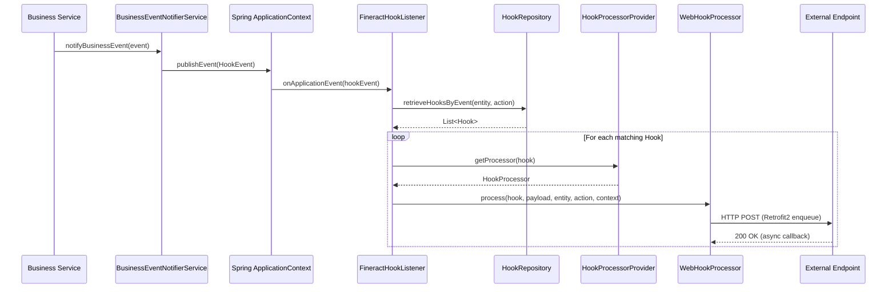

Fineract's Hook subsystem provides a lightweight publish-subscribe mechanism that fires HTTP requests (or SMS messages) whenever a named entity/action pair occurs in the platform. Unlike the Avro-based external events pipeline, Hooks operate synchronously within the request lifecycle and are triggered by the `FineractHookListener` responding to Spring application events. They predate the external events system and are most useful for simpler point-to-point integrations that do not require durability guarantees.

## Module Location

All hook code lives in:  
`fineract-provider/src/main/java/org/apache/fineract/infrastructure/hooks/`

## File Inventory

| File | Responsibility |
|------|---------------|
| `api/HookApiResource.java` | REST resource at `/v1/hooks` |
| `api/HookApiConstants.java` | Template name and field name constants |
| `domain/Hook.java` | `m_hook` JPA entity |
| `domain/HookTemplate.java` | `m_hook_templates` entity |
| `domain/HookConfiguration.java` | `m_hook_configuration` key-value pairs per hook |
| `domain/HookResource.java` | `m_hook_registered_events` entity/action bindings |
| `domain/HookSchema.java` | Template schema field definition |
| `domain/HookRepository.java` | Spring Data JPA repository |
| `domain/HookTemplateRepository.java` | Spring Data JPA repository |
| `domain/HookConfigurationRepository.java` | Spring Data JPA repository |
| `domain/HookEventResultSetExtractor.java` | ResultSet extractor for event bindings |
| `listener/FineractHookListener.java` | `HookListener` — processes `HookEvent` |
| `listener/HookListener.java` | Interface extending `ApplicationListener<HookEvent>` |
| `processor/HookProcessor.java` | Interface: `process(hook, payload, entityName, actionName, context)` |
| `processor/HookProcessorProvider.java` | Selects processor by template name |
| `processor/WebHookProcessor.java` | HTTP webhook delivery via Retrofit2 |
| `processor/WebHookService.java` | Retrofit2 interface with request/response headers |
| `processor/TwilioHookProcessor.java` | SMS via Twilio (template: `SMS Bridge`) |
| `processor/MessageGatewayHookProcessor.java` | SMS via message gateway (template: `Message Gateway`) |
| `processor/ElasticSearchHookProcessor.java` | Elasticsearch indexing (template: `Elastic Search`) |
| `processor/ProcessorHelper.java` | Retrofit2 client builder and callback factory |
| `service/HookReadPlatformService.java` | Interface |
| `service/HookReadPlatformServiceImpl.java` | Reads hooks, templates, events from DB |
| `service/HookWritePlatformService.java` | Interface |
| `service/HookWritePlatformServiceImpl.java` | Create/update/delete |
| `handler/HookCreateCommandHandler.java` | CQRS handler for create |
| `handler/HookUpdateCommandHandler.java` | CQRS handler for update |
| `handler/HookDeleteCommandHandler.java` | CQRS handler for delete |
| `command/HookCreateCommand.java` | Command object |
| `command/HookUpdateCommand.java` | Command object |
| `command/HookDeleteCommand.java` | Command object |
| `data/HookData.java` | Read model / response DTO |
| `data/HookDetailsData.java` | Template details response |
| `data/HookCreateRequest.java` | Create request body |
| `data/HookUpdateRequest.java` | Update request body |
| `mapper/HookEventMapper.java` | Maps DB rows to `HookEventData` |
| `mapper/HookFieldMapper.java` | Maps DB rows to `HookFieldData` |

---

## Key Entities

### `Hook` (`m_hook`)

```java
// Hook.java — table: m_hook
@Entity @Table(name = "m_hook")
public final class Hook extends AbstractAuditableCustom {
    String name;                             // Hook display name
    Boolean isActive;                        // Enabled/disabled toggle
    Set<HookResource> events;               // Bound entity/action pairs
    Set<HookConfiguration> config;          // Key-value config (URL, etc.)
    HookTemplate template;                   // Which template/type to use
    Template ugdTemplate;                    // Optional UGD Mustache template
}
```

| Column | Field | Type | Notes |
|--------|-------|------|-------|
| `id` | (inherited) | `Long` | PK |
| `name` | `name` | `String(100)` | Unique display name |
| `is_active` | `isActive` | `Boolean` | If false, events are silently dropped |
| `template_id` | `template` | `@ManyToOne HookTemplate` | Required; determines processor |
| `ugd_template_id` | `ugdTemplate` | `@ManyToOne Template` | Optional Mustache template for payload shaping |

### `HookTemplate` (`m_hook_templates`)

```java
// HookTemplate.java
@Entity @Table(name = "m_hook_templates")
public final class HookTemplate extends AbstractPersistableCustom<Long> {
    String name;              // e.g. "Web", "SMS Bridge", "Elastic Search", "Message Gateway"
    Set<HookSchema> fields;   // Required configuration fields for this template type
}
```

**Seeded template names** (from `HookApiConstants.java`):

| Constant | Value | Processor |
|----------|-------|-----------|
| `webTemplateName` | `"Web"` | `WebHookProcessor` |
| `smsTemplateName` | `"SMS Bridge"` | `TwilioHookProcessor` |
| `httpSMSTemplateName` | `"Message Gateway"` | `MessageGatewayHookProcessor` |
| `elasticSearchTemplateName` | `"Elastic Search"` | `ElasticSearchHookProcessor` |

### `HookConfiguration` (`m_hook_configuration`)

Per-hook key-value store. The `fieldType` distinguishes configuration from credential fields:

```java
// HookConfiguration.java
@Entity @Table(name = "m_hook_configuration")
public class HookConfiguration {
    Hook hook;
    String fieldType;    // e.g. "config" or "credential"
    String fieldName;    // e.g. "Payload URL", "Content Type", "Api Key"
    String fieldValue;
}
```

**Known field names** (from `HookApiConstants.java`):

| Constant | Value | Used By |
|----------|-------|---------|
| `payloadURLName` | `"Payload URL"` | Web hooks |
| `contentTypeName` | `"Content Type"` | Web hooks (`json` or form) |
| `smsProviderName` | `"SMS Provider"` | SMS Bridge |
| `smsProviderAccountIdName` | `"SMS Provider Account Id"` | SMS Bridge |
| `smsProviderTokenIdName` | `"SMS Provider Token"` | SMS Bridge |
| `phoneNumberName` | `"Phone Number"` | SMS Bridge |
| `apiKeyName` | `"Api Key"` | Message Gateway |
| `SMSProviderIdParamName` | `"SMS Provider Id"` | Message Gateway |

### `HookResource` (`m_hook_registered_events`)

Binds a specific entity/action pair to a hook:

```java
// HookResource.java
@Entity @Table(name = "m_hook_registered_events")
public class HookResource {
    Hook hook;
    String entityName;   // e.g. "CLIENT", "LOAN", "SAVINGS ACCOUNT"
    String actionName;   // e.g. "CREATE", "APPROVE", "DISBURSE"
}
```

---

## REST API — `HookApiResource`

Base path: `@Path("/v1/hooks")`  
File: `fineract-provider/.../hooks/api/HookApiResource.java`

| Method | Path | Description | Request | Response |
|--------|------|-------------|---------|----------|
| `GET` | `/v1/hooks` | List all hooks | — | `Collection<HookData>` |
| `GET` | `/v1/hooks/{hookId}` | Get single hook (`?template=true` includes template details) | — | `HookData` |
| `GET` | `/v1/hooks/template` | Retrieve new hook template (available templates + event groupings) | — | `HookDetailsData` |
| `POST` | `/v1/hooks` | Create a hook | `HookCreateRequest` | `HookCreateResponse` |
| `PUT` | `/v1/hooks/{hookId}` | Update a hook | `HookUpdateRequest` | `HookUpdateResponse` |
| `DELETE` | `/v1/hooks/{hookId}` | Delete a hook | — | `HookDeleteResponse` |

All write operations are dispatched via `CommandDispatcher` to the corresponding CQRS handlers.

---

## Event Listener — `FineractHookListener`

File: `fineract-provider/.../hooks/listener/FineractHookListener.java`

```java
public class FineractHookListener implements HookListener {
    public void onApplicationEvent(HookEvent event) {
        HookEventSource source = (HookEventSource) event.getSource();
        String entityName = source.getEntityName();
        String actionName = source.getActionName();
        List<Hook> hooks = hookReadPlatformService.retrieveHooksByEvent(entityName, actionName);
        for (Hook hook : hooks) {
            HookProcessor processor = hookProcessorProvider.getProcessor(hook);
            processor.process(hook, event.getPayload(), entityName, actionName, context);
        }
    }
}
```

- Listens to `HookEvent` Spring application events.
- Queries `HookReadPlatformService.retrieveHooksByEvent(entityName, actionName)` to find all active hooks matching the event.
- Iterates hooks and delegates to the appropriate processor.
- Exceptions per-hook are caught and logged — a failing hook does **not** abort other hooks.

<Note>
Hooks run **synchronously** within the calling thread. A slow external endpoint will block the Fineract thread for the duration of the HTTP request. Use the external events + Kafka pipeline for latency-sensitive workloads.
</Note>

---

## Processor Implementations

### `WebHookProcessor`

File: `fineract-provider/.../hooks/processor/WebHookProcessor.java`

Active for template name `"Web"`. Reads `Payload URL` and `Content Type` from `HookConfiguration`. Then calls `ProcessorHelper.createWebHookService(url)` to build a Retrofit2 `WebHookService` instance.

```java
// Content-type dispatch
if (contentType.contains("json")) {
    service.sendJsonRequest(entityName, actionName, tenantId, fineractEndpointUrl, jsonBody).enqueue(callback);
} else {
    service.sendFormRequest(entityName, actionName, tenantId, fineractEndpointUrl, formMap).enqueue(callback);
}
```

**HTTP Headers sent on every webhook call** (defined in `WebHookService`):

| Header | Value |
|--------|-------|
| `X-Fineract-Entity` | Entity name (e.g. `CLIENT`) |
| `X-Fineract-Action` | Action name (e.g. `CREATE`) |
| `Fineract-Platform-TenantId` | Tenant identifier |
| `X-Fineract-Endpoint` | Fineract base URL (`System.getProperty("baseUrl")`) |

Delivery is **asynchronous** at the HTTP layer (Retrofit2 `enqueue`) — the Fineract thread does not block on the response.

### `WebHookService` Interface

File: `fineract-provider/.../hooks/processor/WebHookService.java`

```java
public interface WebHookService {
    @GET(".") Call<Void> sendEmptyRequest();  // Ping
    @POST(".") Call<Void> sendJsonRequest(
        @Header("X-Fineract-Entity") String entityHeader,
        @Header("X-Fineract-Action") String actionHeader,
        @Header("Fineract-Platform-TenantId") String tenantHeader,
        @Header("X-Fineract-Endpoint") String endpointHeader,
        @Body JsonObject result);
    @FormUrlEncoded @POST(".")
    Call<Void> sendFormRequest(..., @FieldMap Map<String, String> params);
    @POST(".") Call<Void> sendSmsBridgeRequest(
        @Header("X-Fineract-Entity") String entityHeader,
        @Header("X-Fineract-Action") String actionHeader,
        @Header("Fineract-Platform-TenantId") String tenantHeader,
        @Header("X-Fineract-API-Key") String apiKeyHeader, @Body JsonObject result);
    @POST("/configuration") Call<String> sendSmsBridgeConfigRequest(@Body HookSmsProviderData config);
}
```

### `TwilioHookProcessor`

File: `fineract-provider/.../hooks/processor/TwilioHookProcessor.java`

Active for template `"SMS Bridge"`. Uses `WebHookService.sendSmsBridgeRequest` with an `X-Fineract-API-Key` header set from `HookConfiguration.apiKeyName`. Designed for integration with the Mifos SMS Bridge service.

### `MessageGatewayHookProcessor`

File: `fineract-provider/.../hooks/processor/MessageGatewayHookProcessor.java`

Active for template `"Message Gateway"`. Targets a generic HTTP SMS gateway. Reads provider configuration from `HookConfiguration` including `SMS Provider Id`.

### `ElasticSearchHookProcessor`

File: `fineract-provider/.../hooks/processor/ElasticSearchHookProcessor.java`

Active for template `"Elastic Search"`. Forwards event payload to an Elasticsearch endpoint for indexing.

---

## `HookProcessorProvider`

File: `fineract-provider/.../hooks/processor/HookProcessorProvider.java`

Resolves processor bean by `hook.getTemplate().getName()` using `if/else-if` branches. Note: the `"SMS Bridge"` comparison uses `equalsIgnoreCase`; all others use `equals` (case-sensitive):

```java
if (templateName.equalsIgnoreCase("SMS Bridge"))   → TwilioHookProcessor
else if (templateName.equals("Web"))               → WebHookProcessor
else if (templateName.equals("Elastic Search"))    → ElasticSearchHookProcessor
else if (templateName.equals("Message Gateway"))   → MessageGatewayHookProcessor
else                                               → null  // NPE will occur — must be a known template
```

<Warning>
If `getProcessor(hook)` returns `null` (unknown template name), a `NullPointerException` will be thrown in `FineractHookListener`. Always use one of the four seeded template names.
</Warning>

---

## UGD Template Integration

The `ugd_template_id` on `Hook` is a foreign key to `template` table (the generic Mustache template engine). When set, the hook payload is transformed by the `Template` before being forwarded by the processor. This enables field renaming, value transformation, and composing custom JSON structures without code changes.

The `Template` entity is managed by `fineract-provider/.../template/domain/Template.java`. Templates are authored in Mustache syntax and rendered with data from the Fineract API response payload.

---

## Hook Flow Diagram



---

## Registering a Webhook

<Steps>
  <Step title="Get available templates">
    ```bash
    GET /v1/hooks/template
    ```
    Returns the list of `HookTemplateData` and the grouped entity/action pairs your hook can subscribe to.
  </Step>
  <Step title="Create the hook">
    ```json
    POST /v1/hooks
    {
      "name": "Loan Approval Notifier",
      "templateId": 1,
      "isActive": true,
      "events": [
        { "entityName": "LOAN", "actionName": "APPROVE" }
      ],
      "config": [
        { "fieldType": "config", "fieldName": "Payload URL", "fieldValue": "https://my-service.example.com/hook" },
        { "fieldType": "config", "fieldName": "Content Type", "fieldValue": "json" }
      ]
    }
    ```
  </Step>
  <Step title="Verify delivery">
    Check the hook's endpoint logs. Fineract sends a `POST` to the `Payload URL` with headers `X-Fineract-Entity`, `X-Fineract-Action`, and `Fineract-Platform-TenantId`.
  </Step>
</Steps>

---

## Gotchas & Invariants

<Warning>
**No retry logic.** If the external endpoint returns a non-2xx or is unreachable, the hook delivery silently fails. There is no retry queue or dead-letter mechanism. For reliability, use the Kafka external events pipeline.
</Warning>

<Note>
**`isActive = false` skips silently.** Hooks with `isActive = false` stored in DB are not returned by `retrieveHooksByEvent`, so disabling a hook requires a `PUT /v1/hooks/{id}` with `isActive: false`.
</Note>

<Tip>
**Event binding granularity.** A single `Hook` can be bound to multiple `(entityName, actionName)` pairs via its `Set<HookResource>`. One hook can listen for both `CLIENT/CREATE` and `CLIENT/ACTIVATE` simultaneously.
</Tip>
