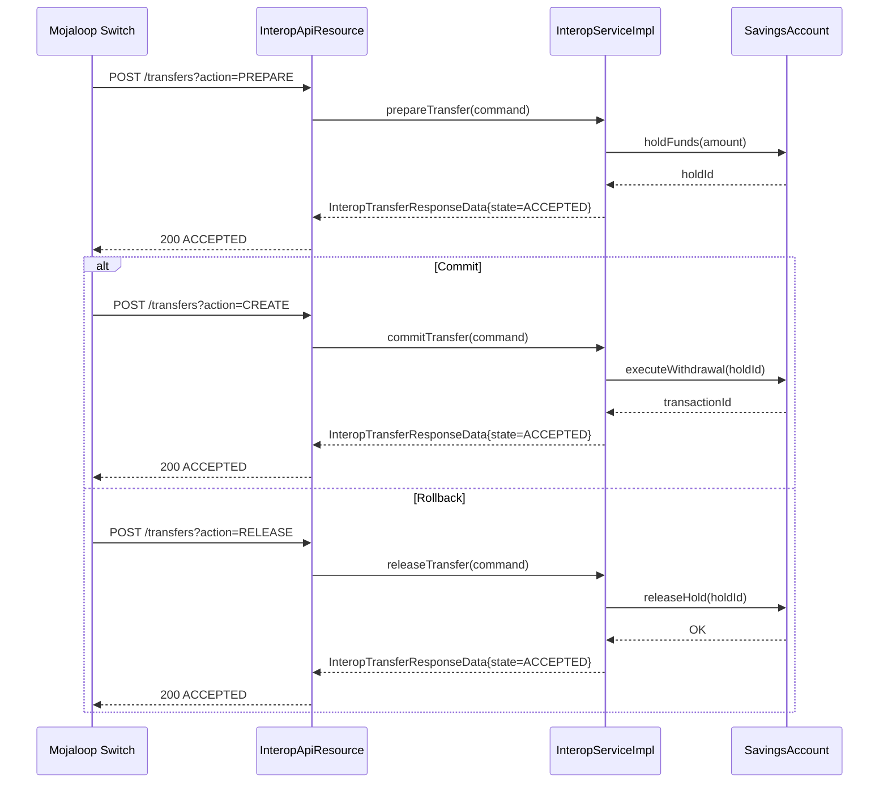

The `interoperation` module implements the Fineract side of a financial interoperability switch — specifically the [Mojaloop](https://mojaloop.io/) FSPIOP-API pattern. It exposes REST endpoints that a central financial switch can call to resolve party identifiers, obtain transfer quotes, and commit or release fund transfers against Fineract savings accounts. The module treats every interoperation operation as a two-phase commit: a `PREPARE` (reserve funds) followed by a `CREATE` (commit) or `RELEASE` (rollback).

## Module Location

- API: `fineract-provider/src/main/java/org/apache/fineract/interoperation/api/`
- Data: `fineract-provider/src/main/java/org/apache/fineract/interoperation/data/`
- Domain entities/enums: split across `fineract-core` and `fineract-savings`
- Service: `fineract-provider/src/main/java/org/apache/fineract/interoperation/service/`
- Handlers: `fineract-provider/src/main/java/org/apache/fineract/interoperation/handler/`
- Serialization: `fineract-provider/src/main/java/org/apache/fineract/interoperation/serialization/`

## File Inventory

| File | Responsibility |
|------|---------------|
| `api/InteropApiResource.java` | All REST endpoints under `/v1/interoperation` |
| `api/InteropWrapperBuilder.java` | Builds `CommandWrapper` objects for each interop operation |
| `service/InteropService.java` | Interface defining all interop operations |
| `service/InteropServiceImpl.java` | Implementation linking to savings accounts |
| `serialization/InteropDataValidator.java` | JSON validation for incoming switch requests |
| `domain/InteropIdentifierRepository.java` | Spring Data JPA for `interop_identifier` |
| `fineract-core/.../interoperation/domain/InteropIdentifierType.java` | Enum for identifier types |
| `fineract-savings/.../interoperation/domain/InteropIdentifier.java` | `interop_identifier` entity |
| `fineract-savings/.../interoperation/domain/InteropActionState.java` | Response state enum |
| `fineract-savings/.../interoperation/domain/InteropTransactionRole.java` | PAYER/PAYEE enum |
| `fineract-savings/.../interoperation/domain/InteropTransferActionType.java` | PREPARE/CREATE/RELEASE |
| `fineract-savings/.../interoperation/domain/InteropAmountType.java` | SEND/RECEIVE |
| `fineract-savings/.../interoperation/domain/InteropInitiatorType.java` | CONSUMER/AGENT/BUSINESS/DEVICE |
| `fineract-savings/.../interoperation/domain/InteropTransactionScenario.java` | DEPOSIT/WITHDRAWAL/TRANSFER/PAYMENT/REFUND enum |
| `data/InteropTransactionRequestData.java` | Request body for transaction requests |
| `data/InteropQuoteRequestData.java` | Request body for quote requests |
| `data/InteropTransferRequestData.java` | Request body for transfer operations |
| `data/InteropResponseData.java` | Common response base |
| `data/InteropTransactionRequestResponseData.java` | Transaction request response |
| `data/InteropQuoteResponseData.java` | Quote response |
| `data/InteropTransferResponseData.java` | Transfer response |
| `data/InteropIdentifierAccountResponseData.java` | Party lookup response |
| `data/InteropIdentifiersResponseData.java` | All identifiers for an account |
| `data/InteropKycData.java` | KYC data structure |
| `data/InteropKycResponseData.java` | KYC response |
| `data/MoneyData.java` | Amount + currency pair |
| `data/GeoCodeData.java` | Geographic coordinates |
| `data/ExtensionData.java` | Key-value extension list |
| `handler/CommitInteropTransferHandler.java` | Handles `CREATE` transfer action |
| `handler/PrepareInteropTransferHandler.java` | Handles `PREPARE` transfer action |
| `handler/ReleaseInteropTransferHandler.java` | Handles `RELEASE` transfer action |
| `handler/CreateInteropQuoteHandler.java` | Handles quote creation |
| `handler/CreateInteropRequestHandler.java` | Handles transaction request creation |
| `handler/CreateInteropIdentifierHandler.java` | Handles identifier registration |
| `handler/DeleteInteropIdentifierHandler.java` | Handles identifier deletion |
| `starter/InteroperationConfiguration.java` | Spring configuration |
| `util/InteropUtil.java` | Parameter name constants |

---

## Domain Enums

### `InteropIdentifierType`

File: `fineract-core/.../interoperation/domain/InteropIdentifierType.java`

| Value | Code | Alias | Description |
|-------|------|-------|-------------|
| `MSISDN` | `interopIdentifierType.msisdn` | `MSISDN` | Mobile phone number |
| `EMAIL` | `interopIdentifierType.email` | `EMAIL` | Email address |
| `PERSONAL_ID` | `interopIdentifierType.personalId` | `PERSONALID` | National ID / passport |
| `BUSINESS` | `interopIdentifierType.business` | `BUSINESS` | Business identifier |
| `DEVICE` | `interopIdentifierType.device` | `DEVICE` | Device token |
| `ACCOUNT_ID` | `interopIdentifierType.accountId` | `ACCOUNTID` | Account number |
| `IBAN` | `interopIdentifierType.iban` | `IBAN` | IBAN |
| `ALIAS` | `interopIdentifierType.alias` | `ALIAS` | Custom alias |
| `BBAN` | `interopIdentifierType.bban` | `BBAN` | Basic bank account number |

The `resolveName(String)` method handles both the enum name and the alias (e.g. `PERSONALID` → `PERSONAL_ID`).

### `InteropActionState`

File: `fineract-savings/.../interoperation/domain/InteropActionState.java`

```java
public enum InteropActionState {
    ACCEPTED,   // Operation succeeded
    REJECTED    // Operation failed or refused
}
```

All response DTOs (`InteropResponseData` subclasses) carry this state.

### `InteropTransactionRole`

File: `fineract-savings/.../interoperation/domain/InteropTransactionRole.java`

```java
public enum InteropTransactionRole {
    PAYER,   // Sending party — maps to SavingsAccountTransactionType.WITHDRAWAL
    PAYEE    // Receiving party — maps to SavingsAccountTransactionType.DEPOSIT
}
```

`isWithdraw()` returns `true` for `PAYER`. `getTransactionType()` resolves to the appropriate `SavingsAccountTransactionType`.

### `InteropTransferActionType`

File: `fineract-savings/.../interoperation/domain/InteropTransferActionType.java`

```java
public enum InteropTransferActionType {
    PREPARE,   // Reserve / hold funds (debit on-hold)
    CREATE,    // Commit the transfer (finalize)
    RELEASE    // Rollback / release the hold
}
```

Passed as `?action=PREPARE|CREATE|RELEASE` query parameter to `POST /v1/interoperation/transfers`.

### `InteropAmountType`

```java
public enum InteropAmountType {
    SEND,    // Payer specifies sending amount
    RECEIVE  // Payee specifies receiving amount
}
```

### `InteropTransactionScenario`

```java
public enum InteropTransactionScenario {
    DEPOSIT, WITHDRAWAL, TRANSFER, PAYMENT, REFUND
}
```

### `InteropInitiatorType`

```java
public enum InteropInitiatorType {
    CONSUMER, AGENT, BUSINESS, DEVICE
}
```

---

## `InteropIdentifier` Entity (`interop_identifier`)

File: `fineract-savings/.../interoperation/domain/InteropIdentifier.java`

Links a secondary identifier to a Fineract `SavingsAccount`:

```java
@Entity
@Table(name = "interop_identifier",
    uniqueConstraints = {
        @UniqueConstraint(name = "uk_hathor_identifier_account", columnNames = {"account_id", "type"}),
        @UniqueConstraint(name = "uk_hathor_identifier_value",  columnNames = {"type", "a_value", "sub_value_or_type"})
    })
public class InteropIdentifier {
    SavingsAccount account;      // FK to m_savings_account
    InteropIdentifierType type;  // @Enumerated(STRING), column: "type"
    String value;                // column: "a_value", max 128 chars
    String subType;              // column: "sub_value_or_type", nullable
    String createdBy;            // column: "created_by"
    LocalDateTime createdOn;     // column: "created_on"
    String modifiedBy;           // column: "modified_by"
    LocalDateTime modifiedOn;    // column: "modified_on"
}
```

**Key constraint**: each savings account can have at most one identifier of each `type`. A given `(type, value, subType)` combination must be globally unique across all accounts.

---

## REST API — `InteropApiResource`

Base path: `@Path("/v1/interoperation")`  
File: `fineract-provider/.../interoperation/api/InteropApiResource.java`

### Health

| Method | Path | Description |
|--------|------|-------------|
| `GET` | `/v1/interoperation/health` | Returns `"OK"` string — liveness probe |

### Account Queries

| Method | Path | Description | Response |
|--------|------|-------------|----------|
| `GET` | `/v1/interoperation/accounts/{accountId}` | Account details by internal accountId | `InteropAccountData` |
| `GET` | `/v1/interoperation/accounts/{accountId}/transactions` | Transactions with optional `?debit=true&credit=false&fromBookingDateTime=&toBookingDateTime=` | `InteropTransactionsData` |
| `GET` | `/v1/interoperation/accounts/{accountId}/identifiers` | All secondary identifiers for an account | `InteropIdentifiersResponseData` |
| `GET` | `/v1/interoperation/accounts/{accountId}/kyc` | KYC data for the account owner | `InteropKycResponseData` |

### Party (Identifier) Operations

| Method | Path | Description | Request | Response |
|--------|------|-------------|---------|----------|
| `GET` | `/v1/interoperation/parties/{idType}/{idValue}` | Lookup account by identifier | — | `InteropIdentifierAccountResponseData` |
| `GET` | `/v1/interoperation/parties/{idType}/{idValue}/{subIdOrType}` | Lookup with sub-identifier | — | `InteropIdentifierAccountResponseData` |
| `POST` | `/v1/interoperation/parties/{idType}/{idValue}` | Register identifier | `InteropIdentifierRequestData` | `InteropIdentifierAccountResponseData` |
| `POST` | `/v1/interoperation/parties/{idType}/{idValue}/{subIdOrType}` | Register with sub-type | `InteropIdentifierRequestData` | `InteropIdentifierAccountResponseData` |
| `DELETE` | `/v1/interoperation/parties/{idType}/{idValue}` | Deregister identifier | — | `InteropIdentifierAccountResponseData` |
| `DELETE` | `/v1/interoperation/parties/{idType}/{idValue}/{subIdOrType}` | Deregister with sub-type | — | `InteropIdentifierAccountResponseData` |

### Transaction Requests

| Method | Path | Description | Request | Response |
|--------|------|-------------|---------|----------|
| `GET` | `/v1/interoperation/transactions/{transactionCode}/requests/{requestCode}` | Query request status | — | `InteropTransactionRequestResponseData` |
| `POST` | `/v1/interoperation/requests` | Create transaction request (payee-initiated) | `InteropTransactionRequestData` | `InteropTransactionRequestResponseData` |

### Quotes

| Method | Path | Description | Request | Response |
|--------|------|-------------|---------|----------|
| `GET` | `/v1/interoperation/transactions/{transactionCode}/quotes/{quoteCode}` | Query quote | — | `InteropQuoteResponseData` |
| `POST` | `/v1/interoperation/quotes` | Calculate quote (fees, FX) | `InteropQuoteRequestData` | `InteropQuoteResponseData` |

### Transfers

| Method | Path | Description | Request | Response |
|--------|------|-------------|---------|----------|
| `GET` | `/v1/interoperation/transactions/{transactionCode}/transfers/{transferCode}` | Query transfer status | — | `InteropTransferResponseData` |
| `POST` | `/v1/interoperation/transfers?action={PREPARE\|CREATE\|RELEASE}` | Execute transfer phase | `InteropTransferRequestData` | `InteropTransferResponseData` |

### Loan Operations (Disbursement / Repayment via Interop)

| Method | Path | Description |
|--------|------|-------------|
| `POST` | `/v1/interoperation/transactions/{accountId}/disburse` | Disburse loan for interop account |
| `POST` | `/v1/interoperation/transactions/{accountId}/loanrepayment` | Make loan repayment for interop account |

---

## `InteropService` Interface

File: `fineract-provider/.../interoperation/service/InteropService.java`

```java
public interface InteropService {
    InteropIdentifiersResponseData   getAccountIdentifiers(String accountId);
    InteropAccountData               getAccountDetails(String accountId);
    InteropTransactionsData          getAccountTransactions(String accountId, boolean debit, boolean credit,
                                         LocalDateTime from, LocalDateTime to);
    InteropIdentifierAccountResponseData getAccountByIdentifier(InteropIdentifierType idType, String idValue, String subIdOrType);
    InteropIdentifierAccountResponseData registerAccountIdentifier(InteropIdentifierType, String, String, JsonCommand);
    InteropIdentifierAccountResponseData deleteAccountIdentifier(InteropIdentifierType, String, String);
    InteropTransactionRequestResponseData getTransactionRequest(String transactionCode, String requestCode);
    InteropTransactionRequestResponseData createTransactionRequest(JsonCommand);
    InteropQuoteResponseData         getQuote(String transactionCode, String quoteCode);
    InteropQuoteResponseData         createQuote(JsonCommand);
    InteropTransferResponseData      getTransfer(String transactionCode, String transferCode);
    InteropTransferResponseData      prepareTransfer(JsonCommand);
    InteropTransferResponseData      commitTransfer(JsonCommand);
    InteropTransferResponseData      releaseTransfer(JsonCommand);
    InteropKycResponseData           getKyc(String accountId);
    String                           disburseLoan(String accountId, String apiRequestBodyAsJson);
    String                           loanRepayment(String accountId, String apiRequestBodyAsJson);
}
```

---

## Key Data Shapes

### `InteropTransactionRequestData`

Fields (from `InteropRequestData` parent + overrides):

| Field | Type | Required | Description |
|-------|------|----------|-------------|
| `transactionCode` | `String` | Yes | Unique transaction identifier |
| `requestCode` | `String` | Yes | Unique request identifier |
| `accountId` | `String` | Yes | Fineract savings account external ID |
| `amount` | `MoneyData` | Yes | Amount and currency code |
| `transactionRole` | `InteropTransactionRole` | Optional (defaults to PAYER) | Must be `PAYER` for transaction requests |
| `transactionType` | `InteropTransactionTypeData` | Yes | Scenario + initiator + sub-scenario |
| `note` | `String` | No | Free-text note |
| `geoCode` | `GeoCodeData` | No | `{latitude, longitude}` |
| `expiration` | `LocalDateTime` | No | Request expiry |
| `extensionList` | `List<ExtensionData>` | No | `[{key, value}]` pairs |

### `InteropTransferRequestData`

Extends `InteropRequestData`, adds:

| Field | Type | Description |
|-------|------|-------------|
| `transferCode` | `String` | Unique transfer identifier |
| `fspFee` | `MoneyData` | FSP fee charged |
| `fspCommission` | `MoneyData` | FSP commission |

### `InteropQuoteRequestData`

Adds to base request:

| Field | Type | Description |
|-------|------|-------------|
| `quoteCode` | `String` | Unique quote identifier |
| `transactionRole` | `InteropTransactionRole` | PAYER or PAYEE |
| `amountType` | `InteropAmountType` | SEND or RECEIVE |
| `fees` | `MoneyData` | Quoted fees |
| `commission` | `MoneyData` | Quoted commission |

### `MoneyData`

```java
public class MoneyData {
    BigDecimal amount;
    String currency;  // ISO 4217 currency code
}
```

---

## Savings Account Integration

The interoperability module operates exclusively on **savings accounts** (`m_savings_account`). The `accountId` path parameter in interop endpoints is the savings account's `externalId` field. `InteropServiceImpl` resolves this to a `SavingsAccount` via the savings account repository.

Transfer operations map to savings transactions:

| Interop Action | Savings Operation |
|---------------|-------------------|
| `PREPARE` (PAYER role) | Places a **hold** on the savings account balance (debit on-hold) |
| `CREATE` (PAYER role) | Commits the withdrawal (`SavingsAccountTransactionType.WITHDRAWAL`) |
| `RELEASE` (PAYER role) | Removes the hold without debiting |
| `CREATE` (PAYEE role) | Credits the savings account (`SavingsAccountTransactionType.DEPOSIT`) |

---

## Transfer Two-Phase Commit Flow



---

## Exceptions

| Exception Class | Trigger |
|----------------|---------|
| `InteropAccountNotFoundException` | No savings account for given `accountId` |
| `InteropAccountTransactionNotAllowedException` | Account status prevents transaction |
| `InteropKycDataNotFoundException` | No KYC data for account owner |
| `InteropTransferAlreadyCommittedException` | Duplicate `CREATE` for same transferCode |
| `InteropTransferAlreadyOnHoldException` | Duplicate `PREPARE` for same transferCode |
| `InteropTransferMissingException` | `CREATE` or `RELEASE` without prior `PREPARE` |

---

## Gotchas & Invariants

<Warning>
**Identifier uniqueness is enforced by DB constraint.** The `uk_hathor_identifier_value` constraint on `interop_identifier` means that registering the same `(type, value, subType)` combination for two different accounts will cause a `DataIntegrityViolationException`. The error is not surfaced as a clean 409 — handle at the caller.
</Warning>

<Note>
**`accountId` is the savings account's `externalId`**, not the primary key (`id`). Ensure `SavingsAccount.externalId` is populated before registering interop identifiers.
</Note>

<Tip>
**The `InteropDataValidator`** in `serialization/InteropDataValidator.java` validates all incoming JSON before the command handler runs. Malformed requests are rejected with `PlatformApiDataValidationException` before touching the DB.
</Tip>

<Info>
**Loan operations** (`/disburse` and `/loanrepayment`) call `InteropService.disburseLoan` and `InteropService.loanRepayment` respectively, which internally delegate to the standard loan disbursement and repayment APIs using the interop account's external ID as a lookup key.
</Info>
