Fineract provides four distinct but interconnected messaging subsystems: (1) **In-app notifications** (`notification_generator` + `notification_mapper`) driven by business events; (2) **SMS messages** (`sms_messages_outbound`) dispatched through an external gateway; (3) **SMS campaigns** (`sms_campaign`) for bulk or event-triggered outbound SMS; (4) **Email campaigns** (`scheduled_email_messages_outbound`) for scheduled bulk emails; and (5) **GCM/FCM push notifications** for mobile clients. All systems use Mustache template substitution to personalize message content.

---

## 1. In-App Notification Subsystem

### Module Location
`fineract-provider/src/main/java/org/apache/fineract/notification/`

### File Inventory

| File | Responsibility |
|------|---------------|
| `domain/Notification.java` | `notification_generator` entity |
| `domain/NotificationMapper.java` | `notification_mapper` entity (user-notification binding) |
| `domain/NotificationRepository.java` | JPA repository |
| `domain/NotificationMapperRepository.java` | JPA repository |
| `api/NotificationApiResource.java` | REST at `/v1/notifications` |
| `api/NotificationApiResourceSwagger.java` | Swagger response schemas |
| `service/NotificationDomainServiceImpl.java` | Registers business event listeners |
| `service/NotificationGeneratorWritePlatformServiceImpl.java` | Persists `Notification` |
| `service/NotificationMapperWritePlatformServiceImpl.java` | Persists `NotificationMapper` |
| `service/NotificationReadPlatformServiceImpl.java` | Queries notifications for user |
| `service/UserNotificationServiceImpl.java` | Sends GCM push after persisting |
| `eventandlistener/NotificationEvent.java` | Spring event payload |
| `eventandlistener/SpringNotificationEventPublisher.java` | Spring event publisher |
| `eventandlistener/SpringNotificationEventListener.java` | Spring event listener |
| `eventandlistener/ActiveMQNotificationEventPublisher.java` | ActiveMQ publisher (alternative) |
| `eventandlistener/ActiveMQNotificationEventListener.java` | ActiveMQ listener (alternative) |
| `config/MessagingConfiguration.java` | Selects Spring vs ActiveMQ transport |
| `starter/NotificationConfiguration.java` | Bean configuration |
| `cache/CacheNotificationResponseHeader.java` | Cache header helper |

### `Notification` Entity (`notification_generator`)

```java
@Entity @Table(name = "notification_generator")
public class Notification extends AbstractPersistableCustom<Long> {
    String objectType;          // e.g. "client", "loan", "savingsAccount"
    Long objectIdentifier;      // ID of the referenced object
    String action;              // e.g. "created", "approved", "depositMade"
    Long actorId;               // AppUser who triggered the event
    boolean isSystemGenerated;  // True for automated notifications
    String notificationContent; // Human-readable message
    LocalDateTime createdAt;    // Timestamp
}
```

| Column | Field | Type | Description |
|--------|-------|------|-------------|
| `object_type` | `objectType` | `String` | Domain entity type |
| `object_identifier` | `objectIdentifier` | `Long` | Entity primary key |
| `action` | `action` | `String` | Action label |
| `actor` | `actorId` | `Long` | FK to `m_appuser` |
| `is_system_generated` | `isSystemGenerated` | `boolean` | System vs user-generated |
| `notification_content` | `notificationContent` | `String` | Display text |
| `created_at` | `createdAt` | `LocalDateTime` | Creation time |

### `NotificationMapper` Entity (`notification_mapper`)

Maps a notification to a specific user, tracking read status:

```java
@Entity @Table(name = "notification_mapper")
public class NotificationMapper extends AbstractPersistableCustom<Long> {
    Notification notification;  // @ManyToOne FK: "notification_id"
    AppUser userId;             // @ManyToOne FK: "user_id"
    boolean isRead;             // Column: "is_read"
    LocalDateTime createdAt;    // Column: "created_at"
}
```

A single `Notification` row can have multiple `NotificationMapper` rows — one per user who should see the notification (e.g. all users in an office).

### Notification API — `NotificationApiResource`

Path: `@Path("/v1/notifications")`

| Method | Path | Query Params | Description |
|--------|------|-------------|-------------|
| `GET` | `/v1/notifications` | `isRead`, `orderBy`, `limit`, `offset`, `sortOrder` | Paginated list for authenticated user; `isRead=false` returns unread only |
| `PUT` | `/v1/notifications` | — | Mark all notifications as read for the current user |

### `NotificationDomainServiceImpl` — Event Listeners

File: `service/NotificationDomainServiceImpl.java`

Registered via `@PostConstruct addListeners()`. Subscribes to the following business events:

| Business Event | `objectType` | `action` | Content |
|---------------|-------------|---------|---------|
| `ClientCreateBusinessEvent` | `"client"` | `"created"` | `"New client created"` |
| `SavingsApproveBusinessEvent` | `"savingsAccount"` | `"approved"` | `"Savings account approved"` |
| `CentersCreateBusinessEvent` | `"center"` | `"created"` | `"New center created"` |
| `GroupsCreateBusinessEvent` | `"group"` | `"created"` | `"New group created"` |
| `SavingsDepositBusinessEvent` | `"savingsAccount"` | `"depositMade"` | `"Deposit made"` |
| `ShareProductDividentsCreateBusinessEvent` | `"shareProduct"` | `"dividendPosted"` | `"Dividend posted to account"` |
| `FixedDepositAccountCreateBusinessEvent` | fixed deposit | created | FD created |
| `RecurringDepositAccountCreateBusinessEvent` | recurring deposit | created | RD created |
| `SavingsPostInterestBusinessEvent` | savings | interest posted | Interest posted |
| `LoanCreatedBusinessEvent` | `"loan"` | `"created"` | `"New loan created"` |
| `LoanApprovedBusinessEvent` | `"loan"` | `"approved"` | `"Loan approved"` |
| `LoanCloseBusinessEvent` | `"loan"` | `"closed"` | `"Loan closed"` |
| `LoanChargebackTransactionBusinessEvent` | `"loan"` | chargeback | Chargeback |
| `LoanCloseAsRescheduleBusinessEvent` | `"loan"` | rescheduled | Rescheduled |
| `LoanTransactionMakeRepaymentPostBusinessEvent` | `"loan"` | `"repayment"` | `"Repayment made"` |
| `LoanProductCreateBusinessEvent` | `"loanProduct"` | `"created"` | Product created |
| `SavingsCreateBusinessEvent` | savings | created | Account created |
| `SavingsCloseBusinessEvent` | savings | closed | Account closed |
| `ShareAccountCreateBusinessEvent` | share | created | Share account created |
| `ShareAccountApproveBusinessEvent` | share | approved | Share account approved |

---

## 2. SMS Module

### Module Location
`fineract-provider/src/main/java/org/apache/fineract/infrastructure/sms/`

### File Inventory

| File | Responsibility |
|------|---------------|
| `api/SmsApiResource.java` | REST at `/v1/sms` |
| `domain/SmsMessage.java` | `sms_messages_outbound` entity |
| `domain/SmsMessageStatusType.java` | Status enum |
| `domain/SmsMessageRepository.java` | JPA repository |
| `domain/SmsMessageAssembler.java` | Assembles `SmsMessage` from `JsonCommand` |
| `domain/SmsMessageEnumerations.java` | Enum option utilities |
| `service/SmsReadPlatformServiceImpl.java` | Read queries |
| `service/SmsWritePlatformServiceJpaRepositoryImpl.java` | Create/update/delete |
| `scheduler/SmsMessageScheduledJobService.java` | Interface |
| `scheduler/SmsMessageScheduledJobServiceImpl.java` | Sends pending SMS to gateway; handles GCM push |
| `SmsApiConstants.java` | Parameter name constants |
| `data/SmsData.java` | Read DTO |
| `data/SmsMessageApiQueueResourceData.java` | Data queued for SMS gateway |
| `data/SmsMessageDeliveryReportData.java` | Delivery report DTO |

### `SmsMessage` Entity (`sms_messages_outbound`)

```java
@Entity @Table(name = "sms_messages_outbound")
public class SmsMessage extends AbstractPersistableCustom<Long> {
    String externalId;            // Column: "external_id"
    Group group;                  // @ManyToOne: "group_id"
    Client client;                // @ManyToOne: "client_id"
    Staff staff;                  // @ManyToOne: "staff_id"
    SmsCampaign smsCampaign;     // @ManyToOne: "campaign_id"
    Integer statusType;           // Column: "status_enum"
    String mobileNo;             // Column: "mobile_no" (50 chars)
    String message;              // Column: "message"
    LocalDate submittedOnDate;   // Column: "submittedon_date"
    LocalDateTime deliveredOnDate; // Column: "delivered_on_date"
    boolean isNotification;      // Column: "is_notification"
}
```

### `SmsMessageStatusType` Enum

| Value | Code | Integer Code |
|-------|------|-------------|
| `INVALID` | `smsMessageStatusType.invalid` | `0` |
| `PENDING` | `smsMessageStatusType.pending` | `100` |
| `WAITING_FOR_DELIVERY_REPORT` | `smsMessageStatusType.waitingForDeliveryReport` | `150` |
| `SENT` | `smsMessageStatusType.sent` | `200` |
| `DELIVERED` | `smsMessageStatusType.delivered` | `300` |
| `FAILED` | `smsMessageStatusType.failed` | `400` |

### SMS REST API — `SmsApiResource`

Path: `@Path("/v1/sms")`

| Method | Path | Description |
|--------|------|-------------|
| `GET` | `/v1/sms` | List all SMS messages |
| `GET` | `/v1/sms/{resourceId}` | Get single message |
| `POST` | `/v1/sms` | Create SMS message |
| `PUT` | `/v1/sms/{resourceId}` | Update message |
| `DELETE` | `/v1/sms/{resourceId}` | Delete message |

### `SmsMessageScheduledJobServiceImpl`

File: `scheduler/SmsMessageScheduledJobServiceImpl.java`

Two primary operations:

**`sendTriggeredMessages(Map<SmsCampaign, Collection<SmsMessage>> smsDataMap)`**
- Splits messages into two buckets: `isNotification = true` → GCM push via `NotificationSenderService`; `isNotification = false` → HTTP POST to the SMS gateway.
- Sets status to `WAITING_FOR_DELIVERY_REPORT` before sending.
- Uses `SmsConfigUtils.getMessageGateWayRequestURI("sms", jsonPayload)` to get gateway URI + request entity.
- If gateway returns non-`202`, throws `ConnectionFailureException`.

**`getDeliveryReports()`** — Polls the SMS gateway for delivery status updates, updating `SmsMessage.statusType` and `deliveredOnDate`.

---

## 3. SMS Campaign Module

### Module Location
`fineract-provider/src/main/java/org/apache/fineract/infrastructure/campaigns/sms/`

### `SmsCampaign` Entity (`sms_campaign`)

```java
@Entity @Table(name = "sms_campaign",
    uniqueConstraints = @UniqueConstraint(columnNames = {"campaign_name"}))
public class SmsCampaign extends AbstractPersistableCustom<Long> {
    String campaignName;           // Column: "campaign_name" (unique)
    Integer campaignType;          // Column: "campaign_type" (CampaignType enum int)
    Integer triggerType;           // Column: "campaign_trigger_type" (SmsCampaignTriggerType)
    Long providerId;               // Column: "provider_id" (nullable for notifications)
    Report businessRuleId;         // @ManyToOne: "report_id" — the stretchy report defining recipients
    String paramValue;             // Column: "param_value" (JSON params for report)
    Integer status;                // Column: "status_enum" (SmsCampaignStatus)
    String message;                // Column: "message" (Mustache template)
    LocalDate closureDate;         // Column: "closedon_date"
    LocalDate submittedOnDate;     // Column: "submittedon_date"
    LocalDate approvedOnDate;      // Column: "approvedon_date"
    String recurrence;             // Column: "recurrence" (iCalendar RRULE)
    LocalDateTime nextTriggerDate; // Column: "next_trigger_date"
    LocalDateTime lastTriggerDate; // Column: "last_trigger_date"
    LocalDateTime recurrenceStartDate; // Column: "recurrence_start_date"
    boolean isVisible;             // Column: "is_visible"
    boolean isNotification;        // Column: "is_notification" (true → deliver via GCM push, not SMS gateway)
}
```

### `SmsCampaignTriggerType` Enum

| Value | Integer | Code | Description |
|-------|---------|------|-------------|
| `INVALID` | `-1` | `triggerType.invalid` | Invalid/error state |
| `DIRECT` | `1` | `triggerType.direct` | Send immediately on activation |
| `SCHEDULE` | `2` | `triggerType.schedule` | Send on recurring schedule (RRULE) |
| `TRIGGERED` | `3` | `triggerType.triggered` | Send when a business event occurs |

### `SmsCampaignStatus` Enum

| Value | Integer | Code | Description |
|-------|---------|------|-------------|
| `INVALID` | `-1` | `smsCampaignStatus.invalid` | Error state |
| `PENDING` | `100` | `smsCampaignStatus.pending` | Created, not yet activated |
| `ACTIVE` | `300` | `smsCampaignStatus.active` | Running |
| `CLOSED` | `600` | `smsCampaignStatus.closed` | Deactivated |

### SMS Campaign REST API — `SmsCampaignApiResource`

Path: `@Path("/v1/smscampaigns")`

| Method | Path | Description | Request |
|--------|------|-------------|---------|
| `GET` | `/v1/smscampaigns/template` | Retrieve campaign template | — |
| `POST` | `/v1/smscampaigns` | Create campaign | `SmsCampaignCreationDto` |
| `GET` | `/v1/smscampaigns/{campaignId}` | Get campaign | — |
| `GET` | `/v1/smscampaigns` | List campaigns (paginated) | `?limit=&offset=` |
| `PUT` | `/v1/smscampaigns/{campaignId}` | Update campaign | `SmsCampaignUpdateDto` |
| `DELETE` | `/v1/smscampaigns/{campaignId}` | Delete (must be CLOSED) | — |
| `POST` | `/v1/smscampaigns/{campaignId}?command=activate` | Activate campaign | `SmsCampaignHandlerDto` |
| `POST` | `/v1/smscampaigns/{campaignId}?command=close` | Close campaign | `SmsCampaignHandlerDto` |
| `POST` | `/v1/smscampaigns/{campaignId}?command=reactivate` | Reactivate | `SmsCampaignHandlerDto` |
| `POST` | `/v1/smscampaigns/preview` | Preview message for sample data | `SmsCampaignPreviewDto` |

### Campaign Scheduled Jobs

| Job Tasklet | File | Action |
|-------------|------|--------|
| `UpdateSmsOutboundWithCampaignMessageTasklet` | `jobs/updatesmsoutboundwithcampaignmessage/` | Evaluates SCHEDULE campaigns, runs stretchy reports, renders Mustache templates, creates `SmsMessage` rows |
| `SendMessageToSmsGatewayTasklet` | `jobs/sendmessagetosmsgateway/` | Picks up `PENDING` `SmsMessage` rows and sends them via `SmsMessageScheduledJobService` |
| `GetDeliveryReportsFromSmsGatewayTasklet` | `jobs/getdeliveryreportsfromsmsgateway/` | Polls gateway for delivery status updates |

---

## 4. Email Campaign Module

### Module Location
`fineract-provider/src/main/java/org/apache/fineract/infrastructure/campaigns/email/`

### `EmailMessage` Entity (`scheduled_email_messages_outbound`)

```java
@Entity @Table(name = "scheduled_email_messages_outbound")
public class EmailMessage extends AbstractPersistableCustom<Long> {
    Group group;           // @ManyToOne: "group_id"
    Client client;         // @ManyToOne: "client_id"
    Staff staff;           // @ManyToOne: "staff_id"
    EmailCampaign emailCampaign; // @ManyToOne: "email_campaign_id"
    Integer statusType;    // Column: "status_enum" (EmailMessageStatusType)
    String emailAddress;   // Column: "email_address" (50 chars)
    String emailSubject;   // Column: "email_subject" (50 chars)
    String message;        // Column: "message" — rendered email body
    String campaignName;   // Column: "campaign_name"
    LocalDate submittedOnDate; // Column: "submittedon_date"
}
```

### `EmailCampaign` Entity (`scheduled_email_campaign`)

Key fields mirroring `SmsCampaign` but for email:

| Field | Column | Type | Description |
|-------|--------|------|-------------|
| `campaignName` | `campaign_name` | `String` | Unique campaign name |
| `campaignType` | `campaign_type` | `Integer` | `EmailCampaignType` |
| `triggerType` | `campaign_trigger_type` | `Integer` | Schedule or triggered |
| `businessRuleId` | `report_id` | `Report` FK | Stretchy report for recipients |
| `emailSubject` | `email_subject` | `String` | Subject template |
| `emailMessage` | `email_message` | `String` | Mustache body template |
| `emailAttachmentFileFormat` | `file_format` | `String` | PDF/XLS/CSV attachment format |
| `stretchyReportId` | `stretchy_report_id` | `Report` FK | Report to attach |
| `recurrence` | `recurrence` | `String` | iCalendar RRULE |
| `status` | `status_enum` | `Integer` | `EmailCampaignStatus` |

### `EmailCampaignStatus` Enum

| Value | Code | Description |
|-------|------|-------------|
| `PENDING` | `pending` | Created, not activated |
| `ACTIVE` | `active` | Sending |
| `CLOSED` | `closed` | Deactivated |

### Email REST APIs

**`EmailApiResource`** — Path: `/v1/email`

| Method | Path | Description |
|--------|------|-------------|
| `GET` | `/v1/email` | List email messages |
| `GET` | `/v1/email/{resourceId}` | Get single email message |
| `POST` | `/v1/email` | Create email message |
| `PUT` | `/v1/email/{resourceId}` | Update email message |
| `DELETE` | `/v1/email/{resourceId}` | Delete email message |

**`EmailCampaignApiResource`** — Path: `/v1/emailcampaigns`

| Method | Path | Description |
|--------|------|-------------|
| `GET` | `/v1/emailcampaigns` | List campaigns |
| `POST` | `/v1/emailcampaigns` | Create campaign |
| `GET` | `/v1/emailcampaigns/{campaignId}` | Get campaign |
| `PUT` | `/v1/emailcampaigns/{campaignId}` | Update campaign |
| `DELETE` | `/v1/emailcampaigns/{campaignId}` | Delete (must be CLOSED) |
| `POST` | `/v1/emailcampaigns/{campaignId}?command=activate` | Activate |
| `POST` | `/v1/emailcampaigns/{campaignId}?command=close` | Close |
| `POST` | `/v1/emailcampaigns/{campaignId}?command=reactivate` | Reactivate |
| `POST` | `/v1/emailcampaigns/preview` | Preview rendered message |

**`EmailConfigurationApiResource`** — Path: `/v1/emailconfiguration`

| Method | Path | Description |
|--------|------|-------------|
| `GET` | `/v1/emailconfiguration` | Get SMTP configuration |
| `PUT` | `/v1/emailconfiguration` | Update SMTP settings |

### Email Scheduled Jobs

| Tasklet | Purpose |
|---------|---------|
| `UpdateEmailOutboundWithCampaignMessageTasklet` | Evaluates scheduled email campaigns, generates `EmailMessage` rows |
| `ExecuteEmailTasklet` | Sends pending `EmailMessage` rows via `EmailMessageJobEmailService` (SMTP) |
| `ExecuteReportMailingJobsTasklet` | Sends report-attached email campaigns with file attachments |

---

## 5. GCM / FCM Push Notification Module

### Module Location
`fineract-provider/src/main/java/org/apache/fineract/infrastructure/gcm/`

### File Inventory

| File | Responsibility |
|------|---------------|
| `GcmConstants.java` | All JSON field name constants for GCM API |
| `domain/Message.java` | GCM message builder |
| `domain/Notification.java` | GCM notification payload (title, body, icon, sound, badge, etc.) |
| `domain/Sender.java` | HTTP client that posts to GCM/FCM endpoint |
| `domain/MulticastResult.java` | Batch send result |
| `domain/Result.java` | Per-device result |
| `domain/NotificationConfigurationData.java` | Server key and endpoint configuration |
| `service/NotificationSenderService.java` | Entry point for sending GCM push |
| `exception/InvalidRequestException.java` | Thrown on HTTP 4xx from GCM |

### `NotificationConfigurationData`

```java
@Data
public class NotificationConfigurationData {
    Long id;
    String serverKey;    // FCM/GCM server key
    String gcmEndPoint;  // Legacy GCM endpoint
    String fcmEndPoint;  // FCM endpoint
}
```

### `Notification` (GCM Payload)

Fields sent in the `notification` block of a GCM message:

| Field | Type | GCM JSON Key |
|-------|------|-------------|
| `title` | `String` | `title` |
| `body` | `String` | `body` |
| `icon` | `String` | `icon` |
| `sound` | `String` | `sound` (default: `"default"`) |
| `badge` | `Integer` | `badge` |
| `tag` | `String` | `tag` |
| `color` | `String` | `color` (`#rrggbb`) |
| `clickAction` | `String` | `click_action` |
| `bodyLocKey` | `String` | `body_loc_key` |
| `bodyLocArgs` | `List<String>` | `body_loc_args` |
| `titleLocKey` | `String` | `title_loc_key` |
| `titleLocArgs` | `List<String>` | `title_loc_args` |

### Key `GcmConstants`

| Constant | Value | Purpose |
|----------|-------|---------|
| `title` | `"Hello !"` | Default notification title |
| `defaultIcon` | `"default"` | Default icon name |
| `PARAM_TO` | `"to"` | Recipient device token |
| `TOPIC_PREFIX` | `"/topics/"` | Topic subscription prefix |
| `TIME_TO_LIVE` | `30` | Default TTL in seconds |

---

## 6. Mustache Template Processing

Both SMS and email campaign messages are **Mustache templates**. The placeholders are populated from the stretchy report result rows associated with each campaign.

**How it works:**

1. `SmsCampaign.businessRuleId` (or `EmailCampaign.businessRuleId`) points to a `Report` (stretchy report/SQL query).
2. The job tasklet runs the report with `SmsCampaign.paramValue` as parameters, producing a result set of recipient rows.
3. Each row is passed to the Mustache engine as a `Map<String, Object>`.
4. `SmsCampaign.message` / `EmailCampaign.emailMessage` is the template string containing `{{fieldName}}` placeholders.
5. Rendered messages are saved as `SmsMessage` / `EmailMessage` rows for dispatch.

**Example template:**
```
Dear {{FirstName}} {{LastName}}, your loan account {{LoanAccountNo}} 
has a repayment due on {{RepaymentDate}} for amount {{RepaymentAmount}}.
```

The `SmsCampaignDomainServiceImpl.compileMustache()` / `EmailCampaignWritePlatformCommandHandlerImpl.fillTemplate()` perform the rendering.

**Preview endpoint:** `POST /v1/smscampaigns/preview` and `POST /v1/emailcampaigns/preview` render the template against a sample record for validation before activation.

---

## Architecture Overview

```mermaid
flowchart TD
    subgraph InApp["In-App Notifications"]
        BE[Business Events] --> NDSI[NotificationDomainServiceImpl]
        NDSI --> NG[notification_generator]
        NG --> NM[notification_mapper\nper user]
        NM --> GCM[GCM Push\nNotificationSenderService]
        NM --> API[GET /v1/notifications]
    end

    subgraph SMS["SMS Pipeline"]
        CAMP[SmsCampaign\n sms_campaign] --> REPT[Stretchy Report\nSQL Recipients]
        REPT --> MSTCH[Mustache Render\nfillTemplate]
        MSTCH --> SMSMSG[sms_messages_outbound\nstatus=PENDING]
        SMSMSG --> JOB1[SendMessageToSmsGateway\nTasklet]
        JOB1 --> GW[External SMS Gateway\nHTTP POST]
        GW --> JOB2[GetDeliveryReports\nTasklet]
        JOB2 --> SMSMSG
    end

    subgraph Email["Email Pipeline"]
        ECAMPAIGN[EmailCampaign] --> EREPT[Stretchy Report]
        EREPT --> EMSTCH[Mustache Render]
        EMSTCH --> EMSGROW[scheduled_email_messages_outbound]
        EMSGROW --> EJOB[ExecuteEmailTasklet]
        EJOB --> SMTP[SMTP Server]
    end
```



---

## Gotchas & Invariants

<Warning>
**SMS and Email campaign deletion requires CLOSED status.** Attempting `DELETE /v1/smscampaigns/{id}` on an ACTIVE campaign throws `SmsCampaignMustBeClosedToBeDeletedException`. Similarly for email: `EmailCampaignMustBeClosedToBeDeletedException`. Always `close` before `delete`.
</Warning>

<Warning>
**Campaign names must be unique.** `sms_campaign` has a `@UniqueConstraint` on `campaign_name`. Attempting to create a duplicate throws `SmsCampaignNameAlreadyExistsException`.
</Warning>

<Note>
**`isNotification = true` on `SmsMessage`** means the message will be delivered via GCM push notification rather than the SMS gateway. This flag is set by the campaign type — use `CampaignType.NOTIFICATION` vs `CampaignType.SMS`.
</Note>

<Note>
**The GCM module uses a fixed 30-second TTL** (`GcmConstants.TIME_TO_LIVE = 30`). Messages not delivered within this window are dropped by FCM. This may be inappropriate for financial notifications where delivery is critical.
</Note>

<Tip>
**Notification read status** is per-user via `notification_mapper.is_read`. The `PUT /v1/notifications` endpoint marks **all** notifications for the current user as read in bulk — there is no single-notification read endpoint.
</Tip>

<Tip>
**Use `?isRead=false`** on `GET /v1/notifications` to fetch only unread notifications for the authenticated user. The default behavior when `isRead` is `false` (the default) returns unread notifications.
</Tip>
