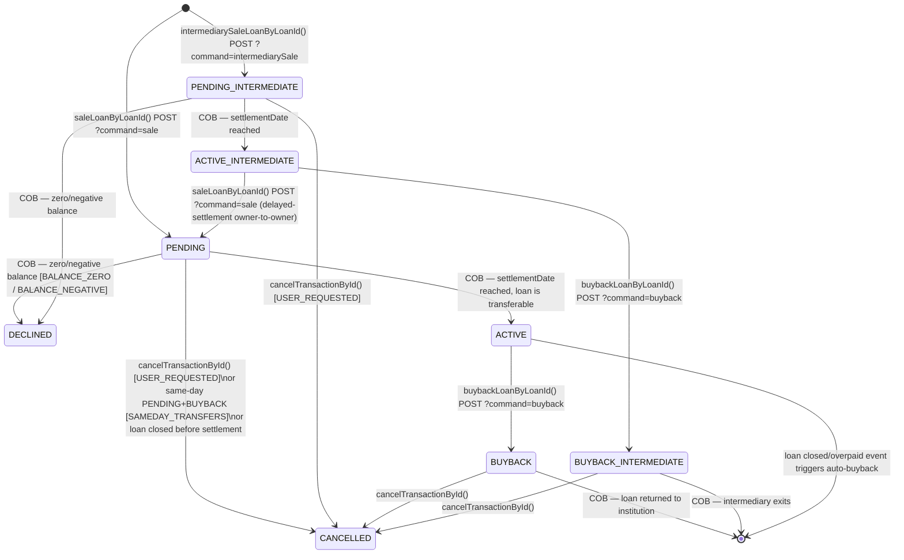
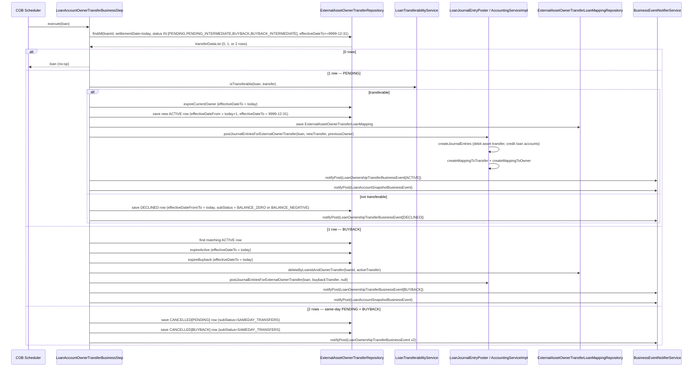

The investor module enables Apache Fineract to model **loan portfolio securitization and sale** — the mechanism by which a financial institution transfers economic ownership of a loan (or group of loans) to an external asset owner (investor). Once a loan is externalized, ongoing transaction journal entries are automatically attributed to the new owner. The module is conditionally activated via `fineract.module.investor.enabled` and every bean in the package is guarded by `InvestorModuleIsEnabledCondition`.

<CardGroup cols={2}>
  <Card title="Domain Entities" icon="database">
    Seven JPA entities model owners, transfers, loan mappings, and accounting links across six database tables.
  </Card>
  <Card title="COB Business Step" icon="clock">
    `LoanAccountOwnerTransferBusinessStep` executes each COB night, atomically activating pending transfers on their settlement date.
  </Card>
  <Card title="REST API" icon="code">
    `ExternalAssetOwnersApiResource` at `/v1/external-asset-owners` exposes sale, buyback, cancel, search, and journal-entry queries.
  </Card>
  <Card title="Accounting" icon="calculator">
    `AccountingServiceImpl` posts paired debit/credit journal entries via `InvestorAccountingHelper`, mapping each entry to both the transfer and the owner.
  </Card>
</CardGroup>

---

## File Inventory

| File | Role |
|---|---|
| `fineract-investor/…/domain/ExternalAssetOwner.java` | JPA entity for an external investor (`m_external_asset_owner`) |
| `fineract-investor/…/domain/ExternalAssetOwnerTransfer.java` | JPA entity for one transfer record (`m_external_asset_owner_transfer`) |
| `fineract-investor/…/domain/ExternalAssetOwnerTransferDetails.java` | Outstanding-balance snapshot at time of transfer (`m_external_asset_owner_transfer_details`) |
| `fineract-investor/…/domain/ExternalAssetOwnerTransferLoanMapping.java` | Active ownership link from loan → transfer (`m_external_asset_owner_transfer_loan_mapping`) |
| `fineract-investor/…/domain/ExternalAssetOwnerJournalEntryMapping.java` | Maps GL journal entries to an owner (`m_external_asset_owner_journal_entry_mapping`) |
| `fineract-investor/…/domain/ExternalAssetOwnerTransferJournalEntryMapping.java` | Maps GL journal entries to a specific transfer (`m_external_asset_owner_transfer_journal_entry_mapping`) |
| `fineract-investor/…/data/ExternalTransferStatus.java` | Enum of all transfer states |
| `fineract-investor/…/data/ExternalTransferSubStatus.java` | Enum of decline/cancel reasons |
| `fineract-investor/…/data/ExternalTransferData.java` | Read-side DTO |
| `fineract-investor/…/data/ExternalTransferDataDetails.java` | Balance details sub-DTO |
| `fineract-investor/…/api/ExternalAssetOwnersApiResource.java` | JAX-RS REST resource at `/v1/external-asset-owners` |
| `fineract-investor/…/api/ExternalAssetOwnerLoanProductAttributesApiResource.java` | JAX-RS REST resource at `/v1/external-asset-owners/loan-product` |
| `fineract-investor/…/cob/loan/LoanAccountOwnerTransferBusinessStep.java` | COB step: `EXTERNAL_ASSET_OWNER_TRANSFER` |
| `fineract-investor/…/service/AccountingService.java` | Interface for investor GL entry posting |
| `fineract-investor/…/service/AccountingServiceImpl.java` | Concrete implementation using `InvestorAccountingHelper` |
| `fineract-investor/…/accounting/journalentry/service/InvestorAccountingHelper.java` | Low-level GL entry factory; identifier prefix `"I"` |
| `fineract-investor/…/service/ExternalAssetOwnersWriteServiceImpl.java` | Sale, buyback, cancel orchestration |
| `fineract-investor/…/service/ExternalAssetOwnerTransferOutstandingInterestCalculation.java` | Pluggable interest strategy |
| `fineract-investor/…/service/LoanTransferabilityServiceImpl.java` | Decides whether a loan may be sold on settlement date |
| `fineract-investor/…/service/DelayedSettlementAttributeServiceImpl.java` | Reads `SETTLEMENT_MODEL` product attribute |
| `fineract-investor/…/service/search/ExternalAssetOwnerSearchService.java` | Full-text + date-range search coordinator |
| `fineract-investor/…/domain/search/SearchingExternalAssetOwnerRepositoryImpl.java` | JPA Criteria API search implementation |
| `fineract-investor/…/service/ExternalAssetOwnerJournalEntryServiceImpl.java` | Listens for `LoanJournalEntryCreatedBusinessEvent`, links entries to owner |
| `fineract-investor/…/service/LoanAccountOwnerTransferServiceImpl.java` | Handles loan-closed/overpaid events for in-flight transfers |
| `fineract-investor/…/config/InvestorModuleIsEnabledCondition.java` | Spring `@Conditional` — reads `fineract.module.investor.enabled` |
| `fineract-investor/…/config/LoanAccountOwnerTransferConfiguration.java` | Registers `LoanTransferabilityService` when none is present |
| `fineract-avro-schemas/…/loan/v1/LoanOwnershipTransferDataV1.avsc` | Avro schema for the `LoanOwnershipTransferBusinessEvent` message |

---

## Domain Entities

### ExternalAssetOwner

**Table:** `m_external_asset_owner`  
**Source:** `fineract-investor/src/main/java/org/apache/fineract/investor/domain/ExternalAssetOwner.java`

Represents an external investing entity. Intentionally minimal — the investor is identified solely by a client-supplied external ID.

| Column | Java Field | Type | Constraints |
|---|---|---|---|
| `id` | inherited | `Long` | PK, auto-generated |
| `external_id` | `externalId` | `ExternalId` (varchar 100) | NOT NULL, UNIQUE |
| `created_by`, `created_on_utc`, `last_modified_by`, `last_modified_on_utc` | inherited audit fields | — | From `AbstractAuditableWithUTCDateTimeCustom` |

---

### ExternalAssetOwnerTransfer

**Table:** `m_external_asset_owner_transfer`  
**Source:** `fineract-investor/src/main/java/org/apache/fineract/investor/domain/ExternalAssetOwnerTransfer.java`

The central record. One row exists for **each state transition** — the entity is written as an append-only log; old rows are "expired" by setting `effective_date_to` to the current business date before a new row is inserted.

| Column | Java Field | Type | Constraints |
|---|---|---|---|
| `id` | inherited | `Long` | PK |
| `owner_id` | `owner` | `@ManyToOne ExternalAssetOwner` | NOT NULL |
| `previous_owner_id` | `previousOwner` | `@ManyToOne ExternalAssetOwner` | nullable |
| `loan_id` | `loanId` | `Long` | NOT NULL |
| `external_loan_id` | `externalLoanId` | `ExternalId` (varchar 100) | nullable |
| `external_group_id` | `externalGroupId` | `ExternalId` (varchar 100) | nullable |
| `external_id` | `externalId` | `ExternalId` (varchar 100) | NOT NULL — client-supplied idempotency key |
| `status` | `status` | `ExternalTransferStatus` (varchar 50) | NOT NULL, enum-stored as string |
| `sub_status` | `subStatus` | `ExternalTransferSubStatus` (varchar 50) | nullable |
| `purchase_price_ratio` | `purchasePriceRatio` | `String` (varchar 50) | NOT NULL |
| `settlement_date` | `settlementDate` | `LocalDate` | NOT NULL |
| `effective_date_from` | `effectiveDateFrom` | `LocalDate` | NOT NULL |
| `effective_date_to` | `effectiveDateTo` | `LocalDate` | NOT NULL — `9999-12-31` means "still current" |

The `@OneToOne` `externalAssetOwnerTransferDetails` is cascade-all and maps to `ExternalAssetOwnerTransferDetails`.

---

### ExternalAssetOwnerTransferDetails

**Table:** `m_external_asset_owner_transfer_details`  
**Source:** `fineract-investor/src/main/java/org/apache/fineract/investor/domain/ExternalAssetOwnerTransferDetails.java`

Snapshot of the loan's outstanding balances **at the moment of COB activation**. Populated by `LoanAccountOwnerTransferBusinessStep.createAssetOwnerTransferDetails()`.

| Column | Java Field | Notes |
|---|---|---|
| `asset_owner_transfer_id` | `externalAssetOwnerTransfer` | FK to transfer |
| `total_outstanding_derived` | `totalOutstanding` | Computed: principal + interest + fees + penalties |
| `principal_outstanding_derived` | `totalPrincipalOutstanding` | `loan.getSummary().getTotalPrincipalOutstanding()` |
| `interest_outstanding_derived` | `totalInterestOutstanding` | From `ExternalAssetOwnerTransferOutstandingInterestCalculation` |
| `fee_charges_outstanding_derived` | `totalFeeChargesOutstanding` | `loan.getSummary().getTotalFeeChargesOutstanding()` |
| `penalty_charges_outstanding_derived` | `totalPenaltyChargesOutstanding` | `loan.getSummary().getTotalPenaltyChargesOutstanding()` |
| `total_overpaid_derived` | `totalOverpaid` | `loan.getTotalOverpaid()` |

---

### ExternalAssetOwnerTransferLoanMapping

**Table:** `m_external_asset_owner_transfer_loan_mapping`  
**Source:** `fineract-investor/src/main/java/org/apache/fineract/investor/domain/ExternalAssetOwnerTransferLoanMapping.java`

The **active ownership index**: exactly one row per loan that is currently externalized. Created when a transfer activates; deleted when a buyback activates or the transfer is cancelled.

| Column | Java Field | Notes |
|---|---|---|
| `loan_id` | `loanId` | NOT NULL |
| `owner_transfer_id` | `ownerTransfer` | FK → `ExternalAssetOwnerTransfer` |

`ExternalAssetOwnerJournalEntryServiceImpl` uses this table to fan out all subsequent `LoanJournalEntryCreatedBusinessEvent` entries to the correct owner.

---

### ExternalAssetOwnerJournalEntryMapping

**Table:** `m_external_asset_owner_journal_entry_mapping`  
**Source:** `fineract-investor/src/main/java/org/apache/fineract/investor/domain/ExternalAssetOwnerJournalEntryMapping.java`

Links any GL `JournalEntry` to an `ExternalAssetOwner`. Created both at transfer-activation time (via `AccountingServiceImpl.createMappingToOwner`) and on ongoing loan transactions (via `ExternalAssetOwnerJournalEntryServiceImpl`).

| Column | Java Field |
|---|---|
| `journal_entry_id` | `journalEntry` (`@OneToOne`) |
| `owner_id` | `owner` (`@ManyToOne ExternalAssetOwner`) |

---

### ExternalAssetOwnerTransferJournalEntryMapping

**Table:** `m_external_asset_owner_transfer_journal_entry_mapping`  
**Source:** `fineract-investor/src/main/java/org/apache/fineract/investor/domain/ExternalAssetOwnerTransferJournalEntryMapping.java`

Links a GL entry to the specific **transfer event** (not just the owner), enabling full reconciliation of which journal entries belong to which sale or buyback.

| Column | Java Field |
|---|---|
| `journal_entry_id` | `journalEntry` (`@OneToOne`) |
| `owner_transfer_id` | `ownerTransfer` (`@ManyToOne ExternalAssetOwnerTransfer`) |

---

## Status Enumerations

### ExternalTransferStatus

**Source:** `fineract-investor/src/main/java/org/apache/fineract/investor/data/ExternalTransferStatus.java`

| Value | Meaning |
|---|---|
| `PENDING` | Sale request accepted; waiting for COB on `settlementDate` |
| `PENDING_INTERMEDIATE` | Intermediary-sale request accepted (delayed-settlement flow); waiting for COB |
| `ACTIVE` | Loan is currently owned by external investor (normal sale) |
| `ACTIVE_INTERMEDIATE` | Loan is currently owned by the intermediary (delayed-settlement flow) |
| `BUYBACK` | Buyback request accepted (ACTIVE loan); waiting for COB |
| `BUYBACK_INTERMEDIATE` | Buyback request accepted (ACTIVE_INTERMEDIATE loan); waiting for COB |
| `DECLINED` | COB refused the sale (zero or negative balance) |
| `CANCELLED` | Manually cancelled by user before settlement, or auto-cancelled by same-day sale+buyback |

### ExternalTransferSubStatus

**Source:** `fineract-investor/src/main/java/org/apache/fineract/investor/data/ExternalTransferSubStatus.java`

| Value | Set when |
|---|---|
| `BALANCE_ZERO` | Loan outstanding balance is zero on settlement date |
| `BALANCE_NEGATIVE` | Loan is overpaid on settlement date |
| `SAMEDAY_TRANSFERS` | PENDING and BUYBACK with same settlement date: both cancelled atomically |
| `USER_REQUESTED` | Operator explicitly called the cancel endpoint |
| `UNSOLD` | Buyback executed but there was no matching active transfer to retire |

---

## Transfer Lifecycle State Machine

<Note>
The sentinel date `9999-12-31` in `effective_date_to` marks a row as **currently active**. The COB step filters with `criteriaBuilder.greaterThanOrEqualTo(root.get("effectiveDateTo"), FUTURE_DATE_9999_12_31)` to find transfers that need processing today.
</Note>

---

## API Reference

### ExternalAssetOwnersApiResource

**Base path:** `/v1/external-asset-owners`  
**Source:** `fineract-investor/src/main/java/org/apache/fineract/investor/api/ExternalAssetOwnersApiResource.java`  
**Conditional:** `@Conditional(InvestorModuleIsEnabledCondition.class)`

<Tabs>
  <Tab title="Transfer Initiation">

| Method | Path | `?command=` | Handler | Description |
|---|---|---|---|---|
| `POST` | `/transfers/loans/{loanId}` | `sale` | `ExternalAssetOwnersWriteServiceImpl.saleLoanByLoanId` | Initiate sale by internal loan ID |
| `POST` | `/transfers/loans/{loanId}` | `buyback` | `buybackLoanByLoanId` | Initiate buyback by internal loan ID |
| `POST` | `/transfers/loans/{loanId}` | `intermediarySale` | `intermediarySaleLoanByLoanId` | Initiate intermediary/delayed sale by loan ID |
| `POST` | `/transfers/loans/external-id/{loanExternalId}` | `sale` / `buyback` | Same as above | By external loan ID — resolves to internal ID first |
| `POST` | `/transfers/{id}` | `cancel` | `cancelTransactionById` | Cancel PENDING or BUYBACK by transfer internal ID |
| `POST` | `/transfers/external-id/{externalId}` | `cancel` | `cancelTransactionById` | Cancel by transfer external ID |
| `POST` | `` (root) | `create` | `createExternalAssetOwner` | Register a new external owner by external ID |

**Sale/buyback/intermediarySale request body** (`ExternalAssetOwnerRequest` / `ExternalTransferRequestParameters`):

| Field | Required | Notes |
|---|---|---|
| `ownerExternalId` | Yes (sale, intermediarySale) | Max 100 chars |
| `transferExternalId` | No | Auto-generated UUID if omitted; max 100 chars |
| `transferExternalGroupId` | No | Logical grouping key; max 100 chars |
| `purchasePriceRatio` | Yes (sale, intermediarySale) | String; max 50 chars |
| `settlementDate` | Yes | Must not be in the past |
| `dateFormat` | Yes | e.g. `"yyyy-MM-dd"` |
| `locale` | Yes | e.g. `"en"` |

  </Tab>
  <Tab title="Queries">

| Method | Path | Query Params | Returns |
|---|---|---|---|
| `GET` | `/transfers` | `transferExternalId`, `loanId`, `loanExternalId`, `offset`, `limit` | `Page<ExternalTransferData>` |
| `GET` | `/transfers/active-transfer` | `transferExternalId`, `loanId`, `loanExternalId` | `ExternalTransferData` (single) |
| `GET` | `/transfers/{transferId}/journal-entries` | `offset`, `limit` | `ExternalOwnerTransferJournalEntryData` |
| `GET` | `/owners/external-id/{ownerExternalId}/journal-entries` | `offset`, `limit` | `ExternalOwnerJournalEntryData` |
| `GET` | `` (root) | — | `List<ExternalTransferOwnerData>` |
| `POST` | `/search` | JSON body `PagedRequest<ExternalAssetOwnerSearchRequest>` | `Page<ExternalTransferData>` |

  </Tab>
</Tabs>

### ExternalAssetOwnerLoanProductAttributesApiResource

**Base path:** `/v1/external-asset-owners/loan-product`  
**Source:** `fineract-investor/src/main/java/org/apache/fineract/investor/api/ExternalAssetOwnerLoanProductAttributesApiResource.java`

| Method | Path | Description |
|---|---|---|
| `POST` | `/{loanProductId}/attributes` | Create attribute for a loan product |
| `GET` | `/{loanProductId}/attributes?attributeKey=` | List attributes, optionally filtered by key |
| `PUT` | `/{loanProductId}/attributes/{id}` | Update an existing attribute |

---

## COB Business Step: `LoanAccountOwnerTransferBusinessStep`

**Source:** `fineract-investor/src/main/java/org/apache/fineract/investor/cob/loan/LoanAccountOwnerTransferBusinessStep.java`  
**COB enum name:** `EXTERNAL_ASSET_OWNER_TRANSFER`  
**Human name:** `"Execute external asset owner transfer"`

Runs once per loan per COB night. The step queries `m_external_asset_owner_transfer` for rows where `loan_id = :loanId AND settlement_date = :businessDate AND status IN (PENDING, PENDING_INTERMEDIATE, BUYBACK, BUYBACK_INTERMEDIATE) AND effective_date_to >= 9999-12-31`.

<Steps>
  <Step title="Load transfer candidates">
    Query returns 0, 1, or 2 rows sorted by `id ASC`.
  </Step>
  <Step title="Branch on count">
    - **0 rows:** no-op, return loan unchanged.
    - **1 row (PENDING / PENDING_INTERMEDIATE):** call `handleSale()`.
    - **1 row (BUYBACK / BUYBACK_INTERMEDIATE):** call `handleBuyback()`.
    - **2 rows (PENDING + BUYBACK):** same-day cancel — call `handleSameDaySaleAndBuyback()`.
    - **2 rows with delayed settlement:** throws `IllegalStateException`.
  </Step>
  <Step title="handleSale → sellAssetOrDecline()">
    Calls `LoanTransferabilityService.isTransferable(loan, transfer)`.
    - **Not transferable:** calls `declinePendingEntry()` → writes `DECLINED` row with `BALANCE_ZERO` or `BALANCE_NEGATIVE` sub-status. Fires `LoanOwnershipTransferBusinessEvent`.
    - **Transferable:** calls `sellAsset()` → `determinePreviousOwnerAndCleanupIfNeeded()` → expires any existing active owner mapping → calls `activatePendingEntry()` which writes `ACTIVE` row with `effectiveDateFrom = settlementDate + 1` and `effectiveDateTo = 9999-12-31` → calls `loanJournalEntryPoster.postJournalEntriesForExternalOwnerTransfer()` → creates `ExternalAssetOwnerTransferLoanMapping` → snapshots `ExternalAssetOwnerTransferDetails`. Fires `LoanOwnershipTransferBusinessEvent` + `LoanAccountSnapshotBusinessEvent`.
  </Step>
  <Step title="handleBuyback()">
    Finds the matching `ACTIVE` (or `ACTIVE_INTERMEDIATE`) row. If none found, writes `CANCELLED / UNSOLD`. Otherwise calls `buybackAsset()`: expires the active row, sets `effectiveDateTo = settlementDate` on the buyback row, posts GL entries (reverse direction), deletes the loan mapping. Fires `LoanOwnershipTransferBusinessEvent` + `LoanAccountSnapshotBusinessEvent`.
  </Step>
  <Step title="handleSameDaySaleAndBuyback()">
    Cancels both the `PENDING` and `BUYBACK` rows with `SAMEDAY_TRANSFERS` sub-status; no GL entries are posted. Fires two `LoanOwnershipTransferBusinessEvent` events.
  </Step>
</Steps>

<Warning>
If two transfers are found and `DelayedSettlementAttributeService.isEnabled()` is `true`, `LoanAccountOwnerTransferBusinessStep.execute()` throws `IllegalStateException` immediately. The delayed-settlement flow cannot have simultaneous same-day transfers.
</Warning>

---

## Transferability Validation

**Source:** `fineract-investor/src/main/java/org/apache/fineract/investor/service/LoanTransferabilityServiceImpl.java`

`LoanTransferabilityServiceImpl.isTransferable()` returns `false` (causing a `DECLINED`) when:

- Delayed settlement is **disabled** AND `loan.getSummary().getTotalOutstanding() <= 0`.
- Transfer status is `PENDING_INTERMEDIATE` (delayed-settlement intermediary leg) AND `totalOutstanding <= 0`.

`getDeclinedSubStatus()` returns:
- `BALANCE_NEGATIVE` if `loan.getTotalOverpaid() > 0`.
- `BALANCE_ZERO` otherwise.

---

## Accounting Service

**Interface:** `fineract-investor/src/main/java/org/apache/fineract/investor/service/AccountingService.java`  
**Implementation:** `fineract-investor/src/main/java/org/apache/fineract/investor/service/AccountingServiceImpl.java`  
**Helper:** `fineract-investor/src/main/java/org/apache/fineract/investor/accounting/journalentry/service/InvestorAccountingHelper.java`

`AccountingServiceImpl` is called by `LoanJournalEntryPoster.postJournalEntriesForExternalOwnerTransfer()` during the COB step.

### GL Entry Logic

Two symmetric passes are made — one moving balances **to** the asset-transfer account, one moving them **from** it:

| Balance component | Normal loan account used | Charged-off loan account used |
|---|---|---|
| Principal | `LOAN_PORTFOLIO` | `CHARGE_OFF_EXPENSE` or reason-specific mapping |
| Interest | `INTEREST_RECEIVABLE` | `INCOME_FROM_CHARGE_OFF_INTEREST` |
| Fees | `FEES_RECEIVABLE` | `INCOME_FROM_CHARGE_OFF_FEES` |
| Penalties | `PENALTIES_RECEIVABLE` | `INCOME_FROM_CHARGE_OFF_PENALTY` |
| Overpayment | `OVERPAYMENT` | `OVERPAYMENT` (unchanged) |
| Asset-transfer pivot | `ASSET_TRANSFER` (financial activity) | Same |

Journal entry transaction IDs are prefixed with `"I"` (constant `InvestorAccountingHelper.INVESTOR_TRANSFER_IDENTIFIER`) to distinguish investor entries from standard loan transactions.

### Owner Attribution for Sale

| Entry direction | Loan status normal | Loan status overpaid |
|---|---|---|
| **Credit** | Attributed to `previousOwner` | Attributed to `newOwner` |
| **Debit** | Attributed to `newOwner` | Attributed to `previousOwner` |
| Asset-transfer account | Attributed to `null` (no owner) | Same |

For buyback, credit entries go to `previousOwner` (the investor being bought back); debit entries get `null`. Overpaid buyback debits also go to `previousOwner`.

### Ongoing Transaction Attribution

`ExternalAssetOwnerJournalEntryServiceImpl` registers a `@PostConstruct` listener on `LoanJournalEntryCreatedBusinessEvent`. When a journal entry is created for a loan that has an active entry in `m_external_asset_owner_transfer_loan_mapping`, a new `ExternalAssetOwnerJournalEntryMapping` row links it to the current investor.

---

## Search API

**Service:** `fineract-investor/src/main/java/org/apache/fineract/investor/service/search/ExternalAssetOwnerSearchService.java`  
**Repository:** `fineract-investor/src/main/java/org/apache/fineract/investor/domain/search/SearchingExternalAssetOwnerRepositoryImpl.java`  
**Request model:** `fineract-investor/src/main/java/org/apache/fineract/investor/service/search/domain/ExternalAssetOwnerSearchRequest.java`

Called via `POST /v1/external-asset-owners/search` with a `PagedRequest<ExternalAssetOwnerSearchRequest>` body.

### ExternalAssetOwnerSearchRequest Fields

| Field | Type | Maps to JPA predicate |
|---|---|---|
| `text` | `String` | `LIKE` on `externalId` (transfer), `owner.externalId`, or `externalLoanId` |
| `submittedFromDate` | `LocalDate` | `settlementDate >= submittedFromDate` |
| `submittedToDate` | `LocalDate` | `settlementDate <= submittedToDate` |
| `effectiveFromDate` | `LocalDate` | `effectiveDateFrom >= effectiveFromDate` |
| `effectiveToDate` | `LocalDate` | `effectiveDateTo <= effectiveToDate` |

The default sort is `settlementDate DESC`. Results are projected into `SearchedExternalAssetOwner` (with full balance details via a LEFT JOIN on `ExternalAssetOwnerTransferDetails`) then mapped by `ExternalAssetOwnerSearchDataMapper` to `ExternalTransferData`.

---

## Data Transfer Objects

### ExternalTransferData

**Source:** `fineract-investor/src/main/java/org/apache/fineract/investor/data/ExternalTransferData.java`

| Field | Type |
|---|---|
| `transferId` | `Long` |
| `owner` | `ExternalTransferOwnerData` |
| `previousOwner` | `ExternalTransferOwnerData` |
| `loan` | `ExternalTransferLoanData` |
| `details` | `ExternalTransferDataDetails` |
| `transferExternalId` | `String` |
| `transferExternalGroupId` | `String` |
| `purchasePriceRatio` | `String` |
| `settlementDate` | `LocalDate` |
| `status` | `ExternalTransferStatus` |
| `subStatus` | `ExternalTransferSubStatus` |
| `effectiveFrom` | `LocalDate` |
| `effectiveTo` | `LocalDate` |

`ExternalTransferOwnerData` holds `{ String externalId, Long id }`.  
`ExternalTransferLoanData` holds `{ Long loanId, String externalId }`.  
`ExternalTransferDataDetails` holds `Long detailsId` plus six `BigDecimal` outstanding-balance fields sourced from `ExternalAssetOwnerTransferDetails`.

---

## Loan Product Attributes

**Source:** `fineract-investor/src/main/java/org/apache/fineract/investor/data/attribute/SettlementModelExternalAssetOwnerLoanProductAttribute.java`  
**Table:** `m_external_asset_owner_loan_product_configurable_attributes` (via `ExternalAssetOwnerLoanProductAttributes` entity)

| Attribute Key | Attribute Value | Effect |
|---|---|---|
| `SETTLEMENT_MODEL` | `DEFAULT_SETTLEMENT` | Normal (immediate) settlement flow |
| `SETTLEMENT_MODEL` | `DELAYED_SETTLEMENT` | Intermediary / two-leg settlement enabled |
| `OUTSTANDING_INTEREST_STRATEGY` | `TOTAL_OUTSTANDING` | Use `loan.getSummary().getTotalInterestOutstanding()` |
| `OUTSTANDING_INTEREST_STRATEGY` | `PAYABLE_OUTSTANDING` | Use due + not-yet-due payable interest calculation |

`DelayedSettlementAttributeServiceImpl.isEnabled(loanProductId)` checks whether `SETTLEMENT_MODEL = DELAYED_SETTLEMENT` is set for the product.

The outstanding interest strategy is read from the global configuration key `"outstanding-interest-calculation-strategy-for-external-asset-transfer"` (via `ConfigurationDomainService.getAssetOwnerTransferOustandingInterestStrategy()`). The two strategies are implemented in `ExternalAssetOwnerTransferOutstandingInterestCalculation`.

---

## Module Configuration

| Property | Default | Description |
|---|---|---|
| `fineract.module.investor.enabled` | `true` | Master on/off switch. Env: `FINERACT_MODULE_INVESTOR_ENABLED` |
| Global config: `asset-externalization-of-non-active-loans` | — | When enabled, triggers auto-transfer handling on `LoanStatusChangedBusinessEvent` (closed/overpaid loans) |
| Global config: `outstanding-interest-calculation-strategy-for-external-asset-transfer` | `TOTAL_OUTSTANDING_INTEREST` | Controls interest calculation during transfer: `TOTAL_OUTSTANDING_INTEREST` (due + not-yet-due + projected) or `PAYABLE_OUTSTANDING_INTEREST` (due + not-yet-due only) |
| Loan product attribute `SETTLEMENT_MODEL` | `DEFAULT_SETTLEMENT` | Per-product; enables delayed-settlement (intermediary) flow |

`LoanAccountOwnerTransferConfiguration` registers `LoanTransferabilityServiceImpl` as the default `LoanTransferabilityService` using `@ConditionalOnMissingBean`, allowing integrators to supply a custom implementation.

---

## Avro Event Schema: `LoanOwnershipTransferDataV1`

**File:** `fineract-avro-schemas/src/main/avro/loan/v1/LoanOwnershipTransferDataV1.avsc`  
**Namespace:** `org.apache.fineract.avro.loan.v1`  
**Event class:** `LoanOwnershipTransferBusinessEvent` (extends `InvestorBusinessEvent`)

| Field | Avro Type | Notes |
|---|---|---|
| `loanId` | `long` | Required |
| `loanExternalId` | `null \| string` | Optional |
| `type` | `null \| string` | Transfer type label |
| `transferExternalId` | `null \| string` | Idempotency key |
| `transferExternalGroupId` | `null \| string` | Group key |
| `submittedDate` | `null \| string` | ISO date string |
| `assetOwnerExternalId` | `null \| string` | New (or current) owner |
| `previousOwnerExternalId` | `null \| string` | Previous owner (null for initial sale) |
| `currency` | `null \| CurrencyDataV1` | Loan currency |
| `totalOutstandingBalanceAmount` | `null \| bigdecimal` | Sum of all outstanding components |
| `outstandingPrincipalPortion` | `null \| bigdecimal` | — |
| `outstandingFeePortion` | `null \| bigdecimal` | — |
| `outstandingPenaltyPortion` | `null \| bigdecimal` | — |
| `outstandingInterestPortion` | `null \| bigdecimal` | — |
| `overPaymentPortion` | `null \| bigdecimal` | — |
| `unrecognizedIncomePortion` | `null \| bigdecimal` | — |
| `unpaidChargeData` | `null \| UnpaidChargeDataV1[]` | Array of unpaid charge records |
| `transferStatus` | `null \| string` | Stringified `ExternalTransferStatus` |
| `transferStatusReason` | `null \| string` | Stringified `ExternalTransferSubStatus` |
| `settlementDate` | `null \| string` | ISO date |
| `purchasePriceRatio` | `null \| string` | — |
| `customData` | `null \| map<bytes>` | Extension point for integrators |

The event is serialized and published by `InvestorBusinessEventSerializer` in `fineract-investor/src/main/java/org/apache/fineract/investor/service/serialization/serializer/investor/InvestorBusinessEventSerializer.java`.

---

## COB Sequence Diagram

---

## Connections to Other Modules

<Accordion title="Loan COB Framework">
`LoanAccountOwnerTransferBusinessStep` implements `LoanCOBBusinessStep` from `fineract-core`. It is registered by the COB framework when the step name `EXTERNAL_ASSET_OWNER_TRANSFER` is configured in the COB step order. The step is conditional on `InvestorModuleIsEnabledCondition`.
</Accordion>

<Accordion title="Accounting / GL">
`InvestorAccountingHelper` depends on `JournalEntryRepository`, `ProductToGLAccountMappingRepository`, `FinancialActivityAccountRepositoryWrapper`, and `GLClosureRepository`. It checks for open GL periods via `checkForBranchClosures()` before writing any entries. The `FinancialActivity.ASSET_TRANSFER` account is an organization-level financial activity mapping, not a product-level one.
</Accordion>

<Accordion title="Business Events / Messaging">
`LoanOwnershipTransferBusinessEvent` extends `InvestorBusinessEvent` which extends `AbstractBusinessEvent<ExternalAssetOwnerTransfer>`. The Avro serializer `InvestorBusinessEventSerializer` produces `LoanOwnershipTransferDataV1` messages on the event bus. The `LoanAccountDataV1Enricher`, `LoanTransactionDataV1Enricher`, `LoanChargeDataV1Enricher`, and `LoanTransactionAdjustmentDataV1Enricher` in the `enricher` package augment standard Fineract event payloads with investor ownership context.
</Accordion>

<Accordion title="Loan Product Configuration">
The `ExternalAssetOwnerLoanProductAttributesApiResource` at `/v1/external-asset-owners/loan-product` manages per-product attributes stored in `m_external_asset_owner_loan_product_configurable_attributes`. The `SETTLEMENT_MODEL` attribute gates the intermediary/delayed-settlement code path. `DelayedSettlementAttributeServiceImpl` reads from this table to determine whether delayed settlement is active for a given loan product.
</Accordion>

<Accordion title="Loan Status Change Handler">
`ExternalAssetOwnerLoanStatusChangePlatformServiceImpl` listens to `LoanStatusChangedBusinessEvent`. When the global configuration `asset-externalization-of-non-active-loans` is enabled and a loan transitions from active to closed or overpaid, it delegates to `LoanAccountOwnerTransferServiceImpl.handleLoanClosedOrOverpaid()`, which declines pending sales and executes pending buybacks immediately outside of the COB context.
</Accordion>

---

## Gotchas & Invariants

<Warning>
**Append-only transfer records.** The system never updates a transfer's `status` in place. Every state transition produces a new row with the new status, and the old row's `effective_date_to` is set to today. Queries for "current" state must filter `effectiveDateTo = 9999-12-31`. Failure to do so returns stale rows.
</Warning>

<Warning>
**`transferExternalId` uniqueness is enforced at service layer.** `ExternalAssetOwnersWriteServiceImpl.validateExternalId()` checks `ExternalAssetOwnerTransferRepository.exists()` before saving. Two concurrent requests with the same `transferExternalId` can both pass this check; the DB unique constraint on the column provides the final guard. The service has SQL-state `23xxx` catch logic for optimistic retry.
</Warning>

<Info>
**Delayed-settlement requires exactly one `ACTIVE_INTERMEDIATE` row before a regular sale can proceed.** `validateEffectiveTransferForDelayedSettlementSale()` throws `ExternalAssetOwnerInitiateTransferException` if the loan is not in `ACTIVE_INTERMEDIATE` state, or if it is already in `ACTIVE` state without an intermediate leg.
</Info>

<Tip>
**Custom transferability:** `LoanTransferabilityService` is registered via `@ConditionalOnMissingBean` in `LoanAccountOwnerTransferConfiguration`. Provide a custom Spring bean of type `LoanTransferabilityService` to override default transferability logic (e.g., to allow zero-balance transfers for certain products).
</Tip>

<Info>
**Interest strategy selection** is a global configuration (`TOTAL_OUTSTANDING_INTEREST` vs `PAYABLE_OUTSTANDING_INTEREST`). The `PAYABLE_OUTSTANDING_INTEREST` path calls `LoanReadPlatformService.retrieveOne()` + `fetchRepaymentScheduleData()` — a potentially expensive read during COB. Benchmark before enabling on high-volume portfolios.
</Info>

<Note>
**`ExternalAssetOwnerJournalEntryServiceImpl`** attaches ongoing transaction GL entries to the current owner via a `@PostConstruct` event listener on `LoanJournalEntryCreatedBusinessEvent`. This listener looks up `ExternalAssetOwnerTransferLoanMapping` by `loanId`. If the mapping is absent (loan not externalized), no action is taken.
</Note>
