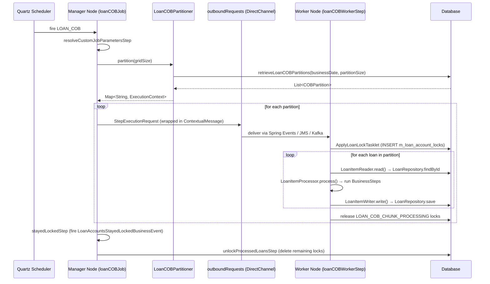

Close-of-Business (COB) is Fineract's end-of-day processing pipeline. Every day, for every active loan (and every Working Capital loan in the `fineract-working-capital-loan` module), the COB job advances the loan's accounting state to the current business date. It applies accruals, checks overdue installments, updates delinquency classifications, recalculates interest, and runs any custom business steps registered in the `m_batch_business_steps` table. The pipeline is built on Spring Batch remote partitioning: a manager node partitions all eligible loans into ID-range chunks, publishes `StepExecutionRequest` messages to a channel (JMS, Kafka, or Spring Events), and worker nodes process each chunk independently. A loan-level lock in the `m_loan_account_locks` table prevents concurrent modifications during processing.

## What COB Does (High Level)

<Steps>
  <Step title="Resolve custom job parameters">
    `ResolveLoanCOBCustomJobParametersTasklet` reads `COB_CUSTOM_JOB_PARAMETER_KEY` from job parameters to find any inline-triggered loan ID set.
  </Step>
  <Step title="Partition loans">
    `LoanCOBPartitioner.partition(gridSize)` queries the database for all non-closed loans whose `last_closed_business_date` is behind the current business date. Loans are sorted by ID and split into pages of `LOAN_COB_PARTITION_SIZE` (default 100) forming one `ExecutionContext` per partition.
  </Step>
  <Step title="Distribute partition steps">
    The manager node sends each `StepExecutionRequest` to the `outboundRequests` `DirectChannel`. The configured message handler (Spring Events / JMS / Kafka) delivers it to a worker.
  </Step>
  <Step title="Apply lock">
    Worker's `ApplyLoanLockTasklet` acquires a row in `m_loan_account_locks` for every loan ID in the partition with `lock_owner = LOAN_COB_CHUNK_PROCESSING`.
  </Step>
  <Step title="Read → Process → Write">
    `LoanItemReader` dequeues loan IDs, loads each `Loan` from `LoanRepository`, `LoanItemProcessor` runs all configured `BusinessStep` implementations in `stepOrder` order, and `LoanItemWriter` saves the loan and releases the chunk lock.
  </Step>
  <Step title="Stayed-locked cleanup">
    `StayedLockedLoansTasklet` fires a `LoanAccountsStayedLockedBusinessEvent` for any loans that remained locked after processing (e.g. errored partitions).
  </Step>
  <Step title="Unlock processed loans">
    `UnlockProcessedLoansTasklet` removes all `LOAN_COB_CHUNK_PROCESSING` locks.
  </Step>
</Steps>

## File Inventory

| File | Module / Package | Role |
|------|-----------------|------|
| `fineract-cob/…/cob/COBBusinessStep.java` | `fineract-cob` | Generic SPI interface for all COB business steps |
| `fineract-cob/…/cob/COBBusinessStepService.java` | `fineract-cob` | Interface: `run(executionMap, item)` and `getCOBBusinessSteps(class, jobName)` |
| `fineract-cob/…/cob/COBBusinessStepServiceImpl.java` | `fineract-cob` | Runs steps in order; manages bulk event recording |
| `fineract-cob/…/cob/COBConstant.java` | `fineract-cob` | Shared constants: `BUSINESS_STEPS`, `BUSINESS_DATE_PARAMETER_NAME`, `PARTITION_KEY`, etc. |
| `fineract-cob/…/cob/common/CommonPartitioner.java` | `fineract-cob` | Abstract base for all COB partitioners |
| `fineract-cob/…/cob/domain/AccountLock.java` | `fineract-cob` | Abstract JPA entity for lock rows |
| `fineract-cob/…/cob/domain/BatchBusinessStep.java` | `fineract-cob` | JPA entity for `m_batch_business_steps` |
| `fineract-cob/…/cob/domain/BatchBusinessStepRepository.java` | `fineract-cob` | `findAllByJobName`, `deleteAllByJobName`, `findConfiguredJobNames` |
| `fineract-cob/…/cob/domain/LockOwner.java` | `fineract-cob` | Enum: `LOAN_COB_CHUNK_PROCESSING`, `LOAN_INLINE_COB_PROCESSING` |
| `fineract-cob/…/cob/processor/AbstractItemProcessor.java` | `fineract-cob` | Reads `businessSteps` from `ExecutionContext`, builds `TreeMap`, calls `COBBusinessStepService.run` |
| `fineract-cob/…/cob/service/ConfigJobParameterServiceImpl.java` | `fineract-cob` | CRUD for `BatchBusinessStep`; validates against available steps |
| `fineract-loan/…/cob/loan/LoanCOBBusinessStep.java` | `fineract-loan` | Marker interface `extends COBBusinessStep<Loan>` |
| `fineract-provider/…/cob/loan/LoanCOBConstant.java` | `fineract-provider` | `JOB_NAME="LOAN_COB"`, `LOAN_COB_JOB_NAME="LOAN_CLOSE_OF_BUSINESS"`, `LOAN_COB_WORKER_STEP`, `LOAN_COB_PARTITIONER_STEP` |
| `fineract-provider/…/cob/loan/LoanCOBManagerConfiguration.java` | `fineract-provider` | Spring Batch `Job` bean `loanCOBJob`; requires `BatchManagerCondition` |
| `fineract-provider/…/cob/loan/LoanCOBWorkerConfiguration.java` | `fineract-provider` | Worker step `loanCOBWorkerStep`; requires `BatchWorkerCondition` |
| `fineract-provider/…/cob/loan/LoanCOBPartitioner.java` | `fineract-provider` | `Partitioner` impl; delegates to `CommonPartitioner.getPartitions` |
| `fineract-provider/…/cob/loan/LoanItemReader.java` | `fineract-provider` | `ItemReader<Loan>` — dequeues loan IDs, loads from `LoanRepository` |
| `fineract-provider/…/cob/loan/LoanItemProcessor.java` | `fineract-provider` | `ItemProcessor<Loan,Loan>` — calls business steps, updates `lastClosedBusinessDate` |
| `fineract-provider/…/cob/loan/LoanItemWriter.java` | `fineract-provider` | `ItemWriter<Loan>` — saves loan, releases `LOAN_COB_CHUNK_PROCESSING` lock |
| `fineract-provider/…/cob/loan/ApplyLoanLockTasklet.java` | `fineract-provider` | Acquires `LOAN_COB_CHUNK_PROCESSING` lock before chunk read |
| `fineract-provider/…/cob/loan/StayedLockedLoansTasklet.java` | `fineract-provider` | Fires event for loans still locked after job finishes |
| `fineract-provider/…/cob/loan/UnlockProcessedLoansTasklet.java` | `fineract-provider` | Removes all `LOAN_COB_CHUNK_PROCESSING` locks |
| `fineract-provider/…/cob/api/LoanCOBCatchUpApiResource.java` | `fineract-provider` | `GET /v1/loans/oldest-cob-closed`, `POST /v1/loans/catch-up`, `GET /v1/loans/is-catch-up-running` |
| `fineract-provider/…/cob/api/ConfigureBusinessStepApiResource.java` | `fineract-provider` | `GET /v1/jobs/names`, `GET/PUT /v1/jobs/{jobName}/steps`, `GET /v1/jobs/{jobName}/available-steps` |
| `fineract-provider/…/cob/service/LoanCOBCatchUpServiceImpl.java` | `fineract-provider` | Catch-up logic; `@Conditional(LoanCOBEnabledCondition.class)` |

## Spring Batch Job Definition (`loanCOBJob`)

```java
// fineract-provider/…/cob/loan/LoanCOBManagerConfiguration.java
@Bean(name = "loanCOBJob")
public Job loanCOBJob(LoanCOBPartitioner partitioner) {
    return new JobBuilder(JobName.LOAN_COB.name(), jobRepository)
        .listener(new COBExecutionListenerRunner(applicationContext, JobName.LOAN_COB.name()))
        .start(resolveCustomJobParametersStep())          // Step 1
        .next(loanCOBStep(partitioner))                   // Step 2 - partitioned
        .next(stayedLockedStep())                         // Step 3
        .next(unlockProcessedLoansStep())                 // Step 4
        .incrementer(new RunIdIncrementer())
        .build();
}
```

| Step Bean | Step Name | Class | Purpose |
|-----------|-----------|-------|---------|
| `resolveCustomJobParametersStep` | `Resolve custom job parameters - Step` | `ResolveLoanCOBCustomJobParametersTasklet` | Reads inline loan IDs from job parameters |
| `loanCOBStep` | `Loan COB partition - Step` (`LOAN_COB_PARTITIONER_STEP`) | `LoanCOBPartitioner` + remote partitioning | Partitions and distributes work |
| `stayedLockedStep` | `Stayed locked loan accounts - Step` | `StayedLockedLoansTasklet` | Fires events for stuck loans |
| `unlockProcessedLoansStep` | `Unlock processed loan accounts - Step` | `UnlockProcessedLoansTasklet` | Clears all COB locks |

The worker-side step is named `loanCOBWorkerStep` (constant `LoanCOBConstant.LOAN_COB_WORKER_STEP = "loanCOBWorkerStep"`), built in `LoanCOBWorkerConfiguration`.

## `LoanCOBPartitioner` — How Loans Are Partitioned

```java
// fineract-provider/…/cob/loan/LoanCOBPartitioner.java
public Map<String, ExecutionContext> partition(int gridSize) {
    int partitionSize = propertyService.getPartitionSize(LoanCOBConstant.JOB_NAME);
    Set<BusinessStepNameAndOrder> cobBusinessSteps =
        cobBusinessStepService.getCOBBusinessSteps(LoanCOBBusinessStep.class,
                                                   LoanCOBConstant.LOAN_COB_JOB_NAME);
    return getPartitions(partitionSize, cobBusinessSteps);
}
```

`CommonPartitioner.getPartitions` calls `RetrieveIdService.retrieveLoanCOBPartitions(numberOfDays, businessDate, isCatchUp, partitionSize)` which returns a list of `COBPartition(minId, maxId, pageNo, count)`. Each partition becomes an `ExecutionContext` containing:

| Key | Type | Value |
|-----|------|-------|
| `businessSteps` | `Set<BusinessStepNameAndOrder>` | Ordered set of enabled business steps |
| `loanCobParameter` | `COBParameter(minId, maxId)` | ID range for this partition |
| `partition` | `String` | `"partition_N"` |
| `BusinessDate` | `String` | ISO date of current business date |
| `IS_CATCH_UP` | `String` | `"true"` or `"false"` |

If no steps are configured, `stopJobExecution()` calls `jobOperator.stop(jobId)` immediately.

## `COBBusinessStep` SPI Interface

```java
// fineract-cob/…/cob/COBBusinessStep.java
public interface COBBusinessStep<T extends AbstractPersistableCustom<Long>> {
    T execute(T input);
    String getEnumStyledName();   // e.g. "APPLY_CHARGE_TO_OVERDUE_LOANS"
    String getHumanReadableName(); // e.g. "Apply charge to overdue loans"
}
```

To implement a loan COB step, implement `LoanCOBBusinessStep` (which extends `COBBusinessStep<Loan>`):

```java
// fineract-loan/…/cob/loan/LoanCOBBusinessStep.java
public interface LoanCOBBusinessStep extends COBBusinessStep<Loan> {}

// Implementation example:
@Component
public class MyCustomStep implements LoanCOBBusinessStep {
    public Loan execute(Loan loan) {
        // modify loan state
        return loan;
    }
    public String getEnumStyledName() { return "MY_CUSTOM_STEP"; }
    public String getHumanReadableName() { return "My custom step"; }
}
```

The step is activated by inserting a row into `m_batch_business_steps` with `job_name = 'LOAN_CLOSE_OF_BUSINESS'` and `step_name = 'MY_CUSTOM_STEP'`. The `step_order` value determines execution order (ascending).

## Item Reader / Processor / Writer

### `LoanItemReader` (`fineract-provider/…/cob/loan/LoanItemReader.java`)

Extends `AbstractLoanItemReader<Loan>`. In `@BeforeStep`, calls `BeforeStepLockingItemReaderHelper.filterRemainingData(stepExecution)` which queries `m_loan_account_locks` to exclude already-locked loans from this partition, then stores remaining IDs in a `LinkedBlockingQueue<Long>`. `read()` polls from that queue and loads each `Loan` from `LoanRepository`.

### `LoanItemProcessor` (`fineract-provider/…/cob/loan/LoanItemProcessor.java`)

Extends `AbstractLoanItemProcessor` → `AbstractItemProcessor<Loan>`. In `@BeforeStep`, binds `ExecutionContext` and resolves `businessDate`. In `process(Loan)`:
1. If the loan is progressive-schedule and lacks a valid model, calls `ProgressiveLoanModelProcessingService.recalculateModelAndSave(loan.getId())`.
2. Calls `COBBusinessStepService.run(businessStepMap, loan)` which executes each enabled step in order.
3. Calls `setLastRun(loan)` → `loan.setLastClosedBusinessDate(businessDate)`.

### `LoanItemWriter` (`fineract-provider/…/cob/loan/LoanItemWriter.java`)

Extends `AbstractLoanItemWriter`. Saves the processed `Loan` via `LoanRepository` (Spring Data `save()`). The writer specifies `LockOwner.LOAN_COB_CHUNK_PROCESSING` as the lock owner. Per-chunk lock management is handled by `ChunkProcessingLoanItemListener`, which runs before and after each chunk within the worker step. Bulk lock removal across the entire job happens in `UnlockProcessedLoansTasklet`.

## Loan COB Locking (`m_loan_account_locks` table)

The `AccountLock` mapped superclass drives the lock mechanism. The concrete subclass `LoanAccountLock` (`fineract-provider/…/cob/domain/LoanAccountLock.java`) maps to the `m_loan_account_locks` table:

```java
// fineract-cob/…/cob/domain/AccountLock.java
@MappedSuperclass
public abstract class AccountLock implements Persistable<Long>, Serializable {
    @Id @Column(name = "loan_id") private Long loanId;
    @Version                      private Long version;           // optimistic lock
    @Enumerated(EnumType.STRING)
    @Column(name = "lock_owner")  private LockOwner lockOwner;
    @Column(name = "lock_placed_on")              private OffsetDateTime lockPlacedOn;
    @Column(name = "error")                       private String error;
    @Column(name = "stacktrace")                  private String stacktrace;
    @Column(name = "lock_placed_on_cob_business_date") private LocalDate lockPlacedOnCobBusinessDate;
}
```

`LockOwner` has two values:

| Value | Set By | Meaning |
|-------|--------|---------|
| `LOAN_COB_CHUNK_PROCESSING` | `ApplyLoanLockTasklet` | Batch COB is processing this loan |
| `LOAN_INLINE_COB_PROCESSING` | Inline COB path | Synchronous inline COB is processing this loan |

`COBApiFilter` / `LoanCOBApiFilter` intercepts incoming API requests targeting a loan and triggers inline COB processing if that loan is behind the current COB date. If the loan is hard-locked (a `LoanIdsHardLockedException` is thrown, meaning a batch worker is actively processing it), the filter returns HTTP 409 instead.

## All Loan COB Business Steps

### From `fineract-provider` (`org.apache.fineract.cob.loan`)

| Class | `getEnumStyledName()` | `getHumanReadableName()` |
|-------|-----------------------|--------------------------|
| `AddPeriodicAccrualEntriesBusinessStep` | `ADD_PERIODIC_ACCRUAL_ENTRIES` | Add periodic accrual entries |
| `AccrualActivityPostingBusinessStep` | `ACCRUAL_ACTIVITY_POSTING` | Accrual Activity Posting on Installment Due Date |
| `ApplyChargeToOverdueLoansBusinessStep` | `APPLY_CHARGE_TO_OVERDUE_LOANS` | Apply charge to overdue loans |
| `BuyDownFeeAmortizationBusinessStep` | `BUY_DOWN_FEE_AMORTIZATION` | Buy Down Fee amortization |
| `CapitalizedIncomeAmortizationBusinessStep` | `CAPITALIZED_INCOME_AMORTIZATION` | Capitalized income amortization |
| `CheckDueInstallmentsBusinessStep` | `CHECK_DUE_INSTALLMENTS` | Check Due Installments |
| `CheckLoanRepaymentDueBusinessStep` | `CHECK_LOAN_REPAYMENT_DUE` | Check loan repayment due |
| `CheckLoanRepaymentOverdueBusinessStep` | `CHECK_LOAN_REPAYMENT_OVERDUE` | Check loan repayment overdue |
| `LoanInterestRecalculationCOBBusinessStep` | `LOAN_INTEREST_RECALCULATION` | Loan Interest Recalculation |
| `SetLoanDelinquencyTagsBusinessStep` | `LOAN_DELINQUENCY_CLASSIFICATION` | Loan Delinquency Classification |
| `UpdateLoanArrearsAgingBusinessStep` | `UPDATE_LOAN_ARREARS_AGING` | Update loan arrears aging |

### From `fineract-investor` (`org.apache.fineract.investor.cob.loan`)

| Class | `getEnumStyledName()` | `getHumanReadableName()` |
|-------|-----------------------|--------------------------|
| `LoanAccountOwnerTransferBusinessStep` | `EXTERNAL_ASSET_OWNER_TRANSFER` | Execute external asset owner transfer |

### From `fineract-working-capital-loan` (`org.apache.fineract.cob.workingcapitalloan.businessstep`)

These implement `WorkingCapitalLoanCOBBusinessStep extends COBBusinessStep<WorkingCapitalLoan>` and run in the **WC COB job** (`WORKING_CAPITAL_LOAN_COB_JOB` / job name `WORKING_CAPITAL_LOAN_CLOSE_OF_BUSINESS`), not the standard Loan COB job.

| Class | `getEnumStyledName()` | `getHumanReadableName()` |
|-------|-----------------------|--------------------------|
| `BreachScheduleBusinessStep` | `WC_BREACH_SCHEDULE` | WC Breach Schedule |
| `DelinquencyRangeScheduleBusinessStep` | `WC_DELINQUENCY_RANGE_SCHEDULE` | WC Delinquency Range Schedule |
| `DiscountFeeAmortizationBusinessStep` | `WC_DISCOUNT_FEE_AMORTIZATION` | WC Discount Fee Amortization |
| `DummyBusinessStep` | `DUMMY_BUSINESS_STEP` | Dummy Business Step |
| `NearBreachEvaluationBusinessStep` | `WC_NEAR_BREACH_EVALUATION` | WC Near Breach Evaluation |
| `WorkingCapitalLoanDelinquencyClassificationBusinessStep` | `WC_LOAN_DELINQUENCY_CLASSIFICATION` | Working Capital Loan Delinquency Classification Business Step |

## `COBBusinessStepServiceImpl` — Step Ordering and Execution

```java
// fineract-cob/…/cob/COBBusinessStepServiceImpl.java
public <T, S> S run(TreeMap<Long, String> executionMap, S item) {
    // executionMap: stepOrder -> beanName
    for (String businessStep : executionMap.values()) {
        ThreadLocalContextUtil.setActionContext(ActionContext.COB);
        COBBusinessStep<S> bean = (COBBusinessStep<S>) applicationContext.getBean(businessStep);
        item = reloaderService.reload(item);   // re-reads from DB to get fresh state
        item = bean.execute(item);
    }
}
```

Between each step, `ReloaderService.reload(item)` re-fetches the entity from the database. This ensures each step sees the side-effects committed by the previous step. The `ActionContext.COB` is set before each step so that business event listeners can distinguish COB-sourced events from regular API events.

`getCOBBusinessSteps(Class<T>, String cobJobName)` finds all Spring beans of the given interface type, filters them against the `m_batch_business_steps` table for the given `jobName`, and returns a `Set<BusinessStepNameAndOrder>` containing `(beanName, stepOrder)` pairs.

## COB Catch-Up

When the COB job is not run for multiple days (e.g. after maintenance), loans accumulate unprocesed business days. Catch-up replays the COB job for each missed day in sequence.

### `LoanCOBCatchUpApiResource` endpoints

| Method | Path | Description |
|--------|------|-------------|
| `GET` | `/v1/loans/oldest-cob-closed` | Returns `OldestCOBProcessedLoanDTO` with the oldest `last_closed_business_date` and the COB business date |
| `POST` | `/v1/loans/catch-up` | Triggers catch-up; returns 200 if already up to date, 202 if started, 400 if already running |
| `GET` | `/v1/loans/is-catch-up-running` | Returns `IsCatchUpRunningDTO { isCatchUpRunning, executionDate }` |

`LoanCOBCatchUpServiceImpl` (conditional on `LoanCOBEnabledCondition`) uses `AsyncLoanCOBExecutorService` to fire COB repeatedly from the oldest `last_closed_business_date` up to the current COB date. The service is registered as an `Optional` bean so the API gracefully returns 404/disabled if the LOAN_COB job is not enabled.

## Business Step Configuration API (`ConfigureBusinessStepApiResource`)

```
GET  /v1/jobs/names                       → ConfiguredJobNamesDTO (list of job names that have steps configured)
GET  /v1/jobs/{jobName}/steps             → JobBusinessStepConfigData (configured steps with order)
PUT  /v1/jobs/{jobName}/steps             → Updates step order; body: BusinessStepRequest
GET  /v1/jobs/{jobName}/available-steps   → JobBusinessStepDetail (all registered step beans)
```

`PUT /v1/jobs/{jobName}/steps` flows through `BusinessStepConfigUpdateHandler` → `ConfigJobParameterServiceImpl.updateStepConfigByJobName`:
1. Validates that all requested step names exist in the available steps for that job category.
2. Deletes all existing `m_batch_business_steps` rows for that `jobName`.
3. Inserts new rows in the provided order.

The `jobName` path parameter must match the COB job's `jobName` as stored in `m_batch_business_steps` (e.g. `LOAN_CLOSE_OF_BUSINESS`).

## COB Execution Flow Diagram



## COB Filter (`COBApiFilter` / `LoanCOBApiFilter`)

`LoanCOBApiFilter` is a Spring `OncePerRequestFilter` (not a JAX-RS filter) registered in `fineract-provider`. It intercepts `POST`, `PUT`, and `DELETE` requests that target a loan resource. Via `LoanCOBFilterHelperImpl`, it checks whether the target loan's `last_closed_business_date` is behind the current COB date. If so, it calls `InlineLoanCOBExecutorServiceImpl.executeInlineCob(loanIds)` to run COB synchronously before allowing the request to proceed. This is the **anti-starvation** mechanism: a loan that has fallen behind COB processing is caught up on-demand before the API operation. If the loan is already hard-locked by a batch worker (`LoanIdsHardLockedException`), the filter returns HTTP 409 and the API call is rejected.

## Gotchas & Invariants

<Warning>
The `step_name` stored in `m_batch_business_steps` must exactly match the return value of `getEnumStyledName()` for the business step bean. There is no auto-registration; you must insert the row manually or via the PUT API.
</Warning>

<Warning>
`COBBusinessStepServiceImpl.run()` catches all exceptions and rethrows them as `BusinessStepException`. The outer chunk processing framework skips the item after `retryLimit` retries (default 5), so a permanently failing business step will skip individual loans silently up to `chunkSize + 1` times per chunk.
</Warning>

- `LoanCOBConstant.NUMBER_OF_DAYS_BEHIND = 1L` — by default, COB processes loans that are 1 day behind business date, not more. Catch-up handles multi-day backlogs.
- `businessSteps` is serialized into `ExecutionContext` as a `Set<BusinessStepNameAndOrder>`. It must be `Serializable`. `Jackson2ExecutionContextStringSerializer` is used (not Java serialization).
- The `@Conditional(BatchManagerCondition.class)` on `LoanCOBManagerConfiguration` and `@Conditional(BatchWorkerCondition.class)` on `LoanCOBWorkerConfiguration` mean a node will only run the manager or worker beans matching its `fineract.mode.batch-manager-enabled` / `fineract.mode.batch-worker-enabled` configuration.
- `InlineJobType.LOAN_COB` uses `INLINE_LOAN_COB` as the internal Spring Batch job name, handled by `LoanInlineCOBConfig` which builds a separate `INLINE_LOAN_COB` job that does not partition but instead processes specified loan IDs directly.
