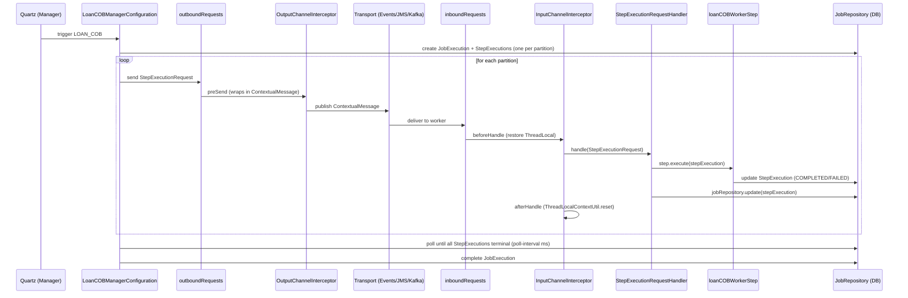

Apache Fineract uses Spring Batch's remote partitioning pattern to distribute large batch workloads (today: Loan COB and Working Capital COB) across one or more JVM processes. A **manager** node divides work into partitions and publishes `StepExecutionRequest` messages; **worker** nodes subscribe, execute their partition step, and write results to the shared Spring Batch `JobRepository` database tables. The same codebase supports three transport modes—Spring Application Events (in-process, default), JMS via Apache ActiveMQ, and Apache Kafka—selected purely by configuration flags. The transport layer is abstracted via Spring Integration channels (`outboundRequests` / `inboundRequests`) so the batch job code in `LoanCOBManagerConfiguration` and `LoanCOBWorkerConfiguration` is transport-agnostic.

## Architecture Overview

```mermaid
graph LR
    subgraph Manager Node
        JB[loanCOBJob] --> PART[LoanCOBPartitioner]
        PART --> RMS[RemotePartitioningManagerStepBuilderFactory]
        RMS --> OC[outboundRequests\nDirectChannel]
        OC --> OI[OutputChannelInterceptor\nwraps in ContextualMessage]
    end

    subgraph Transport
        OI -->|Spring Events| SE[ApplicationEventPublishingMessageHandler]
        OI -->|JMS| JQ[ActiveMQ Queue\njms.request-queue-name]
        OI -->|Kafka| KT[Kafka Topic\nkafka.topic.name]
    end

    subgraph Worker Node
        SE -->|ApplicationEventListeningMessageProducer| IC[inboundRequests\nQueueChannel]
        JQ -->|JmsBatchWorkerMessageListener| SERH[StepExecutionRequestHandler]
        KT -->|KafkaRemoteMessageListener| SERH
        IC --> II[InputChannelInterceptor\nrestores ThreadLocal context]
        II --> SERH
        SERH --> STEP[loanCOBWorkerStep\nRead → Process → Write]
        STEP --> JR[(JobRepository DB)]
    end

    JR --> POLL[Manager polls JobRepository\nuntil all partitions complete]
```



## File Inventory

| File | Package | Role |
|------|---------|------|
| `fineract-provider/…/springbatch/ManagerConfig.java` | `o.a.f.infrastructure.springbatch` | `outboundRequests` `DirectChannel` + `OutputChannelInterceptor` bean; activates when `batch-manager-enabled=true` |
| `fineract-provider/…/springbatch/WorkerConfig.java` | `o.a.f.infrastructure.springbatch` | `inboundRequests` `QueueChannel` + `InputChannelInterceptor` bean; activates when `batch-worker-enabled=true` |
| `fineract-provider/…/springbatch/ContextualMessage.java` | `o.a.f.infrastructure.springbatch` | Serializable envelope: `StepExecutionRequest` + `FineractContext` |
| `fineract-provider/…/springbatch/OutputChannelInterceptor.java` | `o.a.f.infrastructure.springbatch` | Intercepts outbound `StepExecutionRequest`, wraps in `ContextualMessage` |
| `fineract-provider/…/springbatch/InputChannelInterceptor.java` | `o.a.f.infrastructure.springbatch` | Unwraps `ContextualMessage`, restores `ThreadLocalContextUtil` context |
| `fineract-provider/…/springbatch/PropertyServiceImpl.java` | `o.a.f.infrastructure.springbatch` | Reads `fineract.partitioned-job.*` properties per job name |
| `fineract-provider/…/springbatch/messagehandler/MessageHandlerConfig.java` | `o.a.f.infrastructure.springbatch.messagehandler` | Registers `BeanFactoryStepLocator` as `StepLocator`; worker only |
| `fineract-provider/…/springbatch/messagehandler/StepExecutionRequestHandler.java` | `o.a.f.infrastructure.springbatch.messagehandler` | Resolves step by name, calls `step.execute(stepExecution)`, updates `JobRepository` |
| `fineract-provider/…/springbatch/messagehandler/conditions/jms/JmsManagerCondition.java` | `…conditions.jms` | `batch-manager-enabled=true` AND `jms.enabled=true` |
| `fineract-provider/…/springbatch/messagehandler/conditions/jms/JmsWorkerCondition.java` | `…conditions.jms` | `batch-worker-enabled=true` AND `jms.enabled=true` |
| `fineract-provider/…/springbatch/messagehandler/conditions/kafka/KafkaManagerCondition.java` | `…conditions.kafka` | `batch-manager-enabled=true` AND `kafka.enabled=true` |
| `fineract-provider/…/springbatch/messagehandler/conditions/kafka/KafkaWorkerCondition.java` | `…conditions.kafka` | `batch-worker-enabled=true` AND `kafka.enabled=true` |
| `fineract-provider/…/springbatch/messagehandler/conditions/kafka/KafkaRemoteJobTopicAutoCreateCondition.java` | `…conditions.kafka` | Either Kafka manager or worker + `topic.auto-create=true` |
| `fineract-provider/…/springbatch/messagehandler/conditions/spring/SpringEventManagerCondition.java` | `…conditions.spring` | `batch-manager-enabled=true` AND `spring-events.enabled=true` |
| `fineract-provider/…/springbatch/messagehandler/conditions/spring/SpringEventWorkerCondition.java` | `…conditions.spring` | `batch-worker-enabled=true` AND `spring-events.enabled=true` |
| `fineract-provider/…/springbatch/messagehandler/jms/JmsBrokerConfiguration.java` | `…messagehandler.jms` | `ActiveMQConnectionFactory` bean; prefetch=1 |
| `fineract-provider/…/springbatch/messagehandler/jms/JmsManagerConfig.java` | `…messagehandler.jms` | JMS `IntegrationFlow`: `outboundRequests` → `OutputChannelInterceptor` → JMS queue |
| `fineract-provider/…/springbatch/messagehandler/jms/JmsWorkerConfig.java` | `…messagehandler.jms` | `DefaultJmsListenerContainerFactory` (concurrency 1-1) + `DefaultMessageListenerContainer` |
| `fineract-provider/…/springbatch/messagehandler/jms/JmsBatchWorkerMessageListener.java` | `…messagehandler.jms` | JMS `MessageListener`; unwraps `ContextualMessage`, calls `StepExecutionRequestHandler` |
| `fineract-provider/…/springbatch/messagehandler/kafka/KafkaJobTopicConfig.java` | `…messagehandler.kafka` | `KafkaAdmin` + `NewTopic` auto-creation |
| `fineract-provider/…/springbatch/messagehandler/kafka/KafkaManagerConfig.java` | `…messagehandler.kafka` | Kafka `IntegrationFlow`; partition key = `stepExecutionId % topic.partitions` |
| `fineract-provider/…/springbatch/messagehandler/kafka/KafkaWorkerConfig.java` | `…messagehandler.kafka` | `ConcurrentKafkaListenerContainerFactory`; ack mode MANUAL |
| `fineract-provider/…/springbatch/messagehandler/kafka/KafkaRemoteMessageListener.java` | `…messagehandler.kafka` | `@KafkaListener`; unwraps, calls `StepExecutionRequestHandler`, acks |
| `fineract-provider/…/springbatch/messagehandler/spring/SpringEventManagerConfig.java` | `…messagehandler.spring` | Spring Events `IntegrationFlow`: `outboundRequests` → `ApplicationEventPublishingMessageHandler` |
| `fineract-provider/…/springbatch/messagehandler/spring/SpringEventWorkerConfig.java` | `…messagehandler.spring` | `ApplicationEventListeningMessageProducer` → `inboundRequests` → `InputChannelInterceptor` |

## `ManagerConfig` and `WorkerConfig`

### `ManagerConfig` (conditional: `fineract.mode.batch-manager-enabled=true`)

```java
// fineract-provider/…/springbatch/ManagerConfig.java
@Configuration @EnableBatchIntegration
@ConditionalOnProperty(value = "fineract.mode.batch-manager-enabled", havingValue = "true")
public class ManagerConfig {
    @Bean public DirectChannel outboundRequests() { return new DirectChannel(); }
    @Bean public OutputChannelInterceptor outputInterceptor() { return new OutputChannelInterceptor(); }
}
```

`outboundRequests` is a `DirectChannel` (synchronous, single-threaded delivery). The `RemotePartitioningManagerStepBuilderFactory` wires the partitioned step's output to this channel. `OutputChannelInterceptor` intercepts every message before it hits the transport.

### `WorkerConfig` (conditional: `fineract.mode.batch-worker-enabled=true`)

```java
// fineract-provider/…/springbatch/WorkerConfig.java
@Configuration
@ConditionalOnProperty(value = "fineract.mode.batch-worker-enabled", havingValue = "true")
public class WorkerConfig {
    @Bean public QueueChannel inboundRequests() { return new QueueChannel(); }
    @Bean public InputChannelInterceptor inputInterceptor() { return new InputChannelInterceptor(); }
}
```

`inboundRequests` is a `QueueChannel` (buffered). The `RemotePartitioningWorkerStepBuilderFactory` in `LoanCOBWorkerConfiguration` wires this channel as the input for `loanCOBWorkerStep`.

## `ContextualMessage` — The Message Envelope

```java
// fineract-provider/…/springbatch/ContextualMessage.java
@Data
public class ContextualMessage implements Serializable {
    private StepExecutionRequest stepExecutionRequest; // Spring Batch built-in
    private FineractContext context;                    // tenant + action context
}
```

`FineractContext` carries the tenant identifier, timezone, and other thread-local state needed to initialise `ThreadLocalContextUtil` on the worker side. Without it, the worker would have no tenant context and all database operations would fail.

## `OutputChannelInterceptor` — Outbound Wrapping

```java
// fineract-provider/…/springbatch/OutputChannelInterceptor.java
public class OutputChannelInterceptor extends StepExecutionInterceptor {
    @Override
    public Message<?> preSend(Message<?> message, MessageChannel channel) {
        StepExecutionRequest request = (StepExecutionRequest) message.getPayload();
        ContextualMessage cm = new ContextualMessage();
        cm.setStepExecutionRequest(request);
        cm.setContext(ThreadLocalContextUtil.getContext()); // capture current thread context
        return new GenericMessage<>(cm);
    }
}
```

Called by the manager thread. Captures `ThreadLocalContextUtil.getContext()` (which includes the tenant identifier) and packages it with the `StepExecutionRequest` into a `ContextualMessage`.

## `InputChannelInterceptor` — Inbound Context Restoration

```java
// fineract-provider/…/springbatch/InputChannelInterceptor.java
public class InputChannelInterceptor implements ExecutorChannelInterceptor {
    public Message<StepExecutionRequest> beforeHandle(Message<?> message, ...) {
        ContextualMessage cm = (ContextualMessage) message.getPayload();
        ThreadLocalContextUtil.init(cm.getContext());          // restore tenant context
        ThreadLocalContextUtil.setActionContext(ActionContext.COB);
        return new GenericMessage<>(cm.getStepExecutionRequest());
    }
    public void afterMessageHandled(..., Exception ex) {
        ThreadLocalContextUtil.reset();                         // clean up
    }
}
```

Implements `ExecutorChannelInterceptor` so it works both with the synchronous `QueueChannel` and with async executor channels. The `ActionContext.COB` flag is always set, affecting how business events are emitted during step execution.

## `StepExecutionRequestHandler` — Worker Execution Core

```java
// fineract-provider/…/springbatch/messagehandler/StepExecutionRequestHandler.java
@Component
@ConditionalOnProperty(value = "fineract.mode.batch-worker-enabled", havingValue = "true")
public class StepExecutionRequestHandler {
    public void handle(StepExecutionRequest request) {
        StepExecution stepExecution = jobExplorer.getStepExecution(
            request.getJobExecutionId(), request.getStepExecutionId());
        Step step = stepLocator.getStep(request.getStepName());
        try {
            step.execute(stepExecution);
        } catch (JobInterruptedException e) {
            stepExecution.setStatus(BatchStatus.STOPPED);
        } catch (OptimisticLockingFailureException e) {
            // another worker already picked this up — no-op
        } catch (Exception e) {
            stepExecution.setStatus(BatchStatus.FAILED);
        } finally {
            jobRepository.update(stepExecution); // persist final status
        }
    }
}
```

`BeanFactoryStepLocator` (registered by `MessageHandlerConfig`) resolves the step bean by name (e.g. `"loanCOBWorkerStep"`). The `OptimisticLockingFailureException` catch is a safety net for queue-based systems: because a queue delivers a message to exactly one consumer, this should not happen, but it guards against unexpected re-delivery.

## `MessageHandlerConfig` — Worker Step Locator

```java
// fineract-provider/…/springbatch/messagehandler/MessageHandlerConfig.java
@Configuration
@ConditionalOnProperty(value = "fineract.mode.batch-worker-enabled", havingValue = "true")
public class MessageHandlerConfig {
    @Bean
    public StepLocator stepLocator() {
        return new BeanFactoryStepLocator(); // looks up Step beans by name from ApplicationContext
    }
}
```

## Transport Mode Conditions

<Tabs>
  <Tab title="Spring Events (default)">
    ```
    fineract.remote-job-message-handler.spring-events.enabled=true  (default)
    fineract.mode.batch-manager-enabled=true
    fineract.mode.batch-worker-enabled=true
    ```

    **Condition classes**: `SpringEventManagerCondition` (extends `AllNestedConditions`), `SpringEventWorkerCondition`

    **Manager config** (`SpringEventManagerConfig`):
    - `IntegrationFlow`: `outboundRequests` → `outputInterceptor` → `ApplicationEventPublishingMessageHandler`
    - Publishes a Spring `MessagingEvent` to the `ApplicationContext`

    **Worker config** (`SpringEventWorkerConfig`):
    - `ApplicationEventListeningMessageProducer` listens for `MessagingEvent.class`
    - Routes into `inboundRequests` `QueueChannel`
    - `InputChannelInterceptor` is applied in the flow

    Both manager and worker run in the same JVM. This is the default for single-node deployments.
  </Tab>
  <Tab title="JMS / ActiveMQ">
    ```
    fineract.remote-job-message-handler.jms.enabled=true
    fineract.remote-job-message-handler.spring-events.enabled=false
    fineract.mode.batch-manager-enabled=true   # manager node
    fineract.mode.batch-worker-enabled=true    # worker node (can be different process)
    ```

    **Condition classes**: `JmsManagerCondition`, `JmsWorkerCondition`

    **Broker config** (`JmsBrokerConfiguration`):
    - Creates `ActiveMQConnectionFactory` from `broker-url`, optional credentials
    - Sets `ActiveMQPrefetchPolicy.all = 1` — each consumer fetches only 1 message at a time

    **Manager config** (`JmsManagerConfig`):
    - `IntegrationFlow`: `outboundRequests` → `outputInterceptor` → `Jms.outboundAdapter(connectionFactory).destination(requestQueueName)`

    **Worker config** (`JmsWorkerConfig`):
    - `DefaultJmsListenerContainerFactory` with `concurrency="1-1"` (exactly 1 thread), `sessionAcknowledgeMode=CLIENT_ACKNOWLEDGE`, `pubSubDomain=false` (queue, not topic)
    - `JmsBatchWorkerMessageListener`: `MessageListener.onMessage` → `InputChannelInterceptor.beforeHandleMessage` → `StepExecutionRequestHandler.handle` → `message.acknowledge()`

    **Message flow**: Manager → ActiveMQ queue → `JmsBatchWorkerMessageListener` on worker node.
  </Tab>
  <Tab title="Kafka">
    ```
    fineract.remote-job-message-handler.kafka.enabled=true
    fineract.remote-job-message-handler.spring-events.enabled=false
    fineract.mode.batch-manager-enabled=true   # manager node
    fineract.mode.batch-worker-enabled=true    # worker node
    ```

    **Condition classes**: `KafkaManagerCondition`, `KafkaWorkerCondition`, `KafkaRemoteJobTopicAutoCreateCondition`

    **Topic config** (`KafkaJobTopicConfig`):
    - Creates `KafkaAdmin` and `NewTopic` with name/partitions/replicas from properties
    - Conditional on `KafkaRemoteJobTopicAutoCreateCondition` (either manager or worker + `topic.auto-create=true`)

    **Manager config** (`KafkaManagerConfig`):
    - `ProducerFactory` with `JsonSerializer` for values
    - `KafkaProducerMessageHandler` routing: partition = `stepExecutionId % topic.partitions` (sticky partition-per-execution for ordering)
    - `IntegrationFlow`: `outboundRequests` → `outputInterceptor` → `KafkaProducerMessageHandler`

    **Worker config** (`KafkaWorkerConfig`):
    - `ConsumerFactory` with `JsonDeserializer`, `TRUSTED_PACKAGES="*"`, `AUTO_OFFSET_RESET=earliest`
    - `ConcurrentKafkaListenerContainerFactory` with `AckMode.MANUAL`

    **Worker listener** (`KafkaRemoteMessageListener`):
    ```java
    @KafkaListener(topics = "${fineract.remote-job-message-handler.kafka.topic.name}")
    public void onMessage(@Payload ContextualMessage contextualMessage, Acknowledgment acknowledgment) {
        try {
            StepExecutionRequest req = inputInterceptor.beforeHandleMessage(contextualMessage);
            stepExecutionRequestHandler.handle(req);
        } catch (Exception e) {
            log.error("Exception while processing Kafka message", e);
        } finally {
            inputInterceptor.afterHandleMessage(); // resets ThreadLocalContextUtil
        }
        acknowledgment.acknowledge();
    }
    ```
  </Tab>
</Tabs>

## All `fineract.remote-job-message-handler.*` Properties

| Property | Env Variable | Default | Description |
|----------|-------------|---------|-------------|
| `fineract.mode.batch-manager-enabled` | `FINERACT_MODE_BATCH_MANAGER_ENABLED` | `true` | Enable manager-side beans |
| `fineract.mode.batch-worker-enabled` | `FINERACT_MODE_BATCH_WORKER_ENABLED` | `true` | Enable worker-side beans |
| `fineract.remote-job-message-handler.spring-events.enabled` | `FINERACT_REMOTE_JOB_MESSAGE_HANDLER_SPRING_EVENTS_ENABLED` | `true` | Use in-process Spring Events |
| `fineract.remote-job-message-handler.jms.enabled` | `FINERACT_REMOTE_JOB_MESSAGE_HANDLER_JMS_ENABLED` | `false` | Use ActiveMQ JMS |
| `fineract.remote-job-message-handler.jms.request-queue-name` | `FINERACT_REMOTE_JOB_MESSAGE_HANDLER_JMS_QUEUE_NAME` | `JMS-request-queue` | JMS queue name |
| `fineract.remote-job-message-handler.jms.broker-url` | `FINERACT_REMOTE_JOB_MESSAGE_HANDLER_JMS_BROKER_URL` | `tcp://127.0.0.1:61616` | ActiveMQ broker URL |
| `fineract.remote-job-message-handler.jms.broker-username` | `FINERACT_REMOTE_JOB_MESSAGE_HANDLER_JMS_BROKER_USERNAME` | `""` | ActiveMQ username (empty = no auth) |
| `fineract.remote-job-message-handler.jms.broker-password` | `FINERACT_REMOTE_JOB_MESSAGE_HANDLER_JMS_BROKER_PASSWORD` | `""` | ActiveMQ password |
| `fineract.remote-job-message-handler.kafka.enabled` | `FINERACT_REMOTE_JOB_MESSAGE_HANDLER_KAFKA_ENABLED` | `false` | Use Kafka |
| `fineract.remote-job-message-handler.kafka.topic.auto-create` | `FINERACT_REMOTE_JOB_MESSAGE_HANDLER_KAFKA_TOPIC_AUTO_CREATE` | `true` | Auto-create Kafka topic |
| `fineract.remote-job-message-handler.kafka.topic.name` | `FINERACT_REMOTE_JOB_MESSAGE_HANDLER_KAFKA_TOPIC_NAME` | `job-topic` | Kafka topic name |
| `fineract.remote-job-message-handler.kafka.topic.replicas` | `FINERACT_REMOTE_JOB_MESSAGE_HANDLER_KAFKA_TOPIC_REPLICAS` | `1` | Kafka topic replication factor |
| `fineract.remote-job-message-handler.kafka.topic.partitions` | `FINERACT_REMOTE_JOB_MESSAGE_HANDLER_KAFKA_TOPIC_PARTITIONS` | `10` | Kafka topic partition count (affects max parallelism) |
| `fineract.remote-job-message-handler.kafka.bootstrap-servers` | `FINERACT_REMOTE_JOB_MESSAGE_HANDLER_KAFKA_BOOTSTRAP_SERVERS` | `localhost:9092` | Kafka bootstrap servers |
| `fineract.remote-job-message-handler.kafka.consumer.group-id` | `FINERACT_REMOTE_JOB_MESSAGE_HANDLER_KAFKA_CONSUMER_GROUPID` | `fineract-consumer-group-id` | Kafka consumer group |
| `fineract.remote-job-message-handler.kafka.consumer.extra-properties` | `FINERACT_REMOTE_JOB_MESSAGE_HANDLER_KAFKA_CONSUMER_EXTRA_PROPERTIES` | `""` | Pipe-separated `key=value` extra consumer props |
| `fineract.remote-job-message-handler.kafka.consumer.extra-properties-separator` | `FINERACT_REMOTE_JOB_MESSAGE_HANDLER_KAFKA_CONSUMER_EXTRA_PROPERTIES_SEPARATOR` | `\|` | Item separator for consumer extra props |
| `fineract.remote-job-message-handler.kafka.consumer.extra-properties-key-value-separator` | `FINERACT_REMOTE_JOB_MESSAGE_HANDLER_KAFKA_CONSUMER_EXTRA_PROPERTIES_KEY_VALUE_SEPARATOR` | `=` | Key/value separator for consumer extra props |
| `fineract.remote-job-message-handler.kafka.producer.extra-properties` | `FINERACT_REMOTE_JOB_MESSAGE_HANDLER_KAFKA_PRODUCER_EXTRA_PROPERTIES` | `""` | Pipe-separated `key=value` extra producer props |
| `fineract.remote-job-message-handler.kafka.producer.extra-properties-separator` | `FINERACT_REMOTE_JOB_MESSAGE_HANDLER_KAFKA_PRODUCER_EXTRA_PROPERTIES_SEPARATOR` | `\|` | Item separator for producer extra props |
| `fineract.remote-job-message-handler.kafka.producer.extra-properties-key-value-separator` | `FINERACT_REMOTE_JOB_MESSAGE_HANDLER_KAFKA_PRODUCER_EXTRA_PROPERTIES_KEY_VALUE_SEPARATOR` | `=` | Key/value separator for producer extra props |
| `fineract.remote-job-message-handler.kafka.admin.extra-properties` | `FINERACT_REMOTE_JOB_MESSAGE_HANDLER_KAFKA_ADMIN_EXTRA_PROPERTIES` | `""` | Pipe-separated `key=value` extra admin props |
| `fineract.remote-job-message-handler.kafka.admin.extra-properties-separator` | `FINERACT_REMOTE_JOB_MESSAGE_HANDLER_KAFKA_ADMIN_EXTRA_PROPERTIES_SEPARATOR` | `\|` | Item separator for admin extra props |
| `fineract.remote-job-message-handler.kafka.admin.extra-properties-key-value-separator` | `FINERACT_REMOTE_JOB_MESSAGE_HANDLER_KAFKA_ADMIN_EXTRA_PROPERTIES_KEY_VALUE_SEPARATOR` | `=` | Key/value separator for admin extra props |

## Partitioned Job Tuning Properties

Configured per job in `fineract.partitioned-job.partitioned-job-properties[]`. Currently only `LOAN_COB` is registered:

```properties
# application.properties
fineract.partitioned-job.partitioned-job-properties[0].job-name=LOAN_COB
fineract.partitioned-job.partitioned-job-properties[0].chunk-size=${LOAN_COB_CHUNK_SIZE:100}
fineract.partitioned-job.partitioned-job-properties[0].partition-size=${LOAN_COB_PARTITION_SIZE:100}
fineract.partitioned-job.partitioned-job-properties[0].thread-pool-core-pool-size=${LOAN_COB_THREAD_POOL_CORE_POOL_SIZE:5}
fineract.partitioned-job.partitioned-job-properties[0].thread-pool-max-pool-size=${LOAN_COB_THREAD_POOL_MAX_POOL_SIZE:5}
fineract.partitioned-job.partitioned-job-properties[0].thread-pool-queue-capacity=${LOAN_COB_THREAD_POOL_QUEUE_CAPACITY:20}
fineract.partitioned-job.partitioned-job-properties[0].retry-limit=${LOAN_COB_RETRY_LIMIT:5}
fineract.partitioned-job.partitioned-job-properties[0].poll-interval=${LOAN_COB_POLL_INTERVAL:500}
```

`PropertyServiceImpl` implements `PropertyService` and reads these via `FineractProperties.PartitionedJobProperty`:

| Property field | Env Variable | Default | Used By |
|----------------|-------------|---------|---------|
| `chunk-size` | `LOAN_COB_CHUNK_SIZE` | 100 | `LoanCOBWorkerConfiguration` chunk size |
| `partition-size` | `LOAN_COB_PARTITION_SIZE` | 100 | `LoanCOBPartitioner` — max loans per partition |
| `thread-pool-core-pool-size` | `LOAN_COB_THREAD_POOL_CORE_POOL_SIZE` | 5 | `cobTaskExecutor` core threads |
| `thread-pool-max-pool-size` | `LOAN_COB_THREAD_POOL_MAX_POOL_SIZE` | 5 | `cobTaskExecutor` max threads; >1 enables parallel chunk processing |
| `thread-pool-queue-capacity` | `LOAN_COB_THREAD_POOL_QUEUE_CAPACITY` | 20 | `cobTaskExecutor` task queue depth |
| `retry-limit` | `LOAN_COB_RETRY_LIMIT` | 5 | Spring Batch fault-tolerant retry count per item |
| `poll-interval` | `LOAN_COB_POLL_INTERVAL` | 500 | Manager polling interval (ms) waiting for partitions to complete |

## How to Run in Distributed Mode

<Steps>
  <Step title="Choose transport">
    Pick JMS or Kafka. For JMS, deploy ActiveMQ. For Kafka, deploy a Kafka cluster. Set `spring-events.enabled=false` and enable the chosen transport.
  </Step>
  <Step title="Configure manager node(s)">
    ```properties
    fineract.mode.batch-manager-enabled=true
    fineract.mode.batch-worker-enabled=false
    fineract.remote-job-message-handler.spring-events.enabled=false
    fineract.remote-job-message-handler.jms.enabled=true
    fineract.remote-job-message-handler.jms.broker-url=tcp://activemq-host:61616
    fineract.remote-job-message-handler.jms.request-queue-name=fineract-cob-queue
    ```
    The manager node handles Quartz triggers, the scheduler API, and partitioning. It does NOT process loan chunks.
  </Step>
  <Step title="Configure worker node(s)">
    ```properties
    fineract.mode.batch-manager-enabled=false
    fineract.mode.batch-worker-enabled=true
    fineract.remote-job-message-handler.spring-events.enabled=false
    fineract.remote-job-message-handler.jms.enabled=true
    fineract.remote-job-message-handler.jms.broker-url=tcp://activemq-host:61616
    fineract.remote-job-message-handler.jms.request-queue-name=fineract-cob-queue
    ```
    Workers have no Quartz scheduler or job API. They listen to the queue and execute partition steps.
  </Step>
  <Step title="Shared database">
    Both manager and worker nodes must connect to the same MySQL/MariaDB/PostgreSQL database. Spring Batch uses `BATCH_JOB_EXECUTION`, `BATCH_STEP_EXECUTION`, and related tables as the coordination backbone. The manager polls `BATCH_STEP_EXECUTION` status to detect partition completion.
  </Step>
  <Step title="Scale workers">
    Add more worker nodes with the same configuration. For JMS, the queue ensures each partition is processed by exactly one worker. For Kafka, the `group-id` achieves the same: each consumer group member gets a subset of partitions.
  </Step>
</Steps>

<Note>
In the default (`spring-events.enabled=true`) configuration, both `batch-manager-enabled` and `batch-worker-enabled` must be `true` on the same node. The Spring Events transport is **in-process only** — it cannot cross JVM boundaries.
</Note>

## Partitioned Job Execution Diagram



## Gotchas & Invariants

<Warning>
Only one transport can be active at a time. If both `jms.enabled=true` and `kafka.enabled=true` are set simultaneously, both `JmsManagerCondition` and `KafkaManagerCondition` will be true, resulting in two competing `IntegrationFlow` beans both wired to `outboundRequests`. This causes a `BeanCreationException` at startup. Always keep exactly one transport enabled.
</Warning>

<Warning>
With `spring-events.enabled=true` (default), manager and worker **must run in the same JVM**. If `batch-worker-enabled=false` on the manager node, no one will consume the Spring events and the partitioned step will hang until the `poll-interval` timeout is exhausted.
</Warning>

- `JmsWorkerConfig` sets `concurrency="1-1"` (one listener thread). To process partitions concurrently on a single worker node, deploy multiple worker processes or increase the thread pool via `LOAN_COB_THREAD_POOL_MAX_POOL_SIZE`.
- The Kafka partition assignment is `stepExecutionId % topic.partitions`. All step executions for the same job run will distribute across topic partitions. With `consumer.group-id` default `fineract-consumer-group-id`, all workers must use the same group.
- `OutputChannelInterceptor extends StepExecutionInterceptor` (Spring Batch Integration). The `preSend` method is called in the **manager's** thread where `ThreadLocalContextUtil` holds the tenant context.
- `InputChannelInterceptor.afterMessageHandled` is called by `ExecutorChannelInterceptor` machinery even if the handler threw an exception, ensuring `ThreadLocalContextUtil.reset()` always fires.
- `Jackson2ExecutionContextStringSerializer` must be consistent across manager and worker nodes — both must have the same Jackson classpath version or deserialization will fail when reading `ExecutionContext` from `BATCH_STEP_EXECUTION_CONTEXT`.
- `fineract.partitioned-job.partitioned-job-properties` is a Spring Boot configuration list. Adding a new partitioned job requires appending a new entry at index `[N]` in `application.properties`.
