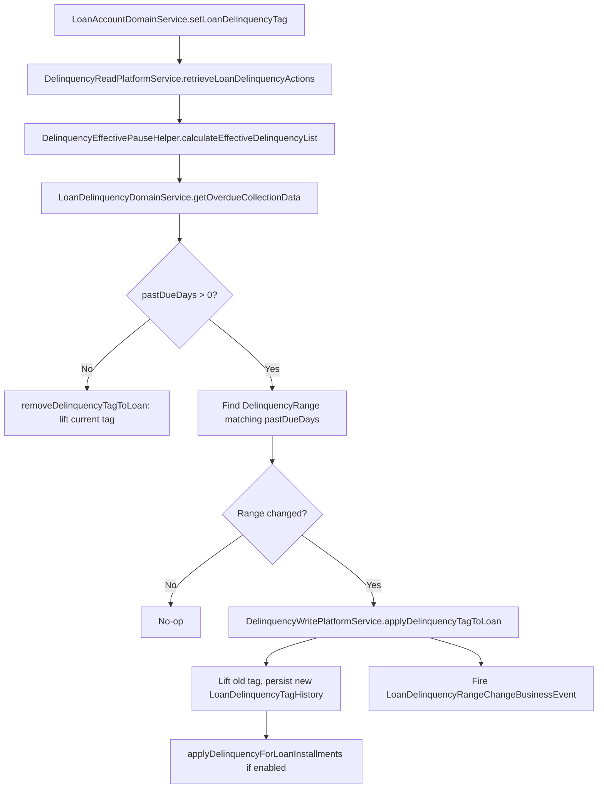

Apache Fineract's delinquency subsystem classifies overdue loans into configurable buckets based on how many days past due the oldest unpaid installment is. The system is driven nightly by a COB business step (`SetLoanDelinquencyTagsBusinessStep`) and can also be updated immediately whenever a transaction is posted. Operators configure `DelinquencyRange` records (minimum–maximum age in days) and group them into `DelinquencyBucket` containers; each `LoanProduct` optionally references a bucket. When a loan enters or leaves a delinquency range, a `LoanDelinquencyRangeChangeBusinessEvent` is published as an Avro message. Pause and resume actions (`LoanDelinquencyAction`) let operations teams freeze the day-counting logic for a specific date window.

---

## File Inventory

| File | Path | Role |
|---|---|---|
| `DelinquencyRange.java` | `fineract-core/.../delinquency/domain/DelinquencyRange.java` | Entity: `m_delinquency_range` — one age bracket |
| `DelinquencyBucket.java` | `fineract-core/.../delinquency/domain/DelinquencyBucket.java` | Entity: `m_delinquency_bucket` — ordered collection of ranges |
| `DelinquencyBucketMappings.java` | `fineract-loan/.../delinquency/domain/DelinquencyBucketMappings.java` | Join table entity: `m_delinquency_bucket_mappings` |
| `LoanDelinquencyTagHistory.java` | `fineract-loan/.../delinquency/domain/LoanDelinquencyTagHistory.java` | Entity: `m_loan_delinquency_tag_history` — audit log of range assignments |
| `LoanInstallmentDelinquencyTag.java` | `fineract-loan/.../delinquency/domain/LoanInstallmentDelinquencyTag.java` | Entity: per-installment delinquency tags |
| `LoanDelinquencyAction.java` | `fineract-loan/.../delinquency/domain/LoanDelinquencyAction.java` | Entity: `m_loan_delinquency_action` — pause/resume actions |
| `DelinquencyAction.java` | `fineract-loan/.../delinquency/domain/DelinquencyAction.java` | Enum: `PAUSE`, `RESUME`, `RESCHEDULE` |
| `DelinquencyApiResource.java` | `fineract-loan/.../delinquency/api/DelinquencyApiResource.java` | REST: `@Path("/v1/delinquency")` |
| `DelinquencyWritePlatformService.java` | `fineract-loan/.../delinquency/service/DelinquencyWritePlatformService.java` | Write service interface |
| `DelinquencyWritePlatformServiceImpl.java` | `fineract-loan/.../delinquency/service/DelinquencyWritePlatformServiceImpl.java` | JPA implementation |
| `LoanDelinquencyDomainService.java` | `fineract-loan/.../delinquency/service/LoanDelinquencyDomainService.java` | Domain service: `getOverdueCollectionData()`, `getLoanDelinquencyData()` |
| `LoanDelinquencyDomainServiceImpl.java` | `fineract-loan/.../delinquency/service/LoanDelinquencyDomainServiceImpl.java` | Implementation |
| `DelinquencyReadPlatformService.java` | `fineract-loan/.../delinquency/service/DelinquencyReadPlatformService.java` | Read service |
| `DelinquencyEffectivePauseHelper.java` | `fineract-loan/.../delinquency/helper/DelinquencyEffectivePauseHelper.java` | Computes effective pause windows from action list |
| `DelinquencyEffectivePauseHelperImpl.java` | `fineract-loan/.../delinquency/helper/DelinquencyEffectivePauseHelperImpl.java` | Implementation |
| `InstallmentDelinquencyAggregator.java` | `fineract-loan/.../delinquency/helper/InstallmentDelinquencyAggregator.java` | Aggregates installment-level delinquency data |
| `SetLoanDelinquencyTagsBusinessStep.java` | `fineract-provider/src/main/java/org/apache/fineract/cob/loan/SetLoanDelinquencyTagsBusinessStep.java` | COB step: classifies loans each night |
| `DelinquencyBucketDataV1.avsc` | `fineract-avro-schemas/src/main/avro/loan/v1/DelinquencyBucketDataV1.avsc` | Avro schema for bucket events |
| `LoanAccountDelinquencyRangeDataV1.avsc` | `fineract-avro-schemas/src/main/avro/loan/v1/LoanAccountDelinquencyRangeDataV1.avsc` | Avro schema for loan-level range change events |
| `LoanInstallmentDelinquencyBucketDataV1.avsc` | `fineract-avro-schemas/src/main/avro/loan/v1/LoanInstallmentDelinquencyBucketDataV1.avsc` | Avro schema for installment-level bucket data |

---

## Core Domain Entities

### DelinquencyRange

Entity: `fineract-core/.../delinquency/domain/DelinquencyRange.java`. Table: `m_delinquency_range`.

| Field | DB Column | Description |
|---|---|---|
| `id` | `id` | Auto-generated PK |
| `classification` | `classification` | Human label (e.g., "30 DPD – 60 DPD") — unique |
| `minimumAgeDays` | `min_age_days` | Inclusive lower bound in days past due |
| `maximumAgeDays` | `max_age_days` | Inclusive upper bound (null = unbounded, i.e., "90+ DPD") |

Factory method: `DelinquencyRange.instance(classification, minimumAge, maximumAge)`.

<Note>
Overlapping `min_age_days`/`max_age_days` ranges within the same bucket are rejected by `DelinquencyBucketAgesOverlapedException` during creation.
</Note>

### DelinquencyBucket

Entity: `fineract-core/.../delinquency/domain/DelinquencyBucket.java`. Table: `m_delinquency_bucket`.

| Field | DB Column | Description |
|---|---|---|
| `id` | `id` | Auto-generated PK |
| `name` | `name` | Unique bucket name |
| `ranges` | _(join table)_ | `List<DelinquencyRange>` via `m_delinquency_bucket_mappings` |
| `bucketType` | `bucket_type` | `DelinquencyBucketType` enum (if configured) |

A bucket is a **named ordered set** of ranges. A `LoanProduct` references at most one `DelinquencyBucket` (FK `delinquency_bucket_id` on `m_product_loan`).

### LoanDelinquencyTagHistory

Entity: `fineract-loan/.../delinquency/domain/LoanDelinquencyTagHistory.java`. Table: `m_loan_delinquency_tag_history`.

| Field | DB Column | Description |
|---|---|---|
| `delinquencyRange` | `delinquency_range_id` | The range this tag refers to |
| `loan` | `loan_id` | The loan being tagged |
| `addedOnDate` | `addedon_date` | When the tag was applied |
| `liftedOnDate` | `liftedon_date` | When the tag was removed (null = still active) |

<Tip>
The current active tag is the row where `liftedon_date IS NULL`. History rows (where `liftedon_date IS NOT NULL`) provide a complete audit trail of how a loan moved through delinquency ranges over time.
</Tip>

### LoanInstallmentDelinquencyTag

Entity: `fineract-loan/.../delinquency/domain/LoanInstallmentDelinquencyTag.java`. Tracks delinquency at the **installment** level when `LoanProduct.enableInstallmentLevelDelinquency = true`.

---

## DelinquencyAction Enum

File: `fineract-loan/.../delinquency/domain/DelinquencyAction.java`.

| Constant | Description |
|---|---|
| `PAUSE` | Freeze day-counting for the action's `startDate–endDate` window |
| `RESUME` | Explicitly end a pause before its `endDate` |
| `RESCHEDULE` | Action associated with a loan rescheduling event |

### LoanDelinquencyAction Entity

Table: `m_loan_delinquency_action`. Class: `fineract-loan/.../delinquency/domain/LoanDelinquencyAction.java`.

| Field | DB Column | Description |
|---|---|---|
| `loan` | `loan_id` | Loan reference |
| `action` | `action` | `DelinquencyAction` enum (stored as STRING) |
| `startDate` | `start_date` | Inclusive start date of the action |
| `endDate` | `end_date` | Inclusive end date (null for `RESUME`) |

---

## Classification Logic

### DelinquencyWritePlatformService

Interface: `fineract-loan/.../delinquency/service/DelinquencyWritePlatformService.java`.

| Method | Description |
|---|---|
| `createDelinquencyRange(JsonCommand)` | Creates a new `DelinquencyRange` |
| `updateDelinquencyRange(Long, JsonCommand)` | Updates an existing range |
| `deleteDelinquencyRange(Long, JsonCommand)` | Deletes a range (validates no active bucket references it) |
| `createDelinquencyBucket(JsonCommand)` | Creates a new `DelinquencyBucket` with ranges |
| `updateDelinquencyBucket(Long, JsonCommand)` | Updates bucket name and/or range list |
| `deleteDelinquencyBucket(Long, JsonCommand)` | Deletes bucket (validated by `DelinquencyBucketUsageChecker` SPI) |
| `applyDelinquencyTagToLoan(Long, JsonCommand)` | Manually applies a tag (used by `LoanAccountDomainService`) |
| `applyDelinquencyTagToLoan(LoanScheduleDelinquencyData, List<LoanDelinquencyActionData>)` | Called from COB step |
| `calculateDelinquencyData(LoanScheduleDelinquencyData, List<LoanDelinquencyActionData>)` | Computes collection data without persisting |
| `removeDelinquencyTagToLoan(Loan)` | Lifts the active tag (sets `liftedOnDate`) |
| `cleanLoanDelinquencyTags(Loan)` | Removes all tag history for a loan (e.g., on disbursement undo) |
| `createDelinquencyAction(Long, JsonCommand)` | Creates a pause/resume action |

### LoanDelinquencyDomainService

Interface: `fineract-loan/.../delinquency/service/LoanDelinquencyDomainService.java`.

| Method | Description |
|---|---|
| `getOverdueCollectionData(Loan, List<LoanDelinquencyActionData>)` | Returns `CollectionData` with `overdueSinceDate`, `pastDueDays`, `delinquentAmount` |
| `getLoanDelinquencyData(Loan, List<LoanDelinquencyActionData>)` | Returns full `LoanDelinquencyData` including installment-level data |

The implementation in `LoanDelinquencyDomainServiceImpl` computes the number of days past due by finding the earliest unpaid installment's due date and counting calendar days from it, excluding any active pause windows provided in `effectiveDelinquencyList`.

### How Bucket Classification Works



---

## COB Business Step: SetLoanDelinquencyTagsBusinessStep

Class: `fineract-provider/src/main/java/org/apache/fineract/cob/loan/SetLoanDelinquencyTagsBusinessStep.java`.

| Property | Value |
|---|---|
| `getEnumStyledName()` | `LOAN_DELINQUENCY_CLASSIFICATION` |
| `getHumanReadableName()` | `Loan Delinquency Classification` |
| Spring component | `@Component` |

**Execution flow:**

1. Receives a `Loan` from the COB item processor.
2. Calls `DelinquencyReadPlatformService.retrieveLoanDelinquencyActions(loanId)` to fetch all saved actions.
3. Calls `DelinquencyEffectivePauseHelper.calculateEffectiveDelinquencyList(savedDelinquencyList)` to compute which pauses are currently active.
4. Switches `ThreadLocalContextUtil` action context to `DEFAULT` (current business date) so that due-date comparisons use today's date, not the COB processing date.
5. Calls `LoanAccountDomainService.setLoanDelinquencyTag(loan, transactionDate, effectiveDelinquencyList)`.
6. On range change, fires `LoanDelinquencyRangeChangeBusinessEvent` for Avro publication.

---

## REST API Endpoints

All endpoints are under `DelinquencyApiResource` at `@Path("/v1/delinquency")`.

### Ranges

| Method | Path | Description |
|---|---|---|
| `GET` | `/v1/delinquency/ranges` | List all ranges |
| `GET` | `/v1/delinquency/ranges/{delinquencyRangeId}` | Get single range |
| `POST` | `/v1/delinquency/ranges` | Create range; body: `DelinquencyRangeRequest` |
| `PUT` | `/v1/delinquency/ranges/{delinquencyRangeId}` | Update range |
| `DELETE` | `/v1/delinquency/ranges/{delinquencyRangeId}` | Delete range |

### Buckets

| Method | Path | Description |
|---|---|---|
| `GET` | `/v1/delinquency/buckets` | List all buckets |
| `GET` | `/v1/delinquency/buckets/{delinquencyBucketId}` | Get single bucket |
| `GET` | `/v1/delinquency/buckets/template` | Template: returns all ranges for selection |
| `POST` | `/v1/delinquency/buckets` | Create bucket; body: `DelinquencyBucketRequest` |
| `PUT` | `/v1/delinquency/buckets/{delinquencyBucketId}` | Update bucket |
| `DELETE` | `/v1/delinquency/buckets/{delinquencyBucketId}` | Delete bucket |

### Loan-level tags and actions

| Method | Path | Resource class | Description |
|---|---|---|---|
| `GET` | `/v1/loans/{loanId}/delinquencytags` | `LoansApiResource` | Tag history for a loan |
| `POST` | `/v1/loans/{loanId}/delinquency/actions` | (inline in `LoansApiResource`) | Create a PAUSE / RESUME action |

---

## Avro Schemas

### DelinquencyBucketDataV1.avsc

Path: `fineract-avro-schemas/src/main/avro/loan/v1/DelinquencyBucketDataV1.avsc`

```json
{
  "name": "DelinquencyBucketDataV1",
  "namespace": "org.apache.fineract.avro.loan.v1",
  "type": "record",
  "fields": [
    { "name": "id",     "type": ["null", "long"],   "default": null },
    { "name": "name",   "type": ["null", "string"], "default": null },
    { "name": "ranges", "type": ["null", {"type": "array", "items": "DelinquencyRangeDataV1"}], "default": null }
  ]
}
```

### LoanAccountDelinquencyRangeDataV1.avsc

Path: `fineract-avro-schemas/src/main/avro/loan/v1/LoanAccountDelinquencyRangeDataV1.avsc`

Key fields in this event schema:

| Avro Field | Type | Description |
|---|---|---|
| `loanId` | `long` | Loan primary key |
| `loanAccountNo` | `string` | Human-readable account number |
| `loanExternalId` | `["null","string"]` | Optional external ID |
| `delinquencyRange` | `["null", DelinquencyRangeDataV1]` | The new range (null if no longer delinquent) |
| `charges` | `array<LoanChargeDataRangeViewV1>` | Outstanding charges |
| `currency` | `CurrencyDataV1` | Loan currency |
| `amount` | `LoanAmountDataV1` | Total/principal/interest/fee/penalty summaries |
| `delinquentDate` | `["null","string"]` | Date delinquency started |
| `installmentDelinquencyBuckets` | `["null", array<LoanInstallmentDelinquencyBucketDataV1>]` | Per-installment data |
| `customData` | `["null", map<bytes>]` | Extension map |
| `originators` | `["null", array<OriginatorDetailsV1>]` | Source systems |

### LoanInstallmentDelinquencyBucketDataV1.avsc

Path: `fineract-avro-schemas/src/main/avro/loan/v1/LoanInstallmentDelinquencyBucketDataV1.avsc`

| Avro Field | Type | Description |
|---|---|---|
| `delinquencyRange` | `["null", DelinquencyRangeDataV1]` | Range assigned to this installment |
| `amount` | `LoanAmountDataV1` | Installment amount breakdown |
| `charges` | `array<LoanChargeDataRangeViewV1>` | Charges on this installment |
| `currency` | `CurrencyDataV1` | Currency |

This schema is embedded inside `LoanAccountDelinquencyRangeDataV1.avsc` as the `installmentDelinquencyBuckets` array when `enableInstallmentLevelDelinquency = true` on the product.

---

## Pause / Resume Mechanics

<Steps>
  <Step title="Create a PAUSE action">
    `POST /v1/loans/{loanId}/delinquency/actions` with `{ "action": "PAUSE", "startDate": "2024-01-01", "endDate": "2024-01-31" }`. This calls `DelinquencyWritePlatformService.createDelinquencyAction(loanId, command)` which persists a `LoanDelinquencyAction` row validated by `DelinquencyActionParseAndValidator`.
  </Step>
  <Step title="Validation">
    `DelinquencyActionParseAndValidator` enforces: pause `startDate` must be ≤ `endDate`; `endDate` must be in the future; a new `PAUSE` cannot overlap an existing active pause. `RESUME` requires an active pause to end.
  </Step>
  <Step title="Effective list calculation">
    On every classification run, `DelinquencyEffectivePauseHelper.calculateEffectiveDelinquencyList(List<LoanDelinquencyAction>)` processes the full action list in date order and outputs `List<LoanDelinquencyActionData>` representing the merged, non-overlapping pause windows that are currently effective.
  </Step>
  <Step title="Day-count adjustment">
    `LoanDelinquencyDomainServiceImpl.getOverdueCollectionData()` subtracts pause-window days from the raw past-due day count before matching against range thresholds.
  </Step>
</Steps>

---

## Connections

<CardGroup cols={2}>
  <Card title="Inbound" icon="arrow-right">
    - `SetLoanDelinquencyTagsBusinessStep` (COB) — nightly classification
    - `LoanAccountDomainService.setLoanDelinquencyTag()` — on every transaction
    - `DelinquencyApiResource` — REST create/update/delete of ranges and buckets
  </Card>
  <Card title="Outbound" icon="arrow-left">
    - `LoanProduct.delinquencyBucket` — product references bucket
    - `LoanDelinquencyTagHistoryRepository` — persists tag history
    - `LoanInstallmentDelinquencyTagRepository` — persists installment tags
    - `BusinessEventNotifierService` — publishes `LoanDelinquencyRangeChangeBusinessEvent`
    - Avro schemas → Kafka/external consumers
  </Card>
</CardGroup>

---

## Gotchas & Invariants

<Warning>
`SetLoanDelinquencyTagsBusinessStep.execute()` temporarily sets `ThreadLocalContextUtil` action context to `DEFAULT` to use the current business date. If this step throws, the context may not be reset. The COB framework's error handling wraps each step in a try-catch, but always verify `ActionContext` in integration tests.
</Warning>

<Warning>
Deleting a `DelinquencyRange` that is still referenced by a `DelinquencyBucket` throws `DelinquencyRangeNotFoundException`. Deleting a `DelinquencyBucket` that is still assigned to a `LoanProduct` is blocked by the `DelinquencyBucketUsageChecker` SPI — implement this SPI to add custom usage checks.
</Warning>

<Note>
`LoanDelinquencyTagHistory` uses `addedon_date` / `liftedon_date` with nullable `liftedon_date`. The **current** active tag is identified by `liftedon_date IS NULL AND loan_id = ?`. There will always be at most one active tag per loan.
</Note>

<Note>
Installment-level delinquency (via `LoanInstallmentDelinquencyTag`) is only computed when `LoanProduct.enableInstallmentLevelDelinquency = true`. The `InstallmentDelinquencyAggregator` helper in `fineract-loan/.../delinquency/helper/` aggregates individual installment overdue amounts into the `LoanInstallmentDelinquencyBucketDataV1` event payload.
</Note>

<Tip>
The `DelinquencyBucketTemplateResponse` from `GET /v1/delinquency/buckets/template` returns the full list of available `DelinquencyRange` objects so UIs can populate a range-picker without a separate API call.
</Tip>
