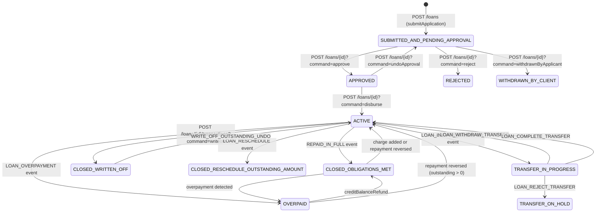

The loan account is the central domain object in Apache Fineract. It orchestrates the full lifecycle of credit from submission through disbursement to closure, and is modelled by `Loan.java` — a JPA entity persisted in `m_loan` — together with a rich graph of subordinate entities for repayment schedules, transactions, charges, and collateral. Every code path that reads or mutates a loan flows through a narrow set of service interfaces (`LoanApplicationWritePlatformService`, `LoanWritePlatformService`, `LoanAccountDomainService`) and is gated by a finite-state machine (`DefaultLoanLifecycleStateMachine`) that rejects illegal transitions at runtime.

---

## File Inventory

| File | Path | Role |
|---|---|---|
| `Loan.java` | `fineract-loan/src/main/java/org/apache/fineract/portfolio/loanaccount/domain/Loan.java` | Aggregate root for a loan account; persisted in `m_loan` |
| `LoanStatus.java` | `fineract-core/src/main/java/org/apache/fineract/portfolio/loanaccount/domain/LoanStatus.java` | Enum of all lifecycle states |
| `LoanEvent.java` | `fineract-loan/.../domain/LoanEvent.java` | Enum of all FSM trigger events |
| `DefaultLoanLifecycleStateMachine.java` | `fineract-loan/.../domain/DefaultLoanLifecycleStateMachine.java` | Enforces valid state transitions; fires `LoanStatusChangedBusinessEvent` |
| `LoanLifecycleStateMachine.java` | `fineract-loan/.../domain/LoanLifecycleStateMachine.java` | Interface for the FSM |
| `LoanTransaction.java` | `fineract-loan/.../domain/LoanTransaction.java` | Every monetary event against a loan; persisted in `m_loan_transaction` |
| `LoanRepaymentScheduleInstallment.java` | `fineract-loan/.../domain/LoanRepaymentScheduleInstallment.java` | One row of the amortisation schedule; `m_loan_repayment_schedule` |
| `LoanAssembler.java` | `fineract-loan/.../service/LoanAssembler.java` | Interface: builds `Loan` objects from JSON commands or account IDs |
| `LoanApplicationWritePlatformService.java` | `fineract-loan/.../service/LoanApplicationWritePlatformService.java` | Pre-disbursement: submit, approve, reject, withdraw |
| `LoanWritePlatformService.java` | `fineract-loan/.../service/LoanWritePlatformService.java` | Post-disbursement: disburse, repay, write-off, close, etc. |
| `LoanAccountDomainService.java` | `fineract-loan/.../domain/LoanAccountDomainService.java` | Fine-grained domain ops; makeRepayment, setDelinquencyTag, etc. |
| `LoanAccountDomainServiceJpa.java` | `fineract-provider/.../domain/LoanAccountDomainServiceJpa.java` | JPA implementation of `LoanAccountDomainService` |
| `LoansApiResource.java` | `fineract-provider/.../api/LoansApiResource.java` | JAX-RS resource for `GET/POST/PUT/DELETE /v1/loans` |
| `LoanTransactionsApiResource.java` | `fineract-provider/.../api/LoanTransactionsApiResource.java` | JAX-RS resource for `/v1/loans/{id}/transactions` |

---

## LoanStatus State Machine

`LoanStatus` is defined in `fineract-core/src/main/java/org/apache/fineract/portfolio/loanaccount/domain/LoanStatus.java`. The integer discriminator is stored in column `loan_status_id` on `m_loan` and converted by `LoanStatusConverter`.

| Enum Constant | ID | DB Code |
|---|---|---|
| `INVALID` | 0 | `loanStatusType.invalid` |
| `SUBMITTED_AND_PENDING_APPROVAL` | 100 | `loanStatusType.submitted.and.pending.approval` |
| `APPROVED` | 200 | `loanStatusType.approved` |
| `ACTIVE` | 300 | `loanStatusType.active` |
| `TRANSFER_IN_PROGRESS` | 303 | `loanStatusType.transfer.in.progress` |
| `TRANSFER_ON_HOLD` | 304 | `loanStatusType.transfer.on.hold` |
| `WITHDRAWN_BY_CLIENT` | 400 | `loanStatusType.withdrawn.by.client` |
| `REJECTED` | 500 | `loanStatusType.rejected` |
| `CLOSED_OBLIGATIONS_MET` | 600 | `loanStatusType.closed.obligations.met` |
| `CLOSED_WRITTEN_OFF` | 601 | `loanStatusType.closed.written.off` |
| `CLOSED_RESCHEDULE_OUTSTANDING_AMOUNT` | 602 | `loanStatusType.closed.reschedule.outstanding.amount` |
| `OVERPAID` | 700 | `loanStatusType.overpaid` |

### Mermaid State Diagram



<Note>
`DefaultLoanLifecycleStateMachine.transition(LoanEvent, Loan)` always calls `loanBalanceService.updateLoanSummaryDerivedFields(loan)` **before** evaluating the transition. This means summary totals are recalculated even if the transition is a no-op.
</Note>

---

## LoanEvent Enum

Defined in `fineract-loan/.../domain/LoanEvent.java`. These are the events that drive the state machine.

<Accordion title="All LoanEvent values">
| Event | Typical trigger |
|---|---|
| `LOAN_CREATED` | `submitApplication` |
| `LOAN_REJECTED` | `rejectApplication` |
| `LOAN_WITHDRAWN` | `applicantWithdrawsFromApplication` |
| `LOAN_APPROVED` | `approveApplication` |
| `LOAN_APPROVAL_UNDO` | `undoApplicationApproval` |
| `LOAN_RECOVERY_PAYMENT` | recovery repayment posted |
| `LOAN_DISBURSED` | `disburseLoan` |
| `LOAN_DISBURSAL_UNDO` | `undoLoanDisbursal` |
| `LOAN_DISBURSAL_UNDO_LAST` | `undoLastLoanDisbursal` |
| `LOAN_REPAYMENT_OR_WAIVER` | repayment, waiver, chargeback |
| `REPAID_IN_FULL` | loan summary shows zero outstanding |
| `WRITE_OFF_OUTSTANDING` | `writeOff` |
| `WRITE_OFF_OUTSTANDING_UNDO` | `undoWriteOff` |
| `LOAN_RESCHEDULE` | `closeAsRescheduled` |
| `LOAN_OVERPAYMENT` | overpayment detected after transaction |
| `LOAN_CHARGE_PAYMENT` | charge payment posted |
| `LOAN_ADJUST_TRANSACTION` | transaction adjustment |
| `LOAN_INITIATE_TRANSFER` | `initiateLoanTransfer` |
| `LOAN_REJECT_TRANSFER` | `rejectLoanTransfer` |
| `LOAN_WITHDRAW_TRANSFER` | `withdrawLoanTransfer` |
| `LOAN_COMPLETE_TRANSFER` | `acceptLoanTransfer` |
| `LOAN_CREDIT_BALANCE_REFUND` | `creditBalanceRefund` |
| `LOAN_CHARGEBACK` | chargeback transaction |
| `LOAN_CHARGE_ADDED` | charge added to closed loan |
| `LOAN_CHARGE_ADJUSTMENT` | charge adjustment |
| `LOAN_CONTRACT_TERMINATION` | contract termination |
</Accordion>

---

## Loan.java Domain Entity

Table: `m_loan` (entity class in `fineract-loan/.../domain/Loan.java`).

<Tabs>
  <Tab title="Identity & Relationship Fields">
| Java field | DB column | Type | Description |
|---|---|---|---|
| `accountNumber` | `account_no` | `String` | Human-readable account number |
| `externalId` | `external_id` | `ExternalId` | Optional client-provided UUID |
| `client` | `client_id` | `Client` | Owning client (nullable if group loan) |
| `group` | `group_id` | `Group` | Owning group (nullable if individual) |
| `loanType` | `loan_type_enum` | `AccountType` | INDIVIDUAL / GROUP / JLG / GLIM |
| `loanProduct` | `product_id` | `LoanProduct` | Product template |
| `fund` | `fund_id` | `Fund` | Optional funding source |
| `loanOfficer` | `loan_officer_id` | `Staff` | Assigned officer |
| `loanPurpose` | `loanpurpose_cv_id` | `CodeValue` | Code-value purpose |
  </Tab>
  <Tab title="Schedule & Rate Fields">
| Java field | DB column | Type | Description |
|---|---|---|---|
| `loanRepaymentScheduleDetail` | _(embedded)_ | `LoanProductRelatedDetail` | Embedded rate/schedule detail |
| `termFrequency` | `term_frequency` | `Integer` | Loan term length |
| `termPeriodFrequencyType` | `term_period_frequency_enum` | `PeriodFrequencyType` | DAYS/WEEKS/MONTHS/YEARS |
| `transactionProcessingStrategyCode` | `loan_transaction_strategy_code` | `String` | Repayment strategy code |
| `expectedDisbursementDate` | `expected_disbursedon_date` | `LocalDate` | Originally expected disbursal |
| `actualDisbursementDate` | `disbursedon_date` | `LocalDate` | Actual disbursal date |
| `expectedMaturityDate` | `expected_maturedon_date` | `LocalDate` | Calculated maturity date |
| `actualMaturityDate` | `maturedon_date` | `LocalDate` | Set when loan closes |
| `expectedFirstRepaymentOnDate` | `expected_firstrepaymenton_date` | `LocalDate` | First installment due |
| `interestChargedFromDate` | `interest_calculated_from_date` | `LocalDate` | Interest accrual start |
  </Tab>
  <Tab title="Status & Summary Fields">
| Java field | DB column | Type | Description |
|---|---|---|---|
| `loanStatus` | `loan_status_id` | `LoanStatus` | FSM state (via `LoanStatusConverter`) |
| `loanSubStatus` | `loan_sub_status_id` | `LoanSubStatus` | Secondary status (e.g. fraud) |
| `isNpa` | `is_npa` | `boolean` | Non-performing asset flag |
| `isChargedOff` | `is_charged_off` | `boolean` | Charged-off flag |
| `fraud` | `is_fraud` | `boolean` | Marked-as-fraud flag |
| `totalOverpaid` | `total_overpaid_derived` | `BigDecimal` | Overpayment balance |
| `approvedPrincipal` | `approved_principal` | `BigDecimal` | Amount approved |
| `netDisbursalAmount` | `net_disbursal_amount` | `BigDecimal` | Disbursal net of fees |
| `summary` | _(one-to-one)_ | `LoanSummary` | Derived balance totals |
  </Tab>
</Tabs>

---

## LoanApiResource Endpoints

`LoansApiResource` is the JAX-RS class in `fineract-provider/.../api/LoansApiResource.java` bound to `@Path("/v1/loans")`.

| Method | Path | Handler | Description |
|---|---|---|---|
| `GET` | `/v1/loans` | `retrieveAll()` | Paginated list of loans |
| `GET` | `/v1/loans/{loanId}` | `retrieveLoan()` | Single loan detail |
| `GET` | `/v1/loans/{loanId}/template` | `retrieveApprovalTemplate()` | Template for state-change payload |
| `GET` | `/v1/loans/template` | `template()` | New-application template |
| `POST` | `/v1/loans` | `calculateLoanScheduleOrSubmitLoanApplication()` | Submit or preview schedule |
| `PUT` | `/v1/loans/{loanId}` | `modifyLoanApplication()` | Edit pending application |
| `DELETE` | `/v1/loans/{loanId}` | `deleteLoanApplication()` | Delete pending application |
| `POST` | `/v1/loans/{loanId}?command=approve` | `stateTransitions()` | Approve |
| `POST` | `/v1/loans/{loanId}?command=reject` | `stateTransitions()` | Reject |
| `POST` | `/v1/loans/{loanId}?command=withdrawnByApplicant` | `stateTransitions()` | Withdraw |
| `POST` | `/v1/loans/{loanId}?command=undoApproval` | `stateTransitions()` | Undo approval |
| `POST` | `/v1/loans/{loanId}?command=disburse` | `stateTransitions()` | Disburse |
| `POST` | `/v1/loans/{loanId}?command=disburseToSavings` | `stateTransitions()` | Disburse to savings |
| `POST` | `/v1/loans/{loanId}?command=undoDisbursal` | `stateTransitions()` | Undo disbursement |
| `POST` | `/v1/loans/{loanId}?command=close` | `stateTransitions()` | Close |
| `POST` | `/v1/loans/{loanId}?command=writeoff` | `stateTransitions()` | Write off |
| `POST` | `/v1/loans/{loanId}?command=assignLoanOfficer` | `stateTransitions()` | Assign officer |
| `GET` | `/v1/loans/{loanId}/delinquencytags` | `getDelinquencyTagHistory()` | Delinquency tag history |
| `GET` | `/v1/loans/external-id/{loanExternalId}` | `retrieveLoan()` | Lookup by external ID |
| `PUT` | `/v1/loans/external-id/{loanExternalId}` | `modifyLoanApplication()` | Modify by external ID |
| `GET` | `/v1/loans/downloadtemplate` | `getLoansTemplate()` | Bulk-upload Excel template |
| `POST` | `/v1/loans/uploadtemplate` | `postLoanTemplate()` | Bulk upload applications |
| `GET` | `/v1/loans/glimAccount/{glimId}` | `getGlimRepaymentTemplate()` | GLIM repayment template |

---

## Key Abstractions

### LoanAssembler

Interface: `fineract-loan/.../service/LoanAssembler.java`.

```java
public interface LoanAssembler {
    Loan assembleFrom(Long accountId);
    Loan assembleFrom(Long accountId, boolean loadLazyCollections);
    Loan assembleFrom(ExternalId externalId);
    Loan assembleFrom(ExternalId externalId, boolean loadLazyCollections);
    Loan assembleFrom(JsonCommand command);
}
```

`assembleFrom(JsonCommand command)` is the primary entry point during loan creation. It parses currency, product, client/group, charges, disbursement details, and rate from the request JSON and returns a fully-configured, unpersisted `Loan`.

### LoanApplicationWritePlatformService

Interface: `fineract-loan/.../service/LoanApplicationWritePlatformService.java`.

| Method | Description |
|---|---|
| `submitApplication(JsonCommand)` | Persists new loan in `SUBMITTED_AND_PENDING_APPROVAL`; fires `LOAN_CREATED` event |
| `modifyApplication(Long, JsonCommand)` | Updates pending loan fields |
| `deleteApplication(Long)` | Hard-deletes a pending loan |
| `approveApplication(Long, JsonCommand)` | Transitions to `APPROVED` |
| `undoApplicationApproval(Long, JsonCommand)` | Reverts to `SUBMITTED_AND_PENDING_APPROVAL` |
| `rejectApplication(Long, JsonCommand)` | Transitions to `REJECTED` |
| `applicantWithdrawsFromApplication(Long, JsonCommand)` | Transitions to `WITHDRAWN_BY_CLIENT` |

### LoanWritePlatformService

Interface: `fineract-loan/.../service/LoanWritePlatformService.java`.

| Method | Description |
|---|---|
| `disburseLoan(Long, JsonCommand, Boolean)` | Disburses; creates disbursement `LoanTransaction`; activates loan |
| `undoLoanDisbursal(Long, JsonCommand)` | Reverses disbursement; reverts to `APPROVED` |
| `makeLoanRepayment(LoanTransactionType, Long, JsonCommand, boolean)` | Posts repayment/recovery; triggers schedule re-processing |
| `adjustLoanTransaction(Long, Long, JsonCommand)` | Reverses and replays a transaction |
| `chargebackLoanTransaction(Long, Long, JsonCommand)` | Posts a chargeback |
| `waiveInterestOnLoan(Long, JsonCommand)` | Posts `WAIVE_INTEREST` transaction |
| `writeOff(Long, JsonCommand)` | Posts `WRITEOFF` transaction; closes loan |
| `closeLoan(Long, JsonCommand)` | Closes with obligations met |
| `chargeOff(JsonCommand)` | Posts `CHARGE_OFF` transaction |
| `undoChargeOff(JsonCommand)` | Reverses charge-off |
| `creditBalanceRefund(Long, JsonCommand)` | Refunds overpayment |
| `forecloseLoan(Long, JsonCommand)` | Early closure with foreclosure calculation |
| `recalculateInterest(Loan)` | Recomputes interest schedule |

### LoanAccountDomainService / LoanAccountDomainServiceJpa

The domain service sits **below** `LoanWritePlatformService`. It performs the actual transaction creation and delinquency updates.

| Method | Description |
|---|---|
| `makeRepayment(...)` | Creates `LoanTransaction`, runs processor, updates summary |
| `makeChargePayment(...)` | Applies charge payment |
| `makeDisburseTransaction(...)` | Creates disbursement `LoanTransaction` |
| `reverseTransfer(LoanTransaction)` | Sets `is_reversed = true` on a transaction |
| `setLoanDelinquencyTag(Loan, LocalDate)` | Re-classifies delinquency after each transaction |
| `creditBalanceRefund(...)` | Posts credit balance refund transaction |
| `foreCloseLoan(...)` | Computes foreclosure amounts and closes |
| `disableStandingInstructionsLinkedToClosedLoan(Loan)` | Disables standing instructions on closure |

---

## LoanRepaymentScheduleInstallment

Entity: `fineract-loan/.../domain/LoanRepaymentScheduleInstallment.java`. Table: `m_loan_repayment_schedule`.

| Java field | DB column | Description |
|---|---|---|
| `installmentNumber` | `installment` | Ordinal position (1-based) |
| `fromDate` | `fromdate` | Period start |
| `dueDate` | `duedate` | Payment due date |
| `principal` | `principal_amount` | Principal due this period |
| `principalCompleted` | `principal_completed_derived` | Principal paid |
| `principalWrittenOff` | `principal_writtenoff_derived` | Principal written off |
| `interestCharged` | `interest_amount` | Interest due |
| `interestPaid` | `interest_completed_derived` | Interest paid |
| `interestWaived` | `interest_waived_derived` | Interest waived |
| `interestAccrued` | `accrual_interest_derived` | Accrued interest |
| `feeChargesCharged` | `fee_charges_amount` | Fee charges due |
| `feeChargesPaid` | `fee_charges_completed_derived` | Fees paid |
| `penaltyCharges` | `penalty_charges_amount` | Penalty due |
| `penaltyChargesPaid` | `penalty_charges_completed_derived` | Penalty paid |
| `totalPaidInAdvance` | `total_paid_in_advance_derived` | Paid ahead of due date |
| `totalPaidLate` | `total_paid_late_derived` | Paid after due date |
| `obligationsMet` | `completed_derived` | `true` when all paid |
| `obligationsMetOnDate` | `obligations_met_on_date` | Date obligations completed |

---

## Scheduled Jobs (loanaccount/jobs/)

Spring Batch tasklets registered in `fineract-provider/.../portfolio/loanaccount/jobs/`.

| Tasklet Class | Package Folder | What It Does |
|---|---|---|
| `AddAccrualEntriesTasklet` | `addaccrualentries` | Calls `LoanAccrualsProcessingService.addAccruals(date)` — posts periodic accrual journal entries |
| `AddPeriodicAccrualEntriesForLoansTasklet` | `addperiodicaccrualentriesforloanswithincomepostedastransactions` | Posts accruals for loans using income-posted-as-transaction model |
| `AccrualActivityPostingTasklet` | `accrualactivityposting` | Posts accrual-activity transactions on installment due dates |
| `ApplyChargeToOverdueLoanInstallmentTasklet` | `applychargetooverdueloaninstallment` | Scans overdue installments and applies configured penalty charges |
| `ApplyHolidaysToLoansTasklet` | `applyholidaystoloans` | Adjusts repayment dates when holidays are added/changed |
| `GenerateLoanlossProvisioningTasklet` | `generateloanlossprovisioning` | Generates provisioning journal entries based on configured criteria |
| `RecalculateInterestForLoanTasklet` | `recalculateinterestforloan` | Recalculates compound interest for all qualifying loans (runs on thread pool) |
| `TransferFeeChargeForLoansTasklet` | `transferfeechargeforloans` | Transfers fee-charge income to income accounts |

---

## COB Business Steps (fineract-provider/cob/loan/)

Close-of-Business steps implement `LoanCOBBusinessStep` (interface at `fineract-loan/.../cob/loan/LoanCOBBusinessStep.java`). Each step processes one `Loan` at a time inside the COB batch job.

| Class | `getEnumStyledName()` | Human Name | Purpose |
|---|---|---|---|
| `AccrualActivityPostingBusinessStep` | `ACCRUAL_ACTIVITY_POSTING` | Accrual Activity Posting on Installment Due Date | Posts accrual activity transactions at installment maturity |
| `AddPeriodicAccrualEntriesBusinessStep` | `ADD_PERIODIC_ACCRUAL_ENTRIES` | Add periodic accrual entries | Adds accrual entries for interest/charges |
| `ApplyChargeToOverdueLoansBusinessStep` | `APPLY_CHARGE_TO_OVERDUE_LOANS` | Apply charge to overdue loans | Applies overdue penalty charges per product config |
| `BuyDownFeeAmortizationBusinessStep` | `BUY_DOWN_FEE_AMORTIZATION` | Buy Down Fee amortization | Amortises buy-down fee income over the loan term |
| `CapitalizedIncomeAmortizationBusinessStep` | `CAPITALIZED_INCOME_AMORTIZATION` | Capitalized income amortization | Amortises capitalised income (e.g. up-front fees) |
| `CheckDueInstallmentsBusinessStep` | `CHECK_DUE_INSTALLMENTS` | Check Due Installments | Fires `LoanRepaymentDueBusinessEvent` for upcoming installments |
| `CheckLoanRepaymentDueBusinessStep` | `CHECK_LOAN_REPAYMENT_DUE` | Check loan repayment due | Fires events when repayment becomes due |
| `CheckLoanRepaymentOverdueBusinessStep` | `CHECK_LOAN_REPAYMENT_OVERDUE` | Check loan repayment overdue | Fires `LoanRepaymentOverdueBusinessEvent` |
| `LoanInterestRecalculationCOBBusinessStep` | `LOAN_INTEREST_RECALCULATION` | Loan Interest Recalculation | Recalculates compound interest with current schedule |
| `SetLoanDelinquencyTagsBusinessStep` | `LOAN_DELINQUENCY_CLASSIFICATION` | Loan Delinquency Classification | Classifies loans into delinquency buckets; fires `LoanDelinquencyRangeChangeBusinessEvent` |
| `UpdateLoanArrearsAgingBusinessStep` | `UPDATE_LOAN_ARREARS_AGING` | Update loan arrears aging | Refreshes `m_loan_arrears_aging` table via `LoanArrearsAgeingUpdateHandler` |

---

## Control & Data Flow: Loan Submission to Disbursement

<Steps>
  <Step title="Client submits application">
    `POST /v1/loans` → `LoansApiResource.calculateLoanScheduleOrSubmitLoanApplication()` detects `command=null` and calls `LoanApplicationWritePlatformServiceJpaRepositoryImpl.submitApplication(JsonCommand)`.
  </Step>
  <Step title="LoanAssembler builds the entity">
    `LoanAssembler.assembleFrom(JsonCommand)` resolves the `LoanProduct`, currency, client, charges, and tranche details from JSON, then constructs the `Loan` aggregate root and its `LoanRepaymentScheduleInstallment` list.
  </Step>
  <Step title="State machine initialises">
    `DefaultLoanLifecycleStateMachine.transition(LOAN_CREATED, loan)` sets `loanStatus = SUBMITTED_AND_PENDING_APPROVAL`.
  </Step>
  <Step title="Approval">
    `POST /v1/loans/{id}?command=approve` → `stateTransitions()` → `approveApplication()` → state machine transitions to `APPROVED`.
  </Step>
  <Step title="Disbursement">
    `POST /v1/loans/{id}?command=disburse` → `LoanWritePlatformService.disburseLoan()` → `LoanAccountDomainService.makeDisburseTransaction()` creates a `DISBURSEMENT` `LoanTransaction` → state machine transitions to `ACTIVE`. If the loan product has `enableAutoRepaymentForDownPayment`, a `DOWN_PAYMENT` transaction is also posted immediately.
  </Step>
</Steps>

---

## Connections

<CardGroup cols={2}>
  <Card title="Inbound" icon="arrow-right">
    - `LoansApiResource` / `LoanTransactionsApiResource` — REST entry points
    - Spring Batch tasklets in `jobs/` — scheduled processing
    - COB business steps in `cob/loan/` — close-of-business processing
  </Card>
  <Card title="Outbound" icon="arrow-left">
    - `LoanProductRelatedDetail` — rate/schedule parameters
    - `LoanRepaymentScheduleTransactionProcessor` — allocation logic
    - `DelinquencyWritePlatformService` — delinquency classification
    - `BusinessEventNotifierService` — Avro event publication
    - `JournalEntryPoster` — accounting bridge
  </Card>
</CardGroup>

---

## Gotchas & Invariants

<Warning>
**Optimistic locking**: `Loan.java` carries a `@Version int version` field. Concurrent modification of the same loan (e.g., two simultaneous repayments) will cause a `JpaOptimisticLockingFailureException`. The COB job acquires explicit locks via `m_loan_locked_by_cob_job` before processing.
</Warning>

<Warning>
**Summary fields are derived**: `LoanSummary` fields (total outstanding, total paid, etc.) are recomputed by `LoanBalanceService.updateLoanSummaryDerivedFields(loan)` before every FSM transition. Do not read them directly from the DB without recomputing if you have unsaved transactions in the current JPA session.
</Warning>

<Note>
`Loan.isActive()` delegates to `loanStatus.isActive()` — it is **not** the same as `loanStatus == ACTIVE`. Code that handles `TRANSFER_IN_PROGRESS` or `TRANSFER_ON_HOLD` must explicitly check those constants.
</Note>

<Tip>
`LoanAssembler.assembleFrom(Long, false)` skips lazy-collection loading (charges, installments, transactions). Use this in read-only paths where you only need top-level loan fields.
</Tip>
