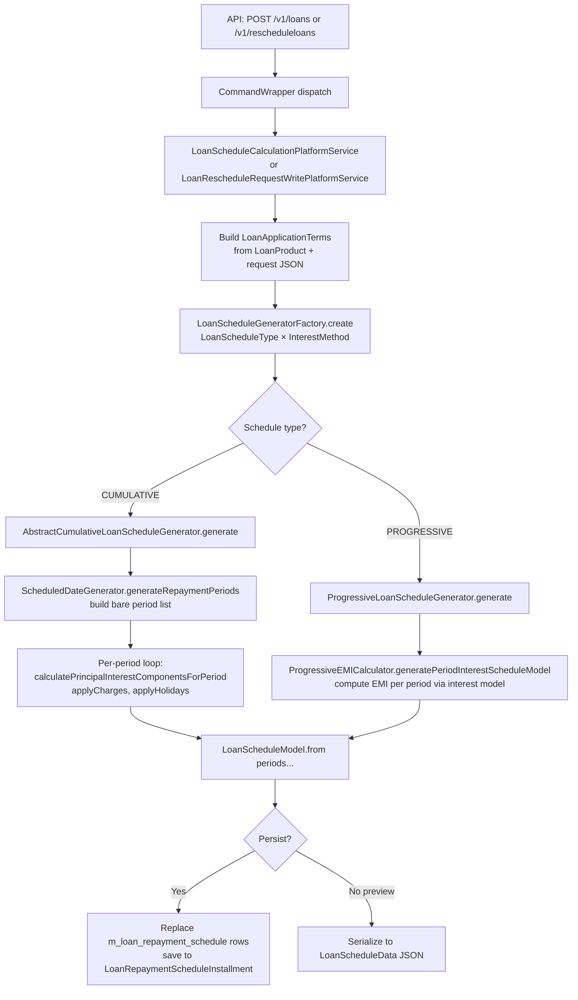

Fineract's loan schedule engine converts a set of loan application parameters into an ordered list of installments, each with a due date, principal, interest, fee, and penalty portion. The same pipeline is used during loan application preview, loan approval, loan disbursement, interest recalculation, and rescheduling. Understanding it is prerequisite to modifying any repayment, interest, or rescheduling behavior.

## Responsibility

The schedule subsystem answers: *given a set of terms (principal, rate, repayment frequency, amortization method, grace periods, holidays), what does each installment look like?* It does **not** record transactions. It outputs a `LoanScheduleModel` that is either serialized for display or materialized into `LoanRepaymentScheduleInstallment` entities and written to `m_loan_repayment_schedule`.

## File Inventory

| File | Role |
|---|---|
| `fineract-loan/.../loanschedule/domain/LoanScheduleGenerator.java` | Core interface — one method to generate, two to reschedule, one for prepayment |
| `fineract-loan/.../loanschedule/domain/LoanScheduleGeneratorFactory.java` | Factory interface: maps `LoanScheduleType` × `InterestMethod` to a concrete generator |
| `fineract-loan/.../loanschedule/domain/AbstractCumulativeLoanScheduleGenerator.java` | Base class for CUMULATIVE generators: orchestrates period loop, holiday adjustment, charge application |
| `fineract-loan/.../loanschedule/domain/CumulativeFlatInterestLoanScheduleGenerator.java` | Flat interest generator (interest calculated once on full principal, split across periods) |
| `fineract-loan/.../loanschedule/domain/CumulativeDecliningBalanceInterestLoanScheduleGenerator.java` | Declining balance generator (equal-principal or equal-installment amortization) |
| `fineract-loan/.../loanschedule/domain/LoanApplicationTerms.java` | God-object holding all input parameters for a schedule generation call |
| `fineract-loan/.../loanschedule/domain/LoanScheduleModel.java` | Immutable, non-persistent snapshot of a fully computed schedule |
| `fineract-loan/.../loanschedule/domain/LoanScheduleModelPeriod.java` | Interface for a single computed period (repayment, disbursement, or down-payment) |
| `fineract-loan/.../loanschedule/domain/LoanScheduleModelRepaymentPeriod.java` | Concrete repayment period implementation |
| `fineract-loan/.../loanschedule/domain/LoanScheduleModelDisbursementPeriod.java` | Represents a disbursement event in the schedule model |
| `fineract-loan/.../loanschedule/domain/DefaultScheduledDateGenerator.java` | Implements `ScheduledDateGenerator`: computes due dates for each installment accounting for frequency, holidays, and term variations |
| `fineract-loan/.../loanschedule/domain/ScheduledDateGenerator.java` | Interface: `generateRepaymentPeriods`, `generateNextRepaymentDate`, `adjustRepaymentDate`, `getLastRepaymentDate` |
| `fineract-loan/.../loanschedule/domain/LoanScheduleType.java` | Enum: `CUMULATIVE`, `PROGRESSIVE` |
| `fineract-loan/.../loanschedule/domain/LoanScheduleProcessingType.java` | Enum: `HORIZONTAL`, `VERTICAL` |
| `fineract-loan/.../loanschedule/domain/FinanicalFunctions.java` | Static PMT/IPMT/PPMT implementations used for equal-installment amortization |
| `fineract-loan/.../loanschedule/data/LoanScheduleParams.java` | Mutable accumulator passed through the period loop |
| `fineract-loan/.../loanschedule/data/LoanScheduleDTO.java` | Wraps `LoanScheduleModel` with modified installments for reschedule scenarios |
| `fineract-loan/.../loanschedule/data/LoanScheduleData.java` | REST/JSON representation of a schedule |
| `fineract-loan/.../loanschedule/data/LoanSchedulePeriodData.java` | REST/JSON representation of one period |
| `fineract-loan/.../loanschedule/service/LoanScheduleCalculationPlatformService.java` | Service interface: `calculateLoanSchedule`, `updateFutureSchedule`, `generateLoanScheduleForVariableInstallmentRequest` |
| `fineract-loan/.../loanschedule/service/LoanScheduleWritePlatformService.java` | Persists schedule variations: `addLoanScheduleVariations`, `deleteLoanScheduleVariations` |
| `fineract-loan/.../loanaccount/domain/LoanRepaymentScheduleInstallment.java` | JPA entity backed by `m_loan_repayment_schedule` table |
| `fineract-loan/.../loanaccount/api/LoanScheduleApiResource.java` | REST resource at `POST /v1/loans/{loanId}/schedule` |
| `fineract-loan/.../rescheduleloan/api/RescheduleLoansApiResource.java` | REST resource at `/v1/rescheduleloans` |
| `fineract-loan/.../rescheduleloan/domain/LoanRescheduleRequest.java` | JPA entity: `m_loan_reschedule_request` |
| `fineract-loan/.../rescheduleloan/service/LoanRescheduleRequestWritePlatformService.java` | `create`, `approve`, `reject` reschedule requests |
| `fineract-loan/.../loanschedule/domain/LoanRepaymentScheduleHistory.java` | Snapshot of old schedule periods before a reschedule (audit) |
| `fineract-loan/.../loanaccount/data/HolidayDetailDTO.java` | Carries holiday list and working-day config into schedule generation |

## Key Abstractions

### `LoanScheduleGenerator`
```
fineract-loan/.../loanschedule/domain/LoanScheduleGenerator.java
```

```java
public interface LoanScheduleGenerator {
    LoanScheduleModel generate(MathContext mc, LoanApplicationTerms loanApplicationTerms,
            Set<LoanCharge> loanCharges, HolidayDetailDTO holidayDetailDTO);

    LoanScheduleDTO rescheduleNextInstallments(MathContext mc, LoanApplicationTerms terms,
            Loan loan, HolidayDetailDTO holidayDetailDTO,
            LoanRepaymentScheduleTransactionProcessor processor, LocalDate rescheduleFrom);

    LoanScheduleDTO rescheduleNextInstallments(MathContext mc, LoanApplicationTerms terms,
            Loan loan, HolidayDetailDTO holidayDetailDTO,
            LoanRepaymentScheduleTransactionProcessor processor,
            LocalDate rescheduleFrom, LocalDate rescheduleTill);

    OutstandingAmountsDTO calculatePrepaymentAmount(MonetaryCurrency currency,
            LocalDate onDate, LoanApplicationTerms terms, MathContext mc, Loan loan,
            HolidayDetailDTO holidayDetailDTO,
            LoanRepaymentScheduleTransactionProcessor processor);

    Money getPeriodInterestTillDate(LoanRepaymentScheduleInstallment installment,
            LocalDate targetDate);
}
```

`generate` is the entry point for all new-schedule creation. Implementors: `AbstractCumulativeLoanScheduleGenerator` (base for cumulative loans), `ProgressiveLoanScheduleGenerator` (progressive loans).

---

### `LoanScheduleGeneratorFactory`
```
fineract-loan/.../loanschedule/domain/LoanScheduleGeneratorFactory.java
```
```java
LoanScheduleGenerator create(LoanScheduleType loanScheduleType, InterestMethod interestMethod);
```
The provider implementation maps:
- `CUMULATIVE` + `FLAT` → `CumulativeFlatInterestLoanScheduleGenerator`
- `CUMULATIVE` + `DECLINING_BALANCE` → `CumulativeDecliningBalanceInterestLoanScheduleGenerator`
- `PROGRESSIVE` → `ProgressiveLoanScheduleGenerator` (ignores `interestMethod`)

---

### `LoanApplicationTerms`
```
fineract-loan/.../loanschedule/domain/LoanApplicationTerms.java
```

The single large parameter object passed into every schedule generation call. Key fields:

| Field | Type | Meaning |
|---|---|---|
| `loanTermFrequency` / `loanTermPeriodFrequencyType` | `Integer` / `PeriodFrequencyType` | Total loan term length and unit (DAYS/WEEKS/MONTHS/YEARS) |
| `numberOfRepayments` | `Integer` | Count of repayment installments |
| `repaymentEvery` / `repaymentPeriodFrequencyType` | `Integer` / `PeriodFrequencyType` | Payment cadence (e.g., every 1 MONTHS) |
| `interestMethod` | `InterestMethod` | `FLAT` or `DECLINING_BALANCE` |
| `amortizationMethod` | `AmortizationMethod` | `EQUAL_INSTALLMENTS` or `EQUAL_PRINCIPAL` |
| `interestRatePerPeriod` / `annualNominalInterestRate` | `BigDecimal` | Rate values |
| `interestCalculationPeriodMethod` | `InterestCalculationPeriodMethod` | SAME_AS_REPAYMENT or DAILY |
| `principal` | `Money` | Loan principal (may include capitalized income in progressive loans) |
| `expectedDisbursementDate` | `LocalDate` | First disbursement date |
| `principalGrace` | `Integer` | Installments where **no** principal is collected |
| `interestPaymentGrace` | `Integer` | Installments where interest is deferred (still accrues) |
| `interestChargingGrace` | `Integer` | Installments that are truly **interest-free** |
| `interestChargedFromDate` | `LocalDate` | Legacy: date from which interest starts accruing (overrides `interestChargingGrace` for irregular gaps) |
| `inArrearsTolerance` | `Money` | Amount below which arrears are ignored for status transition |
| `graceOnArrearsAgeing` | `Integer` | Days before arrears bucket ageing triggers |
| `fixedEmiAmount` | `BigDecimal` | Override installment amount for equal-installment plans |
| `interestRecalculationEnabled` | `boolean` | Whether to recalculate interest on actual payments |
| `rescheduleStrategyMethod` | `LoanRescheduleStrategyMethod` | How future periods are recalculated on reschedule |
| `disbursementDatas` | `List<DisbursementData>` | Multi-tranche disbursement schedule |
| `variationsDataWrapper` | `LoanTermVariationsDataWrapper` | Pre-approved due date / amount variations |
| `holidayDetailDTO` | `HolidayDetailDTO` | Holidays and working-day rules |

---

### `LoanScheduleModel`
```
fineract-loan/.../loanschedule/domain/LoanScheduleModel.java
```
Immutable value object. Factory methods:
- `LoanScheduleModel.from(...)` — primary construction
- `LoanScheduleModel.withOverdueChargeUpdation(...)` — rebuilds with updated penalty total
- `LoanScheduleModel.withLoanScheduleModelPeriods(...)` — substitutes period list

Fields: `periods`, `currency`, `loanTermInDays`, `totalPrincipalDisbursed`, `totalPrincipalExpected`, `totalInterestCharged`, `totalFeeChargesCharged`, `totalPenaltyChargesCharged`, `totalRepaymentExpected`, `totalOutstanding`.

Calling `model.toData()` converts to `LoanScheduleData` for REST serialization.

---

### `LoanScheduleModelPeriod` (interface)
```
fineract-loan/.../loanschedule/domain/LoanScheduleModelPeriod.java
```
Implemented by `LoanScheduleModelRepaymentPeriod`, `LoanScheduleModelDisbursementPeriod`, and (in the data package) `LoanScheduleModelDownPaymentPeriod`.

Key methods: `periodNumber()`, `periodFromDate()`, `periodDueDate()`, `principalDue()`, `interestDue()`, `feeChargesDue()`, `penaltyChargesDue()`, `addPrincipalAmount(Money)`, `addInterestAmount(Money)`, `isRepaymentPeriod()`, `isDownPaymentPeriod()`, `rescheduleInterestPortion()`.

---

### `LoanRepaymentScheduleInstallment`
```
fineract-loan/.../loanaccount/domain/LoanRepaymentScheduleInstallment.java
```
JPA entity mapped to **`m_loan_repayment_schedule`**. Key columns:

| Column | Java field |
|---|---|
| `installment` | `installmentNumber` |
| `fromdate` | `fromDate` |
| `duedate` | `dueDate` |
| `principal_amount` | `principal` |
| `principal_completed_derived` | `principalCompleted` |
| `principal_writtenoff_derived` | `principalWrittenOff` |
| `interest_amount` | `interestCharged` |
| `interest_completed_derived` | `interestPaid` |
| `interest_waived_derived` | `interestWaived` |
| `interest_writtenoff_derived` | `interestWrittenOff` |
| `accrual_interest_derived` | `interestAccrued` |
| `reschedule_interest_portion` | `rescheduleInterestPortion` |
| `fee_charges_amount` | `feeChargesCharged` |
| `fee_charges_completed_derived` | `feeChargesPaid` |

The entity implements `Comparable<LoanRepaymentScheduleInstallment>` (by `dueDate`) and implements `LoanScheduleModelPeriod` to allow it to be used in reschedule scenarios.

---

### Interest Calculation Strategies

**`CumulativeFlatInterestLoanScheduleGenerator`**
```
fineract-loan/.../loanschedule/domain/CumulativeFlatInterestLoanScheduleGenerator.java
```
Total interest = `principal × rate × term`. Divided equally across all non-grace installments. Overrides `calculatePrincipalInterestComponentsForPeriod`.

**`CumulativeDecliningBalanceInterestLoanScheduleGenerator`**
```
fineract-loan/.../loanschedule/domain/CumulativeDecliningBalanceInterestLoanScheduleGenerator.java
```
Supports two amortization modes:
- **Equal principal** — `principal / n` per period; interest decreases each period as balance falls
- **Equal installments** — uses `FinanicalFunctions.pmt()` (the Excel PMT formula) to find a fixed payment; interest = `outstandingBalance × periodRate`

---

### `ScheduledDateGenerator` / `DefaultScheduledDateGenerator`
```
fineract-loan/.../loanschedule/domain/ScheduledDateGenerator.java
fineract-loan/.../loanschedule/domain/DefaultScheduledDateGenerator.java
```
`generateRepaymentPeriods` creates the full list of bare `LoanScheduleModelRepaymentPeriod` objects with only dates set (amounts are zeroed). The loop calls `generateNextRepaymentDate` for each period, then applies `adjustRepaymentDate` (holiday/working-day shift) for the final period, then calls `applyLoanTermVariations` to honour any pre-approved due-date changes (`LoanTermVariationsData`).

---

### `LoanScheduleApiResource`
```
fineract-loan/.../loanaccount/api/LoanScheduleApiResource.java
```
Path: `POST /v1/loans/{loanId}/schedule`

Three commands via `?command=`:
| Command | Action |
|---|---|
| `calculateLoanSchedule` | Preview schedule after applying term variations — calls `LoanScheduleCalculationPlatformService.generateLoanScheduleForVariableInstallmentRequest` |
| `addVariations` | Persist term variations — delegates to `LoanScheduleWritePlatformService.addLoanScheduleVariations` via command bus |
| `deleteVariations` | Remove all term variations — `LoanScheduleWritePlatformService.deleteLoanScheduleVariations` |

---

### Reschedule Subsystem

**`RescheduleLoansApiResource`** (`/v1/rescheduleloans`)
```
fineract-loan/.../rescheduleloan/api/RescheduleLoansApiResource.java
```
- `POST /v1/rescheduleloans` — create a reschedule request
- `GET /v1/rescheduleloans/template` — reasons template
- `GET /v1/rescheduleloans/{requestId}` — single request
- `POST /v1/rescheduleloans/{requestId}?command=approve` — approve
- `POST /v1/rescheduleloans/{requestId}?command=reject` — reject
- `GET /v1/rescheduleloans/{requestId}/preview` — preview the resulting schedule without persisting

**`LoanRescheduleRequest`** entity (`m_loan_reschedule_request`):
- `rescheduleFromInstallment` — installment number to reschedule from
- `rescheduleFromDate` — start date of modified schedule
- `recalculateInterest` — whether to recalculate outstanding interest
- `statusEnum` — PENDING(100) → APPROVED(200) / REJECTED(300)

**`LoanRescheduleRequestWritePlatformService`**:
- `create(JsonCommand)` — validates, creates the request and associated `LoanTermVariations`
- `approve(JsonCommand)` — calls `LoanScheduleGenerator.rescheduleNextInstallments`, replaces installments, saves history to `m_loan_repayment_schedule_history`
- `reject(JsonCommand)` — marks request REJECTED

## Control & Data Flow



### Holiday & Working-Day Adjustment

`DefaultScheduledDateGenerator.adjustRepaymentDate` delegates to `HolidayUtil` and `WorkingDaysUtil`. If a computed due date falls on a holiday or non-working day, Fineract reschedules it according to the `RepaymentRescheduleType` configured on the `WorkingDays` entity (MOVE_TO_NEXT_WORKING_DAY, MOVE_TO_NEXT_MEETING_DATE, etc.). The `HolidayDetailDTO` bundles `isHolidayEnabled`, the list of active `Holiday` entities, and `WorkingDays`. Only the **last** installment due date is adjusted by default; intermediate periods are handled via term variation overrides.

## Grace Periods

<Tabs>
  <Tab title="Principal Grace">
    `principalGrace` in `LoanApplicationTerms` stores how many installments have zero principal. The generator skips collecting principal for `installmentNumber <= principalGrace`. Interest still accrues on the full outstanding balance. A separate `periodNumbersApplicableForPrincipalGrace` set is also built to handle non-contiguous grace patterns.
  </Tab>
  <Tab title="Interest Payment Grace">
    `interestPaymentGrace` — interest is calculated but not collected until after the grace period. The deferred interest amount is accumulated in `cumulatingInterestPaymentDueToGrace` and added to the first non-grace installment.
  </Tab>
  <Tab title="Interest Charging Grace">
    `interestChargingGrace` — the loan is **interest-free** for the first N installments. No interest is computed. When combined with `interestChargedFromDate`, the date form takes priority and allows sub-installment granularity (e.g., 15 days free instead of a full month).
  </Tab>
  <Tab title="Arrears Tolerance">
    `inArrearsTolerance` (`Money`) — amounts below this threshold do not count as arrears. Configured per loan product but overridable at loan level.
  </Tab>
</Tabs>

## Repayment Frequency Types

`PeriodFrequencyType` (`fineract-core/.../PeriodFrequencyType.java`):
- `DAYS(0)` — daily
- `WEEKS(1)` — weekly
- `MONTHS(2)` — monthly
- `YEARS(3)` — annual
- `WHOLE_TERM(4)` — bullet (single payment at end)

Used in `repaymentPeriodFrequencyType` and `loanTermPeriodFrequencyType` in `LoanApplicationTerms`.

## Persistence: `m_loan_repayment_schedule`

When a loan is approved or disbursed, `Loan.updateLoanScheduleDependentDerivedFields` (in `fineract-loan/.../domain/Loan.java`) calls the generator and then materializes each `LoanScheduleModelPeriod` into a `LoanRepaymentScheduleInstallment`. The installments are saved via `LoanRepaymentScheduleInstallmentRepository`.

On reschedule approval, old installments are:
1. Snapshotted into `m_loan_repayment_schedule_history` via `LoanRepaymentScheduleHistoryRepository`
2. Replaced by newly generated installments

## Gotchas & Invariants

<Warning>
  `LoanApplicationTerms` is mutable (uses `@Setter`). Several fields are mutated mid-calculation — e.g., `seedDate`, `fixedEmiAmount`, `currentPeriodFixedEmiAmount`. Never cache a `LoanApplicationTerms` instance across different loan operations.
</Warning>

<Note>
  The `LoanScheduleGeneratorFactory.create` dispatch is NOT type-safe at compile time. If a new `LoanScheduleType` is added, the factory implementation must be updated manually — there is no exhaustiveness check.
</Note>

<Tip>
  The `FinanicalFunctions.pmt(rate, nper, pv)` implementation at `fineract-loan/.../domain/FinanicalFunctions.java` matches the Excel PMT formula. For declining-balance equal-installment loans, if `rate == 0`, it falls back to `pv / nper`. Always ensure `annualNominalInterestRate` is positive before invoking it.
</Tip>

<Note>
  `LoanScheduleModel` is a **non-persistent domain object** (as its Javadoc states). It must be converted to `LoanScheduleData` for REST responses or materialized to `LoanRepaymentScheduleInstallment` entities for persistence. Never treat it as a JPA entity.
</Note>

<Warning>
  The `rescheduleNextInstallments` two-argument variant (with `rescheduleTill`) is used for partial reschedules — only periods between `rescheduleFrom` and `rescheduleTill` are regenerated. The three-argument variant regenerates everything from `rescheduleFrom` onward. Passing the wrong one causes silent over/under-generation of periods.
</Warning>

## Connections

- **Inbound**: `LoanAccountWritePlatformService` (via `fineract-provider`) calls `LoanScheduleGeneratorFactory` at loan application submission, approval, and disbursement.
- **Progressive loans**: `ProgressiveLoanScheduleGenerator` calls `EMICalculator` (implemented by `ProgressiveEMICalculator`).
- **Charges**: `LoanCharge` sets are passed into `generate` and applied via `applyChargesForCurrentPeriod` in `AbstractCumulativeLoanScheduleGenerator`.
- **Transaction processor**: `LoanRepaymentScheduleTransactionProcessor` is injected into `rescheduleNextInstallments` to replay transactions against the newly generated schedule.
- **COB (Close-of-Business)**: Nightly batch jobs trigger interest recalculation by calling `LoanScheduleGenerator.rescheduleNextInstallments` with updated terms.
