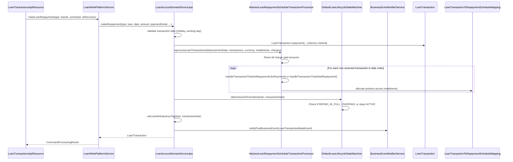

Every monetary movement against a loan — disbursement, repayment, waiver, write-off, fee payment, accrual, refund — is modelled as a `LoanTransaction` entity persisted in `m_loan_transaction`. Transactions are immutable once posted: "adjustment" means creating a new reversed copy of the original and then posting the corrected transaction, which triggers a full replay of all non-reversed transactions through the repayment schedule processor. This section documents the complete set of transaction types, the entity's fields, the processing pipeline, and every specialised operation (charge-off, re-aging, re-amortization, interest pause).

---

## File Inventory

| File | Path | Role |
|---|---|---|
| `LoanTransaction.java` | `fineract-loan/src/main/java/org/apache/fineract/portfolio/loanaccount/domain/LoanTransaction.java` | Entity; table `m_loan_transaction` |
| `LoanTransactionType.java` | `fineract-loan/.../domain/LoanTransactionType.java` | Enum of all 47+ transaction type codes |
| `LoanTransactionRelation.java` | `fineract-loan/.../domain/LoanTransactionRelation.java` | Links a transaction to its reversal/replay counterpart |
| `LoanTransactionRelationTypeEnum.java` | `fineract-loan/.../domain/LoanTransactionRelationTypeEnum.java` | Relation types: CHARGEBACK, REPLAYED, etc. |
| `LoanTransactionToRepaymentScheduleMapping.java` | `fineract-loan/.../domain/LoanTransactionToRepaymentScheduleMapping.java` | How a transaction is allocated to schedule rows |
| `AbstractLoanRepaymentScheduleTransactionProcessor.java` | `fineract-loan/.../domain/transactionprocessor/AbstractLoanRepaymentScheduleTransactionProcessor.java` | Base class for all allocation strategies |
| `LoanRepaymentScheduleTransactionProcessor.java` | `fineract-loan/.../domain/transactionprocessor/LoanRepaymentScheduleTransactionProcessor.java` | Interface for schedule processors |
| `LoanRepaymentScheduleTransactionProcessorFactory.java` | `fineract-loan/.../domain/LoanRepaymentScheduleTransactionProcessorFactory.java` | Selects processor by strategy code |
| `LoanAccountDomainServiceJpa.java` | `fineract-provider/.../domain/LoanAccountDomainServiceJpa.java` | `makeRepayment()` implementation |
| `LoanTransactionsApiResource.java` | `fineract-provider/.../api/LoanTransactionsApiResource.java` | REST: `/v1/loans/{id}/transactions` |
| `LoanInterestPauseApiResource.java` | `fineract-loan/.../interestpauses/api/LoanInterestPauseApiResource.java` | REST: `/v1/loans/{id}/interest-pauses` |
| `InterestPauseWritePlatformService.java` | `fineract-loan/.../interestpauses/service/InterestPauseWritePlatformService.java` | Service interface for pause CRUD |
| `LoanReAgingService.java` | `fineract-provider/.../service/reaging/LoanReAgingService.java` | Re-aging operation |
| `LoanReAmortizationService.java` | `fineract-provider/.../service/reamortization/LoanReAmortizationService.java` | Re-amortization operation |

---

## LoanTransactionType Enum

File: `fineract-loan/src/main/java/org/apache/fineract/portfolio/loanaccount/domain/LoanTransactionType.java`.

| Constant | Code | DB Value | Category | Description |
|---|---|---|---|---|
| `INVALID` | `loanTransactionType.invalid` | 0 | — | Sentinel |
| `DISBURSEMENT` | `loanTransactionType.disbursement` | 1 | Core | Principal disbursed to borrower |
| `REPAYMENT` | `loanTransactionType.repayment` | 2 | Core | Standard repayment |
| `CONTRA` | `loanTransactionType.contra` | 3 | Legacy | Reversal marker (historical) |
| `WAIVE_INTEREST` | `loanTransactionType.waiver` | 4 | Waiver | Interest waived |
| `REPAYMENT_AT_DISBURSEMENT` | `loanTransactionType.repaymentAtDisbursement` | 5 | Core | Fee paid at disbursal |
| `WRITEOFF` | `loanTransactionType.writeOff` | 6 | Closure | Outstanding balance written off |
| `MARKED_FOR_RESCHEDULING` | `loanTransactionType.marked.for.rescheduling` | 7 | Reschedule | Marks loan for rescheduling |
| `RECOVERY_REPAYMENT` | `loanTransactionType.recoveryRepayment` | 8 | Recovery | Repayment on written-off loan |
| `WAIVE_CHARGES` | `loanTransactionType.waiveCharges` | 9 | Waiver | Charge waived |
| `ACCRUAL` | `loanTransactionType.accrual` | 10 | Accrual | Interest/fee accrual posting |
| `INITIATE_TRANSFER` | `loanTransactionType.initiateTransfer` | 12 | Transfer | Source-branch transfer initiation |
| `APPROVE_TRANSFER` | `loanTransactionType.approveTransfer` | 13 | Transfer | Transfer approved |
| `WITHDRAW_TRANSFER` | `loanTransactionType.withdrawTransfer` | 14 | Transfer | Transfer cancelled |
| `REJECT_TRANSFER` | `loanTransactionType.rejectTransfer` | 15 | Transfer | Transfer rejected |
| `REFUND` | `loanTransactionType.refund` | 16 | Refund | Refund to borrower |
| `CHARGE_PAYMENT` | `loanTransactionType.chargePayment` | 17 | Charge | Charge paid |
| `REFUND_FOR_ACTIVE_LOAN` | `loanTransactionType.refund` | 18 | Refund | Refund while loan still active |
| `INCOME_POSTING` | `loanTransactionType.incomePosting` | 19 | Accrual | Income recognised as transaction |
| `CREDIT_BALANCE_REFUND` | `loanTransactionType.creditBalanceRefund` | 20 | Refund | Overpayment refunded |
| `MERCHANT_ISSUED_REFUND` | `loanTransactionType.merchantIssuedRefund` | 21 | Refund | Merchant-initiated refund |
| `PAYOUT_REFUND` | `loanTransactionType.payoutRefund` | 22 | Refund | Payout refund |
| `GOODWILL_CREDIT` | `loanTransactionType.goodwillCredit` | 23 | Refund | Goodwill credit |
| `CHARGE_REFUND` | `loanTransactionType.chargeRefund` | 24 | Charge | Charge refunded |
| `CHARGEBACK` | `loanTransactionType.chargeback` | 25 | Chargeback | Payment reversed by issuer |
| `CHARGE_ADJUSTMENT` | `loanTransactionType.chargeAdjustment` | 26 | Charge | Manual charge adjustment |
| `CHARGE_OFF` | `loanTransactionType.chargeOff` | 27 | Charge-off | Loan charged off |
| `DOWN_PAYMENT` | `loanTransactionType.downPayment` | 28 | Core | Down payment on disbursal |
| `REAGE` | `loanTransactionType.reAge` | 29 | Restructure | Re-aging of overdue installments |
| `REAMORTIZE` | `loanTransactionType.reAmortize` | 30 | Restructure | Re-amortization |
| `INTEREST_PAYMENT_WAIVER` | `loanTransactionType.interestPaymentWaiver` | 31 | Waiver | Interest waiver applied as payment |
| `ACCRUAL_ACTIVITY` | `loanTransactionType.accrualActivity` | 32 | Accrual | Installment-level accrual activity |
| `INTEREST_REFUND` | `loanTransactionType.interestRefund` | 33 | Refund | Interest refund (e.g., early payoff) |
| `ACCRUAL_ADJUSTMENT` | `loanTransactionType.accrualAdjustment` | 34 | Accrual | Adjustment to accrual amount |
| `CAPITALIZED_INCOME` | `loanTransactionType.capitalizedIncome` | 35 | Income | Deferred income capitalised |
| `CAPITALIZED_INCOME_AMORTIZATION` | `loanTransactionType.capitalizedIncomeAmortization` | 36 | Income | Amortisation of capitalised income |
| `CAPITALIZED_INCOME_ADJUSTMENT` | `loanTransactionType.capitalizedIncomeAdjustment` | 37 | Income | Adjustment to capitalised income |
| `CONTRACT_TERMINATION` | `loanTransactionType.contractTermination` | 38 | Closure | Contract early termination |
| `CAPITALIZED_INCOME_AMORTIZATION_ADJUSTMENT` | `loanTransactionType.capitalizedIncomeAmortizationAdjustment` | 39 | Income | Adjustment to amortisation |
| `BUY_DOWN_FEE` | `loanTransactionType.buyDownFee` | 40 | Fee | Buy-down fee posting |
| `BUY_DOWN_FEE_ADJUSTMENT` | `loanTransactionType.buyDownFeeAdjustment` | 41 | Fee | Buy-down fee adjustment |
| `BUY_DOWN_FEE_AMORTIZATION` | `loanTransactionType.buyDownFeeAmortization` | 42 | Fee | Buy-down fee amortisation |
| `BUY_DOWN_FEE_AMORTIZATION_ADJUSTMENT` | `loanTransactionType.buyDownFeeAmortizationAdjustment` | 43 | Fee | Adjustment to buy-down amortisation |
| `DISCOUNT_FEE` | `loanTransactionType.discountFee` | 44 | Fee | Discount fee posting |
| `DISCOUNT_FEE_AMORTIZATION` | `loanTransactionType.discountFeeAmortization` | 45 | Fee | Discount fee amortisation |
| `DISCOUNT_FEE_ADJUSTMENT` | `loanTransactionType.discountFeeAdjustment` | 46 | Fee | Discount fee adjustment |
| `DISCOUNT_FEE_AMORTIZATION_ADJUSTMENT` | `loanTransactionType.discountFeeAmortizationAdjustment` | 47 | Fee | Adjustment to discount fee amortisation |

<Note>
`isRepaymentType()` in `LoanTransactionType` returns `true` for: `REPAYMENT`, `MERCHANT_ISSUED_REFUND`, `PAYOUT_REFUND`, `GOODWILL_CREDIT`, `CHARGE_REFUND`, `DOWN_PAYMENT`, and `INTEREST_PAYMENT_WAIVER`. These all go through the same schedule-processing pipeline.
</Note>

---

## LoanTransaction Entity Fields

Table: `m_loan_transaction`. Class: `fineract-loan/.../domain/LoanTransaction.java`.

| Java field | DB column | Type | Description |
|---|---|---|---|
| `loan` | `loan_id` | `Loan` | Parent loan (FK) |
| `office` | `office_id` | `Office` | Office at transaction time |
| `paymentDetail` | `payment_detail_id` | `PaymentDetail` | Optional payment reference |
| `typeOf` | `transaction_type_enum` | `LoanTransactionType` | Transaction type code |
| `dateOf` | `transaction_date` | `LocalDate` | Business date of transaction |
| `submittedOnDate` | `submitted_on_date` | `LocalDate` | System date of posting |
| `amount` | `amount` | `BigDecimal` | Total transaction amount |
| `principalPortion` | `principal_portion_derived` | `BigDecimal` | Principal allocation |
| `interestPortion` | `interest_portion_derived` | `BigDecimal` | Interest allocation |
| `feeChargesPortion` | `fee_charges_portion_derived` | `BigDecimal` | Fee allocation |
| `penaltyChargesPortion` | `penalty_charges_portion_derived` | `BigDecimal` | Penalty allocation |
| `overPaymentPortion` | `overpayment_portion_derived` | `BigDecimal` | Amount beyond outstanding |
| `unrecognizedIncomePortion` | `unrecognized_income_portion` | `BigDecimal` | Income not yet recognised |
| `outstandingLoanBalance` | `outstanding_loan_balance_derived` | `BigDecimal` | Remaining balance after transaction |
| `reversed` | `is_reversed` | `boolean` | `true` if transaction was reversed |
| `reversedOnDate` | `reversed_on_date` | `LocalDate` | Date reversal was recorded |
| `externalId` | `external_id` | `ExternalId` | Optional client-provided ID |
| `reversalExternalId` | `reversal_external_id` | `ExternalId` | External ID of the reversal transaction |
| `manuallyAdjustedOrReversed` | `manually_adjusted_or_reversed` | `boolean` | Distinguishes manual from system reversals |
| `loanChargesPaid` | _(one-to-many)_ | `Set<LoanChargePaidBy>` | Charge linkages |
| `loanTransactionToRepaymentScheduleMappings` | _(one-to-many)_ | `Set<LoanTransactionToRepaymentScheduleMapping>` | Schedule allocation mapping |
| `loanTransactionRelations` | _(one-to-many)_ | `Set<LoanTransactionRelation>` | Links to related transactions |
| `loanReAgeParameter` | _(one-to-one)_ | `LoanReAgeParameter` | Re-aging parameters (if `REAGE` type) |
| `loanReAmortizationParameter` | _(one-to-one)_ | `LoanReAmortizationParameter` | Re-amortization parameters |
| `classification` | `classification_cv_id` | `CodeValue` | Optional classification code value |

---

## Transaction Processing Pipeline

### makeRepayment Flow



### Transaction Processors

All concrete processors extend `AbstractLoanRepaymentScheduleTransactionProcessor` (`fineract-loan/.../transactionprocessor/AbstractLoanRepaymentScheduleTransactionProcessor.java`), which implements the reverse-replay algorithm:

1. Reset paid amounts on all charges.
2. Iterate transactions in chronological order.
3. For each, call the concrete `handleTransactionThatIsARepaymentLikePayment()` implementation.
4. The concrete method decides **allocation order** (which component of which installment gets paid first).

| Processor Class | Strategy Code | Allocation Order |
|---|---|---|
| `FineractStyleLoanRepaymentScheduleTransactionProcessor` | `mifos-standard-strategy` | Due penalty → fee → interest → principal; then future installments same order |
| `HeavensFamilyLoanRepaymentScheduleTransactionProcessor` | `heavensfamily-strategy` | Due interest → principal → penalty → fee |
| `CreocoreLoanRepaymentScheduleTransactionProcessor` | `creocore-strategy` | Due fee → penalty → interest → principal |
| `RBILoanRepaymentScheduleTransactionProcessor` | `rbi-india-strategy` | RBI (India) regulatory order |
| `InterestPrincipalPenaltyFeesOrderLoanRepaymentScheduleTransactionProcessor` | `interest-principal-penalties-fees-order-strategy` | Interest → principal → penalty → fee |
| `PrincipalInterestPenaltyFeesOrderLoanRepaymentScheduleTransactionProcessor` | `principal-interest-penalties-fees-order-strategy` | Principal → interest → penalty → fee |
| `EarlyPaymentLoanRepaymentScheduleTransactionProcessor` | `early-repayment-strategy` | Allocate to furthest-future installments first |
| `DuePenFeeIntPriInAdvancePriPenFeeIntLoanRepaymentScheduleTransactionProcessor` | `due-penalty-fee-interest-principal-in-advance-principal-penalty-fee-interest-strategy` | Due (penalty→fee→interest→principal) then advance (principal→penalty→fee→interest) |
| `DuePenIntPriFeeInAdvancePenIntPriFeeLoanRepaymentScheduleTransactionProcessor` | `due-penalty-interest-principal-fee-in-advance-penalty-interest-principal-fee-strategy` | Variant with interest before fee |

---

## Transaction API Endpoints

`LoanTransactionsApiResource` bound to `@Path("/v1/loans")`:

| Method | Path | Handler | Description |
|---|---|---|---|
| `GET` | `/v1/loans/{loanId}/transactions/template` | `retrieveTransactionTemplate()` | Template for posting transactions |
| `GET` | `/v1/loans/{loanId}/transactions/{transactionId}` | `retrieveTransaction()` | Single transaction |
| `GET` | `/v1/loans/{loanId}/transactions/external-id/{externalTransactionId}` | `retrieveTransactionByTransactionExternalId()` | Lookup by external ID |
| `GET` | `/v1/loans/{loanId}/transactions` | _(unnamed)_ | List all transactions |
| `POST` | `/v1/loans/{loanId}/transactions?command=repayment` | `executeLoanTransaction()` | Post repayment |
| `POST` | `/v1/loans/{loanId}/transactions?command=waiveinterest` | `executeLoanTransaction()` | Waive interest |
| `POST` | `/v1/loans/{loanId}/transactions?command=writeoff` | `executeLoanTransaction()` | Write-off |
| `POST` | `/v1/loans/{loanId}/transactions?command=close` | `executeLoanTransaction()` | Close |
| `POST` | `/v1/loans/{loanId}/transactions?command=closeAsRescheduled` | `executeLoanTransaction()` | Close as rescheduled |
| `POST` | `/v1/loans/{loanId}/transactions?command=charge-off` | `executeLoanTransaction()` | Charge off |
| `POST` | `/v1/loans/{loanId}/transactions?command=undo-charge-off` | `executeLoanTransaction()` | Undo charge-off |
| `POST` | `/v1/loans/{loanId}/transactions?command=reAge` | `executeLoanTransaction()` | Re-age |
| `POST` | `/v1/loans/{loanId}/transactions?command=undoReAge` | `executeLoanTransaction()` | Undo re-age |
| `POST` | `/v1/loans/{loanId}/transactions?command=reAmortize` | `executeLoanTransaction()` | Re-amortize |
| `POST` | `/v1/loans/{loanId}/transactions?command=undoReAmortize` | `executeLoanTransaction()` | Undo re-amortize |
| `POST` | `/v1/loans/{loanId}/transactions?command=downPayment` | `executeLoanTransaction()` | Down payment |
| `POST` | `/v1/loans/{loanId}/transactions?command=creditBalanceRefund` | `executeLoanTransaction()` | Credit balance refund |
| `POST` | `/v1/loans/{loanId}/transactions?command=merchantIssuedRefund` | `executeLoanTransaction()` | Merchant refund |
| `POST` | `/v1/loans/{loanId}/transactions?command=payoutRefund` | `executeLoanTransaction()` | Payout refund |
| `POST` | `/v1/loans/{loanId}/transactions?command=goodwillCredit` | `executeLoanTransaction()` | Goodwill credit |
| `POST` | `/v1/loans/{loanId}/transactions?command=interest-refund` | `executeLoanTransaction()` | Interest refund |
| `POST` | `/v1/loans/{loanId}/transactions?command=capitalizedIncome` | `executeLoanTransaction()` | Capitalize income |
| `POST` | `/v1/loans/{loanId}/transactions/{transactionId}` | `adjustLoanTransaction()` | Adjust (reverse + replay) |

All paths are also available with `external-id/{loanExternalId}` in place of `{loanId}`.

---

## Reversal of Transactions

<Steps>
  <Step title="Mark as reversed">
    The target `LoanTransaction` has its `reversed` flag set to `true` and `reversedOnDate` stamped. The `manuallyAdjustedOrReversed` flag distinguishes user-initiated reversal from system replay.
  </Step>
  <Step title="Create reversal relation">
    A `LoanTransactionRelation` row is inserted in `m_loan_transaction_relations` linking the original transaction (`fromTransaction`) to the new/corrected transaction with relation type `REPLAYED` or `CHARGEBACK`.
  </Step>
  <Step title="Reverse-replay">
    `ReprocessLoanTransactionsService.reprocessTransactions(loan)` iterates all non-reversed transactions from disbursal date and re-allocates each through the schedule processor. This regenerates all `LoanTransactionToRepaymentScheduleMapping` rows and recalculates `LoanSummary`.
  </Step>
  <Step title="Journal entry reversal">
    `LoanJournalEntryPoster` creates reversal accounting entries for the reversed transaction and new entries for the replacement transaction.
  </Step>
</Steps>

<Warning>
Full reverse-replay of a loan with many transactions is O(n²) in the worst case. For high-volume loans the COB inline processing path is preferred — it uses `InlineCOBLoanItemProcessor` to process loans sequentially under a lock.
</Warning>

---

## Charge-Off

Charge-off marks a loan as uncollectable without closing it.

- **API**: `POST /v1/loans/{loanId}/transactions?command=charge-off`  
- **Handler**: `LoanWritePlatformService.chargeOff(JsonCommand)` (implementation: `LoanWritePlatformServiceJpaRepositoryImpl`)
- **Transaction type created**: `CHARGE_OFF` (code 27)
- **Loan field set**: `isChargedOff = true` (column `is_charged_off` on `m_loan`)
- **Behaviour controlled by**: `LoanChargeOffBehaviour` enum on `LoanProductRelatedDetail.chargeOffBehaviour`
- **Business events**: `LoanChargeOffPreBusinessEvent` and `LoanChargeOffPostBusinessEvent` in `fineract-loan/.../event/business/domain/loan/transaction/`
- **Undo**: `POST ...?command=undo-charge-off` → `LoanWritePlatformService.undoChargeOff(JsonCommand)` reverses the `CHARGE_OFF` transaction and clears `isChargedOff`

---

## Re-aging

Re-aging moves overdue outstanding amounts to future installments, reducing the reported past-due balance without writing off the debt.

- **API**: `POST /v1/loans/{loanId}/transactions?command=reAge`
- **Handler**: `LoanReAgingCommandHandler` (`fineract-provider/.../handler/loan/reaging/LoanReAgingCommandHandler.java`) delegates to `LoanReAgingService.reAge(Long, JsonCommand)`
- **Transaction type created**: `REAGE` (code 29)
- **Parameter entity**: `LoanReAgeParameter` (`fineract-loan/.../domain/reaging/LoanReAgeParameter.java`) — linked one-to-one to the `LoanTransaction`; stores `startDate`, `frequencyType`, `frequencyNumber`, `numberOfInstallments`
- **Interest handling**: `LoanReAgeInterestHandlingType` enum (`SAME_AS_REPAYMENT` or `RECALCULATE`)
- **Undo**: `POST ...?command=undoReAge` → `LoanUndoReAgingCommandHandler`

---

## Re-amortization

Re-amortization redistributes the remaining outstanding balance across the remaining installments, smoothing the future schedule.

- **API**: `POST /v1/loans/{loanId}/transactions?command=reAmortize`
- **Handler**: `LoanReAmortizationCommandHandler` (`fineract-provider/.../handler/loan/reamortization/`) delegates to `LoanReAmortizationService.reAmortize(Long, JsonCommand)`
- **Transaction type created**: `REAMORTIZE` (code 30)
- **Parameter entity**: `LoanReAmortizationParameter` (`fineract-loan/.../domain/reamortization/LoanReAmortizationParameter.java`)
- **Interest handling**: `LoanReAmortizationInterestHandlingType` enum
- **Preview**: `GET /v1/loans/{loanId}/transactions?command=reAmortize` with `ReAmortizationPreviewRequest` in `fineract-provider/.../api/request/ReAmortizationPreviewRequest.java`
- **Undo**: `POST ...?command=undoReAmortize` → `LoanUndoReAmortizationCommandHandler`

---

## Interest Pause

An interest pause suspends interest accrual for a defined date range. It is implemented as a `LoanTermVariations` row with type `INTEREST_PAUSE`.

<Tabs>
  <Tab title="API Endpoints">
The resource is `LoanInterestPauseApiResource` at `fineract-loan/.../interestpauses/api/LoanInterestPauseApiResource.java`, bound to `@Path("/v1/loans")`:

| Method | Path | Description |
|---|---|---|
| `POST` | `/v1/loans/{loanId}/interest-pauses` | Create new pause period |
| `POST` | `/v1/loans/external-id/{loanExternalId}/interest-pauses` | Create by external ID |
| `GET` | `/v1/loans/{loanId}/interest-pauses` | List all pauses |
| `GET` | `/v1/loans/external-id/{loanExternalId}/interest-pauses` | List by external ID |
| `PUT` | `/v1/loans/{loanId}/interest-pauses/{variationId}` | Update a pause |
| `PUT` | `/v1/loans/external-id/{loanExternalId}/interest-pauses/{variationId}` | Update by external ID |
| `DELETE` | `/v1/loans/{loanId}/interest-pauses/{variationId}` | Delete a pause |
| `DELETE` | `/v1/loans/external-id/{loanExternalId}/interest-pauses/{variationId}` | Delete by external ID |
  </Tab>
  <Tab title="Service Interface">
`InterestPauseWritePlatformService` (`fineract-loan/.../interestpauses/service/`):

```java
CommandProcessingResult createInterestPause(Long loanId, String startDate, String endDate, String dateFormat, String locale);
CommandProcessingResult createInterestPause(ExternalId loanExternalId, ...);
CommandProcessingResult deleteInterestPause(Long loanId, Long variationId);
CommandProcessingResult deleteInterestPause(ExternalId loanExternalId, Long variationId);
CommandProcessingResult updateInterestPause(Long loanId, Long variationId, String startDateString, String endDateString, ...);
CommandProcessingResult updateInterestPause(ExternalId loanExternalId, Long variationId, ...);
```

Read service: `InterestPauseReadPlatformService` returns `List<InterestPauseResponseDto>`.
  </Tab>
</Tabs>

---

## Key `LoanTransaction` Factory Methods

`LoanTransaction` uses static factory methods rather than constructors:

| Factory Method | Signature (simplified) | Created Type |
|---|---|---|
| `disbursement(...)` | `(Loan, Money, PaymentDetail, LocalDate, ExternalId, Money loanTotalOverpaid)` | `DISBURSEMENT` |
| `repayment(...)` | `(Office, Money, PaymentDetail, LocalDate, ExternalId)` | `REPAYMENT` |
| `chargeback(...)` | `(Loan, Money, PaymentDetail, LocalDate, ExternalId)` | `CHARGEBACK` |
| `repaymentType(...)` | `(LoanTransactionType, Office, Money, PaymentDetail, LocalDate, ExternalId, chargeRefundChargeType)` | Parameterised repayment-type |
| `incomePosting(...)` | `(Loan, Office, LocalDate, amount, interest, fee, penalty, ExternalId)` | `INCOME_POSTING` |
| `accrueTransaction(...)` | Accrual amounts per period | `ACCRUAL` |
| `accrualAdjustment(...)` | Adjustment amounts | `ACCRUAL_ADJUSTMENT` |

---

## Connections

<CardGroup cols={2}>
  <Card title="Inbound" icon="arrow-right">
    - `LoanTransactionsApiResource` — REST entry
    - `LoanAccountDomainServiceJpa.makeRepayment()` — core transaction creation
    - COB `AddPeriodicAccrualEntriesBusinessStep` — accrual transactions
  </Card>
  <Card title="Outbound" icon="arrow-left">
    - `AbstractLoanRepaymentScheduleTransactionProcessor` — schedule allocation
    - `LoanJournalEntryPoster` — accounting entries
    - `DelinquencyWritePlatformService.setLoanDelinquencyTag()` — delinquency update
    - `BusinessEventNotifierService` — Avro event publication
    - `LoanTransactionToRepaymentScheduleMapping` — allocation persistence
  </Card>
</CardGroup>

---

## Gotchas & Invariants

<Warning>
Transactions with `reversed = true` are **never** deleted from `m_loan_transaction`. The reverse-replay algorithm explicitly filters them out during reprocessing using `!loanTransaction.isReversed()`. Querying without this filter will double-count amounts.
</Warning>

<Warning>
`LoanTransaction.dateOf` is the **business date** — it can be backdated. `LoanTransaction.submittedOnDate` is the system date of posting. Ordering by `dateOf` then `id` is the canonical order for replay.
</Warning>

<Note>
The `chargeRefundChargeType` field (column `charge_refund_charge_type`) is a single character: `'F'` for fee charge refund, `'P'` for penalty charge refund. It disambiguates `CHARGE_REFUND` transactions.
</Note>

<Note>
`LoanTransaction.outstandingLoanBalance` is a snapshot of the outstanding balance **after** this transaction, used for audit purposes. It is not recalculated during reverse-replay; after replay it may be stale until `LoanBalanceService.updateLoanSummaryDerivedFields()` runs.
</Note>

<Tip>
To check if a transaction type is a "repayment-like" payment, use `LoanTransactionType.isRepaymentType()` rather than checking `== REPAYMENT`. Seven types return `true` from this method.
</Tip>
