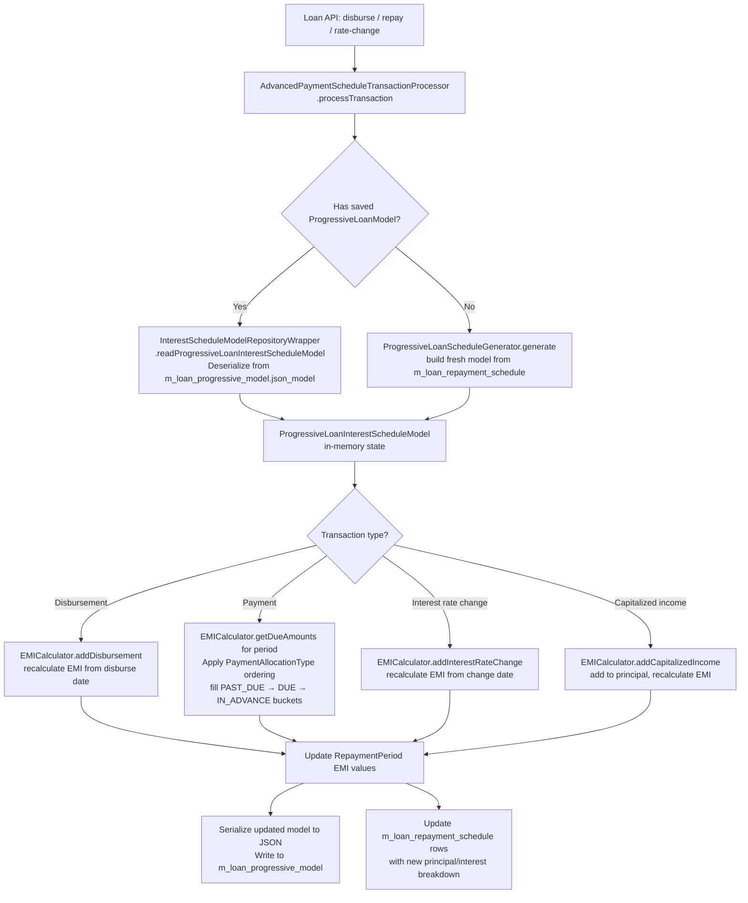

Progressive loans in Fineract represent a fundamentally different repayment model from the classic cumulative loan. Rather than pre-computing total interest at disbursement time and freezing it, a progressive loan maintains a live **interest schedule model** that reacts to every transaction — disbursement, repayment, rate change, capitalized income, or re-aging. The system recalculates equal monthly installments (EMI) dynamically, ensuring the outstanding balance is always accurately reflected. This model is the foundation for BNPL, consumer finance, and any product requiring interest-first or flexible allocation.

## Responsibility

The `fineract-progressive-loan` module provides:
1. **`EMICalculator` / `ProgressiveEMICalculator`** — computes per-period EMI from an interest schedule model using an actuarial/reducing-balance method.
2. **`ProgressiveLoanScheduleGenerator`** — implements `LoanScheduleGenerator` by delegating date generation to `DefaultScheduledDateGenerator` and amount calculation to `EMICalculator`.
3. **`ProgressiveLoanInterestScheduleModel`** — the live, mutable interest state that tracks `RepaymentPeriod` objects each containing `InterestPeriod` slices.
4. **`AdvancedPaymentScheduleTransactionProcessor`** — processes all loan transactions using configurable `LoanPaymentAllocationRule` and `LoanCreditAllocationRule` instead of the fixed ordering of classic processors.
5. **Buy-down fees and capitalized income** — additional progressive-only features.

The embeddable schedule generator (`fineract-progressive-loan-embeddable-schedule-generator`) packages the core calculation as a Spring-free, dependency-minimal JAR for external integrations.

The working capital loan module (`fineract-working-capital-loan`) extends progressive loans with a custom COB (Close-of-Business) pipeline for `WorkingCapitalLoan` entities.

## File Inventory

<CardGroup cols={2}>
  <Card title="Core Calculator">
    `fineract-progressive-loan/.../loanproduct/calc/EMICalculator.java` — interface

    `fineract-progressive-loan/.../loanproduct/calc/ProgressiveEMICalculator.java` — implementation
  </Card>
  <Card title="Interest Model">
    `fineract-progressive-loan/.../loanproduct/calc/data/ProgressiveLoanInterestScheduleModel.java`

    `fineract-progressive-loan/.../loanproduct/calc/data/RepaymentPeriod.java`

    `fineract-progressive-loan/.../loanproduct/calc/data/InterestPeriod.java`

    `fineract-progressive-loan/.../loanproduct/calc/data/InterestRate.java`
  </Card>
  <Card title="Schedule Generator">
    `fineract-progressive-loan/.../loanschedule/domain/ProgressiveLoanScheduleGenerator.java`

    `fineract-progressive-loan/.../loanaccount/loanschedule/data/LoanSchedulePlan.java`

    `fineract-progressive-loan/.../loanaccount/loanschedule/data/LoanSchedulePlanRepaymentPeriod.java`
  </Card>
  <Card title="Transaction Processor">
    `fineract-progressive-loan/.../transactionprocessor/impl/AdvancedPaymentScheduleTransactionProcessor.java`

    `fineract-progressive-loan/.../transactionprocessor/impl/ProgressiveTransactionCtx.java`

    `fineract-progressive-loan/.../transactionprocessor/impl/ChangeOperation.java`
  </Card>
  <Card title="Allocation Rules (fineract-loan)">
    `fineract-loan/.../loanaccount/domain/LoanPaymentAllocationRule.java` (`m_loan_payment_allocation_rule`)

    `fineract-loan/.../loanaccount/domain/LoanCreditAllocationRule.java` (`m_loan_credit_allocation_rule`)

    `fineract-loan/.../loanproduct/domain/PaymentAllocationType.java`

    `fineract-loan/.../loanproduct/domain/AllocationType.java`

    `fineract-loan/.../loanproduct/domain/FutureInstallmentAllocationRule.java`
  </Card>
  <Card title="Persistence">
    `fineract-progressive-loan/.../loanaccount/domain/ProgressiveLoanModel.java` (`m_loan_progressive_model`)

    `fineract-progressive-loan/.../loanaccount/repository/ProgressiveLoanModelRepository.java`

    `fineract-progressive-loan/.../loanaccount/service/InterestScheduleModelRepositoryWrapper.java`
  </Card>
  <Card title="Config & Enrichment">
    `fineract-progressive-loan/.../configuration/FineractProgressiveLoanBeanConfiguration.java`

    `fineract-progressive-loan/.../loanaccount/starter/ProgressiveLoanAccountConfiguration.java`

    `fineract-progressive-loan/.../loanaccount/service/ProgressiveLoanConfiguration.java`

    `fineract-progressive-loan/.../loanproduct/domain/AdvancedPaymentAllocationsJsonParser.java`
  </Card>
  <Card title="Embeddable Generator">
    `fineract-progressive-loan-embeddable-schedule-generator/.../domain/EmbeddableProgressiveLoanScheduleGenerator.java`
  </Card>
</CardGroup>

## Key Abstractions

### `EMICalculator` Interface
```
fineract-progressive-loan/.../loanproduct/calc/EMICalculator.java
```

```java
public interface EMICalculator {

    ProgressiveLoanInterestScheduleModel generatePeriodInterestScheduleModel(
            List<LoanScheduleModelRepaymentPeriod> periods,
            ILoanConfigurationDetails loanProductRelatedDetail,
            Integer installmentAmountInMultiplesOf, MathContext mc);

    ProgressiveLoanInterestScheduleModel generateInstallmentInterestScheduleModel(
            List<RepaymentScheduleInstallmentData> installments,
            ILoanConfigurationDetails loanProductRelatedDetail,
            Integer installmentAmountInMultiplesOf, MathContext mc);

    Optional<RepaymentPeriod> findRepaymentPeriod(
            ProgressiveLoanInterestScheduleModel scheduleModel,
            LocalDate fromDate, LocalDate dueDate);

    void addDisbursement(ProgressiveLoanInterestScheduleModel scheduleModel,
            LocalDate disbursementDueDate, Money disbursedAmount);

    void addCapitalizedIncome(ProgressiveLoanInterestScheduleModel scheduleModel,
            LocalDate transactionDueDate, Money transactionAmount);

    void addInterestRateChange(ProgressiveLoanInterestScheduleModel scheduleModel, ...);

    PeriodDueDetails getDueAmounts(ProgressiveLoanInterestScheduleModel scheduleModel,
            LocalDate periodDueDate, LocalDate targetDate);

    OutstandingDetails getOutstandingAmountsTillDate(
            ProgressiveLoanInterestScheduleModel scheduleModel, LocalDate date);

    // ... additional methods for re-age, re-amortization, credit balance
}
```

`generatePeriodInterestScheduleModel` is called during **new schedule generation**: it takes the bare list of `LoanScheduleModelRepaymentPeriod` objects from `DefaultScheduledDateGenerator`, creates `RepaymentPeriod` wrappers, and prepares the model for EMI computation.

`generateInstallmentInterestScheduleModel` is called when **loading from DB**: it reconstructs the model from `RepaymentScheduleInstallmentData` read from `m_loan_repayment_schedule`.

---

### `ProgressiveEMICalculator`
```
fineract-progressive-loan/.../loanproduct/calc/ProgressiveEMICalculator.java
```

The sole implementation of `EMICalculator`. Key internals:

- **Rate factor computation**: For each `InterestPeriod`, computes a daily/weekly/monthly rate factor using `DaysInMonthType` and `DaysInYearType` from `ILoanConfigurationDetails`.
- **EMI formula**: Uses the standard annuity present-value formula:
  ```
  EMI = outstandingBalance × rateFactor / (1 − (1 + rateFactor)^(-remainingPeriods))
  ```
  For zero-rate cases: `EMI = balance / remainingPeriods`.
- **EMI rounding**: Applies `installmentAmountInMultiplesOf` rounding. Last installment absorbs any rounding difference.
- **Interest-pause (grace period)**: Controlled by the `INTEREST_PAUSE_FOR_EMI_CALCULATION` modifier in `LoanInterestScheduleModelModifiers`. When active (`graceOnInterestPayment > 0`), interest is not included in the EMI for grace periods.
- **`LoanScheduleProcessingType.HORIZONTAL`** — transactions are applied per-installment from oldest to newest.
- **`LoanScheduleProcessingType.VERTICAL`** — amount types (PENALTY, FEE, PRINCIPAL, INTEREST) are applied across all installments before moving to the next type.

---

### `ProgressiveLoanInterestScheduleModel`
```
fineract-progressive-loan/.../loanproduct/calc/data/ProgressiveLoanInterestScheduleModel.java
```

The central mutable state object for a progressive loan's interest calculation. It holds:

| Field | Type | Role |
|---|---|---|
| `repaymentPeriods` | `List<RepaymentPeriod>` | All repayment periods with their `InterestPeriod` sub-slices |
| `interestRates` | `TreeSet<InterestRate>` | Chronologically ordered rate changes (descending) |
| `loanProductRelatedDetail` | `ILoanConfigurationDetails` | Product config snapshot |
| `installmentAmountInMultiplesOf` | `Integer` | EMI rounding multiple |
| `mc` | `MathContext` | Precision/rounding |
| `zero` | `Money` | Convenience zero-amount |
| `modifiers` | `Map<LoanInterestScheduleModelModifiers, Boolean>` | Feature flags: `EMI_RECALCULATION`, `COPY`, `INTEREST_RECALCULATION_ENABLED`, `INTEREST_PAUSE_FOR_EMI_CALCULATION` |
| `lastOverdueBalanceChange` | `LocalDate` | Used for overdue balance correction |
| `overdueCorrections` | `List<OverdueBalanceCorrection>` | Track overdue balance adjustments |

The model is **serialized to JSON** and stored in `m_loan_progressive_model.json_model` via `ProgressiveLoanInterestScheduleModelParserServiceGsonImpl`. It is read back and deserialized when the loan is loaded for transaction processing.

---

### `RepaymentPeriod`
```
fineract-progressive-loan/.../loanproduct/calc/data/RepaymentPeriod.java
```

Represents one repayment installment in the interest model. Key fields:
- `fromDate`, `dueDate` — period boundaries
- `interestPeriods: List<InterestPeriod>` — sub-slices within the period (created whenever a disbursement, rate change, or capitalization mid-period splits interest calculation)
- `emi`, `originalEmi` — current and original EMI amounts
- `paidPrincipal`, `paidInterest` — what has actually been paid
- `futureUnrecognizedInterest` — interest booked but not yet due (for re-age scenarios)
- Memoized computations: `rateFactorPlus1`, `calculatedDueInterest`, `dueInterest`, `outstandingBalance` — all are `Memo<T>` (lazy recalculating) to avoid redundant computation

---

### `ProgressiveLoanScheduleGenerator`
```
fineract-progressive-loan/.../loanschedule/domain/ProgressiveLoanScheduleGenerator.java
```

Implements `LoanScheduleGenerator`. The `generate(MathContext mc, LoanApplicationTerms, Set<LoanCharge>, HolidayDetailDTO)` method:

1. Calls `scheduledDateGenerator.generateRepaymentPeriods` to get bare period list.
2. Calls `emiCalculator.generatePeriodInterestScheduleModel` to create the interest model.
3. Loops through `expectedRepaymentPeriods`:
   - Applies interest rate changes for the period via `applyInterestRateChangesOnPeriod`.
   - Processes disbursements via `processDisbursements` (calling `emiCalculator.addDisbursement`).
   - Fetches `principalDue` and `interestDue` from the interest model via `emiCalculator.findRepaymentPeriod`.
   - Accumulates totals in `LoanScheduleParams`.
4. Applies charges via `applyChargesForCurrentPeriod`.
5. Returns `LoanScheduleModel.from(periods, ...)`.

There is also a `generate(MathContext mc, LoanRepaymentScheduleModelData modelData)` → `LoanSchedulePlan` overload used by the embeddable generator.

---

### `AdvancedPaymentScheduleTransactionProcessor`
```
fineract-progressive-loan/.../transactionprocessor/impl/AdvancedPaymentScheduleTransactionProcessor.java
```
Extends `AbstractLoanRepaymentScheduleTransactionProcessor`. The only transaction processor that supports progressive loans. Key characteristics:

- Uses `LoanPaymentAllocationRule` (from `m_loan_payment_allocation_rule`) to determine the order in which `PaymentAllocationType` buckets are filled.
- Uses `LoanCreditAllocationRule` (from `m_loan_credit_allocation_rule`) for chargeback credit allocation ordering.
- Processes `ProgressiveTransactionCtx` which carries the live `ProgressiveLoanInterestScheduleModel`.
- On each transaction, calls `emiCalculator.getDueAmounts` to get the current period breakdown before applying the payment.
- Handles `HORIZONTAL` and `VERTICAL` `LoanScheduleProcessingType` modes.
- Supports re-age (`LoanReAgeParameter`), re-amortization (`LoanReAmortizationParameter`), and interest rate change events.

---

### `LoanPaymentAllocationRule`
```
fineract-loan/.../loanaccount/domain/LoanPaymentAllocationRule.java
Table: m_loan_payment_allocation_rule
```

Maps `PaymentAllocationTransactionType` → ordered `List<PaymentAllocationType>` + `FutureInstallmentAllocationRule`.

`PaymentAllocationType` (`fineract-loan/.../loanproduct/domain/PaymentAllocationType.java`) combines a `DueType` (PAST_DUE / DUE / IN_ADVANCE) with an `AllocationType` (PENALTY / FEE / PRINCIPAL / INTEREST):

```
PAST_DUE_PENALTY, PAST_DUE_FEE, PAST_DUE_PRINCIPAL, PAST_DUE_INTEREST,
DUE_PENALTY, DUE_FEE, DUE_PRINCIPAL, DUE_INTEREST,
IN_ADVANCE_PENALTY, IN_ADVANCE_FEE, IN_ADVANCE_PRINCIPAL, IN_ADVANCE_INTEREST
```

The 12 types are ordered by the allocation rule. A typical default ordering: past-due penalty first, then past-due fees, then past-due principal, then past-due interest, then current-due items in PENALTY→FEE→PRINCIPAL→INTEREST order, then in-advance.

`FutureInstallmentAllocationRule` controls what to do with overpayments: `NEXT_INSTALLMENT`, `LAST_INSTALLMENT`, `NEXT_LAST_INSTALLMENT`, `REAMORTIZATION`.

---

### `LoanCreditAllocationRule`
```
fineract-loan/.../loanaccount/domain/LoanCreditAllocationRule.java
Table: m_loan_credit_allocation_rule
```

Maps `CreditAllocationTransactionType` → ordered `List<AllocationType>`.

`AllocationType` (`fineract-loan/.../loanproduct/domain/AllocationType.java`): `PENALTY`, `FEE`, `PRINCIPAL`, `INTEREST`.

Used for chargeback transactions to decide in which order to re-credit components. For example, reversing a payment may need to re-debit interest first, then principal.

---

### Embeddable Schedule Generator
```
fineract-progressive-loan-embeddable-schedule-generator/
  src/main/java/.../domain/EmbeddableProgressiveLoanScheduleGenerator.java
  misc/Main.java  (integration test / usage example)
```

A **Spring-free** façade over `ProgressiveLoanScheduleGenerator`. Instantiated without any Spring context:

```java
EmbeddableProgressiveLoanScheduleGenerator calculator =
    new EmbeddableProgressiveLoanScheduleGenerator();

LoanSchedulePlan plan = calculator.generate(mc, modelData);
```

Internally wires: `DefaultScheduledDateGenerator` → `ProgressiveEMICalculator` → `ProgressiveLoanScheduleGenerator` with a no-op `InterestScheduleModelRepositoryWrapper` (the model is never persisted). Used by external systems or test harnesses that want schedule computation without deploying the full Fineract server. The `misc/Main.java` file demonstrates this and is also used by CI to verify the JAR compiles and runs correctly.

---

### Working Capital Loan
```
fineract-working-capital-loan/src/main/java/org/apache/fineract/
  cob/workingcapitalloan/
  portfolio/workingcapitalloan/domain/WorkingCapitalLoan.java
```

`WorkingCapitalLoan` (`m_wc_loan`) is a **distinct entity** from `Loan`. It has its own:
- `lastClosedBusinessDate` for COB tracking
- `WorkingCapitalLoanProduct` instead of the standard `LoanProduct`
- `WorkingCapitalLoanBalance`, `WorkingCapitalLoanCharge`, `WorkingCapitalLoanDisbursementDetails`

The COB pipeline (`WorkingCapitalLoanCOBConstant.WORKING_CAPITAL_JOB_NAME = "WC_LOAN_COB"`) runs as a Spring Batch job with:
- `WorkingCapitalLoanCOBPartitioner` — splits into partitions
- `WorkingCapitalLoanCOBWorkerItemReader` — reads loans
- `WorkingCapitalLoanCOBWorkerItemProcessor` — processes via `COBBusinessStepService`
- `WorkingCapitalLoanCOBWorkerItemWriter` — commits updates

Business steps extend `AbstractWorkingCapitalLoanCOBWorkerItemProcessor`. The inline COB job name is `INLINE_WORKING_CAPITAL_LOAN_COB`. Working capital loans use progressive EMI calculations but have a separate account lock mechanism via `WorkingCapitalLoanAccountLock`.

---

### `ProgressiveLoanModel`
```
fineract-progressive-loan/.../loanaccount/domain/ProgressiveLoanModel.java
Table: m_loan_progressive_model
```

Stores the serialized `ProgressiveLoanInterestScheduleModel` JSON alongside its `business_date` and `json_model_version`. One-to-one with `Loan`. Updated every time the interest model changes. `InterestScheduleModelRepositoryWrapper` provides read/write access with JSON parse/serialize through `ProgressiveLoanInterestScheduleModelParserServiceGsonImpl`.

## Calculation Flow



## Enabling Progressive Loans

A loan product uses progressive repayment when its `loanScheduleType` is set to `PROGRESSIVE` and its `transactionProcessingStrategyCode` is set to `ADVANCED_PAYMENT_ALLOCATION_STRATEGY`. These are stored in `m_product_loan.loan_schedule_type` and `m_product_loan.repayment_strategy`.

The `AdvancedPaymentScheduleTransactionProcessorCondition` (`fineract-progressive-loan/.../starter/`) activates the processor bean only when the property `fineract.loan.advanced-payment-allocation-strategy.enabled=true` is set (or the condition is met by default in the progressive module's auto-configuration).

Payment allocation rules are set per product via `AdvancedPaymentAllocationsJsonParser` (parses the `paymentAllocation` array in the product creation JSON) and validated by `AdvancedPaymentAllocationsValidator`. Credit allocation rules follow the same pattern via `CreditAllocationsJsonParser` and `CreditAllocationsValidator`.

When a loan is created from a product, `LoanProductPaymentAllocationRuleMerger` and `LoanProductCreditAllocationRuleMerger` copy the product rules to the loan's `m_loan_payment_allocation_rule` and `m_loan_credit_allocation_rule` tables.

## Gotchas & Invariants

<Warning>
  `ProgressiveLoanInterestScheduleModel` is intentionally mutable. The `COPY` modifier flag (`LoanInterestScheduleModelModifiers.COPY`) is set to `true` when a copy of the model is made for read-only calculation (e.g., prepayment preview) to prevent mutation of the live model. Always check this flag before modifying the model.
</Warning>

<Note>
  `RepaymentPeriod` uses Lombok `@ToString(exclude = {"previous"})` and `@EqualsAndHashCode(exclude = {"previous"})`. The `previous` field links to the prior period for balance accumulation but is excluded from equality to avoid infinite recursion. Never rely on `equals` for period identity — use date comparison.
</Note>

<Warning>
  `LoanPaymentAllocationRule` and `LoanCreditAllocationRule` are currently in `fineract-loan` (not `fineract-progressive-loan`) due to a known modularization TODO (`FINERACT-1932`). This means the base loan module has a compile-time dependency on progressive-specific domain classes. Track JIRA issue FINERACT-1932 for the eventual refactor.
</Warning>

<Tip>
  The `LoanInterestScheduleModelModifiers.INTEREST_PAUSE_FOR_EMI_CALCULATION` modifier is set to `true` when `graceOnInterestPayment > 0`. During grace periods, interest accrues internally but is not added to the EMI calculation. This is distinct from `interestChargingGrace` (where no interest is accrued at all).
</Tip>

<Note>
  `ProgressiveEMICalculator` uses `Memo<T>` (at `fineract-progressive-loan/.../portfolio/util/Memo.java`) for lazy, cache-invalidating computation of `rateFactorPlus1`, `dueInterest`, and `outstandingBalance` inside `RepaymentPeriod`. Any mutation of fields that affect these memos must call the appropriate invalidation method or the stale cached values will be returned.
</Note>

## Connections

| Dependency | Direction | Purpose |
|---|---|---|
| `fineract-loan` (abstract base) | inbound | `AbstractLoanRepaymentScheduleTransactionProcessor`, `LoanScheduleGenerator` interface, `LoanPaymentAllocationRule`, `LoanCreditAllocationRule` |
| `fineract-core` | inbound | `PeriodFrequencyType`, `Money`, `MathUtil`, `DateUtils` |
| `fineract-progressive-loan` | outbound | Provides `EMICalculator`, `ProgressiveEMICalculator`, `ProgressiveLoanScheduleGenerator`, `AdvancedPaymentScheduleTransactionProcessor` to the provider module |
| `fineract-working-capital-loan` | sibling | Reuses `ProgressiveEMICalculator` for WC loan interest; has its own COB pipeline |
| `fineract-progressive-loan-embeddable-schedule-generator` | downstream | Packages core calculator as Spring-free JAR |
| `fineract-provider` | consumer | Wires together via Spring Boot auto-configuration; calls `AdvancedPaymentScheduleTransactionProcessor` for every transaction on a progressive loan |
