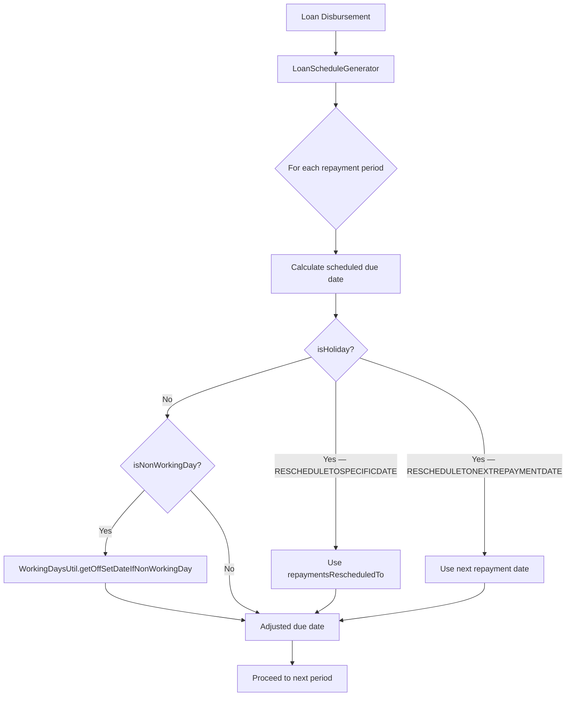

Fineract's repayment scheduling system must account for two classes of non-business days: **holidays** (discrete named periods such as national or regional public holidays, defined per office) and **non-working days** (recurring weekday patterns configured globally). The `Holiday` entity captures multi-day periods that must trigger repayment rescheduling. `WorkingDays` stores an RFC 2445 iCal RRULE string that tells the engine which days of the week are working days. Both are consumed by `HolidayUtil` and `WorkingDaysUtil` at schedule-generation time.

---

## File Inventory

| File | Module | Purpose |
|------|--------|---------|
| `fineract-core/…/organisation/holiday/domain/Holiday.java` | fineract-core | Holiday JPA entity — `m_holiday` |
| `fineract-core/…/organisation/holiday/domain/HolidayStatusType.java` | fineract-core | State enum for Holiday lifecycle |
| `fineract-core/…/organisation/holiday/domain/RescheduleType.java` | fineract-core | How repayments are moved when on a holiday |
| `fineract-provider/…/organisation/holiday/api/HolidaysApiResource.java` | fineract-provider | JAX-RS REST for holidays |
| `fineract-provider/…/organisation/holiday/handler/CreateHolidayCommandHandler.java` | fineract-provider | |
| `fineract-provider/…/organisation/holiday/handler/ActivateHolidayCommandHandler.java` | fineract-provider | |
| `fineract-provider/…/organisation/holiday/handler/UpdateHolidayCommandHandler.java` | fineract-provider | |
| `fineract-provider/…/organisation/holiday/handler/DeleteHolidayCommandHandler.java` | fineract-provider | |
| `fineract-provider/…/organisation/holiday/service/HolidayWritePlatformServiceJpaRepositoryImpl.java` | fineract-provider | Write service |
| `fineract-provider/…/organisation/holiday/service/HolidayReadPlatformServiceImpl.java` | fineract-provider | Read service |
| `fineract-core/…/organisation/holiday/service/HolidayUtil.java` | fineract-core | Pure utility — date adjustment logic |
| `fineract-core/…/organisation/workingdays/domain/WorkingDays.java` | fineract-core | Working-days entity — `m_working_days` |
| `fineract-core/…/organisation/workingdays/domain/RepaymentRescheduleType.java` | fineract-core | Enum for non-working-day adjustment strategy |
| `fineract-core/…/organisation/workingdays/service/WorkingDaysUtil.java` | fineract-core | Pure utility — working-day check + offset |
| `fineract-provider/…/organisation/workingdays/api/WorkingDaysApiResource.java` | fineract-provider | JAX-RS REST for working days |
| `fineract-core/…/organisation/workingdays/data/AdjustedDateDetailsDTO.java` | fineract-core | DTO carrying changed schedule + actual repayment date |
| `fineract-core/…/portfolio/calendar/service/CalendarUtils.java` | fineract-core | iCal4j-based RRULE evaluation utility |

---

## Holiday Entity

**Source**: `fineract-core/src/main/java/org/apache/fineract/organisation/holiday/domain/Holiday.java`  
**Table**: `m_holiday`  
**Unique constraint**: `holiday_name` on `name` column

### Field Reference

| JPA Field | Column | Type | Notes |
|-----------|--------|------|-------|
| `name` | `name` | `VARCHAR(100)` | Globally unique |
| `fromDate` | `from_date` | `DATE` | Holiday start (inclusive) |
| `toDate` | `to_date` | `DATE` | Holiday end (inclusive) |
| `repaymentsRescheduledTo` | `repayments_rescheduled_to` | `DATE` | Target date when using `RESCHEDULETOSPECIFICDATE`; `null` when using `RESCHEDULETONEXTREPAYMENTDATE` |
| `reschedulingType` | `rescheduling_type` | `INTEGER` | See `RescheduleType` |
| `status` | `status_enum` | `INTEGER` | See `HolidayStatusType` |
| `processed` | `processed` | `BOOLEAN` | Set to `true` by batch job after repayments are rescheduled |
| `description` | `description` | `VARCHAR(100)` | Free text |
| `offices` | `m_holiday_office` | `ManyToMany<Office>` eager | Join table: `holiday_id` ↔ `office_id` |

---

## HolidayStatusType Enum

**Source**: `fineract-core/…/organisation/holiday/domain/HolidayStatusType.java`

| Constant | Value | Description |
|----------|-------|-------------|
| `INVALID` | 0 | Fallback |
| `PENDING_FOR_ACTIVATION` | 100 | Default state on creation |
| `ACTIVE` | 300 | Holiday activated; only active holidays trigger rescheduling |
| `DELETED` | 600 | Soft-deleted |

**State transitions**: `PENDING_FOR_ACTIVATION → ACTIVE` (via `activate` command), `PENDING_FOR_ACTIVATION / ACTIVE → DELETED` (via `delete` command). Reverting a deletion is not supported.

<Warning>
Only **ACTIVE** holidays participate in repayment rescheduling. A holiday created but not yet activated has no effect on schedules, even if its date range is in the future.
</Warning>

---

## RescheduleType Enum

**Source**: `fineract-core/…/organisation/holiday/domain/RescheduleType.java`

| Constant | Value | Behaviour |
|----------|-------|-----------|
| `INVALID` | 0 | Fallback |
| `RESCHEDULETONEXTREPAYMENTDATE` | 1 | Move repayment to the next scheduled repayment date |
| `RESCHEDULETOSPECIFICDATE` | 2 | Move repayment to the explicit `repaymentsRescheduledTo` date |

When `RESCHEDULETONEXTREPAYMENTDATE` is chosen, the `repaymentsRescheduledTo` field is set to `null` (cleared in `Holiday.update()`).

---

## HolidaysApiResource — REST Endpoints

**Path prefix**: `/v1/holidays`  
**Source**: `fineract-provider/…/organisation/holiday/api/HolidaysApiResource.java`

| Method | Path | Command param | Description |
|--------|------|---------------|-------------|
| `GET` | `/v1/holidays` | — | List holidays; query: `officeId`, `fromDate`, `toDate`, `locale`, `dateFormat` |
| `GET` | `/v1/holidays/{holidayId}` | — | Retrieve one holiday |
| `GET` | `/v1/holidays/template` | — | Returns rescheduling type options |
| `POST` | `/v1/holidays` | — | Create holiday; mandatory: `name`, `description`, `fromDate`, `toDate`, `offices[]`; `repaymentsRescheduledTo` required when `reschedulingType=2` |
| `POST` | `/v1/holidays/{holidayId}?command=activate` | `activate` | Activate a pending holiday |
| `PUT` | `/v1/holidays/{holidayId}` | — | Update; date fields only editable in PENDING state |
| `DELETE` | `/v1/holidays/{holidayId}` | — | Soft-delete (status → 600) |

**Response parameters** (from `HOLIDAY_RESPONSE_DATA_PARAMETERS` constant in `HolidayApiConstants`):
`id`, `name`, `fromDate`, `toDate`, `repaymentsRescheduledTo`, `status`, `description`, `locale`, `dateFormat`

---

## HolidayUtil

**Source**: `fineract-core/src/main/java/org/apache/fineract/organisation/holiday/service/HolidayUtil.java`

Pure utility class (no Spring beans). All methods are `public static`.

| Method | Signature | Description |
|--------|-----------|-------------|
| `isHoliday` | `(LocalDate date, List<Holiday> holidays) → boolean` | Returns `true` if `date` falls within any holiday's `fromDate`–`toDate` range |
| `isHoliday` | `(LocalDate date, Holiday holiday) → boolean` | Single-holiday range check: `!date.isBefore(fromDate) && !date.isAfter(toDate)` |
| `getApplicableHoliday` | `(LocalDate date, List<Holiday> holidays) → Holiday` | Returns the first matching holiday or `null` |
| `getRepaymentRescheduleDateToIfHoliday` | `(LocalDate repaymentDate, List<Holiday> holidays) → LocalDate` | Iterates holidays; replaces repayment date with `holiday.repaymentsRescheduledTo` if hit |
| `updateRepaymentRescheduleDateToWorkingDayIfItIsHoliday` | `(AdjustedDateDetailsDTO dto, Holiday holiday) → void` | If holiday uses `RESCHEDULETOSPECIFICDATE`, updates `dto.changedScheduleDate` |

<Note>
`getRepaymentRescheduleDateToIfHoliday` iterates all holidays sequentially. If a repayment is rescheduled into another holiday's range, the outer loop will catch it on the next iteration — but only if the holidays list is ordered chronologically and complete.
</Note>

---

## WorkingDays Entity

**Source**: `fineract-core/src/main/java/org/apache/fineract/organisation/workingdays/domain/WorkingDays.java`  
**Table**: `m_working_days`

```java
@Entity
@Table(name = "m_working_days")
public class WorkingDays extends AbstractPersistableCustom<Long> {
    @Column(name = "recurrence", length = 100)
    private String recurrence;

    @Column(name = "repayment_rescheduling_enum", nullable = false)
    private Integer repaymentReschedulingType;

    @Column(name = "extend_term_daily_repayments", nullable = false)
    private Boolean extendTermForDailyRepayments;

    @Column(name = "extend_term_holiday_repayment", nullable = false)
    private Boolean extendTermForRepaymentsOnHolidays;
}
```

### Field Reference

| Field | Column | Type | Notes |
|-------|--------|------|-------|
| `recurrence` | `recurrence` | `VARCHAR(100)` | RFC 2445 RRULE string (see below) |
| `repaymentReschedulingType` | `repayment_rescheduling_enum` | `INTEGER` | See `RepaymentRescheduleType` |
| `extendTermForDailyRepayments` | `extend_term_daily_repayments` | `BOOLEAN` | Extend loan term when repayment moved forward |
| `extendTermForRepaymentsOnHolidays` | `extend_term_holiday_repayment` | `BOOLEAN` | Extend loan term when repayment moved due to holiday |

### RRULE Format

The `recurrence` field stores an RFC 2445 / iCal RRULE fragment, for example:

```
FREQ=WEEKLY;INTERVAL=1;BYDAY=MO,TU,WE,TH,FR
```

This encodes "every week on Monday–Friday", meaning Saturday and Sunday are non-working days. The iCal4j library parses this string inside `CalendarUtils.isValidRecurringDate()`.

---

## RepaymentRescheduleType Enum

**Source**: `fineract-core/…/organisation/workingdays/domain/RepaymentRescheduleType.java`

| Constant | Value | Description |
|----------|-------|-------------|
| `INVALID` | 0 | Fallback |
| `SAME_DAY` | 1 | Keep repayment on the non-working day (transact on next business day) |
| `MOVE_TO_NEXT_WORKING_DAY` | 2 | Advance to the next working day (`+1` recursively) |
| `MOVE_TO_NEXT_REPAYMENT_MEETING_DAY` | 3 | Move to the next scheduled meeting date |
| `MOVE_TO_PREVIOUS_WORKING_DAY` | 4 | Retreat to the prior working day (`-1` recursively) |
| `MOVE_TO_NEXT_MEETING_DAY` | 5 | Move to the next meeting day (broader than repayment meeting) |

---

## WorkingDaysUtil

**Source**: `fineract-core/src/main/java/org/apache/fineract/organisation/workingdays/service/WorkingDaysUtil.java`

All methods are `public static`.

| Method | Signature | Description |
|--------|-----------|-------------|
| `isWorkingDay` | `(WorkingDays workingDays, LocalDate date) → boolean` | Delegates to `CalendarUtils.isValidRecurringDate(recurrence, date, date)` |
| `isNonWorkingDay` | `(WorkingDays workingDays, LocalDate date) → boolean` | Negation of `isWorkingDay` |
| `getOffSetDateIfNonWorkingDay` | `(LocalDate date, LocalDate nextMeetingDate, WorkingDays workingDays) → LocalDate` | Core reschedule logic (see below) |
| `updateWorkingDayIfRepaymentDateIsNonWorkingDay` | `(AdjustedDateDetailsDTO dto, WorkingDays workingDays) → void` | Mutates `dto.changedScheduleDate` via `getOffSetDateIfNonWorkingDay` |
| `getRepaymentRescheduleType` | `(WorkingDays workingDays) → RepaymentRescheduleType` | Convenience accessor |

### `getOffSetDateIfNonWorkingDay` Logic

```java
switch (rescheduleType) {
    case INVALID:
    case SAME_DAY:              return date;           // No change
    case MOVE_TO_NEXT_WORKING_DAY:
        return getOffSetDateIfNonWorkingDay(date.plusDays(1), nextMeetingDate, workingDays);  // Recursive +1
    case MOVE_TO_NEXT_REPAYMENT_MEETING_DAY:
        return nextMeetingDate;                        // Use pre-computed next meeting
    case MOVE_TO_PREVIOUS_WORKING_DAY:
        return getOffSetDateIfNonWorkingDay(date.minusDays(1), nextMeetingDate, workingDays); // Recursive -1
    default:
        return date;  // MOVE_TO_NEXT_MEETING_DAY(5) also falls here
}
```

<Warning>
`MOVE_TO_NEXT_WORKING_DAY` and `MOVE_TO_PREVIOUS_WORKING_DAY` are **recursive** — they can consume significant stack if many consecutive non-working days exist (e.g. a long public-holiday block). For week-long holiday periods use `Holiday` rescheduling instead of relying on the working-day recursion.
</Warning>

---

## WorkingDaysApiResource — REST Endpoints

**Path prefix**: `/v1/workingdays`  
**Source**: `fineract-provider/…/organisation/workingdays/api/WorkingDaysApiResource.java`

| Method | Path | Description |
|--------|------|-------------|
| `GET` | `/v1/workingdays` | Retrieve the single `WorkingDays` record |
| `PUT` | `/v1/workingdays` | Update working days; mandatory: `recurrence`, `repaymentRescheduleType`, `extendTermForDailyRepayments`, `locale` |
| `GET` | `/v1/workingdays/template` | Returns `repaymentRescheduleType` option list |

The `PUT` body uses `WorkingDaysUpdateRequest` (validated by `WorkingDaysUpdateRequestValidator`) and dispatches `WorkingDaysUpdateCommand`.

---

## CalendarUtils — iCal RRULE Engine

**Source**: `fineract-core/src/main/java/org/apache/fineract/portfolio/calendar/service/CalendarUtils.java`

This utility wraps the **iCal4j** library (`net.fortuna.ical4j`) to parse and evaluate RFC 2445 RRULE strings. The system property `net.fortuna.ical4j.timezone.date.floating=true` is set in a static initialiser to avoid timezone complications.

### Key Public Methods

| Method | Description |
|--------|-------------|
| `getNextRecurringDate(String recurringRule, LocalDate seedDate, LocalDate startDate)` | Returns the next date in the recurrence series on or after `startDate`, computed from `seedDate` |
| `getNextRecurringDate(String recurringRule, LocalDateTime seedDate, LocalDateTime startDate)` | `LocalDateTime` overload |
| `getRecurringDates(String recurringRule, LocalDate seedDate, LocalDate endDate)` | Returns all occurrences from `seedDate` to `endDate` |
| `getRecurringDatesFrom(String recurringRule, LocalDate seedDate, LocalDate startDate, LocalDate endDate)` | Bounded date-range version |
| `isValidRecurringDate(String recurringRule, LocalDate seedDate, LocalDate date)` | Returns `true` if `date` matches the recurrence |
| `adjustRecurringDate(LocalDate recurringDate, Integer numberOfDays)` | Advance by N days |
| `getFirstRepaymentMeetingDate(Calendar calendar, LocalDate disbursementDate, …)` | First repayment date for a group calendar |
| `getNewRepaymentMeetingDate(String recurringRule, LocalDate seedDate, LocalDate repaymentDate, …)` | Adjusted repayment meeting date |
| `getNextRepaymentMeetingDate(…)` | Several overloads for next meeting computation |
| `getMeetingPeriodFrequencyType(String recurringRule)` | Parses `FREQ=` from the rule |
| `isFrequencySame(String oldRRule, String newRRule)` | Compares `FREQ` values |
| `isIntervalSame(String oldRRule, String newRRule)` | Compares `INTERVAL` values |
| `adjustDate(Temporal date, Temporal seedDate, PeriodFrequencyType frequencyType)` | Month-end day adjustment for seeds on day > 28 |

`isValidRecurringDate` is the critical path for `WorkingDaysUtil.isWorkingDay`. It creates an iCal4j `Recur` from the stored RRULE, then calls `recur.getNextDate(seed, periodStart)` and checks if the result equals `date`.

---

## AdjustedDateDetailsDTO

**Source**: `fineract-core/…/organisation/workingdays/data/AdjustedDateDetailsDTO.java`

This mutable DTO threads adjusted dates through both `HolidayUtil` and `WorkingDaysUtil`:

| Field | Description |
|-------|-------------|
| `changedScheduleDate` | The schedule date after adjustment (holiday or working-day shift) |
| `changedActualRepaymentDate` | The date used for the actual repayment transaction entry |
| `nextRepaymentPeriodDueDate` | Pre-computed next period due date (for `MOVE_TO_NEXT_REPAYMENT_MEETING_DAY`) |

---

## Schedule Generation & Holiday/Working-Day Interplay



**Processing order**: Holiday adjustments are applied **first** (via `HolidayUtil`), then working-day adjustments (via `WorkingDaysUtil`). This means a date rescheduled from a holiday can subsequently land on a non-working day and be adjusted again.

Both adjustments are mediated through `AdjustedDateDetailsDTO`:
1. A new `AdjustedDateDetailsDTO` is constructed with the raw computed date.
2. `HolidayUtil.updateRepaymentRescheduleDateToWorkingDayIfItIsHoliday(dto, holiday)` is called if the date is a holiday.
3. `WorkingDaysUtil.updateWorkingDayIfRepaymentDateIsNonWorkingDay(dto, workingDays)` is called unconditionally.
4. `dto.getChangedScheduleDate()` is used as the final schedule date.

---

## Global Configuration Flags

The holiday and working-day behaviour is gated by **global configuration parameters** (stored in `m_configuration`):

| Config Key | Effect when enabled |
|------------|---------------------|
| `reschedule-repayments-on-holidays` | Activates `Holiday`-based repayment rescheduling |
| `allow-transactions-on-holiday` | Allows loan repayment posting on holiday dates |
| `reschedule-future-repayments` | Activates `WorkingDays`-based rescheduling |
| `allow-transactions-on-non-workingday` | Allows posting on non-working days |

These are read by `HolidayWritePlatformServiceJpaRepositoryImpl` and the schedule generators. Disabling `reschedule-repayments-on-holidays` means active holidays have no effect on new schedules.

---

## Gotchas & Invariants

<Accordion title="Holiday activation is irreversible for date fields">
Once a `Holiday` is `ACTIVE`, `fromDate`, `toDate`, `repaymentsRescheduledTo`, and `offices` fields **cannot be changed**. Only `name` and `description` are mutable in active state. The `update()` method throws `failWithCode("cannot.edit.holiday.in.active.state")` for any date or office field change.
</Accordion>

<Accordion title="processed flag and batch jobs">
The `processed` boolean on `Holiday` starts `false`. A batch job (scheduled via `ActivateHolidayScheduledJobService`) sets it to `true` after applying the rescheduling to existing loan repayments. New loan disbursements after the holiday is created will have the rescheduling applied at schedule-generation time regardless of `processed`.
</Accordion>

<Accordion title="WorkingDays — single row per tenant">
There is exactly one `WorkingDays` row per tenant in `m_working_days`. `PUT /v1/workingdays` updates that row in-place. There is no history or audit trail for past RRULE values. If you change the RRULE, all *future* schedule calculations use the new rule but existing loan schedules are unaffected until explicitly regenerated.
</Accordion>

<Accordion title="iCal4j RRULE BYDAY values">
The `BYDAY` component uses two-letter RFC 2445 day codes: `MO`, `TU`, `WE`, `TH`, `FR`, `SA`, `SU`. Submitting invalid codes silently produces an empty result set from `CalendarUtils`, effectively marking every day as a non-working day. Validate RRULE strings before persisting.
</Accordion>

<Accordion title="Office-level holiday scoping">
A `Holiday` is linked to one or more `Office` records via the `m_holiday_office` join table. `HolidayReadPlatformServiceImpl.retrieveHolidaysByEnclosingScope(officeId)` walks the office hierarchy to collect all applicable holidays for a given office — a child office inherits parent-office holidays.
</Accordion>

<Accordion title="CalendarUtils month-end adjustment">
`adjustDate(Temporal date, Temporal seedDate, PeriodFrequencyType)` applies a month-end correction: if the `seedDate` is on day > 28 and the computed next month has fewer days, the day is pinned to the last day of that month. This prevents "February 30" overflow in monthly schedules.
</Accordion>
