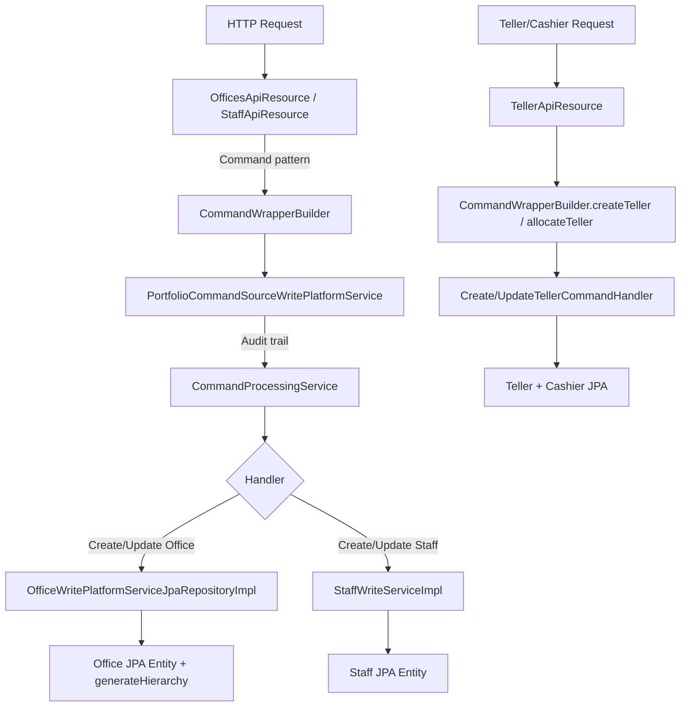

Fineract models a micro-finance institution's organisational structure through a set of closely related modules. The `Office` entity forms a tree-shaped hierarchy. `Staff` members are attached to offices and can be designated as loan officers. The `fineract-branch` module extends this with cash-management via `Teller` and `Cashier`. `Fund` records name the funding sources attached to loan products. `AccountNumberFormat` lets administrators configure auto-generated account-number prefixes. `CurrenciesApiResource` controls the currencies the MFI is permitted to use.

---

## File Inventory

| File | Module | Purpose |
|------|--------|---------|
| `fineract-core/…/organisation/office/domain/Office.java` | fineract-core | Office JPA entity — `m_office` table |
| `fineract-provider/…/organisation/office/api/OfficesApiResource.java` | fineract-provider | JAX-RS REST resource for offices |
| `fineract-provider/…/organisation/office/api/OfficeTransactionsApiResource.java` | fineract-provider | Inter-office money transfer endpoints |
| `fineract-provider/…/organisation/office/domain/OfficeTransaction.java` | fineract-provider | `m_office_transactions` entity |
| `fineract-provider/…/organisation/office/service/OfficeWritePlatformServiceJpaRepositoryImpl.java` | fineract-provider | Office write operations |
| `fineract-core/…/organisation/staff/domain/Staff.java` | fineract-core | Staff JPA entity — `m_staff` table |
| `fineract-provider/…/organisation/staff/api/StaffApiResource.java` | fineract-provider | JAX-RS REST resource for staff |
| `fineract-branch/…/organisation/teller/domain/Teller.java` | fineract-branch | Teller entity — `m_tellers` table |
| `fineract-branch/…/organisation/teller/domain/Cashier.java` | fineract-branch | Cashier entity — `m_cashiers` table |
| `fineract-branch/…/organisation/teller/api/TellerApiResource.java` | fineract-branch | All teller + cashier endpoints |
| `fineract-branch/…/organisation/teller/api/CashierApiResource.java` | fineract-branch | Cashier list endpoint |
| `fineract-branch/…/organisation/teller/domain/CashierTransaction.java` | fineract-branch | Cash allocation/settlement rows |
| `fineract-branch/…/organisation/teller/domain/TellerStatus.java` | fineract-branch | `PENDING(100)`, `ACTIVE(300)`, `INACTIVE(400)`, `CLOSED(600)` enum |
| `fineract-branch/…/organisation/teller/domain/CashierTxnType.java` | fineract-branch | `ALLOCATE`, `SETTLE`, `INWARD`, `OUTWARD` enum |
| `fineract-core/…/portfolio/fund/domain/Fund.java` | fineract-core | Fund entity — `m_fund` table |
| `fineract-provider/…/portfolio/fund/api/FundsApiResource.java` | fineract-provider | Fund CRUD endpoints |
| `fineract-core/…/infrastructure/accountnumberformat/domain/AccountNumberFormat.java` | fineract-core | AccountNumberFormat entity — `m_account_number_format` |
| `fineract-core/…/infrastructure/accountnumberformat/domain/AccountNumberFormatEnumerations.java` | fineract-core | `EntityAccountType` + `AccountNumberPrefixType` enums |
| `fineract-provider/…/infrastructure/accountnumberformat/api/AccountNumberFormatsApiResource.java` | fineract-provider | Account number format CRUD |
| `fineract-core/…/organisation/monetary/api/CurrenciesApiResource.java` | fineract-core | Currency configuration GET/PUT |

---

## Office Entity

**Source**: `fineract-core/src/main/java/org/apache/fineract/organisation/office/domain/Office.java`  
**Table**: `m_office`

```java
@Entity
@Table(name = "m_office",
  uniqueConstraints = {
    @UniqueConstraint(columnNames={"name"}, name="name_org"),
    @UniqueConstraint(columnNames={"external_id"}, name="externalid_org")
  })
public class Office extends AbstractPersistableCustom<Long> { … }
```

### Field Reference

| JPA Field | Column | Type | Notes |
|-----------|--------|------|-------|
| `name` | `name` | `VARCHAR(100)` | Globally unique, trimmed on save |
| `hierarchy` | `hierarchy` | `VARCHAR(50)` | Dot-delimited path string (see below) |
| `openingDate` | `opening_date` | `DATE` | Non-nullable |
| `externalId` | `external_id` | `VARCHAR(100)` | Wrapped in `ExternalId` value object; optional |
| `parent` | `parent_id` | `ManyToOne<Office>` | `null` for the head (root) office |
| `children` | `parent_id` | `OneToMany<Office>` | Lazy-loaded child offices |

### Hierarchy String Format

The `hierarchy` column encodes the full ancestry path. The `generateHierarchy()` method in `Office.java` builds this string:

```java
public void generateHierarchy() {
    if (this.parent != null) {
        this.hierarchy = this.parent.hierarchyOf(getId()); // parent.hierarchy + id + "."
    } else {
        this.hierarchy = ".";   // root office
    }
}
private String hierarchyOf(final Long id) {
    return this.hierarchy + id.toString() + ".";
}
```

**Example tree**:

```
Root office (id=1):  hierarchy = "."
  └─ Regional (id=2): hierarchy = ".1."
       └─ Branch (id=5): hierarchy = ".1.2."
            └─ Sub-branch (id=9): hierarchy = ".1.2.5."
```

Security queries filter by `LIKE hierarchy%` so a user restricted to office 2 sees `".1.2%"`.

<Note>
Root office `parent` is `null`. Calling `RootOfficeParentCannotBeUpdated` is thrown when attempting to update `parentId` on the root. You cannot set an office's own ID as its parent (`CannotUpdateOfficeWithParentOfficeSameAsSelf`).
</Note>

---

## OfficesApiResource — REST Endpoints

**Path prefix**: `/v1/offices`  
**Source**: `fineract-provider/…/organisation/office/api/OfficesApiResource.java`

| Method | Path | Operation | Description |
|--------|------|-----------|-------------|
| `GET` | `/v1/offices` | `List Offices` | Query params: `includeAllOffices`, `orderBy`, `sortOrder` |
| `GET` | `/v1/offices/template` | `Retrieve Office Details Template` | Returns allowed parent list |
| `POST` | `/v1/offices` | `Create an Office` | Mandatory: `name`, `openingDate`, `parentId` |
| `GET` | `/v1/offices/{officeId}` | `Retrieve an Office` | Add `?template=true` to include allowed parents |
| `GET` | `/v1/offices/external-id/{externalId}` | `Retrieve an Office using external id` | External-ID lookup |
| `PUT` | `/v1/offices/{officeId}` | `Update Office` | All fields editable; root office `parentId` blocked |
| `PUT` | `/v1/offices/external-id/{externalId}` | `Update Office (external id)` | Same body as `PUT /{officeId}` |
| `GET` | `/v1/offices/downloadtemplate` | Bulk-import template download | Returns `.xlsx` |
| `POST` | `/v1/offices/uploadtemplate` | Bulk-import Excel upload | `multipart/form-data` |

**Response parameters** (controlled by `RESPONSE_DATA_PARAMETERS`):
`id`, `name`, `nameDecorated`, `externalId`, `openingDate`, `hierarchy`, `parentId`, `parentName`, `allowedParents`

---

## Staff Entity

**Source**: `fineract-core/src/main/java/org/apache/fineract/organisation/staff/domain/Staff.java`  
**Table**: `m_staff`

```java
@Entity
@Table(name = "m_staff",
  uniqueConstraints = {
    @UniqueConstraint(columnNames={"display_name"}, name="display_name"),
    @UniqueConstraint(columnNames={"external_id"}, name="external_id_UNIQUE"),
    @UniqueConstraint(columnNames={"mobile_no"}, name="mobile_no_UNIQUE")
  })
public class Staff extends AbstractPersistableCustom<Long> { … }
```

### Field Reference

| JPA Field | Column | Type | Notes |
|-----------|--------|------|-------|
| `firstname` | `firstname` | `VARCHAR(50)` | Optional |
| `lastname` | `lastname` | `VARCHAR(50)` | Optional |
| `displayName` | `display_name` | `VARCHAR(100)` | Globally unique; computed from first+last |
| `mobileNo` | `mobile_no` | `VARCHAR(50)` | Unique, non-nullable |
| `externalId` | `external_id` | `VARCHAR(100)` | Unique |
| `emailAddress` | `email_address` | `VARCHAR(50)` | Unique |
| `office` | `office_id` | `ManyToOne<Office>` | Non-nullable |
| `loanOfficer` | `is_loan_officer` | `BOOLEAN` | Determines visibility in loan officer dropdowns |
| `active` | `is_active` | `BOOLEAN` | Filter via `?status=active/inactive/all` |
| `joiningDate` | `joining_date` | `DATE` | Optional |
| `organisationalRoleType` | `organisational_role_enum` | `INTEGER` | Optional role encoding |
| `organisationalRoleParentStaff` | `organisational_role_parent_staff_id` | `ManyToOne<Staff>` | Supervisor reference |
| `imageId` | `image_id` | `BIGINT` | FK to document store |

### StaffApiResource — REST Endpoints

**Path prefix**: `/v1/staff`  
**Source**: `fineract-provider/…/organisation/staff/api/StaffApiResource.java`

| Method | Path | Operation | Description |
|--------|------|-----------|-------------|
| `GET` | `/v1/staff` | `Retrieve Staff` | Query: `officeId`, `staffInOfficeHierarchy` (bool), `loanOfficersOnly` (bool), `status` (`active`/`inactive`/`all`) |
| `GET` | `/v1/staff/{staffId}` | `Retrieve a Staff Member` | Add `?template=true` for office dropdown |
| `POST` | `/v1/staff` | `Create a staff member` | Mandatory: `officeId`, `firstname`, `lastname`. Dispatches `StaffCreateCommand` |
| `PUT` | `/v1/staff/{staffId}` | `Update a Staff Member` | Dispatches `StaffUpdateCommand` |
| `GET` | `/v1/staff/downloadtemplate` | Bulk-import template | Query: `officeId`, `dateFormat` |
| `POST` | `/v1/staff/uploadtemplate` | Bulk-import upload | `multipart/form-data` |

<Tip>
`staffInOfficeHierarchy=true` calls `StaffReadServiceImpl.retrieveAllStaffInOfficeAndItsParentOfficeHierarchy`, which walks up the parent hierarchy collecting staff from all ancestor offices — useful for group/centre assignment dropdowns.
</Tip>

---

## Teller & Cashier (fineract-branch)

The `fineract-branch` module adds branch cash-management on top of the core. It introduces three aggregate roots: `Teller` (the physical cash drawer), `Cashier` (a staff member operating the teller for a date range), and `CashierTransaction` (individual cash-in/cash-out events).

<CardGroup cols={2}>
  <Card title="Teller" icon="cash-register">
    Represents a physical cash point at a branch. Linked to one `Office`, optionally linked to debit/credit `GLAccount` for accounting entries.
  </Card>
  <Card title="Cashier" icon="user-tie">
    A `Staff` member allocated to a `Teller` for a date range. One staff ↔ one teller combination enforced by unique constraint `ux_cashiers_staff_teller`.
  </Card>
</CardGroup>

### Teller Entity — `m_tellers`

**Source**: `fineract-branch/…/organisation/teller/domain/Teller.java`

| Field | Column | Type |
|-------|--------|------|
| `office` | `office_id` | `ManyToOne<Office>` |
| `debitAccount` | `debit_account_id` | `ManyToOne<GLAccount>` |
| `creditAccount` | `credit_account_id` | `ManyToOne<GLAccount>` |
| `name` | `name` | `VARCHAR(100)` unique |
| `description` | `description` | `VARCHAR(500)` |
| `startDate` | `valid_from` | `DATE` |
| `endDate` | `valid_to` | `DATE` |
| `status` | `state` | `INTEGER` (see `TellerStatus`) |
| `cashiers` | — | `OneToMany<Cashier>` lazy |

**`TellerStatus`** enum (`fineract-branch/…/teller/domain/TellerStatus.java`):

| Name | Value |
|------|-------|
| `INVALID` | 0 |
| `PENDING` | 100 |
| `ACTIVE` | 300 |
| `INACTIVE` | 400 |
| `CLOSED` | 600 |

### Cashier Entity — `m_cashiers`

**Source**: `fineract-branch/…/organisation/teller/domain/Cashier.java`

| Field | Column | Type |
|-------|--------|------|
| `staff` | `staff_id` | `ManyToOne<Staff>` |
| `teller` | `teller_id` | `ManyToOne<Teller>` |
| `description` | `description` | `VARCHAR(500)` |
| `startDate` | `start_date` | `DATE` |
| `endDate` | `end_date` | `DATE` |
| `isFullDay` | `full_day` | `BOOLEAN` |
| `startTime` | `start_time` | `VARCHAR(10)` format `"HH:mm"` |
| `endTime` | `end_time` | `VARCHAR(10)` format `"HH:mm"` |

### TellerApiResource — All Endpoints

**Path prefix**: `/v1/tellers`  
**Source**: `fineract-branch/…/organisation/teller/api/TellerApiResource.java`

| Method | Path | Description |
|--------|------|-------------|
| `GET` | `/v1/tellers` | List all tellers; query `?officeId=` |
| `GET` | `/v1/tellers/{tellerId}` | Retrieve a teller |
| `POST` | `/v1/tellers` | Create teller; mandatory: `name`, `officeId`, `description`, `startDate`, `status` |
| `PUT` | `/v1/tellers/{tellerId}` | Update teller |
| `DELETE` | `/v1/tellers/{tellerId}` | Delete teller |
| `GET` | `/v1/tellers/{tellerId}/cashiers` | List cashiers for teller; query `fromdate`, `todate` |
| `GET` | `/v1/tellers/{tellerId}/cashiers/template` | Cashier creation template |
| `GET` | `/v1/tellers/{tellerId}/cashiers/{cashierId}` | Retrieve a cashier |
| `POST` | `/v1/tellers/{tellerId}/cashiers` | Allocate cashier to teller |
| `PUT` | `/v1/tellers/{tellerId}/cashiers/{cashierId}` | Update cashier allocation |
| `DELETE` | `/v1/tellers/{tellerId}/cashiers/{cashierId}` | Remove cashier |
| `POST` | `/v1/tellers/{tellerId}/cashiers/{cashierId}/allocate` | Allocate cash to cashier (ALLOCATE txn) |
| `POST` | `/v1/tellers/{tellerId}/cashiers/{cashierId}/settle` | Settle cash from cashier (SETTLE txn) |
| `GET` | `/v1/tellers/{tellerId}/cashiers/{cashierId}/transactions` | Paginated cashier transactions |
| `GET` | `/v1/tellers/{tellerId}/cashiers/{cashierId}/summaryandtransactions` | Transactions + totals |
| `GET` | `/v1/tellers/{tellerId}/cashiers/{cashierId}/transactions/template` | Transaction template |
| `GET` | `/v1/tellers/{tellerId}/transactions` | Teller-level transactions; query `dateRange` |
| `GET` | `/v1/tellers/{tellerId}/transactions/{transactionId}` | Retrieve a single teller transaction |
| `GET` | `/v1/tellers/{tellerId}/journals` | Teller journals; query `cashierId`, `dateRange` |

**CashierApiResource** (`/v1/cashiers`) — simple list endpoint:

| Method | Path | Query Params |
|--------|------|-------------|
| `GET` | `/v1/cashiers` | `officeId`, `tellerId`, `staffId`, `date` |

---

## Fund Entity

**Source**: `fineract-core/src/main/java/org/apache/fineract/portfolio/fund/domain/Fund.java`  
**Table**: `m_fund`

| Field | Column | Type |
|-------|--------|------|
| `name` | `name` | `VARCHAR` unique (`fund_name_org`) |
| `externalId` | `external_id` | `VARCHAR(100)` unique (`fund_externalid_org`) |

### FundsApiResource Endpoints

**Path prefix**: `/v1/funds`  
**Source**: `fineract-provider/…/portfolio/fund/api/FundsApiResource.java`

| Method | Path | Description |
|--------|------|-------------|
| `GET` | `/v1/funds` | List all funds |
| `POST` | `/v1/funds` | Create fund; body: `FundRequest` with `name`, `externalId` |
| `GET` | `/v1/funds/{fundId}` | Retrieve a fund |
| `PUT` | `/v1/funds/{fundId}` | Update a fund |

Funds are referenced in loan products via `m_product_loan.fund_id`. They are purely a label/identifier — no business logic aside from uniqueness.

---

## Account Number Format

`AccountNumberFormat` (table `m_account_number_format`) stores one row per `EntityAccountType` specifying how account numbers should be prefixed.

**Source**: `fineract-core/…/infrastructure/accountnumberformat/domain/AccountNumberFormat.java`

| Field | Column | Type |
|-------|--------|------|
| `accountTypeEnum` | `account_type_enum` | `INTEGER` (see `EntityAccountType`) |
| `prefixEnum` | `prefix_type_enum` | `INTEGER` (see `AccountNumberPrefixType`) |
| `prefixCharacter` | `prefix_character` | `VARCHAR` custom string prefix |

### EntityAccountType Enum

**Source**: `fineract-core/…/accountnumberformat/domain/EntityAccountType.java`

| Name | Value | Notes |
|------|-------|-------|
| `CLIENT` | 1 | Client account numbers |
| `LOAN` | 2 | Loan account numbers |
| `SAVINGS` | 3 | Savings account numbers |
| `CENTER` | 4 | Center (group hub) |
| `GROUP` | 5 | Group account numbers |
| `SHARES` | 6 | Share account numbers |
| `WORKING_CAPITAL_LOAN` | 7 | Working-capital loan accounts |

### AccountNumberPrefixType Enum

**Source**: `AccountNumberFormatEnumerations.AccountNumberPrefixType` (inner enum)

| Name | Value | Valid for |
|------|-------|-----------|
| `OFFICE_NAME` | 1 | Client, Loan, Savings, Center, Group, WC Loan |
| `CLIENT_TYPE` | 101 | Client only |
| `LOAN_PRODUCT_SHORT_NAME` | 201 | Loan, WC Loan |
| `SAVINGS_PRODUCT_SHORT_NAME` | 301 | Savings |
| `PREFIX_SHORT_NAME` | 401 | Client, Loan, Savings (free-text prefix) |

The sets of allowed prefix types per account type are defined as unmodifiable `Set<AccountNumberPrefixType>` constants inside `AccountNumberFormatEnumerations`:
- `accountNumberPrefixesForClientAccounts`
- `accountNumberPrefixesForLoanAccounts`
- `accountNumberPrefixesForSavingsAccounts`
- `accountNumberPrefixesForCenters`
- `accountNumberPrefixesForGroups`
- `accountNumberPrefixesForWorkingCapitalLoanAccounts`

### AccountNumberFormatsApiResource Endpoints

**Path prefix**: defined by `AccountNumberFormatConstants.resourceRelativeURL` (`/v1/accountnumberformats`)  
**Source**: `fineract-provider/…/accountnumberformat/api/AccountNumberFormatsApiResource.java`

| Method | Path | Description |
|--------|------|-------------|
| `GET` | `/v1/accountnumberformats/template` | Retrieve template (all options) |
| `GET` | `/v1/accountnumberformats` | List all configured formats |
| `GET` | `/v1/accountnumberformats/{accountNumberFormatId}` | Retrieve one format |
| `POST` | `/v1/accountnumberformats` | Create; mandatory: `accountType`; optional: `prefixType`, `prefixCharacter` |
| `PUT` | `/v1/accountnumberformats/{accountNumberFormatId}` | Update format |
| `DELETE` | `/v1/accountnumberformats/{accountNumberFormatId}` | Delete format (existing numbers unchanged) |

<Warning>
Only **one** `AccountNumberFormat` row may exist per `EntityAccountType`. The unique constraint `ACCOUNT_TYPE_UNIQUE_CONSTRAINT_NAME` enforces this. `chargeAppliesTo` changes are forbidden after creation — likewise once an account type has a format, the format cannot be changed to a different account type.
</Warning>

---

## Organisation Currency Configuration

**Source**: `fineract-core/…/organisation/monetary/api/CurrenciesApiResource.java`  
**Table**: `m_organisation_currency`

| Method | Path | Description |
|--------|------|-------------|
| `GET` | `/v1/currencies` | Returns `selectedCurrencyOptions` (active) and `currencyOptions` (all available) |
| `PUT` | `/v1/currencies` | Update the permitted currency list; dispatches `CurrencyUpdateCommand` |

The service `OrganisationCurrencyReadPlatformService` reads from `m_organisation_currency`. The write path calls `CurrencyWritePlatformServiceJpaRepositoryImpl` which deletes rows not in the new list and inserts new ones.

---

## Control & Data Flow



---

## Cross-Module Connections

| This module | References | Via |
|-------------|------------|-----|
| `Office` | `m_staff` | `Staff.office` |
| `Office` | `m_tellers` | `Teller.office` |
| `Office` | `m_holiday_office` | join table linking holidays to offices |
| `Staff` | `m_cashiers` | `Cashier.staff` |
| `Staff` | loan/savings assignment | `m_loan.loan_officer_id`, `m_group.staff_id` |
| `Fund` | `m_product_loan` | `m_product_loan.fund_id` |
| `AccountNumberFormat` | account generation | `AccountNumberGenerator` service uses prefix at account creation |
| `Teller.debitAccount` / `creditAccount` | `m_glaccount` | Accounting entries for cash allocation/settlement |

---

## Gotchas & Invariants

<Accordion title="Root-office restrictions">
The root office has `parent = null` and `hierarchy = "."`. Attempting to set a `parentId` on it throws `RootOfficeParentCannotBeUpdated`. There is always exactly one root office per tenant — seeded at tenant provisioning time.
</Accordion>

<Accordion title="Hierarchy recalculation">
`generateHierarchy()` is called only when an office is moved to a new parent (`Office.update(Office newParent)`). Child offices are **not** recursively updated. The batch job `OfficeHierarchyUpdateScheduledJob` must be run or offices must be saved individually for deep subtree moves.
</Accordion>

<Accordion title="Cashier unique constraint">
`ux_cashiers_staff_teller(staff_id, teller_id)` prevents the same staff from being assigned to the same teller twice. `CashierAlreadyAllocated` is thrown if violated. A cashier's `startDate` and `endDate` must fall within the teller's `startDate`/`endDate`.
</Accordion>

<Accordion title="Account number format uniqueness">
One `AccountNumberFormat` per `EntityAccountType`. Creating a second one for the same type throws a database unique-constraint violation surfaced as `PlatformDataIntegrityException`.
</Accordion>

<Accordion title="Staff active/inactive filtering">
The default status filter is `active` (lowercase). Passing `status=ALL` (case-insensitive) returns both active and inactive staff. `staffInOfficeHierarchy=true` ignores the status filter and returns staff from the entire parent chain.
</Accordion>
