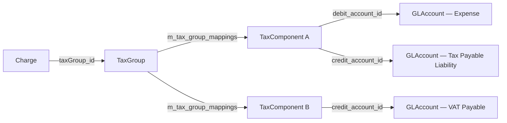
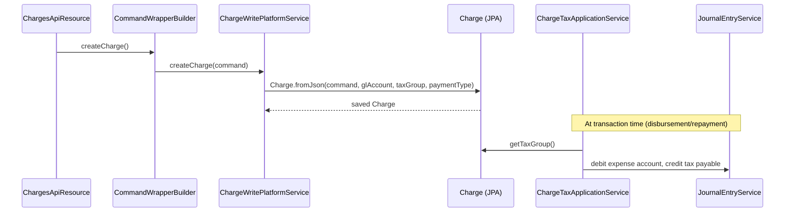

Fineract's revenue and cost model is built on three composable layers: **Charges** define the fee/penalty catalogue, **Tax** components and groups inject withholding-tax or VAT semantics on top of those charges, and **Floating Rates** / **Interest Rate Charts** allow variable or tiered interest to be attached to loan and savings products. All three layers live in separate Maven modules (`fineract-charge`, `fineract-tax`, `fineract-rates`, `fineract-savings`) to allow selective deployment.

---

## File Inventory

| File | Module | Purpose |
|------|--------|---------|
| `fineract-charge/…/portfolio/charge/domain/Charge.java` | fineract-charge | Main charge entity — `m_charge` table |
| `fineract-charge/…/portfolio/charge/domain/ChargeAppliesTo.java` | fineract-charge | Product-type enum (Loan/Savings/Client/Shares) |
| `fineract-core/…/portfolio/charge/domain/ChargeTimeType.java` | fineract-core | When the charge triggers (16 values) |
| `fineract-charge/…/portfolio/charge/domain/ChargeCalculationType.java` | fineract-charge | How the amount is computed (5 values) |
| `fineract-charge/…/portfolio/charge/domain/ChargePaymentMode.java` | fineract-charge | `REGULAR(0)`, `ACCOUNT_TRANSFER(1)` |
| `fineract-charge/…/portfolio/charge/api/ChargesApiResource.java` | fineract-charge | Charge CRUD REST resource |
| `fineract-charge/…/portfolio/charge/api/ChargesApiConstants.java` | fineract-charge | JSON param name constants |
| `fineract-tax/…/portfolio/tax/domain/TaxComponent.java` | fineract-tax | Tax component — `m_tax_component` |
| `fineract-tax/…/portfolio/tax/domain/TaxGroup.java` | fineract-tax | Tax group — `m_tax_group` |
| `fineract-tax/…/portfolio/tax/domain/TaxGroupMappings.java` | fineract-tax | Join table — `m_tax_group_mappings` |
| `fineract-tax/…/portfolio/tax/domain/TaxComponentHistory.java` | fineract-tax | Historical percentage rows |
| `fineract-tax/…/portfolio/tax/api/TaxComponentApiResource.java` | fineract-tax | Tax component CRUD at `/v1/taxes/component` |
| `fineract-tax/…/portfolio/tax/api/TaxGroupApiResource.java` | fineract-tax | Tax group CRUD at `/v1/taxes/group` |
| `fineract-tax/…/portfolio/tax/service/ChargeTaxApplicationService.java` | fineract-tax | Applies tax on charge amounts |
| `fineract-rates/…/floatingrates/domain/FloatingRate.java` | fineract-rates | Floating rate — `m_floating_rates` |
| `fineract-rates/…/floatingrates/domain/FloatingRatePeriod.java` | fineract-rates | Rate period — `m_floating_rates_periods` |
| `fineract-rates/…/floatingrates/api/FloatingRatesApiResource.java` | fineract-rates | Floating rate CRUD |
| `fineract-savings/…/interestratechart/domain/InterestRateChartSlab.java` | fineract-savings | Slab / band entity |
| `fineract-provider/…/interestratechart/api/InterestRateChartsApiResource.java` | fineract-provider | Interest rate chart CRUD |
| `fineract-provider/…/interestratechart/api/InterestRateChartSlabsApiResource.java` | fineract-provider | Slab CRUD nested under chart |

---

## Charge Entity

**Source**: `fineract-charge/src/main/java/org/apache/fineract/portfolio/charge/domain/Charge.java`  
**Table**: `m_charge`  
**Unique constraint**: `name` column

### Field Reference

| JPA Field | Column | Type | Notes |
|-----------|--------|------|-------|
| `name` | `name` | `VARCHAR(100)` | Global unique |
| `amount` | `amount` | `DECIMAL(19,6)` | Default/flat amount |
| `currencyCode` | `currency_code` | `VARCHAR(3)` | ISO 4217 |
| `chargeAppliesTo` | `charge_applies_to_enum` | `INTEGER` | See `ChargeAppliesTo` |
| `chargeTimeType` | `charge_time_enum` | `INTEGER` | See `ChargeTimeType` |
| `chargeCalculation` | `charge_calculation_enum` | `INTEGER` | See `ChargeCalculationType` |
| `chargePaymentMode` | `charge_payment_mode_enum` | `INTEGER` | `REGULAR=0`, `ACCOUNT_TRANSFER=1` |
| `penalty` | `is_penalty` | `BOOLEAN` | `true` ⇒ penalty, `false` ⇒ fee |
| `active` | `is_active` | `BOOLEAN` | Inactive charges cannot be applied |
| `deleted` | `is_deleted` | `BOOLEAN` | Soft-delete; name prefixed with `id_` on delete |
| `feeOnDay` | `fee_on_day` | `INTEGER` | Day portion of `ANNUAL_FEE` / `MONTHLY_FEE` schedule |
| `feeOnMonth` | `fee_on_month` | `INTEGER` | Month portion |
| `feeInterval` | `fee_interval` | `INTEGER` | Repeat interval (months for monthly fee) |
| `feeFrequency` | `fee_frequency` | `INTEGER` | `PeriodFrequencyType` ordinal |
| `minCap` | `min_cap` | `DECIMAL(19,6)` | Minimum amount cap; applies to `PERCENT_OF_AMOUNT` and `PERCENT_OF_DISBURSEMENT_AMOUNT` |
| `maxCap` | `max_cap` | `DECIMAL(19,6)` | Maximum amount cap |
| `enableFreeWithdrawal` | `is_free_withdrawal` | `BOOLEAN` | Savings free-withdrawal feature |
| `freeWithdrawalFrequency` | `free_withdrawal_charge_frequency` | `INTEGER` | Count of free withdrawals before fee kicks in |
| `restartFrequency` | `restart_frequency` | `INTEGER` | Reset counter after N periods |
| `restartFrequencyEnum` | `restart_frequency_enum` | `INTEGER` | `PeriodFrequencyType` for restart |
| `enablePaymentType` | `is_payment_type` | `BOOLEAN` | Restrict to a specific payment type |
| `paymentType` | `payment_type_id` | `ManyToOne<PaymentType>` | Conditional |
| `account` | `income_or_liability_account_id` | `ManyToOne<GLAccount>` | GL account for income/liability |
| `taxGroup` | `tax_group_id` | `ManyToOne<TaxGroup>` | Tax to apply on this charge |

---

## ChargeAppliesTo Enum

**Source**: `fineract-charge/…/portfolio/charge/domain/ChargeAppliesTo.java`

| Constant | Value | Context |
|----------|-------|---------|
| `INVALID` | 0 | Fallback |
| `LOAN` | 1 | Loan charges |
| `SAVINGS` | 2 | Savings product charges |
| `CLIENT` | 3 | Client-level charges |
| `SHARES` | 4 | Share account charges |
| `WORKING_CAPITAL_LOAN` | 5 | Working-capital loan charges |

<Note>
`chargeAppliesTo` **cannot be changed after creation** — the `update()` method throws `ChargeParameterUpdateNotSupportedException("charge.applies.to")` if a change is detected.
</Note>

---

## ChargeTimeType Enum

**Source**: `fineract-core/src/main/java/org/apache/fineract/portfolio/charge/domain/ChargeTimeType.java`

| Constant | Value | Allowed For |
|----------|-------|-------------|
| `INVALID` | 0 | — |
| `DISBURSEMENT` | 1 | Loan only; cannot be penalty |
| `SPECIFIED_DUE_DATE` | 2 | Loan, Savings, Client, WC Loan |
| `SAVINGS_ACTIVATION` | 3 | Savings only |
| `SAVINGS_CLOSURE` | 4 | Savings only |
| `WITHDRAWAL_FEE` | 5 | Savings only |
| `ANNUAL_FEE` | 6 | Savings only |
| `MONTHLY_FEE` | 7 | Savings only |
| `INSTALMENT_FEE` | 8 | Loan only |
| `OVERDUE_INSTALLMENT` | 9 | Loan only; **must** be penalty |
| `OVERDRAFT_FEE` | 10 | Savings only |
| `WEEKLY_FEE` | 11 | Savings only |
| `TRANCHE_DISBURSEMENT` | 12 | Loan (tranche disburse); cannot be penalty |
| `SHAREACCOUNT_ACTIVATION` | 13 | Shares only |
| `SHARE_PURCHASE` | 14 | Shares only |
| `SHARE_REDEEM` | 15 | Shares only |
| `SAVINGS_NOACTIVITY_FEE` | 16 | Savings only |

**Validation rules enforced in `Charge` constructor**:
- `OVERDUE_INSTALLMENT` → must set `penalty=true` (`ChargeMustBePenaltyException`)
- `DISBURSEMENT` or `TRANCHE_DISBURSEMENT` → `penalty=false` required (`ChargeDueAtDisbursementCannotBePenaltyException`)

---

## ChargeCalculationType Enum

**Source**: `fineract-charge/…/portfolio/charge/domain/ChargeCalculationType.java`

| Constant | Value | Description | Valid For |
|----------|-------|-------------|-----------|
| `INVALID` | 0 | — | — |
| `FLAT` | 1 | Fixed absolute amount | All |
| `PERCENT_OF_AMOUNT` | 2 | % of outstanding principal | Loan, Savings, Shares |
| `PERCENT_OF_AMOUNT_AND_INTEREST` | 3 | % of (principal + interest) | Loan only |
| `PERCENT_OF_INTEREST` | 4 | % of interest portion | Loan only |
| `PERCENT_OF_DISBURSEMENT_AMOUNT` | 5 | % of disbursed amount | Loan (`TRANCHE_DISBURSEMENT`) |

When `PERCENT_OF_AMOUNT` or `PERCENT_OF_DISBURSEMENT_AMOUNT` is chosen, `minCap` and `maxCap` may be set to bound the computed fee.

---

## ChargesApiResource Endpoints

**Path prefix**: `/v1/charges`  
**Source**: `fineract-charge/…/portfolio/charge/api/ChargesApiResource.java`

| Method | Path | Operation | Notes |
|--------|------|-----------|-------|
| `GET` | `/v1/charges` | `Retrieve Charges` | Returns all non-deleted charges |
| `GET` | `/v1/charges/{chargeId}` | `Retrieve a Charge` | Add `?template=true` for dropdown lists |
| `GET` | `/v1/charges/template` | `Retrieve Charge Template` | Query: `chargeAppliesTo`, `chargeTimeType` |
| `POST` | `/v1/charges` | `Create/Define a Charge` | Body: `ChargeRequest` |
| `PUT` | `/v1/charges/{chargeId}` | `Update a Charge` | `chargeAppliesTo` cannot be changed |
| `DELETE` | `/v1/charges/{chargeId}` | `Delete a Charge` | Soft-delete; name mutated to `{id}_{name}` |

---

## Tax Component Entity

**Source**: `fineract-tax/src/main/java/org/apache/fineract/portfolio/tax/domain/TaxComponent.java`  
**Table**: `m_tax_component`

| JPA Field | Column | Type | Notes |
|-----------|--------|------|-------|
| `name` | `name` | `VARCHAR(100)` | Human label |
| `percentage` | `percentage` | `DECIMAL(19,6)` | Current effective rate |
| `debitAccountType` | `debit_account_type_enum` | `INTEGER` | `GLAccountType` ordinal |
| `debitAccount` | `debit_account_id` | `ManyToOne<GLAccount>` | Where tax is debited |
| `creditAccountType` | `credit_account_type_enum` | `INTEGER` | `GLAccountType` ordinal |
| `creditAccount` | `credit_account_id` | `ManyToOne<GLAccount>` | Where tax is credited (liability) |
| `startDate` | `start_date` | `DATE` | Effective date of current percentage |
| `taxComponentHistories` | — | `OneToMany<TaxComponentHistory>` | Audit trail of past percentages |
| `taxGroupMappings` | — | `OneToMany<TaxGroupMappings>` | Back-references to groups |

**Percentage change workflow**: calling `TaxComponent.update()` with a new `percentage` automatically creates a `TaxComponentHistory` row preserving the old rate with its date range, then sets the new `percentage` and `startDate`. The method `getApplicablePercentage(LocalDate date)` uses `taxComponentHistories` to resolve the historically correct rate.

---

## Tax Group Entity

**Source**: `fineract-tax/src/main/java/org/apache/fineract/portfolio/tax/domain/TaxGroup.java`  
**Table**: `m_tax_group`

| Field | Column | Type |
|-------|--------|------|
| `name` | `name` | `VARCHAR(100)` |
| `taxGroupMappings` | — | `OneToMany<TaxGroupMappings>` eager |

---

## TaxGroupMappings Entity

**Source**: `fineract-tax/…/portfolio/tax/domain/TaxGroupMappings.java`  
**Table**: `m_tax_group_mappings`

| Field | Column | Type | Notes |
|-------|--------|------|-------|
| `taxGroup` | `tax_group_id` | `ManyToOne<TaxGroup>` | |
| `taxComponent` | `tax_component_id` | `ManyToOne<TaxComponent>` | |
| `startDate` | `start_date` | `DATE` | When this component entered the group |
| `endDate` | `end_date` | `DATE` | `null` = currently active |

`occursOnDayFromAndUpToAndIncluding(LocalDate target)` returns `true` when `target > startDate && (endDate == null || target <= endDate)`.

---

## Tax API Endpoints

### TaxComponentApiResource — `/v1/taxes/component`

**Source**: `fineract-tax/…/portfolio/tax/api/TaxComponentApiResource.java`

| Method | Path | Operation |
|--------|------|-----------|
| `GET` | `/v1/taxes/component` | `List Tax Components` |
| `GET` | `/v1/taxes/component/{taxComponentId}` | `Retrieve Tax Component` |
| `GET` | `/v1/taxes/component/template` | Retrieve template |
| `POST` | `/v1/taxes/component` | `Create a new Tax Component`; mandatory: `name`, `percentage` |
| `PUT` | `/v1/taxes/component/{taxComponentId}` | `Update Tax Component`; debit/credit GL accounts cannot change |

### TaxGroupApiResource — `/v1/taxes/group`

**Source**: `fineract-tax/…/portfolio/tax/api/TaxGroupApiResource.java`

| Method | Path | Operation |
|--------|------|-----------|
| `GET` | `/v1/taxes/group` | `List Tax Group` |
| `GET` | `/v1/taxes/group/{taxGroupId}` | `Retrieve Tax Group`; add `?template=true` for component dropdown |
| `GET` | `/v1/taxes/group/template` | Retrieve template |
| `POST` | `/v1/taxes/group` | `Create a new Tax Group`; mandatory: `name`, `taxComponents[]` |
| `PUT` | `/v1/taxes/group/{taxGroupId}` | `Update Tax Group`; can only add new components or set `endDate` on existing |

---

## How Taxes Apply to Charges

`ChargeTaxApplicationService` (source: `fineract-tax/…/service/ChargeTaxApplicationService.java`) is called by loan/savings charge-handling code:

1. Fetch the `TaxGroup` linked to the `Charge`.
2. For each active `TaxGroupMappings` at the transaction date, call `TaxComponent.getApplicablePercentage(date)`.
3. Compute tax amount = `chargeAmount × percentage / 100`.
4. Create journal entries: debit `TaxComponent.debitAccount`, credit `TaxComponent.creditAccount`.

`TaxUtils` (same package) provides helper methods for aggregate tax computation across a set of components.

---

## Floating Rates

### FloatingRate Entity

**Source**: `fineract-rates/src/main/java/org/apache/fineract/portfolio/floatingrates/domain/FloatingRate.java`  
**Table**: `m_floating_rates`

| Field | Column | Type | Notes |
|-------|--------|------|-------|
| `name` | `name` | `VARCHAR(200)` | Globally unique (`unq_name`) |
| `isBaseLendingRate` | `is_base_lending_rate` | `BOOLEAN` | Only one can be the base rate |
| `isActive` | `is_active` | `BOOLEAN` | |
| `floatingRatePeriods` | — | `OneToMany<FloatingRatePeriod>` eager, ordered by `fromDate, id` | |

### FloatingRatePeriod Entity

**Source**: `fineract-rates/…/floatingrates/domain/FloatingRatePeriod.java`  
**Table**: `m_floating_rates_periods`

| Field | Column | Type | Notes |
|-------|--------|------|-------|
| `floatingRate` | `floating_rates_id` | `ManyToOne<FloatingRate>` | |
| `fromDate` | `from_date` | `DATE` | Period start date |
| `interestRate` | `interest_rate` | `DECIMAL(19,6)` | Rate in % |
| `isDifferentialToBaseLendingRate` | `is_differential_to_base_lending_rate` | `BOOLEAN` | If `true`, effective rate = `interestRate + baseLendingRate` |
| `isActive` | `is_active` | `BOOLEAN` | Past periods set to `false` on update |

**Update rules** (`FloatingRate.updateRatePeriods`): when a `PUT` arrives, any `FloatingRatePeriod` with `fromDate > today` is set `isActive=false` (effectively superseded), and the new periods are appended. Past periods are immutable.

`fetchInterestRates(FloatingRateDTO)` iterates active periods in order to find the applicable rate for a given start date, optionally adding the base-lending-rate differential.

### FloatingRatesApiResource Endpoints

**Path prefix**: `/v1/floatingrates`  
**Source**: `fineract-rates/…/floatingrates/api/FloatingRatesApiResource.java`

| Method | Path | Description |
|--------|------|-------------|
| `GET` | `/v1/floatingrates` | `List Floating Rates` |
| `GET` | `/v1/floatingrates/{floatingRateId}` | `Retrieve Floating Rate` |
| `POST` | `/v1/floatingrates` | `Create a new Floating Rate`; mandatory: `name`; optional: `isBaseLendingRate`, `isActive`, `ratePeriods[]` |
| `PUT` | `/v1/floatingrates/{floatingRateId}` | `Update Floating Rate`; future periods replaced; past immutable |

### Linking Floating Rates to Loan Products

Floating rates are connected to loan products via `m_product_loan_floating_rates` (managed by the loan-product module). When a loan with a floating interest product is disbursed, the engine reads `FloatingRate.fetchInterestRates(floatingRateDTO)` to determine period-by-period interest rates, taking the `interestRateDiff` (spread) from the loan application into account.

---

## Interest Rate Charts & Slabs

Interest rate charts are used with **term deposit** products (Fixed Deposit, Recurring Deposit). A chart defines a validity period; inside it, **slabs** define tiers by deposit amount and/or deposit term.

### InterestRateChartsApiResource Endpoints

**Path prefix**: `/v1/interestratecharts`  
**Source**: `fineract-provider/…/interestratechart/api/InterestRateChartsApiResource.java`

| Method | Path | Description |
|--------|------|-------------|
| `GET` | `/v1/interestratecharts/template` | Template for chart creation |
| `GET` | `/v1/interestratecharts` | List charts; query `?productId=` |
| `GET` | `/v1/interestratecharts/{chartId}` | Retrieve one chart; add `?associations=chartSlabs` for slabs |
| `POST` | `/v1/interestratecharts` | Create chart; body: `InterestRateChartCreateRequest` |
| `PUT` | `/v1/interestratecharts/{chartId}` | Update chart |
| `DELETE` | `/v1/interestratecharts/{chartId}` | Delete chart |

### InterestRateChartSlabsApiResource Endpoints

**Path prefix**: `/v1/interestratecharts/{chartId}/chartslabs`  
**Source**: `fineract-provider/…/interestratechart/api/InterestRateChartSlabsApiResource.java`

| Method | Path | Description |
|--------|------|-------------|
| `GET` | `/{chartId}/chartslabs` | List all slabs for a chart |
| `GET` | `/{chartId}/chartslabs/{slabId}` | Retrieve one slab |
| `GET` | `/{chartId}/chartslabs/template` | Slab creation template |
| `POST` | `/{chartId}/chartslabs` | Create slab |
| `PUT` | `/{chartId}/chartslabs/{slabId}` | Update slab |
| `DELETE` | `/{chartId}/chartslabs/{slabId}` | Delete slab |

### InterestRateChartSlab — Key Fields

**Source**: `fineract-savings/…/interestratechart/domain/InterestRateChartSlab.java`

The slab captures `periodType` (days/weeks/months/years), `fromPeriod`, `toPeriod` (the deposit term band), `amountRangeFrom`, `amountRangeTo` (optional amount band), and `annualInterestRate`. The `InterestRateChartSlabFields` inner value object holds these columns mapped to table `m_interest_rate_slab`.

---

## Data Flow — Charge Application

---

## Gotchas & Invariants

<Accordion title="chargeAppliesTo is immutable">
After a `Charge` is persisted, the `chargeAppliesTo` field cannot be changed via `PUT`. The update method calls `throw new ChargeParameterUpdateNotSupportedException("charge.applies.to", ...)` unconditionally if the value differs.
</Accordion>

<Accordion title="Tax component GL accounts are immutable">
The `TaxComponentApiResource` documentation states: "Debit and credit account details cannot be modified." The service implementation ignores `debitAccountId` / `creditAccountId` in update requests.
</Accordion>

<Accordion title="TaxGroup mapping endDate">
When a `TaxComponent` should no longer apply under a `TaxGroup`, set `endDate` in the `PUT /v1/taxes/group/{taxGroupId}` body for that mapping. You cannot delete a mapping — it must be end-dated. Similarly, new components can only be **added**, not substituted.
</Accordion>

<Accordion title="Floating rate base-lending constraint">
Only one `FloatingRate` may have `isBaseLendingRate=true` at a time. `FloatingRateDataValidator` enforces this and throws a validation error if a second rate tries to claim base-rate status.
</Accordion>

<Accordion title="Interest rate chart validity dates">
The `InterestRateChart` has `fromDate` and `endDate` bounding its applicability. If a deposit falls outside all valid charts for the product, no interest is credited. Charts are not required to be contiguous — gaps are permitted.
</Accordion>
