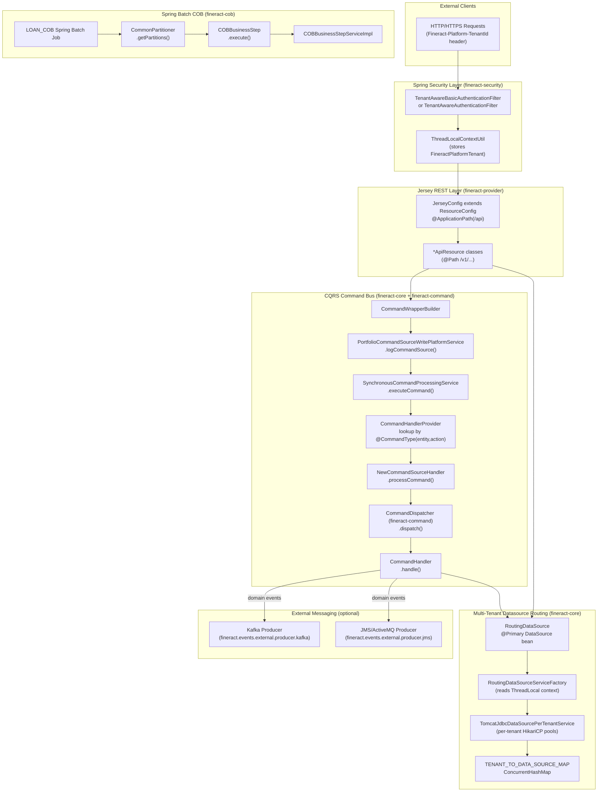
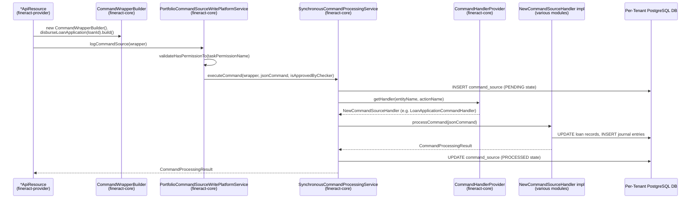
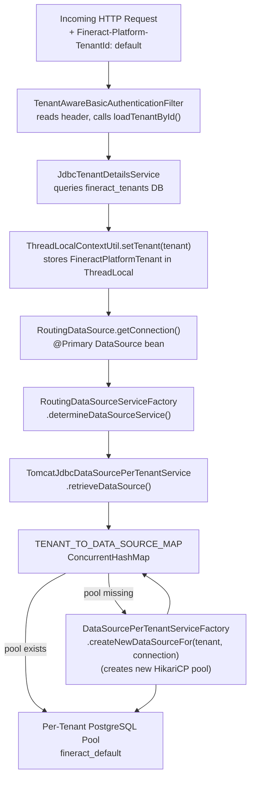
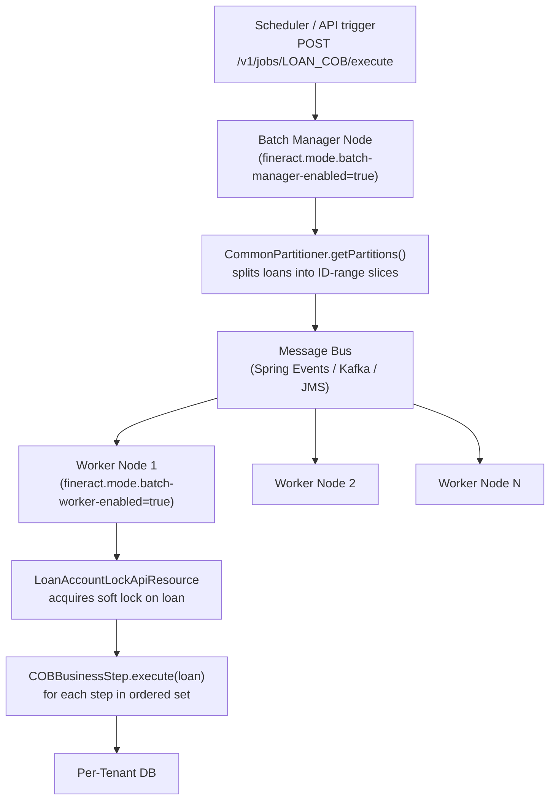
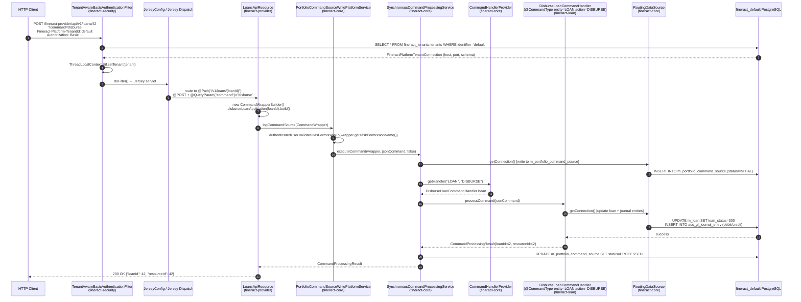

Apache Fineract's architecture is built around four interlocking subsystems: a **JAX-RS/Jersey REST layer** that accepts requests on `https://<host>:8443/fineract-provider/api/v1/...`, a **CQRS command bus** that serializes every write through an audited dispatch pipeline, a **multi-tenant datasource router** that switches HikariCP connection pools per request using `ThreadLocal` state, and a **Spring Batch COB engine** that partitions nightly loan processing across one or more JVM nodes. Understanding how these four systems interact is the key to navigating and modifying the codebase.

---

## Subsystem Component Diagram



---

## The Jersey REST Layer

### Registration Mechanism

Fineract uses **Jersey** (the JAX-RS reference implementation) embedded inside Spring Boot's servlet container. The configuration class is `JerseyConfig` in `fineract-provider/src/main/java/org/apache/fineract/infrastructure/core/jersey/JerseyConfig.java`.

```java
@Configuration(proxyBeanMethods = false)
@ApplicationPath("/api")
public class JerseyConfig extends ResourceConfig {

    @PostConstruct
    public void setup() {
        // Dynamic discovery: register all @Path-annotated Spring beans
        appCtx.getBeansWithAnnotation(Path.class).values().forEach(this::register);
        // Register all JAX-RS @Provider beans (exception mappers, filters, etc.)
        appCtx.getBeansWithAnnotation(Provider.class).values().forEach(this::register);
    }
}
```

The `@ApplicationPath("/api")` annotation mounts the entire Jersey servlet at `/fineract-provider/api`. All resource classes add a version prefix, so the effective base path for every REST endpoint is `/fineract-provider/api/v1/`.

Jersey registers three built-in features:
1. `MultiPartFeature` — multipart file upload support.
2. `ValidationFeature` — Bean Validation on request bodies.
3. `PageableParamProvider` (custom, `fineract-provider/src/main/java/org/apache/fineract/infrastructure/core/api/jersey/PageableParamProvider.java`) — injects pagination parameters.

### Resource Class Conventions

Every REST resource class in `fineract-provider/src/main/java/org/apache/fineract/` follows this pattern:

| Annotation | Value | Example |
|---|---|---|
| `@Path` | `/v1/<entity>` | `@Path("/v1/loans")` on `LoansApiResource` |
| `@Component` | (Spring bean) | Enables auto-discovery by `JerseyConfig` |
| `@Tag` | Swagger group name | `@Tag(name = "Loans")` |
| `@Consumes` | `MediaType.APPLICATION_JSON` | All write operations |
| `@Produces` | `MediaType.APPLICATION_JSON` | All read operations |

Write methods inject `PortfolioCommandSourceWritePlatformService` and call `logCommandSource(CommandWrapper)`. Read methods inject `*ReadPlatformService` implementations and call query methods directly (no command bus — pure CQRS reads bypass the audit trail).

### Key API Resource Files

| Resource Class | File | Base Path |
|---|---|---|
| `LoansApiResource` | `fineract-provider/.../portfolio/loanaccount/api/LoansApiResource.java` | `/v1/loans` |
| `LoanTransactionsApiResource` | `fineract-provider/.../portfolio/loanaccount/api/LoanTransactionsApiResource.java` | `/v1/loans/{loanId}/transactions` |
| `MakercheckersApiResource` | `fineract-provider/.../commands/api/MakercheckersApiResource.java` | `/v1/makercheckers` |
| `JournalEntriesApiResource` | `fineract-provider/.../accounting/journalentry/api/JournalEntriesApiResource.java` | `/v1/journalentries` |
| `AdHocApiResource` | `fineract-provider/.../adhocquery/api/AdHocApiResource.java` | `/v1/adhocquery` |
| `ConfigureBusinessStepApiResource` | `fineract-provider/.../cob/api/ConfigureBusinessStepApiResource.java` | `/v1/jobs/{jobName}/steps` |
| `LoanCOBCatchUpApiResource` | `fineract-provider/.../cob/api/LoanCOBCatchUpApiResource.java` | `/v1/loans/catch-up` |

### The `fineract-platform-tenantid` Header

Every authenticated request **must** include the HTTP header `Fineract-Platform-TenantId: <tenant_identifier>`. This header is read by `TenantAwareBasicAuthenticationFilter` (declared in `fineract-security/src/main/java/org/apache/fineract/infrastructure/security/filter/TenantAwareBasicAuthenticationFilter.java`) before the request reaches any Jersey resource.

```java
// TenantAwareBasicAuthenticationFilter
private static final String TENANT_ID_REQUEST_HEADER = "Fineract-Platform-TenantId";
```

---

## The CQRS Pattern

Fineract implements two overlapping CQRS systems:

1. **Legacy command bus** (`fineract-core/src/main/java/org/apache/fineract/commands/`) — the original implementation used by all existing `*ApiResource` classes. Based on `CommandWrapper`, `NewCommandSourceHandler`, and `CommandHandlerProvider`.
2. **New generic command bus** (`fineract-command/`) — a newer, typed, extensible system based on `Command<T>`, `CommandHandler<REQ,RES>`, and `CommandDispatcher`. Gradually replacing the legacy bus.

### Legacy Command Bus Flow



#### Key Classes in the Legacy Bus

| Class | File | Role |
|---|---|---|
| `CommandWrapper` | `fineract-core/.../commands/domain/CommandWrapper.java` | Immutable DTO carrying `actionName`, `entityName`, entity IDs, JSON body, `taskPermissionName` |
| `CommandWrapperBuilder` | `fineract-core/.../commands/service/CommandWrapperBuilder.java` | Fluent builder — 300+ methods, one per business operation (e.g., `disburseLoanApplication()`, `approveLoanApplication()`) |
| `PortfolioCommandSourceWritePlatformService` | `fineract-core/.../commands/service/PortfolioCommandSourceWritePlatformService.java` | Interface: `logCommandSource()`, `approveEntry()`, `deleteEntry()` |
| `PortfolioCommandSourceWritePlatformServiceImpl` | `fineract-core/.../commands/service/PortfolioCommandSourceWritePlatformServiceImpl.java` | Implementation: permission check, JSON parsing, delegates to `CommandProcessingService` |
| `SynchronousCommandProcessingService` | `fineract-core/.../commands/service/SynchronousCommandProcessingService.java` | Persists `CommandSource`, dispatches to handler, handles idempotency key logic, fires `HookEvent` |
| `CommandHandlerProvider` | `fineract-core/.../commands/provider/CommandHandlerProvider.java` | Registry of `NewCommandSourceHandler` beans keyed by `@CommandType(entity, action)` — key is `entity|action` |
| `NewCommandSourceHandler` | `fineract-core/.../commands/handler/NewCommandSourceHandler.java` | Interface: `processCommand(JsonCommand)` → `CommandProcessingResult` |
| `CommandSource` | `fineract-core/.../commands/domain/CommandSource.java` | JPA entity persisted to `m_portfolio_command_source` table |

### New Generic Command Bus (`fineract-command`)

The new bus in `fineract-command/src/main/java/org/apache/fineract/command/core/` provides a clean, typed CQRS interface:

```java
// Command.java — the envelope
@Data public class Command<T> implements Serializable {
    private Long commandId;
    private String idempotencyKey;
    private String ipAddress;
    private Instant createdAt;
    private String initiatedByUsername;
    private T payload;          // typed request object
    // ... more audit fields
}

// CommandDispatcher.java — the dispatcher contract
public interface CommandDispatcher {
    <REQ, RES> Supplier<RES> dispatch(Command<REQ> command);
}

// CommandHandler.java — implement one per command type
public interface CommandHandler<REQ, RES> {
    RES handle(Command<REQ> command);
    default RES fallback(Command<REQ> command, Throwable t) { throw t; }
    default boolean matches(Command<REQ> command) {
        TypeToken<REQ> handlerType = new TypeToken<>(getClass()) {};
        return handlerType.getRawType().isAssignableFrom(command.getPayload().getClass());
    }
}
```

`SynchronousCommandDispatcher` (in `fineract-command/src/main/java/org/apache/fineract/command/implementation/SynchronousCommandDispatcher.java`) is the default implementation. It wraps the call in a `Supplier<RES>` and runs before/after/error hooks via `CommandHookManager`:

```java
return () -> {
    try {
        hookManager.before(command);
        RES response = handlerManager.handle(command);
        hookManager.after(command, response);
        return response;
    } catch (Exception e) {
        hookManager.error(command, e);
        throw e;
    }
};
```

`DefaultCommandHandlerManager` (in `fineract-command/src/main/java/org/apache/fineract/command/implementation/DefaultCommandHandlerManager.java`) finds the correct handler using `CommandHandler.matches()`, which does generic type matching via `TypeToken`.

Built-in hooks (registered conditionally via `application.properties`):

| Hook Class | Condition Property | Phase |
|---|---|---|
| `TimestampCommandHook` | `fineract.command.hooks.timestamp-pre` | Before |
| `UsernameCommandHook` | `fineract.command.hooks.username-pre` | Before |
| `ServletHeadersCommandHook` | `fineract.command.hooks.servlet-header-pre` | Before |

---

## Multi-Tenant Data Routing

Fineract uses a **two-database architecture**:
- `fineract_tenants` (or whatever `FINERACT_HIKARI_JDBC_URL` points to) — the **meta-database** listing all tenants and their connection details. Read via HikariCP pool configured by `spring.datasource.hikari.*`.
- `fineract_<tenant_name>` (e.g., `fineract_default`) — **per-tenant databases**, one per tenant. Accessed via per-tenant HikariCP pools managed by `TomcatJdbcDataSourcePerTenantService`.

### Routing Flow



### Class Inventory

| Class | File | Role |
|---|---|---|
| `TenantAwareBasicAuthenticationFilter` | `fineract-security/.../security/filter/TenantAwareBasicAuthenticationFilter.java` | Reads `Fineract-Platform-TenantId` header, calls `AuthTenantDetailsService.loadTenantById()`, sets `ThreadLocalContextUtil.setTenant()` |
| `TenantAwareAuthenticationFilter` | `fineract-security/.../security/filter/TenantAwareAuthenticationFilter.java` | OAuth2/JWT variant: extracts tenant from JWT `tenant` claim or `tenantId` query param |
| `ThreadLocalContextUtil` | `fineract-core/.../core/service/ThreadLocalContextUtil.java` | Static `ThreadLocal<FineractPlatformTenant>` store; also holds business dates, auth token, action context |
| `RoutingDataSource` | `fineract-core/.../core/service/database/RoutingDataSource.java` | `@Primary` DataSource bean (bean name: `dataSource`); delegates `getConnection()` to `RoutingDataSourceServiceFactory` |
| `RoutingDataSourceServiceFactory` | `fineract-core/.../core/service/database/RoutingDataSourceServiceFactory.java` | Reads `ThreadLocalContextUtil.getDataSourceContext()`; returns `tomcatJdbcDataSourcePerTenantService` (tenant DB) or `dataSourceForTenants` (meta DB) |
| `TomcatJdbcDataSourcePerTenantService` | `fineract-core/.../core/service/database/TomcatJdbcDataSourcePerTenantService.java` | Maintains `TENANT_TO_DATA_SOURCE_MAP`; creates HikariCP pool on first access; initializes all tenant pools on `ContextRefreshedEvent` |
| `FineractPlatformTenant` | `fineract-core/.../core/domain/FineractPlatformTenant.java` | Domain object: `tenantIdentifier`, `name`, `FineractPlatformTenantConnection` |
| `FineractPlatformTenantConnection` | `fineract-core/.../core/domain/FineractPlatformTenantConnection.java` | JDBC connection details: host, port, schema name, username, encrypted password |
| `JdbcTenantDetailsService` | `fineract-core/.../core/service/tenant/JdbcTenantDetailsService.java` | Queries `fineract_tenants.tenants` table; returns `FineractPlatformTenant` |

<Warning>
`TENANT_TO_DATA_SOURCE_MAP` in `TomcatJdbcDataSourcePerTenantService` is a static `ConcurrentHashMap`. Once a pool is created for a tenant connection ID it is **never destroyed** within a single JVM lifetime. Adding new tenants at runtime requires restarting the application or calling the tenant provision API.
</Warning>

---

## Spring Boot Auto-Configuration

`FineractWebApplicationConfiguration` in `fineract-provider/src/main/java/org/apache/fineract/infrastructure/core/boot/FineractWebApplicationConfiguration.java` controls which Spring Boot auto-configurations are active.

### Excluded Auto-Configurations

| Excluded Class | Reason |
|---|---|
| `DataSourceAutoConfiguration` | Fineract manually creates `RoutingDataSource` as `@Primary` and `HikariDataSource` beans |
| `HibernateJpaAutoConfiguration` | JPA EntityManagerFactory is manually configured with EclipseLink (static weaving) |
| `DataSourceTransactionManagerAutoConfiguration` | Custom `ExtendedDataSourceTransactionManager` is used |
| `GsonAutoConfiguration` | Fineract uses Google Gson but configures it manually for its serialization needs |
| `JdbcTemplateAutoConfiguration` | Multiple `JdbcTemplate` instances exist (one per routing mode) |
| `LiquibaseAutoConfiguration` | Liquibase is run per-tenant at startup via `TenantDatabaseUpgradeService` |

### Component Scanning

The `@ComponentScan(basePackages = "org.apache.fineract.**")` on `FineractWebApplicationConfiguration` is deliberately broad. Because `fineract-provider` pulls all domain modules onto its classpath as Gradle `implementation` dependencies, a single component scan discovers beans from every module:
- `org.apache.fineract.commands.*` — legacy command bus
- `org.apache.fineract.command.*` — new command bus
- `org.apache.fineract.cob.*` — COB batch
- `org.apache.fineract.portfolio.*` — loan, savings, client domains
- `org.apache.fineract.accounting.*` — general ledger
- And all other modules on classpath.

### `FineractProperties`

**File:** `fineract-core/src/main/java/org/apache/fineract/infrastructure/core/config/FineractProperties.java`

Bound via `@ConfigurationProperties(prefix = "fineract")`. Contains nested POJOs for every major config group:
- `FineractTenantProperties` (bound to `fineract.tenant.*`)
- `FineractModeProperties` (bound to `fineract.mode.*`)
- `FineractPartitionedJob` (bound to `fineract.partitioned-job.*`)
- `FineractRemoteJobMessageHandlerProperties` (bound to `fineract.remote-job-message-handler.*`)
- `FineractExternalEventsProperties` (bound to `fineract.events.external.*`)
- `FineractLoanProperties` (bound to `fineract.loan.*`)
- `FineractCorrelationProperties` (bound to `fineract.correlation.*`)

---

## Spring Batch Partitioned COB

The Close-of-Business (COB) job processes every active loan at the end of each business day. This is the most computationally intensive operation in Fineract.

### Architecture Overview



### Key Classes

| Class | File | Role |
|---|---|---|
| `COBBusinessStep<T>` | `fineract-cob/.../cob/COBBusinessStep.java` | Interface — `execute(T input)`, `getEnumStyledName()`, `getHumanReadableName()`. Generic over `AbstractPersistableCustom<Long>`. |
| `COBBusinessStepService` | `fineract-cob/.../cob/COBBusinessStepService.java` | Interface for querying and ordering registered `COBBusinessStep` implementations |
| `COBBusinessStepServiceImpl` | `fineract-cob/.../cob/COBBusinessStepServiceImpl.java` | Loads step configuration from database, orders by `step_order` column |
| `CommonPartitioner` | `fineract-cob/.../cob/common/CommonPartitioner.java` | Abstract — `getPartitions(partitionSize, cobBusinessSteps)` returns `Map<String, ExecutionContext>` of ID-range slices |
| `COBConstant` | `fineract-cob/.../cob/COBConstant.java` | Constants: `PARTITION_PREFIX`, `BUSINESS_STEPS`, `COB_PARAMETER`, `BUSINESS_DATE_PARAMETER_NAME` |
| `COBParameter` | `fineract-cob/.../cob/data/COBParameter.java` | DTO: `minId`, `maxId` for a partition |
| `COBPartition` | `fineract-cob/.../cob/data/COBPartition.java` | DTO from database query: `minId`, `maxId`, `pageNo`, `count` |
| `InitialisationTasklet` | `fineract-cob/.../cob/common/InitialisationTasklet.java` | Spring Batch `Tasklet` that runs before partition steps to initialize COB context |
| `ResetContextTasklet` | `fineract-cob/.../cob/common/ResetContextTasklet.java` | Cleans up `ThreadLocalContextUtil` after each worker step |
| `BatchManagerCondition` | `fineract-cob/.../cob/conditions/BatchManagerCondition.java` | `@Conditional` that activates manager-side beans only when `fineract.mode.batch-manager-enabled=true` |
| `BatchWorkerCondition` | `fineract-cob/.../cob/conditions/BatchWorkerCondition.java` | `@Conditional` that activates worker-side beans only when `fineract.mode.batch-worker-enabled=true` |

### COB Execution Modes

| Mode | Configuration | Behavior |
|---|---|---|
| **Local (default)** | `fineract.remote-job-message-handler.spring-events.enabled=true` | Manager and workers run in same JVM; Spring `ApplicationEvent` used for inter-step communication |
| **Remote/Kafka** | `fineract.remote-job-message-handler.kafka.enabled=true` | Manager publishes partition tasks to Kafka topic (`fineract.remote-job-message-handler.kafka.topic.name`); separate worker JVMs consume |
| **Remote/JMS** | `fineract.remote-job-message-handler.jms.enabled=true` | Same as Kafka but using JMS/ActiveMQ (`fineract.remote-job-message-handler.jms.broker-url`) |

<Note>
The `LOAN_COB` job has a COB API filter: `LoanCOBApiFilter` in `fineract-provider/src/main/java/org/apache/fineract/infrastructure/jobs/filter/LoanCOBApiFilter.java`. `LoanCOBApiFilter` extends the abstract `COBApiFilter`, which itself extends Spring's `OncePerRequestFilter`. Any API request that touches a loan currently being processed by COB will receive a `409 Conflict` response to prevent data races. `LoanCOBApiFilter` is activated conditionally via `@Conditional(LoanCOBEnabledCondition.class)`.
</Note>

---

## Loan Disbursement: End-to-End Sequence

This sequence diagram traces a `POST /v1/loans/{loanId}?command=disburse` request from HTTP reception through to database commit. Loan state transitions (approve, disburse, reject, etc.) are handled by `LoansApiResource` (`@Path("/v1/loans")`), not `LoanTransactionsApiResource`.



---

## Gotchas & Architectural Invariants

<Accordion title="ThreadLocal must always be cleaned up">
`ThreadLocalContextUtil` holds tenant, business date, auth token, and action context in five separate `ThreadLocal` variables. Any code path that sets these **must** call `ThreadLocalContextUtil.reset()` in a `finally` block. Failure causes tenant context leakage between requests on the same Tomcat thread — a critical multi-tenancy bug. Check `TenantAwareBasicAuthenticationFilter` for the reference pattern.
</Accordion>

<Accordion title="Static HikariCP pool map never shrinks">
`TomcatJdbcDataSourcePerTenantService.TENANT_TO_DATA_SOURCE_MAP` is `static`. Tenant connection pools are created once and never evicted within a JVM lifetime. If you change a tenant's database credentials or hostname, you must restart the JVM for the new pool to be created. The `computeIfAbsent()` key is `tenantConnection.getConnectionId()` (the `id` column of the `tenants` table).
</Accordion>

<Accordion title="Dual CQRS systems coexist">
The old command bus (`org.apache.fineract.commands.*`) and the new generic bus (`org.apache.fineract.command.*`) are both active simultaneously. New feature code should use the new `Command<T>` / `CommandHandler<REQ,RES>` pattern. Existing code uses the old `CommandWrapper` / `NewCommandSourceHandler` pattern. The new bus does **not** automatically write to `m_portfolio_command_source`.
</Accordion>

<Accordion title="COB loan locks block API requests">
When the COB job processes a loan, it acquires a soft lock recorded in `m_loan_account_lock`. The `LoanCOBApiFilter` checks this lock before every loan-related API request and returns `409` if the loan is locked. This prevents double-writes during COB. The lock is released when the COB step for that loan completes.
</Accordion>

<Accordion title="Liquibase tenant isolation">
Each tenant database has its own independent Liquibase changelog applied by `TenantDatabaseUpgradeService` (in `fineract-provider/src/main/java/org/apache/fineract/infrastructure/core/service/migration/TenantDatabaseUpgradeService.java`). The task executor for Liquibase migrations is **intentionally restricted to 1 thread** (both core and max pool size = 1) due to a known Liquibase thread-safety issue (tracked at https://github.com/liquibase/liquibase/pull/7227).
</Accordion>

<Accordion title="JPA uses EclipseLink with static weaving">
Fineract uses EclipseLink (not Hibernate) as the JPA provider. **Static weaving** is applied at build time via `static-weaving.gradle`. This means JPA entity byte-code enhancement happens during compilation, not at runtime. All modules with JPA entities must apply the static weaving Gradle configuration. Attempting to run without static weaving leads to lazy-loading failures.
</Accordion>
