Apache Fineract is structured as a **multi-project Gradle build** declared in `settings.gradle`. The root project is named `fineract`. All submodules share the group `org.apache.fineract` (set in the root `build.gradle`). The `fineract-provider` module is the **assembly point** — it declares `implementation` dependencies on every domain module and produces the deployable JAR or WAR artifact.

This page enumerates every module declared in `settings.gradle`, grouped by architectural layer, with exact directory paths, key packages, purpose, and known inter-module dependencies sourced from each module's `dependencies.gradle` file.

---

## Dependency Graph

```mermaid
graph TD
    %% Foundation layer
    AVRO["fineract-avro-schemas"]
    VALID["fineract-validation"]
    CMD["fineract-command"]
    CORE["fineract-core"]
    SEC["fineract-security"]

    %% Command implementations
    CMDJDBC["fineract-command-jdbc"]
    CMDAUDIT["fineract-command-audit"]
    CMDTEST["fineract-command-test"]
    CMDASYNC["fineract-command-async"]
    CMDDISRUPT["fineract-command-disruptor"]

    %% Batch
    COB["fineract-cob"]

    %% Domain modules
    TAX["fineract-tax"]
    RATES["fineract-rates"]
    CHARGE["fineract-charge"]
    ACCT["fineract-accounting"]
    BRANCH["fineract-branch"]
    REPORT["fineract-report"]
    LOAN["fineract-loan"]
    SAVINGS["fineract-savings"]
    INVESTOR["fineract-investor"]
    PROG["fineract-progressive-loan"]
    WCL["fineract-working-capital-loan"]
    LOANORI["fineract-loan-origination"]
    DOC["fineract-document"]
    MIX["fineract-mix"]

    %% Application
    PROV["fineract-provider"]
    WAR["fineract-war"]

    %% Client libraries
    CLIENT["fineract-client"]
    FEIGN["fineract-client-feign"]

    %% Foundation edges
    CMD --> VALID
    CORE --> AVRO
    CORE --> CMD
    CORE --> VALID
    SEC --> CORE
    COB --> CORE
    COB --> CMD
    COB --> VALID
    COB --> AVRO

    %% Command impl edges
    CMDJDBC --> CMD
    CMDAUDIT --> CMD
    CMDASYNC --> CMD
    CMDDISRUPT --> CMD

    %% Domain edges
    CHARGE --> CORE
    CHARGE --> TAX
    RATES --> CORE
    TAX --> CORE
    ACCT --> CORE
    ACCT --> CHARGE
    BRANCH --> CORE
    BRANCH --> ACCT
    REPORT --> CORE
    DOC --> CORE
    DOC --> CMD
    MIX --> CORE
    MIX --> CMD

    LOAN --> CORE
    LOAN --> COB
    LOAN --> ACCT
    LOAN --> CHARGE
    LOAN --> RATES
    LOAN --> TAX

    SAVINGS --> CORE
    SAVINGS --> COB
    SAVINGS --> ACCT
    SAVINGS --> CHARGE
    SAVINGS --> RATES
    SAVINGS --> TAX

    INVESTOR --> CORE
    INVESTOR --> COB
    INVESTOR --> ACCT
    INVESTOR --> CHARGE
    INVESTOR --> LOAN
    INVESTOR --> AVRO

    PROG --> CORE
    PROG --> ACCT
    PROG --> CHARGE
    PROG --> LOAN
    PROG --> AVRO

    WCL --> CORE
    WCL --> COB
    WCL --> ACCT
    WCL --> CHARGE
    WCL --> LOAN
    WCL --> AVRO

    LOANORI --> CORE
    LOANORI --> LOAN
    LOANORI --> AVRO

    %% Provider (assembles everything)
    PROV --> CORE
    PROV --> SEC
    PROV --> COB
    PROV --> CMD
    PROV --> CMDJDBC
    PROV --> CMDAUDIT
    PROV --> VALID
    PROV --> ACCT
    PROV --> INVESTOR
    PROV --> RATES
    PROV --> CHARGE
    PROV --> LOAN
    PROV --> SAVINGS
    PROV --> BRANCH
    PROV --> DOC
    PROV --> PROG
    PROV --> REPORT
    PROV --> TAX
    PROV --> LOANORI
    PROV --> WCL
    PROV --> MIX

    WAR --> PROV

    %% Styling
    style PROV fill:#2563eb,color:#fff
    style CORE fill:#059669,color:#fff
    style COB fill:#d97706,color:#fff
    style CMD fill:#7c3aed,color:#fff
    style SEC fill:#dc2626,color:#fff
```

---

## Layer 1 — Foundation

These modules have zero or minimal dependencies on other Fineract modules. They define the fundamental abstractions used everywhere.

### `fineract-avro-schemas`

| Attribute | Value |
|---|---|
| **Directory** | `fineract-avro-schemas/` |
| **Key Packages** | `org.apache.fineract.avro.*` |
| **Purpose** | Apache Avro schema definitions (`.avsc` files) and generated Java SDK for all external business events (e.g., `LoanDisbursedBusinessEvent`, `ClientCreatedBusinessEvent`). Generated via `com.github.davidmc24.gradle.plugin.avro-base` plugin. |
| **Fineract Dependencies** | none |
| **Depended on by** | `fineract-core`, `fineract-cob`, `fineract-investor`, `fineract-progressive-loan`, `fineract-working-capital-loan`, `fineract-loan-origination`, `fineract-provider` |

### `fineract-validation`

| Attribute | Value |
|---|---|
| **Directory** | `fineract-validation/` |
| **Key Packages** | `org.apache.fineract.validation.*` |
| **Purpose** | Custom JSR-380 (Jakarta Bean Validation) constraints and validators. Provides annotations such as `@SupportedFormats` used across request DTOs. |
| **Fineract Dependencies** | none |
| **Depended on by** | `fineract-command`, `fineract-core`, `fineract-cob` |

### `fineract-command`

| Attribute | Value |
|---|---|
| **Directory** | `fineract-command/` |
| **Key Packages** | `org.apache.fineract.command.core`, `org.apache.fineract.command.hook`, `org.apache.fineract.command.implementation`, `org.apache.fineract.command.starter` |
| **Purpose** | New-generation generic CQRS command bus. Defines `Command<T>`, `CommandDispatcher`, `CommandHandler<REQ,RES>`, `CommandHandlerManager`, `CommandHookManager`, `CommandStore`, and the default `SynchronousCommandDispatcher` implementation. |
| **Fineract Dependencies** | `fineract-validation` (compile) |
| **Depended on by** | `fineract-core`, `fineract-cob`, `fineract-command-jdbc`, `fineract-command-audit`, `fineract-command-async`, `fineract-command-disruptor`, `fineract-document`, `fineract-mix`, `fineract-provider` |

**Key source files:**

| File | Role |
|---|---|
| `core/Command.java` | Generic command envelope with audit metadata |
| `core/CommandDispatcher.java` | `dispatch(Command<REQ>) → Supplier<RES>` |
| `core/CommandHandler.java` | `handle(Command<REQ>) → RES`; `matches()` via `TypeToken` |
| `core/CommandHandlerManager.java` | `handle(Command<REQ>) → RES` functional interface |
| `core/CommandHookManager.java` | `before()`, `after()`, `error()` lifecycle hooks |
| `core/CommandStore.java` | Persistence abstraction for command records |
| `implementation/SynchronousCommandDispatcher.java` | Default synchronous dispatcher with hook invocation |
| `implementation/DefaultCommandHandlerManager.java` | `List<CommandHandler>` lookup by `matches()` |
| `starter/CommandAutoConfiguration.java` | Spring Boot auto-configuration entry point |

---

## Layer 2 — Core Infrastructure

### `fineract-core`

| Attribute | Value |
|---|---|
| **Directory** | `fineract-core/` |
| **Key Packages** | `org.apache.fineract.infrastructure.core.*`, `org.apache.fineract.commands.*`, `org.apache.fineract.infrastructure.security.*`, `org.apache.fineract.infrastructure.jobs.*`, `org.apache.fineract.infrastructure.springbatch.*`, `org.apache.fineract.infrastructure.event.*` |
| **Purpose** | Platform foundation: multi-tenant ThreadLocal context, JDBC datasource routing, legacy CQRS command bus (`CommandWrapper`, `NewCommandSourceHandler`, `CommandHandlerProvider`), JPA base entities, serialization helpers, Spring Batch utilities, external event framework, business date management, Liquibase migration support. |
| **Fineract Dependencies** | `fineract-avro-schemas`, `fineract-command`, `fineract-validation` |
| **Depended on by** | Every other Fineract module |

**Critical source files in `fineract-core`:**

| File | Path | Role |
|---|---|---|
| `ThreadLocalContextUtil` | `...core/service/ThreadLocalContextUtil.java` | Stores `FineractPlatformTenant`, auth token, business dates in `ThreadLocal` |
| `RoutingDataSource` | `...core/service/database/RoutingDataSource.java` | `@Primary` DataSource; routes `getConnection()` via `RoutingDataSourceServiceFactory` |
| `TomcatJdbcDataSourcePerTenantService` | `...core/service/database/TomcatJdbcDataSourcePerTenantService.java` | Per-tenant HikariCP pool registry; static `ConcurrentHashMap` |
| `FineractPlatformTenant` | `...core/domain/FineractPlatformTenant.java` | Tenant identity + connection metadata |
| `FineractProperties` | `...core/config/FineractProperties.java` | `@ConfigurationProperties(prefix="fineract")` root config class |
| `PortfolioCommandSourceWritePlatformServiceImpl` | `...commands/service/PortfolioCommandSourceWritePlatformServiceImpl.java` | Entry point for all legacy write commands |
| `SynchronousCommandProcessingService` | `...commands/service/SynchronousCommandProcessingService.java` | Persists `CommandSource`, dispatches to `NewCommandSourceHandler` |
| `CommandHandlerProvider` | `...commands/provider/CommandHandlerProvider.java` | Registry of `NewCommandSourceHandler` beans by `@CommandType` |
| `NewCommandSourceHandler` | `...commands/handler/NewCommandSourceHandler.java` | Interface: `processCommand(JsonCommand) → CommandProcessingResult` |
| `FineractLiquibaseOnlyApplicationConfiguration` | `...core/boot/FineractLiquibaseOnlyApplicationConfiguration.java` | Minimal Spring config for Liquibase-only startup mode |
| `JdbcTenantDetailsService` | `...core/service/tenant/JdbcTenantDetailsService.java` | Queries `tenants` table in meta-database |
| `AbstractPersistableCustom` | `...core/domain/AbstractPersistableCustom.java` | JPA base entity; all domain entities extend this |

### `fineract-security`

| Attribute | Value |
|---|---|
| **Directory** | `fineract-security/` |
| **Key Packages** | `org.apache.fineract.infrastructure.security.*` |
| **Purpose** | Spring Security configuration, authentication filters, Basic Auth, OAuth2 resource server, OIDC federation, 2FA, per-tenant user details. |
| **Fineract Dependencies** | `fineract-core` |
| **Depended on by** | `fineract-provider` |

**Key source files:**

| File | Role |
|---|---|
| `filter/TenantAwareBasicAuthenticationFilter.java` | Reads `Fineract-Platform-TenantId` header; sets tenant in `ThreadLocalContextUtil` |
| `filter/TenantAwareAuthenticationFilter.java` | OAuth2/JWT variant; extracts tenant from JWT `tenant` claim |
| `service/TenantAwareJpaPlatformUserDetailsService.java` | Loads `AppUser` from tenant database for Spring Security |
| `api/AuthenticationApiResource.java` | `GET /v1/authentication` — returns auth token for Basic Auth |
| `api/TwoFactorApiResource.java` | 2FA token management endpoints |

---

## Layer 3 — Batch & Command Extensions

### `fineract-cob`

| Attribute | Value |
|---|---|
| **Directory** | `fineract-cob/` |
| **Key Packages** | `org.apache.fineract.cob.*` |
| **Purpose** | Spring Batch Close-of-Business framework. Defines `COBBusinessStep<T>` interface, `CommonPartitioner`, batch job beans, loan lock mechanism, business date resolution, and catch-up logic for missed COB days. |
| **Fineract Dependencies** | `fineract-core`, `fineract-command`, `fineract-validation`, `fineract-avro-schemas` |
| **Depended on by** | `fineract-loan`, `fineract-savings`, `fineract-investor`, `fineract-working-capital-loan`, `fineract-provider` |

**Key source files:**

| File | Role |
|---|---|
| `COBBusinessStep.java` | Interface: `execute(T input)`, `getEnumStyledName()`, `getHumanReadableName()` |
| `COBBusinessStepService.java` | Queries ordered set of `COBBusinessStep` implementations for a job |
| `common/CommonPartitioner.java` | Abstract; `getPartitions()` splits loans into `COBPartition` ranges |
| `common/InitialisationTasklet.java` | Spring Batch `Tasklet` run before worker partitions |
| `common/ResetContextTasklet.java` | Cleans up `ThreadLocalContextUtil` after each step |
| `conditions/BatchManagerCondition.java` | `@Conditional` for manager-side beans |
| `conditions/BatchWorkerCondition.java` | `@Conditional` for worker-side beans |
| `data/COBParameter.java` | `minId`, `maxId` ID range for a partition |

COB API resources live in `fineract-provider` (the assembly module) under `src/main/java/org/apache/fineract/cob/api/`: `InternalCOBApiResource.java`, `LoanCOBCatchUpApiResource.java`, `ConfigureBusinessStepApiResource.java`, `LoanAccountLockApiResource.java`.

### `fineract-command-test`

| Attribute | Value |
|---|---|
| **Directory** | `fineract-command-test/` |
| **Purpose** | Shared test stubs, mocks, and helper utilities for testing code that uses `fineract-command`. Not included in production artifacts. |
| **Fineract Dependencies** | none (test scope only) |

### `fineract-command-jdbc`

| Attribute | Value |
|---|---|
| **Directory** | `fineract-command-jdbc/` |
| **Key Packages** | `org.apache.fineract.command.jdbc.*` |
| **Purpose** | JDBC-backed `CommandStore` implementation. Persists `Command<T>` records to the `m_command` table with a dead-letter queue (DLQ) option writing to a configurable filesystem path. Enabled by `fineract.command.jdbc.enabled=true`. |
| **Fineract Dependencies** | `fineract-command` |

**Key files:** `JdbcCommandStore.java`, `store/domain/CommandEntity.java`, `store/domain/CommandRepository.java`, `starter/JdbcCommandAutoConfiguration.java`

### `fineract-command-audit`

| Attribute | Value |
|---|---|
| **Directory** | `fineract-command-audit/` |
| **Key Packages** | `org.apache.fineract.command.audit.*` |
| **Purpose** | Audit hook for the new command bus. Implements `CommandHookBefore` and `CommandHookAfter` to write command lifecycle records. Enabled by `fineract.command.audit.enabled=true`. |
| **Fineract Dependencies** | `fineract-command` |

### `fineract-command-async`

| Attribute | Value |
|---|---|
| **Directory** | `fineract-command-async/` |
| **Purpose** | Asynchronous `CommandDispatcher` implementation (work in progress). Disabled by default — `fineract.command.async.enabled` is commented out in `application.properties`. |
| **Fineract Dependencies** | `fineract-command` |

### `fineract-command-disruptor`

| Attribute | Value |
|---|---|
| **Directory** | `fineract-command-disruptor/` |
| **Purpose** | LMAX Disruptor-backed `CommandDispatcher` (work in progress). Disabled by default — `fineract.command.disruptor.enabled` is commented out in `application.properties`. |
| **Fineract Dependencies** | `fineract-command` |

---

## Layer 4 — Domain Modules

### `fineract-accounting`

| Attribute | Value |
|---|---|
| **Directory** | `fineract-accounting/` |
| **Key Packages** | `org.apache.fineract.accounting.*` |
| **Purpose** | Double-entry general ledger. Chart of accounts, journal entries, GL account types, financial activity mappings, periodic accruals, income and expense statements. |
| **Fineract Dependencies** | `fineract-core`, `fineract-charge` |
| **Depended on by** | `fineract-loan`, `fineract-savings`, `fineract-investor`, `fineract-branch`, `fineract-progressive-loan`, `fineract-working-capital-loan`, `fineract-provider` |

### `fineract-charge`

| Attribute | Value |
|---|---|
| **Directory** | `fineract-charge/` |
| **Key Packages** | `org.apache.fineract.portfolio.charge.*` |
| **Purpose** | Fee and penalty charge type definitions used by loan and savings products. Charge calculation types (flat, percentage of amount, etc.), charge time types (disbursement, monthly fee, overdue penalty, etc.). |
| **Fineract Dependencies** | `fineract-core`, `fineract-tax` |
| **Depended on by** | `fineract-accounting`, `fineract-loan`, `fineract-savings`, `fineract-investor`, `fineract-progressive-loan`, `fineract-working-capital-loan`, `fineract-provider` |

### `fineract-tax`

| Attribute | Value |
|---|---|
| **Directory** | `fineract-tax/` |
| **Key Packages** | `org.apache.fineract.portfolio.tax.*` |
| **Purpose** | Tax group and tax component definitions. Tax applied on charges and interest. |
| **Fineract Dependencies** | `fineract-core` |
| **Depended on by** | `fineract-charge`, `fineract-loan`, `fineract-savings`, `fineract-provider` |

### `fineract-rates`

| Attribute | Value |
|---|---|
| **Directory** | `fineract-rates/` |
| **Key Packages** | `org.apache.fineract.portfolio.rate.*` |
| **Purpose** | Floating interest rate definitions used as reference rates in loan products. |
| **Fineract Dependencies** | `fineract-core` |
| **Depended on by** | `fineract-loan`, `fineract-savings`, `fineract-provider` |

### `fineract-loan`

| Attribute | Value |
|---|---|
| **Directory** | `fineract-loan/` |
| **Key Packages** | `org.apache.fineract.portfolio.loanaccount.*`, `org.apache.fineract.portfolio.loanproduct.*`, `org.apache.fineract.portfolio.delinquency.*`, `org.apache.fineract.cob.*` (loan COB steps), `org.apache.fineract.portfolio.interestpauses.*` |
| **Purpose** | Core loan domain: loan products, loan accounts, disbursements, repayment schedules, interest calculation strategies (amortizing, flat, declining balance), transaction processing strategies (CreoCore, MifosStandard, AdvancedPaymentStrategy, etc.), delinquency buckets, interest pauses, re-aging, re-amortization, loan charges. |
| **Fineract Dependencies** | `fineract-core`, `fineract-cob`, `fineract-accounting`, `fineract-charge`, `fineract-rates`, `fineract-tax` |
| **Depended on by** | `fineract-investor`, `fineract-progressive-loan`, `fineract-working-capital-loan`, `fineract-loan-origination`, `fineract-provider` |

**Notable files:** `fineract-loan/src/main/java/org/apache/fineract/portfolio/loanaccount/api/LoanApiConstants.java`, `fineract-loan/src/main/java/org/apache/fineract/portfolio/delinquency/api/DelinquencyApiResource.java`

### `fineract-savings`

| Attribute | Value |
|---|---|
| **Directory** | `fineract-savings/` |
| **Key Packages** | `org.apache.fineract.portfolio.savings.*`, `org.apache.fineract.portfolio.shareproducts.*`, `org.apache.fineract.portfolio.shareaccounts.*` |
| **Purpose** | Savings accounts, fixed deposit accounts, recurring deposit accounts, share products, share accounts. Interest posting, compounding, account transfers. |
| **Fineract Dependencies** | `fineract-core`, `fineract-cob`, `fineract-accounting`, `fineract-charge`, `fineract-rates`, `fineract-tax` |
| **Depended on by** | `fineract-provider` |

### `fineract-investor`

| Attribute | Value |
|---|---|
| **Directory** | `fineract-investor/` |
| **Key Packages** | `org.apache.fineract.investor.*` |
| **Purpose** | External asset owner (investor) tracking. Models partial or full sale of loan portfolios to external investors. Tracks investor transactions and journal entry postings. |
| **Fineract Dependencies** | `fineract-core`, `fineract-cob`, `fineract-accounting`, `fineract-charge`, `fineract-loan`, `fineract-avro-schemas` |
| **Depended on by** | `fineract-provider` |

### `fineract-progressive-loan`

| Attribute | Value |
|---|---|
| **Directory** | `fineract-progressive-loan/` |
| **Key Packages** | `org.apache.fineract.portfolio.loanproduct.calc.*`, `org.apache.fineract.portfolio.loanaccount.calc.*` |
| **Purpose** | "Advanced Payment Strategy" progressive loan type with EMI-based amortization, interest recalculation, and payment allocation (principal, interest, penalties, fees) per instalment. Implements `AdvancedPaymentScheduleTransactionProcessor`. |
| **Fineract Dependencies** | `fineract-core`, `fineract-accounting`, `fineract-charge`, `fineract-loan`, `fineract-avro-schemas` |
| **Depended on by** | `fineract-provider` |

### `fineract-progressive-loan-embeddable-schedule-generator`

| Attribute | Value |
|---|---|
| **Directory** | `fineract-progressive-loan-embeddable-schedule-generator/` |
| **Purpose** | Standalone library (no Spring dependency) that generates repayment schedules for progressive loans. Can be embedded in external systems (e.g., mobile apps) without deploying Fineract. |
| **Fineract Dependencies** | minimal (no Spring) |

### `fineract-working-capital-loan`

| Attribute | Value |
|---|---|
| **Directory** | `fineract-working-capital-loan/` |
| **Key Packages** | `org.apache.fineract.portfolio.workcapitalloan.*` |
| **Purpose** | Working capital loan product type. Supports revolving credit facilities, variable drawdowns, and custom COB business steps. |
| **Fineract Dependencies** | `fineract-core`, `fineract-cob`, `fineract-accounting`, `fineract-charge`, `fineract-loan`, `fineract-avro-schemas` |
| **Depended on by** | `fineract-provider` |

### `fineract-loan-origination`

| Attribute | Value |
|---|---|
| **Directory** | `fineract-loan-origination/` |
| **Key Packages** | `org.apache.fineract.portfolio.loanorigination.*` |
| **Purpose** | Loan origination workflow extensions and hooks. Extends the loan application/approval lifecycle. |
| **Fineract Dependencies** | `fineract-core`, `fineract-loan`, `fineract-avro-schemas` |
| **Depended on by** | `fineract-provider` |

### `fineract-branch`

| Attribute | Value |
|---|---|
| **Directory** | `fineract-branch/` |
| **Key Packages** | `org.apache.fineract.organisation.office.*`, `org.apache.fineract.organisation.staff.*` |
| **Purpose** | Office (branch) hierarchy, staff management, working days and holidays configuration. |
| **Fineract Dependencies** | `fineract-core`, `fineract-accounting` |
| **Depended on by** | `fineract-provider` |

### `fineract-document`

| Attribute | Value |
|---|---|
| **Directory** | `fineract-document/` |
| **Key Packages** | `org.apache.fineract.infrastructure.documentmanagement.*` |
| **Purpose** | Document upload, storage (local filesystem or S3), and retrieval for clients, loans, and other entities. |
| **Fineract Dependencies** | `fineract-core`, `fineract-command` |
| **Depended on by** | `fineract-provider` |

### `fineract-report`

| Attribute | Value |
|---|---|
| **Directory** | `fineract-report/` |
| **Key Packages** | `org.apache.fineract.infrastructure.report.*` |
| **Purpose** | Report execution infrastructure. Supports Pentaho/Jasper reports via `report_mailing_job`, stretch and parameterized SQL reports. |
| **Fineract Dependencies** | `fineract-core` |
| **Depended on by** | `fineract-provider` |

### `fineract-mix`

| Attribute | Value |
|---|---|
| **Directory** | `fineract-mix/` |
| **Key Packages** | `org.apache.fineract.mix.*` |
| **Purpose** | MIX Market (Microfinance Information eXchange) data standard reporting. Generates MIX-compliant financial indicators. |
| **Fineract Dependencies** | `fineract-core`, `fineract-command` |
| **Depended on by** | `fineract-provider` |

---

## Layer 5 — Application Assembly

### `fineract-provider`

| Attribute | Value |
|---|---|
| **Directory** | `fineract-provider/` |
| **Key Packages** | `org.apache.fineract` (root — `ServerApplication`), `org.apache.fineract.infrastructure.core.jersey`, `org.apache.fineract.portfolio.loanaccount.api`, `org.apache.fineract.portfolio.savings.api`, `org.apache.fineract.commands.api`, `org.apache.fineract.accounting.journalentry.api`, and all other `*ApiResource` classes |
| **Purpose** | The **only runnable module**. Applies `org.springframework.boot` plugin. Assembles all domain modules. Contains `ServerApplication.java`, `JerseyConfig.java`, all JAX-RS `*ApiResource` REST controllers, Spring Security configuration, Actuator setup, Swagger/OpenAPI generation, and integration test Cucumber runner. Produces `fineract-provider-<version>.jar` (Spring Boot fat-JAR) via `bootJar` task. |
| **Fineract Dependencies** | All production modules (see `fineract-provider/dependencies.gradle`) |

**Key files unique to `fineract-provider`:**

| File | Role |
|---|---|
| `ServerApplication.java` | `main()` entry point; imports `FineractWebApplicationConfiguration` |
| `infrastructure/core/boot/FineractWebApplicationConfiguration.java` | Root `@Configuration`; `@ComponentScan("org.apache.fineract.**")` |
| `infrastructure/core/jersey/JerseyConfig.java` | `@ApplicationPath("/api")` Jersey `ResourceConfig`; registers all `@Path` beans |
| `infrastructure/jobs/filter/LoanCOBApiFilter.java` | `OncePerRequestFilter`; blocks API on COB-locked loans |
| `infrastructure/core/service/migration/TenantDatabaseUpgradeService.java` | Runs per-tenant Liquibase migrations at startup |
| `portfolio/loanaccount/api/LoansApiResource.java` | `@Path("/v1/loans")` — CRUD + state machine for loan applications |
| `portfolio/loanaccount/api/LoanTransactionsApiResource.java` | `@Path("/v1/loans/{loanId}/transactions")` — disbursement, repayment, reversal |
| `commands/api/MakercheckersApiResource.java` | `@Path("/v1/makercheckers")` — 4-eyes approval queue |
| `commands/api/AuditsApiResource.java` | `@Path("/v1/audits")` — read audit trail |

### `fineract-war`

| Attribute | Value |
|---|---|
| **Directory** | `fineract-war/` |
| **Purpose** | Thin Gradle module that produces a traditional WAR file for external Tomcat 10+ deployment. No additional Java source — applies the `war` plugin and declares `fineract-provider` as a `providedRuntime` dependency. |
| **Fineract Dependencies** | `fineract-provider` |

---

## Layer 6 — Integration & Testing

### `integration-tests`

| Attribute | Value |
|---|---|
| **Directory** | `integration-tests/` |
| **Purpose** | Full REST API integration test suite. Tests run against a live Fineract instance. Uses the generated `fineract-client` library for HTTP calls. |

### `twofactor-tests`

| Attribute | Value |
|---|---|
| **Directory** | `twofactor-tests/` |
| **Purpose** | Integration tests specifically for 2FA login flow and token management endpoints. |

### `oauth2-tests`

| Attribute | Value |
|---|---|
| **Directory** | `oauth2-tests/` |
| **Purpose** | Integration tests for OAuth2 authentication flow, JWT validation, and OIDC federation. |

### `fineract-e2e-tests-core`

| Attribute | Value |
|---|---|
| **Directory** | `fineract-e2e-tests-core/` |
| **Purpose** | Shared Cucumber step definitions, world objects, and helper utilities reused by `fineract-e2e-tests-runner`. |

### `fineract-e2e-tests-runner`

| Attribute | Value |
|---|---|
| **Directory** | `fineract-e2e-tests-runner/` |
| **Purpose** | Cucumber runner configuration that executes end-to-end BDD test scenarios defined in `.feature` files. Runs with `se.thinkcode.cucumber-runner` Gradle plugin (also applied in `fineract-provider`). |

---

## Layer 7 — Client Libraries

### `fineract-client`

| Attribute | Value |
|---|---|
| **Directory** | `fineract-client/` |
| **Purpose** | Java API client generated from the Fineract OpenAPI spec using `org.openapi.generator`. Uses Retrofit2 + OkHttp. Published to Maven Central as `org.apache.fineract:fineract-client`. |

### `fineract-client-feign`

| Attribute | Value |
|---|---|
| **Directory** | `fineract-client-feign/` |
| **Purpose** | OpenFeign-based Java API client generated from the same OpenAPI spec. Alternative to `fineract-client` for Spring Cloud / declarative HTTP client users. |

---

## Layer 8 — Documentation & Schemas

### `fineract-doc`

| Attribute | Value |
|---|---|
| **Directory** | `fineract-doc/` |
| **Purpose** | AsciiDoc source files for the official Apache Fineract documentation published to `fineract.apache.org/docs/current`. Converted via `org.asciidoctor.jvm.convert` and `org.asciidoctor.jvm.pdf` Gradle plugins. |

### `fineract-avro-schemas` _(also Foundation)_

Covered above in Layer 1. Published to Maven Central as `org.apache.fineract:fineract-avro-schemas` for external consumer use.

---

## Complete Module Summary Table

| Module | Layer | Directory | Published Artifact |
|---|---|---|---|
| `fineract-avro-schemas` | Foundation | `fineract-avro-schemas/` | ✅ Maven Central |
| `fineract-validation` | Foundation | `fineract-validation/` | — |
| `fineract-command` | Foundation | `fineract-command/` | — |
| `fineract-command-test` | Foundation | `fineract-command-test/` | — |
| `fineract-core` | Core Infra | `fineract-core/` | ✅ Maven Central |
| `fineract-security` | Core Infra | `fineract-security/` | ✅ Maven Central |
| `fineract-cob` | Batch | `fineract-cob/` | ✅ Maven Central |
| `fineract-command-jdbc` | Command Ext | `fineract-command-jdbc/` | ✅ Maven Central |
| `fineract-command-audit` | Command Ext | `fineract-command-audit/` | ✅ Maven Central |
| `fineract-command-async` | Command Ext | `fineract-command-async/` | — |
| `fineract-command-disruptor` | Command Ext | `fineract-command-disruptor/` | — |
| `fineract-accounting` | Domain | `fineract-accounting/` | ✅ Maven Central |
| `fineract-charge` | Domain | `fineract-charge/` | ✅ Maven Central |
| `fineract-tax` | Domain | `fineract-tax/` | — |
| `fineract-rates` | Domain | `fineract-rates/` | ✅ Maven Central |
| `fineract-loan` | Domain | `fineract-loan/` | ✅ Maven Central |
| `fineract-savings` | Domain | `fineract-savings/` | ✅ Maven Central |
| `fineract-investor` | Domain | `fineract-investor/` | ✅ Maven Central |
| `fineract-progressive-loan` | Domain | `fineract-progressive-loan/` | ✅ Maven Central |
| `fineract-progressive-loan-embeddable-schedule-generator` | Domain | `fineract-progressive-loan-embeddable-schedule-generator/` | ✅ Maven Central |
| `fineract-working-capital-loan` | Domain | `fineract-working-capital-loan/` | ✅ Maven Central |
| `fineract-loan-origination` | Domain | `fineract-loan-origination/` | ✅ Maven Central |
| `fineract-branch` | Domain | `fineract-branch/` | ✅ Maven Central |
| `fineract-document` | Domain | `fineract-document/` | ✅ Maven Central |
| `fineract-report` | Domain | `fineract-report/` | ✅ Maven Central |
| `fineract-mix` | Domain | `fineract-mix/` | ✅ Maven Central |
| `fineract-provider` | Application | `fineract-provider/` | ✅ Maven Central |
| `fineract-war` | Application | `fineract-war/` | — |
| `integration-tests` | Testing | `integration-tests/` | — |
| `twofactor-tests` | Testing | `twofactor-tests/` | — |
| `oauth2-tests` | Testing | `oauth2-tests/` | — |
| `fineract-e2e-tests-core` | Testing | `fineract-e2e-tests-core/` | — |
| `fineract-e2e-tests-runner` | Testing | `fineract-e2e-tests-runner/` | — |
| `fineract-client` | Client Lib | `fineract-client/` | ✅ Maven Central |
| `fineract-client-feign` | Client Lib | `fineract-client-feign/` | — |
| `fineract-doc` | Docs | `fineract-doc/` | — |
| `custom:docker` | Custom | `custom/docker/` | — |

<Info>
Published modules can be consumed as Maven/Gradle dependencies using group `org.apache.fineract`. For example: `implementation 'org.apache.fineract:fineract-core:2.x.x'`. Snapshot builds append `-SNAPSHOT` to the version.
</Info>
