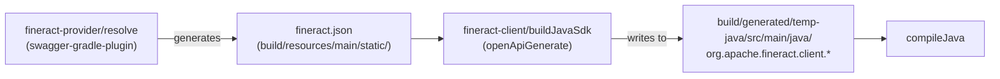
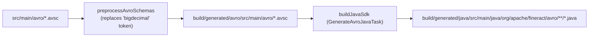

Apache Fineract uses a Gradle multi-project build rooted at `build.gradle` with subproject declarations in `settings.gradle`. The build system handles Java compilation, code quality enforcement, OpenAPI client generation, Avro schema compilation, WAR/JAR packaging, Docker image creation, and Maven Central publication — all driven from a single `./gradlew` invocation.

## Project Structure

```
fineract/                         ← root project
├── build.gradle                  ← root build configuration
├── settings.gradle               ← subproject declarations + custom module discovery
├── buildSrc/                     ← build-time plugins and conventions
│   └── src/main/groovy/
│       ├── org.apache.fineract.dependencies.gradle  ← BOM imports + pinned versions
│       └── org.apache.fineract.release.gradle       ← Apache release automation
├── fineract-core/
├── fineract-security/
├── fineract-cob/
├── fineract-validation/
├── fineract-command/
├── fineract-command-jdbc/
├── fineract-command-audit/
├── fineract-command-async/
├── fineract-command-disruptor/
├── fineract-accounting/
├── fineract-provider/            ← main Spring Boot application, WAR entry point
├── fineract-branch/
├── fineract-document/
├── fineract-investor/
├── fineract-charge/
├── fineract-rates/
├── fineract-tax/
├── fineract-loan-origination/
├── fineract-loan/
├── fineract-savings/
├── fineract-report/
├── fineract-mix/
├── fineract-war/                 ← WAR packaging project
├── fineract-client/              ← generated Retrofit2 Java SDK
├── fineract-client-feign/        ← generated Feign Java SDK
├── fineract-avro-schemas/        ← Avro .avsc → Java compiled schemas
├── fineract-progressive-loan/
├── fineract-progressive-loan-embeddable-schedule-generator/
├── fineract-working-capital-loan/
├── integration-tests/
├── twofactor-tests/
├── oauth2-tests/
├── fineract-e2e-tests-core/
├── fineract-e2e-tests-runner/
└── custom/                       ← dynamically included custom modules
    ├── docker/                   ← custom Docker image build
    └── acme/                     ← example company namespace
```

---

## Key Gradle Subproject Lists

`build.gradle` defines two key lists in the `buildscript.ext` block:

### `fineractJavaProjects`
All subprojects that receive the full Java build treatment: `java` plugin, `checkstyle`, `spotbugs`, `jacoco`, error-prone, and Spotless formatting. The list is hardcoded in `build.gradle` and augmented dynamically by `custom/` module discovery:

```
fineract-core, fineract-security, fineract-cob, fineract-validation,
fineract-command, fineract-command-test, fineract-command-jdbc,
fineract-command-audit, fineract-command-async, fineract-command-disruptor,
fineract-accounting, fineract-provider, fineract-branch, fineract-document,
fineract-investor, fineract-charge, fineract-rates, fineract-tax,
fineract-loan-origination, fineract-loan, fineract-savings, fineract-report,
fineract-mix, integration-tests, twofactor-tests, oauth2-tests,
fineract-client, fineract-client-feign, fineract-avro-schemas,
fineract-e2e-tests-core, fineract-e2e-tests-runner,
fineract-progressive-loan, fineract-progressive-loan-embeddable-schedule-generator,
fineract-working-capital-loan
```

### `fineractPublishProjects`
The subset published to Maven Central / Apache Nexus. Excludes test modules (`integration-tests`, `*-tests`) and runner modules:

```
fineract-avro-schemas, fineract-client, fineract-client-feign,
fineract-core, fineract-security, fineract-cob, fineract-validation,
fineract-command, fineract-command-jdbc, fineract-command-audit,
fineract-accounting, fineract-provider, fineract-investor, fineract-charge,
fineract-rates, fineract-tax, fineract-loan-origination, fineract-loan,
fineract-savings, fineract-report, fineract-mix, fineract-branch, fineract-document,
fineract-progressive-loan, fineract-progressive-loan-embeddable-schedule-generator,
fineract-working-capital-loan
```

---

## `buildSrc` — Build-Time Infrastructure

`buildSrc/` is a special Gradle directory whose classes are compiled before the main build and available on the build classpath.

| File | Purpose |
|---|---|
| `buildSrc/src/main/groovy/org.apache.fineract.dependencies.gradle` | BOM imports and pinned library versions for all subprojects via `io.spring.dependency-management` |
| `buildSrc/src/main/groovy/org.apache.fineract.release.gradle` | Apache release automation: SVN staging, GPG signing, email templates, Confluence/JIRA integration |

### BOM Imports (from `org.apache.fineract.dependencies.gradle`)

| BOM | Pinned Version |
|---|---|
| `org.springframework.boot:spring-boot-dependencies` | `3.5.14` |
| `org.junit:junit-bom` | `5.14.4` |
| `com.fasterxml.jackson:jackson-bom` | `2.21.3` |
| `io.cucumber:cucumber-bom` | `7.34.3` |
| `org.mockito:mockito-bom` | `5.23.0` |
| `io.micrometer:micrometer-bom` | `1.16.5` |
| `io.awspring.cloud:spring-cloud-aws-dependencies` | `4.0.2` |
| `io.opentelemetry:opentelemetry-bom` | `1.62.0` |
| `org.testcontainers:testcontainers-bom` | `1.21.4` |
| `software.amazon.awssdk:bom` | `2.44.4` |
| `io.github.resilience4j:resilience4j-bom` | `2.4.0` |
| `com.squareup.okhttp3:okhttp-bom` | `4.12.0` |
| `io.rest-assured` (set) | `5.5.7` |

Key pinned dependencies outside BOMs: `org.postgresql:postgresql:42.7.11`, `com.mysql:mysql-connector-j:9.7.0`, `org.mariadb.jdbc:mariadb-java-client:3.5.8`, `org.liquibase:liquibase-core:4.33.0`, `org.mapstruct:mapstruct:1.6.3`, `org.apache.avro:avro:1.12.1`.

---

## Key Gradle Tasks

<AccordionGroup>
  <Accordion title="Application Build Tasks">

| Task | Module | Description |
|---|---|---|
| `bootJar` | `fineract-provider` | Produces executable Spring Boot JAR |
| `war` / `bootWar` | `fineract-war` | Produces deployable WAR |
| `resolve` | `fineract-provider` | Generates `fineract.json` / `fineract.yaml` OpenAPI spec via `io.swagger.core.v3.swagger-gradle-plugin` |
| `prepareInputYaml` | `fineract-provider` | Preprocesses `fineract-input.yaml.template` with version token substitution |
| `classes` | all Java projects | Compiles Java sources |
| `jib` / `jibDockerBuild` | `fineract-provider`, `custom:docker` | Builds Docker image using Jib (no Docker daemon required) |

  </Accordion>
  <Accordion title="Test Tasks">

| Task | Module | Description |
|---|---|---|
| `test` | all Java projects | Unit tests (JUnit 5, `useJUnitPlatform()`) |
| `integrationTest` | `integration-tests` | Runs integration tests against a live Fineract instance |
| `cucumber` | `fineract-provider`, `fineract-e2e-tests-runner` | Cucumber BDD scenario execution via `se.thinkcode.cucumber-runner` |
| `cargoRunLocal` | `integration-tests` | Starts embedded Tomcat 10.x with WAR (via `com.bmuschko.cargo`) |
| `jacocoTestReport` | all Java projects | Generates HTML + XML JaCoCo coverage reports in `build/code-coverage/` |

  </Accordion>
  <Accordion title="Code Quality Tasks">

| Task | Plugin | Config File |
|---|---|---|
| `checkstyleMain` / `checkstyleTest` | `checkstyle` v13.4.2 | `config/fineractdev-formatter.xml` (Eclipse formatter), `sevntu-checks:1.44.1` |
| `spotbugsMain` / `spotbugsTest` | `com.github.spotbugs` v6.5.4 | `config/spotbugs/exclude.xml` |
| `spotlessApply` / `spotlessCheck` | `com.diffplug.spotless` v6.25.0 | Eclipse formatter `config/fineractdev-formatter.xml`, import order sorting |
| `rat` | `org.nosphere.apache.rat` v0.8.1 | ASF license header verification |
| `licenseMain` / `licenseTest` | `com.github.hierynomus.license` | `APACHE_LICENSETEXT.md` header |
| `modernizer` | `com.github.andygoossens.modernizer` | Blocks deprecated APIs |

  </Accordion>
  <Accordion title="Client SDK Generation">

| Task | Module | Description |
|---|---|---|
| `buildJavaSdk` | `fineract-client` | Generates Retrofit2 Java client from `fineract.json` OpenAPI spec |
| `buildJavaSdk` | `fineract-avro-schemas` | Compiles `.avsc` files to Java via Apache Avro generator |
| `openApiGenerate` | `fineract-client` | Intermediate OpenAPI generator task |
| `preprocessAvroSchemas` | `fineract-avro-schemas` | Replaces `"bigdecimal"` placeholder in `.avsc` with the BigDecimal Avro type template |

  </Accordion>
  <Accordion title="Publishing Tasks">

| Task | Description |
|---|---|
| `publish` | Publishes to Apache Nexus snapshots (`https://repository.apache.org/content/repositories/snapshots`) |
| `publishMavenJavaPublicationToApacheRepository` | Full publication with GPG signing |
| `cyclonedxBom` | Generates CycloneDX SBOM (`org.cyclonedx.bom` v3.2.4) |

  </Accordion>
</AccordionGroup>

---

## fineract-client: OpenAPI SDK Generation

The `fineract-client` subproject generates a full Retrofit2 Java SDK from the OpenAPI specification.

**Pipeline:**


**Generator config** (in `fineract-client/build.gradle`):

| Option | Value |
|---|---|
| `generatorName` | `java` |
| `library` | `retrofit2` |
| `apiPackage` | `org.apache.fineract.client.services` |
| `modelPackage` | `org.apache.fineract.client.models` |
| `invokerPackage` | `org.apache.fineract.client` |
| `dateLibrary` | `java8` |
| `templateDir` | `fineract-client/src/main/resources/templates/java` |

The generated sources are added to `idea.module.generatedSourceDirs` for IDE support. `spotbugs` is disabled on generated sources.

---

## fineract-avro-schemas: Schema Compilation

`fineract-avro-schemas` compiles `.avsc` Avro schema files to Java using `com.github.davidmc24.gradle.plugin.avro-base` v1.9.1.

**Pipeline:**


The BigDecimal Avro template lives at `fineract-avro-schemas/src/main/resources/avro-templates/bigdecimal.avsc`. Generated Java classes are excluded from Checkstyle and the Apache license header check.

---

## Docker Image Build (Jib)

The `fineract-provider` and `custom:docker` projects both use `com.google.cloud.tools.jib` v3.5.3 to produce OCI-compliant Docker images without requiring a Docker daemon.

- **Base image:** `azul/zulu-openjdk-alpine:21`
- **Target image:** `apache/fineract:latest` (or `fineract-custom:latest` for custom build)
- **Architecture:** Auto-detected (`amd64` or `arm64`)
- **Main class:** `org.apache.fineract.ServerApplication`
- **Port exposed:** `8443`

The Jib layer filter extension (`com.google.cloud.tools:jib-layer-filter-extension-gradle:0.3.0`) is available on the buildscript classpath for layer customization.

---

## Java Toolchain & Compiler Settings

All `fineractJavaProjects` compile with Java 21 via Gradle toolchains:

```groovy
java {
    toolchain {
        languageVersion = JavaLanguageVersion.of(21)
    }
    withSourcesJar()
    withJavadocJar()
}
```

Compiler flags applied universally:
- `-parameters` — preserves method parameter names (required by Spring MVC)
- `-Xlint:unchecked`, `-Xlint:deprecation`, and 20+ additional lint checks
- `-Werror` is intentionally **disabled** because EclipseLink static weaving generates non-warning-free code
- `options.incremental = true`, `options.fork = true` for build performance
- Error Prone `com.google.errorprone:error_prone_core:2.49.0` enforces 40+ error-level rules

---

## Static Weaving (EclipseLink JPA)

Every subproject with JPA entities participates in EclipseLink static weaving, configured in `static-weaving.gradle` (applied to all subprojects from the root `build.gradle`):

```groovy
subprojects { subproject ->
    apply from: rootProject.file('static-weaving.gradle')
}
```

This prevents lazy-loading proxy generation at runtime and improves JPA performance.

---

## Git Versioning

Version is derived from Git tags using `me.qoomon.git-versioning:6.4.4`:

| Branch Pattern | Version Format |
|---|---|
| `release/X.Y.Z` | `X.Y.Z` (from tag) |
| `maintenance/X.Y` | `X.Y.Z` (from tag) |
| Tag `X.Y.Z` | `X.Y.Z` |
| Any other (default) | `X.Y+1.0-SNAPSHOT` |

Describe tag pattern: `.*(\d+\.\d+\.\d+).*`.

---

## Publishing to Apache Nexus

`fineractPublishProjects` receive the `maven-publish` and `signing` plugins:

```
groupId:    org.apache.fineract
artifactId: <project.name>
version:    <git-version>-SNAPSHOT  (or release for tagged builds)

Repository URLs:
  snapshots: https://repository.apache.org/content/repositories/snapshots
  releases:  https://repository.apache.org/content/repositories/releases
```

Credentials are read from Gradle properties `fineract.config.username` / `fineract.config.password`. Skip signing with `-PnoSign`.

---

## Gotchas & Invariants

<Warning>
  `build.gradle` root-level `configure(project.fineractJavaProjects)` blocks depend on the `fineractJavaProjects` list being populated **before** `settings.gradle` finishes. The `custom/` dynamic inclusion in both files must stay in sync — adding a custom module directory automatically includes it without manual edits.
</Warning>

<Note>
  Custom modules under `custom/acme/` have Checkstyle and SpotBugs **disabled** by a path check: `if (project.path.startsWith(':custom:acme:')) { enabled = false }`. Remove this guard for production custom modules that should enforce code quality.
</Note>

<Tip>
  Run `./gradlew :fineract-provider:resolve` before `./gradlew :fineract-client:buildJavaSdk` — the client generator depends on the generated `fineract.json` OpenAPI spec. The `compileJava` task in `fineract-provider` declares `dependsOn ':fineract-avro-schemas:buildJavaSdk'` to ensure Avro classes are ready.
</Tip>
