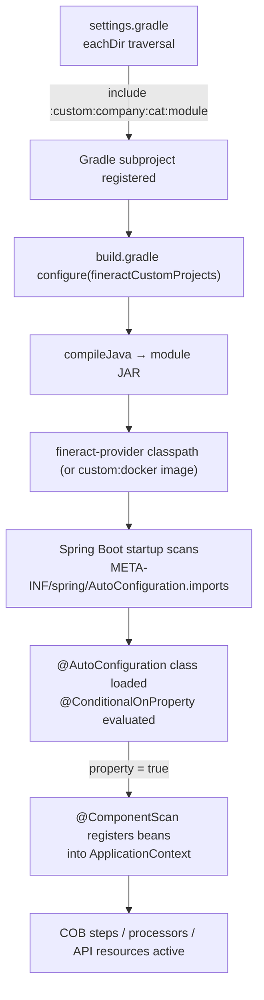

Apache Fineract provides a first-class extensibility mechanism via the `custom/` directory. Custom modules are standard Gradle subprojects discovered dynamically at build time and loaded as Spring Boot auto-configurations at runtime. This system allows organizations to add new Close-of-Business (COB) steps, new API endpoints, custom loan transaction processors, or override any Spring bean — all without forking `fineract-provider`.

## Directory Convention

The `custom/` tree follows a strict three-level hierarchy:

```
custom/
├── docker/                                      ← Custom Docker image build project
│   └── build.gradle                             ← Jib config targeting 'fineract-custom' image
└── <company>/                                   ← Company/organization namespace (e.g. 'acme')
    └── <category>/                              ← Functional category (e.g. 'loan', 'event', 'note')
        └── <module>/                            ← Individual module (e.g. 'cob', 'starter', 'service')
            ├── build.gradle
            ├── dependencies.gradle
            └── src/
                └── main/java/...
```

### Live Example: `custom/acme/`

```
custom/acme/
├── event/
│   ├── externalevent/       ← Custom external event source
│   └── starter/             ← Spring auto-configuration for event module
├── loan/
│   ├── cob/                 ← Custom COB business step (AcmeNoopBusinessStep)
│   ├── job/                 ← Custom batch job (AcmeNoopJob)
│   ├── processor/           ← Custom loan repayment processor
│   └── starter/             ← Spring auto-configuration for loan module
└── note/
    ├── service/             ← Override NoteReadPlatformService + NoteWritePlatformService
    └── starter/             ← Spring auto-configuration for note module
```

---

## Dynamic Module Discovery

Both `settings.gradle` and `build.gradle` use identical Groovy `eachDir` traversal to discover all custom modules at configuration time:

**`settings.gradle`:**
```groovy
file("${rootDir}/custom").eachDir { companyDir ->
    if ('build' != companyDir.name && 'docker' != companyDir.name) {
        file("${rootDir}/custom/${companyDir.name}").eachDir { categoryDir ->
            if ('build' != categoryDir.name) {
                file("${rootDir}/custom/${companyDir.name}/${categoryDir.name}").eachDir { moduleDir ->
                    if ('build' != moduleDir.name) {
                        include ":custom:${companyDir.name}:${categoryDir.name}:${moduleDir.name}"
                    }
                }
            }
        }
    }
}
```

**`build.gradle`:** (adds discovered projects to `fineractJavaProjects` and `fineractCustomProjects`)
```groovy
project.fineractJavaProjects.add(project(":custom:${companyDir.name}:${categoryDir.name}:${moduleDir.name}"))
project.fineractCustomProjects.add(project(":custom:${companyDir.name}:${categoryDir.name}:${moduleDir.name}"))
```

<Note>
  Adding a new directory under `custom/mycompany/mycategory/mymodule/` is enough to register it as a Gradle subproject. No manual edits to `settings.gradle` or `build.gradle` are required.
</Note>

---

## Custom Module Build Conventions

Custom modules in `fineractCustomProjects` receive a special `configure()` block in `build.gradle` that differs from core modules in a few important ways:

### Dependency Defaults

All `fineractCustomProjects` automatically receive:

```groovy
dependencies {
    implementation 'org.springframework:spring-context'
    implementation 'ch.qos.logback:logback-core'
    implementation 'org.slf4j:slf4j-api'

    compileOnly 'org.projectlombok:lombok'
    annotationProcessor 'org.projectlombok:lombok'
    annotationProcessor 'org.mapstruct:mapstruct-processor'
    annotationProcessor 'org.springframework.boot:spring-boot-autoconfigure-processor'
    annotationProcessor 'org.springframework.boot:spring-boot-configuration-processor'

    testImplementation 'org.springframework.boot:spring-boot-starter-test'
    testImplementation 'io.cucumber:cucumber-java:7.34.3'
    testImplementation 'io.cucumber:cucumber-spring:7.34.3'
    testImplementation 'io.cucumber:cucumber-junit-platform-engine:7.34.3'
    // ... plus mockito, junit5, awaitility, classgraph
}
```

### Compile Task Override

```groovy
compileJava {
    dependsOn = []  // Removes all default compile dependencies
}
```

This prevents circular dependency issues when custom modules depend on `fineract-provider` classes that themselves depend on custom module APIs.

### Code Quality Exception

Checkstyle and SpotBugs are disabled for modules whose Gradle path starts with `:custom:acme:`:

```groovy
tasks.withType(Checkstyle).configureEach {
    if (project.path.startsWith(':custom:acme:')) { enabled = false }
}
tasks.withType(SpotBugsTask).configureEach {
    if (project.path.startsWith(':custom:acme:')) { enabled = false }
}
```

Remove this guard in production custom modules to enforce code quality.

---

## Module `build.gradle` Template

Each module's `build.gradle` only needs to declare identity and apply its dependency file:

```groovy
// custom/acme/loan/cob/build.gradle
description = 'ACME Fineract Loan COB'
group = 'com.acme.fineract'

base {
    archivesName = 'acme-fineract-loan-cob'
}

apply from: 'dependencies.gradle'
```

The `dependencies.gradle` file declares `implementation project(':fineract-cob')` and other core module dependencies:

```groovy
// custom/acme/loan/cob/dependencies.gradle
dependencies {
    implementation project(':fineract-cob')
    implementation project(':fineract-loan')
}
```

---

## Spring Auto-Configuration Pattern

Every `starter` module provides a `@AutoConfiguration` class that wires the custom beans into the Spring context. The class is registered in `META-INF/spring/org.springframework.boot.autoconfigure.AutoConfiguration.imports`.

### Example: `AcmeLoanAutoConfiguration`

**File:** `custom/acme/loan/starter/src/main/java/com/acme/fineract/loan/starter/AcmeLoanAutoConfiguration.java`

```java
@AutoConfiguration
@ComponentScan(basePackages = {
    "com.acme.fineract.loan.cob",
    "com.acme.fineract.loan.processor",
    "com.acme.fineract.loan.job"
})
@ConditionalOnProperty("acme.loan.enabled")
public class AcmeLoanAutoConfiguration {

    @Bean
    public LoanRepaymentScheduleTransactionProcessorFactory
            loanRepaymentScheduleTransactionProcessorFactory(
                AcmeLoanRepaymentScheduleTransactionProcessor defaultLoanRepaymentScheduleTransactionProcessor,
                List<LoanRepaymentScheduleTransactionProcessor> processors) {
        return new LoanRepaymentScheduleTransactionProcessorFactory(
                defaultLoanRepaymentScheduleTransactionProcessor, processors);
    }
}
```

Key annotations:
- `@AutoConfiguration` — Spring Boot 3.x auto-configuration, replaces `@Configuration` + `META-INF/spring.factories`
- `@ConditionalOnProperty("acme.loan.enabled")` — gate the entire module behind a property
- `@ComponentScan` — scans sub-packages for `@Component`-annotated beans

### Example: `AcmeNoteAutoConfiguration`

**File:** `custom/acme/note/starter/src/main/java/com/acme/fineract/portfolio/note/starter/AcmeNoteAutoConfiguration.java`

```java
@AutoConfiguration
@ComponentScan("com.acme.fineract.portfolio.note")
@ConditionalOnProperty("acme.note.enabled")
public class AcmeNoteAutoConfiguration {}
```

The empty class body is sufficient — `@ComponentScan` handles bean discovery.

---

## Implementing a Custom COB Business Step

The `fineract-cob` module defines the `LoanCOBBusinessStep` interface. Implement it in a custom module to add new per-loan processing during the nightly Close-of-Business run.

**Interface:** `org.apache.fineract.cob.loan.LoanCOBBusinessStep` (in `fineract-cob`)

**Example:** `custom/acme/loan/cob/src/main/java/com/acme/fineract/loan/cob/AcmeNoopBusinessStep.java`

```java
@Slf4j
@Component
@RequiredArgsConstructor
public class AcmeNoopBusinessStep implements LoanCOBBusinessStep, InitializingBean {

    private static final String ENUM_STYLED_NAME = "ACME_LOAN_NOOP";
    private static final String HUMAN_READABLE_NAME = "ACME Loan Noop";

    // Dependency injection works normally inside custom COB steps
    private final LoanAccountDomainService loanAccountDomainService;

    @Override
    public Loan execute(Loan input) {
        // Your business logic here
        return input;
    }

    @Override
    public String getEnumStyledName() {
        return ENUM_STYLED_NAME;
    }

    @Override
    public String getHumanReadableName() {
        return HUMAN_READABLE_NAME;
    }
}
```

**Required methods:**
- `execute(Loan input)` — Receives the loan entity, returns the (potentially modified) loan
- `getEnumStyledName()` — Unique `UPPER_SNAKE_CASE` identifier used in the COB business step order API
- `getHumanReadableName()` — Display name shown in the UI

**Registration:** The step is automatically discovered when its containing `@Configuration` is annotated with `@ComponentScan` pointing to the package. The COB engine collects all `LoanCOBBusinessStep` beans from the Spring context.

<Tip>
  Use the REST API `PUT /fineract-provider/api/v1/jobs/LOAN_COB/steps` to configure the order in which custom steps execute relative to built-in steps. The `ENUM_STYLED_NAME` value is the step identifier in that API call.
</Tip>

---

## Implementing a Custom Loan Transaction Processor

Extend `FineractStyleLoanRepaymentScheduleTransactionProcessor` (or `AbstractLoanRepaymentScheduleTransactionProcessor`) from `fineract-loan`. The `acme` example extends the Fineract-style base class:

**Example:** `custom/acme/loan/processor/src/main/java/com/acme/fineract/loan/processor/AcmeLoanRepaymentScheduleTransactionProcessor.java`

```java
@Component
public class AcmeLoanRepaymentScheduleTransactionProcessor
        extends FineractStyleLoanRepaymentScheduleTransactionProcessor {

    public static final String STRATEGY_CODE = "acme-standard-strategy";
    public static final String STRATEGY_NAME = "ACME Corp.: standard loan transaction processing strategy";

    public AcmeLoanRepaymentScheduleTransactionProcessor(
            final ExternalIdFactory externalIdFactory,
            final LoanChargeValidator loanChargeValidator,
            final LoanBalanceService loanBalanceService) {
        super(externalIdFactory, loanChargeValidator, loanBalanceService);
    }

    @Override
    public String getCode() { return STRATEGY_CODE; }

    @Override
    public String getName() { return STRATEGY_NAME; }

    // Override payment application logic methods
}
```

Register in `AcmeLoanAutoConfiguration` by providing a `LoanRepaymentScheduleTransactionProcessorFactory` bean that injects all `LoanRepaymentScheduleTransactionProcessor` implementations.

---

## Implementing a Custom API Resource

Add a standard JAX-RS annotated class in any Spring-scanned package. The `fineract-provider` WAR includes all custom module JARs on the classpath, so Spring MVC / JAX-RS will discover them:

```java
@Path("/custom/acme/demo")
@Component
@Tag(name = "Acme Demo")
public class AcmeDemoApiResource {

    @GET
    @Produces(MediaType.APPLICATION_JSON)
    @Operation(summary = "Demo endpoint")
    public Response getDemo(@Context UriInfo uriInfo) {
        return Response.ok("{\"hello\": \"from acme\"}").build();
    }
}
```

Ensure the package is covered by the `@ComponentScan` in the starter's `@AutoConfiguration` class.

---

## Custom Docker Image

`custom/docker/build.gradle` builds a Docker image named `fineract-custom` using Jib. This image bundles all discovered custom module JARs alongside the core `fineract-provider` classpath:

```groovy
jib {
    from { image = 'azul/zulu-openjdk-alpine:21' }
    to {
        image = 'fineract-custom'
        tags = ["${project.version}", 'latest']
    }
    container {
        mainClass = 'org.apache.fineract.ServerApplication'
        // JVM flags: -Duser.home=/tmp, -Dfile.encoding=UTF-8, -Duser.timezone=UTC
    }
}
```

Build the custom image:
```bash
./gradlew :custom:docker:jibDockerBuild
```

Run with Docker Compose:
```bash
docker compose -f docker-compose-custom.yml up
```

---

## Module Lifecycle Flow



---

## Gotchas & Invariants

<Warning>
  The `compileJava { dependsOn = [] }` override in custom modules means they do NOT automatically recompile when their upstream `fineract-*` dependencies change. Run `./gradlew clean build` after core module changes to ensure consistency.
</Warning>

<Note>
  Custom modules are included in `fineractJavaProjects` and receive `checkstyle`, `spotbugs`, and `spotless` configuration — but those tools are disabled for paths matching `:custom:acme:*`. When creating production custom modules under a different namespace (e.g. `:custom:mycompany:`), they will be **fully checked** by default.
</Note>

<Note>
  The `fineractCustomProjects` list is added to `fineractJavaProjects` but is **not** added to `fineractPublishProjects`. Custom module JARs are not published to Maven Central. Package and distribute them as internal artifacts.
</Note>
