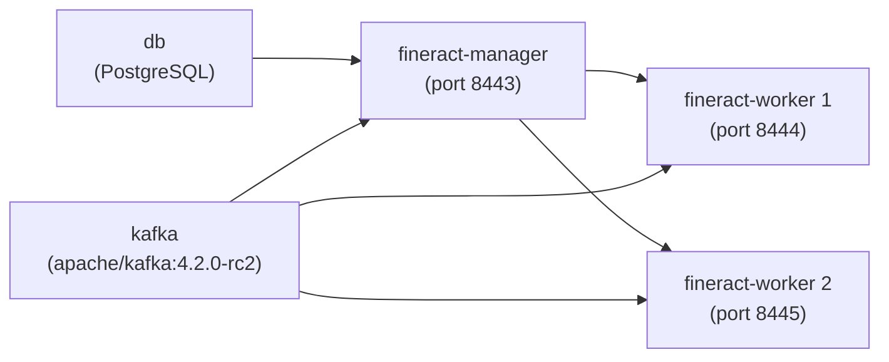

Apache Fineract ships a rich set of container orchestration files in the project root and `config/docker/`. All compose files are **for testing only** — not production-hardened. The canonical Docker image is `apache/fineract` on Docker Hub, built with Google Jib from `fineract-provider/build.gradle`.

<Warning>
  Every compose file carries the header `# FOR TESTING PURPOSES ONLY! NOT SUITABLE FOR PRODUCTION USAGE!`. Database passwords in `config/docker/env/` are sample values. Replace all secrets before deploying to any shared environment.
</Warning>

---

## Docker Compose File Inventory

| File | Purpose |
|---|---|
| `docker-compose.yml` | Default stack: PostgreSQL + Fineract (HTTPS port `8443`, JDWP debug port `5000`) |
| `docker-compose-postgresql.yml` | PostgreSQL variant — same as default but uses `version: "3.8"` compose format and exposes only port `8443` (no debug port) |
| `docker-compose-mysql.yml` | MySQL 8 standalone database (port `3306`); no Fineract service |
| `docker-compose-mariadb.yml` | MariaDB standalone database |
| `docker-compose-postgresql-kafka.yml` | Multi-node: Kafka + PostgreSQL + `fineract-manager` + 2× `fineract-worker` replicas |
| `docker-compose-development.yml` | Full observability stack: Loki + Prometheus + Grafana + Tempo + PostgreSQL + Fineract (debug port `5000`) |
| `docker-compose-community-app.yml` | Adds Mifos Community web app (nginx) proxying to Fineract |
| `docker-compose-web-app.yml` | Web app only |
| `docker-compose-custom.yml` | Fineract with custom modules image (`fineract-custom`) |
| `docker-compose-postgresql-test.yml` | PostgreSQL + Fineract for CI integration tests |
| `docker-compose-mysql-test.yml` | MySQL + Fineract for CI tests |
| `docker-compose-mariadb-test.yml` | MariaDB + Fineract for CI tests |
| `docker-compose-oauth2-test.yml` | OAuth2 test configuration |
| `docker-compose-twofactor-test.yml` | Two-factor authentication test configuration |
| `docker-compose-postgresql-activemq.yml` | PostgreSQL + ActiveMQ + Fineract (JMS-based job dispatch) |
| `docker-compose-postgresql-test-activemq.yml` | PostgreSQL + ActiveMQ for CI tests |
| `docker-compose-postgresql-kafka-msk.yml` | Kafka with AWS MSK IAM authentication |

---

## Default `docker-compose.yml`

The default compose file extends reusable service definitions from `config/docker/compose/`:

```yaml
services:
  db:
    extends:
      file: ./config/docker/compose/postgresql.yml
      service: postgresql

  fineract:
    extends:
      file: ./config/docker/compose/fineract.yml
      service: fineract
    ports:
      - "8443:8443"
      - "5000:5000"      # JDWP debug port
    depends_on:
      db:
        condition: service_healthy
    env_file:
      - ./config/docker/env/fineract.env
      - ./config/docker/env/fineract-common.env
      - ./config/docker/env/fineract-postgresql.env
```

**Services defined:** `db` (PostgreSQL with health check), `fineract` (Spring Boot app with HTTPS on 8443).

---

## `docker-compose-postgresql-kafka.yml` — Clustered Setup

This file defines a 4-container topology for testing horizontal scaling with Kafka-based job dispatch:



| Service | Env Files | Key Mode Flags |
|---|---|---|
| `kafka` | `kafka-server.env` | Kafka broker |
| `db` | `postgresql.env` | PostgreSQL |
| `fineract-manager` | `fineract-manager.env`, `fineract-common.env`, `fineract-postgresql.env`, `kafka-client.env` | `FINERACT_MODE_BATCH_MANAGER_ENABLED=true`, `FINERACT_MODE_BATCH_WORKER_ENABLED=false` |
| `fineract-worker` | `fineract-worker.env`, `fineract-common.env`, `fineract-postgresql.env`, `kafka-client.env` | `FINERACT_MODE_BATCH_WORKER_ENABLED=true`, `FINERACT_LIQUIBASE_ENABLED=false` |

Workers are deployed with `deploy.mode: replicated, replicas: 2`. Each worker gets its own port binding (`8444-8445:8443`).

---

## `docker-compose-development.yml` — Full Observability Stack

Adds Loki, Prometheus, Grafana, and Tempo for local development with distributed tracing and log aggregation. All services log to Loki using the Docker Loki log driver:

```yaml
x-logging: &default-logging
  driver: loki
  options:
    loki-url: 'http://localhost:3100/api/prom/push'
```

Additional env files loaded: `aws.env`, `tracing.env`, `oltp.env`, `prometheus.env`, `debug.env`. The Fineract container is aliased as `fineract-server` on the default network for nginx proxy use.

---

## Environment Variable Files Inventory

All env files live under `config/docker/env/`:

| File | Purpose |
|---|---|
| `fineract.env` | `FINERACT_NODE_ID=1` (base identity) |
| `fineract-common.env` | HikariCP pool settings, tenant DB defaults, SSL, JVM flags, Prometheus |
| `fineract-postgresql.env` | `FINERACT_HIKARI_DRIVER_SOURCE_CLASS_NAME=org.postgresql.Driver`, PostgreSQL JDBC URL, credentials |
| `fineract-mysql.env` | MySQL-specific HikariCP and tenant settings |
| `fineract-mariadb.env` | MariaDB-specific settings |
| `fineract-manager.env` | `FINERACT_MODE_BATCH_MANAGER_ENABLED=true`, `LOAN_COB_*` settings, `OTEL_SERVICE_NAME=fineract-manager` |
| `fineract-worker.env` | `FINERACT_MODE_BATCH_WORKER_ENABLED=true`, `FINERACT_LIQUIBASE_ENABLED=false`, `OTEL_SERVICE_NAME=fineract-worker` |
| `postgresql.env` | PostgreSQL container environment (DB name, user, password) |
| `mysql.env` | MySQL container environment |
| `mariadb.env` | MariaDB container environment |
| `kafka-server.env` | Kafka broker config (listeners, advertised listeners) |
| `kafka-client.env` | `FINERACT_REMOTE_JOB_MESSAGE_HANDLER_KAFKA_*` settings |
| `kafka-client-msk.env` | MSK IAM auth client settings |
| `activemq.env` | ActiveMQ connection settings |
| `aws.env` | AWS SDK credentials and region |
| `debug.env` | `JAVA_TOOL_OPTIONS` with JDWP debug agent on port 5000 |
| `tracing.env` | OpenTelemetry tracing configuration |
| `oltp.env` | OTLP export endpoint |
| `prometheus.env` | Prometheus scrape configuration |
| `cloudwatch.env` | CloudWatch metrics export |

### Key Environment Variables from `fineract-common.env`

| Variable | Default in env file | Effect |
|---|---|---|
| `FINERACT_HIKARI_MINIMUM_IDLE` | `3` | HikariCP min idle |
| `FINERACT_HIKARI_MAXIMUM_POOL_SIZE` | `10` | HikariCP max pool |
| `FINERACT_SERVER_SSL_ENABLED` | `true` | HTTPS on |
| `FINERACT_DEFAULT_TENANTDB_HOSTNAME` | `db` | Resolves to the `db` service name |
| `FINERACT_DEFAULT_MASTER_PASSWORD` | `fineract` | Encryption key |
| `FINERACT_REMOTE_JOB_MESSAGE_HANDLER_SPRING_EVENTS_ENABLED` | `true` | Single-node event dispatch |
| `FINERACT_CONTENT_FILESYSTEM_ROOT_FOLDER` | `/tmp` | Upload storage |
| `SPRING_PROFILES_ACTIVE` | `test,diagnostics` | Active profiles |
| `JAVA_TOOL_OPTIONS` | `-Xmx1G -XX:MinRAMPercentage=25 ...` | JVM heap + container flags |

---

## `docker/server.xml` — Tomcat WAR Deployment

`docker/server.xml` configures Tomcat for WAR-based deployment (used when Fineract is deployed to an existing Tomcat instance rather than the embedded Spring Boot server):

| Component | Setting | Value |
|---|---|---|
| `Server` | shutdown port | `8005` |
| `Connector` (HTTP) | port | `8080` (redirects to 8443) |
| `Connector` (HTTPS) | port | `8443`, `maxThreads=200`, `SSLEnabled=true` |
| `Connector` (HTTPS) | keystore path | `/opt/bitnami/tomcat/tomcat.keystore` |
| `Connector` (HTTPS) | TLS protocol | `TLS` |
| `Connector` (HTTPS) | compression | `force` (HTML, XML, plain, JS, CSS) |
| `Host` | app base | `webapps` |
| `Valve` | access log | `localhost_access_log.*.txt` |

The `Http11NioProtocol` connector uses `URIEncoding="UTF-8"` and `sslProtocol="TLS"`. Note that the Bitnami Tomcat keystore path is specific to the Bitnami base image; adjust for other images.

---

## Docker Image: `apache/fineract`

The official Docker image is built by the `jib` Gradle task in `fineract-provider/build.gradle`:

| Attribute | Value |
|---|---|
| Base image | `azul/zulu-openjdk-alpine:21` |
| Published tag | `apache/fineract:latest` on Docker Hub |
| Main class | `org.apache.fineract.ServerApplication` |
| Exposed port | `8443` (HTTPS) |
| Build tool | Google Jib (no Docker daemon required) |
| Architecture | `amd64` or `arm64` (auto-detected from `os.arch`) |

Build with:
```bash
./gradlew :fineract-provider:jib          # push to registry
./gradlew :fineract-provider:jibDockerBuild  # load into local Docker daemon
```

---

## Kubernetes Manifests

All Kubernetes manifests live in `kubernetes/`:

| File | Kind(s) | Description |
|---|---|---|
| `fineract-server-deployment.yml` | `Service` + `Deployment` | Fineract server: LoadBalancer on port 8443, `apache/fineract:latest` |
| `fineractmysql-deployment.yml` | `PersistentVolume` + `PersistentVolumeClaim` + `Service` + `Deployment` | MariaDB 12.2 with 10Gi PV (5Gi claim), headless ClusterIP service (`clusterIP: None`) |
| `fineractmysql-configmap.yml` | `ConfigMap` | Init SQL: creates `fineract_tenants` and `fineract_default` databases |
| `fineract-mifoscommunity-deployment.yml` | `ConfigMap` + `Service` + `Deployment` | Mifos Community web app (nginx) with LoadBalancer on port 9090 |
| `kubectl-startup.sh` | Script | `kubectl apply` sequence |
| `kubectl-shutdown.sh` | Script | `kubectl delete` sequence |

### `fineract-server-deployment.yml` — Container Env Vars

| Variable | Source | Value |
|---|---|---|
| `FINERACT_NODE_ID` | literal | `1` |
| `FINERACT_HIKARI_DRIVER_CLASS_NAME` | literal | `org.mariadb.jdbc.Driver` _(note: the K8s manifest uses this name; `application.properties` maps the same pool via `FINERACT_HIKARI_DRIVER_SOURCE_CLASS_NAME`)_ |
| `FINERACT_HIKARI_JDBC_URL` | literal | `jdbc:mariadb://fineractmysql:3306/fineract_tenants` |
| `FINERACT_HIKARI_USERNAME` | `secretKeyRef: fineract-tenants-db-secret/username` | from K8s Secret |
| `FINERACT_HIKARI_PASSWORD` | `secretKeyRef: fineract-tenants-db-secret/password` | from K8s Secret |
| `FINERACT_DEFAULT_TENANTDB_HOSTNAME` | literal | `fineractmysql` |
| `FINERACT_DEFAULT_TENANTDB_PORT` | literal | `3306` |
| `FINERACT_DEFAULT_TENANTDB_UID` | `secretKeyRef: fineract-tenants-db-secret/username` | from K8s Secret |
| `FINERACT_DEFAULT_TENANTDB_PWD` | `secretKeyRef: fineract-tenants-db-secret/password` | from K8s Secret |
| `FINERACT_DEFAULT_TENANTDB_CONN_PARAMS` | literal | `''` (empty) |
| `FINERACT_SERVER_PORT` | literal | `8443` |
| `JAVA_TOOL_OPTIONS` | literal | `-Xmx1G -XX:MaxMetaspaceSize=256m` |

Resource limits: `cpu: 1000m / memory: 2Gi`. Resource requests: `cpu: 200m / memory: 1Gi`.

### `fineractmysql-deployment.yml` — MariaDB Resource Specs

The MariaDB container in the K8s manifest runs `mariadb:12.2` with the `--innodb-snapshot-isolation=OFF` argument and the following resource allocation:

| | CPU | Memory |
|---|---|---|
| **Requests** | `1000m` | `1Gi` |
| **Limits** | `2000m` | `5Gi` |

The MariaDB liveness and readiness probes both execute `mariadb -uroot -p${MARIADB_ROOT_PASSWORD} -e 'SELECT 1'` with a `failureThreshold` of `10` and a `timeoutSeconds` of `10`. The database password is supplied from the same `fineract-tenants-db-secret` Kubernetes Secret as the Fineract server.

### Liveness & Readiness Probes

Both the Kubernetes deployment and the Spring Boot application expose health probes:

| Probe | Path | Port | Initial Delay |
|---|---|---|---|
| Liveness | `/fineract-provider/actuator/health/liveness` | `8443` (HTTPS) | 90s |
| Readiness | `/fineract-provider/actuator/health/readiness` | `8443` (HTTPS) | 60s |

These probes are enabled in `application.properties` by:
```properties
management.endpoint.health.probes.enabled=true
management.health.livenessState.enabled=true
management.health.readinessState.enabled=true
```

The init container (`busybox:1.28`) in `fineract-server-deployment.yml` blocks pod start until `fineractmysql:3306` is reachable via `nc`.

---

## `fineractmysql-configmap.yml` — Database Initialization

The `ConfigMap` named `fineractmysql-initdb` is mounted at `/docker-entrypoint-initdb.d/` in the MariaDB container and creates two databases on first boot:

```sql
CREATE DATABASE IF NOT EXISTS `fineract_tenants`;
CREATE DATABASE IF NOT EXISTS `fineract_default`;
GRANT ALL ON *.* TO 'root'@'%';
```

---

## Health Check Summary

| Endpoint | Purpose |
|---|---|
| `/fineract-provider/actuator/health` | Overall health (Docker Compose healthcheck) |
| `/fineract-provider/actuator/health/liveness` | Kubernetes liveness probe |
| `/fineract-provider/actuator/health/readiness` | Kubernetes readiness probe |
| `/fineract-provider/actuator/info` | Git and build info (enabled by `management.info.git.mode=FULL`) |
| `/fineract-provider/actuator/prometheus` | Prometheus metrics scrape |

The Docker Compose PostgreSQL service healthcheck runs `pg_isready`. The Fineract service uses `wget -T5 -qO- https://localhost:8443/fineract-provider/actuator/health` (or similar) as the health check command in test compose files.
