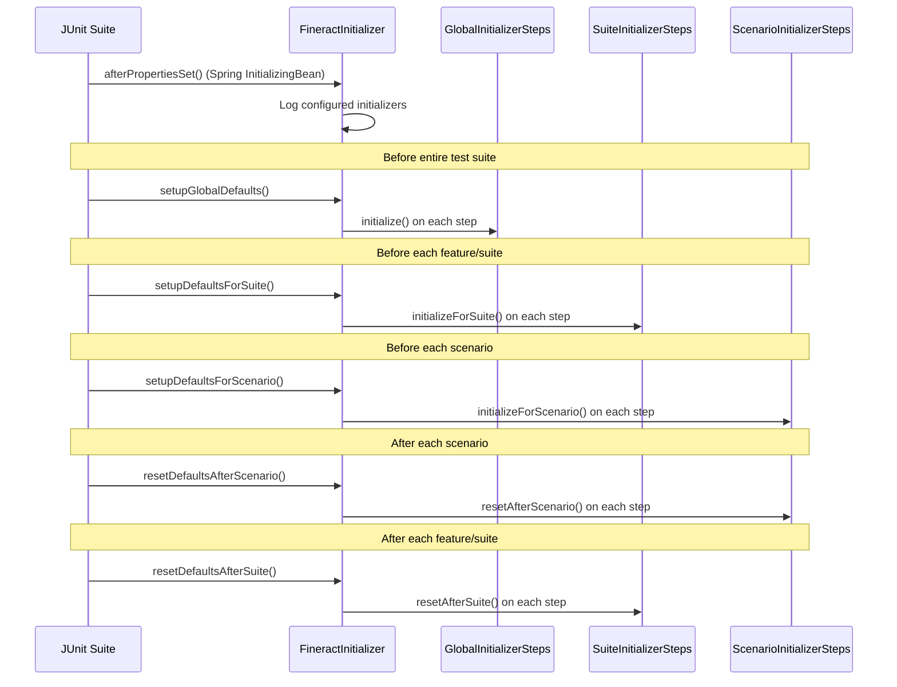

Apache Fineract's E2E test suite is built on Cucumber 7 with Spring Boot test context. It consists of two Gradle modules: `fineract-e2e-tests-core` (shared step definitions and infrastructure) and `fineract-e2e-tests-runner` (feature files, test runner, and environment-specific initializers). Together they provide 100+ feature files covering the complete loan lifecycle, savings, COB, asset externalization, EMI calculations, and more.

## Module Responsibilities

<CardGroup cols={2}>
  <Card title="fineract-e2e-tests-core" icon="puzzle-piece">
    **Shared infrastructure** consumed by the runner and custom module tests:
    - 47 step definition classes (`*StepDef.java`)
    - Initializer SPIs (`FineractGlobalInitializerStep`, `FineractSuiteInitializerStep`, `FineractScenarioInitializerStep`)
    - `FineractInitializer` orchestrator
    - `FineractFeignClient` configuration
    - Domain data enums and test data helpers
    - `AbstractStepDef` base class
    - `TestContext` shared state holder
  </Card>
  <Card title="fineract-e2e-tests-runner" icon="play">
    **Execution entry point** tied to a specific Fineract deployment:
    - `TestRunner.java` (JUnit Platform Suite)
    - All `.feature` files in `src/test/resources/features/`
    - Global initializer implementations (charges, currencies, loan products, etc.)
    - Suite initializer implementations (job configuration, external events)
    - Scenario initializer implementations (global configuration reset)
    - Test configuration: `cucumber.properties`, `junit-platform.properties`
  </Card>
</CardGroup>

---

## Test Runner

**File:** `fineract-e2e-tests-runner/src/test/java/org/apache/fineract/test/TestRunner.java`

```java
@Suite
@IncludeEngines("cucumber")
@SelectPackages("org.apache.fineract.test")
@SelectDirectories("src/test/resources/features")
@ExcludeTags("Skip")
@ConfigurationParameter(key = PLUGIN_PROPERTY_NAME, value = "pretty")
@ConfigurationParameter(key = GLUE_PROPERTY_NAME, value =
    "org.apache.fineract.test.stepdef, " +
    "org.apache.fineract.test.stepdef.common, " +
    "org.apache.fineract.test.stepdef.hook, " +
    "org.apache.fineract.test.stepdef.loan, " +
    "org.apache.fineract.test.stepdef.saving, " +
    "org.apache.fineract.test.config")
public class TestRunner {}
```

The `@ExcludeTags("Skip")` annotation globally excludes scenarios tagged `@Skip`. The `GLUE_PROPERTY_NAME` lists all packages Cucumber scans for `@Given`/`@When`/`@Then` step definitions and `@Before`/`@After` hooks.

---

## Test Configuration Files

### `fineract-test-application.properties`

**Location:** `fineract-e2e-tests-core/src/test/resources/fineract-test-application.properties`

| Property | Env Var | Default | Purpose |
|---|---|---|---|
| `fineract-test.api.base-url` | `BASE_URL` | `https://localhost:8443` | Fineract server URL |
| `fineract-test.api.username` | `TEST_USERNAME` | `mifos` | API username |
| `fineract-test.api.password` | `TEST_PASSWORD` | `password` | API password |
| `fineract-test.api.strong-password` | `TEST_STRONG_PASSWORD` | `A1b2c3d4e5f$` | Password for password-change tests |
| `fineract-test.api.tenant-id` | `TEST_TENANT_ID` | `default` | Tenant identifier |
| `fineract-test.initialization.enabled` | `INITIALIZATION_ENABLED` | `false` | Run global initializers before tests |
| `fineract-test.event.verification-enabled` | `EVENT_VERIFICATION_ENABLED` | `false` | Assert external events in steps |
| `fineract-test.event.wait-timeout-in-ms` | `POLLING_EVENT_WAIT_TIMEOUT_IN_MS` | `5000` | Max wait for event assertion |
| `fineract-test.job.wait-timeout-in-ms` | `POLLING_JOB_WAIT_TIMEOUT_IN_MS` | `120000` | Max wait for scheduler job |
| `fineract-test.job.interval-in-ms` | `POLLING_JOB_INTERVAL_IN_MS` | `100` | Job poll frequency |
| `fineract-test.db.protocol` | `TESTDB_PROTOCOL` | `jdbc:postgresql` | Test DB JDBC protocol |
| `fineract-test.db.hostname` | `TESTDB_HOSTNAME` | `localhost` | Test DB host |
| `fineract-test.db.name` | `TESTDB_NAME` | `fineract_default` | Test DB name |
| `fineract-test.messaging.jms.broker-url` | `ACTIVEMQ_BROKER_URL` | _(empty)_ | JMS broker for event tests |

### `cucumber.properties`

**Location:** `fineract-e2e-tests-runner/src/test/resources/cucumber.properties`

```properties
cucumber.publish.quiet=true
cucumber.glue=org.apache.fineract.test
```

### `junit-platform.properties`

**Location:** `fineract-e2e-tests-runner/src/test/resources/junit-platform.properties`

```properties
cucumber.execution.parallel.enabled=false
cucumber.execution.parallel.config.strategy=fixed
cucumber.execution.parallel.config.fixed.parallelism=3
cucumber.filter.tags=not @Skip
cucumber.execution.exclusive-resources.isolated.read-write=...GLOBAL_KEY
cucumber.execution.execution-mode.feature=same_thread
```

Parallel execution is **disabled** by default (`cucumber.execution.parallel.enabled=false`) but configured for 3-thread parallelism when enabled. The `@isolated` exclusive resource tag prevents conflicting scenarios from running concurrently.

---

## Initializer Lifecycle

The `FineractInitializer` class (`fineract-e2e-tests-core`) orchestrates three distinct initialization scopes:



### SPI Interfaces

| Interface | Package | Method(s) | When Called |
|---|---|---|---|
| `FineractGlobalInitializerStep` | `org.apache.fineract.test.initializer.global` | `initialize()` | Once, before all tests |
| `FineractSuiteInitializerStep` | `org.apache.fineract.test.initializer.suite` | `initializeForSuite()`, `resetAfterSuite()` | Before/after each feature file |
| `FineractScenarioInitializerStep` | `org.apache.fineract.test.initializer.scenario` | `initializeForScenario()`, `resetAfterScenario()` | Before/after each scenario |

### Runner-Provided Global Initializers

All live in `fineract-e2e-tests-runner/src/test/java/org/apache/fineract/test/initializer/global/`:

| Class | What it sets up |
|---|---|
| `BusinessDateInitializerStep` | Sets business date to today |
| `ChargeGlobalInitializerStep` | Creates standard charge products |
| `CobBusinessStepInitializerStep` | Configures LOAN_COB business step order |
| `WcpCobBusinessStepInitializerStep` | Configures working capital COB business step order |
| `CodeGlobalInitializerStep` | Creates system code values |
| `CurrencyGlobalInitializerStep` | Enables required currencies (EUR, USD, etc.) |
| `DatatablesGlobalInitializerStep` | Creates required datatable definitions |
| `DelinquencyGlobalInitializerStep` | Creates delinquency buckets and ranges |
| `FinancialActivityMappingGlobalInitializerStep` | Maps GL accounts to financial activities |
| `FundGlobalInitializerStep` | Creates loan funds |
| `GLGlobalInitializerStep` | Creates GL account chart of accounts |
| `GlobalConfigurationGlobalInitializerStep` | Sets global Fineract configuration flags |
| `LoanProductGlobalInitializerStep` | Creates standard loan products |
| `PaymentTypeGlobalInitializerStep` | Creates payment type definitions |
| `SavingsProductGlobalInitializer` | Creates standard savings products |
| `SchedulerGlobalInitializerStep` | Pauses/configures the job scheduler |
| `WorkingCapitalInitializerStep` | Working capital product initialization |
| `WorkingCapitalBreachInitializeStep` | Working capital breach configuration |

### Suite & Scenario Initializers

| Class | Scope | Purpose |
|---|---|---|
| `ExternalEventSuiteInitializerStep` | Suite | Enables/disables external event emission per feature |
| `JobSuiteInitializerStep` | Suite | Configures scheduler job state before each feature |
| `GlobalConfigurationScenarioInitializerStep` | Scenario | Resets global config changes made during a scenario |

---

## `FineractFeignClient` Configuration

**File:** `fineract-e2e-tests-core/src/test/java/org/apache/fineract/test/api/FineractClientConfiguration.java`

```java
@Configuration
@RequiredArgsConstructor
public class FineractClientConfiguration {

    private final ApiProperties apiProperties;

    @Bean
    public FineractFeignClient fineractFeignClient() {
        return FineractFeignClient.builder()
            .baseUrl(apiProperties.getBaseUrl() + "/fineract-provider/api/")
            .credentials(apiProperties.getUsername(), apiProperties.getPassword())
            .tenantId(apiProperties.getTenantId())
            .disableSslVerification(true)
            .debug(Boolean.parseBoolean(System.getProperty("fineract.feign.debug", "false")))
            .connectTimeout(60, TimeUnit.SECONDS)
            .readTimeout((int) apiProperties.getReadTimeout(), TimeUnit.SECONDS)
            .build();
    }
}
```

`ApiProperties` (`fineract-e2e-tests-core/src/test/java/org/apache/fineract/test/api/ApiProperties.java`) reads `fineract-test.api.*` properties via `@Value`. The `FineractFeignClient` class is from `fineract-client-feign`.

Enable Feign debug logging: `-Dfineract.feign.debug=true`.

---

## Step Definition Inventory

Step definitions live in `fineract-e2e-tests-core/src/test/java/org/apache/fineract/test/stepdef/`. There are 47 classes:

### Loan Step Definitions

| Class | Package | Covered Steps |
|---|---|---|
| `LoanStepDef.java` | `stepdef.loan` | Loan create/approve/disburse/repay/close, status assertions, schedule validation |
| `LoanRepaymentStepDef.java` | `stepdef.loan` | Repayment transactions, advance payments |
| `LoanChargeStepDef.java` | `stepdef.loan` | Charge creation, waiver, reversal |
| `LoanChargeBackStepDef.java` | `stepdef.loan` | Chargeback operations |
| `LoanChargeAdjustmentStepDef.java` | `stepdef.loan` | Charge adjustment |
| `LoanDelinquencyStepDef.java` | `stepdef.loan` | Delinquency bucket assertions |
| `LoanCOBStepDef.java` | `stepdef.loan` | COB job trigger, business date advance, inline COB |
| `InlineCOBStepDef.java` | `stepdef.loan` | Inline COB execution via API |
| `LoanOriginationStepDef.java` | `stepdef.loan` | Loan origination workflow |
| `LoanReAgingStepDef.java` | `stepdef.loan` | Re-aging operations |
| `LoanReAmortizationStepDef.java` | `stepdef.loan` | Re-amortization operations |
| `LoanRescheduleStepDef.java` | `stepdef.loan` | Loan reschedule request |
| `LoanReprocessStepDef.java` | `stepdef.loan` | Transaction reprocessing |
| `LoanInterestPauseStepDef.java` | `stepdef.loan` | Interest pause periods |
| `LoanCapitalizedIncomeStepDef.java` | `stepdef.loan` | Capitalized income handling |
| `LoanOverrideFieldsStepDef.java` | `stepdef.loan` | Override fields on loan |

### Common Step Definitions

| Class | Covered Steps |
|---|---|
| `ClientStepDef.java` | Client create/update/close |
| `BusinessDateStepDef.java` | `When Admin sets the business date to "..."` |
| `BusinessStepConfigurationStepDef.java` | COB step ordering |
| `GlobalConfigurationStepDef.java` | Toggle global config flags |
| `JournalEntriesStepDef.java` | Assert journal entries after transactions |
| `EventStepDef.java` | Assert external events emitted |
| `BatchApiStepDef.java` | Execute batch API requests |
| `CurrencyStepDef.java` | Currency enable/disable |
| `OfficeStepDef.java` | Office operations |
| `SchedulerStepDef.java` | Trigger and await scheduler jobs |
| `UserStepDef.java` | User management |

### Other Step Definitions

| Class | Domain |
|---|---|
| `SavingsAccountStepDef.java` | Savings account full lifecycle |
| `AssetExternalizationStepDef.java` | Loan asset buy/sell transfers |
| `AccountTransferStepDef.java` | Account-to-account transfers |
| `DatatablesStepDef.java` | Datatable CRUD |
| `ReportingStepDef.java` | Report generation and validation |
| `WorkingCapitalStepDef.java` | Working capital loan operations |
| `WorkingCapitalLoanAccountStepDef.java` | Working capital loan account |
| `WorkingCapitalBreachConfigStepDef.java` | Breach configuration |
| `WorkingCapitalDelinquencyStepDef.java` | Working capital delinquency |

---

## Feature File Inventory

All feature files live in `fineract-e2e-tests-runner/src/test/resources/features/`:

<Accordion title="Core Loan Features">

| Feature File | Content Summary |
|---|---|
| `Loan-Part1.feature` | Loan creation, approval, disbursement, business date validation |
| `Loan-Part2.feature` | Loan repayment, overpayment, underpayment |
| `Loan-Part3.feature` | Write-off, close, undo operations |
| `Loan-Part4.feature` | Multiple disbursement, tranche loans |
| `LoanRepayment-Part1.feature` through `LoanRepayment-Part4.feature` | Repayment allocation scenarios |
| `LoanChargeOff-Part1.feature` through `LoanChargeOff-Part4.feature` | Charge-off with accounting entries |
| `LoanChargeback-Part1.feature` through `LoanChargeback-Part3.feature` | Chargeback transactions |
| `LoanDelinquency-Part1.feature`, `LoanDelinquency-Part2.feature` | Delinquency bucket transitions |
| `LoanDownPayment-Part1.feature`, `LoanDownPayment-Part2.feature` | Down payment disbursement |
| `LoanReAging-Part1.feature` through `LoanReAging-Part3.feature` | Re-aging scenarios |
| `LoanReAmortization-Part1.feature`, `LoanReAmortization-Part2.feature` | Re-amortization |
| `LoanAccrualTransaction.feature` | Accrual transaction creation |
| `LoanAccrualActivity-Part1.feature`, `LoanAccrualActivity-Part2.feature` | Accrual activity tracking |
| `LoanReschedule.feature` | Loan reschedule |
| `LoanOrigination.feature` | Loan origination flow |
| `LoanRepaymentSchedule.feature` | Repayment schedule assertions |
| `LoanMigration.feature` | Loan migration scenarios |
| `LoanBuyDownFees.feature` | Buy-down fee scenarios |
| `LoanCapitalizedIncome-Part1.feature`, `LoanCapitalizedIncome-Part2.feature` | Capitalized income |
| `LoanInterestPause.feature` | Interest pause |
| `LoanInterestPaymentWaiver.feature` | Interest payment waiver |
| `LoanInterestRateChange.feature` | Interest rate change |
| `LoanContractTermination.feature` | Contract termination |
| `LoanWriteOff.feature` | Loan write-off |
| `LoanUpdateApprovedAmount.feature` | Update approved amount |
| `LoanUpdateAvailableDisbursementAmount.feature` | Update available disbursement amount |
| `LoanProduct.feature` | Loan product CRUD |
| `LoanOverrideFileds.feature` | Field override feature |
| `LoanMerchantIssuedRefund.feature` | Merchant-issued refund |
| `LoanPayoutRefund.feature` | Payout refund |
| `LoanRegressionSafety.feature` | Regression safety checks |
| `LoanCBR.feature` | Credit bureau report |

</Accordion>

<Accordion title="COB & Scheduling Features">

| Feature File | Content Summary |
|---|---|
| `0_COB.feature` | COB setup and basic execution (runs first — lexicographic ordering) |
| `InlineCOB.feature` | Synchronous inline COB via API |
| `LoanDelayedScheduleCaptures-Part1.feature`, `Part2.feature` | Delayed schedule capture |
| `LoanReAgingAccruals.feature` | Accruals after re-aging |
| `LoanReAmortizationAccruals.feature` | Accruals after re-amortization |
| `WorkingCapital_COB.feature` | Working capital COB |

</Accordion>

<Accordion title="EMI Calculation Features">

| Feature File | Content Summary |
|---|---|
| `EMICalculation-Part1.feature` through `EMICalculation-Part4.feature` | EMI calculation with various amortization, interest, and rounding configurations |

</Accordion>

<Accordion title="Asset Externalization">

| Feature File | Content Summary |
|---|---|
| `AssetExternalization-Part1.feature` | Asset buy/transfer initiation |
| `AssetExternalization-Part2.feature` | Asset sell, cancellation, status transitions |

</Accordion>

<Accordion title="Working Capital Features">

Over 25 feature files covering the complete working capital loan system: `WorkingCapitalLoanAccount.feature`, `WorkingCapitalLoanProduct.feature`, `WorkingCapitalLoanRepayment.feature`, `WorkingCapitalDelinquency.feature`, `WorkingCapitalBreachConfiguration.feature`, `WorkingCapitalBreachEvaluation.feature`, `WorkingCapitalDiscount.feature`, `WorkingCapitalDiscountAmortization.feature`, `WorkingCapitalPeriodPaymentRate.feature`, etc.

</Accordion>

<Accordion title="Other Domain Features">

| Feature File | Content Summary |
|---|---|
| `SavingsAccount.feature` | Savings account lifecycle |
| `Client.feature` | Client create, update, close |
| `BusinessDate.feature` | Business date management |
| `Configuration.feature` | Global configuration toggles |
| `Currency.feature` | Currency enable/disable |
| `Datatables.feature` | Datatable CRUD |
| `BatchApi.feature` | Batch API execution |
| `Reporting.feature` | Report generation |
| `LoanChargesCumulativeLoan.feature` | Charges on cumulative loans |
| `LoanChargesDisbursement.feature` | Disbursement charges |
| `LoanChargesInstallmentFee.feature` | Installment fee charges |
| `LoanChargesProgressiveLoan.feature` | Charges on progressive loans |
| `LoanChargesTrancheDisbursement.feature` | Tranche disbursement charges |

</Accordion>

---

## Tag-Based Filtering

Cucumber tags control which scenarios execute:

| Tag | Meaning |
|---|---|
| `@Skip` | Globally excluded by `TestRunner`'s `@ExcludeTags("Skip")` and `cucumber.filter.tags=not @Skip` |
| `@Smoke` | Smoke test subset (fast, core functionality) |
| `@LoanFeature` | Feature-level tag on loan feature files (e.g., `@LoanFeature` on `Loan-Part1.feature`) |
| `@TestRailId:CXX` | Maps scenario to TestRail test case ID for CI reporting |
| `@single` | Scenarios that cannot run in parallel |
| `@multi` | Parallel-safe scenarios |
| `@isolated` | Requires exclusive resource lock (prevents parallel execution with other `@isolated` scenarios) |

Run a subset by tag:
```bash
./gradlew :fineract-e2e-tests-runner:cucumber \
  -Dcucumber.filter.tags="@Smoke and not @Skip"
```

---

## Loan Lifecycle Feature Pattern

A typical loan scenario in Gherkin follows this pattern (from `Loan-Part1.feature`):

```gherkin
@TestRailId:C47 @multi
Scenario: As a user I would like to see that the loan can be disbursed at the business date
  When Admin sets the business date to "1 July 2022"
  When Admin creates a client with random data
  And Admin successfully creates a new customised Loan submitted on date: "1 July 2022",
      with Principal: "5000", a loanTermFrequency: 24 months, and numberOfRepayments: 24
  And Admin successfully approves the loan on "1 July 2022" with "5000" amount
      and expected disbursement date on "2 July 2022"
  When Admin successfully disburse the loan on "1 July 2022" with "5000" EUR transaction amount
```

Each `When`/`And`/`Then` step maps to a method annotated with `@When`, `@And`, or `@Then` in the appropriate `*StepDef` class. Step regex patterns use Cucumber expression types (`{string}`, `{int}`, `{double}`, `{localdate}`) for type-safe parameter extraction.

---

## Running E2E Tests

<Steps>
  <Step title="Start Fineract">
    ```bash
    docker compose -f docker-compose-postgresql-test.yml up -d
    ```
  </Step>
  <Step title="Wait for Health">
    ```bash
    # Check: https://localhost:8443/fineract-provider/actuator/health
    curl -k https://localhost:8443/fineract-provider/actuator/health
    ```
  </Step>
  <Step title="Run All Scenarios">
    ```bash
    ./gradlew :fineract-e2e-tests-runner:cucumber \
      -DBASE_URL=https://localhost:8443 \
      -DINITIALIZATION_ENABLED=true
    ```
  </Step>
  <Step title="Run Specific Feature">
    ```bash
    ./gradlew :fineract-e2e-tests-runner:cucumber \
      -Dcucumber.filter.tags="@TestRailId:C47"
    ```
  </Step>
  <Step title="Generate Allure Report">
    ```bash
    ./gradlew :fineract-e2e-tests-runner:allureReport
    # Opens build/reports/allure-report/index.html
    ```
  </Step>
</Steps>

<Note>
  Set `INITIALIZATION_ENABLED=true` the **first time** you run against a fresh Fineract instance. The global initializers create loan products, charges, currencies, GL accounts, and other master data that the feature scenarios depend on. On subsequent runs it can be set to `false` for speed if the data is still present.
</Note>

<Warning>
  `cucumber.execution.parallel.enabled=false` is the safe default. Enabling parallelism requires careful tagging with `@isolated` on scenarios that modify global state (business date, global configuration, COB step order). Without isolation guards, concurrent scenarios will fail nondeterministically.
</Warning>
