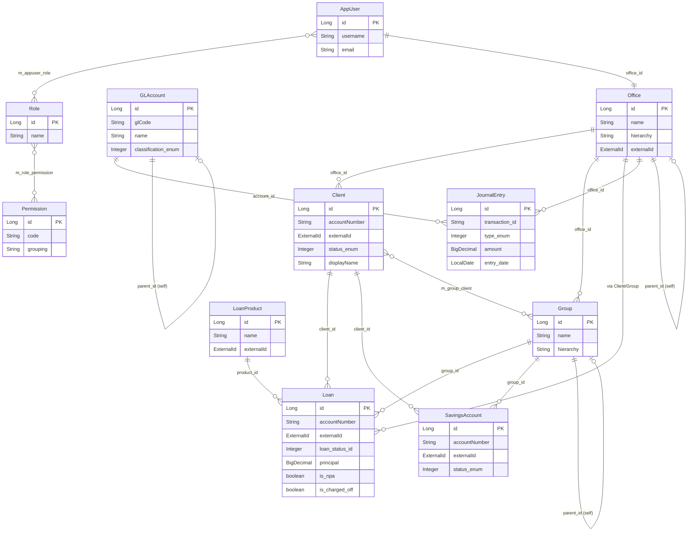

Apache Fineract's persistence layer is built on JPA with EclipseLink as the provider and Spring Data JPA for repository infrastructure. Every persistent entity inherits from one of two abstract base classes in `fineract-core/src/main/java/org/apache/fineract/infrastructure/core/domain/`. This page covers every major entity, the inheritance hierarchy, the `ExternalId` value type, the full entity-relationship model, EclipseLink static weaving configuration, and the validation error accumulation pattern.

---

## JPA Base Classes

### AbstractPersistableCustom

**File:** `fineract-core/src/main/java/org/apache/fineract/infrastructure/core/domain/AbstractPersistableCustom.java`

```java
@MappedSuperclass
public abstract class AbstractPersistableCustom<T extends Serializable>
        implements Persistable<T>, Serializable {

    @Id
    @GeneratedValue(strategy = GenerationType.IDENTITY)
    private T id;

    @Transient
    private boolean isNew = true;   // set false by @PrePersist / @PostLoad
}
```

This is the **root base class** for all JPA entities in Fineract. Key invariants:

- `GenerationType.IDENTITY` — the database auto-increment column is the sole ID source. No sequence-based or table-based strategies are used.
- `isNew` is a transient flag managed by `@PrePersist` and `@PostLoad` lifecycle hooks. Spring Data's `SimpleJpaRepository.save()` uses `Persistable.isNew()` to decide between `persist` and `merge`.
- `equals()` and `hashCode()` are intentionally **not implemented** in this class due to historical EclipseLink compatibility issues. Subclasses must implement them (or rely on identity equality).
- The generic parameter `T` is always `Long` in practice (no entity uses a non-Long PK).

<Note>
The comment in the source says: "we end up with issues on OpenJPA" (now EclipseLink) if `equals`/`hashCode` are based on the id in the superclass. Subclasses should implement these methods explicitly.
</Note>

### AbstractAuditableCustom

**File:** `fineract-core/src/main/java/org/apache/fineract/infrastructure/core/domain/AbstractAuditableCustom.java`

A **legacy** base class extending `AbstractPersistableCustom<Long>` that uses `LocalDateTime` and legacy column names (`createdby_id`, `created_date`, `lastmodifiedby_id`, `lastmodified_date`). It implements `Auditable<Long, Long, LocalDateTime>`.

```java
@MappedSuperclass
public abstract class AbstractAuditableCustom extends AbstractPersistableCustom<Long>
        implements Auditable<Long, Long, LocalDateTime> {

    @Column(name = "createdby_id")
    private Long createdBy;

    @Column(name = "created_date")
    private LocalDateTime createdDate;

    @Column(name = "lastmodifiedby_id")
    private Long lastModifiedBy;

    @Column(name = "lastmodified_date")
    private LocalDateTime lastModifiedDate;
}
```

<Warning>
`AbstractAuditableCustom` is the **older** audit base class using `LocalDateTime` without UTC normalization. New entities should use `AbstractAuditableWithUTCDateTimeCustom` instead.
</Warning>

### AbstractAuditableWithUTCDateTimeCustom

**File:** `fineract-core/src/main/java/org/apache/fineract/infrastructure/core/domain/AbstractAuditableWithUTCDateTimeCustom.java`

The **preferred** audit base class for all modern entities. Uses `OffsetDateTime` and stores datetimes in UTC-normalized columns.

```java
@MappedSuperclass
public abstract class AbstractAuditableWithUTCDateTimeCustom<T extends Serializable>
        extends AbstractPersistableCustom<T>
        implements Auditable<Long, T, OffsetDateTime> {

    @Column(name = "created_by", updatable = false, nullable = false)
    private Long createdBy;

    @Column(name = "created_on_utc", updatable = false, nullable = false)
    private OffsetDateTime createdDate;

    @Column(name = "last_modified_by", nullable = false)
    private Long lastModifiedBy;

    @Column(name = "last_modified_on_utc", nullable = false)
    private OffsetDateTime lastModifiedDate;
}
```

Column name constants are in `AuditableFieldsConstants`:

| Constant | DB Column |
|----------|-----------|
| `CREATED_BY_DB_FIELD` | `created_by` |
| `CREATED_DATE_DB_FIELD` | `created_on_utc` |
| `LAST_MODIFIED_BY_DB_FIELD` | `last_modified_by` |
| `LAST_MODIFIED_DATE_DB_FIELD` | `last_modified_on_utc` |

The datetimes are converted from **tenant timezone → UTC** before storing, and from **system timezone → tenant timezone** after fetching. This normalization is handled transparently by a JPA converter registered in the Spring context.

---

## ExternalId Value Type

**File:** `fineract-core/src/main/java/org/apache/fineract/infrastructure/core/domain/ExternalId.java`

`ExternalId` is a **value object** (not an entity) that wraps a `String` UUID-style identifier for external system correlation. It is stored as a plain `VARCHAR` column via `ExternalIdConverter`.

```java
@Getter
@EqualsAndHashCode
public class ExternalId implements Serializable {
    private final String value;   // nullable — use ExternalId.empty()

    public static ExternalId generate()  { return new ExternalId(UUID.randomUUID().toString()); }
    public static ExternalId empty()     { /* singleton with value=null */ }
    public boolean isEmpty()             { return value == null; }
    public void throwExceptionIfEmpty()  { /* throws PlatformInternalServerException */ }
}
```

### ExternalIdConverter

**File:** `fineract-provider/src/main/java/org/apache/fineract/infrastructure/core/domain/ExternalIdConverter.java`

A JPA `@Converter(autoApply = true)` that transparently converts `ExternalId ↔ String`:

```java
@Converter(autoApply = true)
public class ExternalIdConverter implements AttributeConverter<ExternalId, String> {
    public String convertToDatabaseColumn(ExternalId id) { return id != null ? id.getValue() : null; }
    public ExternalId convertToEntityAttribute(String s)  {
        return StringUtils.isBlank(s) ? ExternalId.empty() : ExternalIdFactory.produce(s);
    }
}
```

Because `autoApply = true`, any entity field typed `ExternalId` is automatically serialized/deserialized — no explicit `@Convert` annotation needed.

### ExternalIdFactory

**File:** `fineract-core/src/main/java/org/apache/fineract/infrastructure/core/service/ExternalIdFactory.java`

Spring `@Component` with two responsibilities:
1. **Static** `produce(String)` — used by `ExternalIdConverter`.
2. **Instance** `create(String)` — reads the `auto-generate-external-id` global configuration flag. If enabled and no value is provided, calls `ExternalId.generate()` to auto-generate a UUID.

### Usage Across Entities

`ExternalId` fields appear on:

| Entity | Class | Column |
|--------|-------|--------|
| `Loan` | `m_loan` | `external_id` |
| `LoanTransaction` | `m_loan_transaction` | `external_id` |
| `LoanCharge` | `m_loan_charge` | `external_id` |
| `Client` | `m_client` | `external_id` |
| `SavingsAccount` | `m_savings_account` | `external_id` |
| `Office` | `m_office` | `external_id` |
| `LoanProduct` | `m_product_loan` | `external_id` |

---

## File Inventory Table

| Entity Class | Source File | DB Table | Base Class |
|-------------|-------------|----------|------------|
| `Loan` | `fineract-loan/.../loanaccount/domain/Loan.java` | `m_loan` | `AbstractAuditableWithUTCDateTimeCustom<Long>` |
| `LoanTransaction` | `fineract-loan/.../loanaccount/domain/LoanTransaction.java` | `m_loan_transaction` | `AbstractAuditableWithUTCDateTimeCustom<Long>` |
| `LoanProduct` | `fineract-loan/.../loanproduct/domain/LoanProduct.java` | `m_product_loan` | `AbstractPersistableCustom<Long>` |
| `Client` | `fineract-core/.../client/domain/Client.java` | `m_client` | `AbstractAuditableWithUTCDateTimeCustom<Long>` |
| `Group` | `fineract-core/.../group/domain/Group.java` | `m_group` | `AbstractPersistableCustom<Long>` |
| `Office` | `fineract-core/.../office/domain/Office.java` | `m_office` | `AbstractPersistableCustom<Long>` |
| `Staff` | `fineract-core/.../staff/domain/Staff.java` | `m_staff` | `AbstractPersistableCustom<Long>` |
| `SavingsAccount` | `fineract-savings/.../savings/domain/SavingsAccount.java` | `m_savings_account` | `AbstractAuditableWithUTCDateTimeCustom<Long>` |
| `AppUser` | `fineract-core/.../useradministration/domain/AppUser.java` | `m_appuser` | `AbstractPersistableCustom<Long>` |
| `Role` | `fineract-core/.../useradministration/domain/Role.java` | `m_role` | `AbstractPersistableCustom<Long>` |
| `Permission` | `fineract-core/.../useradministration/domain/Permission.java` | `m_permission` | `AbstractPersistableCustom<Long>` |
| `GLAccount` | `fineract-core/.../accounting/glaccount/domain/GLAccount.java` | `acc_gl_account` | `AbstractPersistableCustom<Long>` |
| `JournalEntry` | `fineract-accounting/.../journalentry/domain/JournalEntry.java` | `acc_gl_journal_entry` | `AbstractAuditableWithUTCDateTimeCustom<Long>` |

---

## Key Entity Relationships

### Loan

**File:** `fineract-loan/src/main/java/org/apache/fineract/portfolio/loanaccount/domain/Loan.java`
**Table:** `m_loan` — `@UniqueConstraint` on `account_no`

Critical `@ManyToOne` relationships:
- `client: Client` — the borrower (join column: `client_id`)
- `group: Group` — optional group loan (join column: `group_id`)
- `loanProduct: LoanProduct` — product template (join column: `product_id`)
- `loanOfficer: Staff` — assigned loan officer (join column: `loan_officer_id`)
- `fund: Fund` — funding source (join column: `fund_id`)

Critical `@OneToMany` (all `CascadeType.ALL, orphanRemoval = true`):
- `repaymentScheduleInstallments: List<LoanRepaymentScheduleInstallment>`
- `loanTransactions: List<LoanTransaction>`
- `charges: Set<LoanCharge>`
- `disbursementDetails: List<LoanDisbursementDetails>`
- `rates: List<Rate>`
- `loanTermVariations: List<LoanTermVariations>`

Key scalar columns: `account_no`, `external_id (ExternalId)`, `loan_status_id (int)`, `loan_type_enum`, `principal_amount_proposed (BigDecimal)`, `approved_principal`, `net_disbursal_amount`, `is_npa`, `is_fraud`, `is_charged_off`, `enable_installment_level_delinquency`, `last_closed_business_date`, `overpaid_on_date`, `repayment_start_date_type`.

### LoanTransaction

**File:** `fineract-loan/src/main/java/org/apache/fineract/portfolio/loanaccount/domain/LoanTransaction.java`
**Table:** `m_loan_transaction` — `@UniqueConstraint` on `external_id`

Extends `AbstractAuditableWithUTCDateTimeCustom<Long>`. Key columns: `loan_id` (FK to `m_loan`), `office_id`, `transaction_type_enum`, `transaction_date`, `amount`, `principal_portion_derived`, `interest_portion_derived`, `fee_charges_portion_derived`, `penalty_charges_portion_derived`, `overpayment_portion_derived`, `external_id (ExternalId)`, `is_reversed`, `reversal_external_id`, `reversed_on_date`.

### Client

**File:** `fineract-core/src/main/java/org/apache/fineract/portfolio/client/domain/Client.java`
**Table:** `m_client` — `@UniqueConstraint` on `account_no`, `mobile_no`

Extends `AbstractAuditableWithUTCDateTimeCustom<Long>`. Key relationships:
- `office: Office` — mandatory, `@ManyToOne @JoinColumn(name = "office_id", nullable = false)`
- `staff: Staff` — optional, `@ManyToOne @JoinColumn(name = "staff_id")`
- `groups: Set<Group>` — `@ManyToMany` via `m_group_client` join table
- `identifiers: Set<ClientIdentifier>` — `@OneToMany(cascade = ALL, orphanRemoval = true)`

Key scalar fields: `account_no (VARCHAR 20)`, `external_id (ExternalId)`, `status_enum (int)`, `display_name (VARCHAR 160, NOT NULL)`, `is_staff (boolean)`, `activation_date`, `date_of_birth`, `legal_form_enum`.

### Office

**File:** `fineract-core/src/main/java/org/apache/fineract/organisation/office/domain/Office.java`
**Table:** `m_office` — `@UniqueConstraint` on `name`, `external_id`

Extends `AbstractPersistableCustom<Long>`. Self-referential hierarchy:
- `parent: Office` — `@ManyToOne @JoinColumn(name = "parent_id")` (null for root office)
- `children: List<Office>` — `@OneToMany @JoinColumn(name = "parent_id")`

Key columns: `name (VARCHAR 100)`, `hierarchy (VARCHAR 50)` — stores materialized path string for branch hierarchy traversal, `opening_date`, `external_id (ExternalId)`.

### Group

**File:** `fineract-core/src/main/java/org/apache/fineract/portfolio/group/domain/Group.java`
**Table:** `m_group` — extends `AbstractPersistableCustom<Long>`

Key relationships:
- `office: Office` — `@ManyToOne @JoinColumn` (not null)
- `staff: Staff` — `@ManyToOne` (optional)
- `parent: Group` — `@ManyToOne` (centers/groups hierarchy)
- `clientMembers: Set<Client>` — `@OneToMany(fetch = EAGER)` (group members)
- `staffHistory: Set<StaffAssignmentHistory>` — `@OneToMany(cascade = ALL, orphanRemoval = true)`

### SavingsAccount

**File:** `fineract-savings/src/main/java/org/apache/fineract/portfolio/savings/domain/SavingsAccount.java`
**Table:** `m_savings_account` — extends `AbstractAuditableWithUTCDateTimeCustom<Long>`

Key relationships:
- `client: Client` — `@ManyToOne(optional = true) @JoinColumn(name = "client_id")`
- `group: Group` — `@ManyToOne(optional = true, fetch = LAZY) @JoinColumn(name = "group_id")`
- `product: SavingsProduct` — `@ManyToOne @JoinColumn(name = "product_id", nullable = false)`
- `savingsOfficer: Staff` — `@ManyToOne(fetch = LAZY) @JoinColumn(name = "field_officer_id")`
- `transactions: List<SavingsAccountTransaction>` — `@OneToMany(cascade = ALL, orphanRemoval = true)`
- `charges: Set<SavingsAccountCharge>` — `@OneToMany(cascade = ALL, orphanRemoval = true)`

Key scalar fields: `account_no`, `external_id (ExternalId)`, `status_enum`, `sub_status_enum`, `nominal_annual_interest_rate`, `allow_overdraft`, `overdraft_limit`, `is_lien_allowed`, `reason_for_block`.

### AppUser

**File:** `fineract-core/src/main/java/org/apache/fineract/useradministration/domain/AppUser.java`
**Table:** `m_appuser` — extends `AbstractPersistableCustom<Long>`

Key relationships:
- `office: Office` — `@ManyToOne @JoinColumn(name = "office_id")`
- `staff: Staff` — `@ManyToOne @JoinColumn(name = "staff_id")`
- `roles: Set<Role>` — `@ManyToMany(fetch = EAGER)` via `m_appuser_role` join table

Key columns: `email`, `username`, `password (BCrypt hash)`, `nonexpired`, `nonlocked`, `enabled`, `firsttime_login_remaining`, `failed_login_attempts`, `is_login_retries_enabled`, `last_time_password_updated`, `password_never_expires`, `password_reset_required`.

### Role

**File:** `fineract-core/src/main/java/org/apache/fineract/useradministration/domain/Role.java`
**Table:** `m_role` — extends `AbstractPersistableCustom<Long>`

- `permissions: Set<Permission>` — `@ManyToMany(fetch = EAGER)` via `m_role_permission` join table with `@JoinTable(name = "m_role_permission", joinColumns = @JoinColumn(name = "role_id"), inverseJoinColumns = @JoinColumn(name = "permission_id"))`

### Permission

**File:** `fineract-core/src/main/java/org/apache/fineract/useradministration/domain/Permission.java`
**Table:** `m_permission` — extends `AbstractPersistableCustom<Long>`

Columns: `grouping (VARCHAR 45)`, `code (VARCHAR 100)` — composite of `actionName + "_" + entityName`, `entity_name`, `action_name`, `can_maker_checker (boolean)`. Codes follow the pattern `READ_Loan`, `CREATE_Loan`, `APPROVE_Loan`, etc.

### GLAccount

**File:** `fineract-core/src/main/java/org/apache/fineract/accounting/glaccount/domain/GLAccount.java`
**Table:** `acc_gl_account` — `@UniqueConstraint` on `gl_code`

Extends `AbstractPersistableCustom<Long>`. Self-referential hierarchy:
- `parent: GLAccount` — `@ManyToOne(fetch = LAZY) @JoinColumn(name = "parent_id")`
- `children: List<GLAccount>` — `@OneToMany(fetch = LAZY) @JoinColumn(name = "parent_id")`

Key columns: `name`, `gl_code`, `disabled`, `manual_journal_entries_allowed`, `classification_enum` (ASSET=1, LIABILITY=2, EQUITY=3, INCOME=4, EXPENSE=5), `account_usage` (HEADER=1, DETAIL=2), `hierarchy`, `description`.

### JournalEntry

**File:** `fineract-accounting/src/main/java/org/apache/fineract/accounting/journalentry/domain/JournalEntry.java`
**Table:** `acc_gl_journal_entry`

Extends `AbstractAuditableWithUTCDateTimeCustom<Long>`. Key relationships:
- `office: Office` — `@ManyToOne @JoinColumn(name = "office_id", nullable = false)`
- `glAccount: GLAccount` — `@ManyToOne @JoinColumn(name = "account_id", nullable = false)` — the credited/debited GL account
- `paymentDetail: PaymentDetail` — `@ManyToOne @JoinColumn(name = "payment_details_id")`
- `reversalJournalEntry: JournalEntry` — `@ManyToOne(fetch = LAZY) @JoinColumn(name = "reversal_id")` — self-referential reversal link

Key columns: `currency_code`, `transaction_id (VARCHAR 50)`, `loan_transaction_id`, `savings_transaction_id`, `client_transaction_id`, `share_transaction_id`, `reversed`, `manual_entry`, `entry_date`, `type_enum` (CREDIT=1, DEBIT=2), `amount`, `entity_type_enum`, `entity_id`, `ref_num`, `submitted_on_date`.

---

## Table Naming Conventions

| Prefix | Domain | Examples |
|--------|--------|---------|
| `m_` | Main domain tables | `m_loan`, `m_client`, `m_office`, `m_savings_account` |
| `acc_` | Accounting tables | `acc_gl_account`, `acc_gl_journal_entry`, `acc_product_mapping` |
| `c_` | Configuration tables | `c_configuration`, `c_cache`, `c_external_service` |
| `job` | Spring Batch / scheduler | `job`, `job_parameters`, `job_run_history` |
| `BATCH_` | Spring Batch 5 tables | `BATCH_JOB_INSTANCE`, `BATCH_JOB_EXECUTION` |
| `r_` | Reference / enum tables | `r_enum_value` |
| `glim_` / `gsim_` | Group loan/savings individual monitoring | `glim_accounts`, `gsim_accounts` |

---

## Entity Relationship Diagram



---

## EclipseLink Static Weaving

### Why Static Weaving?

EclipseLink enhances JPA entity bytecode at **runtime** by default (dynamic weaving), which requires the JVM agent or special classloader setup. Fineract uses **static weaving** instead — the bytecode enhancement runs at **build time** — for two reasons:
1. **Performance**: no weaving overhead at startup.
2. **Compatibility**: works with all classloaders (OSGi, fat JARs, module system).

### Configuration

Each Gradle module that contains JPA entities must have a `persistence.xml` at:
```
src/main/resources/jpa/static-weaving/module/<module-name>/persistence.xml
```

Example path: `fineract-core/src/main/resources/jpa/static-weaving/module/fineract-core/persistence.xml`

The `persistence.xml` lists every entity class and sets:
```xml
<property name="eclipselink.weaving" value="static" />
<property name="eclipselink.weaving.internal" value="false"/>
```

The weaving task is registered in `static-weaving.gradle` and runs as the **last step of `compileJava`**, reading compiled `.class` files from `build/classes/java/main` and writing enhanced classes back to the same directory.

### Adding Static Weaving to a New Module

Per `STATIC_WEAVING.md`:

1. Add JPA entities to `src/main/java`.
2. Create `src/main/resources/jpa/static-weaving/module/<module-name>/persistence.xml` listing all entity classes.
3. The build automatically detects the `persistence.xml` and applies weaving.

**Modules with active weaving** (persistence.xml files exist):
- `fineract-core` — `GLAccount`, `Client`, `Group`, `Office`, `AppUser`, `Role`, `Permission`, `ExternalEvent`, and 20+ others
- `fineract-accounting`
- `fineract-branch`
- `fineract-charge`
- `fineract-cob`
- `fineract-loan`
- `fineract-savings`
- `fineract-investor`

---

## Validation Error Model

### DataValidatorBuilder

**File:** `fineract-core/src/main/java/org/apache/fineract/infrastructure/core/data/DataValidatorBuilder.java`

Fineract uses a **builder-based accumulator** pattern for validation. All validation errors are collected into a `List<ApiParameterError>` before being thrown as a single `PlatformApiDataValidationException`. This avoids the "fail-fast" problem where only the first error is reported.

```java
// Typical usage in a command handler / validator:
final List<ApiParameterError> dataValidationErrors = new ArrayList<>();
final DataValidatorBuilder baseDataValidator = new DataValidatorBuilder(dataValidationErrors)
    .resource("loan");

baseDataValidator.reset().parameter("principal").value(principal).notNull().positiveAmount();
baseDataValidator.reset().parameter("numberOfRepayments").value(numberOfRepayments).notNull().integerGreaterThanZero();

if (!dataValidationErrors.isEmpty()) {
    throw new PlatformApiDataValidationException(dataValidationErrors);
}
```

`DataValidatorBuilder` supports a fluent chain of constraint methods:
- `.notNull()`, `.notBlank()`, `.notExceedingLengthOf(n)`
- `.positiveAmount()`, `.integerGreaterThanZero()`, `.zeroOrPositiveAmount()`
- `.inMinMaxRange(min, max)`, `.notGreaterThanMax(max)`
- `.isOneOfTheseValues(values)`, `.isOneOfEnumValues(EnumClass)`
- `.validateForCronExpression()`, `.validateForRRule()`

The `merge(DataValidatorBuilder other)` method combines two builders' error lists.
The `throwValidationErrors()` convenience method throws if `!dataValidationErrors.isEmpty()`.

### ApiParameterError

**File:** `fineract-core/src/main/java/org/apache/fineract/infrastructure/core/data/ApiParameterError.java`

Represents a single field-level validation failure:

| Field | Type | Description |
|-------|------|-------------|
| `developerMessage` | `String` | Technical description (English) |
| `defaultUserMessage` | `String` | User-facing English description |
| `userMessageGlobalisationCode` | `String` | i18n message key |
| `parameterName` | `String` | The offending API parameter name |
| `value` | `Object` | The rejected value |
| `args` | `List<ApiErrorMessageArg>` | Arguments for the message template |

Factory methods:
- `ApiParameterError.generalError(code, message)` — for non-field errors
- `ApiParameterError.parameterError(code, message, parameterName, value, args...)` — for field errors

### PlatformApiDataValidationException

**File:** `fineract-core/src/main/java/org/apache/fineract/infrastructure/core/exception/PlatformApiDataValidationException.java`

Extends `AbstractPlatformException`. Holds `List<ApiParameterError> errors`. The REST exception handler maps this to HTTP 400 with a JSON body containing the full error list:

```json
{
  "errors": [
    {
      "developerMessage": "The parameter principal cannot be blank.",
      "defaultUserMessage": "The parameter principal cannot be blank.",
      "userMessageGlobalisationCode": "validation.msg.loan.principal.cannot.be.blank",
      "parameterName": "principal",
      "value": null,
      "args": []
    }
  ]
}
```

---

## Gotchas and Invariants

<CardGroup cols={2}>
  <Card title="GenerationType.IDENTITY is universal" icon="key">
    Every entity uses `GenerationType.IDENTITY`. Batch inserts via `saveAll()` will not benefit from
    JDBC batching unless the driver supports `getGeneratedKeys` per-row. PostgreSQL `RETURNING id`
    clauses handle this; MySQL uses last-insert-id.
  </Card>
  <Card title="No equals/hashCode in base" icon="warning">
    `AbstractPersistableCustom` intentionally omits `equals`/`hashCode`. Entities in collections
    (e.g. `Set<LoanCharge>`) rely on identity equality unless the concrete class implements them.
    This is a known footgun — always check the concrete entity.
  </Card>
  <Card title="ExternalId.empty() is a singleton" icon="circle">
    `ExternalId.empty()` returns a single static instance with `value == null`. Test `isEmpty()`
    before calling `getValue()`. Passing `empty()` to anything expecting a non-null string will
    produce `null` silently.
  </Card>
  <Card title="Audit columns are UTC only" icon="clock">
    `AbstractAuditableWithUTCDateTimeCustom` stores `OffsetDateTime` in columns named
    `created_on_utc` and `last_modified_on_utc`. Entities that still use `AbstractAuditableCustom`
    (legacy) store `LocalDateTime` in `createdby_id` / `created_date`. Do not mix them in queries.
  </Card>
  <Card title="Static weaving required" icon="gear">
    Every module with JPA entities must have a `persistence.xml` in the correct path or the
    EclipseLink weaver will silently skip those classes. Missing weaving causes lazy-load failures
    and unexpected additional SQL at runtime.
  </Card>
  <Card title="m_ table prefix is not universal" icon="table">
    Accounting tables use `acc_`, configuration uses `c_`, Spring Batch uses `BATCH_`. The `m_`
    prefix covers the main domain model only. Do not assume `m_` on new tables.
  </Card>
</CardGroup>

<Tip>
When writing a new command handler, always accumulate validation errors with `DataValidatorBuilder` and call `throwValidationErrors()` or manually check `!dataValidationErrors.isEmpty()` at the end. Never throw `PlatformApiDataValidationException` for individual fields inline — accumulate all errors first so clients receive the full error set in one round trip.
</Tip>
