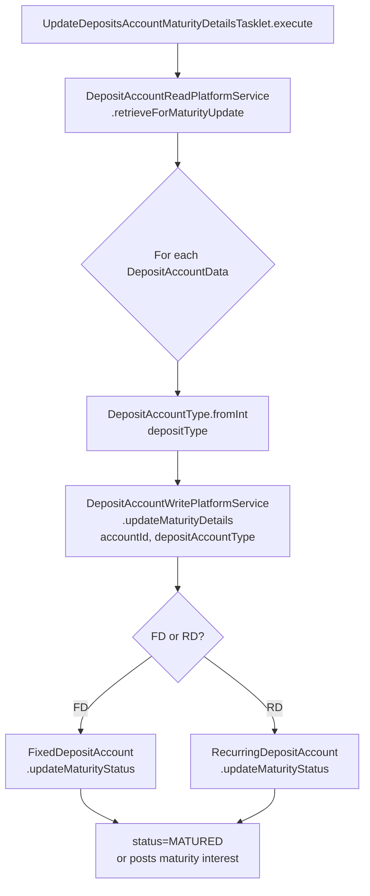
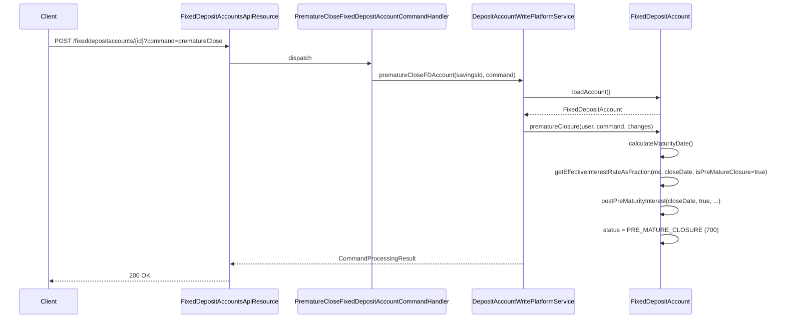
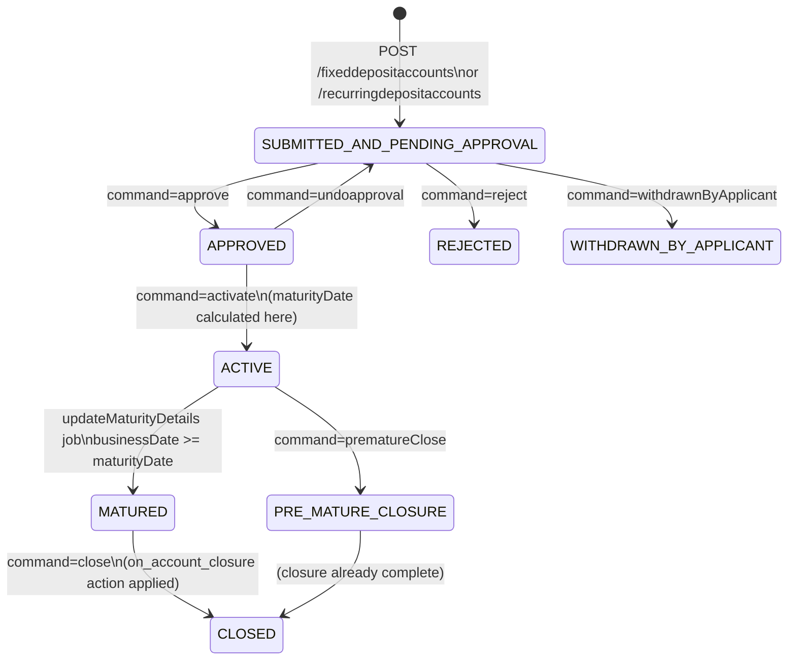

Fixed-Deposit (FD) and Recurring-Deposit (RD) products extend the core savings infrastructure with term-based constraints: a locked deposit period, a maturity date calculated at activation, and pre-closure penalties. Both domain classes inherit `SavingsAccount` via `SINGLE_TABLE` inheritance using discriminator values `200` (FD) and `300` (RD). This page covers the additional domain objects, their REST surfaces, and all automation that drives the maturity lifecycle.

## File Inventory

<CardGroup cols={2}>
  <Card title="Domain (fineract-provider)" icon="database">
    | File | Purpose |
    |------|---------|
    | `portfolio/savings/domain/FixedDepositAccount.java` | FD aggregate root |
    | `portfolio/savings/domain/RecurringDepositAccount.java` | RD aggregate root |
    | `portfolio/savings/domain/RecurringDepositScheduleInstallment.java` | RD installment schedule |
    | `portfolio/savings/domain/DepositAccountAssembler.java` | Factory for FD/RD accounts |
    | `portfolio/savings/domain/DepositAccountDomainServiceJpa.java` | Domain service impl |
    | `portfolio/savings/domain/DepositAccountDomainService.java` | Domain service interface |
  </Card>
  <Card title="Domain (fineract-savings)" icon="database">
    | File | Purpose |
    |------|---------|
    | `savings/domain/DepositAccountTermAndPreClosure.java` | Embedded term + pre-closure details |
    | `savings/domain/DepositPreClosureDetail.java` | Embedded pre-closure penalty |
    | `savings/domain/DepositTermDetail.java` | Min/max deposit term constraints |
    | `savings/domain/DepositProductTermAndPreClosure.java` | Product-level term defaults |
    | `savings/domain/DepositProductAmountDetails.java` | Min/max deposit amounts on product |
    | `savings/domain/DepositProductRecurringDetail.java` | Product-level recurring settings |
    | `savings/domain/DepositRecurringDetail.java` | Account-level recurring flags |
    | `savings/domain/DepositAccountInterestRateChart.java` | Account-linked interest rate chart |
    | `savings/domain/DepositAccountInterestRateChartSlabs.java` | Slabs on account chart |
    | `savings/domain/FixedDepositProduct.java` | FD product definition |
    | `savings/domain/RecurringDepositProduct.java` | RD product definition |
  </Card>
  <Card title="Interest Rate Chart (fineract-savings)" icon="chart-line">
    | File | Purpose |
    |------|---------|
    | `interestratechart/domain/InterestRateChart.java` | Chart root entity |
    | `interestratechart/domain/InterestRateChartFields.java` | Chart header fields |
    | `interestratechart/domain/InterestRateChartSlab.java` | Single tier slab |
    | `interestratechart/domain/InterestRateChartSlabFields.java` | Slab fields |
    | `interestratechart/domain/InterestIncentives.java` | Client-attribute incentives |
    | `interestratechart/domain/InterestIncentivesFields.java` | Incentive fields |
    | `interestratechart/data/InterestRateChartData.java` | Read DTO |
    | `interestratechart/data/InterestRateChartSlabData.java` | Slab read DTO |
  </Card>
  <Card title="API Resources & Jobs" icon="server">
    | File | Purpose |
    |------|---------|
    | `savings/api/FixedDepositProductsApiResource.java` | FD product REST |
    | `savings/api/FixedDepositAccountsApiResource.java` | FD account REST |
    | `savings/api/FixedDepositAccountTransactionsApiResource.java` | FD transaction REST |
    | `savings/api/RecurringDepositProductsApiResource.java` | RD product REST |
    | `savings/api/RecurringDepositAccountsApiResource.java` | RD account REST |
    | `savings/api/RecurringDepositAccountTransactionsApiResource.java` | RD transaction REST |
    | `interestratechart/api/InterestRateChartsApiResource.java` | Chart CRUD REST |
    | `interestratechart/api/InterestRateChartSlabsApiResource.java` | Slab CRUD REST |
    | `savings/jobs/updatedepositsaccountmaturitydetails/UpdateDepositsAccountMaturityDetailsTasklet.java` | Maturity job |
    | `savings/jobs/generaterdschedule/GenerateRdScheduleTasklet.java` | RD schedule job |
    | `savings/jobs/transferinteresttosavings/TransferInterestToSavingsTasklet.java` | Interest transfer job |
    | `savings/service/DepositAccountWritePlatformService.java` | Write service interface |
  </Card>
</CardGroup>

---

## FixedDepositAccount Domain

**Class:** `org.apache.fineract.portfolio.savings.domain.FixedDepositAccount`  
**Discriminator value:** `200`  
**Table:** `m_savings_account` (single-table with `SavingsAccount`)

`FixedDepositAccount` extends `SavingsAccount` and embeds `DepositAccountTermAndPreClosure` (via `@Embedded`). It also holds a `DepositAccountInterestRateChart` reference that links to the tiered rate chart.

### Additional Fields via DepositAccountTermAndPreClosure

`fineract-savings/…/savings/domain/DepositAccountTermAndPreClosure.java`  
Table: embedded in `m_deposit_account_term_and_preclosure`

| Column | Java Field | Type | Notes |
|--------|-----------|------|-------|
| `deposit_amount` | `depositAmount` | `BigDecimal` | Principal deposit |
| `maturity_amount` | `maturityAmount` | `BigDecimal` | Calculated maturity payout |
| `maturity_date` | `maturityDate` | `LocalDate` | Computed on activation |
| `expected_firstdepositon_date` | `expectedFirstDepositOnDate` | `LocalDate` | First deposit date (RD only) |
| `deposit_period` | `depositPeriod` | `Integer` | Number of deposit units |
| `deposit_period_frequency_enum` | `depositPeriodFrequency` | `Integer` | `SavingsPeriodFrequencyType` |
| `on_account_closure_enum` | `onAccountClosureType` | `Integer` | Action on maturity/close |
| `transfer_interest_to_linked_account` | `transferInterestToLinkedAccount` | `boolean` | Auto-transfer interest |
| `transfer_to_savings_account_id` | `transferToSavingsAccountId` | `Long` | Target savings account |

### DepositPreClosureDetail Fields

`fineract-savings/…/savings/domain/DepositPreClosureDetail.java`

| Column | Java Field | Type |
|--------|-----------|------|
| `pre_closure_penal_applicable` | `preClosurePenalApplicable` | `boolean` |
| `pre_closure_penal_interest` | `preClosurePenalInterest` | `BigDecimal` |
| `pre_closure_penal_interest_on_enum` | `preClosurePenalInterestOnType` | `Integer` |

### Key Methods on FixedDepositAccount

`fineract-provider/…/savings/domain/FixedDepositAccount.java`

| Method | Description |
|--------|-------------|
| `calculateMaturityDate()` | Computes `activationDate + depositPeriod × depositPeriodFrequency` |
| `getEffectiveInterestRateAsFraction(mc, upToDate, isPreMatureClosure)` | Returns applicable rate; applies penal deduction if `isPreMatureClosure` |
| `updateMaturityStatus(isSavingsInterestPostingAtCurrentPeriodEnd, financialYearBeginningMonth)` | Sets `status=MATURED` when `businessDate >= maturityDate` |
| `postMaturityInterest(…)` | Posts interest up to `maturityDate` |
| `postPreMaturityInterest(accountCloseDate, isPreMatureClosure, …)` | Posts interest up to close date with penal deduction |
| `prematureClosure(AppUser, JsonCommand, Map)` | Performs premature close: validates date, posts pre-maturity interest, sets `status=PRE_MATURE_CLOSURE` |
| `close(AppUser, JsonCommand, Map)` | Normal closure at/after maturity |

---

## RecurringDepositAccount Domain

**Class:** `org.apache.fineract.portfolio.savings.domain.RecurringDepositAccount`  
**Discriminator value:** `300`

`RecurringDepositAccount` adds a `DepositRecurringDetail` (recurring settings) and a `List<RecurringDepositScheduleInstallment>` (installment schedule).

### DepositRecurringDetail Fields

`fineract-savings/…/savings/domain/DepositRecurringDetail.java`  
Table columns in `m_deposit_account_recurring_detail`

| Column | Java Field | Type | Notes |
|--------|-----------|------|-------|
| `is_mandatory` | `isMandatoryDeposit` | `boolean` | Mandatory regular deposit |
| `allow_withdrawal` | `allowWithdrawal` | `boolean` | Allow intermediate withdrawals |
| `adjust_advance_towards_future_payments` | `adjustAdvanceTowardsFuturePayments` | `boolean` | Over-payment reduces future installments |

### RecurringDepositScheduleInstallment

`fineract-provider/…/savings/domain/RecurringDepositScheduleInstallment.java`  
Table: `m_mandatory_savings_schedule`  
Tracks expected installment date, expected amount, and whether paid/waived.

### Key Methods on RecurringDepositAccount

| Method | Description |
|--------|-------------|
| `calculateMaturityDate()` | Derives maturity from first deposit date + term |
| `updateDepositAmount(BigDecimal)` | Recalculates total deposit from installment count × recurring amount |
| `updateMaturityStatus(…, isPreMatureClosure)` | Similar to FD; also handles partial-term maturity |
| `prematureClosure(…)` | Premature close flow identical to FD |
| `getEffectiveInterestRateAsFraction(mc, upToDate, isPreMatureClosure)` | Uses `DepositAccountInterestRateChart.getApplicableInterestRate(depositAmount, startDate, endDate, client)` |

---

## FixedDepositAccountData Response Shape

`fineract-savings/…/savings/data/FixedDepositAccountData.java`

Key fields returned in the REST response (extends `DepositAccountData`):

| Field | Type | Description |
|-------|------|-------------|
| `preClosurePenalApplicable` | `boolean` | Penalty active |
| `preClosurePenalInterest` | `BigDecimal` | Penalty rate |
| `preClosurePenalInterestOnType` | `EnumOptionData` | Basis (whole term / remaining term) |
| `minDepositTerm` / `maxDepositTerm` | `Integer` | Term constraints |
| `inMultiplesOfDepositTerm` | `Integer` | Step size |
| `depositAmount` | `BigDecimal` | Locked-in principal |
| `maturityAmount` | `BigDecimal` | Expected payout |
| `maturityDate` | `LocalDate` | Maturity date |
| `depositPeriod` / `depositPeriodFrequency` | `Integer` / `EnumOptionData` | Term |
| `onAccountClosure` | `EnumOptionData` | Action on maturity close |
| `linkedAccount` | `PortfolioAccountData` | Linked savings account |
| `transferInterestToSavings` | `Boolean` | Auto-transfer interest |
| `transferToSavingsAccount` | `PortfolioAccountData` | Target account |
| `activationCharge` | `BigDecimal` | Activation charge amount |

---

## REST API Endpoints

### FixedDepositProductsApiResource
**Base path:** `/v1/fixeddepositproducts`  
`fineract-provider/…/savings/api/FixedDepositProductsApiResource.java`

| Method | Path | Description |
|--------|------|-------------|
| `POST` | `/v1/fixeddepositproducts` | Create FD product |
| `PUT` | `/v1/fixeddepositproducts/{productId}` | Update FD product |
| `GET` | `/v1/fixeddepositproducts` | List FD products |
| `GET` | `/v1/fixeddepositproducts/{productId}` | Retrieve FD product |
| `GET` | `/v1/fixeddepositproducts/template` | Template |
| `DELETE` | `/v1/fixeddepositproducts/{productId}` | Delete FD product |

### FixedDepositAccountsApiResource
**Base path:** `/v1/fixeddepositaccounts`  
`fineract-provider/…/savings/api/FixedDepositAccountsApiResource.java`

| Method | Path | Query param | Description |
|--------|------|-------------|-------------|
| `POST` | `/v1/fixeddepositaccounts` | — | Submit FD application |
| `GET` | `/v1/fixeddepositaccounts` | — | List FD accounts |
| `GET` | `/v1/fixeddepositaccounts/template` | `clientId`, `groupId`, `productId` | Application template |
| `GET` | `/v1/fixeddepositaccounts/{accountId}` | — | Retrieve FD account |
| `GET` | `/v1/fixeddepositaccounts/calculate-fd-interest` | rate params | Standalone interest calculator |
| `PUT` | `/v1/fixeddepositaccounts/{accountId}` | — | Modify FD application |
| `DELETE` | `/v1/fixeddepositaccounts/{accountId}` | — | Delete FD application |
| `POST` | `/v1/fixeddepositaccounts/{accountId}` | `command` | State-machine command |
| `GET` | `/v1/fixeddepositaccounts/{accountId}/template` | `command=close` | Closure template |
| `GET` | `/v1/fixeddepositaccounts/downloadtemplate` | — | Excel template |
| `POST` | `/v1/fixeddepositaccounts/uploadtemplate` | — | Bulk import |
| `GET` | `/v1/fixeddepositaccounts/transaction/downloadtemplate` | — | Transaction template |
| `POST` | `/v1/fixeddepositaccounts/transaction/uploadtemplate` | — | Bulk transactions |

**Supported `command` values for FD accounts:**

| command | Handler | Description |
|---------|---------|-------------|
| `reject` | `FixedDepositAccountApplicationRejectedCommandHandler` | Reject application |
| `withdrawnByApplicant` | `FixedDepositAccountApplicationWithdrawnByApplicantCommandHandler` | Applicant withdrawal |
| `approve` | `FixedDepositAccountApplicationApprovalCommandHandler` | Approve |
| `undoapproval` | `FixedDepositAccountApplicationApprovalUndoCommandHandler` | Undo approval |
| `activate` | `ActivateFixedDepositAccountCommandHandler` | Activate |
| `calculateInterest` | `CalculateInterestFixedDepositAccountCommandHandler` | Calculate interest |
| `postInterest` | `PostInterestFixedDepositAccountCommandHandler` | Post interest |
| `close` | `CloseFixedDepositAccountCommandHandler` | Normal close |
| `prematureClose` | `PrematureCloseFixedDepositAccountCommandHandler` | Premature close |
| `calculatePrematureAmount` | — | Preview premature closure amount |

### RecurringDepositProductsApiResource
**Base path:** `/v1/recurringdepositproducts`

| Method | Path | Description |
|--------|------|-------------|
| `POST` | `/v1/recurringdepositproducts` | Create RD product |
| `PUT` | `/v1/recurringdepositproducts/{productId}` | Update |
| `GET` | `/v1/recurringdepositproducts` | List all |
| `GET` | `/v1/recurringdepositproducts/{productId}` | Retrieve |
| `GET` | `/v1/recurringdepositproducts/template` | Template |
| `DELETE` | `/v1/recurringdepositproducts/{productId}` | Delete |

### RecurringDepositAccountsApiResource
**Base path:** `/v1/recurringdepositaccounts`  
`fineract-provider/…/savings/api/RecurringDepositAccountsApiResource.java`

| Method | Path | Query param | Description |
|--------|------|-------------|-------------|
| `POST` | `/v1/recurringdepositaccounts` | — | Submit RD application |
| `GET` | `/v1/recurringdepositaccounts` | — | List RD accounts |
| `GET` | `/v1/recurringdepositaccounts/template` | — | Template |
| `GET` | `/v1/recurringdepositaccounts/{accountId}` | — | Retrieve |
| `PUT` | `/v1/recurringdepositaccounts/{accountId}` | — | Modify application |
| `DELETE` | `/v1/recurringdepositaccounts/{accountId}` | — | Delete |
| `POST` | `/v1/recurringdepositaccounts/{accountId}` | `command` | State-machine command |
| `GET` | `/v1/recurringdepositaccounts/{accountId}/template` | `command=close` | Closure template |
| `GET` | `/v1/recurringdepositaccounts/downloadtemplate` | — | Excel template |
| `POST` | `/v1/recurringdepositaccounts/uploadtemplate` | — | Bulk import |
| `GET` | `/v1/recurringdepositaccounts/transactions/downloadtemplate` | — | Transaction template |
| `POST` | `/v1/recurringdepositaccounts/transactions/uploadtemplate` | — | Bulk transactions |

**Supported `command` values for RD accounts:**

| command | Handler | Description |
|---------|---------|-------------|
| `reject` | `RecurringDepositAccountApplicationRejectedCommandHandler` | Reject |
| `withdrawnByApplicant` | `RecurringDepositAccountApplicationWithdrawnByApplicantCommandHandler` | Applicant withdrawal |
| `approve` | `RecurringDepositAccountApplicationApprovalCommandHandler` | Approve |
| `undoapproval` | `RecurringDepositAccountApplicationApprovalUndoCommandHandler` | Undo approval |
| `activate` | `ActivateRecurringDepositAccountCommandHandler` | Activate |
| `calculateInterest` | `CalculateInterestRecurringDepositAccountCommandHandler` | Calculate interest |
| `updateDepositAmount` | `RecurringDepositAccountUpdateDepositAmountCommandHandler` | Update recurring deposit amount |
| `postInterest` | `PostInterestRecurringDepositAccountCommandHandler` | Post interest |
| `close` | `CloseRecurringDepositAccountCommandHandler` | Normal close |
| `prematureClose` | `PrematureCloseRecurringDepositAccountCommandHandler` | Premature close |
| `calculatePrematureAmount` | — | Preview premature closure amount |

### InterestRateChartsApiResource
**Base path:** `/v1/interestratecharts`  
`fineract-provider/…/interestratechart/api/InterestRateChartsApiResource.java`

| Method | Path | Description |
|--------|------|-------------|
| `GET` | `/v1/interestratecharts/template` | Chart creation template |
| `GET` | `/v1/interestratecharts` | List charts (filter by `productId`) |
| `GET` | `/v1/interestratecharts/{chartId}` | Retrieve chart |
| `POST` | `/v1/interestratecharts` | Create chart |
| `PUT` | `/v1/interestratecharts/{chartId}` | Update chart |
| `DELETE` | `/v1/interestratecharts/{chartId}` | Delete chart |

Slabs are managed via `InterestRateChartSlabsApiResource` at `/v1/interestratecharts/{chartId}/chartslabs`.

---

## Interest Rate Charts

The `InterestRateChart` (`fineract-savings/…/interestratechart/domain/InterestRateChart.java`) ties a set of tiered `InterestRateChartSlab` entries to a deposit product or account. Charts are linked to FD/RD products via `FixedDepositProduct.chart` and to individual accounts via `FixedDepositAccount.chart`.

### InterestRateChartFields

`fineract-savings/…/interestratechart/domain/InterestRateChartFields.java`

| Column | Java Field | Type | Notes |
|--------|-----------|------|-------|
| `name` | `name` | `String` | Chart label |
| `description` | `description` | `String` | Optional |
| `from_date` | `fromDate` | `LocalDate` | Chart validity start |
| `end_date` | `endDate` | `LocalDate` | Chart validity end (nullable) |
| `is_primary_grouping_by_amount` | `isPrimaryGroupingByAmount` | `boolean` | Group slabs by amount first, then period |

### InterestRateChartSlab

`fineract-savings/…/interestratechart/domain/InterestRateChartSlab.java`  
Fields via `InterestRateChartSlabFields`:

| Field | Description |
|-------|-------------|
| `fromPeriod` / `toPeriod` | Deposit period range (inclusive) |
| `periodType` | `SavingsPeriodFrequencyType` (days/weeks/months/years) |
| `amountRangeFrom` / `amountRangeTo` | Deposit amount bracket |
| `annualInterestRate` | Rate for this slab (% p.a.) |
| `description` | Slab label |

`InterestIncentives` allows additional conditional rates (e.g. for specific client gender or age), stored in `m_interest_incentives`.

### Rate Resolution

When `FixedDepositAccount.getEffectiveInterestRateAsFraction(mc, interestPostingUpToDate, isPreMatureClosure)` is called:

1. `DepositAccountInterestRateChart.getApplicableInterestRate(depositAmount, startDate, endDate, client)` traverses the sorted slab list.
2. The matching slab's `annualInterestRate` is returned.
3. If `isPreMatureClosure && preClosurePenalApplicable`, the penalty rate is deducted: `applicableInterestRate -= penalInterest`. Result floored at 0.
4. Rate is converted to fraction: `rate / 100`.

---

## Maturity Handling

### Scheduled Job: updateDepositsAccountMaturityDetails

**Tasklet:** `UpdateDepositsAccountMaturityDetailsTasklet`  
`fineract-provider/…/savings/jobs/updatedepositsaccountmaturitydetails/UpdateDepositsAccountMaturityDetailsTasklet.java`

`updateMaturityDetails(depositAccountId, depositAccountType)` is implemented in `DepositAccountDomainServiceJpa`. It:
1. Loads the account.
2. Calls `account.updateMaturityDateAndAmount(mc, isPreMatureClosure, …)` to recalculate.
3. Calls `account.updateMaturityStatus(…)` to flip `status_enum` to `800` (MATURED) if `businessDate >= maturityDate`.
4. Persists and fires business events.

### Premature Closure Flow

For `calculatePrematureAmount`, the API returns the projected maturity amount using the same penalty-adjusted rate without persisting any changes.

---

## DepositAccountWritePlatformService Interface

`fineract-savings/…/savings/service/DepositAccountWritePlatformService.java`

| Method | Description |
|--------|-------------|
| `depositToFDAccount(Long savingsId, JsonCommand)` | Post deposit to FD |
| `depositToRDAccount(Long savingsId, JsonCommand)` | Post installment to RD |
| `withdrawal(Long, JsonCommand, DepositAccountType)` | Withdraw from FD/RD |
| `calculateInterest(Long, DepositAccountType)` | Calculate but don't post |
| `postInterest(Long, DepositAccountType)` | Post calculated interest |
| `closeFDAccount(Long, JsonCommand)` | Close FD at/after maturity |
| `closeRDAccount(Long, JsonCommand)` | Close RD at/after maturity |
| `prematureCloseFDAccount(Long, JsonCommand)` | Premature FD close |
| `prematureCloseRDAccount(Long, JsonCommand)` | Premature RD close |
| `updateMaturityDetails(Long, DepositAccountType)` | Recompute maturity |
| `addSavingsAccountCharge(JsonCommand, DepositAccountType)` | Add charge |
| `waiveCharge(Long, Long, DepositAccountType)` | Waive charge |
| `applyChargeDue(Long, Long, DepositAccountType)` | Apply due charge |
| `initiateSavingsTransfer(Long, LocalDate, DepositAccountType)` | Start account transfer |
| `withdrawSavingsTransfer(Long, LocalDate, DepositAccountType)` | Withdraw transfer |
| `rejectSavingsTransfer(Long, DepositAccountType)` | Reject transfer |

---

## FD/RD Account Lifecycle

<Note>
On FD activation (`ActivateFixedDepositAccountCommandHandler`), `calculateMaturityDate()` is called immediately and the result stored in `maturity_date` on `DepositAccountTermAndPreClosure`. The maturity job only checks this pre-stored date against business date — it does not recompute the date nightly.
</Note>

---

## Scheduled Jobs for Deposits

| Tasklet | Directory | Description |
|---------|-----------|-------------|
| `UpdateDepositsAccountMaturityDetailsTasklet` | `updatedepositsaccountmaturitydetails` | Flips FD/RD to MATURED status when due |
| `GenerateRdScheduleTasklet` | `generaterdschedule` | Generates `m_mandatory_savings_schedule` rows for RD installments; uses `DepositAccountUtils` and raw JDBC |
| `TransferInterestToSavingsTasklet` | `transferinteresttosavings` | Reads pending interest transfers (`DepositAccountReadPlatformService.retrieveDataForInterestTransfer()`) and calls `AccountTransfersWritePlatformService.transferFunds(AccountTransferDTO)` |
| `PostInterestForSavingTasklet` | `postinterestforsavings` | Also posts interest for ACTIVE FD/RD accounts (all subtypes handled via discriminator) |

---

## Gotchas & Invariants

<Warning>
`FixedDepositAccount.calculateMaturityDate()` uses `accountSubmittedOrActivationDate()` as the start date. Before activation, this returns `submittedOnDate`. After activation, it returns `activatedOnDate`. Always activate before expecting a stable maturity date.
</Warning>

<Warning>
For RD accounts, `updateDepositAmount()` is called automatically when installment schedule changes. It multiplies `mandatoryRecommendedDepositAmount × numberOfInstallments`. Manually setting `depositAmount` via `updateDepositAmount(BigDecimal)` bypasses this and must be followed by maturity recalculation.
</Warning>

<Tip>
The `isPrimaryGroupingByAmount` flag on `InterestRateChart` changes slab sort order. When `true`, slabs are sorted by `amountRangeFrom` first; when `false`, by `fromPeriod`. The `InterestRateChartSlabComparator` enforces this. Incorrect flag value causes wrong rate resolution without any exception.
</Tip>

<Note>
Pre-closure penalty applies only if `preClosurePenalApplicable = true` on `DepositPreClosureDetail`. The penalty is a **rate deduction** (not a flat fee): `effectiveRate = nominalRate - preClosurePenalInterest`. If the result is negative it is clamped to 0 in `FixedDepositAccount.getEffectiveInterestRateAsFraction(…)`.
</Note>

<Info>
FD and RD transaction APIs (`FixedDepositAccountTransactionsApiResource`, `RecurringDepositAccountTransactionsApiResource`) delegate to the same `DepositAccountWritePlatformService` with a `DepositAccountType` discriminator. Commands `deposit`, `withdrawal`, `undo`, and `adjust` are all supported.
</Info>
