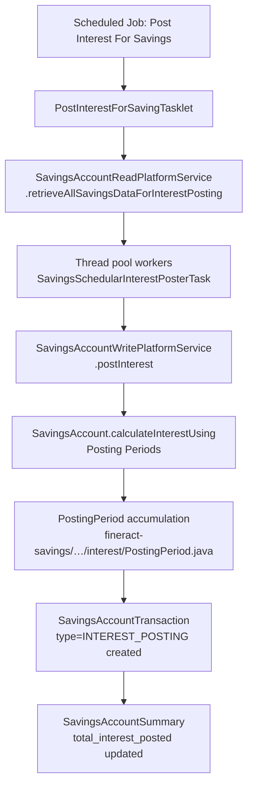
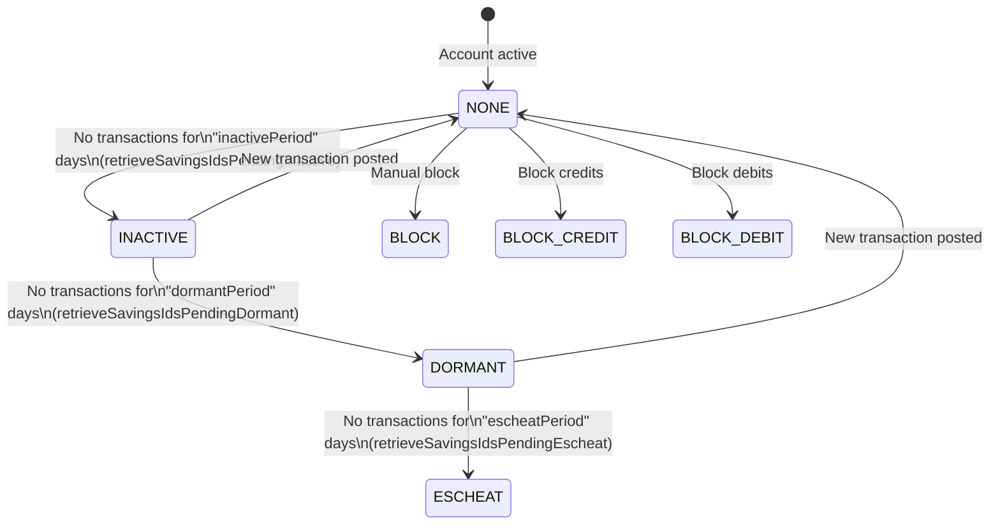
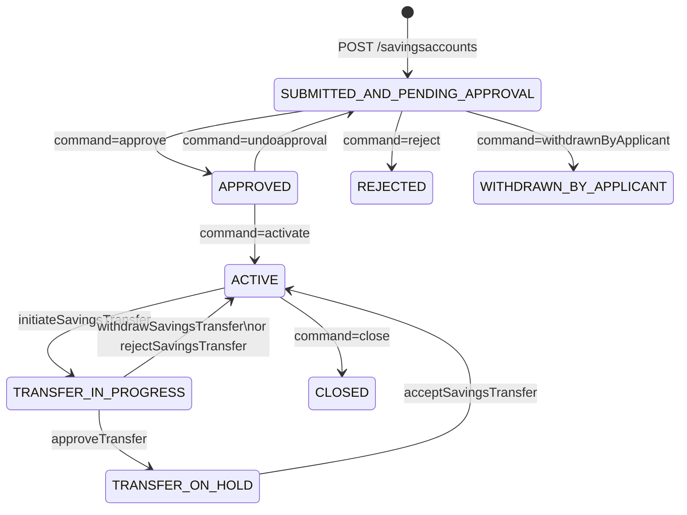

Apache Fineract's savings module is the financial backbone for retail deposit products. Every client or group savings balance, overdraft facility, and interest posting flows through the `SavingsAccount` aggregate root stored in the `m_savings_account` table. The module spans three Maven artifacts — `fineract-core`, `fineract-savings`, and `fineract-provider` — with domain classes in `fineract-savings` and REST/job wiring in `fineract-provider`.

## File Inventory

<CardGroup cols={2}>
  <Card title="Domain" icon="database">
    | File | Purpose |
    |------|---------|
    | `fineract-savings/…/savings/domain/SavingsAccount.java` | Aggregate root, all business logic |
    | `fineract-savings/…/savings/domain/SavingsAccountTransaction.java` | Immutable ledger entry |
    | `fineract-savings/…/savings/domain/SavingsAccountSummary.java` | Embedded derived-balance totals |
    | `fineract-savings/…/savings/domain/SavingsAccountCharge.java` | Charge attached to account |
    | `fineract-savings/…/savings/domain/SavingsProduct.java` | Product template |
    | `fineract-core/…/savings/domain/SavingsAccountStatusType.java` | Status enum |
    | `fineract-core/…/savings/domain/SavingsAccountSubStatusEnum.java` | Sub-status enum |
    | `fineract-core/…/savings/SavingsAccountTransactionType.java` | Transaction type enum |
    | `fineract-core/…/savings/SavingsInterestCalculationType.java` | Calculation method enum |
    | `fineract-core/…/savings/SavingsInterestCalculationDaysInYearType.java` | Day-count convention enum |
    | `fineract-core/…/savings/SavingsCompoundingInterestPeriodType.java` | Compounding period enum |
    | `fineract-core/…/savings/SavingsPostingInterestPeriodType.java` | Posting period enum |
  </Card>
  <Card title="Services & API" icon="server">
    | File | Purpose |
    |------|---------|
    | `fineract-savings/…/savings/service/SavingsAccountWritePlatformService.java` | Write operations interface |
    | `fineract-provider/…/savings/domain/SavingsAccountDomainServiceJpa.java` | Domain service impl |
    | `fineract-provider/…/savings/api/SavingsAccountsApiResource.java` | Accounts REST resource |
    | `fineract-provider/…/savings/api/SavingsProductsApiResource.java` | Products REST resource |
    | `fineract-provider/…/savings/api/SavingsAccountTransactionsApiResource.java` | Transactions REST resource |
    | `fineract-provider/…/savings/api/SavingsAccountChargesApiResource.java` | Charges REST resource |
    | `fineract-savings/…/cob/savings/SavingsCOBBusinessStep.java` | COB step marker interface |
    | `fineract-savings/…/cob/savings/SavingsCOBConstant.java` | COB job name constants |
    | `fineract-savings/…/cob/savings/SavingsLockingService.java` | Account-level COB locking |
  </Card>
</CardGroup>

---

## SavingsAccount Domain Entity

**Class:** `org.apache.fineract.portfolio.savings.domain.SavingsAccount`  
**Table:** `m_savings_account`  
**Inheritance:** `SINGLE_TABLE`, discriminator column `deposit_type_enum` (value `100` for base savings; `200` for fixed deposit; `300` for recurring deposit).

### Key Mapped Fields

| Column | Java Field | Type | Notes |
|--------|-----------|------|-------|
| `account_no` | `accountNumber` | `String` | Unique 20-char identifier |
| `external_id` | `externalId` | `ExternalId` | Optional external reference |
| `client_id` | `client` | `Client` | FK → `m_client` |
| `group_id` | `group` | `Group` | FK → `m_group` (group savings) |
| `product_id` | `product` | `SavingsProduct` | FK → `m_savings_product` |
| `status_enum` | `status` | `Integer` | Maps to `SavingsAccountStatusType` |
| `sub_status_enum` | `sub_status` | `Integer` | Maps to `SavingsAccountSubStatusEnum` |
| `deposit_type_enum` | (discriminator) | `Integer` | 100=savings, 200=FD, 300=RD |
| `nominal_annual_interest_rate` | `nominalAnnualInterestRate` | `BigDecimal` | Annual rate in % |
| `interest_compounding_period_enum` | `interestCompoundingPeriodType` | `Integer` | `SavingsCompoundingInterestPeriodType` |
| `interest_posting_period_enum` | `interestPostingPeriodType` | `Integer` | `SavingsPostingInterestPeriodType` |
| `interest_calculation_type_enum` | `interestCalculationType` | `Integer` | `SavingsInterestCalculationType` |
| `interest_calculation_days_in_year_type_enum` | `interestCalculationDaysInYearType` | `Integer` | `SavingsInterestCalculationDaysInYearType` |
| `min_required_opening_balance` | `minRequiredOpeningBalance` | `BigDecimal` | Minimum to open account |
| `lockin_period_frequency` | `lockinPeriodFrequency` | `Integer` | Lock-in units |
| `lockin_period_frequency_enum` | `lockinPeriodFrequencyType` | `Integer` | `SavingsPeriodFrequencyType` |
| `lockedin_until_date_derived` | `lockedInUntilDate` | `LocalDate` | Derived on activation |
| `allow_overdraft` | `allowOverdraft` | `boolean` | Permit negative balance |
| `overdraft_limit` | `overdraftLimit` | `BigDecimal` | Max overdraft amount |
| `nominal_annual_interest_rate_overdraft` | `nominalAnnualInterestRateOverdraft` | `BigDecimal` | Interest on overdraft balance |
| `min_overdraft_for_interest_calculation` | `minOverdraftForInterestCalculation` | `BigDecimal` | Threshold below which OD interest applies |
| `enforce_min_required_balance` | `enforceMinRequiredBalance` | `boolean` | Block withdrawals below minimum |
| `min_required_balance` | `minRequiredBalance` | `BigDecimal` | Minimum balance to maintain |
| `is_lien_allowed` | `lienAllowed` | `boolean` | Allow lien against balance |
| `max_allowed_lien_limit` | `maxAllowedLienLimit` | `BigDecimal` | Max lien value |
| `on_hold_funds` | `onHoldFunds` | `BigDecimal` | Frozen funds (held for guarantees) |
| `withhold_tax` | `withHoldTax` | `boolean` | Apply withholding tax on interest |
| `accrued_till_date` | `accruedTillDate` | `LocalDate` | Last accrual date |
| `last_closed_business_date` | `lastClosedBusinessDate` | `LocalDate` | Last COB date |
| `savings_on_hold_amount` | `savingsOnHoldAmount` | `BigDecimal` | Amount placed on manual hold |
| `reason_for_block` | `reasonForBlock` | `String` | Block reason text |

The embedded `SavingsAccountSummary` object (table columns `total_deposits_derived`, `total_withdrawals_derived`, `account_balance_derived`, etc.) stores aggregated running totals recalculated on every transaction.

---

## Status & Sub-Status Enums

### SavingsAccountStatusType
`fineract-core/…/savings/domain/SavingsAccountStatusType.java`

| Value | Enum Constant | Description |
|-------|--------------|-------------|
| `0` | `INVALID` | Sentinel |
| `100` | `SUBMITTED_AND_PENDING_APPROVAL` | Application submitted |
| `200` | `APPROVED` | Approved, awaiting activation |
| `300` | `ACTIVE` | Fully operational |
| `303` | `TRANSFER_IN_PROGRESS` | Account transfer underway |
| `304` | `TRANSFER_ON_HOLD` | Transfer placed on hold |
| `400` | `WITHDRAWN_BY_APPLICANT` | Applicant withdrew |
| `500` | `REJECTED` | Rejected by institution |
| `600` | `CLOSED` | Closed normally |
| `700` | `PRE_MATURE_CLOSURE` | Deposit closed before maturity |
| `800` | `MATURED` | Deposit reached maturity |

### SavingsAccountSubStatusEnum
`fineract-core/…/savings/domain/SavingsAccountSubStatusEnum.java`

| Value | Constant | Description |
|-------|---------|-------------|
| `0` | `NONE` | Normal active state |
| `100` | `INACTIVE` | No transactions for configured period |
| `200` | `DORMANT` | Deeper inactivity threshold |
| `300` | `ESCHEAT` | Funds transferred to regulatory body |
| `400` | `BLOCK` | Full block (no credits or debits) |
| `500` | `BLOCK_CREDIT` | Credits disabled |
| `600` | `BLOCK_DEBIT` | Debits disabled |

---

## SavingsAccountTransactionType Enum
`fineract-core/…/savings/SavingsAccountTransactionType.java`

| ID | Constant | Entry Type | Notes |
|----|---------|-----------|-------|
| 0 | `INVALID` | — | Sentinel |
| 1 | `DEPOSIT` | CREDIT | Customer cash-in |
| 2 | `WITHDRAWAL` | DEBIT | Customer cash-out |
| 3 | `INTEREST_POSTING` | CREDIT | Periodic interest credit |
| 4 | `WITHDRAWAL_FEE` | DEBIT | Fee on withdrawal |
| 5 | `ANNUAL_FEE` | DEBIT | Annual account fee |
| 6 | `WAIVE_CHARGES` | — | Charge waiver (no balance impact) |
| 7 | `PAY_CHARGE` | DEBIT | Charge payment |
| 8 | `DIVIDEND_PAYOUT` | CREDIT | Share dividend deposited here |
| 10 | `ACCRUAL` | — | Accrual entry |
| 12 | `INITIATE_TRANSFER` | — | Start account transfer |
| 13 | `APPROVE_TRANSFER` | — | Approve account transfer |
| 14 | `WITHDRAW_TRANSFER` | — | Withdraw account transfer |
| 15 | `REJECT_TRANSFER` | — | Reject account transfer |
| 16 | `WRITTEN_OFF` | — | Balance written off |
| 17 | `OVERDRAFT_INTEREST` | DEBIT | Interest charged on overdraft |
| 18 | `WITHHOLD_TAX` | DEBIT | Tax withheld on interest |
| 19 | `ESCHEAT` | DEBIT | Funds escheated (no balance change) |
| 20 | `AMOUNT_HOLD` | DEBIT | Hold placed (no balance change) |
| 21 | `AMOUNT_RELEASE` | CREDIT | Hold released (no balance change) |

<Note>
`AMOUNT_HOLD` (20) and `ESCHEAT` (19) carry `DEBIT` entry type but do **not** change the running account balance — `isDebit()` returns `false` for them. Similarly `AMOUNT_RELEASE` (21) carries `CREDIT` type but `isCredit()` returns `false`.
</Note>

---

## Interest Calculation

### Calculation Method Enums

**`SavingsInterestCalculationType`** (`fineract-core/…/savings/SavingsInterestCalculationType.java`):

| Value | Constant |
|-------|---------|
| `1` | `DAILY_BALANCE` |
| `2` | `AVERAGE_DAILY_BALANCE` |

**`SavingsInterestCalculationDaysInYearType`** (`fineract-core/…/savings/SavingsInterestCalculationDaysInYearType.java`):

| Value | Constant |
|-------|---------|
| `360` | `DAYS_360` |
| `365` | `DAYS_365` |

**`SavingsCompoundingInterestPeriodType`** (`fineract-core/…/savings/SavingsCompoundingInterestPeriodType.java`):

| Value | Constant |
|-------|---------|
| `1` | `DAILY` |
| `4` | `MONTHLY` |
| `5` | `QUATERLY` |
| `6` | `BI_ANNUAL` |
| `7` | `ANNUAL` |

**`SavingsPostingInterestPeriodType`** (`fineract-core/…/savings/SavingsPostingInterestPeriodType.java`):

| Value | Constant |
|-------|---------|
| `1` | `DAILY` |
| `4` | `MONTHLY` |
| `5` | `QUATERLY` |
| `6` | `BIANNUAL` |
| `7` | `ANNUAL` |
| `8` | `ANNIVERSARY_MONTHLY` |
| `9` | `ANNIVERSARY_QUARTERLY` |
| `10` | `ANNIVERSARY_BIANNUAL` |
| `11` | `ANNIVERSARY_ANNUAL` |

### Interest Posting Flow

The tasklet in `PostInterestForSavingTasklet` (`fineract-provider/…/savings/jobs/postinterestforsavings/`) pages through all `ACTIVE` accounts. Each `SavingsSchedularInterestPosterTask` calls `SavingsAccountWritePlatformService.postInterest(account, isPostInterestAsOnDate, transactionDate, backdatedTxnsAllowedTill)`. Interest is computed in `SavingsAccount.calculateInterestUsing(…)` by iterating `PostingPeriod` objects in `fineract-savings/…/savings/domain/interest/PostingPeriod.java`.

If withholding tax is configured (`withHoldTax = true`), `applyWithholdTaxForDepositAccounts(…)` generates a `WITHHOLD_TAX` transaction immediately after posting.

---

## SavingsAccountTransaction Entity

**Class:** `org.apache.fineract.portfolio.savings.domain.SavingsAccountTransaction`  
**Table:** `m_savings_transaction`

| Column | Field | Type | Notes |
|--------|-------|------|-------|
| `transaction_type_enum` | `typeOf` | `Integer` | See `SavingsAccountTransactionType` |
| `transaction_date` | `dateOf` | `LocalDate` | Value date |
| `submitted_on_date` | `submittedOnDate` | `LocalDate` | System date when created |
| `amount` | `amount` | `BigDecimal` | Gross amount |
| `running_balance_derived` | `runningBalance` | `BigDecimal` | Balance after this transaction |
| `cumulative_balance_derived` | `cumulativeBalance` | `BigDecimal` | Used in average daily balance calc |
| `balance_end_date_derived` | `balanceEndDate` | `LocalDate` | When this balance ended |
| `balance_number_of_days_derived` | `balanceNumberOfDays` | `Integer` | Days at this balance |
| `is_reversed` | `reversed` | `boolean` | Logical delete flag |
| `is_reversal` | `reversalTransaction` | `boolean` | True if this is the reversal entry |
| `original_transaction_id` | `originalTxnId` | `Long` | FK to reversed transaction |
| `overdraft_amount_derived` | `overdraftAmount` | `BigDecimal` | Overdraft portion |
| `is_manual` | `isManualTransaction` | `boolean` | True if user-initiated |
| `is_loan_disbursement` | `isLoanDisbursement` | `boolean` | Loan disbursement into savings |
| `is_lien_transaction` | `lienTransaction` | `Boolean` | Part of lien hold/release |
| `release_id_of_hold_amount` | `releaseIdOfHoldAmountTransaction` | `Long` | Links release → hold transaction |
| `external_id` | `externalId` | `ExternalId` | External reference |
| `ref_no` | `refNo` | `String` | Payment reference |

`SavingsAccountTransactionTaxDetails` (collection `taxDetails`) stores per-transaction tax breakdown when withholding tax is applied.

---

## REST API Endpoints

### SavingsProductsApiResource
**Base path:** `/v1/savingsproducts`  
`fineract-provider/…/savings/api/SavingsProductsApiResource.java`

| Method | Path | Description |
|--------|------|-------------|
| `POST` | `/v1/savingsproducts` | Create savings product |
| `PUT` | `/v1/savingsproducts/{productId}` | Update savings product |
| `GET` | `/v1/savingsproducts` | List all savings products |
| `GET` | `/v1/savingsproducts/{productId}` | Retrieve single product |
| `GET` | `/v1/savingsproducts/template` | Retrieve product template |
| `DELETE` | `/v1/savingsproducts/{productId}` | Delete savings product |

### SavingsAccountsApiResource
**Base path:** `/v1/savingsaccounts`  
`fineract-provider/…/savings/api/SavingsAccountsApiResource.java`

| Method | Path | Query param | Description |
|--------|------|-------------|-------------|
| `POST` | `/v1/savingsaccounts` | — | Submit application |
| `POST` | `/v1/savingsaccounts/gsim` | — | Submit GSIM group application |
| `GET` | `/v1/savingsaccounts` | — | List accounts (paginated) |
| `GET` | `/v1/savingsaccounts/template` | `clientId`, `groupId`, `productId` | Application template |
| `GET` | `/v1/savingsaccounts/{accountId}` | — | Retrieve single account |
| `GET` | `/v1/savingsaccounts/external-id/{externalId}` | — | Retrieve by external ID |
| `PUT` | `/v1/savingsaccounts/{accountId}` | — | Modify application |
| `PUT` | `/v1/savingsaccounts/external-id/{externalId}` | — | Modify by external ID |
| `DELETE` | `/v1/savingsaccounts/{accountId}` | — | Delete application |
| `DELETE` | `/v1/savingsaccounts/external-id/{externalId}` | — | Delete by external ID |
| `POST` | `/v1/savingsaccounts/{accountId}` | `command` | State-machine command |
| `POST` | `/v1/savingsaccounts/external-id/{externalId}` | `command` | State-machine command |
| `POST` | `/v1/savingsaccounts/gsimcommands/{parentAccountId}` | `command` | GSIM group command |
| `GET` | `/v1/savingsaccounts/downloadtemplate` | — | Excel import template |
| `POST` | `/v1/savingsaccounts/uploadtemplate` | — | Bulk import |
| `GET` | `/v1/savingsaccounts/transactions/downloadtemplate` | — | Transactions import template |
| `POST` | `/v1/savingsaccounts/transactions/uploadtemplate` | — | Bulk transaction import |

**Supported `command` values on `POST /{accountId}`:**

| command | Handler | Description |
|---------|---------|-------------|
| `reject` | `SavingsAccountApplicationRejectedCommandHandler` | Reject application |
| `withdrawnByApplicant` | `WithdrawSavingsAccountApplicationCommandHandler` | Applicant withdrawal |
| `approve` | `ApproveSavingsAccountApplicationCommandHandler` | Approve application |
| `undoapproval` | `UndoApprovalSavingsAccountApplicationCommandHandler` | Undo approval |
| `activate` | `ActivateSavingsAccountCommandHandler` | Activate approved account |
| `calculateInterest` | `CalculateInterestSavingsAccountCommandHandler` | Trigger interest calc |
| `postInterest` | `PostInterestSavingsAccountCommandHandler` | Post calculated interest |
| `applyAnnualFees` | `ApplyAnnualFeeSavingsAccountCommandHandler` | Apply annual fee charge |
| `close` | `CloseSavingsAccountCommandHandler` | Close account |
| `assignSavingsOfficer` | — | Assign field officer |
| `unassignSavingsOfficer` | — | Remove field officer |
| `blockDebit` / `unblockDebit` | — | Block/unblock debits |
| `blockCredit` / `unblockCredit` | — | Block/unblock credits |
| `blockAccount` / `unblockAccount` | — | Full block/unblock |
| `updateWithHoldTax` | — | Update withholding tax flag |

### SavingsAccountTransactionsApiResource
**Base path:** `/v1/savingsaccounts`  
`fineract-provider/…/savings/api/SavingsAccountTransactionsApiResource.java`

| Method | Path | Query param | Description |
|--------|------|-------------|-------------|
| `GET` | `/v1/savingsaccounts/{savingsId}/transactions/template` | — | Transaction template |
| `GET` | `/v1/savingsaccounts/{savingsId}/transactions/{transactionId}` | — | Retrieve transaction |
| `GET` | `/v1/savingsaccounts/{savingsId}/transactions/search` | `fromDate`, `toDate`, `type` | Search transactions |
| `POST` | `/v1/savingsaccounts/{savingsId}/transactions` | `command` | Post deposit/withdrawal |
| `POST` | `/v1/savingsaccounts/{savingsId}/transactions/{transactionId}` | `command=undo\|adjust` | Undo or adjust transaction |

**Supported `command` for transactions:** `deposit`, `withdrawal`, `force-withdrawal`, `undo`, `adjust`.

---

## SavingsAccountWritePlatformService Interface

`fineract-savings/…/savings/service/SavingsAccountWritePlatformService.java`

| Method | Description |
|--------|-------------|
| `activate(Long savingsId, JsonCommand)` | Activates an approved account |
| `deposit(Long savingsId, JsonCommand)` | Posts a `DEPOSIT` transaction |
| `withdrawal(Long savingsId, JsonCommand)` | Posts a `WITHDRAWAL` transaction |
| `forceWithdrawal(Long savingsId, JsonCommand)` | Force-withdrawal (bypasses some guards) |
| `calculateInterest(Long savingsId)` | Calculates accrued interest without posting |
| `postInterest(JsonCommand)` | Posts interest via command pattern |
| `postInterest(SavingsAccount, boolean, LocalDate, boolean)` | Direct posting (used by scheduler) |
| `applyAnnualFee(Long chargeId, Long accountId)` | Apply annual fee charge |
| `close(Long savingsId, JsonCommand)` | Close account |
| `reverseTransaction(…)` / `undoTransaction(…)` | Reverse or undo a transaction |
| `adjustSavingsTransaction(…)` | Modify a previously posted transaction |
| `holdAmount(…)` / `releaseAmount(…)` | Place/release manual hold |
| `blockAccount(…)` / `unblockAccount(…)` | Full block management |
| `blockCredits(…)` / `unblockCredits(…)` | Credit block management |
| `blockDebits(…)` / `unblockDebits(…)` | Debit block management |
| `setSubStatusInactive(Long)` | Mark inactive (dormancy step 1) |
| `setSubStatusDormant(Long)` | Mark dormant (dormancy step 2) |
| `escheat(Long)` | Escheat dormant account |
| `modifyWithHoldTax(…)` | Toggle withholding tax |
| `gsimActivate(…)` / `gsimDeposit(…)` / `bulkGSIMClose(…)` | GSIM group operations |

---

## Dormancy Lifecycle

Dormancy is controlled via `sub_status_enum` and driven nightly by `UpdateSavingsDormantAccountsTasklet`.

**Tasklet:** `UpdateSavingsDormantAccountsTasklet`  
`fineract-provider/…/savings/jobs/updatesavingsdormantaccounts/UpdateSavingsDormantAccountsTasklet.java`

The tasklet calls three queries on `SavingsAccountReadPlatformService`:
- `retrieveSavingsIdsPendingInactive(tenantLocalDate)` → calls `setSubStatusInactive(savingsId)`
- `retrieveSavingsIdsPendingDormant(tenantLocalDate)` → calls `setSubStatusDormant(savingsId)`
- `retrieveSavingsIdsPendingEscheat(tenantLocalDate)` → calls `escheat(savingsId)`

When a deposit or withdrawal arrives on an `INACTIVE` or `DORMANT` account (`SavingsAccount.deposit(…)` / `SavingsAccount.withdraw(…)`), `sub_status` is reset to `NONE` automatically.

---

## Savings COB (Close of Business)

**Job name:** `SAVINGS_COB` (constant `SavingsCOBConstant.JOB_NAME`)  
**Spring Batch job:** `SAVINGS_CLOSE_OF_BUSINESS` (`SavingsCOBConstant.SAVINGS_COB_JOB_NAME`)  
**Inline COB job:** `INLINE_SAVINGS_COB` (`SavingsCOBConstant.INLINE_SAVINGS_COB_JOB_NAME`)

Sources:
- `fineract-savings/…/cob/savings/SavingsCOBConstant.java`
- `fineract-savings/…/cob/savings/SavingsCOBBusinessStep.java` — marker interface extending `COBBusinessStep<SavingsAccount>`
- `fineract-savings/…/cob/savings/SavingsLockingService.java` — lock management
- `fineract-savings/…/cob/savings/SavingsLockOwner.java` — `SAVINGS_COB_CHUNK_PROCESSING`, `SAVINGS_INLINE_COB_PROCESSING`
- `fineract-savings/…/cob/savings/SavingsAccountLock.java` — lock entity (table: `m_savings_account_locks`)
- `fineract-savings/…/cob/savings/domain/SavingsAccountLockRepository.java` — JPA repository

Locking prevents concurrent modification during COB. `SavingsLockingService.applyLock(List<Long> savingsIds, SavingsLockOwner)` acquires exclusive locks; `deleteBySavingsIdInAndLockOwner(…)` releases them. If an account remains locked after COB completes, `SavingsAccountsStayedLockedBusinessEvent` is fired.

---

## Scheduled Jobs in fineract-provider Savings

| Tasklet Class | Package Dir | What It Does |
|--------------|-------------|--------------|
| `PostInterestForSavingTasklet` | `postinterestforsavings` | Pages all active accounts, posts accrued interest using thread pool |
| `ApplyAnnualFeeForSavingsTasklet` | `applyannualfeeforsavings` | Finds accounts with annual fee due, calls `applyAnnualFee` |
| `UpdateSavingsDormantAccountsTasklet` | `updatesavingsdormantaccounts` | Transitions accounts through inactive → dormant → escheat |
| `AddAccrualTransactionForSavingsTasklet` | `addaccrualtransactionforsavings` | Calls `SavingsAccrualWritePlatformService.addAccrualEntries(tillDate)` |
| `TransferInterestToSavingsTasklet` | `transferinteresttosavings` | Transfers deposit account interest to linked savings accounts |
| `UpdateDepositsAccountMaturityDetailsTasklet` | `updatedepositsaccountmaturitydetails` | Updates maturity status for FD/RD accounts |
| `GenerateRdScheduleTasklet` | `generaterdschedule` | Generates installment schedules for recurring deposits |
| `GenerateAdhocClientScheduleTasklet` | `generateadhocclientschhedule` | Ad hoc client schedule generation |
| `PayDueSavingsChargesTasklet` | `payduesavingscharges` | Pays charges where due date ≤ today |

---

## Account Lifecycle State Machine

Key domain methods on `SavingsAccount`:
- `approveApplication(AppUser, JsonCommand)` → sets `status=200`, records `approvedOnDate`
- `approveAndActivateApplication(LocalDate, AppUser)` → shortcut for immediate activation
- `rejectApplication(AppUser, JsonCommand)` → sets `status=500`
- `activateAccountBasedOnBalance()` → activates when opening balance meets minimum
- `close(AppUser, JsonCommand, Map)` → sets `status=600`, posts final interest

---

## Gotchas & Invariants

<Warning>
`SavingsAccount.deposit(…)` resets `sub_status` from `INACTIVE`/`DORMANT` back to `NONE` on every successful credit. There is **no explicit call** in the service layer — it happens inside the aggregate itself in `SavingsAccount.java` at lines ~1185 and ~1321.
</Warning>

<Warning>
The `version` field (optimistic locking `@Version int version`) means concurrent COB processing and inline user transactions will collide with `ObjectOptimisticLockingFailureException`. The Inline COB mechanism (`INLINE_SAVINGS_COB_PROCESSING` lock owner) exists precisely to serialize these paths.
</Warning>

<Tip>
The `backdatedTxnsAllowedTill` boolean (sourced from `ConfigurationDomainService.retrievePivotDateConfig()`) controls whether transactions before the pivot date are accepted. It is threaded through every `deposit`, `withdrawal`, and `postInterest` call.
</Tip>

<Note>
`AMOUNT_HOLD` and `AMOUNT_RELEASE` transactions are stored in `m_savings_transaction` but **do not change `account_balance_derived`**. The withdrawable balance is computed as `getWithdrawableBalance()` = `accountBalance - onHoldFunds - savingsOnHoldAmount`. Always use this method, never read `account_balance_derived` raw.
</Note>
