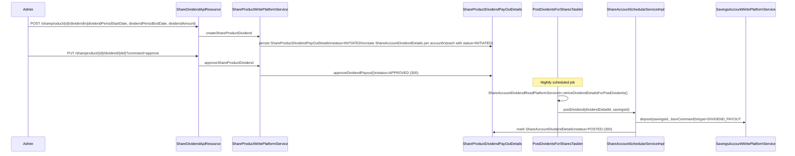
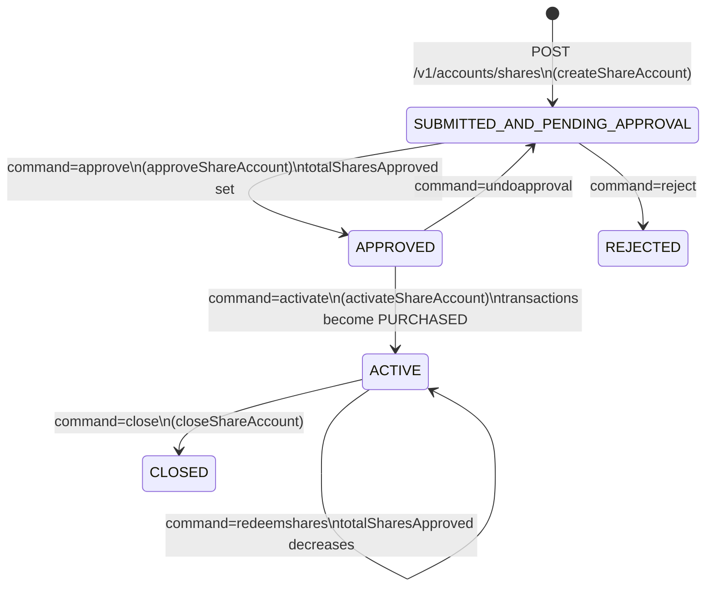

Apache Fineract's share accounts module provides equity participation facilities for MFI members: clients can purchase shares in an institution's share product, hold them over time, earn dividends (posted directly to a linked savings account), and redeem them. The module is self-contained within `fineract-provider` under `portfolio/shareaccounts` and `portfolio/shareproducts`. REST access uses the generic type-dispatched paths `/v1/accounts/shares` and `/v1/products/shares`.

## File Inventory

<CardGroup cols={2}>
  <Card title="Share Account Domain" icon="database">
    | File | Purpose |
    |------|---------|
    | `shareaccounts/domain/ShareAccount.java` | Account aggregate root |
    | `shareaccounts/domain/ShareAccountTransaction.java` | Purchase / redemption entry |
    | `shareaccounts/domain/ShareAccountCharge.java` | Charge attached to account |
    | `shareaccounts/domain/ShareAccountChargePaidBy.java` | Charge-to-transaction link |
    | `shareaccounts/domain/ShareAccountDividendDetails.java` | Per-account dividend record |
    | `shareaccounts/domain/ShareAccountStatusType.java` | Account status enum |
    | `shareaccounts/domain/PurchasedSharesStatusType.java` | Transaction status/type enum |
    | `shareaccounts/domain/ShareAccountDividendStatusType.java` | Dividend posting status |
    | `shareaccounts/domain/ShareAccountRepository.java` | JPA repository |
  </Card>
  <Card title="Share Product Domain" icon="box">
    | File | Purpose |
    |------|---------|
    | `shareproducts/domain/ShareProduct.java` | Product entity |
    | `shareproducts/domain/ShareProductMarketPrice.java` | Market price schedule entry |
    | `shareproducts/domain/ShareProductDividendPayOutDetails.java` | Dividend payout record |
    | `shareproducts/domain/ShareProductDividendStatusType.java` | Dividend status enum |
    | `shareproducts/domain/ShareProductRepository.java` | JPA repository |
    | `fineract-core/…/shareproducts/constants/ShareProductApiConstants.java` | API field name constants |
  </Card>
  <Card title="Services" icon="server">
    | File | Purpose |
    |------|---------|
    | `shareaccounts/service/ShareAccountWritePlatformService.java` | Write interface |
    | `shareaccounts/service/ShareAccountWritePlatformServiceJpaRepositoryImpl.java` | JPA implementation |
    | `shareaccounts/service/ShareAccountCommandsServiceImpl.java` | Command dispatch impl |
    | `shareaccounts/service/ShareAccountReadPlatformService.java` | Read interface |
    | `shareaccounts/service/ShareAccountReadPlatformServiceImpl.java` | JDBC read impl |
    | `shareaccounts/service/ShareAccountDividendReadPlatformService.java` | Dividend read interface |
    | `shareaccounts/service/ShareAccountSchedularService.java` | Scheduler callbacks |
    | `shareaccounts/service/ShareAccountSchedularServiceImpl.java` | Scheduler implementation |
    | `shareaccounts/serialization/ShareAccountDataSerializer.java` | JSON validation |
    | `shareproducts/service/ShareProductWritePlatformService.java` | Product write interface |
    | `shareproducts/service/ShareProductCommandsServiceImpl.java` | Product command dispatch |
    | `shareproducts/service/ShareProductDividendAssembler.java` | Dividend assembly helper |
  </Card>
  <Card title="API Resources & Jobs" icon="globe">
    | File | Purpose |
    |------|---------|
    | `portfolio/accounts/api/AccountsApiResource.java` | Generic share account REST (`/v1/accounts/{type}`) |
    | `portfolio/products/api/ProductsApiResource.java` | Generic share product REST (`/v1/products/{type}`) |
    | `shareproducts/api/ShareDividendApiResource.java` | Dividend CRUD REST |
    | `shareaccounts/jobs/postdividentsforshares/PostDividentsForSharesTasklet.java` | Dividend posting job |
    | `shareaccounts/jobs/postdividentsforshares/PostDividentsForSharesConfig.java` | Job configuration |
    | `shareaccounts/start/ShareAccountsConfiguration.java` | Module Spring config |
    | `shareproducts/starter/ShareProductsConfiguration.java` | Product Spring config |
  </Card>
</CardGroup>

---

## ShareAccount Domain Entity

**Class:** `org.apache.fineract.portfolio.shareaccounts.domain.ShareAccount`  
**Table:** `m_share_account`

### Key Fields

| Column | Java Field | Type | Notes |
|--------|-----------|------|-------|
| `account_no` | `accountNumber` | `String` | 20-char unique identifier |
| `external_id` | `externalId` | `String` | Optional external reference |
| `client_id` | `client` | `Client` | FK → `m_client` |
| `product_id` (FK) | `shareProduct` | `ShareProduct` | Product definition |
| `savings_account_id` | `savingsAccount` | `SavingsAccount` | Linked savings account for dividends |
| `status_enum` | `status` | `Integer` | Maps to `ShareAccountStatusType` |
| `submitted_date` | `submittedDate` | `LocalDate` | Application date |
| `approved_date` | `approvedDate` | `LocalDate` | Approval date |
| `rejected_date` | `rejectedDate` | `LocalDate` | Rejection date |
| `activated_date` | `activatedDate` | `LocalDate` | Activation date |
| `closed_date` | `closedDate` | `LocalDate` | Closure date |
| `total_approved_shares` | `totalSharesApproved` | `Long` | Approved and held shares |
| `total_pending_shares` | `totalSharesPending` | `Long` | Shares pending approval |
| `allow_dividends_inactive_clients` | `allowDividendCalculationForInactiveClients` | `Boolean` | Include inactive clients in dividend run |
| `lockin_period_frequency` | `lockinPeriodFrequency` | `Integer` | Lock-in duration |
| `lockin_period_frequency_enum` | `lockinPeriodFrequencyType` | `PeriodFrequencyType` | Lock-in unit |
| `minimum_active_period_frequency` | `minimumActivePeriodFrequency` | `Integer` | Min period before redeem |
| `minimum_active_period_frequency_enum` | `minimumActivePeriodFrequencyType` | `PeriodFrequencyType` | Min active period unit |

`ShareAccount` has a `Set<ShareAccountTransaction>` for all purchase/redemption entries and a `Set<ShareAccountCharge>` for account-level charges.

---

## ShareProduct Domain Entity

**Class:** `org.apache.fineract.portfolio.shareproducts.domain.ShareProduct`  
**Table:** `m_share_product`

| Column | Java Field | Type | Notes |
|--------|-----------|------|-------|
| `name` | `name` | `String` | Unique product name |
| `short_name` | `shortName` | `String` | Unique short code |
| `description` | `description` | `String` | Product description |
| `start_date` / `end_date` | `startDate` / `endDate` | `LocalDate` | Offering period |
| `external_id` | `externalId` | `String` | External reference |
| `total_shares` | `totalShares` | `Long` | Total shares defined in product |
| `issued_shares` | `totalSharesIssued` | `Long` | Shares currently issued |
| `totalsubscribed_shares` | `totalSubscribedShares` | `Long` | Subscribed (pending + approved) |
| `unit_price` | `unitPrice` | `BigDecimal` | Nominal price per share |
| `capital_amount` | `shareCapital` | `BigDecimal` | Total capital value |
| `minimum_client_shares` | `minimumShares` | `Long` | Minimum per client |
| `nominal_client_shares` | `nominalShares` | `Long` | Default/nominal per client |
| `maximum_client_shares` | `maximumShares` | `Long` | Maximum per client |
| `allow_dividends_inactive_clients` | `allowDividendCalculationForInactiveClients` | `Boolean` | Global override |
| `lockin_period_frequency` | `lockinPeriod` | `Integer` | Default lock-in |
| `lockin_period_frequency_enum` | `lockPeriodType` | `PeriodFrequencyType` | Default lock-in unit |
| `minimum_active_period_frequency` | `minimumActivePeriod` | `Integer` | Min holding period |
| `minimum_active_period_frequency_enum` | `minimumActivePeriodType` | `PeriodFrequencyType` | Min holding unit |
| `accounting_type` | `accountingRule` | `Integer` | `AccountingRuleType` enum value |

`ShareProduct` also carries a `Set<ShareProductMarketPrice>` for time-series market prices and a `Set<Charge>` for default charges. `ShareProductMarketPrice` stores `(fromDate, shareValue)` pairs in `m_share_product_market_price`.

---

## Share Account Status & Transaction Enums

### ShareAccountStatusType
`fineract-provider/…/shareaccounts/domain/ShareAccountStatusType.java`

| Value | Constant | Description |
|-------|---------|-------------|
| `0` | `INVALID` | Sentinel |
| `100` | `SUBMITTED_AND_PENDING_APPROVAL` | Application submitted |
| `200` | `APPROVED` | Approved, not yet activated |
| `300` | `ACTIVE` | Fully operational |
| `500` | `REJECTED` | Rejected |
| `600` | `CLOSED` | Closed |

### PurchasedSharesStatusType
`fineract-provider/…/shareaccounts/domain/PurchasedSharesStatusType.java`

This enum covers **both** the status **and** the type of a `ShareAccountTransaction`:

| Value | Constant | Usage |
|-------|---------|-------|
| `0` | `INVALID` | Sentinel |
| `100` | `APPLIED` | Purchase pending approval |
| `300` | `APPROVED` | Used as the `status` on approved/redeemed rows |
| `400` | `REJECTED` | Purchase rejected |
| `500` | `PURCHASED` | Used as the `type` for a purchase transaction |
| `600` | `REDEEMED` | Used as the `type` for a redemption transaction |
| `700` | `CHARGE_PAYMENT` | Used as the `type` for a charge entry |

<Note>
`ShareAccountTransaction.type` stores the purpose (PURCHASED, REDEEMED, CHARGE_PAYMENT) and `ShareAccountTransaction.status` stores the approval state (APPLIED, APPROVED, REJECTED). Both columns reference `PurchasedSharesStatusType`.
</Note>

### ShareAccountDividendStatusType
`fineract-provider/…/shareaccounts/domain/ShareAccountDividendStatusType.java`

| Value | Constant | Description |
|-------|---------|-------------|
| `0` | `INVALID` | Sentinel |
| `100` | `INITIATED` | Dividend created, not yet posted |
| `300` | `POSTED` | Dividend posted to savings account |

### ShareProductDividendStatusType
`fineract-provider/…/shareproducts/domain/ShareProductDividendStatusType.java`

| Value | Constant | Description |
|-------|---------|-------------|
| `0` | `INVALID` | Sentinel |
| `100` | `INITIATED` | Payout record created, awaiting approval |
| `300` | `APPROVED` | Dividend payout approved for posting |

---

## ShareAccountTransaction Entity

**Class:** `org.apache.fineract.portfolio.shareaccounts.domain.ShareAccountTransaction`  
**Table:** `m_share_account_transactions`

| Column | Java Field | Type | Notes |
|--------|-----------|------|-------|
| `transaction_date` | `transactionDate` | `LocalDate` | Value date |
| `total_shares` | `totalShares` | `Long` | Number of shares |
| `unit_price` | `shareValue` | `BigDecimal` | Price per share at time of transaction |
| `amount` | `amount` | `BigDecimal` | `totalShares × shareValue` |
| `amount_paid` | `amountPaid` | `BigDecimal` | Net amount after charges |
| `charge_amount` | `chargeAmount` | `BigDecimal` | Charges deducted |
| `status_enum` | `status` | `Integer` | `PurchasedSharesStatusType` (APPLIED/APPROVED/REJECTED) |
| `type_enum` | `type` | `Integer` | `PurchasedSharesStatusType` (PURCHASED/REDEEMED/CHARGE_PAYMENT) |
| `is_active` | `active` | `boolean` | Soft-delete flag |

Factory methods:
- `new ShareAccountTransaction(date, totalShares, shareValue)` — purchase (status=APPLIED, type implicitly PURCHASED)
- `ShareAccountTransaction.createRedeemTransaction(date, totalShares, shareValue)` — redemption (status=APPROVED, type=REDEEMED)
- `ShareAccountTransaction.createChargeTransaction(date, charge)` — charge entry (status=APPROVED, type=CHARGE_PAYMENT)

---

## REST API Endpoints

### AccountsApiResource (Share Accounts)
**Base path:** `/v1/accounts/{type}` where `type=shares`  
`fineract-provider/…/portfolio/accounts/api/AccountsApiResource.java`

| Method | Path | Query param | Description |
|--------|------|-------------|-------------|
| `GET` | `/v1/accounts/shares/template` | `clientId` | New account template |
| `GET` | `/v1/accounts/shares/{accountId}` | — | Retrieve share account |
| `GET` | `/v1/accounts/shares` | `offset`, `limit`, `clientId` | List accounts (paged) |
| `POST` | `/v1/accounts/shares` | — | Create / submit application |
| `POST` | `/v1/accounts/shares/{accountId}` | `command` | State-machine command |
| `PUT` | `/v1/accounts/shares/{accountId}` | — | Update application |
| `GET` | `/v1/accounts/shares/downloadtemplate` | `officeId` | Excel import template |
| `POST` | `/v1/accounts/shares/uploadtemplate` | — | Bulk import |

**Supported `command` values on `POST /v1/accounts/shares/{accountId}`:**

| command | Handler | Description |
|---------|---------|-------------|
| `approve` | `ApproveShareAccountCommandHandler` | Approve application |
| `reject` | `RejectShareAccountCommandHandler` | Reject application |
| `undoapproval` | `UndoApproveShareAccountCommandHandler` | Undo approval |
| `activate` | `ActivateShareAccountCommandHandler` | Activate approved account |
| `close` | `CloseShareAccountCommandHandler` | Close account |
| `applyadditionalshares` | `ApplyAddtionalSharesCommandHandler` | Apply for more shares |
| `approveadditionalshares` | `ApproveAddtionalSharesCommandHandler` | Approve additional shares |
| `rejectadditionalshares` | `RejectAddtionalSharesCommandHandler` | Reject additional shares |
| `redeemshares` | `RedeemSharesCommandHandler` | Redeem shares |
| `update` | `UpdateShareAccountCommandHandler` | Modify account |

### ProductsApiResource (Share Products)
**Base path:** `/v1/products/{type}` where `type=share`  
`fineract-provider/…/portfolio/products/api/ProductsApiResource.java`

| Method | Path | Description |
|--------|------|-------------|
| `GET` | `/v1/products/share/template` | New product template |
| `GET` | `/v1/products/share/{productId}` | Retrieve product |
| `GET` | `/v1/products/share` | List products |
| `POST` | `/v1/products/share` | Create share product |
| `POST` | `/v1/products/share/{productId}` | Handle product commands |
| `PUT` | `/v1/products/share/{productId}` | Update product |

### ShareDividendApiResource
**Base path:** `/v1/shareproduct/{productId}/dividend`  
`fineract-provider/…/shareproducts/api/ShareDividendApiResource.java`

| Method | Path | Query param | Description |
|--------|------|-------------|-------------|
| `GET` | `/v1/shareproduct/{productId}/dividend` | `offset`, `limit` | List dividend records for product |
| `GET` | `/v1/shareproduct/{productId}/dividend/{dividendId}` | `offset`, `limit` | Get single dividend + per-account details |
| `POST` | `/v1/shareproduct/{productId}/dividend` | — | Create dividend record (`INITIATED` status) |
| `PUT` | `/v1/shareproduct/{productId}/dividend/{dividendId}` | `command=approve` | Approve dividend for batch posting |
| `DELETE` | `/v1/shareproduct/{productId}/dividend/{dividendId}` | — | Delete initiated dividend |

---

## ShareAccountWritePlatformService Interface

`fineract-provider/…/shareaccounts/service/ShareAccountWritePlatformService.java`

| Method | Description |
|--------|-------------|
| `createShareAccount(JsonCommand)` | Persist new application |
| `updateShareAccount(Long accountId, JsonCommand)` | Modify pending application |
| `approveShareAccount(Long accountId, JsonCommand)` | Approve → status 200 |
| `activateShareAccount(Long accountId, JsonCommand)` | Activate → status 300 |
| `rejectShareAccount(Long entityId, JsonCommand)` | Reject → status 500 |
| `undoApproveShareAccount(Long entityId, JsonCommand)` | Undo → status 100 |
| `closeShareAccount(Long accountId, JsonCommand)` | Close → status 600 |
| `applyAddtionalShares(Long accountId, JsonCommand)` | Request additional shares |
| `approveAdditionalShares(Long accountId, JsonCommand)` | Approve additional shares |
| `rejectAdditionalShares(Long accountId, JsonCommand)` | Reject additional shares |
| `redeemShares(Long accountId, JsonCommand)` | Redeem existing shares |

---

## Dividend Posting Mechanism

Dividends flow from a share product-level declaration down to individual savings accounts.

### Job: Post Dividends for Shares

**Tasklet:** `PostDividentsForSharesTasklet`  
`fineract-provider/…/shareaccounts/jobs/postdividentsforshares/PostDividentsForSharesTasklet.java`

The tasklet calls `ShareAccountDividendReadPlatformService.retriveDividendDetailsForPostDividents()` which returns rows from `m_share_account_dividend_details` where `status = INITIATED` (100). For each row it calls `ShareAccountSchedularService.postDividend(dividendDetailId, savingsId)`, which deposits the dividend amount into the linked savings account as a `DIVIDEND_PAYOUT` (`SavingsAccountTransactionType.DIVIDEND_PAYOUT`, id `8`) and then marks the `ShareAccountDividendDetails` row as `POSTED` (300).

The link between a share account and its savings account is `ShareAccount.savingsAccount` (FK `savings_account_id`). Only `ACTIVE` share accounts with `allowDividendCalculationForInactiveClients` or an active client receive payouts.

### ShareProductDividendPayOutDetails

`fineract-provider/…/shareproducts/domain/ShareProductDividendPayOutDetails.java`  
Table: `m_share_product_dividend_pay_out`

Key fields: `shareProductId`, `dividendPeriodStartDate`, `dividendPeriodEndDate`, `amount`, `status` (`ShareProductDividendStatusType`).

### ShareAccountDividendDetails

`fineract-provider/…/shareaccounts/domain/ShareAccountDividendDetails.java`  
Table: `m_share_account_dividend_details`

Key fields: `shareAccountId` (column `account_id`), `savingsTransactionId`, `dividendPayOutDetailsId` (FK `dividend_pay_out_id`), `amount`, `status` (`ShareAccountDividendStatusType`).

---

## Share Account Lifecycle

### Application Submission

`ShareAccountDataSerializer.validateForCreate(JsonCommand)` validates incoming JSON using `ShareProductApiConstants`. Key required fields: `productId`, `submittedDate`, `requestedShares`, `savingsAccountId`. The serializer also validates that `requestedShares` is between `minimumShares` and `maximumShares` on the product.

### Activation

On `activateShareAccount(accountId, command)`:
1. Status transitions to `ACTIVE` (300).
2. All `APPROVED`-status `ShareAccountTransaction` rows have type changed to `PURCHASED` (500).
3. `totalSharesApproved` on the account is confirmed.
4. `totalSharesIssued` on `ShareProduct` is incremented.

### Redemption

`redeemShares(accountId, command)` creates a `ShareAccountTransaction.createRedeemTransaction(date, shares, price)` with `type=REDEEMED`. The product's `totalSharesIssued` is decremented; `totalSharesApproved` on the account is decremented. The redemption amount is credited back to the client (handled upstream via payment, not to savings directly).

### Additional Shares

`applyAddtionalShares(accountId, command)` creates new `ShareAccountTransaction` rows with `status=APPLIED`. They remain pending until `approveAdditionalShares(…)` flips them to `APPROVED` → `PURCHASED` and increases `totalSharesApproved`/`totalSharesIssued`.

---

## ShareAccountData Response Shape

`fineract-provider/…/shareaccounts/data/ShareAccountData.java`

Key fields returned by `GET /v1/accounts/shares/{accountId}`:

| Field | Type | Description |
|-------|------|-------------|
| `id` | `Long` | Account ID |
| `accountNo` | `String` | Account number |
| `externalId` | `String` | External reference |
| `clientId` / `clientName` | `Long` / `String` | Client |
| `productId` / `productName` | `Long` / `String` | Product |
| `status` | `ShareAccountStatusEnumData` | Current status |
| `currency` | `CurrencyData` | Currency |
| `summary` | `ShareAccountSummaryData` | Totals |
| `savingsAccountId` / `savingsAccountNumber` | `Long` / `String` | Linked savings account |
| `currentMarketPrice` | `BigDecimal` | Current market price |
| `lockinPeriod` / `lockPeriodTypeEnum` | `Integer` / `EnumOptionData` | Lock-in |
| `minimumActivePeriod` / `minimumActivePeriodTypeEnum` | `Integer` / `EnumOptionData` | Min active period |
| `allowDividendCalculationForInactiveClients` | `Boolean` | Dividend flag |
| `purchasedShares` | `Collection<ShareAccountTransactionData>` | All transactions |
| `charges` | `Collection<ShareAccountChargeData>` | Attached charges |
| `dividends` | `Collection<ShareAccountDividendData>` | Dividend history |

---

## Connections to Savings Accounts

Share accounts are tightly coupled to savings accounts in two ways:

<CardGroup cols={2}>
  <Card title="Dividend Payout" icon="banknotes">
    `ShareAccount.savingsAccount` (FK `savings_account_id`) is the destination for all dividend payments. When `PostDividentsForSharesTasklet` processes a dividend, it creates a `DEPOSIT` transaction on the savings account with `SavingsAccountTransactionType.DIVIDEND_PAYOUT` (id `8`).
  </Card>
  <Card title="Client Linkage" icon="link">
    Both `ShareAccount.client` and `SavingsAccount.client` reference the same `m_client` row. The `clientSavingsAccounts` list on `ShareAccountData` is populated during template retrieval so the UI can offer valid target savings accounts.
  </Card>
</CardGroup>

---

## Gotchas & Invariants

<Warning>
`IssueableSharesExceededException` (`fineract-provider/…/shareaccounts/exceptions/`) is thrown when `totalSharesApproved + totalSharesPending + requestedShares > totalShares` on `ShareProduct`. There is no auto-waitlisting — the request simply fails.
</Warning>

<Warning>
`ShareAccountTransaction.approve()` sets `status = PurchasedSharesStatusType.APPROVED.getValue()`. `undoApprove()` sets `status = PurchasedSharesStatusType.APPLIED.getValue()`. The `type` field is not changed by these methods — only `status`. Confusing `type` and `status` when querying `m_share_account_transactions` is a common mistake.
</Warning>

<Tip>
The generic REST dispatcher at `AccountsApiResource` uses Spring's `ApplicationContext.getBean(serviceName)` where `serviceName` is derived from the `{type}` path segment. For `type=shares` the bean name resolves to `ShareAccountCommandsServiceImpl`. If you add a new account type, you must register a correspondingly named bean.
</Tip>

<Note>
Dividend approval (`PUT /shareproduct/{productId}/dividend/{dividendId}?command=approve`) sets `ShareProductDividendPayOutDetails.status` to `APPROVED` (300) via `approveDividendPayout()`. The `m_share_account_dividend_details` rows created at dividend creation already carry `status=INITIATED` (100). The nightly job `PostDividentsForSharesTasklet` picks up `INITIATED` rows and marks them `POSTED` (300) after crediting the savings account. Re-running the job is safe as it only processes `INITIATED` rows.
</Note>

<Info>
`ShareProduct.totalSubscribedShares` tracks pending + approved (pre-activation) shares, while `totalSharesIssued` tracks fully activated shares. During the approval-to-activation window, both counts may differ. The cap check in `IssueableSharesExceededException` uses `totalSubscribedShares`, not `totalSharesIssued`.
</Info>
