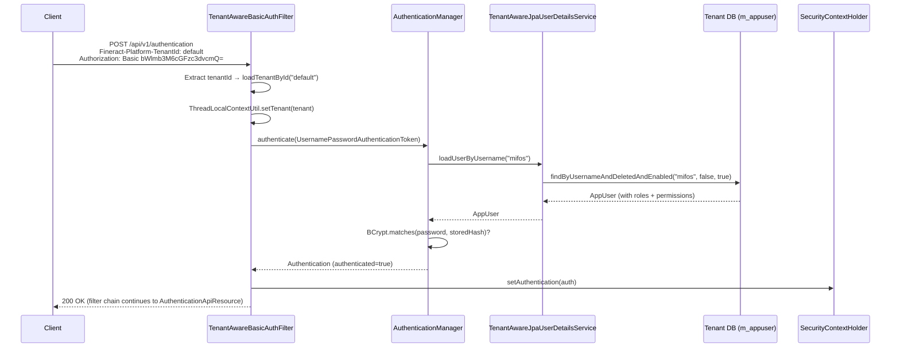

Apache Fineract implements **stateless, session-less authentication** for every API call. Each request must carry both a `Fineract-Platform-TenantId` header and valid credentials — either HTTP Basic encoded in `Authorization: Basic <base64>` or a Bearer JWT token. There is no server-side session: credentials are re-validated per request by Spring Security's filter chain. The active authentication mechanism is governed by feature flags in `application.properties`, allowing Basic auth, an internal OAuth2 Authorization Server, and OIDC federation to coexist or be switched independently.

## Responsibility

The authentication subsystem is responsible for:
1. Extracting and validating multi-tenant context from `Fineract-Platform-TenantId` header.
2. Verifying username/password credentials against BCrypt-hashed passwords stored in `m_appuser`.
3. Exposing the `POST /api/v1/authentication` endpoint for front-end token bootstrapping.
4. Populating `SecurityContextHolder` with an authenticated `AppUser` principal for downstream authorization.
5. Enforcing password expiry and "first login must change password" semantics.

---

## File Inventory

| File | Location | Role |
|---|---|---|
| `SecurityConfig.java` | `fineract-provider/.../core/config/SecurityConfig.java` | Main Spring Security filter chain for Basic auth (`@ConditionalOnProperty("fineract.security.basicauth.enabled")`) |
| `TenantAwareBasicAuthenticationFilter.java` | `fineract-security/.../filter/TenantAwareBasicAuthenticationFilter.java` | Extends `BasicAuthenticationFilter`; resolves tenant, sets `ThreadLocalContextUtil`, delegates to Spring |
| `AuthenticationApiResource.java` | `fineract-security/.../api/AuthenticationApiResource.java` | JAX-RS resource: `POST /api/v1/authentication`; manual credential check, returns `AuthenticatedUserData` JSON |
| `LoginController.java` | `fineract-security/.../api/LoginController.java` | Spring MVC `@Controller`; `GET /login` → resolves template `login.html` for browser-based OAuth2 form |
| `TemporaryPasswordAwareAuthenticationProvider.java` | `fineract-provider/.../service/TemporaryPasswordAwareAuthenticationProvider.java` | Extends `DaoAuthenticationProvider`; allows login with either permanent or non-expired temporary password |
| `TenantAwareJpaPlatformUserDetailsService.java` | `fineract-security/.../service/TenantAwareJpaPlatformUserDetailsService.java` | `UserDetailsService` impl; loads `AppUser` by username (active users only), keyed by tenant in cache |
| `PlatformUserDetailsChecker.java` | `fineract-provider/.../service/PlatformUserDetailsChecker.java` | `UserDetailsChecker`; enforces `credentialsNonExpired` at Spring layer |
| `SpringSecurityPlatformSecurityContext.java` | `fineract-security/.../service/SpringSecurityPlatformSecurityContext.java` | Wraps `SecurityContextHolder`; `authenticatedUser()` extracts `AppUser` principal and checks password renewal |
| `AppUser.java` | `fineract-core/.../useradministration/domain/AppUser.java` | JPA entity (`m_appuser`); implements `UserDetails`; holds roles, password, office, staff |
| `AppUserRepository.java` | `fineract-core/.../useradministration/domain/AppUserRepository.java` | JPA repository; `findByUsernameAndDeletedAndEnabled(...)` with JPQL fetch join on roles/permissions |
| `AuthenticatedUserData.java` | `fineract-security/.../data/AuthenticatedUserData.java` | Response DTO: username, userId, base64Key, authenticated flag, officeId, roles, permissions |
| `LoginAttemptEventListener.java` | `fineract-provider/.../service/LoginAttemptEventListener.java` | Spring event listener; increments `failedLoginAttempts` on `AbstractAuthenticationFailureEvent`, locks account |
| `AuthTenantDetailsService.java` / `AuthTenantDetailsServiceJdbc.java` | `fineract-security/.../service/` | Loads `FineractPlatformTenant` from master DB by tenant identifier |

---

## Key Abstractions

### `TenantAwareBasicAuthenticationFilter`

```
fineract-security/.../filter/TenantAwareBasicAuthenticationFilter.java
extends BasicAuthenticationFilter
```

The single most important filter for Basic auth. Runs before any Spring Security authentication decision. Its `doFilterInternal` method:

1. Reads `Fineract-Platform-TenantId` header (constant `TENANT_ID_REQUEST_HEADER = "Fineract-Platform-TenantId"`).
2. Falls back to query parameter `tenantIdentifier` if the header is absent.
3. Throws `InvalidTenantIdentifierException` (HTTP 400) if neither is found and `EXCEPTION_IF_HEADER_MISSING = true`.
4. Calls `AuthTenantDetailsService.loadTenantById(tenantIdentifier, isReportRequest)` to resolve `FineractPlatformTenant`.
5. Stores the tenant in `ThreadLocalContextUtil.setTenant(tenant)`.
6. Caches the raw `Authorization: Basic ...` token in `ThreadLocalContextUtil.setAuthToken(...)`.
7. Delegates to `super.doFilterInternal(...)` which performs the actual Basic credential extraction and `AuthenticationManager` call.
8. On successful authentication, checks `UserNotificationService.hasUnreadUserNotifications()` and adds `X-Notification-Refresh` response header.
9. On `InvalidTenantIdentifierException`, clears `SecurityContextHolder` and sends `HTTP 400`.
10. Always calls `ThreadLocalContextUtil.reset()` in `finally`.

<Note>
OPTIONS requests are allowed through without authentication to support CORS preflight from AJAX clients. The `FIRST_REQUEST_PROCESSED` static flag triggers cache mode initialization once on the very first real request.
</Note>

### `AuthenticationApiResource`

```java
// fineract-security/.../api/AuthenticationApiResource.java
@Component
@ConditionalOnProperty("fineract.security.basicauth.enabled")
@Path("/v1/authentication")
```

Handles `POST /api/v1/authentication`. This endpoint is **explicitly permitted without authentication** in `SecurityConfig` (`requestMatchers(POST, "/api/*/authentication").permitAll()`).

**Request body** (JSON):
```json
{ "username": "mifos", "password": "password" }
```

Internally the resource:
1. Parses JSON with Gson into `AuthenticateRequest` inner class (fields `username`, `password`).
2. Creates a `UsernamePasswordAuthenticationToken` and passes it to the `@Qualifier("customAuthenticationProvider") DaoAuthenticationProvider`.
3. The provider delegates to `TenantAwareJpaPlatformUserDetailsService.loadUserByUsername()`.
4. Password is verified by `TemporaryPasswordAwareAuthenticationProvider.additionalAuthenticationChecks()`.
5. Constructs `AuthenticatedUserData` with all user details.
6. If `SpringSecurityPlatformSecurityContext.doesPasswordHasToBeRenewed(principal)` returns `true`, throws `PasswordResetRequiredException` (HTTP 403) with a partial `AuthenticatedUserData` (containing `shouldRenewPassword = true`).
7. Checks `fineract.security.2fa.enabled` and `principal.hasSpecificPermissionTo(TwoFactorConstants.BYPASS_TWO_FACTOR_PERMISSION)` to set `isTwoFactorAuthenticationRequired`.
8. Returns full `AuthenticatedUserData` serialized as JSON.

**Response body** (200 OK):
```json
{
  "username": "mifos",
  "userId": 1,
  "base64EncodedAuthenticationKey": "bWlmb3M6cGFzc3dvcmQ=",
  "authenticated": true,
  "officeId": 1,
  "officeName": "Head Office",
  "staffId": null,
  "staffDisplayName": null,
  "organisationalRole": null,
  "roles": [{ "id": 1, "name": "Super user", "description": "..." }],
  "permissions": ["ALL_FUNCTIONS"],
  "shouldRenewPassword": false,
  "isTwoFactorAuthenticationRequired": false
}
```

The `base64EncodedAuthenticationKey` is the Base64 encoding of `username:password` — it is the value to use as the `Authorization: Basic <key>` header in subsequent requests.

### `LoginController`

```java
// fineract-security/.../api/LoginController.java
@Controller
public class LoginController {
    @GetMapping("/login")
    public String login() { return "login"; }
}
```

A minimal Spring MVC `@Controller`. Handles `GET /login` and resolves the Thymeleaf template `src/main/resources/templates/login.html`. Used only in the OAuth2 Authorization Server flow (`AuthorizationServerConfig`) where the authorization server endpoint requires form login for token issuance.

### `TemporaryPasswordAwareAuthenticationProvider`

```java
// fineract-provider/.../service/TemporaryPasswordAwareAuthenticationProvider.java
extends DaoAuthenticationProvider
```

Overrides `additionalAuthenticationChecks()`. In addition to the standard BCrypt check against `userDetails.getPassword()`, it also accepts a match against `AppUser.getTemporaryPassword()` — provided the temporary password has not expired (`AppUser.hasValidTemporaryPassword()` returns `true`). This supports password-reset-by-email flows where a time-limited temporary password is issued.

This bean is registered as `customAuthenticationProvider` in both `SecurityConfig` (Basic auth mode) and `AuthorizationServerConfig` (OAuth2 mode).

### `TenantAwareJpaPlatformUserDetailsService`

```java
// fineract-security/.../service/TenantAwareJpaPlatformUserDetailsService.java
@Service("userDetailsService")
```

Implements `UserDetailsService`. The `loadUserByUsername(String username)` method:
- Queries `AppUserRepository.findByUsernameAndDeletedAndEnabled(username, false, true)` — only non-deleted, enabled users.
- The JPQL query eagerly fetches `office`, `roles`, and `role.permissions` in one query.
- Result is cached via `@Cacheable(value = "usersByUsername", key = "...tenant...+username+'ubu'")`.
- Cache key includes tenant identifier from `ThreadLocalContextUtil` so the same username in different tenants resolves independently.

### `SpringSecurityPlatformSecurityContext`

```java
// fineract-security/.../service/SpringSecurityPlatformSecurityContext.java
```

The canonical way to access the currently authenticated user throughout the codebase:

```java
AppUser user = context.authenticatedUser();
```

Also exposes:
- `authenticatedUser(CommandWrapper)` — same, but exempts the change-password command from force-reset checks.
- `doesPasswordHasToBeRenewed(AppUser)` — returns `true` if `passwordResetRequired == true` OR if forced reset is enabled and password age exceeds configured duration.
- `validateAccessRights(String resourceOfficeHierarchy)` — verifies the user's office hierarchy contains the resource's hierarchy prefix (office-scoped data access).

### `AppUser` (entity)

```java
// fineract-core/.../useradministration/domain/AppUser.java
@Entity @Table(name = "m_appuser")
```

Key fields:

| Column | Java Field | Purpose |
|---|---|---|
| `username` | `username` | Unique login name |
| `password` | `password` | BCrypt-hashed password |
| `temporary_password` | `temporaryPassword` | BCrypt hash of time-limited reset password |
| `temporary_password_expiry_time` | `temporaryPasswordExpiryTime` | UTC expiry for temporary password |
| `nonlocked` | `accountNonLocked` | `false` when brute-force lockout is triggered |
| `failed_login_attempts` | `failedLoginAttempts` | Counter; reset on success |
| `is_login_retries_enabled` | `loginRetryLimitEnabled` | Per-user toggle for retry-limit locking |
| `password_reset_required` | `passwordResetRequired` | Forces password change on next login |
| `firsttime_login_remaining` | `firstTimeLoginRemaining` | `true` until first successful password change |
| `last_time_password_updated` | `lastTimePasswordUpdated` | Used by forced-rotation policy |
| `password_never_expires` | `passwordNeverExpires` | Exempts user from forced-rotation |
| `office_id` | `office` | `@ManyToOne → Office` |
| `staff_id` | `staff` | `@ManyToOne → Staff` (nullable) |

`getAuthorities()` delegates to `populateGrantedAuthorities()`, which iterates all `Role` objects and all their `Permission` objects and returns each `permission.getCode()` as a `SimpleGrantedAuthority`.

### `AppUserRepository`

```java
// fineract-core/.../useradministration/domain/AppUserRepository.java
```

Extends `JpaRepository<AppUser, Long>` and `PlatformUserRepository`. Critical method:

```java
AppUser findByUsernameAndDeletedAndEnabled(String username, boolean deleted, boolean enabled)
```

Uses a JPQL `join fetch` across `office`, `roles`, and `role.permissions` to avoid N+1 queries. Always called with `deleted=false, enabled=true`.

---

## Spring Security Filter Chain Order

<Steps>
  <Step title="TenantAwareBasicAuthenticationFilter">
    Resolves `Fineract-Platform-TenantId`, stores `FineractPlatformTenant` in `ThreadLocalContextUtil`. Reads `Authorization: Basic ...` and stores raw Base64 token.
  </Step>
  <Step title="BasicAuthenticationFilter (Spring built-in via super)">
    Decodes `Authorization: Basic <base64>`, creates `UsernamePasswordAuthenticationToken`, invokes `AuthenticationManager → TemporaryPasswordAwareAuthenticationProvider`.
  </Step>
  <Step title="TwoFactorAuthenticationFilter (conditional)">
    Active only when `fineract.security.2fa.enabled=true`. Reads `Fineract-Platform-TFA-Token` header and adds `TWOFACTOR_AUTHENTICATED` authority.
  </Step>
  <Step title="Method Security (@PreAuthorize / validateHasPermission)">
    Applied by `@EnableMethodSecurity` in `SecurityConfig`. Checks specific `GrantedAuthority` codes on `SecurityContextHolder` principal.
  </Step>
</Steps>



---

## Session-less / Stateless Design

`SecurityConfig.filterChain()` configures:
```java
.sessionManagement(session -> session.sessionCreationPolicy(SessionCreationPolicy.STATELESS))
```

No `HttpSession` is created. The `SecurityContextHolder` strategy defaults to `ThreadLocal`, which is cleared at the end of each request by `ThreadLocalContextUtil.reset()` in the filter's `finally` block. Clients must send credentials on every request.

---

## Password Hashing

Fineract uses **BCrypt** through Spring Security's `PasswordEncoderFactories.createDelegatingPasswordEncoder()`. This creates a `DelegatingPasswordEncoder` with `bcrypt` as the default, prefixing stored hashes with `{bcrypt}`. The bean is registered in both `SecurityConfig` and `AuthorizationServerConfig`:

```java
@Bean
public PasswordEncoder passwordEncoder() {
    return PasswordEncoderFactories.createDelegatingPasswordEncoder();
}
```

`DaoAuthenticationProvider.setPasswordEncoder(passwordEncoder())` links this to all user authentication. `AppUser.updatePassword(String encodePassword)` stores the already-encoded value — encoding happens upstream in `AppUserWritePlatformServiceJpaRepositoryImpl`.

---

## Configuration Properties

<Accordion title="All security.basicauth properties">

| Property | Env Var | Default | Purpose |
|---|---|---|---|
| `fineract.security.basicauth.enabled` | `FINERACT_SECURITY_BASICAUTH_ENABLED` | `true` | Activates `SecurityConfig` and `AuthenticationApiResource` |
| `fineract.security.2fa.enabled` | `FINERACT_SECURITY_2FA_ENABLED` | `false` | Enables 2FA filter and `TwoFactorApiResource` |
| `fineract.security.hsts.enabled` | `FINERACT_SECURITY_HSTS_ENABLED` | `false` | Adds HSTS response header |
| `fineract.security.cors.enabled` | `FINERACT_SECURITY_CORS_ENABLED` | `true` | Enables CORS via Spring's `CorsFilter` |
| `fineract.security.cors.allowed-origin-patterns` | `FINERACT_SECURITY_CORS_ALLOWED_ORIGIN_PATTERNS` | `*` | CORS allowed origins |

</Accordion>

---

## Login Attempt Locking

`LoginAttemptEventListener` (`fineract-provider/.../service/LoginAttemptEventListener.java`) listens to Spring Security's `AbstractAuthenticationFailureEvent`:

1. Checks `ConfigurationDomainService.isMaxLoginRetriesEnabled()` and `retrieveMaxLoginRetries()`.
2. Calls `AppUser.registerFailedLoginAttempt(maxRetries)`.
3. Inside `registerFailedLoginAttempt`, if `loginRetryLimitEnabled == true` and `failedLoginAttempts >= maxRetries`, sets `accountNonLocked = false`.
4. Saves the user and evicts `users` and `usersByUsername` caches.
5. On `AuthenticationSuccessEvent`, resets `failedLoginAttempts` to 0.

<Warning>
The system user (`AppUserConstants.SYSTEM_USER_NAME`) is never subject to login retry locking — `resolveLoginRetryLimitEnabled()` always returns `false` for the system user, enforced in both `AppUser.updateLoginRetryLimitEnabled()` and `AppUser.fromJson()`.
</Warning>

---

## Gotchas & Invariants

<Accordion title="Tenant header is mandatory for every request">
`EXCEPTION_IF_HEADER_MISSING = true` is hardcoded in `TenantAwareBasicAuthenticationFilter`. Missing `Fineract-Platform-TenantId` → HTTP 400. The only way to pass a tenant without the header is via `?tenantIdentifier=` query parameter, but this is discouraged in production.
</Accordion>

<Accordion title="Cache key collision across tenants">
`TenantAwareJpaPlatformUserDetailsService` caches by `tenantIdentifier + username + 'ubu'`. The `ThreadLocalContextUtil` must have the correct tenant set **before** `loadUserByUsername` is called — the filter ensures this ordering.
</Accordion>

<Accordion title="Password reset forces HTTP 403 at POST /authentication">
`AuthenticationApiResource` throws `PasswordResetRequiredException` (which maps to HTTP 403) when `shouldRenewPassword = true`. The response body still contains a partial `AuthenticatedUserData` with `base64EncodedAuthenticationKey` so the client can immediately call the change-password endpoint without repeating the login.
</Accordion>

<Accordion title="Soft delete masks user existence">
`AppUserRepository.findByUsernameAndDeletedAndEnabled` only returns `deleted=false, enabled=true` users. A deleted user silently appears as "not found" and Spring Security raises `UsernameNotFoundException`, which internally becomes `BadCredentialsException` (no leaking of existence).
</Accordion>

<Accordion title="m_appuser unique constraint on username (per tenant)">
The `@Table` annotation has `uniqueConstraints = @UniqueConstraint(columnNames = {"username"}, name = "username_org")`. Tenant DB isolation means the same username can exist in different tenants. The constraint is tenant-scoped because each tenant has its own database schema.
</Accordion>
