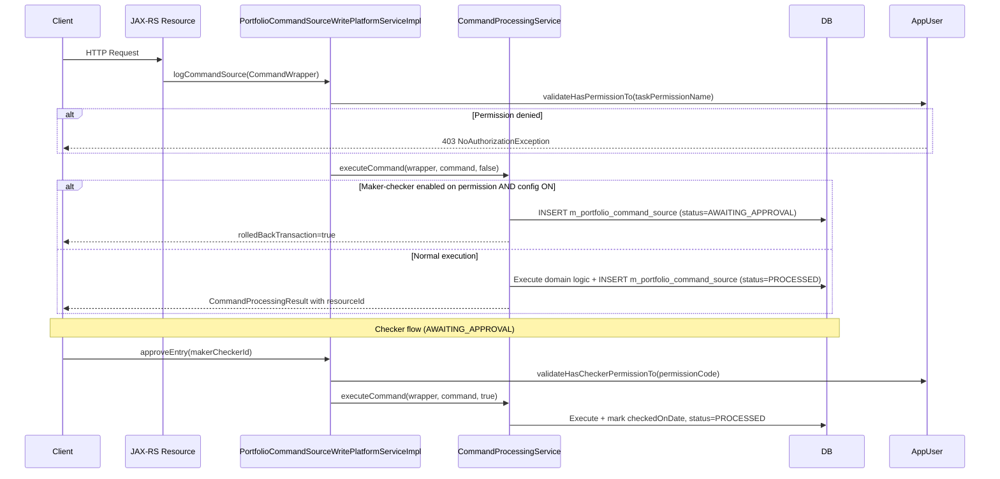

Apache Fineract's authorization layer is a flat, role-based access control (RBAC) system built on top of Spring Security's `GrantedAuthority` mechanism. Every API operation maps to a named permission code (e.g., `CREATE_LOAN`, `APPROVE_LOAN`). Users are assigned one or more `Role` entities, each carrying a set of `Permission` entities. The platform resolves all authorities at authentication time, expands them into a flat `GrantedAuthority` list, and subsequently enforces them via programmatic permission checks throughout service and resource classes. A separate **Maker-Checker** subsystem intercepts write commands and holds them in the `m_portfolio_command_source` table pending second-user approval when the relevant permission is maker-checker enabled.

---

## File Inventory

| File | Package | Purpose |
|------|---------|---------|
| `fineract-core/…/useradministration/domain/AppUser.java` | `org.apache.fineract.useradministration.domain` | JPA entity for application users; carries `Role` set, all permission-check methods |
| `fineract-core/…/useradministration/domain/Role.java` | `org.apache.fineract.useradministration.domain` | JPA entity for roles; `@ManyToMany` to `Permission` via `m_role_permission` |
| `fineract-core/…/useradministration/domain/Permission.java` | `org.apache.fineract.useradministration.domain` | JPA entity backed by `m_permission`; stores `grouping`, `code`, `entity_name`, `action_name`, `can_maker_checker` |
| `fineract-core/…/commands/domain/CommandSource.java` | `org.apache.fineract.commands.domain` | JPA entity for `m_portfolio_command_source`; audit record for every write command |
| `fineract-core/…/commands/service/PortfolioCommandSourceWritePlatformServiceImpl.java` | `org.apache.fineract.commands.service` | Orchestrates permission check → command execution → maker-checker gating |
| `fineract-provider/…/useradministration/api/UsersApiResource.java` | `org.apache.fineract.useradministration.api` | JAX-RS resource for `/v1/users` |
| `fineract-provider/…/useradministration/api/RolesApiResource.java` | `org.apache.fineract.useradministration.api` | JAX-RS resource for `/v1/roles` and `/v1/roles/{id}/permissions` |
| `fineract-provider/…/useradministration/api/PermissionsApiResource.java` | `org.apache.fineract.useradministration.api` | JAX-RS resource for `/v1/permissions` |
| `fineract-provider/…/entityaccess/api/FineractEntityApiResource.java` | `org.apache.fineract.infrastructure.entityaccess.api` | JAX-RS resource for `/v1/entitytoentitymapping`; restricts product access per office |
| `fineract-provider/…/useradministration/service/AppUserWritePlatformServiceJpaRepositoryImpl.java` | `org.apache.fineract.useradministration.service` | JPA write service for user CRUD |
| `fineract-provider/…/useradministration/service/RoleWritePlatformServiceJpaRepositoryImpl.java` | `org.apache.fineract.useradministration.service` | JPA write service for role CRUD |
| `fineract-provider/…/useradministration/service/PermissionWritePlatformServiceJpaRepositoryImpl.java` | `org.apache.fineract.useradministration.service` | Enables/disables maker-checker on individual permissions |
| `fineract-db/old-schema-files/0003-mifosx-permissions-and-authorisation-utf8.sql` | — | Canonical initial `m_permission` INSERT statements |

---

## Key Abstractions

### `Permission`
**File:** `fineract-core/src/main/java/org/apache/fineract/useradministration/domain/Permission.java`

JPA entity mapped to `m_permission`. Fields:

| Column | Java field | Notes |
|--------|-----------|-------|
| `grouping` | `String grouping` | Logical category: `special`, `authorisation`, `configuration`, `organisation`, `transaction_loan`, `transaction_savings`, … |
| `code` | `String code` | Unique permission identifier, e.g. `CREATE_LOAN`. Equals `actionName + "_" + entityName`. |
| `entity_name` | `String entityName` | Resource type, e.g. `LOAN`, `CLIENT`, `ROLE` |
| `action_name` | `String actionName` | Action type, e.g. `CREATE`, `READ`, `UPDATE`, `DELETE`, `APPROVE`, `REJECT`, `DISBURSE` |
| `can_maker_checker` | `boolean canMakerChecker` | When `true` this permission may be enabled for maker-checker workflow |

`hasCode(String checkCode)` performs a case-insensitive comparison against `code`.

### `Role`
**File:** `fineract-core/src/main/java/org/apache/fineract/useradministration/domain/Role.java`

JPA entity mapped to `m_role` (`@UniqueConstraint` on `name`). Holds a `@ManyToMany(fetch=EAGER)` set of `Permission` via join table `m_role_permission`. Key method: `hasPermissionTo(String permissionCode)` iterates the set for a match.

### `AppUser`
**File:** `fineract-core/src/main/java/org/apache/fineract/useradministration/domain/AppUser.java`

JPA entity mapped to `m_appuser`. Implements Spring Security's `UserDetails` and Fineract's `PlatformUser`. The `@ManyToMany(fetch=EAGER)` relationship to `Role` via `m_appuser_role` means all roles and their permissions are loaded at login time.

Authority resolution — `populateGrantedAuthorities()` — iterates every role, then every permission within each role, and creates a `SimpleGrantedAuthority(permission.getCode())`. This is what Spring Security's `SecurityContext` sees.

Critical permission methods:

| Method | Description |
|--------|-------------|
| `validateHasPermissionTo(String function)` | Throws `NoAuthorizationException` if missing |
| `validateHasReadPermission(String resourceType)` | Checks `READ_<RESOURCETYPE>` or `ALL_FUNCTIONS` |
| `validateHasCheckerPermissionTo(String function)` | Checks `<FUNCTION>_CHECKER` or `CHECKER_SUPER_USER` |
| `isCheckerSuperUser()` | Returns `true` if user has `CHECKER_SUPER_USER` |
| `hasAllFunctionsPermission()` | Returns `true` if any role grants `ALL_FUNCTIONS` |
| `hasNotPermissionForDatatable(String datatable, String accessType)` | Combined datatable permission check |

### `CommandSource`
**File:** `fineract-core/src/main/java/org/apache/fineract/commands/domain/CommandSource.java`

JPA entity mapped to `m_portfolio_command_source`. Represents one command (write operation) in the audit log / maker-checker pipeline.

| Field | Description |
|-------|-------------|
| `actionName` | e.g. `CREATE`, `APPROVE` |
| `entityName` | e.g. `LOAN`, `CLIENT` |
| `maker` | `AppUser` who submitted the command |
| `checker` | `AppUser` who approved/rejected it (nullable) |
| `madeOnDate` | `OffsetDateTime` of submission |
| `checkedOnDate` | `OffsetDateTime` of approval/rejection |
| `status` | Integer mapped to `CommandProcessingResultType` enum |
| `commandAsJson` | JSON body of the original request |
| `idempotencyKey` | 50-char client-supplied idempotency key |

Status lifecycle: `AWAITING_APPROVAL (2)` → `PROCESSED (1)` or `REJECTED (3)`.

`getPermissionCode()` returns `actionName + "_" + entityName` — the exact string checked for maker-checker authority.

---

## Permission Naming Convention

All permissions follow the pattern **`ACTION_RESOURCETYPE`**. The `_CHECKER` suffix variant is auto-generated for checker authority.

```
CREATE_LOAN        → maker has create-loan authority
CREATE_LOAN_CHECKER → checker can approve CREATE_LOAN commands
APPROVE_LOAN
APPROVE_LOAN_CHECKER
READ_USER          → read-only; not maker-checkerable
ALL_FUNCTIONS      → super-user wildcard
ALL_FUNCTIONS_READ → read-only super-user
CHECKER_SUPER_USER → can approve any command
BYPASS_TWOFACTOR   → skip 2FA header requirement
REPORTING_SUPER_USER → access to all reports
```

### Permission Groupings (from `0003-mifosx-permissions-and-authorisation-utf8.sql`)

| Grouping | Example permissions |
|----------|-------------------|
| `special` | `ALL_FUNCTIONS`, `ALL_FUNCTIONS_READ`, `CHECKER_SUPER_USER` |
| `authorisation` | `READ_PERMISSION`, `CREATE_ROLE`, `UPDATE_ROLE`, `CREATE_USER`, `UPDATE_USER`, `READ_USER` |
| `configuration` | `READ_CONFIGURATION`, `UPDATE_CONFIGURATION`, `READ_CODE`, `CREATE_CODE`, `UPDATE_CODE`, `READ_AUDIT`, `UPDATE_PERMISSION` |
| `organisation` | `READ_CHARGE`, `CREATE_CHARGE`, `UPDATE_CHARGE`, `READ_FUND`, `CREATE_FUND`, `READ_LOANPRODUCT`, `CREATE_LOANPRODUCT`, `READ_OFFICE`, `CREATE_OFFICE`, `READ_MAKERCHECKER` |
| `transaction_loan` | `APPROVE_LOAN`, `REJECT_LOAN`, `DISBURSE_LOAN`, `READ_LOAN`, `CREATE_LOAN`, `UPDATE_LOAN` |
| `transaction_savings` | `CREATE_SAVINGSACCOUNT`, `APPROVE_SAVINGSACCOUNT`, `ACTIVATE_SAVINGSACCOUNT` |

<Note>
`ALL_FUNCTIONS` bypasses every specific permission check throughout `AppUser`. Any role granted this permission gives its holders unconditional write access to the platform. The superuser role (id=1) is seeded with this permission in the initial data.
</Note>

---

## How Permissions Are Checked

### At the Resource Layer
JAX-RS resource classes use programmatic checks through the injected `PlatformSecurityContext`:

```java
// UsersApiResource.java — retrieveAll()
this.context.authenticatedUser().validateHasReadPermission(RESOURCE_NAME_FOR_PERMISSIONS);
// RESOURCE_NAME_FOR_PERMISSIONS = "USER"
// Internally checks: ALL_FUNCTIONS, ALL_FUNCTIONS_READ, or READ_USER
```

### At the Command Dispatch Layer
`PortfolioCommandSourceWritePlatformServiceImpl.logCommandSource()` calls:
```java
this.context.authenticatedUser(wrapper).validateHasPermissionTo(wrapper.getTaskPermissionName());
```
`wrapper.getTaskPermissionName()` returns the permission code like `CREATE_LOAN`.

### Method Security (`@EnableMethodSecurity`)
`SecurityConfig` (active when `fineract.security.basicauth.enabled=true`) enables Spring method security. Individual methods may also use `hasAuthority()` SpEL expressions via `@PreAuthorize`.

---

## Maker-Checker Workflow

<Steps>
  <Step title="Command submitted">
    Client calls a write endpoint (e.g., `POST /v1/loans`). `PortfolioCommandSourceWritePlatformServiceImpl.logCommandSource()` is invoked.
  </Step>
  <Step title="Permission check">
    `authenticatedUser(wrapper).validateHasPermissionTo(taskPermissionName)` is called. If the user lacks the permission, `NoAuthorizationException` is thrown immediately (403).
  </Step>
  <Step title="Maker-checker evaluation">
    `processAndLogCommandService.executeCommand(wrapper, command, isApprovedByChecker)` is called. If the permission has `can_maker_checker=true` AND the global `is-maker-checker-enabled` configuration is on AND `isApprovedByChecker=false`, the command is persisted as `AWAITING_APPROVAL` and a `CommandProcessingResult` with `isRolledBackTransaction=true` is returned.
  </Step>
  <Step title="Checker approval">
    A second user (with `<PERMISSION>_CHECKER` or `CHECKER_SUPER_USER`) calls `approveEntry(makerCheckerId)`. `validateMakerCheckerTransaction()` confirms the record is `AWAITING_APPROVAL`, then verifies checker authority. If `isSameMakerCheckerEnabled=false` and the checker is the same user who made the entry, `UnsupportedCommandException` is thrown.
  </Step>
  <Step title="Execution">
    The original JSON is replayed via `processAndLogCommandService.executeCommand(wrapper, command, true)` with `isApprovedByChecker=true`, which bypasses the maker-checker gate and commits the transaction.
  </Step>
  <Step title="Rejection or deletion">
    `rejectEntry(makerCheckerId)` sets status to `REJECTED` and records the checker. `deleteEntry(makerCheckerId)` hard-deletes the pending command.
  </Step>
</Steps>

### `PortfolioCommandSourceWritePlatformServiceImpl` — Maker-Checker Gate Logic

**File:** `fineract-core/src/main/java/org/apache/fineract/commands/service/PortfolioCommandSourceWritePlatformServiceImpl.java`

```java
// validateMakerCheckerTransaction — checker auth
appUser.validateHasCheckerPermissionTo(permissionCode);
// validateHasCheckerPermissionTo checks: CHECKER_SUPER_USER or <PERMISSION>_CHECKER

// Same-user guard
if (!configurationService.isSameMakerCheckerEnabled() && !appUser.isCheckerSuperUser()) {
    if (Objects.equals(appUser.getId(), maker.getId())) {
        throw new UnsupportedCommandException(permissionCode, "Can not be checked by the same user.");
    }
}
```

<Warning>
When a user changes their **own** account details (`wrapper.isChangeOfOwnUserDetails(...)` returns `true`), `isApprovedByChecker` is forced to `true` and the maker-checker gate is bypassed entirely, even if `CREATE_USER` / `UPDATE_USER` has maker-checker enabled.
</Warning>

---

## Database Schema Overview

```
m_permission (id, grouping, code, entity_name, action_name, can_maker_checker)
     ↕  m_role_permission (role_id, permission_id)
m_role (id, name, description, is_disabled)
     ↕  m_appuser_role (appuser_id, role_id)
m_appuser (id, username, email, office_id, staff_id, …)

m_portfolio_command_source (id, action_name, entity_name, maker_id, checker_id,
                             made_on_date_utc, checked_on_date_utc, status,
                             command_as_json, idempotency_key, …)
```

---

## REST API Endpoints

### User Management — `UsersApiResource`
**File:** `fineract-provider/src/main/java/org/apache/fineract/useradministration/api/UsersApiResource.java`
**Base path:** `/v1/users`

| Method | Path | Required Permission | Description |
|--------|------|--------------------|-|
| `GET` | `/v1/users` | `READ_USER` | List all users |
| `GET` | `/v1/users/{userId}` | `READ_USER` (own user exempt) | Retrieve single user |
| `GET` | `/v1/users/template` | `READ_USER` | New-user form template |
| `POST` | `/v1/users` | `CREATE_USER` | Create a user; auto-generates & emails password when `sendPasswordToEmail=true` |
| `PUT` | `/v1/users/{userId}` | `UPDATE_USER` | Update user (office, staff, roles, username, email, etc.) |
| `POST` | `/v1/users/{userId}/pwd` | `UPDATE_USER` | Change user password |
| `DELETE` | `/v1/users/{userId}` | `DELETE_USER` | Soft-delete user (marks `is_deleted=true`, clears roles) |
| `GET` | `/v1/users/downloadtemplate` | `READ_USER` | Download Excel template for bulk import |
| `POST` | `/v1/users/uploadtemplate` | `CREATE_USER` | Bulk import users from Excel |

Mandatory `POST /v1/users` fields: `username`, `firstname`, `lastname`, `email`, `officeId`, `roles[]`, `sendPasswordToEmail`. Optional: `staffId`, `passwordNeverExpires`, `isLoginRetriesEnabled`.

### Role Management — `RolesApiResource`
**File:** `fineract-provider/src/main/java/org/apache/fineract/useradministration/api/RolesApiResource.java`
**Base path:** `/v1/roles`

| Method | Path | Required Permission | Description |
|--------|------|--------------------|-|
| `GET` | `/v1/roles` | `READ_ROLE` | List all roles |
| `POST` | `/v1/roles` | `CREATE_ROLE` | Create a role (name, description mandatory) |
| `GET` | `/v1/roles/{roleId}` | `READ_ROLE` | Retrieve single role |
| `PUT` | `/v1/roles/{roleId}` | `UPDATE_ROLE` | Update role name/description |
| `POST` | `/v1/roles/{roleId}?command=enable` | `UPDATE_ROLE` | Enable a previously disabled role |
| `POST` | `/v1/roles/{roleId}?command=disable` | `UPDATE_ROLE` | Disable role (only if no users assigned) |
| `DELETE` | `/v1/roles/{roleId}` | `DELETE_ROLE` | Delete role (only if no users assigned) |
| `GET` | `/v1/roles/{roleId}/permissions` | `READ_ROLE` | Retrieve all permissions for a role with `isMakerChecker` flag |
| `PUT` | `/v1/roles/{roleId}/permissions` | `UPDATE_ROLE` | Replace permission set for a role |

### Permission Management — `PermissionsApiResource`
**File:** `fineract-provider/src/main/java/org/apache/fineract/useradministration/api/PermissionsApiResource.java`
**Base path:** `/v1/permissions`

| Method | Path | Required Permission | Description |
|--------|------|--------------------|-|
| `GET` | `/v1/permissions` | `READ_PERMISSION` | List all permissions; add `?makerCheckerable=true` to see maker-checker flags |
| `PUT` | `/v1/permissions` | `UPDATE_PERMISSION` | Enable/disable maker-checker on a set of permissions. Body: `{ "permissions": { "CREATE_LOAN": true, "APPROVE_LOAN": false } }` |

<Info>
Permissions cannot be created or deleted via the API. They are defined exclusively in Liquibase changeset files (`0003-mifosx-permissions-and-authorisation-utf8.sql` and subsequent migration XMLs). The only mutable field is `can_maker_checker`.
</Info>

### Entity-to-Entity Access (Product Restriction) — `FineractEntityApiResource`
**File:** `fineract-provider/src/main/java/org/apache/fineract/infrastructure/entityaccess/api/FineractEntityApiResource.java`
**Base path:** `/v1/entitytoentitymapping`

This resource controls which loan products, savings products, or charges are visible to which offices. Internally stored as typed mappings in `m_entity_to_entity_mapping`.

| Method | Path | Description |
|--------|------|-------------|
| `GET` | `/v1/entitytoentitymapping` | List all supported mapping types (e.g., office-to-loan-product) |
| `GET` | `/v1/entitytoentitymapping/{mapId}` | Retrieve all mappings of a type |
| `GET` | `/v1/entitytoentitymapping/{mapId}/{fromId}/{toId}` | Retrieve specific mapping |
| `POST` | `/v1/entitytoentitymapping/{relId}` | Create new mapping |
| `PUT` | `/v1/entitytoentitymapping/{mapId}` | Update existing mapping |
| `DELETE` | `/v1/entitytoentitymapping/{mapId}` | Delete mapping |

---

## Handlers

<Accordion title="User & Role Command Handlers">

All handlers are in `fineract-provider/src/main/java/org/apache/fineract/useradministration/handler/`:

| Handler Class | `@CommandType` | Action |
|--------------|---------------|--------|
| `CreateUserCommandHandler` | `entity=USER, action=CREATE` | Calls `JpaUserDomainService.create()` |
| `UpdateUserCommandHandler` | `entity=USER, action=UPDATE` | Updates user fields including password |
| `DeleteUserCommandHandler` | `entity=USER, action=DELETE` | Soft-deletes user |
| `ChangeUserPasswordCommandHandler` | `entity=USER, action=CHANGEPWD` | Changes password; validates not same as previous |
| `CreateRoleCommandHandler` | `entity=ROLE, action=CREATE` | Creates new `Role` entity |
| `UpdateRoleCommandHandler` | `entity=ROLE, action=UPDATE` | Updates role name/description |
| `DeleteRoleCommandHandler` | `entity=ROLE, action=DELETE` | Deletes role if not associated to any user |
| `EnableRoleCommandHandler` | `entity=ROLE, action=ENABLE` | Sets `is_disabled=false` |
| `DisableRoleCommandHandler` | `entity=ROLE, action=DISABLE` | Sets `is_disabled=true` |
| `UpdateRolePermissionsCommandHandler` | `entity=ROLE, action=PERMISSIONS` | Replaces permissions on a role |
| `UpdateMakerCheckerPermissionsCommandHandler` | `entity=PERMISSION, action=UPDATE` | Calls `PermissionWritePlatformService.updateMakerCheckerPermissions()` |

</Accordion>

---

## Control & Data Flow



---

## Gotchas & Invariants

<Accordion title="ALL_FUNCTIONS supersedes everything">
Any role that contains the `ALL_FUNCTIONS` permission bypasses every specific permission check in `AppUser.hasPermissionTo()`. The call chain is: `hasPermissionTo()` → `hasAllFunctionsPermission()` → iterate roles for `ALL_FUNCTIONS`. If found, specific code matching is skipped. This means you **cannot** restrict a super-user role by adding it to a role that also has `ALL_FUNCTIONS`.
</Accordion>

<Accordion title="Roles loaded eagerly at login">
Both `Role` and `Permission` sets are loaded `FetchType.EAGER`. For users with many roles and many permissions per role, this can result in large database queries on every authentication. Measure and cache if needed.
</Accordion>

<Accordion title="Soft deletes preserve username uniqueness">
`AppUser.delete()` prepends `getId() + "_DELETED_"` to `username`. This allows re-creating a user with the same username after deletion. Deleted users have `enabled=false` and no roles.
</Accordion>

<Accordion title="CHECKER_SUPER_USER vs. _CHECKER suffix">
`validateHasCheckerPermissionTo(function)` checks both `CHECKER_SUPER_USER` (global) and `<FUNCTION>_CHECKER` (specific). Holding either is sufficient. The `_CHECKER` permission must exist in `m_permission` with a corresponding `can_maker_checker=true` counterpart, but is a separate row from the base permission.
</Accordion>

<Accordion title="Maker-checker and own-account edits">
When `CommandWrapper.isChangeOfOwnUserDetails(userId)` returns `true`, `isApprovedByChecker` is set `true` unconditionally. This bypasses maker-checker even if `UPDATE_USER` has maker-checker enabled. This is intentional — users changing their own passwords would otherwise be locked out.
</Accordion>

<Accordion title="is_disabled on Role is not enforced at the authority level">
`Role.isDisabled()` returns a boolean, but `AppUser.populateGrantedAuthorities()` iterates `roles` without checking `disabled`. A disabled role's permissions are still granted. The `disabled` flag is used only to prevent assignment of new users to that role. Audit this if you need immediate revocation.
</Accordion>
