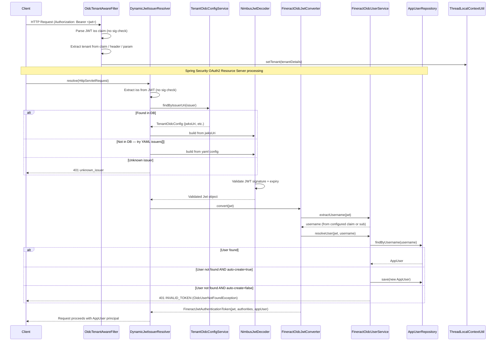

Fineract supports two distinct OAuth2/OIDC modes that are mutually exclusive with Basic Auth via `@ConditionalOnProperty`. The **OAuth2 Authorization Server** mode (`fineract.security.oauth2.enabled=true`) turns Fineract into its own Spring Authorization Server and issues JWTs signed by Fineract's own key pair. The **OIDC Federation** mode (`fineract.security.oidc-federation.enabled=true`) makes Fineract a pure OAuth2 Resource Server that trusts JWTs issued by external Identity Providers (Keycloak, Azure AD, Okta, Auth0, or any generic OIDC-compliant IdP). Both modes ultimately resolve to a `FineractJwtAuthenticationToken` principal whose `getPrincipal()` returns a Fineract `AppUser`, ensuring the downstream permission system works identically regardless of the authentication mode.

---

## File Inventory

| File | Package | Purpose |
|------|---------|---------|
| `fineract-provider/…/security/config/AuthorizationServerConfig.java` | `org.apache.fineract.infrastructure.security.config` | Spring Security config for OAuth2 Authorization Server mode (`@ConditionalOnProperty("fineract.security.oauth2.enabled")`) |
| `fineract-provider/…/security/config/OidcFederationSecurityConfig.java` | `org.apache.fineract.infrastructure.security.config` | Spring Security config for OIDC Federation mode (`@ConditionalOnProperty("fineract.security.oidc-federation.enabled")`, `@Order(100)`) |
| `fineract-provider/…/security/config/DynamicJwtIssuerAuthenticationManagerResolver.java` | `org.apache.fineract.infrastructure.security.config` | Resolves `AuthenticationManager` per request by matching JWT `iss` claim against DB config then YAML fallback |
| `fineract-security/…/converter/FineractJwtAuthenticationTokenConverter.java` | `org.apache.fineract.infrastructure.security.converter` | Converts Fineract-issued JWT to `FineractJwtAuthenticationToken`; looks up `AppUser` by JWT `sub` |
| `fineract-security/…/converter/FineractOidcJwtAuthenticationConverter.java` | `org.apache.fineract.infrastructure.security.converter` | Converts external IdP JWT to `FineractJwtAuthenticationToken`; uses configurable claim for username |
| `fineract-security/…/data/FineractJwtAuthenticationToken.java` | `org.apache.fineract.infrastructure.security.data` | Extends `JwtAuthenticationToken`; overrides `getPrincipal()` to return `UserDetails` (`AppUser`) |
| `fineract-security/…/data/FineractOidcUser.java` | `org.apache.fineract.infrastructure.security.data` | Extends `DefaultOidcUser`; carries resolved `AppUser` + `tenantId` for browser OIDC login flow |
| `fineract-security/…/data/AuthenticatedOauthUserData.java` | `org.apache.fineract.infrastructure.security.data` | API response shape for `GET /v1/userdetails` |
| `fineract-security/…/data/TenantOidcConfigData.java` | `org.apache.fineract.infrastructure.security.data` | API response DTO for per-tenant OIDC configuration (no `clientSecret` field) |
| `fineract-security/…/api/TenantOidcConfigApiResource.java` | `org.apache.fineract.infrastructure.security.api` | JAX-RS CRUD for `/v1/tenants/{tenantId}/oidc-config` |
| `fineract-security/…/api/UserDetailsApiResource.java` | `org.apache.fineract.infrastructure.security.api` | `GET /v1/userdetails` — returns `AuthenticatedOauthUserData` |
| `fineract-security/…/service/FineractOidcUserService.java` | `org.apache.fineract.infrastructure.security.service` | Maps OIDC JWT claims to `AppUser`; delegates to `OidcAppUserResolutionService` |
| `fineract-security/…/service/OidcAppUserResolutionService.java` | `org.apache.fineract.infrastructure.security.service` | Interface: `resolveOrCreate(username, email, firstName, lastName, roles)` |
| `fineract-provider/…/security/service/OidcAppUserResolutionServiceImpl.java` | `org.apache.fineract.infrastructure.security.service` | Looks up existing `AppUser` by username; optionally auto-creates based on `auto-create-user` flag |
| `fineract-security/…/filter/OidcTenantAwareFilter.java` | `org.apache.fineract.infrastructure.security.filter` | Resolves and sets tenant in `ThreadLocalContextUtil` before JWT signature validation |
| `fineract-core/…/security/domain/OidcFederationType.java` | `org.apache.fineract.infrastructure.security.domain` | Enum: `GENERIC`, `AUTH0`, `AZURE`, `GOOGLE`, `KEYCLOAK`, `OKTA` |
| `fineract-core/…/infrastructure/core/domain/TenantOidcConfig.java` | `org.apache.fineract.infrastructure.core.domain` | JPA entity for `m_tenant_oidc_config` master DB table |
| `fineract-security/…/service/TenantOidcConfigService.java` | `org.apache.fineract.infrastructure.security.service` | CRUD interface for `TenantOidcConfig` |
| `fineract-core/…/infrastructure/core/config/FineractProperties.java` | `org.apache.fineract.infrastructure.core.config` | Typed property bag; contains `FineractSecurityOAuth2Properties` and `FineractSecurityOidcFederationProperties` inner classes |

---

## Configuration Properties

All properties are in `fineract-provider/src/main/resources/application.properties`.

### Master Security Switches

| Property | Env var | Default | Description |
|----------|---------|---------|-------------|
| `fineract.security.basicauth.enabled` | `FINERACT_SECURITY_BASICAUTH_ENABLED` | `true` | Enables `SecurityConfig` (Basic Auth + method security) |
| `fineract.security.oauth2.enabled` | `FINERACT_SECURITY_OAUTH_ENABLED` | `false` | Enables `AuthorizationServerConfig` (Fineract-as-OAuth2-AS) |
| `fineract.security.oidc-federation.enabled` | `FINERACT_SECURITY_OIDC_FEDERATION_ENABLED` | `false` | Enables `OidcFederationSecurityConfig` (external IdP) |
| `fineract.security.2fa.enabled` | `FINERACT_SECURITY_2FA_ENABLED` | `false` | Enables 2FA subsystem |

<Warning>
`fineract.security.oauth2.enabled` and `fineract.security.oidc-federation.enabled` should not both be `true` simultaneously. Each activates a different `SecurityFilterChain` for `/api/**`. Running both may cause ambiguous authentication resolution.
</Warning>

### OAuth2 Client Registrations (Authorization Server mode)

These properties configure the in-memory `RegisteredClientRepository` inside `AuthorizationServerConfig`:

| Property | Env var | Default | Description |
|----------|---------|---------|-------------|
| `fineract.security.oauth2.client.registrations.frontend-client.client-id` | `FINERACT_SECURITY_OAUTH2_CLIENTS_FRONTEND_ID` | `frontend-client` | Client ID registered with the Authorization Server |
| `fineract.security.oauth2.client.registrations.frontend-client.scopes` | `FINERACT_SECURITY_OAUTH2_CLIENTS_FRONTEND_SCOPES` | `read,write` | Comma-separated OAuth2 scopes |
| `fineract.security.oauth2.client.registrations.frontend-client.authorization-grant-types` | `FINERACT_SECURITY_OAUTH2_CLIENTS_FRONTEND_GRANTS` | `authorization_code,refresh_token` | Allowed grant types |
| `fineract.security.oauth2.client.registrations.frontend-client.redirect-uris` | `FINERACT_SECURITY_OAUTH2_CLIENTS_FRONTEND_REDIRECT` | `http://localhost:3000/callback` | Allowed redirect URIs |
| `fineract.security.oauth2.client.registrations.frontend-client.require-authorization-consent` | `FINERACT_SECURITY_OAUTH2_CLIENTS_FRONTEND_CONSENT` | `false` | Whether consent screen is shown |

Additional client registrations follow the same pattern under a different key name:
```properties
fineract.security.oauth2.client.registrations.<registration-name>.client-id=...
```
Typed in `FineractProperties.FineractSecurityOAuth2Properties.ClientProperties.registrations` as `Map<String, Registration>`.

### OIDC Federation Properties (External IdP mode)

All in `fineract-core/…/FineractProperties.FineractSecurityOidcFederationProperties`:

| Property | Env var | Default | Description |
|----------|---------|---------|-------------|
| `fineract.security.oidc-federation.enabled` | `FINERACT_SECURITY_OIDC_FEDERATION_ENABLED` | `false` | Master switch |
| `fineract.security.oidc-federation.tenant-claim-name` | `FINERACT_SECURITY_OIDC_TENANT_CLAIM` | `fineract_tenant` | JWT claim name used to extract the Fineract tenant ID |
| `fineract.security.oidc-federation.username-claim` | `FINERACT_SECURITY_OIDC_USERNAME_CLAIM` | `preferred_username` | JWT claim used as Fineract username; fallback to `sub` |
| `fineract.security.oidc-federation.auto-create-user` | `FINERACT_SECURITY_OIDC_AUTO_CREATE_USER` | `false` | Auto-create `AppUser` on first OIDC login |
| `fineract.security.oidc-federation.default-roles` | `FINERACT_SECURITY_OIDC_DEFAULT_ROLES` | `` (empty) | Comma-separated role names for auto-created users |
| `fineract.security.oidc-federation.provider` | `FINERACT_SECURITY_OIDC_PROVIDER` | `generic` | Enum: `generic`, `keycloak`, `azure_ad`, `okta`, `auth0`, `google` — controls logout URL format |
| `fineract.security.oidc-federation.post-logout-redirect-uri` | `FINERACT_SECURITY_OIDC_POST_LOGOUT_URI` | `` (empty) | URI sent to the IdP in RP-Initiated Logout |

Static issuer overrides (YAML fallback, lower priority than `m_tenant_oidc_config` DB records):
```yaml
fineract:
  security:
    oidc-federation:
      issuers:
        - issuerUri: https://idp.example.com/realm/fineract
          tenantId: default
          jwksUri: https://idp.example.com/realm/fineract/protocol/openid-connect/certs
          usernameClaim: preferred_username
```

For JWT validation via Spring's built-in resource server (used in Authorization Server mode):
```properties
# Uncomment and set for external JWT issuer validation (AS mode)
# spring.security.oauth2.resourceserver.jwt.issuer-uri=https://your-idp.example.com/realm/your-realm
# spring.security.oauth2.resourceserver.jwt.jwk-set-uri=https://your-idp.example.com/.../certs
```

---

## Key Abstractions

### `FineractJwtAuthenticationToken`
**File:** `fineract-security/src/main/java/org/apache/fineract/infrastructure/security/data/FineractJwtAuthenticationToken.java`

Extends Spring Security's `JwtAuthenticationToken`. The critical override:
```java
@Override
public UserDetails getPrincipal() {
    return user; // always returns AppUser, not the Jwt itself
}
```

This ensures `SpringSecurityPlatformSecurityContext.authenticatedUser()` always gets an `AppUser` regardless of whether authentication was via Basic Auth or JWT Bearer token.

Constructor:
```java
public FineractJwtAuthenticationToken(Jwt jwt, Collection<GrantedAuthority> authorities, UserDetails user) {
    super(jwt, authorities, user.getUsername());
    this.user = Objects.requireNonNull(user, "user");
}
```

### `FineractJwtAuthenticationTokenConverter`
**File:** `fineract-security/src/main/java/org/apache/fineract/infrastructure/security/converter/FineractJwtAuthenticationTokenConverter.java`

Used in **Authorization Server mode** (`AuthorizationServerConfig`). Implements `Converter<Jwt, FineractJwtAuthenticationToken>`.

```java
public FineractJwtAuthenticationToken convert(Jwt jwt) {
    UserDetails user = userDetailsService.loadUserByUsername(jwt.getSubject()); // always uses "sub"
    Collection<GrantedAuthority> authorities = new JwtGrantedAuthoritiesConverter().convert(jwt);
    return new FineractJwtAuthenticationToken(jwt, authorities, user);
}
```

If `loadUserByUsername` throws `UsernameNotFoundException`, the converter re-throws as `OAuth2AuthenticationException(INVALID_TOKEN)`.

### `FineractOidcJwtAuthenticationConverter`
**File:** `fineract-security/src/main/java/org/apache/fineract/infrastructure/security/converter/FineractOidcJwtAuthenticationConverter.java`

Used in **OIDC Federation mode** (`OidcFederationSecurityConfig`). Implements `Converter<Jwt, FineractJwtAuthenticationToken>`.

Key differences from the internal converter:
- Username is read from the **configurable** claim (`fineract.security.oidc-federation.username-claim`, default `preferred_username`), falling back to `sub`.
- `AppUser` lookup delegates to `FineractOidcUserService.resolveUser(jwt, username)`.
- If `OidcUserNotFoundException` is thrown, wraps as `OAuth2AuthenticationException(INVALID_TOKEN)`.

```java
public FineractJwtAuthenticationToken convert(Jwt jwt) {
    String username = oidcUserService.extractUsername(jwt); // uses configured claim or "sub"
    AppUser appUser = oidcUserService.resolveUser(jwt, username);
    return new FineractJwtAuthenticationToken(jwt, appUser.getAuthorities(), appUser);
}
```

### `FineractOidcUser`
**File:** `fineract-security/src/main/java/org/apache/fineract/infrastructure/security/data/FineractOidcUser.java`

Extends `DefaultOidcUser`. Used only in the **browser-based OAuth2 login redirect flow** (not for Bearer token API auth). Carries:

| Field | Type | Description |
|-------|------|-------------|
| `appUser` | `AppUser` | Resolved Fineract user |
| `tenantId` | `String` | Tenant identifier resolved from the OIDC claim |

Both fields are required (checked by `Objects.requireNonNull`).

### `AuthenticatedOauthUserData`
**File:** `fineract-security/src/main/java/org/apache/fineract/infrastructure/security/data/AuthenticatedOauthUserData.java`

API response for `GET /v1/userdetails`. Shape:

| Field | Type | Description |
|-------|------|-------------|
| `username` | `String` | `AppUser.getUsername()` |
| `userId` | `Long` | `AppUser.getId()` |
| `accessToken` | `String` | The raw JWT `tokenValue` from `FineractJwtAuthenticationToken.getToken()` |
| `authenticated` | `boolean` | Always `true` |
| `officeId` | `Long` | User's office |
| `officeName` | `String` | User's office name |
| `staffId` | `Long` | Linked staff record (nullable) |
| `staffDisplayName` | `String` | Staff display name (nullable) |
| `organisationalRole` | `EnumOptionData` | Staff organisational role (nullable) |
| `roles` | `Collection<RoleData>` | All roles assigned to the user |
| `permissions` | `Collection<String>` | Flat list of authority strings from `GrantedAuthority` |
| `shouldRenewPassword` | `boolean` | `true` if password has expired |
| `isTwoFactorAuthenticationRequired` | `boolean` | `true` if 2FA enabled and user lacks `BYPASS_TWOFACTOR` |

If `shouldRenewPassword=true`, only `username`, `userId`, `accessToken`, `authenticated`, `shouldRenewPassword`, and `isTwoFactorAuthenticationRequired` are populated.

### `TenantOidcConfigData`
**File:** `fineract-security/src/main/java/org/apache/fineract/infrastructure/security/data/TenantOidcConfigData.java`

API response DTO for per-tenant OIDC config. Note: `clientSecret` is **intentionally absent** from this DTO:

| Field | Type | Description |
|-------|------|-------------|
| `tenantId` | `String` | Fineract tenant identifier |
| `providerType` | `OidcFederationType` | `GENERIC`, `KEYCLOAK`, `AZURE`, `OKTA`, `AUTH0`, `GOOGLE` |
| `issuerUri` | `String` | JWT `iss` claim value; must be globally unique |
| `clientId` | `String` | OAuth2 client ID (for browser login flow) |
| `jwksUri` | `String` | JWK set URI; if null, derived via OIDC discovery from `issuerUri` |
| `usernameClaim` | `String` | Per-tenant override for username claim; defaults to `preferred_username` |
| `scopes` | `String` | Comma-separated scopes (for browser login) |
| `postLogoutRedirectUri` | `String` | Post-logout redirect (for browser logout) |
| `enabled` | `boolean` | Whether this config is active |

### `DynamicJwtIssuerAuthenticationManagerResolver`
**File:** `fineract-provider/src/main/java/org/apache/fineract/infrastructure/security/config/DynamicJwtIssuerAuthenticationManagerResolver.java`

Active only when `fineract.security.oidc-federation.enabled=true`. Implements `AuthenticationManagerResolver<HttpServletRequest>`.

Resolution order for each incoming request:
1. Extract JWT `iss` claim from Bearer token (parsed **without signature verification** using `JWTParser`).
2. Look up `TenantOidcConfig` in master DB via `TenantOidcConfigService.findByIssuerUri(issuer)`.
3. If found: build `NimbusJwtDecoder` from DB config's `jwksUri` (or `issuerUri` OIDC discovery fallback).
4. If not found: scan `fineractProperties.getSecurity().getOidcFederation().getIssuers()` static list from YAML.
5. If still not found: throw `OAuth2AuthenticationException("unknown_issuer")`.

Built `AuthenticationManager` instances are cached in `ConcurrentHashMap<String, AuthenticationManager> managerCache` keyed by `issuerUri`. Call `evictFromCache(issuerUri)` to invalidate after a DB config change.

### `OidcTenantAwareFilter`
**File:** `fineract-security/src/main/java/org/apache/fineract/infrastructure/security/filter/OidcTenantAwareFilter.java`

Added **before** `SecurityContextHolderFilter` in `OidcFederationSecurityConfig`. Resolves tenant using this priority:
1. Configurable JWT claim (`fineract.security.oidc-federation.tenant-claim-name`, default `fineract_tenant`) — parsed from Bearer token without signature verification.
2. `Fineract-Platform-TenantId` HTTP header.
3. `tenantIdentifier` query parameter.

Sets the resolved tenant into `ThreadLocalContextUtil.setTenant()`. If resolution fails, the filter logs a warning and continues — downstream authentication will fail if tenant context is required.

---

## REST API Endpoints

### `UserDetailsApiResource`
**File:** `fineract-security/src/main/java/org/apache/fineract/infrastructure/security/api/UserDetailsApiResource.java`
**Base path:** `/v1/userdetails`
**Activation:** `@ConditionalOnProperty("fineract.security.oauth2.enabled")`

| Method | Path | Description |
|--------|------|-------------|
| `GET` | `/v1/userdetails` | Returns `AuthenticatedOauthUserData` for the currently authenticated OAuth2 user |

### `TenantOidcConfigApiResource`
**File:** `fineract-security/src/main/java/org/apache/fineract/infrastructure/security/api/TenantOidcConfigApiResource.java`
**Base path:** `/v1/tenants/{tenantId}/oidc-config`
**Required permission for all operations:** `MANAGE_TENANT_OIDC_CONFIG`

| Method | Path | Description |
|--------|------|-------------|
| `GET` | `/v1/tenants/{tenantId}/oidc-config` | Retrieve OIDC config for the tenant; `clientSecret` never returned |
| `POST` | `/v1/tenants/{tenantId}/oidc-config` | Create new OIDC config; `clientSecret` encrypted at rest; `issuerUri` must be globally unique |
| `PUT` | `/v1/tenants/{tenantId}/oidc-config` | Update existing config; if `clientSecret` is omitted from request, existing encrypted value is preserved |
| `DELETE` | `/v1/tenants/{tenantId}/oidc-config` | Delete config; authentication via this IdP stops working immediately |

---

## Supported External IdPs

| `providerType` | `OidcFederationType` value | Notes |
|---------------|--------------------------|-------|
| Keycloak | `KEYCLOAK` | Common: `issuerUri = https://keycloak.host/realms/{realm}`, `jwksUri` auto-discovered |
| Azure Active Directory | `AZURE` | `issuerUri = https://login.microsoftonline.com/{tenant}/v2.0`, `jwksUri` from Microsoft OIDC discovery |
| Okta | `OKTA` | `issuerUri = https://{domain}/oauth2/{authServerId}` |
| Auth0 | `AUTH0` | `issuerUri = https://{tenant}.auth0.com/` |
| Google | `GOOGLE` | `issuerUri = https://accounts.google.com` |
| Generic | `GENERIC` | Any OIDC-compliant IdP; standard logout URL format |

The `providerType` enum value affects only the RP-Initiated Logout URL format in `OidcLogoutSuccessHandler`.

---

## Authorization Server Mode: JWT Token Customizer

When `fineract.security.oauth2.enabled=true`, `AuthorizationServerConfig` registers an `OAuth2TokenCustomizer<JwtEncodingContext>` that adds Fineract-specific claims to every issued JWT:

```java
context.getClaims()
    .claim("scope", /* List<String> of AppUser authorities */)
    .claim("role",  /* List<String> of role names */)
    .claim("tenant", /* tenantId from TenantAuthenticationDetails */);
```

This is what `FineractJwtAuthenticationTokenConverter` reads back when validating these tokens. The `scope` claim is converted to `GrantedAuthority` via `JwtGrantedAuthoritiesConverter`.

---

## OAuth2/OIDC Token Validation Flow



---

## Mode Exclusivity and `@ConditionalOnProperty`

| Config class | `@ConditionalOnProperty` | `@Order` | Activates when |
|-------------|--------------------------|---------|----------------|
| `SecurityConfig` | `fineract.security.basicauth.enabled` | none (lowest) | Basic Auth mode (default) |
| `AuthorizationServerConfig` | `fineract.security.oauth2.enabled` | 1, 2, 3 | Fineract-as-AS mode |
| `OidcFederationSecurityConfig` | `fineract.security.oidc-federation.enabled` | 100 | External IdP mode |

`@EnableMethodSecurity` is only on `SecurityConfig`. When running in OAuth2/OIDC mode without Basic Auth, method-level security annotations are not enforced unless `@EnableMethodSecurity` is added to another configuration class.

<Warning>
Do not enable both `fineract.security.basicauth.enabled=true` and `fineract.security.oidc-federation.enabled=true` in production. The `@Order` difference means the OIDC chain at order 100 will apply to `/api/**` while basic auth applies to everything else — the combination produces unpredictable behavior.
</Warning>

---

## Connections

<CardGroup cols={2}>
  <Card title="TwoFactorAuthenticationFilter" icon="shield">
    Active when `fineract.security.2fa.enabled=true`. Wired into both `AuthorizationServerConfig` and `SecurityConfig` filter chains. Handles both `UsernamePasswordAuthenticationToken` and `FineractJwtAuthenticationToken`. See `security/two-factor` page.
  </Card>
  <Card title="SpringSecurityPlatformSecurityContext" icon="user">
    `authenticatedUser()` casts `SecurityContextHolder.getContext().getAuthentication().getPrincipal()` to `AppUser`. Works transparently with `FineractJwtAuthenticationToken.getPrincipal()` → `AppUser`. File: `fineract-security/…/service/SpringSecurityPlatformSecurityContext.java`
  </Card>
  <Card title="TenantAwareJpaPlatformUserDetailsService" icon="database">
    Tenant-aware `UserDetailsService`. Used by `FineractJwtAuthenticationTokenConverter` to load `AppUser` by JWT `sub`. Queries the current tenant's database. File: `fineract-security/…/service/TenantAwareJpaPlatformUserDetailsService.java`
  </Card>
  <Card title="DynamicJwtIssuerAuthenticationManagerResolver cache" icon="bolt">
    `AuthenticationManager` instances are cached by `issuerUri` in a `ConcurrentHashMap`. Call `evictFromCache(issuerUri)` after updating `m_tenant_oidc_config` records to force decoder rebuild.
  </Card>
</CardGroup>

---

## Gotchas & Invariants

<Accordion title="JWT sub vs. configurable username claim">
`FineractJwtAuthenticationTokenConverter` (used in AS mode) always uses JWT `sub` as the Fineract username. `FineractOidcJwtAuthenticationConverter` (used in OIDC federation mode) uses the configurable `fineract.security.oidc-federation.username-claim` (default `preferred_username`), falling back to `sub`. Mismatching this claim to what your IdP uses in the access token will cause `OidcUserNotFoundException` on every request.
</Accordion>

<Accordion title="clientSecret is never returned by TenantOidcConfigApiResource">
`TenantOidcConfigData` deliberately omits `clientSecret`. On `PUT` requests, if the JSON body does not include `clientSecret`, the existing encrypted value in the DB is **preserved**. This prevents accidental secret exposure but means you must explicitly include `clientSecret` if you want to rotate it.
</Accordion>

<Accordion title="Tenant resolution in OIDC mode">
`OidcTenantAwareFilter` runs before Spring Security validates the JWT signature. It parses the JWT without signature verification to extract the `fineract_tenant` claim (or uses header/query param). If the claim is absent and no header/param is provided, tenant context is not set. The subsequent JWT validation will succeed (if the signature is valid) but domain service calls may fail because `ThreadLocalContextUtil` has no tenant.
</Accordion>

<Accordion title="auto-create-user and default-roles">
When `fineract.security.oidc-federation.auto-create-user=true`, `OidcAppUserResolutionServiceImpl.resolveOrCreate()` creates a new `AppUser` using JWT claims (`email`, `given_name`, `family_name`). The user is assigned the roles listed in `fineract.security.oidc-federation.default-roles` (comma-separated role names). If a role name does not exist in `m_role`, role assignment silently fails — verify role names match exactly.
</Accordion>

<Accordion title="UserDetailsApiResource is OAuth2-only">
`UserDetailsApiResource` is guarded by `@ConditionalOnProperty("fineract.security.oauth2.enabled")`. It is NOT active in Basic Auth mode. In Basic Auth mode, user information is available via `GET /v1/users/{userId}` (UsersApiResource). In OAuth2 mode the token carries `accessToken` in the response for the client to cache.
</Accordion>

<Accordion title="Static YAML issuers vs. DB config priority">
`DynamicJwtIssuerAuthenticationManagerResolver` checks the DB (`m_tenant_oidc_config`) **first**, YAML `issuers[]` second. DB config always wins. This allows operators to override YAML defaults per-tenant without redeploying. After DB config changes, call `evictFromCache(issuerUri)` on the running instance (or restart) to pick up the new decoder settings.
</Accordion>
