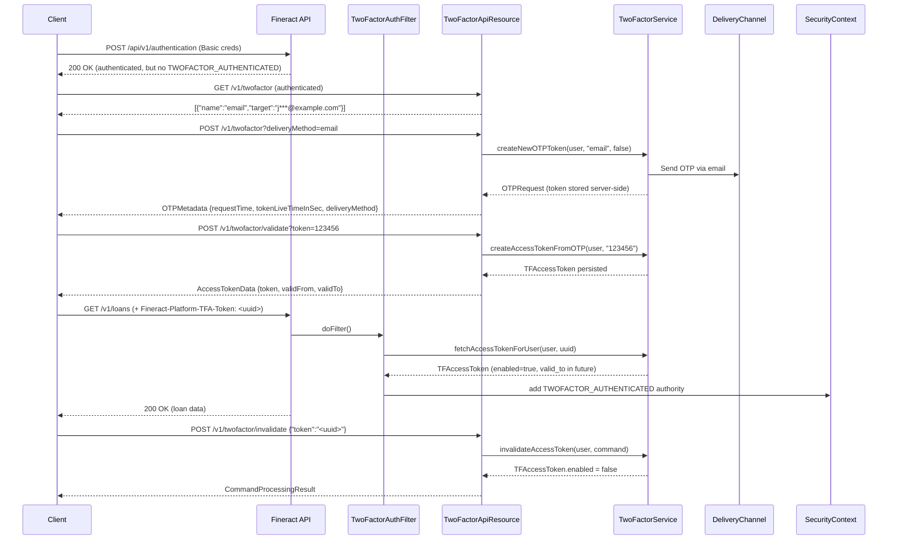

Fineract's two-factor authentication (2FA) subsystem adds an OTP-based second factor on top of normal Basic Auth or OAuth2 Bearer Token authentication. When enabled, a successful primary authentication does **not** grant the `TWOFACTOR_AUTHENTICATED` authority required to call protected endpoints. The client must separately request an OTP, deliver it via email or SMS, and exchange it for a short-lived `TFAccessToken`. Subsequent requests must include this token in the `Fineract-Platform-TFA-Token` HTTP header. The entire subsystem is guarded by `@ConditionalOnProperty("fineract.security.2fa.enabled")` and is therefore inactive at zero cost when disabled.

---

## File Inventory

| File | Package | Purpose |
|------|---------|---------|
| `fineract-security/…/api/TwoFactorApiResource.java` | `org.apache.fineract.infrastructure.security.api` | JAX-RS endpoints for OTP request, validation, and token invalidation |
| `fineract-security/…/api/TwoFactorConfigurationApiResource.java` | `org.apache.fineract.infrastructure.security.api` | JAX-RS endpoints for reading/updating 2FA configuration |
| `fineract-security/…/filter/TwoFactorAuthenticationFilter.java` | `org.apache.fineract.infrastructure.security.filter` | Servlet filter: validates `Fineract-Platform-TFA-Token` header and injects `TWOFACTOR_AUTHENTICATED` authority |
| `fineract-security/…/domain/TFAccessToken.java` | `org.apache.fineract.infrastructure.security.domain` | JPA entity for the `twofactor_access_token` table |
| `fineract-security/…/domain/TFAccessTokenRepository.java` | `org.apache.fineract.infrastructure.security.domain` | Spring Data JPA repository for `TFAccessToken` |
| `fineract-security/…/domain/TwoFactorConfiguration.java` | `org.apache.fineract.infrastructure.security.domain` | JPA entity for per-key 2FA configuration values |
| `fineract-security/…/domain/TwoFactorConfigurationRepository.java` | `org.apache.fineract.infrastructure.security.domain` | Spring Data JPA repository for `TwoFactorConfiguration` |
| `fineract-security/…/domain/OTPRequestRepository.java` | `org.apache.fineract.infrastructure.security.domain` | Spring Data JPA repository for in-flight OTP requests |
| `fineract-security/…/data/OTPRequest.java` | `org.apache.fineract.infrastructure.security.data` | Data object carrying the raw OTP token and its metadata |
| `fineract-security/…/data/OTPMetadata.java` | `org.apache.fineract.infrastructure.security.data` | Metadata about an OTP: request time, TTL, delivery method used |
| `fineract-security/…/data/OTPDeliveryMethod.java` | `org.apache.fineract.infrastructure.security.data` | Name + target for a delivery method (e.g., `sms` / user's phone number) |
| `fineract-security/…/data/AccessTokenData.java` | `org.apache.fineract.infrastructure.security.data` | API response shape for a validated access token |
| `fineract-security/…/constants/TwoFactorConfigurationConstants.java` | `org.apache.fineract.infrastructure.security.constants` | All configuration key constants |
| `fineract-security/…/constants/TwoFactorConstants.java` | `org.apache.fineract.infrastructure.security.constants` | Delivery method names and `BYPASS_TWOFACTOR` permission constant |
| `fineract-security/…/command/InvalidateTFAccessTokenCommandHandler.java` | `org.apache.fineract.infrastructure.security.command` | `@CommandType(entity="TWOFACTOR_ACCESSTOKEN", action="INVALIDATE")` |
| `fineract-security/…/command/UpdateTwoFactorConfigCommandHandler.java` | `org.apache.fineract.infrastructure.security.command` | `@CommandType(entity="TWOFACTOR_CONFIGURATION", action="UPDATE")` |
| `fineract-security/…/service/TwoFactorService.java` | `org.apache.fineract.infrastructure.security.service` | Service interface for OTP/token operations |
| `fineract-provider/…/security/service/TwoFactorServiceImpl.java` | `org.apache.fineract.infrastructure.security.service` | Concrete implementation; handles email and SMS delivery |
| `fineract-security/…/service/TwoFactorConfigurationService.java` | `org.apache.fineract.infrastructure.security.service` | Service interface for reading/writing 2FA config key-value pairs |
| `fineract-provider/…/security/service/TwoFactorConfigurationServiceImpl.java` | `org.apache.fineract.infrastructure.security.service` | Reads from `TwoFactorConfigurationRepository`; caches values |
| `fineract-security/…/service/RandomOTPGenerator.java` | `org.apache.fineract.infrastructure.security.service` | Generates random numeric OTP of configured length |
| `fineract-security/…/service/UUIDAccessTokenGenerationService.java` | `org.apache.fineract.infrastructure.security.service` | Generates 32-char UUID-based access tokens |
| `fineract-security/…/data/TwoFactorConfigurationValidator.java` | `org.apache.fineract.infrastructure.security.data` | Validates PUT `/v1/twofactor/configure` request body |

---

## Configuration Properties

The master switch is in `fineract-provider/src/main/resources/application.properties`:

```properties
fineract.security.2fa.enabled=${FINERACT_SECURITY_2FA_ENABLED:false}
```

All runtime values are stored in the `m_configuration` table (or a dedicated 2FA config table) and are read via `TwoFactorConfigurationService`. Constants are defined in `TwoFactorConfigurationConstants`:

| Constant | Config key string | Type | Description |
|----------|------------------|------|-------------|
| `ENABLE_EMAIL_DELIVERY` | `otp-delivery-email-enable` | Boolean | Whether email OTP delivery is available |
| `EMAIL_SUBJECT` | `otp-delivery-email-subject` | String | Subject template for OTP emails |
| `EMAIL_BODY` | `otp-delivery-email-body` | String | Body template; typically contains `{{token}}` placeholder |
| `ENABLE_SMS_DELIVERY` | `otp-delivery-sms-enable` | Boolean | Whether SMS OTP delivery is available |
| `SMS_PROVIDER_ID` | `otp-delivery-sms-provider` | Number | ID of the SMS gateway provider record |
| `SMS_MESSAGE_TEXT` | `otp-delivery-sms-text` | String | SMS message template |
| `OTP_TOKEN_LIVE_TIME` | `otp-token-live-time` | Number | How long (seconds) the OTP is valid before expiry |
| `OTP_TOKEN_LENGTH` | `otp-token-length` | Number | Number of digits in the OTP |
| `ACCESS_TOKEN_LIVE_TIME` | `access-token-live-time` | Number | Standard `TFAccessToken` TTL in seconds |
| `ACCESS_TOKEN_LIVE_TIME_EXTENDED` | `access-token-live-time-extended` | Number | Extended TTL (when client passes `extendedToken=true`) |

<Info>
All config keys above are also listed in `TwoFactorConfigurationConstants.REQUEST_DATA_PARAMETERS` (an unmodifiable `Set<String>`) which is used for JSON request validation.
</Info>

---

## Key Abstractions

### `OTPDeliveryMethod`
**File:** `fineract-security/src/main/java/org/apache/fineract/infrastructure/security/data/OTPDeliveryMethod.java`

```java
@Data @NoArgsConstructor @Accessors(chain = true)
public class OTPDeliveryMethod {
    private String name;    // "email" or "sms" (TwoFactorConstants.EMAIL_DELIVERY_METHOD_NAME / SMS_DELIVERY_METHOD_NAME)
    private String target;  // masked email address or phone number shown to the client
}
```

`name` values are the string constants `TwoFactorConstants.SMS_DELIVERY_METHOD_NAME = "sms"` and `TwoFactorConstants.EMAIL_DELIVERY_METHOD_NAME = "email"`.

### `OTPMetadata`
**File:** `fineract-security/src/main/java/org/apache/fineract/infrastructure/security/data/OTPMetadata.java`

```java
@Data @NoArgsConstructor @Accessors(chain = true)
public class OTPMetadata {
    private ZonedDateTime requestTime;       // when the OTP was generated
    private int tokenLiveTimeInSec;          // TTL from config key otp-token-live-time
    private boolean extendedAccessToken;     // whether extended TFAccessToken TTL will be used
    private OTPDeliveryMethod deliveryMethod; // which channel was used
}
```

### `OTPRequest`
**File:** `fineract-security/src/main/java/org/apache/fineract/infrastructure/security/data/OTPRequest.java`

Combines the raw `token` string with `OTPMetadata`. The `token` is the actual OTP code (not returned to the client — only `OTPMetadata` is serialized in the API response). `isValid()` checks `requestTime + tokenLiveTimeInSec > now`.

### `TFAccessToken`
**File:** `fineract-security/src/main/java/org/apache/fineract/infrastructure/security/domain/TFAccessToken.java`

JPA entity mapped to `twofactor_access_token` with `@UniqueConstraint(columnNames = {"token", "appuser_id"})`.

| Column | Java field | Type | Notes |
|--------|-----------|------|-------|
| `token` | `String token` | VARCHAR(32) | UUID-based, non-null |
| `appuser_id` | `AppUser user` | FK | `@ManyToOne` to `m_appuser` |
| `valid_from` | `LocalDateTime validFrom` | DATETIME | Tenant-timezone time of creation |
| `valid_to` | `LocalDateTime validTo` | DATETIME | `validFrom + tokenLiveTimeInSec` |
| `enabled` | `boolean enabled` | BIT | Set to `false` on invalidation |

`isValid()`: returns `enabled && !isAfterTenantDateTime(validFrom) && isAfterTenantDateTime(validTo)`.

`toTokenData()` converts to `AccessTokenData` (fields: `token`, `validFrom` as `ZonedDateTime`, `validTo` as `ZonedDateTime`) — the API response shape.

### `TFAccessTokenRepository`
**File:** `fineract-security/src/main/java/org/apache/fineract/infrastructure/security/domain/TFAccessTokenRepository.java`

```java
@ConditionalOnProperty("fineract.security.2fa.enabled")
public interface TFAccessTokenRepository extends JpaRepository<TFAccessToken, Long>, JpaSpecificationExecutor<TFAccessToken> {
    TFAccessToken findByUserAndToken(AppUser user, String token);
}
```

The `findByUserAndToken` query is the primary lookup used by `TwoFactorAuthenticationFilter` to validate incoming tokens.

### `TwoFactorAuthenticationFilter`
**File:** `fineract-security/src/main/java/org/apache/fineract/infrastructure/security/filter/TwoFactorAuthenticationFilter.java`

Extends `GenericFilterBean`. Active in filter chain when `fineract.security.2fa.enabled=true` (wired in both `AuthorizationServerConfig` and `SecurityConfig`).

**Logic:**
1. Reads `authentication` from `SecurityContextHolder`. If null or principal is not `AppUser`, passes through.
2. Checks `user.hasSpecificPermissionTo(TwoFactorConstants.BYPASS_TWO_FACTOR_PERMISSION)` (constant: `"BYPASS_TWOFACTOR"`). If the user has this permission, injects `TWOFACTOR_AUTHENTICATED` and continues.
3. Reads `Fineract-Platform-TFA-Token` request header.
4. If token present: calls `twoFactorService.fetchAccessTokenForUser(user, token)`. If `null` or `!accessToken.isValid()`, responds `401` with `WWW-Authenticate: Basic realm="Fineract Platform API Two Factor"`.
5. If token absent: passes through without adding `TWOFACTOR_AUTHENTICATED` (the endpoint will fail later if it requires that authority).
6. On success: adds `new SimpleGrantedAuthority("TWOFACTOR_AUTHENTICATED")` to `authentication`.

The filter handles both `UsernamePasswordAuthenticationToken` and `FineractJwtAuthenticationToken` when rebuilding the updated authentication object.

---

## REST API Endpoints

### `TwoFactorApiResource`
**File:** `fineract-security/src/main/java/org/apache/fineract/infrastructure/security/api/TwoFactorApiResource.java`
**Base path:** `/v1/twofactor`
**Activation:** `@ConditionalOnProperty("fineract.security.2fa.enabled")`

| Method | Path | Description | Returns |
|--------|------|-------------|---------|
| `GET` | `/v1/twofactor` | List available OTP delivery methods for the authenticated user | `List<OTPDeliveryMethod>` |
| `POST` | `/v1/twofactor?deliveryMethod={name}&extendedToken={bool}` | Request an OTP token; triggers email or SMS delivery | `OTPMetadata` (no raw token) |
| `POST` | `/v1/twofactor/validate?token={otp}` | Exchange a valid OTP for a `TFAccessToken` | `AccessTokenData` |
| `POST` | `/v1/twofactor/invalidate` | Invalidate a specific access token. Body: `{"token":"<uuid>"}` | `CommandProcessingResult` |

<Note>
`GET /v1/twofactor` returns only the delivery methods available for the **current user** — e.g., only `email` if the user has no phone number configured in their staff record, regardless of whether SMS is globally enabled.
</Note>

### `TwoFactorConfigurationApiResource`
**File:** `fineract-security/src/main/java/org/apache/fineract/infrastructure/security/api/TwoFactorConfigurationApiResource.java`
**Base path:** `/v1/twofactor/configure`
**Activation:** `@ConditionalOnProperty("fineract.security.2fa.enabled")`

| Method | Path | Required Permission | Description |
|--------|------|--------------------|-|
| `GET` | `/v1/twofactor/configure` | `READ_TWOFACTOR_CONFIG` | Retrieve all 2FA configuration as a key-value map |
| `PUT` | `/v1/twofactor/configure` | `UPDATE_TWOFACTOR_CONFIG` | Update 2FA configuration keys |

The `PUT` body is a JSON object with any subset of the configuration keys from `TwoFactorConfigurationConstants.REQUEST_DATA_PARAMETERS`. Example:

```json
{
  "otp-delivery-email-enable": true,
  "otp-delivery-email-subject": "Your Fineract OTP",
  "otp-delivery-email-body": "Your one-time password is: {{token}}",
  "otp-token-live-time": 300,
  "otp-token-length": 6,
  "access-token-live-time": 3600,
  "access-token-live-time-extended": 86400
}
```

---

## OTP Delivery Flow

### Email Delivery
**Constant:** `TwoFactorConstants.EMAIL_DELIVERY_METHOD_NAME = "email"`

When `POST /v1/twofactor?deliveryMethod=email` is called, `TwoFactorServiceImpl.createNewOTPToken()`:
1. Calls `getEmailDeliveryMethodForUser(user)` — builds `OTPDeliveryMethod` with `name="email"` and `target=<masked user email>`.
2. Generates token via `RandomOTPGenerator` with length from `TwoFactorConfigurationConstants.OTP_TOKEN_LENGTH`.
3. Calls `emailService.sendToEmail(EmailDetail)` with subject from `otp-delivery-email-subject` and body from `otp-delivery-email-body`.
4. Persists `OTPRequest` via `OTPRequestRepository`.
5. Returns `OTPRequest` with metadata only (raw token is NOT in the response).

### SMS Delivery
**Constant:** `TwoFactorConstants.SMS_DELIVERY_METHOD_NAME = "sms"`

When `POST /v1/twofactor?deliveryMethod=sms` is called:
1. Calls `getSMSDeliveryMethodForUser(user)` — builds `OTPDeliveryMethod` with `name="sms"` and `target=<staff phone number>`.
2. Generates token, creates `SmsMessage` entity, persists via `SmsMessageRepository`.
3. Schedules delivery via `SmsMessageScheduledJobService`.
4. Returns `OTPMetadata`.

---

## Token Expiry and Invalidation Flow

### Token Validation
`TwoFactorApiResource.validate(token)`:
1. Calls `twoFactorService.createAccessTokenFromOTP(user, token)`.
2. `TwoFactorServiceImpl` looks up the pending `OTPRequest` by user and token string.
3. Validates `OTPRequest.isValid()` (checks `requestTime + tokenLiveTimeInSec > now`).
4. If valid: creates `TFAccessToken.create(UUID, user, accessTokenLiveTime)` and persists via `TFAccessTokenRepository`.
5. Returns `TFAccessToken.toTokenData()` → `AccessTokenData(token, validFrom, validTo)`.

### Token Invalidation
`POST /v1/twofactor/invalidate` dispatches through `PortfolioCommandSourceWritePlatformService` to `InvalidateTFAccessTokenCommandHandler`:
- `@CommandType(entity = "TWOFACTOR_ACCESSTOKEN", action = "INVALIDATE")`
- Validates JSON has non-blank `token` field.
- Calls `twoFactorService.invalidateAccessToken(user, command)`.
- The service sets `enabled=false` on the matching `TFAccessToken` record.

`TFAccessToken.isValid()` checks `enabled` first, so invalidated tokens fail immediately even within their `valid_to` window.

### Expiry vs. Invalidation

| Mechanism | How | Result |
|-----------|-----|--------|
| Natural expiry | `valid_to < now` | `isValid()` returns `false`; filter returns 401 |
| Manual invalidation | `enabled=false` | `isValid()` returns `false`; filter returns 401 |
| `BYPASS_TWOFACTOR` permission | No token needed | Filter injects `TWOFACTOR_AUTHENTICATED` without DB lookup |

---

## Command Handlers

### `UpdateTwoFactorConfigCommandHandler`
**File:** `fineract-security/src/main/java/org/apache/fineract/infrastructure/security/command/UpdateTwoFactorConfigCommandHandler.java`
- `@CommandType(entity = "TWOFACTOR_CONFIGURATION", action = "UPDATE")`
- Calls `TwoFactorConfigurationValidator.validateForUpdate(json)` for type/parameter validation.
- Calls `TwoFactorConfigurationService.update(command)` which persists changed key-value pairs.
- Returns `CommandProcessingResult` with `changes` map.

### `InvalidateTFAccessTokenCommandHandler`
**File:** `fineract-security/src/main/java/org/apache/fineract/infrastructure/security/command/InvalidateTFAccessTokenCommandHandler.java`
- `@CommandType(entity = "TWOFACTOR_ACCESSTOKEN", action = "INVALIDATE")`
- Validates JSON: only `token` parameter allowed, must be non-blank.
- Calls `TwoFactorService.invalidateAccessToken(user, command)`.
- Returns `CommandProcessingResult` with `resourceIdAsString = accessToken.getToken()`.

---

## 2FA Login Sequence Diagram



---

## Connections

<CardGroup cols={2}>
  <Card title="AuthorizationServerConfig" icon="shield">
    Wires `TwoFactorAuthenticationFilter` into the OAuth2 filter chain when both `fineract.security.oauth2.enabled` and `fineract.security.2fa.enabled` are true. File: `fineract-provider/…/security/config/AuthorizationServerConfig.java`
  </Card>
  <Card title="SecurityConfig (Basic Auth)" icon="lock">
    Also conditionally adds `TwoFactorAuthenticationFilter` after `CorrelationHeaderFilter`. File: `fineract-provider/…/core/config/SecurityConfig.java`
  </Card>
  <Card title="SMS Infrastructure" icon="message">
    `TwoFactorServiceImpl` depends on `SmsMessageRepository` and `SmsMessageScheduledJobService` from the SMS module. The SMS provider ID must reference a valid record.
  </Card>
  <Card title="Email Infrastructure" icon="envelope">
    Depends on `PlatformEmailService` from core infrastructure. SMTP settings must be configured separately in `application.properties`.
  </Card>
</CardGroup>

---

## Gotchas & Invariants

<Accordion title="Filter pass-through on missing token">
If no `Fineract-Platform-TFA-Token` header is present, `TwoFactorAuthenticationFilter` calls `chain.doFilter()` and **returns early** — it does NOT add `TWOFACTOR_AUTHENTICATED`. This means endpoints protected by `hasAuthority("TWOFACTOR_AUTHENTICATED")` will fail with 403 downstream, not 401 from the filter. Callers should GET `/v1/twofactor` first to discover available methods.
</Accordion>

<Accordion title="OTPRequest vs TFAccessToken lifetime">
`OTPRequest` lives for `otp-token-live-time` seconds (typically 5 minutes). `TFAccessToken` lives for `access-token-live-time` seconds (session-like, typically 1 hour) or `access-token-live-time-extended` when `extendedToken=true`. These are independent. Expiry of the OTP does not affect an already-issued `TFAccessToken`.
</Accordion>

<Accordion title="BYPASS_TWOFACTOR permission">
Defined in `TwoFactorConstants.BYPASS_TWO_FACTOR_PERMISSION = "BYPASS_TWOFACTOR"`. A user with this permission always receives `TWOFACTOR_AUTHENTICATED` without presenting a token. Useful for service accounts or batch jobs that cannot complete an interactive OTP flow.
</Accordion>

<Accordion title="ConditionalOnProperty cascade">
`TFAccessTokenRepository`, `TwoFactorApiResource`, `TwoFactorConfigurationApiResource`, `InvalidateTFAccessTokenCommandHandler`, `UpdateTwoFactorConfigCommandHandler`, and `TwoFactorServiceImpl` all carry `@ConditionalOnProperty("fineract.security.2fa.enabled")`. With the property false (default), none of these beans are instantiated — there is no 2FA-related table access.
</Accordion>

<Accordion title="TFAccessToken uniqueness constraint">
The unique constraint is on `(token, appuser_id)`. A single user can theoretically hold multiple valid access tokens (e.g., from different devices/sessions) as long as the token strings differ. Token generation uses `UUIDAccessTokenGenerationService` which produces 32-char UUIDs — collision probability is negligible.
</Accordion>
